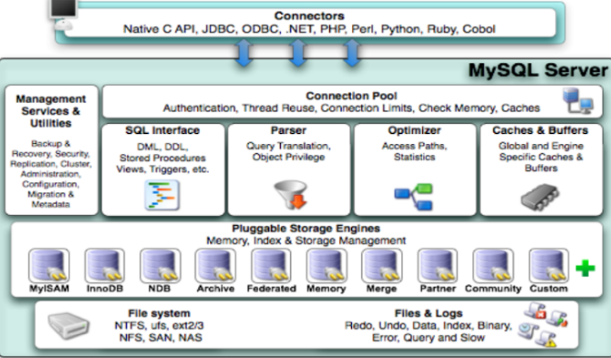
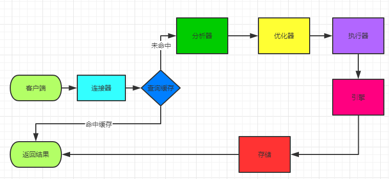

# MySQL

## 基础架构

整个MySQL Server即划分为**连接层**（连接处理和管理、授权认证、及相关的安全方案——TCP连接、身份验证）、**服务层**（完成缓存的查询，SQL的分析（词法分析）和**优化**（确定索引使用与否以及使用什么索引），**部分内置函数的执行**（存储过程和函数等）。）、**引擎层**（负责了MySQL中数据的存储和提取，支持插件式的使用引擎）和**存储层**（将数据存储在文件系统之上，并完成与存储引擎的交互）。

**如图**，细化为连接池组件、管理服务和工具组件、SQL接口组件、查询分析器组件优化器组件、缓冲池组件、存储引擎、文件系统。

因此 **MySQL 查询的过程**如下：

查询缓存即对已执行过的查询sql语句进行存储（对于频繁更新的应用，缓存失效很快）。
query_cache_type 设置成为DEMAND，即不使用缓存。

SQL_CACHE 和 SQL_NO_CACHE 放在 select 语句中来指定查询语句是否用缓存。

## 索引

## 存储引擎

## 存储过程和函数

## 优化