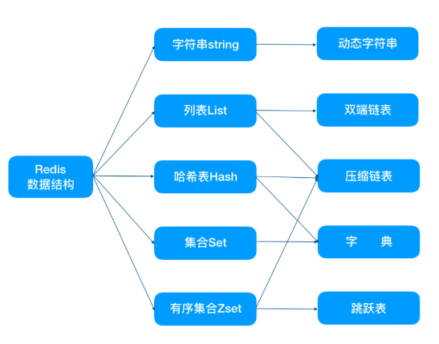

# Redis

Redis 是基于内存的数据库，基于C语言实现，访问内存快于磁盘。每种数据类型具有读取和存储高效的数据结构实现。

## redis基础

### 字符串String ——简单动态字符串（SDS）

1. 字符串长度处理
2. 内存重新分配
3. 二进制安全

### 列表List ——双端链表、压缩链表

### 与 Memcached 对比

## redis缓存问题

## 缓存

### 缓存类型

### 淘汰机制

## redis高级

## 主从同步

## 持久化

## redis 集群