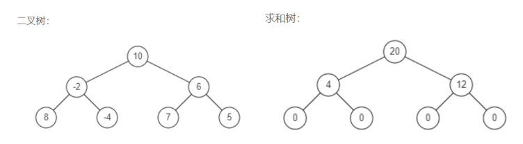

# 数据结构与算法

## 面向对象、面向过程、面向函数？

**面向对象（Object Oriented）**：它将程序看作是一组对象的集合，每个对象都可以接收消息、处理数据并和其他对象交互。在OOP（Object Oriented Programming）中，对象具有状态和行为，并且对象之间可以建立继承和关联关系。OOP通常适用于处理与现实世界有关的问题。

**面向过程（Procedure Oriented）**：它将程序看作是一系列过程或函数的集合，这些过程按照特定的顺序执行，每个过程都可以操作共享的数据。在POP中，函数是可变的，可能会引起副作用，例如修改全局变量。POP（Procedural Oriented Programming）通常适用于处理简单、线性的问题。

**面向函数（Function Oriented）**：即函数式编程。它将程序看作是函数的集合，强调函数的使用和复用，将函数作为程序的基本构建块，通过组合和转换函数实现复杂的计算过程，并且不会对外部状态进行修改。FOP（Functional Oriented Programming）通常适用于处理数学运算、数据转换等问题。

## 数组

### 集合、列表、数组

**集合**：由一个或多个确定的元素所构成的整体。**类型不一定相同、确定、无序、互异**。

**列表（又称线性列表）**：按照一定的线性顺序，排列而成的数据项的集合。**类型不一定相同、有序、不一定互异。包括数组、栈、队列、链表等**。

**数组（Array）**：是一种元素在**内存中连续存储**的线性列表数据结构。**类型相同（静态语言）或类型可不同（动态语言）、有序、不一定互异**。

### 数组基本操作

**读取元素**：通过数组的 **索引（下标）**访问数组中的元素。**随机访问即时间复杂度O(1)**。

#### 为什么数组下标从 0 开始？

因为，下标从 0 开始的计算机寻址公式（$a[i]\_address=base\_address+i*data\_type\_size$）相比下标从 1 开始，a[1]表示数组的首地址的寻址公式（$a[i]\_address=base\_address+(i-1)*data\_type\_size$）访问数组元素少一次减法运算，这对于 CPU 来说，就是少了一次减法指令。

**查找元素**：从索引 0 处开始，逐步向后查询。**时间复杂度 O(n)**;

**插入元素**：
1. **尾部插入**，通过数组的长度计算出即将插入元素的内存地址，然后将该元素插入到尾部。**时间复杂度 O(1)**;
2. **非尾部插入**，将尾部到索引下标之间的元素依次后移，将元素插入索引对应的空出空间。**时间复杂度 O(n)**。
3. JavaScript 超出数组长度范围插入，对超出部分会自动设置为 undefined。

**删除元素**：
1. **尾部删除**，直接删除。**时间复杂度 O(1)**;
2. **非尾部删除**，删除指定索引元素，后续元素依次向前填补，**时间复杂度为 O(n)**;

**更改元素**：通过数组的**索引（下标）赋值更改。时间复杂度 O(1)**;
**二维数组**的本质上仍然是一个一维数组，内部的一维数组仍然从索引 0 开始。m * n 的二维数组寻址公式为：$a[i][j]\_address=base\_address+(i*n+j)*data\_type\_size$，其中第 k 个一维数组的首元素的地址为：$a[k][0]\_address=base\_address+(k*n)*data\_type\_size$。

### 数组的优劣
高效 O(1) 的随机访问，低效 O（n）的查找、插入和删除元素。因此，数组所适合的是读、改操作多，查、删操作少的场景。

### 算法题
   

#### 1. 二维数组的查找

**题目描述**：在一个二维数组中（每个一维数组的长度相同），每一行、列分别按照从左到右、从上到下递增的顺序排序。请完成一个函数，输入这样的一个二维数组和一个整数，判断数组中是否含有该整数。

**分析**：数组的规律是行元素从左到右递增，列元素从上到下递增，比如：
$$ arr = [[1, 7, 13, 19], [3, 9, 15, 21], [5, 11, 17,23]] $$

因此最小值和最大值在左上角和右下角。  假如对于整数 15，可以从左下角开始，向右上角进行遍历（也可以从右上角开始，向左下角进行遍历），如果大于 arr[i][j]，向右走（超过列边界退出，找不到），如果小于 arr[i][j] 向上走（超过行边界退出，找不到）。

**求解**：

<<< ../../src/数组/二维数组中的查找/findNumberIn2DArray.ts#docs

#### 2. 旋转数组的最小数字

**题目描述**：把一个数组最开始的若干个元素搬到数组的末尾，我们称之为数组的旋转。输入一个存在重复元素的升序数组的一个旋转，输出旋转数组的最小元素。

**分析**：旋转数组由前后两段非递减元素组成，比如 **[3, 4, 5, 1, 2]** 是 [1, 2, 3, 4, 5] 的前两个数旋转到数组末尾得到的旋转数组。

首先，**前一段的元素一定大于等于后一段的元素，最小数字一定是第一段非递减元素末尾的下一个，遍历即可**。 

而且使用**二分法**比较中间元素与右侧元素的大小关系，由于 left < right 时只能是mid <= right，说明最小在left。所以可以分成以下情况：
1. left < right , 最小在 left;
2. left >=right：
    1. mid > right, 最小在 [mid + 1, right]；
    2. mid < right, 最小在 [left, mid]；
    3. mid = right，最小在[left+1, right -1]。

<<< ../../src/数组/旋转数组的最小数字/minArray.ts#docs

#### 3. 调整数组顺序使奇数位于偶数前面

**题目描述**：输入一个整数数组，实现一个函数来调整该数组中数字的顺序，使得所有的奇数位于数组的前半部分，所有的偶数位于数组的后半部分（**扩展**：并保证奇数和奇数，偶数和偶数之间的相对位置不变）。

**分析**：目标是奇数在前，偶数在后。

首先，可以使用一个额外数组，遍历两次原始数据，分别将奇偶元素放入其中，如此可以保证奇偶相对位置不变；

其次，可以采用左右指针向中间移动，左指针偶数，右指针奇数，进行交换；否则左指针移动直到遇到偶数，右指针移动直到遇到奇数；不过无法保证奇偶相对位置不变；

最后，可以采用快慢指针法，快指针向前搜索奇数，慢指针搜索偶数位置，不过这样不能保证偶的相对位置；

**求解**：

<<< ../../src/数组/调整数组顺序使奇数位于偶数前面/exchange.ts#docs

#### 4. 数组中出现次数超过一半的数字

**题目描述**：数组中有一个数字出现的次数超过数组长度的一半，请找出这个数字。你可以假设数组是非空的，并且给定的数组总是存在多数元素，如果不存在，返回 NaN。

**分析**：

**排序计数**，首先对数组进行排序，遍历记录是否存在超过一半的数字，遇到不同的数字重置出现次数即可。

**哈希计数**，使用哈希表记录所有数字出现的次数，当遇到超过一半的数字返回即可。

**摩尔投票**，众数记为 +1，把其他数记为 -1，将它们全部加起来，如果最终的和大于 0，说明存在多数，否则不存在。[1,2,3,2,2,2,5,4,2] 遇到不一样的数字，对投票计数器进行 - 1，直到 count 为 0 刚好剔除，重新开始投票，不改变多数性质，比如遍历到 3 的时候 count 为 0，相当于剔除了 1,2, 从 [3,2,2,2,5,4,2] 重新开始。

**求解**：

<<< ../../src/数组/数组中出现次数超过一半的数字/majorityElement.ts#docs

#### 5. 连续子数组的最大和

**题目描述**：输入一个整型数组，数组中的一个或连续多个整数组成一个子数组。求所有子数组的和的最大值。要求时间复杂度为 O(n)。

**分析**：

**暴力法**，直接遍历两遍进行计算，记录所有连续子数组的和来更新最大值。

**动态规划（剔除）法**，遍历一遍数组，计算到当前数字的子数组的和，如果比当前数字小，说明之前的连续子数组的和为负数，可将其剔除掉，此时记录和为当前数字。

**求解**： 

<<< ../../src/数组/连续子数组的最大和/maxSubArray.ts#docs

#### 6. 把数组排成最小的数

**题目描述**：输入一个非负整数数组，把数组里所有数字拼接起来排成一个数，打印能拼接出的所有数字中最小的一个。

**分析**：

**排序法**，因为对于任意两个数 x 与 y，对于拼接，若 xy > yx，说明 y 应该在 x 前面，反之 y 应该在 x 前面；而且若 xy < yx 且 yz < zy 且 xz < zx, 则 xyz 最小: 因为 xyz < yxz < yzx < zyx,  xyz < xzy < zxy < zyx; 因此，对[ x, y, z] 进行排序，保证 xy < yx 且 yz < zy 且 xz < zx 即可。

**求解**：

<<< ../../src/数组/把数组排成最小的数/minNumber.ts#docs

#### 7. 数组的逆序对

**题目描述**：在数组中的两个数字，如果前面一个数字大于后面的数字，则这两个数字组成一个逆序对。输入一个数组，求出这个数组中的逆序对的总数

**分析**：

**暴力法**，遍历数组元素，与其后的所有元素对比，满足逆序条件统计（超时）。

**归并排序法**，使用归并排序，在排序过程中，当左子序列的当前元素大于右边子序列当前元素时，此时左子序列当前元素及其后均为逆序对。

**求解**：

<<< ../../src/数组/数组中的逆序对/reversePairs.ts#docs

#### 8. 数字在排序数组的出现次数
**题目描述**：统计一个数字在排序数组中出现的次数。

**分析**：

**indexOf + lastIndexOf**，找到排序数组中出现该数字的首尾下标，计算即可，需要使用indexOf 判断是否存在该数字。

**遍历计数**，通过一次遍历设置一个标志flag，初始为 false，当和目标值相等置为true，再次不等于目标值时，即可跳出循环。

**正则法**，使用join函数以#分割转换为字符串，在末尾新增一个 #，正则match匹配 ’目标数字#’的结果数组的长度即可。

**二分法**，首先找到目标数字，然后向两边进行搜索即可。

**求解**：

<<< ../../src/数组/数字在排序数组中出现次数/search.ts#docs

#### 9. 数组中只出现一次的两个数字（其余出现均两次）

**题目描述**：一个整型数组 nums 里除两个数字之外，其他数字都出现了两次。请写程序找出这两个只出现一次的数字。要求时间复杂度是O(n)，空间复杂度是O(1)。

**分析**：

**哈希计数**，首遍遍历在哈希表中统计所有数字的出现次数，二次遍历找到哈希表中只出现一次的两个数字即可。

**indexOf + lastIndexOf**，遍历数组的元素，找到首次和最后一次出现下标相同的元素即可。

**异或运算**，相同数组的异或结果为0，而任意数字和0的异或结果为本身，因此遍历数组计算所有元素的异或结果即为不同的两个元素的异或结果，该异或结果中为1的位可以用来区分这两个不同的数字。将异或结果与 1 依次进行按位与运算，找到任意位为 1 的 divider。再次遍历数组元素，利用divider 和每个元素与运算来进行分组异或得到最终结果。

**求解**：

<<< ../../src/数组/唯一只出现一次的数字（其余均2次）/singleNumber.ts#docs

#### 10. 数组中重复的数字

**题目描述**：在一个长度为 n 的数组 nums 里的所有数字都在 0～n-1 的范围内。数组中某些数字是重复的，但不知道有几个数字重复了，也不知道每个数字重复了几次。请找出数组中任意一个重复的数字。

**分析**：

**哈希计数**，统计元素出现次数，在统计的过程中，如果哈希表中已经存在该元素则说明重复。

**indexOf + lastIndexOf**，遍历数组，找到首次出现和最后一次出现不同的元素。

**数组原地交换**，数字范围在 0～n-1，且数组长度为 n, 说明不重复的数字均可以在等于下标的位置上，遍历数组将不等于下标的元素a与以该元素值a作为下标的元素值b进行对比，若相等，说明该元素值a重复，否则交换两个元素值再寻找以b为下标的元素值c进行对比，直到原a位置的元素等于下标。

**集合**，遍历数组将集合中没有的元素放入集合中，若集合中已经存在该元素，说明重复。

**求解**：

<<< ../../src/数组/数组中重复的数字/findRepeatNumber.ts#docs

#### 11. 构建乘积数组

**题目描述**：给定一个数组 A[0,1,…,n-1]，请构建一个数组 B[0,1,…,n-1]，其中 B[i] 的值是数组 A 中除了下标 i 以外的元素的积, 即 B[i]=A[0]×A[1]×…×A[i-1]×A[i+1]×…×A[n-1]。不能使用除法。

**分析**：

**暴力法**，直接两层循环遍历，内层循环计算累乘并排除当前元素（超时）。

**两次遍历（前 -> 后 + 后 -> 前）法**，先遍历从前往后一次数组，计算当前元素之前的累乘放到目标数组对应位置；再从后往前遍历数组用一个变量存储计算当前元素之后的累乘，并将其与目标数组对应位置相乘即可。

**求解**：

<<< ../../src/数组/构建乘积数组/constructArr.ts#docs

#### 12. 顺时针打印矩阵

**题目描述**：输入一个矩阵，按照从外向里以顺时针的顺序依次打印出每一个数字。

**分析**：

**分层遍历**，每层按从左到右，从上到下，从右到左，从下到上进行遍历打印。从 0 层开始，每打印完一层行和列均减去 2，因此层数 * 2 应该同时小于行数与列数，注意打印到最后一层，如果只剩下一行，则不需要从右到左，同理，只剩下一列，则不需要从下到上。

**移除首行 + 变相转置（向左翻转）**，先将矩阵的第一行打印，对剩下的矩阵进行向左翻转（变相转置），依次打印翻转后的第一行，直到矩阵为空。

**求解**：

<<< ../../src/数组/顺时针打印矩阵/spiralOrder.ts#docs

#### 13. 最小的 K 个数

**题目描述**：输入整数数组 arr ，找出其中最小的 k 个数。例如，输入 4、5、1、6、2、7、3、8 这 8 个数字，则最小的 4 个数字是 1、2、3、4。

**分析**：

**排序法**，排序后取前 k 个。

**分区法**，以 k 为界限，遍历后半部分元素，若当前元素大于前 k 个元素中的最大值 max ，当前元素替换掉最大值 max。

**大根堆法**，维护一个 k 个大小的大根堆，现将前 k 个元素入堆，然后遍历其余元素，若当前元素小于堆顶，就将堆顶元素弹出，当前元素入堆即可（堆的实现参考 1.8.2 设计堆）。

**求解**：
::: code-group

<<< ../../src/数组/最小的K个数/getLeastNumbers.ts#docs[getLeastNumbers.ts]

<<< ../../src/堆/堆的设计与实现/heap.ts#docs[heap.ts]

:::

#### 14. 和为 S 的两个数字

**题目描述**：输入一个递增排序的数组和一个数字s，在数组中查找两个数，使得它们的和正好是s。如果有多对数字的和等于s，则输出任意一对即可。

**分析**：

**哈希法（set，对象，map）**，一次遍历数组，哈希中若不存在目标值与当前元素的差值，则将其加入哈希，否则返回即可。

**双指针法**，由于数组递增有序，可使用首尾指针向中间移动，如果相等则返回，否则分情况向中间移动指针——小于目标值移动首指针，否则移动右指针。

**二分查找**，遍历元素，计算目标值与当前元素的差值，在该元素右侧二分查找是否存在即可。假如使用 indexOf （顺序遍历）进行查找会超时。

**求解**：

<<< ../../src/数组/和为S的两个数字/twoSum.ts#docs

#### 15. 扑克牌中的顺子

**题目描述**：从若干副扑克牌中随机抽 5 张牌，判断是不是一个顺子，即这 5 张牌是不是连续的。2～10 为数字本身，A 为 1，J 为 11，Q 为 12，K 为 13，而大、小王为 0 ，可以看成任意数字。A 不能视为 14。

**分析**：需要保证 除 0 以外的最大值与最小值差值需要小于 5 且不能有非 0 以外的重复元素。

**Set +遍历**，遍历数组，遇到 0 跳过，若 Set 中存在元素，不是顺子，否则加入集合中，求集合中的最大值最小值之差。

**排序 + 遍历**，排序后遍历数组，统计大小王的个数即0的个数，计算最大值（最后一个元素）与最小值（第一个非 0 元素）之差。

**遍历**，遍历统计 0 的个数，超过3个0 说明一定是顺子，若当前元素不是0，更新最大最小值，若最大值与最小值差值大于等于 5 或者后续元素存在重复与当前元素相同，则不是顺子。 

**求解**：

<<< ../../src/数组/扑克牌的顺子/isStraight.ts#docs

#### 16. 滑动窗口的最大值

**题目描述**：给定一个数组 nums 和滑动窗口的大小 k，请找出所有滑动窗口里的最大值。

**分析**：

**遍历**，依次遍历每个滑动窗口，其中最后一个窗口的起始下标为 len - k，使用 Math.max 计算每个窗口的最大值即可（可能超时）。

**单调递减双端队列**，维护一个初始为空的单调递减队列，其值为滑动窗口中元素的下标；首先，如果队头下标在滑动窗口之外，则对头出队；否则将当前元素与队尾元素不断比较大小，若当前元素更大，则队尾出队，而后再将当前元素下标加入队列。最后当遍历到 k - 1 时，开始获取队头元素作为当前滑动窗口的最大值。

**求解**：

<<< ../../src/数组/滑动窗口的最大值/maxSlidingWindow.ts#docs

## 字符串

字符串是由零个或多个字符组成的有限序列。用成对双引号或成对单引号的形式存在。

### 字符串基本操作

与数组类似，通过下标访问其中字符。

字符串可能是可变（C++），也可能是不可变的（python，JavaScript），不可变意味着初始化后不能修改其中字符。对于不可变的字符串，连接操作意味着首先为新字符串分配足够的空间，复制旧字符串中的内容并附加到新字符串，时间复杂度为 O(N)。

### 算法题

#### 1. 字符串的排列

**题目描述**：输入一个字符串，打印出该字符串中字符的所有排列。你可以以任意顺序返回这个字符串数组，但里面不能有重复元素。

**分析**：

如输入字符串abc,则打印出由字符a,b,c所能排列出来的所有字符串[abc, acb, bac, bca, cab, cba]。实现思路是原问题划分为小的子问题，即遍历每个字母，该字母依次连接除该字母的子字符串的排列结果，比如：‘a’ +  [‘ bc’,  ‘cb’]。
子字符串只有一个字母的时候直接返回当前字母[str]。

**求解**：

<<< ../../src/字符串/字符串的排列/permutation.ts#docs

#### 2. 字符串的空格替换

**题目描述**：实现一个 replaceSpace 函数，替换给定字符串中的空格为“%20”。例如，当字符串为’We Are Happy’.则经过替换之后的字符串为’We%20Are%20Happy’。

**分析**：对于一个字符串，空格可能出现在开头，末尾，或者不含空格的子串之间，最直观的方法是遍历字符串，遇到空格即替换，由于字符串在 JavaScript 中属于不可变，需使用新字符串进行连接操作。

**正则表达式方法**：str.replace(pattern, replaceStr)。

**数组 map 方法**：
1. 原字符串变成数组  
2. map数组替换空格  
3. 替换后数组变成字符串。

**双指针算法**：
1. 遍历原字符串计算出替换后的字符串长度，并生成该长度数组 newStrArr；
2. 两个指针：i 指向原字符串， j 指向新字符串；
3. str[i] 非空格即将 str[i++] 放入 newStrArr[j++]; str[i] 是空格，将’%20’三个字符依次放入 newStrArr[j++]；
4. 数组变成字符串 newStrArr.join('')。从过程看，方法和**数组 map** 类似。

**求解**：

<<< ../../src/字符串/替换空格/replaceSpace.ts#docs

#### 3. 第一个只出现一次的字符

**题目描述**：在字符串 s 中找出第一个只出现一次的字符。如果没有，返回一个单空格。 s 只包含小写字母。

**分析**：

**哈希计数**，首先遍历一遍字符串，若哈希中存在该字符则设置为false，说明重复，否则设置为true。然后可以二次遍历字符，若哈希值为true即可，或者map会记住插入顺序，遍历map找到值为true的即可。

**indexOf + lastIndexOf**，遍历字符串，当前字符首次出现和最后一次出现的位置相同的即为第一个只出现一次的字符。

**求解**：

<<< ../../src/字符串/第一个只出现一次的字符/firstUniqChar.ts#docs

#### 4. 左旋字符串

**题目描述**：字符串的左旋转操作是把字符串前面的若干个字符转移到字符串的尾部。请定义一个函数实现字符串左旋转操作的功能。比如，输入字符串"abcdefg"和数字 2，该函数将返回左旋转两位得到的结果"cdefgab"。

**分析**：

**拼接法**，将 [n,] 与 [0, n - 1] 的字符串拼接起来即可，n 超出 字符串长度 即 [0, n - 1]。

**求解**：

<<< ../../src/字符串/左旋字符串/reverseLeftWords.ts#docs

#### 5. 翻转单词顺序

**题目描述**：输入一个英文句子，翻转句子中单词的顺序，但单词内字符的顺序不变。为简单起见，标点符号和普通字母一样处理。例如输入字符串"I am a student. "，则输出"student. a am I"。 输入字符串可以在前面或者后面包含多余的空格，但是反转后的字符不能包括。如果两个单词间有多余的空格，将反转后单词间的空格减少到只含一个。

**分析**：

**trim + split + reverse + join**，trim 去掉首尾空格，用单个或多个空格进行split划分为单词数组，随后进行 reverse 翻转，最后使用 join以空格拼接, 其中 reverse 如果自己实现，可以使用双指针首尾交换。而 join, split，trim 都是遍历即可。

**遍历法**，首先去掉首尾空格再遍历字符串，若当前字符是空格说明单词边界，更新反转字符串，遍历结束后再更新一次反转字符串即可。

**求解**：

<<< ../../src/字符串/翻转单词顺序/reversWords.ts#docs

#### 6. 把字符串转换成数字

**题目描述**：写一个函数 StrToInt，实现把字符串转换成整数这个功能。不能使用 atoi 或者其他类似的库函数。 首先，该函数会根据需要丢弃无用的开头空格字符，直到寻找到第一个非空格的字符为止。当我们寻找到的第一个非空字符为正或者负号时，则将该符号与之后面尽可能多的连续数字组合起来，作为该整数的正负号；假如第一个非空字符是数字，则直接将其与之后连续的数字字符组合起来，形成整数。该字符串除了有效的整数部分之后也可能会存在多余的字符，这些字符可以被忽略，它们对于函数不应该造成影响。注意：假如该字符串中的第一个非空格字符不是一个有效整数字符、字符串为空或字符串仅包含空白字符时，则你的函数不需要进行转换。在任何情况下，若函数不能进行有效的转换时，请返回 0。说明：假设我们的环境只能存储 32 位大小的有符号整数，那么其数值范围为 [−2^31,  2^31 − 1]。如果数值超过这个范围，请返回  INT_MAX (231 − 1) 或 INT_MIN (−231) 。

**分析**：

**遍历法**，首先取代首尾空格，以第一个不为空的字符是否为 + 、 - 确定符号，遍历余下字符串，若遇到非数字跳出循环，否则累计计算数字值，当大于 Math.pow(2, 31) - 1 时返回边界值即可。

**求解**：

<<< ../../src/字符串/把字符串转换成整数/strToInt.ts#docs

#### 7. 正则表达匹配

**题目描述**：请实现一个函数用来匹配包含'. '和'\*'的正则表达式。模式中的字符'.'表示任意一个字符，而'\*'表示它前面的字符可以出现任意次（含0次）。在本题中，匹配是指字符串的所有字符匹配整个模式。例如，字符串"aaa"与模式"a.a"和"ab\*ac\*a"匹配，但与"aa.a"和"ab*a"均不匹配。

**分析**：

**正则**，由于匹配是指字符串的所有字符匹配整个模式，所以正则表达式应该将模式串使用 ^ $来限制即可。

**递归**， 
1. 若模式字符串为空，是否匹配取决于原字符串是否为空；
2. 若模式字符串前两个为 字符 x + *，有以下几种情况：
    1. 匹配字符x 0 次，则是否匹配由 * 后面的子模式决定；
    2. 匹配字符x 多次，则由模式字符串中首个字符与字符串中的首个字符是否匹配（即该模式字符为 . 或者两字符相等）且 字符串除首个字符以外的后续字串与模式字符串是否匹配决定；
3. 模式字符串前两个不是字符 x + * 时，由模式字符串中首个字符与字符串中的首个字符是否匹配（即该模式字符为 . 或者两字符相等）且字符串除首个字符以外的后续字串与模式字符串除首个字符以外的模式是否匹配决定；

**求解**：

<<< ../../src/字符串/正则表达式匹配/isMatch.ts#docs

#### 8. 表示数值的字符串

**题目描述**：请实现一个函数用来判断字符串是否表示数值（包括整数和小数）。 数值（按顺序）可以分成以下几个部分：若干空格 + 一个小数或者整数 + （可选）一个'e'或'E'，后面跟着一个整数 + 若干空格。其中，小数（按顺序）可以分成以下几个部分：（可选）一个符号字符（'+' 或 '-'） + 至少一位数字，后面跟着一个点 '.' 或者 至少一位数字，后面跟着一个点 '.' ，后面再跟着至少一位数字 或者 一个点 '.' ，后面跟着至少一位数字
。整数（按顺序）可以分成以下几个部分：（可选）一个符号字符（'+' 或 '-'）+ 至少一位数字。部分数值列举如下：["+100", "5e2", "-123", "3.1416", "-1E-16", "0123"]。部分非数值列举如下：["12e", "1a3.14", "1.2.3", "+-5", "12e+5.4"]。

**分析**：

**trim + Number + isNaN**, 去掉首位空格，若字符串为空，或者是一些无穷大数值字符串，则不是数值，否则用isNaN判断是否为数值。

**正则**，使用正则表达式判断是否为数值：一个或多个空格开头，（+ | -），数字（.一个或多个数字）| .数字，(e | E (+ | -) 数字)，一个或多个空格结尾。

**遍历**，去掉首位空格，分为以下几种情况，若当前字符为 e | E，则前面不能有 e | E，而且之前的必须满足是小数或者整数，小数点前面不能有 e | E 或 小数点，符号只能出现在首位和 e 后面的首位置。

**求解**：

<<< ../../src/字符串/表示数值的字符串/isNumber.ts#docs

#### 9. 字符串中重复次数最多的字符

**题目描述**：输入一个字符串，打印出该字符串中出现次数最多的字符和次数。

**分析**：

**哈希计数**，首先遍历字符串，统计所有字符的出现次数，然后再遍历哈希，将其中等于最大出现次数的字符放入结果数组中。

**求解**：

<<< ../../src/字符串/字符串中重复次数最多的字符/mostRepeatedChar.ts#docs

#### 10. Hex颜色值转 rgb

**题目描述**：hex 颜色值时一个以#开头，后面跟着 6 位或 3 位 16 进制数字的字符串。写一个函数将 hex 颜色值转换为 rgb() 形式的颜色值。 给的字符串不合法，则返回原始字符串。

**分析**：首先使用正则判断是否时一个 hex 颜色值，如果不是直接返回，否则使用 parseInt(str, radix = 16)计算 # 后面值存放在数组中，根据数组长度是 3 或 6 计算 rgb 值即可。

**求解**：

<<< ../../src/字符串/16进制颜色转rgb/hex2rgb.ts#docs

#### 11. 无重复字符的最长子串

**题目描述**：给定一个字符串 s ，请你找出其中不含有重复字符的最长子串的长度。

**分析**：

**滑动窗口法**，遍历字符串，判断当前字符是否在子串中，如果不在，将当前字符添加到子串末尾； 如果存在，将子串更新为存在所在位置后面的加上当前字符；更新最长子串值。

**求解**：

<<< ../../src/字符串/无重复字符的最长子串/lengthOfLongestSubstring.ts#docs

#### 11. 千分位分隔数字

**题目描述**：给定一个浮点数，使用指定分隔符对其进行千分位分隔。

**分析**：

**字符串截取拼接法**，首先考虑数字的有效性，其次是将数字转化为字符串，获取使用变量存储符号，以及使用结果变量存储小数部分，更新字符串为无符号的整数部分。每三位循环截取添加分隔符，循环退出后将三个部分（符号、剩余不大于 3 的部分、循环结果）拼接即可。

**正则表达式法**，使用前瞻断言?=，正则表达式为 `(?=\B(\\d{${every}})+$)`，表示在后面是"非单词边界的 every 个数字结尾出现一次或多次"匹配空字符，然后利用 string.prototype.replace 将匹配到的空字符替换为分隔符即可。

**求解**：

<<< ../../src/字符串/千分位分隔数字/splitNum.ts#docs

## 链表

链表是线性数据结构（数据元素之间存在着“一对一”关系），链表中的每个元素是一个包含数据 data 和引用字段的对象，引用字段只有 next 为单向链表，同时有 prev 和 next 为双向链表。

### 链表基本操作

**链表读取第 i 个节点或查找指定值的节点**，均需要从头遍历，时间复杂度为 O(n)。

**在不考虑查找节点的过程的情况下，更新（替换 data），插入（新节点 next 指针指向插入位置节点，前一节点的 next 指针指向新节点）、删除（前一节点 next 指针指向下一节点，当前节点置空）**，时间复杂度均为 O(1)。

### 设计链表

设计单向链表的实现。单链表中的节点应该具有两个属性：val 和 next。val 是当前节点的值，next 是指向下一个节点的指针/引用。假设链表中的所有节点都是 0 ~ size - 1 的。

::: code-group

<<< ../../src/链表/设计链表/linkList.ts#docs[linkList.ts]

<<< ../../src/链表/设计链表/linkNode.ts#docs[linkNode.ts]

:::

### 算法题

#### 1. 从尾到头打印链表

**题目描述**：输入一个链表的头节点，从尾到头反过来返回每个节点的值（用数组返回）。

**分析**：

**遍历 + 反转**，从尾到头将链表节点值打印成数组 array，比如 1 -> 2 -> 3 -> 4 -> 5 -> null 打印为 [5, 4, 3, 2, 1]，遍历节点并将节点值依次放入数组中，直到遍历完成，最后反转数组即可。也可以利用栈后进先出的特点，将节点从头到尾一次入栈，然后再依次出栈即可。

**求解**：

::: code-group

<<< ../../src/链表/从尾到头打印链表/reversePrint.ts#docs[reversePrint.ts]

<<< ../../src/链表/设计链表/linkNode.ts#docs[linkNode.ts]

:::

#### 2. 链表倒数第 k 个节点

**题目描述**：输入一个链表，输出该链表中倒数第 k 个节点。为了符合大多数人的习惯，本题从 1 开始计数，即链表的尾节点是倒数第 1 个节点。
例如，一个链表有 6 个节点，从头节点开始，它们的值依次是 1、2、3、4、5、6。这个链表的倒数第 3 个节点是值为 4 的节点。

**分析**：

**两次循环法**，倒数第 k 个节点，即顺数第 length - k + 1 个节点，由于是单链表，没有链表长度信息，因此第一步遍历链表，计算出链表长度。第二步，遍历链表到第 length - k + 1 个节点（index = length - k），需要遍历 n + n - k + 1 步。

**快慢指针法**，快指针先走 k 步，然后快慢指针以相同的速度移动，直到快指针到 null，只需要遍历 n 步（因为快指针走了 n 步）。

**求解**：

::: code-group

<<< ../../src/链表/链表中倒数第k个节点/getKthFromEnd.ts#docs[getKthFromEnd.ts]

<<< ../../src/链表/设计链表/linkNode.ts#docs[linkNode.ts]

:::

#### 3. 反转链表

**题目描述**： 定义一个函数，输入一个链表的头节点，反转该链表并输出反转后链表的头节点。

**分析**：

**原地反转**，定义前驱节点，当前节点，遍历链表，然后缓存后驱节点，将当前节点链接到前驱节 3 点，然后先更新前驱节点为当前节点，再更新当前节点为后驱节点，直到遍历结束返回前驱节点即可。

**递归**，假设链表的其余部分已经被反转，现在是要反转前面的部分，则需要将当前节点的下一节点的next指针指向当前节点，然后将当前节点的next 置为null;

**求解**：

::: code-group

<<< ../../src/链表/反转链表/reverseList.ts#docs[reverseList.ts]

<<< ../../src/链表/设计链表/linkNode.ts#docs[linkNode.ts]

:::

#### 4. 合并两个排序链表

**题目描述**：输入两个递增排序的链表，合并这两个链表并使新链表中的节点仍然是递增排序的。

**分析**：

**递归法**，对比节点值的大小，小的作为头节点，下一个节点是除去小的节点的链表和另一链表的合并，边界条件是其中一个链表为空，则直接返回另一个链表即可。

**迭代法**，首先，若其中一个链表为空，则直接返回另一个链表即可，否则初始化一个虚假的头结点，当前节点初始化为虚假节点，不断对比节点值大小，将小节点连接在新链表后面，然后更新新链表的尾节点。直到其中一个链表遍历结束，将另一个链表直接链接在末尾。

**求解**：

::: code-group

<<< ../../src/链表/合并两个排序的链表/mergeTwoLists.ts#docs[mergeTwoLists.ts]

<<< ../../src/链表/设计链表/linkNode.ts#docs[linkNode.ts]

:::

#### 5. 复杂链表的复制

**题目描述**：输入一个复杂链表（每个节点中有节点值，以及两个指针，一个指向下一个节点，另一个特殊指针 random 指向一个随机节点），请对此链表进行深拷贝，并返回拷贝后的头结点。（注意，输出结果中请不要返回参数中的节点引用，否则判题程序会直接返回空）。

**分析**：

**三次遍历+拆分**，首先对复杂链表进行遍历，在每个节点后面复制一个与当前节点相同的节点（先不理会 random 指针），即 1 -> 2 -> 3 -> 4 -> 5 -> null 变成 1 -> 1 -> 2 -> 2 -> 3 -> 3 -> 4 -> 4 -> 5 -> 5 -> null；然后是再遍历一次原链表（即遍历步长为 2），将 random 指针进行复制；最后再遍历一次，将原链表的节点指向原来的下一个节点，复制链表的节点指向下一个复制的节点，分离成原链表和复制链表，注意判断最后一个复制节点是否为 null。

**两次遍历+哈希**，可以在初次遍历的时候用哈希保存原节点到复制节点（只复制值）的映射，二次遍历时更新复制节点的 next 和 random 指针为与原节点 next 和 random 指针对应的复制节点即可。

**求解**：

::: code-group

<<< ../../src/链表/复杂链表的复制/copyRandomList.ts#docs[copyRandomList.ts]

<<< ../../src/链表/设计链表/randomLinkNode.ts#docs[randomLinkNode.ts]

:::

#### 6. 删除链表中的重复节点

**题目描述**：在一个排序的链表中，存在重复的结点，请删除该链表中重复的结点，分为重复结点保留（链表 1->2->3->3->4->4->5 处理后为 1->2->3->4->5）和重复的结点不保留（链表 1->2->3->3->4->4->5 处理后为 1->2->5）两种情况，返回链表头指针。

**分析**：

**对于重复节点保留的情况**，从头节点开始遍历，判断当前节点下一个节点是否等于当前节点，如果相等，则当前节点的下一节点为下下节点，直到不等于或者当前节点下一节点为空。

**对于重复节点不保留的情况**，考虑到头节点可能重复，在链表前添加一个虚节点，从该节点开始遍历，当 next 节点和 next.next 节点不为空时，若 next 节点和 next.next 节点的值相等，记录该值，不断将当前节点的 next 指向为 next.next节点，直到 next 节点值不等于该值或 next 为空。

**求解**：

::: code-group

<<< ../../src/链表/删除链表中重复的结点/deleteDuplication.ts#docs[copyRandomList.ts]

<<< ../../src/链表/设计链表/linkNode.ts#docs[linkNode.ts]

:::

#### 7. 两个链表的第一个公共节点

**题目描述**：输入两个链表，找出它们的第一个公共结点。

**分析**：

**遍历法**，两个链表的公共节点是指从公共节点开始的所有节点是两个链表的共有部分（节点的存储地址相同，因此判断节点对象是否相等）。既然公共节点及其之后的节点完全相同，即不同的是公共节点之前的部分，也就可能存在一个长度差 diff，通过遍历两个链表的长度可以求出 diff，让长的链表先遍历 diff 个节点，以此开始的两个链表的长度相同，那么当遍历到相同节点即第一个公共节点。

**求解**：

::: code-group

<<< ../../src/链表/两个链表的第一个公共节点/findFirstCommonNode.ts#docs[findFirstCommonNode.ts]

<<< ../../src/链表/设计链表/linkNode.ts#docs[linkNode.ts]

:::

#### 8. 链表中环的入口节点

**题目描述**：给定一个链表，返回链表开始入环的第一个节点。 从链表的头节点开始沿着 next 指针进入环的第一个节点为环的入口节点。如果链表无环，则返回 null。为了表示给定链表中的环，我们使用整数 pos 来表示链表尾连接到链表中的位置（索引从 0 开始）。 如果 pos 是 -1，则在该链表中没有环。注意，pos 仅仅是用于标识环的情况，并不会作为参数传递到函数中。说明：不允许修改给定的链表。

**分析**：

**哈希法**，遍历链表，将节点不存在 map 中，放入 map 中，若已存在说明是环的入口节点，返回该节点，若遍历到链表末尾 null 若还无环，返回 null。

**快慢指针法**，遍历链表，快指针走两步，慢指针每次走一步，快慢指针必定在环内相遇，此时快指针走过 a + n(b + c) + b = a + (n+1)b + nc， 而慢指针走过的路程 a + b (因为一定还没走完环的第一圈)，两者满足 a + (n+1)b + nc = 2(a + b)， 所以 a = c + (n − 1)(b + c)，即链表头结点到环入口节点的距离 = 相遇点到环入口距离 + （n - 1）* 环，只需要让两新指针分别从头结点和相遇节点单步出发，直到相遇即可。

**求解**：

::: code-group

<<< ../../src/链表/链表中环的入口节点/detectCycle.ts#docs[detectCycle.ts]

<<< ../../src/链表/设计链表/linkNode.ts#docs[linkNode.ts]

:::

## 栈

栈是一种后入先出（LIFO）的线性逻辑存储结构。只允许在栈顶进行进出操作。

### 栈基本操作

基本操作包括：入栈（push）/出栈（pop）/获取栈顶元素（peek）。

栈的实现主要有两种： 
1. 数组实现，即顺序栈；
2. 链表实现，即链式栈。

无论是以数组还是以链表实现，入栈、出栈的时间复杂度都是O(1)。

栈的应用比如函数执行/括号匹配/表达式计算/浏览器前进后退。

### 设计栈

#### 1. 数组实现栈

<<< ../../src/栈/设计实现栈/arrayStack.ts#docs[arrayStack.ts]

#### 2. 链表实现栈

::: code-group

<<< ../../src/栈/设计实现栈/linkStack.ts#docs[linkStack.ts]

<<< ../../src/链表/设计链表/linkNode.ts#docs[linkNode.ts]

:::

### 算法题

#### 1. 包含 min 函数的栈

**题目描述**：定义栈的数据结构，请在该类型中实现一个能够得到栈的最小元素的 min 函数在该栈中，调用 min、push 及 pop 的时间复杂度都是 O(1)。

**分析**：

**数据栈+最小栈法**，利用一个最小栈存放当前数据栈的最小元素，保持两个栈的长度相同。从首个元素入数据栈开始，每个元素均入数据栈。同时，判断当前元素与最小栈栈顶元素的大小，将小的元素入最小栈即可。

**求解**：

<<< ../../src/栈/包含min函数的栈/minStack.ts#docs[minStack.ts]

#### 2. 栈的压入、弹出序列

**题目描述**：输入两个整数序列，第一个序列表示栈的压入顺序，请判断第二个序列是否为该栈的弹出顺序。假设压入栈的所有数字均不相等。例如，序列 {1,2,3,4,5} 是某栈的压栈序列，序列 {4,5,3,2,1} 是该压栈序列对应的一个弹出序列，但 {4,3,5,1,2} 就不可能是该压栈序列的弹出序列。

**分析**：

**辅助栈模拟法**，借用一个辅助栈 stack ，模拟压入/弹出操作的排列。根据是否模拟成功，即可得到结果。首先按照压栈序列的顺序执行辅助栈入栈操作，每次压栈序列中的元素入栈时，若栈不为空且栈顶元素等于弹出序列当前应弹出元素，即对栈进行出栈操作并更新弹出元素，最终判断栈是否为空即可。

**求解**：

<<< ../../src/栈/栈的压入、弹出序列/validateStackSequences.ts#docs[validateStackSequences.ts]

## 队列

队列是一种先入先出（FIFO）的线性逻辑存储结构。只允许在队首进行出队（即 delete 删除）操作，队尾进行入队（即 insert 插入）操作。

### 队列基本操作

队列的基本操作包括：入队 （enqueue）/ 出队 （dequeue）/ 获取队头元素（peek）

队列的实现主要有两种： 
1. 数组实现，即顺序队列。
2. 链表实现，即链式队列。

无论是以数组还是以链表实现，入队、出队的时间复杂度都是 O(1)。

队列的应用比如线程池、资源池、消息队列、异步队列。

### 设计队列

#### 1.顺序队列

数组实现，使用shift出队时每次都要移动队列元素，效率不高。改进方案是可以**队列初始化时就需要规定队列长度**，通过判断队尾是否有空间，有就让元素一直入队，直到队尾没有空间位置，然后进行整体进行一次搬移，这样优化了入队的效率，平均时间复杂度还是 O(1)。

<<< ../../src/队列/设计实现队列/arrayQueue.ts#docs[arrayQueue.ts]

#### 2.循环队列

数组实现，初始化需指定队列容量，留一个空位，队空条件 head = tail，队满条件 head =( tail + 1) % capacity，队列元素个数 (tail - head + capacity) % capacity。

<<< ../../src/队列/设计实现队列/arrayLoopQueue.ts#docs[arrayLoopQueue.ts]

#### 3.链式队列

链表实现，链表尾入队，链表头出队。

::: code-group

<<< ../../src/队列/设计实现队列/linkQueue.ts#docs[linkQueue.ts]

<<< ../../src/链表/设计链表/linkNode.ts#docs[linkNode.ts]

:::

### 算法题

#### 1. 两个栈实现队列

**题目描述**：用两个栈来实现一个队列，完成队列的Push和Pop操作。 队列中的元素为int类型。

**分析**：

栈用数组模拟，队列只允许在队首进行出队（即delete/pop删除 ）操作，队尾进行入队（即insert/push插入）操作，因此其中一个栈 stack1用于入队，另一个栈stack2用于出队，出队时判断**出队栈 stack2** 是否为空：
1. 空则将**入队栈 stack1** 中的元素全部转移至**出队栈 stack2，然后出队栈 stack2 栈顶元素出队即可**。
2. **非空，则出队栈 stack2 栈顶元素直接出队。**

**求解**：

<<< ../../src/队列/用两个栈实现队列/cQueue.ts#docs[cQueue.ts.ts]

## 树

### 基本概念
树是非线性逻辑结构，是 n（n≥0）个节点的有限集。当 n=0 时，称为空树。树的每个节点有一个节点值和包含所有子节点的列表，从图的角度看，**即 N 个节点的 N - 1 条边的有向无环图**。树的最大层级数，被称为树的高度或深度。树中最多子节点数称为树的度。

而最常用且典型的是二叉树，即每个节点最多只有两个子节点。两个孩子节点的**顺序是固定的（与二度树不同）**。

满二叉树的所有非叶子节点都存在左右孩子，并且所有叶子节点都在同一层级上。

完全二叉树是具有与同深度的按层级顺序 1 到 n 编号的满二叉树完全对应的节点编号的二叉树。

二叉树是逻辑结构，物理结构可以是链式存储结构，或者是数组。
1. 链式存储结构：存储数据的 data 变量、指向左孩子的 left 指针、指向右孩子的 right 指针。
2. 数组：按层级顺序把二叉树的节点放到数组中对应的位置上。如果某一个节点的左孩子或右孩子空缺，则数组的相应位置也空出来。

如上图，当前节点的下标是parent，那么它的左孩子节点下标就是2 × parent + 1；右孩子节点下标就是2 × parent + 2。反过来，假设一个左孩子节点的下标是lChild，那么它的父节点下标就是（lChild - 1）/ 2，同理，假设一个右孩子节点的下标是rChild，那么它的父节点下标就是（rChild - 2）/ 2，因此任何一个节点下标为child，其父节点下标为 Math.floor((child - 1) / 2)。**数组存储更适合完全二叉树和满二叉树，对于稀疏二叉树，无疑是浪费空间的**。

二叉树的应用主要是查找和维持相对顺序，比如二叉查找树（二叉搜索树）（左孩子 < 父节点 < 右孩子）和二叉堆（**大根堆：左孩子 < = 父节点 >= 右孩子，小根堆：左孩子 > =父节点 =< 右孩子**）。对于一个节点分布相对均衡的二叉查找树来说，如果节点总数是n，那么搜索节点的时间复杂度就是O(logn)，和树的深度是一样的。而如果考虑插入有序的序列，树的高度和搜索时间都会退化成O(n)，就需要采用二叉树的自平衡，其应用有：**红黑树、AVL树**（二叉平衡树）等 。

### 二叉树的实现与遍历

二叉树遍历包括**前序遍历，中序遍历，后序遍历，层序遍历**。实现方法为**递归遍历**和**迭代遍历**。

**二叉树的实现和遍历**：

::: code-group

<<< ../../src/树/二叉树设计实现和遍历/traversal.ts#docs[实现与递归遍历]

<<< ../../src/树/二叉树设计实现和遍历/traversal.ts#iterTraversal[迭代遍历]

<<< ../../src/树/二叉树设计实现和遍历/binaryTreeNode.ts#docs[binaryTreeNode.ts]

:::

### 算法题

#### 1. 二叉树的深度

**题目描述**：输入一棵二叉树，求该树的深度。从根结点到叶结点依次经过的结点（含根、叶结点）形成树的一条路径，最长路径的长度为树的深度。

**分析**：

**对于树的相关问题，一般可以使用迭代法和递归法进行求解**；递归法比较简单，可以自底向上或自顶向下计算二叉树的深度，
1. **自底向上递归法**，由于每个树节点的深度等于其左子树深度和右子树深度的较大者 + 1。
2. **自顶向下递归法**，设定初始树深度 depth 为 0，通过自根节点向下遍历，其中每向下遍历即更新当前路径的深度 count，直到叶节点时更新初始深度 depth 为当前路径的深度 count 和 depth 的较大值。同时，每个路径达到当前节点为 null，跳出当前递归路径。
3. **层序遍历迭代法**，可以利用队列来保存[当前节点，该节点层数root节点为1]信息数组，层序遍历至最下层，队列中最后一个节点的层数即最大的 depth。

**求解**：

::: code-group

<<< ../../src/树/二叉树的深度/maxDepth.ts#docs[maxDepth.ts]

<<< ../../src/树/二叉树设计实现和遍历/treeNode.ts#docs[treeNode.ts]

:::

#### 2. 重建二叉树

**题目描述**：输入某二叉树的前序遍历和中序遍历的结果，请构建该二叉树并返回其根节点。假设输入的前序遍历和中序遍历的结果中都不含重复的数字。例如输入前序遍历序列[1,2,4,7,3,5,6,8]和中序遍历序列[4,7,2,1,5,3,8,6]，则重建二叉树并返回。

**分析**：在中序遍历序列中找到前序遍历序列的第一个节点1，该节点将中序遍历序列分成**左子树（中序遍历序列）[4,7,2]**和**右子树（中序遍历序列）[5,3,8,6]**两个部分，而在前序遍历序列中紧接着的**和左子树相同长度的序列**即为左子树的前序遍历序列[2,4,7]以及**和右子树相同长度的序列**即为右子树的前序遍历序列[3,5,6,8]，如此递归下去。

如果给出的是**后序和中序**，同理，只不过后序的根节点在最后。

但是**只给出前序和后序**是无法确定一颗二叉树的。

**求解**：

::: code-group

<<< ../../src/树/重建二叉树/buildTree.ts#docs[buildTree.ts]

<<< ../../src/树/二叉树设计实现和遍历/treeNode.ts#docs[treeNode.ts]

:::

#### 3. 从上到下打印二叉树

**题目描述**：从上往下打印出二叉树的每个节点。分为三种情况：
1. 顺序打印一维数组（同层从左往右） 
2. 顺序打印二维数组（同层从左往右为一维数组） 
3. 之字形打印二维数组（同层交替方向）。

**分析**：

由题目分析，是层序遍历的过程，因此直接层序遍历即可，如果要求返回的是二维数组，即每一层节点数组构成的数组，仅仅需要在每一层遍历开始构建数组，遍历完该层后将数组加入到外层数组中。还有就是可能要求之字形的打印（即偶数层的打印是从右到左），使用一个层遍历初始方向标志变量，对于每一层 true 则 push，false 则 unshift，该变量初始为 true，每打印一层取反，遍历完该层后将数组加入到外层数组中即可。

**求解**：

::: code-group

<<< ../../src/树/从上到下打印二叉树/levelOrder.ts#docs[levelOrder.ts]

<<< ../../src/树/二叉树设计实现和遍历/treeNode.ts#docs[treeNode.ts]

:::

#### 4. 镜像二叉树

**题目描述**：请完成一个函数，输入一个二叉树，该函数输出它的镜像。

**分析**：比如，源二叉树为：

            8

           /  \

          6   10

         / \  / \

        5  7 9 11

其镜像二叉树，其镜像二叉树，即左右子树进行对调，递归对调即可：先分别递归求得左右子树的镜像，然后将左子树镜像与右子树镜像分别挂着右左子树上，即对调，结果如下：

            8

           /  \

          10   6

         / \  / \

        11 9 7  5

**求解**：

::: code-group

<<< ../../src/树/镜像二叉树/mirrorTree.ts#docs[mirrorTree.ts]

<<< ../../src/树/二叉树设计实现和遍历/treeNode.ts#docs[treeNode.ts]

:::

####  5. 平衡二叉树

**题目描述**：输入一棵二叉树，判断该二叉树是否是平衡二叉树（不考虑其是不是排序二叉树，只需要考虑其平衡性）。

**分析**：首先，平衡二叉树的平衡性即，左子树与右子树的高度差的绝对值不大于 1。即在遍历二叉树节点的过程中需要求该节点的左子树和右子树的高度差，自底向上的递归求树高度更为简单（参考 [1. 二叉树的深度](./data-structures-algorithms.md#_1-二叉树的深度)）。

**求解**：

::: code-group

<<< ../../src/树/平衡二叉树/isBalanced.ts#docs[isBalanced.ts]

<<< ../../src/树/二叉树的深度/maxDepth.ts#docs[maxDepth.ts]

<<< ../../src/树/二叉树设计实现和遍历/treeNode.ts#docs[treeNode.ts]

:::

#### 6. 二叉树中和为某一值的路径

**题目描述**：输入一颗二叉树的根节点和一个整数，打印出二叉树中结点值的和为输入整数的所有路径。路径定义为从树的根结点开始往下一直到叶结点所经过的结点形成一条路径。

**分析**：

**深度优先搜素(dfs)法**，枚举每一条从根节点到叶子节点的路径。当我们遍历到叶子节点，且此时路径和恰为目标和时，就找到了一条满足条件的路径。路径是根节点开始到叶节点结束的，目的是需要找出的所有符合条件（即路径节点和等于给定整数）的路径。一般考虑使用DFS（深度优先搜索），对于新每个节点：
1. 新节点进栈；
2. 当前节点是叶节点且路径和等于目标值，加入路径数组；
3. 遍历左子树和右子树，目标值减少为 target - val；
4. 递归出来后，回退到该节点的上层（新节点出栈）。

**求解**：

::: code-group

<<< ../../src/树/二叉树中和为某一值的路径/pathSum.ts#docs[pathSum.ts]

<<< ../../src/树/二叉树设计实现和遍历/treeNode.ts#docs[treeNode.ts]

:::

#### 7. 对称二叉树

**题目描述**：请实现一个函数，用来判断一棵二叉树是不是对称的。如果一棵二叉树和它的镜像一样，那么它是对称的。

**分析**：

**递归法**，如果一个树的左子树与右子树镜像对称，那么这个树是对称的。即两个树在什么情况下互为镜像，满足以下条件：
1. 它们的两个根结点具有相同的值；
2. 每个树的右子树都与另一个树的左子树镜像对称。
因此，通过「同步移动」两个指针的方法来遍历这棵树， p 指针和 q 指针一开始都指向这棵树的根，随后 p 右移时，q 左移，p 左移时，q 右移。每次检查当前 p 和 q 节点的值是否相等，如果相等再判断左右子树是否镜像对称。

**求解**：

::: code-group

<<< ../../src/树/二叉树中和为某一值的路径/pathSum.ts#docs[pathSum.ts]

<<< ../../src/树/二叉树设计实现和遍历/treeNode.ts#docs[treeNode.ts]

:::

#### 8. 二叉搜索树的后序遍历序列

**题目描述**：输入一个整数数组，判断该数组是不是某二叉搜索树的后序遍历结果。如果是则返回 true，否则返回 false。假设输入的数组的任意两个数字都互不相同。

**分析**：

**中序判断法**，因为二叉搜索树满足左子树 < 根节点 < 右子树，其中序遍历是有序的，而且中序、后序分别对应栈的压入、弹出序列（首先左子树入栈，左子树弹出，然后根节点、右子树入栈，右子树、根节点弹出），因此可以通过将当前后序遍历排序， 然后判断中序，后序是否满足栈的压入、弹出（参考 [2.栈的压入、弹出序列](./data-structures-algorithms.md#_2-栈的压入、弹出序列)）即可。

**求解**：

::: code-group

<<< ../../src/树/二叉搜索树的后序遍历序列/verifyPostorder.ts#docs[verifyPostorder.ts]

<<< ../../src/栈/栈的压入、弹出序列/validateStackSequences.ts#docs[validateStackSequences.ts]

:::

#### 9. 二叉搜索树的第 k 大节点

**题目描述**：给定一棵二叉搜索树，请找出其中第 k 大的节点的值。

**分析**：二叉搜索树即二叉查找树或二叉排序树，它的中序倒序遍历是递减的，因此可以在遍历的过程中用一个变量来记录遍历的次序，当遍历到第k个节点即可。或者可以直接遍历得到遍历结果数组，取第k个值。如果需要求的是第k小的则是采用中序遍历。

**求解**：

::: code-group

<<< ../../src/树/二叉搜索树的第k大节点/kthLargest.ts#docs[kthLargest.ts]

<<< ../../src/树/二叉树设计实现和遍历/treeNode.ts#docs[treeNode.ts]

:::

#### 10. 树的子结构

**题目描述**：输入两棵二叉树 A 和 B，判断 B 是不是 A 的子结构。(约定空树不是任意一个树的子结构)，B 是 A 的子结构，即 A 中有出现和 B 相同的结构和节点值。

** 分析**：子结构与子树不同，子结构可以在叶子节点不完全相同，即子树一定是子结构，子结构不一定是子树。

**先序遍历递归法**，首先，任何树不是空树的子结构，空树也不是任何树的子结构；其次判以当前节点为根的树是否包含断 B 树；如果不包含，再判断 B 是否是其左子树或其右子树的子结构。

**序列化法**，由于树是对象，可以将其序列化成字符串，判断序列化 A 中是否包含序列化 B。

**求解**：

::: code-group

<<< ../../src/树/树的子结构/isSubStructure.ts#docs[isSubStructure.ts]

<<< ../../src/树/二叉树设计实现和遍历/treeNode.ts#docs[treeNode.ts]

:::

#### 11. 二叉树的下一个节点

**题目描述**：给定一个二叉树和其中的一个结点，请找出中序遍历顺序的下一个结点并且返回。注意，树中的结点不仅包含左右子结点，同时包含指向父结点的指针。

**分析**：

**迭代遍历法**，
1. 若该节点 node 是 null，显然不存在下一节点；
2. 若该节点 node 有右子树，下一节点为右子树中的最左节点，向左遍历直到左子树为空的节点即为下一节点；
3. 若该节点 node 不存在右子树，则向上不断遍历父节点，直到当前节点的父节点的左孩子是该节点，返回此父节点; 若找不到（遍历到根节点），说明节点 node 已是中序遍历的最后一个节点。返回 null。

**求解**：

::: code-group

<<< ../../src/树/二叉树的下一个结点/getNext.ts#docs[getNext.ts]

<<< ../../src/树/二叉树设计实现和遍历/treeNode.ts#docs[treeNode.ts]

:::

#### 12.序列化二叉树

**题目描述**：实现两个函数，分别用来序列化(serialize)和反序列化(deserialize)二叉树。你需要设计一个算法来实现二叉树的序列化与反序列化。这里不限定你的序列 / 反序列化算法执行逻辑，你只需要保证一个二叉树可以被序列化为一个字符串并且将这个字符串反序列化为原始的树结构。

**分析**：

**JSON 法**，直接使用JSON.stringify 和 JSON.parse 进行序列化和反序列化即可。

**递归遍历法**：
1. **序列化**, 对二叉树树进行先序遍历，如果节点是 node。则序列化为'None,',否则序列化为'该节点值,该节点左子树的序列化结果该节点右子树的序列化结果'。
2. **反序列化**，首先将序列化字符串按照分割符 split 成数组，再不断取出首节点。然后分别对左子树、右子树递归进行反序列化。

**求解**：

::: code-group

<<< ../../src/树/序列化二叉树/serialize.ts#docs[serialize.ts]

<<< ../../src/树/二叉树设计实现和遍历/treeNode.ts#docs[treeNode.ts]

:::

#### 13. 二叉搜索树与双向链表

**题目描述**：输入一棵二叉搜索树，将该二叉搜索树转换成一个排序的循环双向链表。要求不能创建任何新的节点，只能调整树中节点指针的指向。

**分析**：首先得了解二叉搜索树的特点，即**左孩子<父节点<右孩子，二叉搜索树的中序遍历即为有序**。要求只能在原树中改变指针指向。可以采用将原树中节点的右指针指向下一个节点，左指针指向上一个节点。

**中序遍历递归法**，
1. 首先递归遍历左子树；
2. 遍历到当前节点时，判断若是最左节点，说明是双向链表的头结点，否则将前驱节点的后驱指向当前遍历节点，当前节点的前驱指向 pre，更新前驱节点 pre 为 当前遍历节点。
3. 然后递归遍历右子树；
4. 最后递归结束，将头结点 head 的前驱指向最后一个节点 pre，将最后一个节点 pre 的后驱指向头结点 head。

**中序遍历迭代法**，利用栈来迭代中序遍历，出栈时执行和递归中遍历当前节点相同的操作，同样，遍历结束后，将头结点 head 的前驱指向最后一个节点 pre，将最后一个节点 pre 的后驱指向头结点 head。

除了遍历的同时改变指针指向，也可以先遍历放入数组，然后依次从前往后进行节点间双向指向，显然后者更易懂。

**求解**：

::: code-group

<<< ../../src/树/二叉搜索树与双向链表/treeToDoublyList.ts#docs[treeToDoublyList.ts]

<<< ../../src/树/二叉树设计实现和遍历/treeNode.ts#docs[treeNode.ts]

:::

#### 14. 二叉树转换为求和树

**题目描述**：给出二叉树的中序遍历结果和前序遍历结果，编写算法将其转化为求和树。二叉树的求和树，是一颗同样结构的二叉树，其树中的每个节点将包含原始树中的左子树和右子树的和。

**分析**：

**递归法**，
1. 如果是叶子节点(中序遍历只有一个节点)，对应求和树的中序遍历为 [0]。
2. 如果是 null 节点(中序遍历无节点)，对应求和树的中序遍历为[]。
3. 如果是非 null 且非叶节，对应求和树的中序遍历为[右子树的求和树的中序遍历, 求和树根节点值, 右子树的求和树的中序遍历]。
    1. 前序遍历的第一个节点为根节点，在中序遍历中找到该节点下标 index，求和树根节点值为以该节点二叉树的中序遍历的和减去该节点。
    2. 中序遍历中该节点之前 `[0, index)` 为左子树的中序遍历，前序遍历中 `[1, rootIndex]` 为左子树的前序遍历。递归求左子和树的中序遍历。
    3. 中序遍历中该节点之后`[index + 1, length)`为右子树的中序遍历; 前序遍历中 `[rootIndex + 1, length)` 为右子树的前序遍历。递归求右子和树的中序遍历。

**求解**：

::: code-group

<<< ../../src/树/二叉树转换为求和树/getSumTree.ts#docs[getSumTree.ts]

<<< ../../src/树/二叉树设计实现和遍历/treeNode.ts#docs[treeNode.ts]

:::