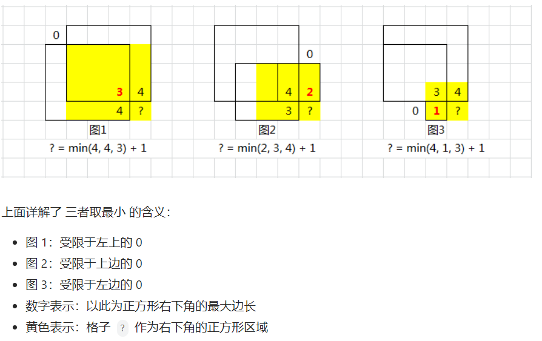

# 动态规划与数字算法题

动态规划（Dynamic programming，简称DP）是通过把原问题分解为相对简单的子问题的方式求解复杂问题的方法。动态规划常常适用于有重叠子问题、最优子结构性质和无后效性质的问题：
1. **最优子结构性质**。如果问题的最优解所包含的子问题的解也是最优的，就称该问题具有最优子结构性质（即满足最优化原理）。
2. **无后效性**。即子问题的解一旦确定，就不再改变，不受在这之后、包含它的更大的问题的求解决策影响。
3. **子问题重叠性质**。子问题重叠性质是指在用递归算法自顶向下对问题进行求解时，每次产生的子问题并不总是新问题，有些子问题会被重复计算多次。动态规划算法正是利用了这种子问题的重叠性质，对每一个子问题只计算一次，然后将其计算结果保存在一个表格中，当再次需要计算已经计算过的子问题时，只是在表格中简单地查看一下结果，从而获得较高的效率，降低了时间复杂度。

**状态转移方程**：相同问题在不同规模下的关系。寻找状态转移方程的一般性步骤：
1. 找到**相同问题（即重叠子问题）**，**相同问题**能适配不同的规模。
2. 找到重叠子问题之间的关系
3. 找到重叠子问题的特殊解。

## 动态规划

### 1. 斐波那契数列（青蛙普通跳台阶）

**题目描述**：写一个函数，输入 n ，求斐波那契（Fibonacci）数列的第 n 项（即 F(N)）。斐波那契数列的定义如下：F(0) = 0,   F(1) = 1，F(N) = F(N - 1) + F(N - 2), 其中 N > 1.斐波那契数列由 0 和 1 开始，之后的斐波那契数就是由之前的两数相加而得出。答案需要取模 1e9+7（1000000007），如计算初始结果为：1000000008，请返回 1。对于青蛙普通跳台阶，和斐波那契数列一样，只是初始值不同， f(0) = 0,  f(1) = 1, f (2) = 2。

**分析**：

**递归法**，直接利用递推公式，进行递归，退出条件为 F(0) = 0,   F(1) = 1。

**迭代法**，使用两个变量存储前两个数的值，从 1 到n - 1 个遍历即可。

**公式法**，经过递推公式计算，数列的通项公式为:

$$a_n=\frac{1}{\sqrt{5}}\Bigg[(\frac{1+\sqrt{5}}{2})^n - (\frac{1-\sqrt{5}}{2})^n\Bigg]$$

其中 $\frac{\sqrt{5}-1}{2}$ 是黄金分割比。 

**求解**：

<<< ../../../src/动态规划/斐波那契数列/fib.ts#docs

### 2. 青蛙变态跳台阶

**题目描述**：一只青蛙一次可以跳上1级台阶，也可以跳上2级……它也可以跳上n级。求该青蛙跳上一个 n 级的台阶总共有多少种跳法。

**分析**：

**迭代法**，f(n) 指的是跳上一个n级的台阶有多少种跳法，那么如果第一步跳 1 级，那么剩下 n - 1 级台阶即有 f(n - 1) 种跳法，如果第一步跳 2 级，那么剩下 n - 2 级台阶即有 f(n - 2) 种跳法， 依次类推，第一次跳 n - 1 级，有 f(1)  = 1种跳法，第一次跳 n 级，有 f (0) = 1 中跳法，将其累加 ，f(n) =  f(n-1) + f(n-2) + f(n-3) + ... + f(1) + f(0); 同理 f(n - 1) = f(n-2) + f(n-3) + f(n-4) + ... + f(1) + f(0)，其中 f (0) = 1。 两式相减 得到 f(n) = 2 * f(n-1) 其中 f(0) = 1, f(1) = 1;

**求解**：

<<< ../../../src/动态规划/青蛙变态跳台阶/numWays2.ts#docs

### 3. 丑数

**题目描述**：我们把只包含质因子 2、3 和 5 的数称作丑数（Ugly Number）。求按从小到大的顺序的第 n 个丑数。

**分析**：

**枚举法**，从 1 开始判断遍历，判断是否丑数（只有 2， 3， 5 作为因子），若是丑数 n 自减，直到 n 等于 1，返回即可。

**动态规划法**，定义数组 dp，其中 dp[i - 1] 表示第 i 个丑数，第 nn 个丑数即为 dp[n]。由于最小的丑数是 1，因此 dp[0]=1。然后定义三个指针 p2,p3,p5，表示下一个丑数是当前指针指向的丑数乘以对应的质因数。初始时，三个指针的值都是 0。当 1≤ i ≤ n-1 时，令 dp[i]=min(dp[p2]×2, dp[p3]×3, dp[p5]×5)， 然后分别比较 dp[i] 和 dp[p2]×2, dp[p3]×3, dp[p5]×5 是否相等，如果相等则将对应的指针加 1。最终 dp[n - 1]即是第 n 个 丑数。

**求解**：

<<< ../../../src/动态规划/丑数/nthUglyNumber.ts#docs

### 4. 最大的正方形

**题目描述**：在一个由 '0' 和 '1' 组成的二维矩阵内，找到只包含 '1' 的最大正方形，并返回其面积。

**分析**：动态规划问题，状态转移方程为
1. dp[i][j] 表示以 (i, j) 为右下角，且只包含 1 的正方形的边长最大值。

    1. 当matrix[i][j] = '1'时，dp[i][j] = Math.min(dp[i - 1][j - 1], dp[i - 1][j], dp[i][j - 1]) + 1；即当前位置的元素值等于三个相邻位置的元素中的最小值加 1。
    2. 当matrix[i][j] = '0' 时，=> dp[i][j] = 0；即当前位置不可能在由 1 组成的正方形中。
    3. 当i = 0 或 j = 0 时，dp[i][j] = matrix[i][j]; 即首行或首列中以位置 (i,j) 为右下角的最大正方形的边长只能是 matrix[i][j]，即 0 或 1。
2. 因此，可以直接在原始矩阵中进行计算，即 matrix 作为 dp。

**求解**：

<<< ../../../src/动态规划/最大正方形/maximalSquare.ts#docs

### 5. 0-1 背包问题

**题目描述**：给定一个能承受最大重量为 bagWeight 的背包，和 m 件物品的价值列表 value 和重量列表 weights，求背包中能包含物品的最大价值。

**分析**：
动态规划问题，状态转移方程为：
  1. dp[i][j] = Math.max(value[i] + dp[i-1][j - weights[i]], dp[i-1][j]); 前提是 j >= weights[i]
  2. 利用滚动数组，优化空间复杂度：dp[j] = Math.max(value[i] + dp[j - weights[i]], dp[j])
  3. dp[i][j] 表示最大重量为 j 的背包中所能包含的 [0, i]区间内的物品的最大价值。

**求解**：

<<< ../../../src/动态规划/0-1背包问题/package01.ts#docs

### 6. 不同路径

**题目描述**：一个机器人位于一个 m x n 网格的左上角 （起始点在下图中标记为 “Start” ）。1 <= m, n <= 100；机器人每次只能向下或者向右移动一步。机器人试图达到网格的右下角（在下图中标记为 “Finish” ）。问总共有多少条不同的路径？

**分析**：

**动态规划问题**， 其状态转移方程为
1. dp(i, j) = dp(i - 1, j) + dp(i, j - 1);  
2. dp(i, 0) = 1; 
3. dp(j, 0) = 1;

其中，dp(i, j) 表示到达第i行第j列有多少条路径（i, j 均从 0 开始）。

**求解**：

<<< ../../../src/动态规划/不同路径/uniquePaths.ts#docs

### 7. 打家劫舍

**题目描述**：你是一个专业的小偷，计划偷窃沿街的房屋。每间房内都藏有一定的现金，影响你偷窃的唯一制约因素就是相邻的房屋装有相互连通的防盗系统，如果两间相邻的房屋在同一晚上被小偷闯入，系统会自动报警。给定一个代表每个房屋存放金额的非负整数数组，计算你不触动警报装置的情况下 ，一夜之内能够偷窃到的最高金额。

1 <= nums.length <= 100；0 <= nums[i] <= 400

**分析**：

**动态规划问题**，状态转移方程为：
1. dp[i] = Math.max(nums[i] + dp[i - 2], dp[i - 1]);
2. dp[1] = Math.max(dp[0], dp[1]);
3. dp[0] = nums[0];
4. dp[i] 表示从[0, i] 区间内房屋能偷窃到的最高金额。

**求解**：

<<< ../../../src/动态规划/打家劫舍/rob.ts#docs

### 8. 地下城游戏

**题目描述**：恶魔们抓住了公主并将她关在了地下城 dungeon 的 右下角 。地下城是由 m x n 个房间组成的二维网格。我们英勇的骑士最初被安置在 左上角 的房间里，他必须穿过地下城并通过对抗恶魔来拯救公主。骑士的初始健康点数为一个正整数。如果他的健康点数在某一时刻降至 0 或以下，他会立即死亡。有些房间由恶魔守卫，因此骑士在进入这些房间时会失去健康点数（若房间里的值为负整数，则表示骑士将损失健康点数）；其他房间要么是空的（房间里的值为 0），要么包含增加骑士健康点数的魔法球（若房间里的值为正整数，则表示骑士将增加健康点数）。为了尽快解救公主，骑士决定每次只 向右 或 向下 移动一步。返回确保骑士能够拯救到公主所需的最低初始健康点数。

注意：任何房间都可能对骑士的健康点数造成威胁，也可能增加骑士的健康点数，包括骑士进入的左上角房间以及公主被监禁的右下角房间。

m = dungeon.length；

n = dungeon[i].length；

1 <= m, n <= 200；

-1000 <= dungeon[i][j] <= 1000。

**分析**：

**动态规划问题**，状态转移方程为：
1. dp[i][j] = Math.max(1, Math.min(dp[i][j + 1], dp[i + 1][j]) - dungeon[i][j]); i < m - 1; j < n - 1; 因为需要满足 dp[i][j] ≥ 1 且 dp[i][j] + dungeon[i][j] >= Math.min(dp[i][j + 1], dp[i + 1][j])；
2. dp[i][j] = Math.max⁡(1, dp[i][j+1] − dungeon[i][j])；i = m - 1; j < n - 1; 因为需要满足 dp[i][j] ≥ 1 且 dp[i][j] + dungeon[i][j] ≥ dp[i][j+1]：表示进入第i行第j列后健康点数dp[i][j] + dungeon[i][j]需要不小于进入下一个格子之前的最低健康点数dp[i][j+1]；
3. dp[i][j] = Math.max⁡(1, dp[i + 1][j] − dungeon[i][j])；i < m - 1; j = n - 1; 因为需要满足 dp[i][j] ≥ 1 且 dp[i][j] + dungeon[i][j] ≥ dp[i+1][j];
4. dp[m − 1][n − 1] = Math.max(1, 1 - dungeon[m - 1][n - 1]); 因为需要满足 dp[m−1][n−1] ≥ 1 且 dp[m−1][n−1] + dungeon[m−1][n−1] ≥ 1；
5. dp[i][j]表示骑士进入第i行第j列之前保证能完成拯救公主所需的最低健康点数（i, j 均从0开始）；
6. 骑士进入第i行第j列后健康点数为 dp[i][j] + dungeon[i][j]；

**求解**：
::: code-group

<<< ../../../src/动态规划/地下城游戏/calculateMinimumHP.ts#docs[calculateMinimumHP.ts]

<<< ../../../src/动态规划/最小路径和/isMatrix.ts#docs[isMatrix.ts]

:::

### 9. 矩形覆盖

**题目描述**：你是一个专业的小偷，计划偷窃沿街的房屋。每间房内都藏有一定的现金，影响你偷窃的唯一制约因素就是相邻的房屋装有相互连通的防盗系统，如果两间相邻的房屋在同一晚上被小偷闯入，系统会自动报警。给定一个代表每个房屋存放金额的非负整数数组，计算你不触动警报装置的情况下 ，一夜之内能够偷窃到的最高金额。

`1 <= nums.length <= 100`；

`0 <= nums[i] <= 400`

**分析**：

**动态规划问题**，和斐波那契数列一样， `n` 个 `2*1` 的小矩形无重叠地覆盖一个 `2*n` 的大矩形的方法数等于 `n - 1` 个 `2*1` 的小矩形无重叠地覆盖一个 `2 *（n - 1）`的大矩形的方法数 与  `n - 2` 个 `2*1` 的小矩形无重叠地覆盖一个 `2*(n - 2)`的大矩形的方法数之和即，`f(n) = f(n - 1) + f(n-2)`，只是初始值不同， `f(0) = 0`,  `f(1) = 1`, `f (2) = 2`。

**求解**：

<<< ../../../src/动态规划/矩形覆盖/rectCover.ts#docs

### 10. 最小路径和

**题目描述**：给定一个包含非负整数的 m x n 网格 grid ，请找出一条从左上角到右下角的路径，使得路径上的数字总和为最小。

说明：每次只能向下或者向右移动一步。

`m == grid.length`

`n == grid[i].length`

`1 <= m, n <= 200`

`0 <= grid[i][j] <= 100`

**分析**：

**动态规划问题**，状态转移方程为：
1. `dp(i, j) = Min.min(dp(i-1, j), dp(i, j - 1)) + grid[i][j]`;
2. `dp(0, j) = dp(0, j - 1) + grid[0][j]`;
3. `dp(i, 0) = dp(i - 1, 0) + grid[i][0]`;
4. `dp(0, 0) = grid[0][0]`;
5. `dp(i, j)` 表示到达第 i 行第 j 列的最小路径和 （i, j 均从 0 开始）

**求解**：

::: code-group

<<< ../../../src/动态规划/最小路径和/minPathSum.ts#docs[minPathSum.ts]

<<< ../../../src/动态规划/最小路径和/isMatrix.ts#docs[isMatrix.ts]

:::
## 贪心

### 1. 剪绳子

**题目描述**：给你一根长度为 n 的绳子，请把绳子剪成整数长度的 m 段（m、n都是整数，n>1 并且 m>1），每段绳子的长度记为 k[0],k[1]...k[m-1] 。请问 k[0]*k[1]*...*k[m-1] 可能的最大乘积是多少？例如，当绳子的长度是8时，我们把它剪成长度分别为2、3、3的三段，此时得到的最大乘积是18。

**分析**：

**贪心法**，首先，显然将绳子以相等的长度等分为多段，得到的乘积最大，而且

最优： 3 。把绳子尽可能切为多个长度为 3 的片段，留下的最后一段绳子的长度可能为 0,1,2 三种情况。

次优： 2 。若最后一段绳子长度为 2 ；则保留，不再拆分。

最差： 1 。若最后一段绳子长度为 1 ；则应把一份 3+1 替换为 2 + 2，因为 2×2 > 3×1。

**求解**：

<<< ../../../src/数学/剪绳子/cuttingRope.ts#docs

## 数学

### 1. 二进制中1的个数

**题目描述**： 编写一个函数，输入是一个无符号整数（以二进制串的形式），返回其二进制表达式中数字位数为 '1' 的个数（也被称为 汉明重量）。

**分析**：

**循环检查二进制位法**，当检查第 i位时，我们可以让 n 与 2^i 进行与运算，当且仅当 n 的第 i 位为 1 时，运算结果不为 0。

**位运算法**，n & (n−1)会将n 的最右边的那个1变成0，直到n 等于0，运算次数就等于 n 的二进制位中 1 的个数。

**求解**：

<<< ../../../src/数学/二进制中1的个数/hammingWeight.ts#docs

### 2. 数值的整数次方

**题目描述**： 实现 pow(x, n) ，即计算 x 的 n 次幂函数（即，xn）。不得使用库函数，同时不需要考虑大数问题。

**分析**：

**直接计算法**，通过判断 n 的正负，若为负数， x 即为倒数，然后累计计算 abs(x) 次即可。

**快速幂递归法**，当我们要计算 x^n时，我们可以先递归地计算出 y=x ⌊n/2⌋，其中 ⌊a⌋ 表示对 a 进行下取整；根据递归计算的结果，如果 n 为偶数，那么 x^n = y^2；如果 n 为奇数，那么 x^n = y^2 * x；

**快速幂迭代法**，由于$x^n=x^{1b_1+2b_2+4b_3+...+2^{m-1}b_m}=x^{1b_1}x^{2b_2}x^{4b_3}...x^{2^{m-1}b_m}$，其中 b = [0, 1]是指数 n 的二进制位。因此每次舍弃n 的最低位，如果从右往左的二进制位是 1，将贡献$x^{2^{m-1}}$累乘上即可。

**求解**：

<<< ../../../src/数学/数值的整数次方/myPow.ts#docs

### 3. 求1+2+3+...+n

**题目描述**：求 1+2+...+n ，要求不能使用乘除法、for、while、if、else、switch、case等关键字及条件判断语句（A?B:C）。

**分析**：

**递归法**，使用短路表达式，当 n !== 0 的时候进行递归累加。

**求解**：

<<< ../../../src/数学/求1+2+3+...+n/sumNums.ts#docs

### 4. 和为S的连续正数序列

**题目描述**：输入一个正整数 target ，输出所有和为 target 的连续正整数序列（至少含有两个数）。序列内的数字由小到大排列，不同序列按照首个数字从小到大排列。
**分析**：

**枚举法**，连续序列至少两个数，序列起点不大于 target / 2，起点从 1 开始遍历到 不大于 target / 2结束，不断累加序列，若大于 target 跳出循环；若等于 target, 将 i 到 j 的所有数字构成的序列添加到结果数据中即可。
求和公式法，target = （i + j）* (j - i + 1) / 2，其中 i , j 分别为序列的起点和终点。在已知 target 和 i 的情况下，通过求根公式计算出 j，当计算出的 j > i 且 j 是整数0，将 i 到 j 的所有数字构成的序列添加到结果数据中即可。

**滑动窗口法**，使用双指针，设连续正整数序列的左边界 i 和右边界 j ，则可构建滑动窗口从左向右滑动。循环中，每轮判断滑动窗口内元素和与目标值 target 的大小关系，若相等则记录结果并移动左边界 i （以减小窗口内的元素和），若大于 target 则移动左边界 i （以减小窗口内的元素和），若小于 target 则移动右边界 j （以增大窗口内的元素和）。

**求解**：

<<< ../../../src/数学/和为S的连续正数序列/findContinuousSequence.ts#docs

### 5. 圆圈中最后剩下的数（小孩报数问题？）

**题目描述**：0,1,···,n-1这n个数字排成一个圆圈，从数字0开始，每次从这个圆圈里删除第m个数字（删除后从下一个数字开始计数）。求出这个圆圈里剩下的最后一个数字。例如，0、1、2、3、4这5个数字组成一个圆圈，从数字0开始每次删除第3个数字，则删除的前4个数字依次是2、0、4、1，因此最后剩下的数字是3。

**分析**：

**数学递归法**，假设删除一个数后的序列 m + 1, m + 2, ... , n, 0, 1, 2, m - 1, 继续删除最后求得的解为 x = f(n -1, m) = f(n, m) - m; 那么 f(n, m) = (f(n- 1) + m) % n，其中 f (1, m) = 0。

**数学迭代法**，由于 f(n, m) = (f(n- 1) + m) % n，其中 f (1, m) = 0; 可以使用动态规划，初始值为 f (1, m) = 0，从 2 到 n 开始遍历到 n 即可求得 f(n, m) = (f(n- 1) + m) % n。

**求解**：

<<< ../../../src/数学/圆圈中最后剩下的数/lastRemainNum.ts#docs

### 6. 出现1的次数

**题目描述**：输入一个整数 n ，求1～n这n个整数的十进制表示中1出现的次数。例如，输入12，1～12这些整数中包含1 的数字有1、10、11和12，1一共出现了5次。

**分析**：

**枚举优化法**，以 n = 1234567 为例，假设我们统计百位上1出现的次数， 等于从 567 到 1234567 这个范围和 从 0 到 567 百位出现 1 的次数之和。而从 567 到 1234567 这个范围内，百位上1出现的次数为 出现的 1 的次数为：⌊ n / 1000 ⌋ × 100, 而 从 0 到 567 百位出现 1 的次数为: min(max(n mod 1000 - 100 + 1, 0), 100)，因为 若 n mod 1000 > 200 则出现 100 次，小于 200 则出现 n mod 1000 - 100 + 1， 小于100 则出现 0 次。因此，通过遍历 n 的每一位（从个位开始），计算即可。

**求解**：

<<< ../../../src/数学/1出现的次数/countDigitOne.ts#docs

### 7. 不用加减乘除做加法

**题目描述**：写一个函数，求两个整数之和，要求在函数体内不得使用 “+”、“-”、“*”、“/” 四则运算符号。

**分析**：

**位运算法**，对两个数字进行位异或运算的结果即为不考虑进位的情况下的求和，而对两个数字进行与运算后左移一位即为进位值，两者相加，直到后者为 0 即不存在进位。

**求解**：

<<< ../../../src/数学/不用加减乘除做加法/add.ts#docs

### 8. 实现大数相加

**题目描述**：给定两个字符串形式的非负整数 num1 和num2 ，计算它们的和并同样以字符串形式返回。

**分析**：由于最大的安全整数是16位，因此从后往前每15位转换为数字相加并且考虑进位，然后再将每部分字符串拼接。需要注意的是，某一部分相加的结果如果位数为16位，说明需要进位，如果位数为小于等于15位时且存在一个加数的位数等于15位，这部分的结果前面需要补0。

**求解**：

<<< ../../../src/数学/大数相加&相乘/add.ts#docs

### 9. 实现大数相乘

**题目描述**：给定两个以字符串形式表示的非负整数 num1 和 num2，返回 num1 和 num2 的乘积，它们的乘积也表示为字符串形式。

**分析**：乘数 num1 位数为 M，被乘数 num2 位数为 N， num1 x num2 结果 res 最大总位数为 M+N，而且num1[i] x num2[j] 的结果再加上其第二位对应的结果数组中的res[i+j+1]得到一个sum，sum的个位就是新的res[i+j+1]，sum的十位加上res[i+j]就是新的res[i+j]。

**求解**：

<<< ../../../src/数学/大数相加&相乘/multiply.ts#docs

### 10. 十进制转k进制

**题目描述**：给定一个十进制数，请转成k进制（k不大于36），如果k大于10，则从A开始算。

**分析**：

**除k取余逆序排列法**，首先根据k制作一个进制数字数组，然后将十进制数进行除k取余，更新十进制数为除数，并逆序排余数，直到除数为 0。

**求解**：

<<< ../../../src/数学/十进制转k进制/numToString.ts#docs