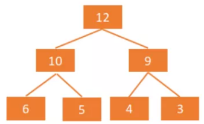
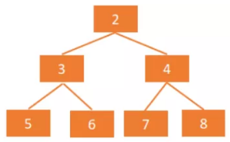

# 堆

## 堆的基本操作

堆是具有以下性质的**完全二叉树**，有两种堆：
1. **大顶堆（大根堆）**：每个节点值大于等于左、右孩子节点的值，大根堆的堆顶是整个堆中的最大元素。

2. **小顶堆（小根堆）**：每个节点值小于等于左、右孩子节点的值，小根堆的堆顶是整个堆中的最小元素。

**存储形式：数组**。

**应用**：优先级队列（多个定时器任务问题）、求前n个最大/最小的数。

**堆的基本操作**包括（均依赖于堆的自我调整使其满足大/小根堆特性）：
1. 插入节点：插入位置是在堆的末尾，然后对该节点进行上浮操作（上浮即和它的父节点比较大小）；
2. 删除节点：删除位置在堆顶，然后将堆尾元素放到堆顶，对此元素进行下沉操作（下沉即和它的左、右孩子比较大小），不断递归，直到无法下沉；
3. **构建堆**：把一个无序的完全二叉树调整为大/小根堆，**从下往上、从左往右的对所有非叶子节点进行下沉操作**。

## 设计堆

利用数组，实现具有插入，删除操作的大根或小根堆。

<<< ../../../src/堆/堆的设计与实现/heap.ts#docs[heap.ts]

## 算法题

### 1. 数据流中的中位数

**题目描述**：如何得到一个数据流中的中位数？如果从数据流中读出奇数个数值，那么中位数就是所有数值排序之后位于中间的数值。如果从数据流中读出偶数个数值，那么中位数就是所有数值排序之后中间两个数的平均值。例如， [2,3,4] 的中位数是 3， [2,3] 的中位数是 (2 + 3) / 2 = 2.5

**分析**：

**冒泡/二分插入有序法**，首先对于每个插入的元素，在插入时使其有序，取出时只需要取中间的数或中间两个数和的一半即可。

**大小根堆划分法**，使用大根堆和小根堆分别保存较小和较大的一半，且在插入时保证，且小根堆比大根堆中元素个数多1或相等，如此一来，在取出时若两个堆元素个数相等，则中位数是两个堆顶元素的一半，否则是中位数是小根堆的堆顶。

**求解**：

::: code-group

<<< ../../../src/堆/堆的设计与实现/heap.ts#docs[heap.ts]

<<< ../../../src/堆/数据流中的中位数/medianFinder.ts#docs[medianFinder.ts]

:::

# Hash 表

## Hash 表的基本操作

Hash 表是一种是使用哈希函数来组织数据，支持快速插入和搜索的线性数据结构。关键是通过哈希函数将键映射到存储桶。哈希函数的选取取决于键的值范围和桶的数量。
1. 插入新的键，哈希函数计算被存储的桶；
2. 搜索一个键，使用相同的哈希函数计算所在桶， 然后在桶中搜索。

## 设计 Hash 表

关键是**选择哈希函数**和**进行冲突处理**。

**哈希函数**：分配一个地址存储值。理想情况下，每个键都应该有一个对应唯一的散列值。

**冲突处理**：哈希函数的本质就是从 A 映射到 B。但是多个 A 键可能映射到相同的 B。

**冲突解决策略**：
1. **单独链接法（链表法）**：对于相同的散列值，我们将它们放到一个桶中，每个桶是相互独立的。

::: code-group

<<< ../../../src/哈希表/设计散列表/separateChiningHash.ts#docs[separateChiningHash.ts]

<<< ../../../src/哈希表/设计散列表/defaultToString.ts#docs[哈希 key 转换字符串函数]

:::

2. **开放地址法（线性探测）**：每当有碰撞，则根据我们探查的策略找到一个空的槽为止。

::: code-group

<<< ../../../src/哈希表/设计散列表/linearProbingHash.ts#docs[linearProbingHash.ts]

<<< ../../../src/哈希表/设计散列表/defaultToString.ts#docs[哈希 key 转换字符串函数]

:::

上述实现中使用到的 djb2 函数（或者 loselose 函数），原理是借助字符串各个位上的 UTF-16 Unicode 值进行计算，然后对特定值取余即为哈希值。

3. **双散列法**：使用两个哈希函数计算散列值，选择碰撞更少的地址。

**JavaScript 内置哈希表的典型设计是**：
 键值可以是任何具有可哈希码（**映射函数获取存储区索引**）的**可哈希化**的类型。每个桶包含一个数组，用于在初始时将所有值存储在同一个桶中。 如果在同一个桶中有太多的值，这些值将被保留在一个**高度平衡的二叉树搜索树（BST）**中。
插入和搜索的平均时间复杂度仍为 O(1)。最坏情况下插入和搜索的时间复杂度是 O(logN)。使用高度平衡的 BST 是在插入和搜索之间的一种权衡。
