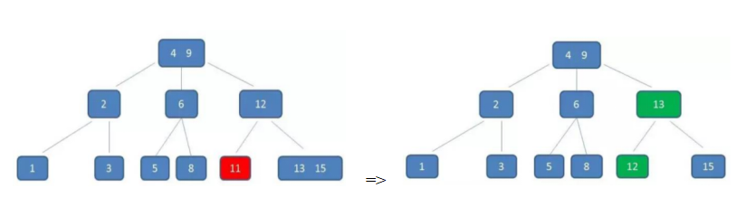

# 查找

## 查找表

查找表是同一数据类型构成的集合。只进行查找操作的称为**静态查找表**；在查找的同时进行插入和删除操作的称为**动态查找表**。

查找算法衡量好坏的依据为：查找成功时，查找的关键字和查找表中比较过的数据元素的个数的平均值，称为**平均查找长度（Average Search Length，用 ASL 表示）**。计算公式为 $ASL=\sum_{i=1}^{n}P_iC_i$。其中 $P_i$ 为第 i 个数据元素被查找的概率，所有元素被查找的概率的和为 1；$C_i$ 表示在查找到第 i 个数据元素之前已进行过比较的次数。比如线性查找中，若表中有 n 个数据元素，从后往前查找，查找第一个元素时需要比较 n 次；查找最后一个元素时需要比较 1 次，所以有 $C_i = n – i + 1$。

对于查找算法来说，**查找成功和查找失败的概率是相同的**。查找算法的平均查找长度应该为查找成功时的平均查找长度加上查找失败时的平均查找长度。计算公式为：$\frac{1}{2}ASL_{成功} + \frac{1}{2}ASL_{失败}$

### 顺序查找

**算法思想**：在原始顺序表中添加目标关键字作为“监视哨”，然后从表中的第一个数据元素开始，逐个同记录的目标关键字做比较，如果匹配成功，则查找成功；反之，如果直到表中最后一个关键字查找完才成功匹配，则说明原始顺序表中查找失败。

**实现**：

<<< ../../../src/查找/顺序查找/sequentialSearch.ts#docs[sequentialSearch.ts]

**其平均查找长度为**：$ASL=\frac{1}{2n}\sum_{i=1}^{n}(n-i+1) + \frac{n+1}{2} = \frac{3}{4}(n+1)$

### 二分查找（折半查找）

**算法思想**：假设静态查找表中的数据是有序的。指针 low 和 high 分别指向查找表的第一个关键字和最后一个关键字，指针 mid 指向处于 low 和 high 指针中间位置的关键字。在查找的过程中每次都同 mid 指向的关键字进行比较，由于整个表中的数据是有序的，因此在比较之后就可以知道要查找的关键字的在 [low,  mid] 还是 [mid, right]。

**实现**：

<<< ../../../src/查找/二分查找/binarySearch.ts#docs[binarySearch.ts]

由于 mid = Math.floor((low + high)/2)，因此，判定树满足**右子树结点数-左子树结点数= 0 或 1**，给定长度为n的某个序列，构建折半查找判定树分三步：
1. 先画出Math.ceil(log2(n + 1)) - 1的满二叉树，并计算剩余几个结点。
2. 将剩余结点按照判定树满足的规律依次插入最底层即为二叉判定树的树形。
3. 将给定序列依次按照中序遍历顺序填入各个结点。

查找成功的平均查找长度等于判定树上每一层的**内节点（能查找成功的）数**乘以[内节点所在的层]，然后求和，最后除以**内节点**数。

查找失败的平均查找长度等于每一层的**外节点（查找失败的区域）数乘以**[外节点所在层 - 1]，然后求和，除以**外节点数**。

### 二叉查找（搜索）树

**二叉查找树（二叉搜索树、二叉排序树）**：空树或满足：
1. 非空左子树所有节点值小于根节点；
2. 非空右子树所有节点值大于根节点；
3. 左右子树也是二叉查找树；

是一种**动态查找表**，在查找过程中插入或者删除表中元素。**查找的时间复杂度取决于树的高度**。

**插入节点**：查找失败时插入位置一定位于查找失败时访问的最后一个结点的左孩子（小于）或者右孩子（大于）。

**对一个查找表进行查找以及插入操作时，可以从空树构建出一个含有表中所有关键字的二叉排序树，使得一个无序序列可以通过构建一棵二叉排序树，从而变成一个有序序列（中序遍历）**。

**删除节点（假设为p节点）**：
1. p节点为叶节点，直接删除并改变父节点指针为null；
2. p节点只有左子树或只有右子树，直接将子树替换p节点；
3. p节点同时有左右子树：
    1. 左子树替换p节点，同时右子树成为p节点直接前驱的右子树
    2. **或者直接将节点p的值替换为其直接前驱的值，再对原直接前驱进行删除操作（以下实现采用）**。

**实现**：

::: code-group

<<< ../../../src/查找/二叉查找树/binarySearchTree.ts#docs[binarySearchTree.ts]

<<< ../../../src/查找/二叉查找树/binarySearchTreeNode.ts#docs[binarySearchTreeNode.ts]

<<< ../../../src/查找/二叉查找树/compare.ts#docs[compare.ts]

:::

### 平衡二叉树（AVL）

**平衡二叉树**是：
1. 满足二叉查找树的所有特性；
2. 每个节点的平衡因子（节点的左右子树高度差）绝对值不大于 1。

在动态查找过程中，可能会破坏其平衡性，需要做出调整（假设距离插入节点最近的不平衡节点为a）：
1. 在a的左子树的左子树上插入节点（LL），即右旋

2. 在a的右子树的右子树上插入节点（RR），即左旋

3. 在a的左子树的右子树上插入节点（LR），即先左旋（左子节点）再左旋

**实现**：

::: code-group

<<< ../../../src/查找/平衡二叉树/AVLTree.ts#docs[AVLTree.ts]

<<< ../../../src/查找/二叉查找树/binarySearchTree.ts#docs[binarySearchTree.ts]

<<< ../../../src/查找/二叉查找树/binarySearchTreeNode.ts#docs[binarySearchTreeNode.ts]

<<< ../../../src/查找/二叉查找树/compare.ts#docs[compare.ts]

:::

### B- 树

**B- 树（B树）**，是多叉查找树，一颗 m 阶 B 树满足（m = 3指的是度最大为3）：
1. 根节点至少有子节点；
2. 每个中间节点（非叶、根节点）都包含 k - 1 个元素和 k 个孩子（m/2 <= k <= m）；
3. **每一个叶子节点都包含 k - 1 个元素**（m/2 <= k <= m）；
4. 所有的叶子节点都位于同一层；
5. 每个节点中的元素从小到大排列，节点当中的 k - 1 个元素划分k个孩子所属的值域范围。

进行**数值的比较是在内存**（内存运算速度比磁盘 IO 快）中进行的，B树的比较次数虽然比二叉查找树多，然而由于B树每个节点存储的数据更多，磁盘加载次数更少，效率更高。磁盘加载次数可能与树的高度相同（因为不同的节点可能存储在不同的磁盘页中），所以选择这种矮胖的树形结构。注意：受到内存大小和磁盘页数限制，并不是越矮胖越好。

**B 树的基本操作**：

1. **插入**：首先自顶向下查找元素的插入位置。如果插入后节点元素个数等于m。对当前节点的中心节点向上升级，直到当前节点元素个数小于m。

2. **删除**：首先自顶向下查找删除位置，删除后如果不满足B树的特性，找出父节点和其子节点的中位数进行向上升级。

### B+树

**B+ 树**，多叉查找树，一颗 m 阶 B+ 树满足（m = 3 指的是度最大为 3）：
1. 中间节点的元素个数和其子树个数相等，均为k（m/2 <= k <= m），且中间节点的索引元素值是子节点中元素的最大（或最小）值；
2. 所有叶子节点包括了全部索引元素，和指向卫星数据的指针，且所有叶子节点形成有序链表；

**B+ 树基本操作**：
1. **插入**：空树直接插入；找到插入位置插入后，节点元素个数等于m就进行分裂（中位数升级），直到当前节点元素个数小于m。（插入7）：

2. **删除**：首先自顶向下查找删除位置，删除后如果个数小于Math.ceil(m/2) – 1，进行向兄弟节点借或与兄弟节点合并，自底向上判断节点个数是否小于Math.ceil(m/2) – 1。（删除7）：

B+ 树非叶子节点不存在**卫星数据（索引元素所指向的数据记录**，在 B- 树中，无论是中间节点还是叶子结点都带有卫星数据，而在B+树当中，只有叶子节点带有卫星数据，其余中间节点仅仅是索引，没有任何数据关联），因此可以存储更多的中间节点，意味着在数据量相同情况下，B+树比B树存储更矮胖，磁盘IO次数更少。

**补充**：在数据库的聚簇索引（Clustered Index）中，叶子节点直接包含卫星数据。在非聚簇索引（NonClustered Index）中，叶子节点带有指向卫星数据的指针。

**B+树的优点**：
1. 所有查询都需要到叶子节点，查询性能稳定。
2. 叶子节点形成有序链表，相较B树便于范围查询。

文件系统和数据库的索引都是存在硬盘上的，并且如果数据量大的话，不一定能一次性加载到内存中，所以要用到B树或B+树的多路存储分页加载。

**MySQL 采用 B+ 树索引的原因**：进行**多条数据的查询或范围查询**时，对于B树需要做中序遍历跨层访问磁盘页，而 B+ 树全部数据都在叶子节点且叶子节点之间是链表结构，找到首尾即可取出所有数据。Hash 索引对等值查询具有优势，效率O（1），前提是哈希冲突较少。Hash 无序性不适用于范围查询，查询出来的数据需要再次排序（模糊匹配like本质也是范围查询）。多列联和索引的最左匹配规则只能是 B+ 树，首先是先对第一列排序，对于第一列相同的再按照第二列排序，依次类推。

**MySQL中的 B+Tree 索引结构图如下（叶子节点循环双向链表）**：

# 排序

**是否稳定**：对于相等的数，排序前后的相对位置是否改变。

## 1. 冒泡排序（bubble sort）

**算法思想**：基于交换，以从前往后冒泡为例，第一趟冒泡从第一个元素开始，到倒数第二个元素，比较相邻的元素，如果前一个元素大于后一个即交换。下一趟从第一个元素开始，只到倒数第三个元素（因为上一趟倒数第一个元素确定其最终位置）。依此类推。由于相同的元素在冒泡过程中不会交换，**属于稳定排序，时间复杂度 $O(n^2)$，空间复杂度 $O(1)$**。

**优化**：有序的标志即一趟冒泡没有发生元素的交换，因此可以提前中止。同时，从算法思想可得，有序区的长度至少等于冒泡的趟数，甚至大于。在一趟冒泡过程中，最后一次交换的下标即是有序区第一个元素，下一趟的冒泡只需要遍历至该下标的上一个元素。

**实现**：

<<< ../../../src/排序/冒泡排序/bubbleSort.ts#docs[bubbleSort.ts]

## 2. 简单插入排序（insert sort）

**算法思想**：对于具有n个元素的待排序序列，第k趟假设前k（k >=1）个已经有序，后n - k个元素是无序，选取第k+1个元素，在前k个元素中寻找它的插入位置（即第一个比它大的元素的位置）进行插入。由于插入位置在有序区中比它大的第一个元素处，**属于稳定排序，时间复杂度 $O(n^2)$，空间复杂度 $O(1)$**。

**优化**：查找插入位置时，使用二分查找。

**实现**：

<<< ../../../src/排序/简单插入排序/insertSort.ts#docs[insertSort.ts]

## 3. 选择排序（select sort）

**算法思想**：对于具有 n 个元素的待排序序列，第k趟假设前k（k >=1）个已经有序，后 n - k 个元素是无序，从这 n-k 元素中选择最小的元素和第 k 个元素交换。**因此这是在时间复杂度上最稳定的排序算法，无论如何都是 $O(n^2)$，空间复杂度 $O(1)$**。由于最小元素交换时可能导致相等元素相对位置改变（`[31, 5, 32, 2, 9] => [2, 5, 32, 31, 9]`），**属于不稳定排序**。

**实现**：

<<< ../../../src/排序/选择排序/selectSort.ts#docs[selectSort.ts]

## 4. 快速排序（quick sort）

**算法思想**：选取一个基准元素 `pivot`，基准元素将待排序数组分为小于和大于的左右独立的两部分。然后再递归的分别对左右两个独立部分进行相同的操作。比如选择基准元素为左侧第一个元素，通过使用一个指针指向基准元素的下一个元素，同时遍历基准元素右侧元素，若元素小于基准元素，则交换当前遍历元素和指针指向元素，且移动该指针，最终指针所在位置就是大于等于基准元素的第一个元素位置。遍历结束，交换指针前一位元素和基准元素，基准元素到达最终位置。由于在左边等于基准元素的元素可能会被放到右边，**属于不稳定排序，时间复杂度 $O(nlogn)$，空间复杂度 $O(logn)$**。

**实现**：

<<< ../../../src/排序/快速排序/quickSort.ts#docs[quickSort.ts]

## 5. 归并排序（merge sort）

**算法思想**：对于具有n个元素的待排序序列，分成两个长度为n/2的子序列，分别对两个子序列进行归并排序，将排序好的子序列合并。递归划分至子序列长度为1，两路合并。由于相等的元素在合并的过程中位置不变，**属于稳定排序。时间复杂度 $O(logn)$，空间复杂度 $O(n)$**。

**实现**：

<<< ../../../src/排序/归并排序/mergeSort.ts#docs[mergeSort.ts]

## 6. 计数排序（counting sort）

**算法思想**：找到要排序数组的最大值和最小值。以最大值 - 最小值 + 1为长度创建一个计数数组。遍历要排序的数组，以当前遍历的元素 - 最小值为索引，在计数数组中自增出现次数。遍历计数数组，判断当前遍历到的元素是否大于 0，如果大于 0 就取当前遍历到的索引 + 最小值，替换待排序数组中的元素。**计数排序适合用来排序范围不大的数字，时间复杂度为 O(n + m)，空间复杂度为 O(m)**。

**优化**：上述方法只适合用来排序范围不大的数字，且无法保证重复时的稳定性，需要进行优化—需要对计数数组中所有的计数进行累加（从计数数组的第二个元素开始，每一项和前一项相加，作为计数数组当前项的值）；最后，通过反向遍历排序数组，填充目标排序数组：将每个元素放在目标排序数组的当前元素减去最小值的索引处的统计值对应的目标排序数组的索引处，每放一个元素就将统计数组中当前元素减去最小值的索引处的统计值减去 1。

**实现**：

<<< ../../../src/排序/计数排序/countingSort.ts#docs[countingSort.ts]

## 7. 桶排序（bucket sort）

**算法思想**：桶排序在所有元素平分到各个桶中时的表现最好。如果元素非常稀疏，则使用更多的桶会更好。如果元素非常密集，则使用较少的桶会更好。创建桶，数量等于原始数组的元素数量，这样，每个桶的长度为 （最大值- 最小值） / (桶数量 - 1），然后通过（元素值 - 最小值 ）/ 桶长度，将原始数组中的每个桶分布到不同的桶中，对每个桶中的元素执行某个排序算法使桶内有序，最后将所有桶合并成排序好后的结果数组。

**实现**：

<<< ../../../src/排序/桶排序/bucketSort.ts#docs[bucketSort.ts]

## 8. 堆排序（heap sort）

**算法思想**：利用堆的性质，对于具有n个元素的待排序序列，第k （k >= 1)趟，将n - k + 1 个元素**维持为大根堆**，将堆顶元素和第n - k + 1个元素交换。如此，后k个元素为有序区。由于交换导致相等元素的相对位置发生改变，**属于不稳定排序， 时间复杂度 $O(nlogn)$，空间复杂度 $O(1)$**。

**实现**：

<<< ../../../src/排序/堆排序/heapSort.ts#docs[heapSort.ts]

## 9. 基数排序（radix sort）

**算法思想**：根据数字的有效位或基数将整数分布到桶中。由于整数也可以表达字符串（比如名字或日期）和特定格式的浮点数，所以基数排序也不是只能使用于整数。对于十进制数，使用 10 个桶用来分布元素并且首先基于个位数字进行稳定的计数排序，然后基于十位数字，然后基于百位数字。

**实现**：

<<< ../../../src/排序/基数排序/radixSort.ts#docs[radixSort.ts]