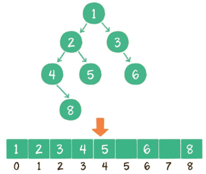
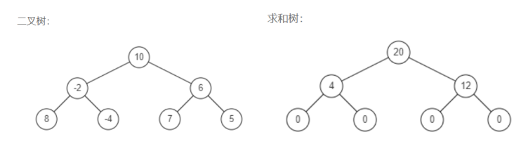

# 树

## 基本概念

树是非线性逻辑结构，是 n（n≥0）个节点的有限集。当 n=0 时，称为空树。树的每个节点有一个节点值和包含所有子节点的列表，从图的角度看，**即 N 个节点的 N - 1 条边的有向无环图**。树的最大层级数，被称为树的高度或深度。树中最多子节点数称为树的度。

而最常用且典型的是二叉树，即每个节点最多只有两个子节点。两个孩子节点的**顺序是固定的（与二度树不同）**。

满二叉树的所有非叶子节点都存在左右孩子，并且所有叶子节点都在同一层级上。

完全二叉树是具有与同深度的按层级顺序 1 到 n 编号的满二叉树完全对应的节点编号的二叉树。

二叉树是逻辑结构，物理结构可以是链式存储结构，或者是数组。
1. 链式存储结构：存储数据的 data 变量、指向左孩子的 left 指针、指向右孩子的 right 指针。
2. 数组：按层级顺序把二叉树的节点放到数组中对应的位置上。如果某一个节点的左孩子或右孩子空缺，则数组的相应位置也空出来。

如上图，当前节点的下标是parent，那么它的左孩子节点下标就是2 × parent + 1；右孩子节点下标就是2 × parent + 2。反过来，假设一个左孩子节点的下标是lChild，那么它的父节点下标就是（lChild - 1）/ 2，同理，假设一个右孩子节点的下标是rChild，那么它的父节点下标就是（rChild - 2）/ 2，因此任何一个节点下标为child，其父节点下标为 Math.floor((child - 1) / 2)。**数组存储更适合完全二叉树和满二叉树，对于稀疏二叉树，无疑是浪费空间的**。

二叉树的应用主要是查找和维持相对顺序，比如二叉查找树（二叉搜索树）（左孩子 < 父节点 < 右孩子）和二叉堆（**大根堆：左孩子 < = 父节点 >= 右孩子，小根堆：左孩子 > =父节点 =< 右孩子**）。对于一个节点分布相对均衡的二叉查找树来说，如果节点总数是n，那么搜索节点的时间复杂度就是O(logN)，和树的深度是一样的。而如果考虑插入有序的序列，树的高度和搜索时间都会退化成O(n)，就需要采用二叉树的自平衡，其应用有：**红黑树、AVL树**（二叉平衡树）等 。

### 二叉树的实现与遍历

二叉树遍历包括**前序遍历，中序遍历，后序遍历，层序遍历**。实现方法为**递归遍历**和**迭代遍历**。

**二叉树的实现和遍历**：

::: code-group

<<< ../../../src/树/二叉树设计实现和遍历/traversal.ts#docs[实现与递归遍历]

<<< ../../../src/树/二叉树设计实现和遍历/traversal.ts#iterTraversal[迭代遍历]

<<< ../../../src/树/二叉树设计实现和遍历/binaryTreeNode.ts#docs[binaryTreeNode.ts]

:::

## 算法题

### 1. 二叉树的深度

**题目描述**：输入一棵二叉树，求该树的深度。从根结点到叶结点依次经过的结点（含根、叶结点）形成树的一条路径，最长路径的长度为树的深度。

**分析**：

**对于树的相关问题，一般可以使用迭代法和递归法进行求解**；递归法比较简单，可以自底向上或自顶向下计算二叉树的深度，
1. **自底向上递归法**，由于每个树节点的深度等于其左子树深度和右子树深度的较大者 + 1。
2. **自顶向下递归法**，设定初始树深度 depth 为 0，通过自根节点向下遍历，其中每向下遍历即更新当前路径的深度 count，直到叶节点时更新初始深度 depth 为当前路径的深度 count 和 depth 的较大值。同时，每个路径达到当前节点为 null，跳出当前递归路径。
3. **层序遍历迭代法**，可以利用队列来保存[当前节点，该节点层数root节点为1]信息数组，层序遍历至最下层，队列中最后一个节点的层数即最大的 depth。

**求解**：

::: code-group

<<< ../../../src/树/二叉树的深度/maxDepth.ts#docs[maxDepth.ts]

<<< ../../../src/树/二叉树设计实现和遍历/treeNode.ts#docs[treeNode.ts]

:::

### 2. 重建二叉树

**题目描述**：输入某二叉树的前序遍历和中序遍历的结果，请构建该二叉树并返回其根节点。假设输入的前序遍历和中序遍历的结果中都不含重复的数字。例如输入前序遍历序列[1,2,4,7,3,5,6,8]和中序遍历序列[4,7,2,1,5,3,8,6]，则重建二叉树并返回。

**分析**：在中序遍历序列中找到前序遍历序列的第一个节点1，该节点将中序遍历序列分成**左子树（中序遍历序列）[4,7,2]**和**右子树（中序遍历序列）[5,3,8,6]**两个部分，而在前序遍历序列中紧接着的**和左子树相同长度的序列**即为左子树的前序遍历序列[2,4,7]以及**和右子树相同长度的序列**即为右子树的前序遍历序列[3,5,6,8]，如此递归下去。

如果给出的是**后序和中序**，同理，只不过后序的根节点在最后。

但是**只给出前序和后序**是无法确定一颗二叉树的。

**求解**：

::: code-group

<<< ../../../src/树/重建二叉树/buildTree.ts#docs[buildTree.ts]

<<< ../../../src/树/二叉树设计实现和遍历/treeNode.ts#docs[treeNode.ts]

:::

### 3. 从上到下打印二叉树

**题目描述**：从上往下打印出二叉树的每个节点。分为三种情况：
1. 顺序打印一维数组（同层从左往右） 
2. 顺序打印二维数组（同层从左往右为一维数组） 
3. 之字形打印二维数组（同层交替方向）。

**分析**：

由题目分析，是层序遍历的过程，因此直接层序遍历即可，如果要求返回的是二维数组，即每一层节点数组构成的数组，仅仅需要在每一层遍历开始构建数组，遍历完该层后将数组加入到外层数组中。还有就是可能要求之字形的打印（即偶数层的打印是从右到左），使用一个层遍历初始方向标志变量，对于每一层 true 则 push，false 则 unshift，该变量初始为 true，每打印一层取反，遍历完该层后将数组加入到外层数组中即可。

**求解**：

::: code-group

<<< ../../../src/树/从上到下打印二叉树/levelOrder.ts#docs[levelOrder.ts]

<<< ../../../src/树/二叉树设计实现和遍历/treeNode.ts#docs[treeNode.ts]

:::

### 4. 镜像二叉树

**题目描述**：请完成一个函数，输入一个二叉树，该函数输出它的镜像。

**分析**：比如，源二叉树为：

            8

           /  \

          6   10

         / \  / \

        5  7 9 11

其镜像二叉树，其镜像二叉树，即左右子树进行对调，递归对调即可：先分别递归求得左右子树的镜像，然后将左子树镜像与右子树镜像分别挂着右左子树上，即对调，结果如下：

            8

           /  \

          10   6

         / \  / \

        11 9 7  5

**求解**：

::: code-group

<<< ../../../src/树/镜像二叉树/mirrorTree.ts#docs[mirrorTree.ts]

<<< ../../../src/树/二叉树设计实现和遍历/treeNode.ts#docs[treeNode.ts]

:::

###  5. 平衡二叉树

**题目描述**：输入一棵二叉树，判断该二叉树是否是平衡二叉树（不考虑其是不是排序二叉树，只需要考虑其平衡性）。

**分析**：首先，平衡二叉树的平衡性即，左子树与右子树的高度差的绝对值不大于 1。即在遍历二叉树节点的过程中需要求该节点的左子树和右子树的高度差，自底向上的递归求树高度更为简单（参考 [1. 二叉树的深度](./tree-graph.md#_1-二叉树的深度)）。

**求解**：

::: code-group

<<< ../../../src/树/平衡二叉树/isBalanced.ts#docs[isBalanced.ts]

<<< ../../../src/树/二叉树的深度/maxDepth.ts#docs[maxDepth.ts]

<<< ../../../src/树/二叉树设计实现和遍历/treeNode.ts#docs[treeNode.ts]

:::

### 6. 二叉树中和为某一值的路径

**题目描述**：输入一颗二叉树的根节点和一个整数，打印出二叉树中结点值的和为输入整数的所有路径。路径定义为从树的根结点开始往下一直到叶结点所经过的结点形成一条路径。

**分析**：

**深度优先搜素(dfs)法**，枚举每一条从根节点到叶子节点的路径。当我们遍历到叶子节点，且此时路径和恰为目标和时，就找到了一条满足条件的路径。路径是根节点开始到叶节点结束的，目的是需要找出的所有符合条件（即路径节点和等于给定整数）的路径。一般考虑使用DFS（深度优先搜索），对于新每个节点：
1. 新节点进栈；
2. 当前节点是叶节点且路径和等于目标值，加入路径数组；
3. 遍历左子树和右子树，目标值减少为 target - val；
4. 递归出来后，回退到该节点的上层（新节点出栈）。

**求解**：

::: code-group

<<< ../../../src/树/二叉树中和为某一值的路径/pathSum.ts#docs[pathSum.ts]

<<< ../../../src/树/二叉树设计实现和遍历/treeNode.ts#docs[treeNode.ts]

:::

### 7. 对称二叉树

**题目描述**：请实现一个函数，用来判断一棵二叉树是不是对称的。如果一棵二叉树和它的镜像一样，那么它是对称的。

**分析**：

**递归法**，如果一个树的左子树与右子树镜像对称，那么这个树是对称的。即两个树在什么情况下互为镜像，满足以下条件：
1. 它们的两个根结点具有相同的值；
2. 每个树的右子树都与另一个树的左子树镜像对称。
因此，通过「同步移动」两个指针的方法来遍历这棵树， p 指针和 q 指针一开始都指向这棵树的根，随后 p 右移时，q 左移，p 左移时，q 右移。每次检查当前 p 和 q 节点的值是否相等，如果相等再判断左右子树是否镜像对称。

**求解**：

::: code-group

<<< ../../../src/树/二叉树中和为某一值的路径/pathSum.ts#docs[pathSum.ts]

<<< ../../../src/树/二叉树设计实现和遍历/treeNode.ts#docs[treeNode.ts]

:::

### 8. 二叉搜索树的后序遍历序列

**题目描述**：输入一个整数数组，判断该数组是不是某二叉搜索树的后序遍历结果。如果是则返回 true，否则返回 false。假设输入的数组的任意两个数字都互不相同。

**分析**：

**中序判断法**，因为二叉搜索树满足左子树 < 根节点 < 右子树，其中序遍历是有序的，而且中序、后序分别对应栈的压入、弹出序列（首先左子树入栈，左子树弹出，然后根节点、右子树入栈，右子树、根节点弹出），因此可以通过将当前后序遍历排序， 然后判断中序，后序是否满足栈的压入、弹出（参考 [2.栈的压入、弹出序列](./stack-queue.md#_2-栈的压入、弹出序列)）即可。

**求解**：

::: code-group

<<< ../../../src/树/二叉搜索树的后序遍历序列/verifyPostorder.ts#docs[verifyPostorder.ts]

<<< ../../../src/栈/栈的压入、弹出序列/validateStackSequences.ts#docs[validateStackSequences.ts]

:::

### 9. 二叉搜索树的第 k 大节点

**题目描述**：给定一棵二叉搜索树，请找出其中第 k 大的节点的值。

**分析**：二叉搜索树即二叉查找树或二叉排序树，它的中序倒序遍历是递减的，因此可以在遍历的过程中用一个变量来记录遍历的次序，当遍历到第k个节点即可。或者可以直接遍历得到遍历结果数组，取第k个值。如果需要求的是第k小的则是采用中序遍历。

**求解**：

::: code-group

<<< ../../../src/树/二叉搜索树的第k大节点/kthLargest.ts#docs[kthLargest.ts]

<<< ../../../src/树/二叉树设计实现和遍历/treeNode.ts#docs[treeNode.ts]

:::

### 10. 树的子结构

**题目描述**：输入两棵二叉树 A 和 B，判断 B 是不是 A 的子结构。(约定空树不是任意一个树的子结构)，B 是 A 的子结构，即 A 中有出现和 B 相同的结构和节点值。

** 分析**：子结构与子树不同，子结构可以在叶子节点不完全相同，即子树一定是子结构，子结构不一定是子树。

**先序遍历递归法**，首先，任何树不是空树的子结构，空树也不是任何树的子结构；其次判以当前节点为根的树是否包含断 B 树；如果不包含，再判断 B 是否是其左子树或其右子树的子结构。

**序列化法**，由于树是对象，可以将其序列化成字符串，判断序列化 A 中是否包含序列化 B。

**求解**：

::: code-group

<<< ../../../src/树/树的子结构/isSubStructure.ts#docs[isSubStructure.ts]

<<< ../../../src/树/二叉树设计实现和遍历/treeNode.ts#docs[treeNode.ts]

:::

### 11. 二叉树的下一个节点

**题目描述**：给定一个二叉树和其中的一个结点，请找出中序遍历顺序的下一个结点并且返回。注意，树中的结点不仅包含左右子结点，同时包含指向父结点的指针。

**分析**：

**迭代遍历法**，
1. 若该节点 node 是 null，显然不存在下一节点；
2. 若该节点 node 有右子树，下一节点为右子树中的最左节点，向左遍历直到左子树为空的节点即为下一节点；
3. 若该节点 node 不存在右子树，则向上不断遍历父节点，直到当前节点的父节点的左孩子是该节点，返回此父节点; 若找不到（遍历到根节点），说明节点 node 已是中序遍历的最后一个节点。返回 null。

**求解**：

::: code-group

<<< ../../../src/树/二叉树的下一个结点/getNext.ts#docs[getNext.ts]

<<< ../../../src/树/二叉树设计实现和遍历/treeNode.ts#docs[treeNode.ts]

:::

### 12.序列化二叉树

**题目描述**：实现两个函数，分别用来序列化(serialize)和反序列化(deserialize)二叉树。你需要设计一个算法来实现二叉树的序列化与反序列化。这里不限定你的序列 / 反序列化算法执行逻辑，你只需要保证一个二叉树可以被序列化为一个字符串并且将这个字符串反序列化为原始的树结构。

**分析**：

**JSON 法**，直接使用JSON.stringify 和 JSON.parse 进行序列化和反序列化即可。

**递归遍历法**：
1. **序列化**, 对二叉树树进行先序遍历，如果节点是 node。则序列化为'None,',否则序列化为'该节点值,该节点左子树的序列化结果该节点右子树的序列化结果'。
2. **反序列化**，首先将序列化字符串按照分割符 split 成数组，再不断取出首节点。然后分别对左子树、右子树递归进行反序列化。

**求解**：

::: code-group

<<< ../../../src/树/序列化二叉树/serialize.ts#docs[serialize.ts]

<<< ../../../src/树/二叉树设计实现和遍历/treeNode.ts#docs[treeNode.ts]

:::

### 13. 二叉搜索树与双向链表

**题目描述**：输入一棵二叉搜索树，将该二叉搜索树转换成一个排序的循环双向链表。要求不能创建任何新的节点，只能调整树中节点指针的指向。

**分析**：首先得了解二叉搜索树的特点，即**左孩子<父节点<右孩子，二叉搜索树的中序遍历即为有序**。要求只能在原树中改变指针指向。可以采用将原树中节点的右指针指向下一个节点，左指针指向上一个节点。

**中序遍历递归法**，
1. 首先递归遍历左子树；
2. 遍历到当前节点时，判断若是最左节点，说明是双向链表的头结点，否则将前驱节点的后驱指向当前遍历节点，当前节点的前驱指向 pre，更新前驱节点 pre 为 当前遍历节点。
3. 然后递归遍历右子树；
4. 最后递归结束，将头结点 head 的前驱指向最后一个节点 pre，将最后一个节点 pre 的后驱指向头结点 head。

**中序遍历迭代法**，利用栈来迭代中序遍历，出栈时执行和递归中遍历当前节点相同的操作，同样，遍历结束后，将头结点 head 的前驱指向最后一个节点 pre，将最后一个节点 pre 的后驱指向头结点 head。

除了遍历的同时改变指针指向，也可以先遍历放入数组，然后依次从前往后进行节点间双向指向，显然后者更易懂。

**求解**：

::: code-group

<<< ../../../src/树/二叉搜索树与双向链表/treeToDoublyList.ts#docs[treeToDoublyList.ts]

<<< ../../../src/树/二叉树设计实现和遍历/treeNode.ts#docs[treeNode.ts]

:::

### 14. 二叉树转换为求和树

**题目描述**：给出二叉树的中序遍历结果和前序遍历结果，编写算法将其转化为求和树。二叉树的求和树，是一颗同样结构的二叉树，其树中的每个节点将包含原始树中的左子树和右子树的和。

**分析**：

**递归法**，
1. 如果是叶子节点(中序遍历只有一个节点)，对应求和树的中序遍历为 [0]。
2. 如果是 null 节点(中序遍历无节点)，对应求和树的中序遍历为[]。
3. 如果是非 null 且非叶节，对应求和树的中序遍历为[右子树的求和树的中序遍历, 求和树根节点值, 右子树的求和树的中序遍历]。
    1. 前序遍历的第一个节点为根节点，在中序遍历中找到该节点下标 index，求和树根节点值为以该节点二叉树的中序遍历的和减去该节点。
    2. 中序遍历中该节点之前 `[0, index)` 为左子树的中序遍历，前序遍历中 `[1, rootIndex]` 为左子树的前序遍历。递归求左子和树的中序遍历。
    3. 中序遍历中该节点之后`[index + 1, length)`为右子树的中序遍历; 前序遍历中 `[rootIndex + 1, length)` 为右子树的前序遍历。递归求右子和树的中序遍历。

**求解**：

::: code-group

<<< ../../../src/树/二叉树转换为求和树/getSumTree.ts#docs[getSumTree.ts]

<<< ../../../src/树/二叉树设计实现和遍历/treeNode.ts#docs[treeNode.ts]

:::

# 图

## 图的基本操作

图是一种非线性逻辑结构，由一组节点或顶点以及一组表示这些节点之间连接的边组成。图可以是有向的或无向的，而它们的边可以分配数字权重。

## 图的设计与实现

<<< ../../../src/图/设计实现图/graph.ts#docs[graph.ts]

## 深度优先搜索和广度优先搜索

深度优先搜索 (DFS) 和广度优先搜索 (BFS) 均是用于遍历或搜索树或图数据结构的算法，从树根（或在图的情况下选择图的某个任意节点（有时称为“搜索key”））开始，DFS 在回溯之前沿着每个分支尽可能的探索，BFS则是首先探索邻居节点，然后再移动到下一级邻居。

## 算法题

### 1. 矩阵中的路径

**题目描述**：给定一个 m x n 二维字符网格 board 和一个字符串单词 word 。如果 word 存在于网格中，返回 true；否则，返回 false。 单词必须按照字母顺序，通过相邻的单元格内的字母构成，其中“相邻”单元格是那些水平相邻或垂直相邻的单元格。同一个单元格内的字母不允许被重复使用。

**分析**：

**深度优先搜索法（回溯）**，典型的矩阵搜索问题，可使用 深度优先搜索（DFS）+ 剪枝解决。深度优先搜索： 可以理解为暴力法遍历矩阵中所有字符串可能性。DFS 通过递归，先朝一个方向搜到底，再回溯至上个节点，沿另一个方向搜索，以此类推。剪枝： 在搜索中，遇到 这条路不可能和目标字符串匹配成功 的情况（例如：此矩阵元素和目标字符不同、此元素已被访问），则应立即返回，称之为可行性剪枝。
1. 递归参数： 当前元素在矩阵 board 中的行列索引 i 和 j ，当前目标字符在 word 中的索引 k ；
2. 超过行、列边界，或 当前遍历的字母不等于当前单词中的字母 或 当前字母已经访问过（后面两者可合并，在该路径开始之初，设置字母为空字符，回溯到当前节点时, 改回原来的字母）；
3. 朝当前元素的 上、下、左、右 四个方向开启下层递归，使用 或 连接 （代表只需找到一条可行路径就直接返回，不再做后续 DFS）。

**求解**：

<<< ../../../src/图/矩阵中的路径/exist.ts#docs[exist.ts]

### 2. 机器人的运动范围

**题目描述**：地上有一个 m 行 n 列的方格，从坐标 [0,0] 到坐标 [m-1,n-1] 。一个机器人从坐标 [0, 0] 的格子开始移动，它每次可以向左、右、上、下移动一格（不能移动到方格外），也不能进入行坐标和列坐标的数位之和大于k的格子。例如，当 k 为 18 时，机器人能够进入方格 [35, 37] ，因为 3+5+3+7=18。但它不能进入方格 [35, 38]，因为 3+5+3+8=19。请问该机器人能够到达多少个格子？

**分析**：

**深度优先搜索法**，因为随着限制条件 k 的增大，(0, 0) 所在的蓝色方格区域内新加入的非障碍方格都可以由上方或左方的格子移动一步得到。而其他不连通的蓝色方格区域会随着 k 的增大而连通，且连通的时候也是由上方或左方的格子移动一步得到，因此我们可以将我们的搜索方向缩减为向右或向下。用一个相同维度的二维数组记录是否可以到达，而递归退出条件则是，机器人到达不了 或 已经访问过 或 超出边界，此时返回 0，否则可以到达，返回 1 + 向右搜索的结果 + 向下搜索的结果。

**求解**：

<<< ../../../src/图/机器人的运动范围/movingCount.ts#docs[movingCount.ts]
