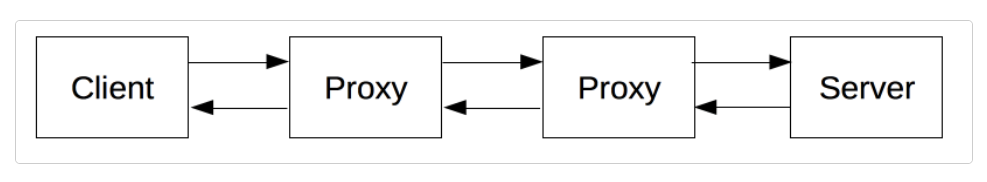
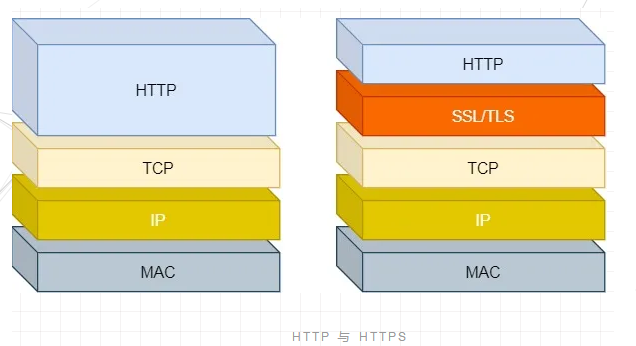
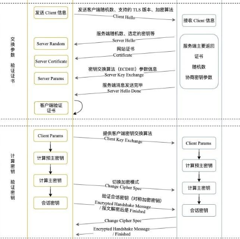

# HTTP

超文本传输协议（HTTP）是一个用于传输超媒体文档（例如 HTML）的应用层协议。它是为 Web 浏览器与 Web 服务器之间的通信而设计的，但也可以用于其他目的。HTTP 遵循经典的客户端—服务端模型，客户端通过 TCP 或者是 TLS 打开一个连接以发出请求（request），然后等待直到收到服务器端响应（response）。HTTP 是无状态协议，这意味着服务器不会在两个请求之间保留任何数据（状态）。



**在客户端与服务端之间，还有许多的被称为代理的实体，履行不同的作用**：
1. 缓存（可以是公开的也可以是私有的，如浏览器的缓存）
2. 过滤（如反病毒扫描、家长控制...）
3. 负载均衡（让多个服务器服务不同的请求）
4. 认证（控制对不同资源的访问）
5. 日志（使得代理可以存储历史信息）

## HTTP 报文结构

由请求（响应）起始行 + 请求（响应）头部 + 空行（**区分头部与实体**） + 实体（body）构成。其中请求(响应)起始行分别为方法 + URI路径 + HTTP版本 （版本 + 状态码 + 原因Reason）:


**空行之前不能存在空行的原因：多余的空行会导致空行后的内容全部被视为实体**。

**首部字段的格式特点**：字段名不区分大小写、不允许出现空格，不可以出现下划线 _、字段名后必须紧跟着冒号（:）

## HTTP 的特点（优缺点）

**HTTP 1.0 默认短连接**（一个请求对应一个TCP连接），**HTTP 1.1 默认长连接**（一个TCP连接可发多个请求，因此可**管道传输即当前请求响应前可继续发送下一请求**）：减少了重复建立和断开 TCP 连接所造成的额外开销，减轻了服务器端的负载，**减少整体的响应时间**。

```
HTTP 请求启动 KeepAlive (长连接)需要服务端来设置的，比如 Nginx 配置
http {
  # 客户端连接在服务端保持开启的超时值
  keepalive_timeout 120s;
  # 可以服务的请求的最大数量
  keepalive_requests 10000;
}
```

1. **简单易理解（优点）**：报文格式就是 `header + body`，头部信息也是 `key-value` 简单文本的形式。
2. **灵活易扩展（优点）**：语义自由（除基本格式外没严格语法限制），传输形式多样（文本、图片、视频等）、工作在应用层，下层可随意变化（HTTPS 增加 SSL/TLS 安全传输层，HTTP/3 甚至 TCP 替换成基于 UDP 的 QUIC）。
3. **明文传输**：报文(主要是头部)使用文本形式，调试便利（优点）， 但也暴露给攻击者（缺点）。
4. **无状态**：不需要保存连接上下文信息场景（优点），长连接的场景下（缺点）。
5. **HTTP 1.1存在队头阻塞**（缺点）：开启长连接，虽然可以不等响应发起新请求，但需要按顺序响应请求，前面的请求没响应之前会产生阻塞。
5. **不安全**（缺点）：不验证通信方的身份，无法证明报文的完整性、通信明文（不加密）。
6. （优点）**跨平台、应用广泛**，（缺点）**请求单向性、无优先级控制、按顺序响应、首部冗长未压缩**。

## HTTP 响应状态码

HTTP 响应状态码用来表明特定 HTTP 请求是否成功完成。响应被归为五大类：

### 1. 信息响应 (100–199)

表示目前是协议处理的中间状态，还需要后续操作。

1. **100 Continue**。表示目前为止一切正常，客户端应该继续请求，如果已完成请求则忽略。如果要让服务器检查请求头，客户端必须在初始请求中发送 Expect: 100-continue 作为标头，并发送带 body 的实际请求之前接收 100 Continue。
2. **101 Switching Protocols**。表示服务器同意升级协议，协议由客户端在 Upgrade 请求头中降序列举，由服务器在 Upgrade 响应头中确认。只能切换到更高级的协议，例如，HTTP 升级为 WebSocket。
3. <font color="gray">102 Processing 正在处理。向客户端指示已收到完整请求并且服务器正在处理该请求。仅当服务器预计请求需要很长时间时才发送，它告诉客户端请求尚未终止。已弃用，不应再发送，客户可能仍接受它，但会忽略。</font>
4. **103 Early Hints 早期提示**。由服务器仍在准备响应时发送，并提示客户端服务器期望最终响应将链接的资源。这允许浏览器甚至在服务器准备并发送最终响应之前就开始预加载资源。主要与指示要加载的资源的 Link 标头一起使用，也还可能包含处理早期提示时强制执行的 Content-Security-Policy 标头（比如，早期响应通过将 CSP 设置为”self”限制为与请求相同的源才预加载资源。虽然最终响应可能会将 CSP 设置为无，即资源已被预加载，但不会被使用）。服务器可能会在重定向后发送多个 103 响应。浏览器只处理第一个早期提示响应，如果请求导致跨源重定向，则必须丢弃该响应。来自早期提示的预加载资源会有效地预加载到文档的 head 元素中，然后才是最终响应中加载的资源。出于兼容性考虑（Chrome103+/Firefox102+且需要用户主动启用，Edge103+且支持范围限制在 HTTP/2 或更高版本），除非已知客户端能正确处理该响应，建议只通过 HTTP/2 或更高版本发送早期提示响应。

### 2. 成功响应 (200–299)

**表示成功状态**。

1. **200 OK**。表明请求已经成功。默认情况下状态码为 200 的响应可以被缓存。成功的含义取决于HTTP请求方法：
    1. GET: 资源已被获取并在消息体中传输。
    2. HEAD: 表示标头包含在响应中，没有任何消息正文（body）。
    3. POST: 资源已被获取并在消息体中传输。
    4. TRACE: 响应的消息体中包含服务器接收到的请求信息。
    5. PUT 和 DELETE 的请求成功通常并不是响应200 OK 而是204 No Content （或者201 Created）。
2. **201 Created**，表示请求已经被成功处理，并且创建了新的资源。新的资源在应答返回之前已经被创建。同时新增的资源会在应答消息体中返回，其地址或者是原始请求的路径，或者是 Location 首部的值。常规使用场景是作为 POST 请求的结果。
3. **202 Accepted**。表示请求已被接受处理，但处理尚未完成；事实上，处理可能还没有开始。该请求最终可能会或可能不会被执行，因为在实际处理时可能会拒绝该请求。它是非承诺性的，即 HTTP 无法在稍后发送异步响应，说明处理请求的结果。它适用于另一个进程或服务器处理请求或批处理的情况。
4. **203 Non-Authoritative Information 非授权信息**。表明请求已成功，但转换代理已根据源服务器的 200 (OK) 响应修改了随附的有效负载。它类似于 Warning 首部的 214（Transformation Applied）警告码，后者的优势在于可以应用于任何状态码的响应之中。
5. **204 No Content**。表示请求已成功，但客户端不需要离开其当前页面。默认情况下 204 响应是可缓存的（此类响应中包含 ETag 标头）。适用于PUT和DELETE 请求。例如，在 PUT 请求中进行资源更新，但是不需要改变当前展示给用户的页面，那么返回 204 No Content；如果创建了资源，则返回 201 Created；如果应将页面更改为新更新的页面，则应改用 200。虽然此状态代码旨在描述无body的响应，但服务器可能会错误地将数据包含在标头之后。该协议允许用户代理以不同方式处理此类响应，在持久连接中是可以观察到的，其中无效 body 可能包括对后续请求的不同响应。 Safari 拒绝任何此类数据。Chrome 和 Edge 在有效响应之前最多丢弃四个无效字节。Firefox 在有效响应之前可以容忍超过 1 KB 的无效数据。
6. **205 Reset Content**。告诉客户端重置文档视图，例如清除表单的内容、重置canvas状态或刷新 UI。如果此响应错误地包含持久连接上的body，不同浏览器的处理行为与204同。
7. **206 Partial Content 部分内容**。表示请求已成功，并且body中包含请求中Range首部指定的数据范围结果。如果只包含一个数据区间，那么整个响应的Content-Type首部的值为所请求的文件的类型，同时包含 Content-Range首部；如果包含多个数据区间，那么整个响应的 Content-Type首部的值为 multipart/byteranges，每个片段覆盖一个数据区间并用 Content-Range 和 Content-Type 进行描述。**使用场景为 HTTP 分块下载和断点续传**。
8. **207 Multi-Status 多状态**。响应体是带有多状态根元素的`文本/xml` 或应用程序 /xml HTTP 实体。XML body 将列出所有单独的响应代码。返回资源集合的能力是 WebDAV 协议的一部分（它可以由访问 WebDAV 服务器的 Web 应用程序接收）。访问网页的浏览器永远不会遇到此状态代码。
9. **208 Already Reported**。用于207响应中，以节省空间并避免冲突。如果以不同的路径多次请求同一资源（例如作为集合的一部分），则只有第一个资源会报告 200。所有其他绑定的响应将报告此 208 状态代码，因此不会产生冲突，并且响应保持较短。将资源绑定到多个路径的能力是 WebDAV 协议的扩展（它可以由访问 WebDAV 服务器的 Web 应用程序接收）。访问网页的浏览器永远不会遇到此状态代码。
10. **226 IM Used 已使用 IM**。在增量编码的上下文中由服务器设置以指示它正在返回其收到的GET请求的增量。浏览器不支持 HTTP 增量编码（delta encoding），此状态代码由特定客户端使用的自定义服务器发回。使用增量编码时，服务器会用相对于给定基础文档（而不是当前文档）的差异（称为deltas）来响应GET请求。客户端使用 HTTP 标头 A-IM 表示要使用哪种差异算法，并使用 If-None-Match 标头提示服务器它得到的最新版本。服务器会生成一个delta，并在包含 IM 标头（使用的算法名称）和 Delta-Base 标头（与 delta 相关联的基础文档的 ETag）的 226 响应中发送回来。

### 3. 重定向消息 (300–399)

**重定向状态，资源位置发生变动，需要重新请求**。

1. **300  Multiple Choices**。表示该请求有多个可能的响应。用户代理或用户应该选择其中之一，但由于没有如何选择的标准方法，因此该状态码很少使用。如果服务器有首选选择，它应该生成 Location 标头。
2. **301 Moved Permanently** 永久重定向。表示请求的资源已明确移动到 Location 标头给出的 URL。浏览器会重定向到新的 URL，搜索引擎也会更新其资源链接。虽然规范要求在执行重定向时method和body保持不变，但并非所有用户代理都符合。由于该状态明确禁止更改方法，请仅将 301 用作 GET 或 HEAD 方法的响应，而将 308 用于 POST 方法。比如，http永久重定向到https（会做缓存优化）。
3. **302 Found**，即临时重定向。表明请求的资源被暂时的移动到了由Location 指定的 URL 上，客户端应继续使用原有URI。不会做缓存优化，浏览器会重定向到这个 URL，但是搜索引擎不会对该资源的链接进行更新 (用 "搜索引擎优化术语 "来说，就是 "链接汁液 "不会被发送到新的 URL 上)。即使规范要求浏览器在重定向时保证请求method和请求body不变，但并不是所有的用户代理都会遵循。由于该状态明确禁止更改方法，所以推荐仅将 302 用作 GET 或 HEAD 方法的响应，而在其他时候使用307来替代。在确实需要将重定向请求的方法转换为 GET的场景下，可以使用 303，比如在使用 PUT 方法进行文件上传操作时，需要返回确认信息（例如“你已经成功上传了 xyz”）而不是上传的资源本身。
4. **303 See Other** 参阅其他。表示重定向不链接到所请求的资源本身，而是链接到另一个页面（例如确认页面，或上传进度页面）。它通常作为 PUT 或 POST 的结果发回。用于显示此重定向页面的方法始终是 GET。
5. **304 Not Modified** 未修改（缓存重定向）。表示无需重传所请求的资源。这是对缓存资源的隐式重定向，缓存控制中当协商缓存命中时（即客户端提供一个头信息指出客户端希望只返回在指定日期之后修改的资源）会返回。当请求方法是安全方法（例如 GET 或 HEAD）时，或者当请求是有条件的并使用 If-None-Match 或 If-Modified-Since 标头时会发生。响应不得包含body，并且必须包含在等效 200 OK 响应中发送的标头：Cache-Control、Content-Location、Date、ETag、Expires 和 Vary。许多开发工具的浏览器网络面板都会创建导致 304 响应的无关请求，因此开发人员可以看到对本地缓存的访问。(6)如果此响应错误地包含持久连接上的body，不同浏览器的处理行为与204同。
6. **307 Temporary Redirect** 临时重定向。表示请求的资源已暂时移动到 Location 标头给出的 URL。原始请求的method和body将被重新用于执行重定向请求。如果希望使用的方法改为 GET，请使用 303 代替。307和302唯一的区别是307保证重定向请求时方法和主体不会改变。对于 302，一些旧客户端错误地将方法更改为 GET：使用非 GET 方法和 302 的行为在 Web 上是不可预测的，而使用 307 的行为是可预测的。对于 GET 请求，它们的行为是相同的。
7. **308 Permanent Redirect** 永久重定向。表示请求的资源已明确移动到 Location 标头给出的 URL。浏览器重定向到此页面，搜索引擎更新其到该资源的链接。请求method和body不会改变，而 301 有时可能会错误地更改为 GET 方法。某些 Web 应用程序可能会以非标准方式或出于其他目的使用 308 Permanent Redirect。例如，Google Drive 使用 308 Resume Incomplete 响应来向客户端指示不完整的上传何时停止。 

### 4. 客户端错误响应 (400–499)

**请求报文有误**。

1. **400 Bad Request** 表示服务器因某些被认为是客户端错误的原因（例如，请求语法错误、无效请求消息格式或者欺骗性请求路由），而无法或不会处理该请求。警告： 客户端不应该在未进行修改的情况下重复发送此请求。
2. **401 Unauthorized**  未授权。表示客户端请求尚未完成，因为它缺少所请求资源的有效身份验证凭据。会与包含有如何进行验证的信息的WWW-Authenticate 首部一起发送。该状态码类似于 403 Forbidden，区别是依然可以进行身份验证。
3. **402 Payment Required** 需要付款。被创建最初目的是用于数字现金或微型支付系统，表明客户端请求的内容只有付费之后才能获取。目前还不存在标准的使用约定，不同的实体可以在不同的环境下使用。是一个非标准响应状态码，该状态码被保留但未定义，实际上没有浏览器支持它。
4. **403 Forbidden** 禁止。表示服务器理解该请求但拒绝授权。类似于 401，但进入 403状态后即使重新验证也不会改变该状态。该访问是长期禁止的，并且与应用逻辑密切相关（例如没有足够的权限访问该资源）。
5. **404 Not Found** 找不到。表示服务器无法找到请求的资源。指向 404 页面的链接通常被称为断链或死链。404 只表示资源丢失，而不表示是暂时还是永久丢失。如果资源被永久删除，请使用 410。可以显示自定义 404 页面，以便为用户提供更多帮助，并提供下一步操作的指导。例如，对于 Apache 服务器，可以在 .htaccess 文件中指定自定义 404 页面的路径（定制设计是好事，但要适度。可以使404 页面变得幽默且人性化，但不要让用户感到困惑。）
6. **405 Method Not Allowed** 方法不允许。表示服务器知道请求方法，但目标资源不支持此方法。服务器必须在 405 中生成一个Allow标头。该字段必须包含目标资源当前支持的方法列表。
7. **406 Not Acceptable** 不可接受的。表示服务器无法生成与请求中的主动内容协商标头（Accept、Accept-Encoding、Accept-Language）中定义的可接受值列表相匹配的响应，并且服务器不愿意提供默认表示。实际上，这个错误很少被使用。服务器不会使用此错误代码进行响应（这对于最终用户来说是神秘的且难以修复），而是忽略相关标头并向用户提供实际页面。如果服务器返回此状态码，则消息body应包含资源的可用表示形式的列表，允许用户在其中进行选择。
8. **407 Proxy Authentication Required** 需要代理授权。由于缺乏位于浏览器与可以访问所请求资源的服务器之间的代理服务器（proxy server ）要求的身份验证凭证，发送的请求尚未得到满足。会与包含有如何进行验证的信息的Proxy-Authenticate 首部一起发送。
9. **408 Request Timeout** 请求超时。表示服务器想要关闭这个未使用的连接。即使客户端之前没有任何请求，它也会由某些服务器在空闲连接上发送。服务器应该在响应中发送“close”Connection 标头字段，因为 408 意味着服务器已决定关闭连接而不是继续等待。由于某些浏览器（例如 Chrome、Firefox 27+ 和 IE9）使用 HTTP 预连接机制来加快网络速度，因此该响应的使用更加频繁。有些服务器只是关闭连接而不发送此消息。
10. **409 Conflict** 冲突。表示请求与目标资源的当前状态发生冲突。在响应 PUT 请求时最有可能发生冲突。例如，在上传比服务器上现有文件更旧的文件时，可能会收到 409，从而导致版本控制冲突。
11. **410 Gone** 消失。表示源服务器不再提供对目标资源的访问，并且这种情况可能是永久性的。如果不知道这种情况是暂时的还是永久的，则应使用 404。410 默认是可缓存的。
12. **411 Length Required** 表示服务器拒绝接受没有定义 Content-Length 标头的请求。根据规范，当使用分块模式传输数据时，Content-Length 头信息会被省略，需要在每个数据块的开头以十六进制格式添加当前数据块的长度。
13. **412 Precondition Failed** 前提条件失败。表示对目标资源的访问已被拒绝。当不满足 If-Unmodified-Since 或 If-None-Match 标头定义的条件时，除 GET 或 HEAD 之外的方法上的条件请求会发生这种情况，请求（通常是上传或修改资源）将无法执行，从而返回该错误状态码。
14. **413 Content Too Large** 内容过大。表示请求实体大于服务器定义的限制；服务器可能会关闭连接或返回 Retry-After 标头。在 RFC 9110 之前，状态的响应短语是 Payload Too Large，此名字至今仍被广泛使用。
15. **414 URI Too Long URI** 太长。表示客户端请求的 URI 比服务器愿意解释的长度长。客户端不恰当地将 POST 请求转换为带有较长查询信息的 GET 请求、客户端陷入重定向循环（例如，重定向 URI 前缀指向自身的后缀）、或当服务器受到试图利用潜在安全漏洞的客户端攻击时会出现此情况。
16. **415 Unsupported Media Type** 不支持的媒体类型。表示服务器拒绝接受请求，因为有效载荷格式是不支持的格式。格式问题的出现有可能源于客户端在 Content-Type 或 Content-Encoding 首部中指定的格式，也可能源于直接对负载数据进行检测的结果。
17. **416 Range Not Satisfiable** 范围不满足。表示服务器无法为请求的范围提供服务。最可能的原因是文档不包含此类范围，或者 Range 标头值虽然语法正确，但没有意义。416 响应报文包含一个 Content-Range 首部，提示无法满足的数据区间（用星号 * 表示），后面紧跟着一个“/”，再后面是当前资源的长度。例如：Content-Range: */12777。面对此错误，浏览器通常要么中止操作（例如，下载将被视为不可恢复），要么再次请求整个文档。
18. **417 Expectation Failed** 不满足期望。表示无法满足请求的 Expect 标头中给出的期望。
19. **418 I'm a teapot** 我是一个茶壶。表示服务器拒绝冲泡咖啡，因为它永远是茶壶。暂时没有咖啡壶/茶壶的组合应该返回 503。此错误引用了 1998 年和 2014 年愚人节笑话中定义的超文本咖啡壶控制协议。一些网站使用此响应来处理不希望处理的请求，例如自动查询。
20. **421 Misdirected Request** 表示请求被定向到无法生成响应的服务器。如果重用连接或选择替代服务时可能出现此情况。
(21)422 Unprocessable Content 表示服务器了解请求实体的内容类型，并且请求实体的语法正确，但无法处理所包含的指令。警告：客户端不应在未经修改的情况下重复此请求。
22. **423 Locked** 表示暂定目标的资源已被锁定，即无法访问。其内容应包含一些 WebDAV XML 格式的信息。锁定资源的功能特定于某些 WebDAV 服务器。浏览器访问网页永远不会遇到这个状态码；如果发生错误，它们会将其作为通用 400 状态码进行处理。
23. **424 Failed Dependency** 表示无法对资源执行该方法，因为请求的操作依赖于另一个操作，并且该操作失败。常规 Web 服务器通常不会返回此状态代码。但其他一些协议（例如 WebDAV）可以返回它。例如，在 WebDAV 中，如果发出 PROPPATCH 请求，并且一个命令失败，则所有其他命令也会自动失败，并显示 424 Failed Dependency。
24. **425 Too Early** 表示服务器不愿意冒险处理可能重播的请求，这会产生重播攻击的可能性。
25. **426 Upgrade required** 表示服务器拒绝使用当前协议执行请求，但在客户端升级到不同协议后可以接受。服务器会在响应中使用 Upgrade 首部来指定要求的协议。
26. **428 Precondition required** 表示服务器要求发送条件请求。通常，这意味着缺少必需的条件首部，例如 If-Match。而当一个条件首部的值不能匹配服务器端的状态的时，应答的状态码应该是 412 Precondition Failed，前置条件验证失败。
27. **429 Too Many Requests** 表示用户在给定时间内发送了太多请求（“速率限制”）。此响应中可能包含 Retry-After 标头，指示在发出新请求之前需要等待多长时间。
28. **431 Request Header Fields Too Large** 表示服务器拒绝处理该请求，因为请求的 HTTP 标头太长。减少请求标头的大小后可以重新提交请求。当请求头的总大小太大，或者单个头字段太大时，可以使用431。为帮助用户解决问题，应在响应body中指出这两个错误中的哪一个是问题所在且包括哪些标头太大。引用 URL 太长或请求中发送的 Cookie 太多时服务器通常会使用此状态码。
29. **451 Unavailable For Legal Reasons** 表示用户请求的资源由于法律原因不可用，例如已发出法律诉讼的网页。

### 5. 服务端错误响应 (500–599)

**服务器端发生错误**。
1. **500 Internal Server Error** 表示服务器遇到了意外情况，导致其无法完成请求。这个错误代码是一个通用的“万能”响应代码。有时候，对于类似于 500 这样的错误，服务器管理员会更加详细地记录相关的请求信息来防止以后同样错误的出现。
2. **501 Not Implemented** 表示服务器不支持完成请求所需的功能。此状态还可以发送 Retry-After 标头，告诉请求者何时检查以查看届时是否支持该功能。当服务器无法识别请求方法并且无法支持任何资源时，501 是恰当的响应。服务器唯一必须支持的方法是 GET 和 HEAD，因此不得返回 501。如果服务器确实能识别该方法，但故意不支持它，则适当的响应是 405 方法不允许。默认情况下，501 响应是可缓存的。501 错误需要所尝试访问的网络服务器来进行修复。
3. **502 Bad Gateway** 表示服务器在充当网关或代理时从上游服务器收到无效响应。网关可能指的是网络中的不同事物，502 错误通常无法修复，但需要 Web 服务器或尝试访问的代理进行修复。
4. **503 Service Unavailable** 表示服务器尚未准备好处理请求。常见原因是服务器因维护而停机或过载。此响应应用于临时情况，并且 Retry-After HTTP 标头应（如果可能）包含服务恢复的估计时间以及解释问题的用户友好页面。应注意随此响应一起发送的与缓存相关的标头，因为503 通常是一种临时状态，响应通常不应被缓存。
5. **504 Gateway Timeout** 表示服务器在充当网关或代理时，没有及时从上游服务器获得完成请求所需的响应。
6. **505 HTTP Version Not Supported** 表示服务器不支持请求中使用的 HTTP 版本。
7. **506 Variant Also Negotiates** 表示服务器内部配置错误，此时所选变体本身被配置为参与内容协商，因此不是一个合适的协商端点。可在透明内容协商（见 RFC 2295）中给出。在服务器支持多种变体的情况下，该协议使客户端能够检索给定资源的最佳变体。
8. **507 Insufficient Storage** 可以在 WebDAV 协议（基于 web 的分布式创作和版本控制，参见 RFC 4918）中给出。表示服务器不能存储相关内容。准确地说，一个方法可能没有被执行，因为服务器不能存储其表达形式，这里的表达形式指：方法所附带的数据，而且其请求必需已经发送成功。
9. **508 Loop Detected** 表示服务器终止了操作，因为在处理“Depth: infinity”的请求时遇到无限循环。此状态表明整个操作失败。可以在 WebDAV 协议（基于 Web 的分布式创作和版本控制）中给出。
10. **510 Not Extended** 在 HTTP 扩展框架协议（参见 RFC 2774）中发送。在 HTTP 扩展框架协议中，一个客户端可以发送一个包含扩展声明的请求，该声明描述了要使用的扩展。如果服务器接收到这样的请求，但是请求不支持任何所描述的扩展，那么服务器将使用 510 状态码进行响应。
11. **511 Network Authentication Required** 表示客户端需要通过验证才能使用该网络。该状态码不是由源头服务器生成的，而是由控制网络访问的拦截代理服务器生成的。网络运营商有时在授予访问权限之前需要进行一些身份验证、接受条款或其他用户交互（例如在网吧或机场）。他们经常使用媒体访问控制 (MAC，Media Access Control) 地址来识别尚未这样做的客户端。

## HTTP 请求方法

### 幂等、安全、可缓存

1. **幂等**：指的是同样的请求被执行一次与连续执行多次的效果是一样的，服务器的状态也是一样的。幂等方法不应该具有副作用（统计用途除外）。在正确实现的条件下， GET， HEAD、PUT、DELETE、OPTIONS和TRACE方法都是幂等的，而 POST、CONNECT和PATCH方法不是。所有的安全方法都是幂等的。幂等性只与后端服务器的实际状态有关，而每一次请求接收到的状态码不一定相同（例如，第一次调用 DELETE 方法有可能返回200 ，但是后续的请求由于已经删除可能会返回 404）。需要主义的是，服务器不一定会确保请求方法的幂等性，有些应用可能会错误地打破幂等性约束。
2. **安全**：指的是不会修改服务器数据，对服务器是只读操作。安不安全的定义是这个方法需不需要服务器修改数据。所有安全的方法都是幂等的，但并非所有幂等方法都是安全的，PUT、POST、CONNECT和DELETE方法不是安全的。建议任何应用都不应让 GET 请求修改服务端的状态（数据）。安全的方法并不意味着只是对服务端的静态文件的请求，服务端可以在请求的时候即时生成资源返回，只要生成资源的脚本保证是安全的即可。
3. **可缓存**：指的是可以缓存的 HTTP 响应，它被存储起来以便后续的检索和使用，省去了对服务器的新的请求。对一些不可缓存的请求/响应可能会使先前缓存的响应失效，比如PUT 将使所有对同一 URI 的 GET 或 HEAD 的缓存请求失效。并非所有的 HTTP 响应都可以被缓存，需同时满足条件：
    1. 请求中使用的方法本身就是可缓存的，即 GET 或 HEAD 方法。如果指示了有效期并且设置了 Content-Location 标头，POST 或 PATCH 请求的响应也可以被缓存，但是这很少被实现，比如Firefox 就不支持它。其他方法，如 PUT 或 DELETE 是不可缓存的，其结果也不能被缓存。
    2. 响应的状态码对应用程序的缓存可知，且被认为是可缓存的。可缓存状态码有：200、203、204、206、300、301、404、405、410、414 和 501。
    3. 响应中与缓存相关的特定标头，如 Cache-Control。

### CONNECT

**CONNECT 请求方法**可以开启与所请求资源之间的双向沟通的通道，它可以用来创建隧道（tunnel）。它是一个逐跳（hop-by-hop）的方法。**请求与响应均无 body、不安全、不幂等、不可缓存以及不允许在HTML表单中使用**。客户端要求 HTTP 代理服务器将 TCP 连接作为通往目的主机的隧道，代理服务器会面向客户端发送或接收 TCP 数据流。它可以用来访问采用了 SSL（HTTPS）协议的站点。

### DELETE

**DELETE 请求方法**用于删除指定的资源。**请求与响应均可能有 body、不安全、幂等、不可缓存以及不允许在 HTML 表单中使用**。方法成功执行可能响应状态码为200（操作已执行且响应消息包含描述状态的表示）、202（操作可能会成功但尚未实施）或204（操作已执行且无需提供进一步信息）。

### HEAD

**HEAD 请求方法**请求资源的标头信息，并且这些标头与 GET方法请求时返回的一致。**请求与响应均无 body、安全、幂等、可缓存以及不允许在HTML表单中使用**。一个使用场景是在下载大文件前先通过 HEAD 请求读取其 Content-Length 标头的值获取文件的大小，而无需实际下载文件，以此可以节约带宽资源。HEAD 方法的响应不应有body，如果有，则必须忽略：任何可能描述错误body的表示标头都被假定为描述类似 GET 请求将收到的响应。如果 HEAD 请求的响应表明缓存的URL响应已过期，那么即使没有发出 GET 请求，缓存副本也会失效。

### OPTIONS

**OPTIONS 请求方法**请求给定 URL 或服务器所允许的通信选项。客户端可以使用此方法指定 URL，或使用星号 (*) 来引用整个服务器。**请求无 body、响应有body、安全、幂等、不可缓存以及不允许在HTML表单中使用**。200 OK 和 204 No Content 都是允许的状态码。使用场景：1. 检测服务器所支持的请求方法；2. 发起CORS 中的预检请求以检测实际请求是否可以被服务器所接受。

### PATCH

**PATCH 请求方法**用于对资源进行部分修改，类似于CURD（创建：Create，读取：Read，更新：Update，删除：Delete）中的更新。与PUT 是一个资源的完整表述形成对比，PATCH 请求是一组关于如何修改资源的指令。**请求无 body，响应可能有 body、不安全、不幂等、不可缓存以及不允许在 HTML 表单中使用**。任何 2xx 状态码都代表成功的响应。服务器可以通过将其加入 Allow 或 Access-Control-Allow-Methods 响应标头中的列表来宣告其支持PATCH 方法或者 Accept-Patch 标头的存在。

### PUT

**PUT 请求方法**创建一个新的资源或用请求的有效载荷替换目标资源的表示。和post的区别在于PUT是幂等的。**请求有 body，响应可能有body、不安全、幂等、不可缓存以及不允许在 HTML 表单中使用**。如果目标资源没有当前的表示，并且 PUT 方法成功创建了资源，那么源服务器必须返回 201（Created）来通知用户代理资源已创建。如果目标资源已经存在，并且依照请求中封装的表现形式成功进行了更新，那么，源服务器必须返回 200（OK）或 204（No Content）来表示请求成功完成。

### TRACE

**TRACE 请求方法**沿着通往目标资源的路径进行信息回环（loop-back）测试，提供了一种实用的 debug 机制。**请求和响应均无body、安全、幂等、不可缓存以及不允许在 HTML 表单中使用**。请求的最终接收者（源服务器或第一个在请求中收到 Max-Forwards 值为 0 的服务器）应将收到的信息作为 200（OK）响应的信息body反映给客户端，其 Content-Type 为 message/http。

### GET

**GET 请求方法**请求指定资源的表示。使用 GET 的请求应该只用于请求数据，而不应该包含数据。**请求无 body，响应有 body、安全、幂等、可缓存以及允许在 HTML 表单中使用**。在 GET 请求中发送请求体或有效载荷可能会导致一些现有的实现拒绝该请求——虽然规范没有禁止，但语义没有定义，因此最好是避免在 GET 请求中发送有效载荷。

### POST

**POST 请求方法**发送数据给服务器。请求主体的类型由 Content-Type 标头指定。**请求和响应均有 body、不安全、不幂等、仅在包含足够新的信息时可缓存以及允许在HTML表单中使用**。POST 请求若是通过 HTML 表单发送，其内容类型（content type）是通过在 `<form>` 元素中设置正确的 enctype 属性，或是在 `<input>` 和 `<button>` 元素中设置 formenctype 属性来选择的；若是通过 AJAX（XMLHttpRequest 或 fetch）发送时，请求 body 可以是任何类型。据HTTP 1.1 规范所描述，POST 设计用途是：
1. 对现有资源进行注释；
2. 在公告板，新闻组，邮件列表或类似的文章组中发布消息；
3. 通过注册模板新增用户；
4. 向数据处理过程提供一批数据，例如提交一个表单；
5. 通过追加操作，扩展数据库数据。

### GET 与 POST 的区别

根据HTTP/1.1-RFC7231中的描述，不同的请求方法仅有语义上的差别（GET请求资源；POST提交资源），并无实质的不同，之所以造成开发上的区别，是因为在具体的实现环境——浏览器中，针对不同的请求方法设置了不同的协议实现方式（GET请求体为空，POST有请求体），从而造成了以下区别：
1. **安全角度**：如果说一个 HTTP 方法是安全的，是指这是个不会修改服务器的数据的方法。也就是说，这是一个对服务器只读操作的方法。因此POST 是不安全的，GET是安全的。
2. **缓存角度**：GET 请求会被浏览器主动缓存历史记录，POST 默认不会（如果指示新鲜度并且设置了 Content-Location 标头则可以）。GET请求的地址还可以被保存在浏览器书签，POST则不可以。
3. **编码角度**：GET只能进行URL 编码，只接收ASCII字符，POST无限制。因为GET数据是在请求行中，POST数据是在请求体中。
4. **参数角度**：GET一般放在 URL 中（不安全），POST 放在请求body中（适合传输敏感信息）。
5. **幂等性角度**：GET是幂等的（执行相同操作，结果不变），而POST不是。若当前页面是通过POST请求得到的，则浏览器会提示用户是否重新提交。GET请求得到的页面则没有提示。
6. **大小限制角度**：GET，POST本身均无限制，但前者依赖URL，不同的浏览器对于 URL 是有限制的，比如 IE 浏览器对于 URL 的限制为 2KB，而 Chrome，FireFox 浏览器理论上对于 URL 是没有限制的。
7. **TCP 角度**：GET将“header + data请求报文”一次发送，而 POST会发送两个 TCP 数据包，先发 header 部分，如果服务器响应100(continue)，然后再发 body 部分。(火狐浏览器除外，它的 POST 请求只发一个 TCP 包)。**优点体现：在网络环境好的情况下，发一次包和两次包的事件差别基本可无视。而网络环境差时，两次包的TCP在验证数据包完整性上优点很大**。

## HTTP 发展


### HTTP 1

1989年，网络传输超文本系统 Mesh 被 Tim Berners-Lee 博士提出，1990 年更名为万维网（World Wide Web）。1991 年 8 月 16 日万维网公开发表。它在现有的 TCP 和 IP 协议基础之上建立，由四个部分组成：
1. 一个用来表示超文本文档的文本格式，超文本标记语言（HTML）。
2. 一个用来交换超文本文档的简单协议，超文本传输协议（HTTP）。
3. 一个显示（以及编辑）超文本文档的客户端，即首个网络浏览器 WorldWideWeb。
4. 一个服务器用于提供可访问的文档，即 httpd 的前身。

HTTP 的最初版本没有版本号，后来为了与后来的版本区分，被称为 0.9 即 HTTP/0.9，也叫做叫做单行（one-line）协议，请求由单行指令构成，以唯一可用方法 GET 开头，其后跟目标资源的路径（由于一旦连接到服务器就不需要协议、服务器和端口，因此不包括完整的 URL），以空格分隔，比如GET /mypage.html。响应只包含响应文档本身，并不包含 HTTP 头，只能传输HTML文件，没有状态码，出现错误则响应的是包含问题描述信息的 HTML 文件。

HTTP/1.0 是浏览器和服务器在HTTP/0.9增加扩展功能，但并未形成官方标准：
1. 协议版本信息随请求发送（GET行追加HTTP/1.0）
2. 状态码会在响应开始时发送，使浏览器能了解请求执行成功或失败，并相应调整行为（如更新或使用本地缓存）。
3. 引入了 HTTP 标头的概念，无论是对于请求还是响应，允许传输元数据，使协议变得非常灵活，更具扩展性。
4. 在新 HTTP 标头的帮助下，具备了传输除纯文本 HTML 文件以外其他类型文档的能力（凭借 Content-Type 标头）。

1997 年，HTTP/1.1 以 RFC 2068 文件发布：
1. 连接可以复用，节省了多次打开 TCP 连接加载网页文档资源的时间。
2. 增加管线化技术，允许在第一个应答被完全发送之前就发送第二个请求，以降低通信延迟。
3. 支持响应分块。
4. 引入额外的缓存控制机制。
5. 引入内容协商机制，包括语言、编码、类型等。并允许客户端和服务器之间约定以最合适的内容进行交换。
6. 凭借 Host 标头，能够使不同域名配置在同一个 IP 地址的服务器上。

### HTTPS

HTTPS 通过**信息加密**（通过 SSL/TLS 混合加密，而 HTTP 是明文传输无状态协议）、**CA 身份证书**（存放公钥，且通过证书进行身份认证）、**校验机制**（摘要算法）解决 HTTP 所存在的窃听、篡改、冒充风险。HTTPS 的端口号是 443（HTTP 是 80），比 HTTP 多 SSL/TLS 的握手过程。



> **混合加密：非对称加密**（通信建立前非对称加密「会话秘钥」—**解决了密钥交换问题，但速度慢**） + **对称加密**（通信过程中使用「会话秘钥」对称加密明文数据—**运算速度快，但密钥交换不安全**）。

#### TLS

传输层安全 (TLS, Transport Layer Security) 协议是使两个联网应用程序或设备能够私密且可靠地交换信息的标准。使用TLS进行任何连接的安全性取决于密码套件和所选的安全性参数。Mozilla 操作安全 (OpSec) 团队为使用TLS的服务器维护的 [TLS 配置生成器](https://ssl-config.mozilla.org/)与[配置指南](https://wiki.mozilla.org/Security/Server_Side_TLS)。

HTTPS 是基于 Netscape 推出的安全套接字层 (SSL) 2.0 技术推出的，随后更新为 SSL 3.0。互联网工程任务组( IETF) 于 1999 年 1 月指定 TLS 1.0作为通用的标准加密技术来确保所有 Web 浏览器和服务器之间的互操作性，TLS的当前版本是 1.3。
TLS 提供三项主要服务：
1. 验证：身份验证让通信各方验证对方是否是声称的身份。
2. 加密：数据在用户代理和服务器之间传输时被加密，以防止未经授权的各方读取和解释。
3. 正直：TLS 确保在加密、传输和解密数据之间不会丢失、损坏、篡改或伪造信息。

TLS 握手协商的主要参数是密码套件。在 TLS 1.2 及更早版本中，协商密码套件包括一组加密算法，这些算法共同提供共享密钥的协商、对服务器进行身份验证的方式以及用于加密数据的方法。TLS 1.3 中的密码套件主要管理数据加密，单独的协商方法用于密钥协商和身份验证。为缓解变得缓慢或无响应的问题，现代浏览器实现了 TLS 握手超时（Firefox 58开始，默认值为 30 秒，可以通过编辑 about:config 中的network.http.tls-handshake-timeout首选项来改变超时值）。TLS 1.3的主要变化：
1. 大多数情况下，TLS 1.3 握手在一次往返中完成，从而减少了握手延迟。
2. 服务器可以启用 0-RTT（零往返时间）握手。重新连接到服务器的客户端可以立即发送请求，从而完全消除 TLS 握手的延迟。尽管 0-RTT 的性能提升可能非常显着，但它们会带来一定的重放攻击风险。
3. TLS 1.3 仅支持前向安全模式，除非连接已恢复或使用预共享密钥。
4. TLS 1.3 定义了 TLS 1.3 独有的一组新密码套件。这些密码套件均使用现代的关联数据验证加密 (AEAD) 算法。
5. TLS 1.3 握手是加密的，建立共享密钥所需的消息除外。服务器和客户端证书是加密的。但客户端发送到服务器的服务器身份（server_name 或 SNI 扩展）未加密。
6. 已被禁用：重新协商、通用数据压缩、数字签名算法(DSA) 证书、静态 RSA 密钥交换以及与自定义 Diffie-Hellman (DH) 组的密钥交换。

#### 传统 SSL\TLS 四次握手（RSA版本）


1. 客户端发送“随机数 client_random + 支持加密算法”;
2. 服务器返回“随机数 server_random + 确定的加密算法（RSA） + CA证书 + 公钥（此时只有服务器具有公钥的的私钥）”;
3. 客户端验证证书通过后，生成随机数 pre_random，使用公钥对 pre_random 加密，发送给服务器。
4. 服务器用私钥解开 pre_random，最后将之前内容形成摘要返回给客户端。客户端收到回复，校验成功，握手结束。

之后的数据据传输使用约定的加密方法（RSA）对服务器和客户端都拥有的三个随机数生成的密钥 secret 进行加解密。

#### TLS 1.2 四次握手：

TLS 主流版本是1.2（TLS1.0 = SSL3.1，这之前的都被认为不安全）。TLS 1.2 四次握手如下：



1. 客户端发送“随机数client_random + TLS版本 + 加密套件列表（比如TLS_ECDHE_WITH_AES_128_GCM_SHA256：ECDHE密钥交换算法，使用128位的AES算法和主流的GCM分组模式对称加密，数字签名采用SHA256哈希摘要算法）”;
2. 服务器发送“随机数server_random + 确认 TLS版本 + 选定的加密套件列表 + CA证书（公钥）+ 使用私钥对server_params、两个随机数进行签名”;
3. 客户端使用公钥验证服务器身份通过后，获得server_params，使用其中的椭圆曲线算法、服务器临时公钥和客户端自己生成的临时私钥相乘计算出预主密钥随机数(premaster secret)，最后伪随机函数传入Client Random、Server Random、Premaster Secret 生成会话密钥，发送 client_params（包括客户端生成的椭圆曲线公钥）、切换加密模式、会话密码加密后的验证会话密码消息给服务器。
4. 服务器拿到 client_params，利用相同的方法计算出会话密钥，同样，将切换加密模式、会话密码加密后的验证会话密码消息发送给客户端验证。校验成功则握手结束。

TLS 1.3 不必等验证服务器身份而是一开始就将 client_params 发送给服务器。

#### 证书颁发机构 (CA)

**证书颁发机构 （CA）**是签署数字证书及其关联公钥的组织，从而断言所包含的信息和密钥是正确的。对于网站数字证书，此信息至少包括请求数字证书的组织名称、其所属网站以及证书颁发机构。证书颁发机构是互联网公钥基础设施的一部分，允许浏览器验证网站身份并通过 SSL（和 HTTPS）安全连接。Web浏览器预装了一个“根证书”列表。浏览器可以使用这些来可靠地检查网站证书是否由“链回”到根证书的证书颁发机构签署(即受根证书所有者或中间CA的信任)。最终，这个过程依赖于每个CA在签署证书之前执行充分的身份检查!

####  证书透明度（CT）

**证书透明度（Certificate Transparency，CT）**是一个开放的框架，旨在监测和防止证书的误发。有了证书透明度机制，新颁发的证书会被“记录”到公开运行的、通常是独立的 CT 日志中——这些日志保持着仅允许添加、有密码学保证的已颁发 TLS 证书记录。当证书被提交到 CT 日志时，一个证书签署时间戳（SCT）被生成并返回。这可作为证书已提交的证明，并将被添加到日志中。该规范指出，符合要求的服务器必须在 TLS 客户端连接时向其提供一些这样的 SCT，实现方式有：
1. X.509v3 证书扩展，直接将签名的证书时间戳嵌入叶节点证书中。通过 X.509 证书扩展，所包含的 SCT 由签发的 CA 决定。自 2021 年 6 月以来，大多数积极使用和有效的公开信任的证书都包含嵌入该扩展的透明度数据。此方法不应要求修改 Web 服务器。
2. 握手过程中发送的 signed_certificate_timestamp 类型的 TLS 扩展。
3. OCSP 装订（即 status_request TLS 扩展），并提供具有一个或多个 SCT 的 SignedCertificateTimestampList。服务器将需要更新以发送所需的数据，优点是服务器运营商可以定制 CT 日志源，提供通过 TLS 扩展/装订 OCSP 响应发送的 SCT。

Google Chrome 要求对 notBefore 日期晚于 2018 年 4 月 30 日签发的证书进行 CT 日志收录。用户将被阻止访问使用不符合规定的 TLS 证书的网站。此前，Chrome 浏览器要求对扩展验证（EV）和 Symantec 签发的证书进行 CT 收录。Apple 要求多种数目的 SCT，以使 Safari 和其他服务器信任服务器证书。Firefox 目前并不检查用户访问的网站或要求使用 CT 日志。

#### 签名

**签名或数字签名**是一种表明消息真实性的协议。数字签名依赖于非对称加密技术，也称为公钥加密技术。根据给定消息的哈希，签名过程首先使用实体的私钥生成链接到签名实体的数字签名。收到消息后，进行验证过程：
1. 验证发送者的身份 - 使用发送者的公钥来解密签名并恢复只能使用发送者的私钥创建的哈希值。
2. 检查消息完整性 - 将哈希值与接收到的文档中新计算的哈希值进行比较（如果文档已被篡改，则两个哈希值将不同）。
如果私钥被泄露或接收者被欺骗性地提供了错误的公钥，系统就会失败。

#### 数字证书

**数字证书**是将公开的加密密钥与组织绑定的数据文件。数字证书包含有关组织的信息，例如通用名称、组织单位和位置。数字证书通常由**证书颁发机构（CA）**签署，以证明其真实性。在给数字证书签名时，用到的哈希算法的强度对证书的安全性至关重要，弱的哈希算法可以使攻击者能够伪造证书。已知的弱签名算法：
1. 2012 年初移除对基于 MD5 的签名的支持。
2. 2017 年开始主流浏览器不再认为 SHA-1 证书安全（应该使用那些采用更安全的哈希算法的证书，比如 SHA-256 或 SHA-512）。

### HTTP 2

**HTTP 2** 是多路复用协议，基于HTTPS，首部执行 HPACK 压缩算法（采用“静态表（name） + 动态表（Huffman编码）”压缩，客户端与服务端维护首部信息表，相同字段发送索引号即可），报文（首部 + body）使用二进制（非文本），**支持服务器主动推送**、支持数据流的非顺序优先级请求和响应，**缺陷**：**多路复用请求使用的是同一 TCP 连接，TCP 的丢包重传机制将导致出现 TCP 队头阻塞，也就导致所有HTTP请求阻塞**。

### HTTP 3

**HTTP3** 使用 QUIC 代替 TCP 作为传输层协议。QUIC 支持可靠传输，通过在 UDP 上运行多个流并为每个流独立实现数据包丢失检测和重传。首部执行 QPack压缩算法。仅需要 TLS1.3 的 1-RTT 握手，减少连接建立交互次数。

## HTTP 标头

**HTTP 标头**是用于 HTTP 请求或响应的字段，它传递关于请求或者响应的额外上下文和元数据。HTTP 标头由它的名称（不区分大小写）后跟随一个冒号（:），冒号后跟随它具体的值。该值之前的空格 (en-US)会被忽略。

**通用标头**是过时的术语，其用于指代同时适用于请求和响应的消息，而不适用于内容本身（适用于内容的标头称为实体标头）的 HTTP 标头。取决于应用的上下文环境，通用标头可以是响应标头或者请求标头。当前的 HTTP/1.1 规范没有明确将标头归类为 "通用标头"。现在，根据上下文的不同，这些标头被简单地称为响应标头或请求标头。

**实体标头（Entity header）**是描述 HTTP 报文有效载荷的 HTTP 标头。实体标头包括Content-Length, Content-Language, Content-Encoding, Content-Type, Expires等。实体标头可以出现在 HTTP 请求和响应报文中。当前的 HTTP/1.1 规范不再涉及实体、实体标头或实体主体，某些字段现在称为表示标头字段。

**请求标头（request header）**可在 HTTP 请求中使用，其提供有关请求上下文的信息，以便服务器可以定制响应。根据规范，并非所有可以出现在请求中的标头都称为请求标头。例如，Content-Type 标头被称为表示标头。

**响应标头（response header）**可以用于 HTTP 响应，且与响应消息主体无关。根据规范，并非所有可以出现在请求中的标头都称为响应标头。例如，Content-Type 标头被称为表示标头。

**表示标头（representation header）**是用于描述 HTTP 消息body中发送资源的特定的表示形式的HTTP标头，包括：Content-Type、Content-Encoding、Content-Language 和 Content-Location。**所谓表示（representation）就是特定的资源不同的表示形式**。客户端指定它们希望在内容协商期间发送的格式（使用 Accept-* 标头），并且表示标头将实际收到的选定的表示形式传达给客户端。它们可能同时出现在 HTTP 请求和响应消息中，如果它们是作为 HEAD 请求的响应发送的，则描述了在实际请求资源时会选择的body内容。

**CORS 安全列表请求标头（CORS-safelisted request header，旧称是简单标头（Simple header））**，包括Accept、Accept-Language、Content-Language、Content-Type。可以使用Access-Control-Allow-Headers 将其他标头添加到安全列表中，并在其中列出上述标头，以规避以下额外限制：
1. 对于 Accept-Language 和 Content-Language：只能包含 0-9、A-Z、a-z、空格或 *,-;=。
2. 对于 Accept 和 Content-Type：不能包含 CORS 不安全请求头字节：0x00-0x1F（0x09 (HT) 允许除外）、"():<>?@[\]{} 和 0x7F (DEL)。
3. 对于Content-Type：其解析值 MIME 类型（忽略参数）必须是 application/x-www-form-urlencoded、multipart/form-data 或 text/plain。
4. 对于任何标头：值的长度不能大于 128。

**CORS 安全列表请求标头（CORS-safelisted response header，又称为简单响应标头（Simple response header））**，包括Cache-Control、Content-Language、Content-Length、Content-Type、Expires、Last-Modified、Pragma。可以使用Access-Control-Expose-Headers 将其他标头添加到安全列表中。这些标头被认为可以安全地向客户端脚本公开。

**有效负荷标头（payload header）**从一个或多个消息中描述与安全传输和原始资源表示形式（representation）重建的相关的有效负荷信息。有效负荷标头包括Content-Length、Content-Range、Trailer 和 Transfer-Encoding。有效负荷标头可能存在于 HTTP 请求和响应消息中（即在任何携带有效载荷数据的消息中）。

**禁止修改的标头（Forbidden header name）**指的是不能在代码中通过编程的方式进行修改的 HTTP 请求标头。禁止修改的标头包括以 Proxy- 和 Sec- 开头的标头和Accept-Charset、Accept-Encoding、Access-Control-Request-Headers、Access-Control-Request-Method、Connection、Content-Length、Cookie、Date、DNT、Expect、Permissions-Policy、Host、Keep-Alive、Origin、Referer、TE、Trailer、Transfer-Encoding、Upgrade、Via。因为用户代理保留对此类标头的完全控制权，所以它们被禁止修改。

**禁止修改的响应标头（Forbidden response header name）**指的是不能在代码中通过编程的方式进行修改的 HTTP 响应标头。包括set-Cookie、Set-Cookie2。

**Fetch 元数据请求标头（Fetch metadata request header）**其提供有关来自请求上下文的额外信息。Fetch 元数据请求标头包括Sec-Fetch-Site、Sec-Fetch-Mode、Sec-Fetch-User、Sec-Fetch-Dest。Sec-开头，因此属于禁止修改的标头，不能通过 JavaScript 进行修改。这允许服务器根据请求的来源和将要使用的方式，决定是否允许该请求。服务器借此可以实现资源隔离策略，允许额外的站点仅请求用于共享的资源并且适当的使用资源。可以帮助缓解常见的跨站点网络漏洞，例如 CSRF、跨站点脚本攻击（“XSSI”）、定时攻击和跨源消息攻击。

**标头可以根据代理服务器处理它们的方式进行分组**：
1. **端到端（End-to-end）标头**：必须被传输到最终的消息接收者（请求的服务器或者响应的客户端）。中间的代理必须重新转发这些未经修改的标头，并且必须缓存它们。
2. **逐跳（Hop-by-hop）标头**：仅对单次传输连接有意义，并且不得由代理重传或者缓存。注意，只能使用 Connection 标头来设置逐跳标头。标准的逐跳标头包括Keep-Alive, Transfer-Encoding,TE,Connection,Trailer,Upgrade,Proxy-Authorization和Proxy-Authenticate。

**质量价值（Quality values）亦称作 q 值**，其与 q 因子以逗号分隔的方式来描述值的优先级顺序，是 HTTP 消息头以及 HTML 中的特殊语法。值的重要性以一种后缀表示：';q='。该后缀紧接0到1间的数(可达小数点后三位)，值越大优先级越高。无此后缀时，默认为1。q 相同时，前面的值越具体，其优先级越高。

### HTTP 控制相关标头（Control）

**Max-Forwards 请求标头**（`Max-Forwards: <integer>`）被用于限制 TRACE 方法可经过的服务器（通常指代理服务器）数目。它的值是一个整数，指定可经过的服务器最大数目。服务器在转发 TRACE 请求之前，将递减 Max-Forwards 的值，直到到达目标服务器，或服务器接收到 Max-Forwards 的值为 0 的请求。而后直接返回一个 200 OK 的响应（可以包含一些标头）。如果 TRACE 请求中没有 Max-Forwards 标头，就可以认为，不限制可经过的服务器最大数目。

**Expect 请求标头**包含一个期望条件，表示服务器只有在满足此期望条件的情况下才能妥善地处理请求。规范中只规定了一个期望条件，即Expect: 100-continue，表示通知接收方客户端要发送一个体积可能很大的消息体，期望收到状态码为100 (Continue) 的临时回复。服务器可做出的响应：
1. 100-continue：如果消息头中的期望条件可以得到满足，使得请求可以顺利进行的话，
2. 417 Expectation Failed：如果服务器不能满足期望条件的话；也可以是其他任意表示客户端错误的状态码（4xx）。

### HTTP 下载相关标头（Downloads）

**Content-Disposition 通用标头**在常规的 HTTP 应答中，指示回复的消息体该以何种形式展示，是以内联的形式（即第一个参数为inline，网页或者页面的一部分），还是以附件的形式下载并保存到本地（即第一个参数为attachment，大多数浏览器会呈现一个“保存为”的对话框，将指令 filename 的值预填为下载后的文件名）。在同源 URL情况下，Chrome 和 Firefox 82 以及更高的版本会优先使用 HTML 的 `<a>` 元素的 download 属性而不是 Content-Disposition: inline 参数来处理下载。而 Firefox 的早期版本则优先使用标头信息并内联显示内容。当使用 multipart/form-data 格式提交表单数据时，每个子部分（例如每个表单字段和任何与字段数据相关的文件）都需要提供一个 Content-Disposition 标头，以提供相关信息。标头的第一个指令始终为 form-data，并且还必须包含一个 name 参数来标识相关字段。额外的指令不区分大小写，并使用带引号的字符串语法在 = 号后面指定参数。多个参数之间使用分号（;）分隔。指令filename 和 filename* 同时出现时，应优先采用 filename*。

### HTTP 代理相关标头（Proxies）

**Forwarded 请求标头**（`Forwarded: by=<identifier>; for=<identifier>; host=<host>; proto=<http|https>`）包含反向代理服务器（负载均衡器、CDN 等）可能添加的信息，这些信息在代理服务器参与请求路径时会被更改或丢失。例如，如果客户端通过 HTTP 代理（或负载均衡器）连接到网络服务器，服务器日志将只包含代理的 IP 地址、主机地址和协议；该标头可用于识别原始请求的 IP 地址、主机和协议。该标头是可选的，可由服务器路径上的任何代理服务器添加、修改或删除。该标头用于调试、统计和生成与位置相关的内容。在设计上，它暴露了对隐私敏感的信息，如客户端的 IP 地址。因此，在部署此标头时必须注意用户的隐私。其他可用来替代的，既成标准的标头是 X-Forwarded-For 、 X-Forwarded-Host 以及X-Forwarded-Proto 。参与的指令可能有：
1. `by=<identifier>`：该请求进入到代理服务器的接口。`<identifier>` 显示了在使用代理的过程中被修改或者丢失的信息。它们可以是以下几种形式：
    1. 一个 IP 地址（V4 或 V6，端口号可选，ipv6 地址需要包含在方括号里面，同时用引号括起来），
    2. 语意不明的标识符（比如 "_hidden" 或者 "_secret"）,
    3. 或者是 "unknown"，当当前信息实体不可知的时候（但是依然想要说明请求被进行了转发）。
2. `for=<identifier>`：发起请求的客户端以及代理链中的一系列的代理服务器。多值可用逗号分隔
3. `host=<host>`：代理接收到的 Host 首部的信息。
4. `proto=<http|https>`：表示发起请求时采用的何种协议（通常是 "http" 或者 "https"）。

**Via 通用标头**（`Via: [ <protocol-name>"/"]<protocol-version> <host> [ ":" <port> ]或Via: [ <protocol-name> "/" ] <protocol-version> <pseudonym>`）是由代理服务器添加的，适用于正向和反向代理，可以用来追踪消息转发情况，防止循环请求，以及识别在请求或响应传递链中消息发送者对于协议的支持能力。每个值可能由以下几部分组成（多个值使用逗号分隔）：
1. `<protocol-name>`是可选的，表示所使用的协议名称；
2. `<protocol-version>`是所使用的协议版本号；
3. `<host>`和`<port>`是公共代理的 URL 及端口号；
4. `<pseudonym>`是内部代理的名称或别名。

### HTTP 请求上下文相关标头（Request context）

**From 请求标头**（`From: <email>`）中包含一个属于发送请求的用户代理的实际掌控者的人类用户的电子邮箱地址。在运行一个机器人代理程序（比如爬虫）时应该包含Form 首部，在服务器遇到问题的时候（比如，机器人代理发送了过量的、不希望收到的或者不合法的请求），站点管理员可以联系到。注意，不可以将 From 首部用于访问控制或者身份验证。

**Host 请求标头**（`Host: <host>:<port>` 其中 `<host>` 是服务器的域名（用于虚拟主机）；`<port>` 可选，是服务器监听的 TCP 端口号）指明了请求将要发送到的服务器主机名和端口号。如果没有包含端口号，会自动使用被请求服务的默认端口（比如 HTTPS 使用 443 端口，HTTP 使用 80 端口）。所有 HTTP/1.1 请求报文中必须包含一个Host头字段。对于缺少Host头或者含有超过一个Host头的 HTTP/1.1 请求，可能会收到400（Bad Request）状态码。

**Referer 请求标头**（`Referer: <url>` 其中 `<url>` 是当前页面被链接而至的前一页面的绝对路径或者相对路径，不包含fragments 和 user information，可能包含来源、路径和查询字符串（取决于Referrer-policy标头））包含了当前请求的来源页面的地址。当点击链接时，Referer是链接所在页面的地址。当向另一个域发出资源请求时，Referer 是使用所请求资源的页面地址。需要注意的是 referer 实际上是 "referrer" 误拼写。服务端使用 Referer 请求头识别访问来源，这些数据可用于分析、日志记录、优化缓存等，Referer 请求头可能暴露用户的浏览历史，涉及到用户的隐私问题。如果来源页面采用的协议为表示本地文件的 "file" 和"data" URI或者当前请求页面采用的是非安全协议而来源页面采用的是安全协议（HTTPS），则不会发送Referer。

**Referrer-Policy响应标头**控制请求中应包含哪些访问来源信息（通过 Referer 标头发送）。可取的取值有：
1. no-referrer：整个 Referer 首部会被移除。访问来源信息不随着请求一起发送。
2. no-referrer-when-downgrade：默认值，在同等安全级别的情况下，引用页面的地址会被发送 (HTTPS->HTTPS)，但是在降级的情况下不会被发送 (HTTPS->HTTP)。
3. origin：在任何情况下，仅发送文件的源作为引用地址。例如 https://example.com/page.html 会将 https://example.com/ 作为引用地址。
4. origin-when-cross-origin：对于同源的请求，会发送完整的 URL 作为引用地址，但是对于非同源请求仅发送文件的源。
5. same-origin：对于同源的请求会发送引用地址，但是对于非同源请求则不发送引用地址信息。
6. strict-origin：在同等安全级别的情况下，发送文件的源作为引用地址 (HTTPS->HTTPS)，但是在降级的情况下不会发送 (HTTPS->HTTP)。
7. strict-origin-when-cross-origin：对于同源的请求，会发送完整的 URL 作为引用地址；在同等安全级别的情况下，发送文件的源作为引用地址 (HTTPS->HTTPS)；在降级的情况下不发送此首部 (HTTPS->HTTP)。
8. unsafe-url：无论是同源请求还是非同源请求，都发送完整的 URL（移除参数信息之后）作为引用地址。

除了 HTTP 标头，还可以用一个 name 为 referrer 的 `<meta>` 元素为整个文档设置 referrer 策略。或者用 `<a>`、`<area>`、``、`<iframe>`、`<script>` 或者 `<link>` 元素上的 referrerpolicy 属性为其设置独立的请求策略。也可以在 `<a>`、`<area>` 或者 `<link>` 元素上将 rel 属性设置为 noreferrer。外部 CSS 样式表使用默认策略 (no-referrer-when-downgrade)，除非 CSS 样式表的响应消息通过 Referrer-Policy 首部覆盖该策略。对于 `<style>` 元素或 style 属性，则遵从文档的 referrer 策略。如果要为那些策略未获广泛的浏览器指定后备策略，使用逗号分隔的列表，并将希望使用的策略放在最后。

**User-Agent 请求标头**（`User-Agent: <product> / <product-version> <comment>或User-Agent: Mozilla/<version> (<system-information>) <platform> (<platform-details>) <extensions>`）包含了一个特征字符串，用来让网络协议的对端来识别发起请求的用户代理软件的应用类型、操作系统、软件开发商以及版本号。
1. Firefox 的用户代理字符串自身可以分为四部分，即Mozilla/5.0 (platform; rv:geckoversion) Gecko/geckotrail Firefox/firefoxversion：Mozilla/5.0 (Windows NT 6.1; Win64; x64; rv:47.0) Gecko/20100101 Firefox/47.0。
    1. Mozilla/5.0 是一个通用标记符号，用来表示与 Mozilla 兼容，这几乎是现代浏览器的标配。
    2. platform 用来说明浏览器所运行的原生系统平台（例如 Windows、Mac、Linux 或 Android），以及是否运行在手机上。搭载 Firefox OS 的手机仅简单地使用了 "Mobile" 这个字符串；因为 web 本身就是平台。注意 platform 可能会包含多个使用 "; " 隔开的标记符号。
    3. rv:geckoversion 表示 Gecko 的发布版本号（例如 "17.0"）。在近期发布的版本中，geckoversion 表示的值与 firefoxversion 相同。
    4. Gecko/geckotrail 表示该浏览器基于 Gecko 渲染引擎。在桌面浏览器中，geckotrail 是固定的字符串 "20100101" 。
(5)Firefox/firefoxversion 表示该浏览器是 Firefox，并且提供了版本号信息（例如 "17.0"）。
2. Chrome（或 Chromium/blink-based engines）用户代理字符串与 Firefox 的格式类似。为了兼容性，它添加了 "KHTML, like Gecko" 和 "Safari"：Mozilla/5.0 (Windows NT 10.0; Win64; x64) AppleWebKit/537.36 (KHTML, like Gecko) Chrome/115.0.0.0 Safari/537.36
3. Opera 也是一款基于 blink 引擎的浏览器，它的 UA 和 Chrome 的几乎一样，不过，它添加了一个 "OPR/<version>"：Mozilla/5.0 (X11; Linux x86_64) AppleWebKit/537.36 (KHTML, like Gecko) Chrome/51.0.2704.106 Safari/537.36 OPR/38.0.2220.41。
4. Safari的用户代理字符串：Mozilla/5.0 (iPhone; CPU iPhone OS 10_3_1 like Mac OS X) AppleWebKit/603.1.30 (KHTML, like Gecko) Version/10.0 Mobile/14E304 Safari/602.1。
5. IE的用户代理字符串：Mozilla/5.0 (compatible; MSIE 9.0; Windows Phone OS 7.5; Trident/5.0; IEMobile/9.0)。
6. 爬虫和机器人的 UA 字符串：Googlebot/2.1 (+http://www.google.com/bot.html)。

### HTTP 响应上下文相关标头（Response context）

**Allow 响应标头**（`Allow: <http-methods>` 以逗号分隔的允许的HTTP 请求方法列表）用于枚举资源所支持的 HTTP 方法的集合。若服务器响应状态码 405 Method Not Allowed，则响应必须带上此首部。如果 Allow 首部字段的值为空，说明资源不接受使用任何 HTTP 方法的请求，这是可能的，比如服务器需要临时禁止对资源的任何访问。

**Server 响应标头**（`Server: <product>` 处理请求的软件或者产品（或组件产品）的名称）包含了处理请求的源头服务器所用到的软件相关信息。应该避免使用过长或者过于详细的描述作为 Server 的值，因为这有可能泄露服务器的内部实现细节，有利于攻击者找到或者探测已知的安全漏洞。

### HTTP Fetch元数据请求相关标头

**Sec-Fetch-Site Fetch元数据请求标头**表明请求发起者的源与目标资源的源之间的关系。可能的取值有：
1. cross-site：请求发起者和托管资源的服务器是不同的站点。
2. same-origin：请求发起者和托管资源的服务器具有相同的源（相同的方案、主机和端口）。
3. same-site：请求发起者和托管资源的服务器具有相同的方案、域或子域，但不一定具有相同的端口。
4. none：该请求是用户发起的操作，与与任意上下文（站点、源，或者框架）无关。例如：在地址栏中输入 URL、打开书签或将文件拖放到浏览器窗口中。

**Sec-Fetch-Mode Fetch元数据标头**表明请求的模式。可能的取值有：
1.cors：CORS 协议请求。
2.navigate：请求是由 HTML 文档之间的导航启动。
3.no-cors： no-cors 请求。
4.same-origin：请求与被请求资源的源相同.
5.websocket：请求是为了建立 WebSocket 连接。

**Sec-Fetch-User Fetch元数据标头**（Sec-Fetch-User: ?1）表明导航请求是否由用户激活触发。其值始终为 ?1。当请求是由用户激活以外的其他原因触发时，规范要求浏览器完全省略该标头。

**Sec-Fetch-Dest Fetch元数据请求标头**指示请求的目标即数据的来源以及如何使用这些获取到的数据。这允许服务器根据请求是否采用了适当的使用方式来确定是否为请求提供服务。可能的取值有：
1. audio：目标是音频数据。这可能源自 HTML `<audio>` 标签。
2. audioworklet：目标是获取供 audio worklet 使用的数据。这可能源于对 audioWorklet.addModule()的调用。
3. document：目标是文档（HTML 或 XML），请求是用户发起的顶级导航的结果（例如，由用户单击链接产生）。
4. embed：目标是嵌入内容。这可能源自 HTML `<embed>` 标签。
5. empty：目标是空字符串。这用于没有自己值的目标。例如：fetch()、navigator.sendBeacon()、EventSource、XMLHttpRequest、WebSocket 等等。
6. font：目标是字体。这可能源自 CSS @font-face。
7. frame：目标是 frame。这可能源自 HTML `<frame>` 标签。
8. iframe：目标是 iframe。这可能源自 HTML `<iframe>` 标签。
9. image：目标是图片。这可能源自 HTML `<image>`、SVG `<image>`、CSS background-image、CSS cursor、CSS list-style-image 等等。
10. manifest：目标是 mainfest。这可能源自 HTML `<link rel=manifest>` 。
11. object：目标是对象，这可能源自 `<object>` 标签。
12. paintworklet：目标是 paint worklet。这可能源自对 CSS.PaintWorklet.addModule() 的调用。
13. report：目标是报告（如一份内容安全策略报告）。
14. script：目标是脚本。这可能源自HTML `<script>` 标签或对 WorkerGlobalScope.importScripts() 的调用。
15. serviceworker：目标service worker。这可能源于对 navigator.serviceWorker.register() 的调用。
16. sharedworker：目标是 shared worker。这可能源自 SharedWorker。
17. style：目标是 style。这可能源自 HTML `<link rel=stylesheet>` 或者 CSS @import。
18. track：目标是 HTML text track。这可能源自 HTML `<track>` 标签。
19. video：目标是视频数据。这可能源自于 `<video>` 标签。
20. worker：目标是 Worker。
21. xslt：目标是 XSLT 转换。

**Service-Worker-Navigation-Preload 请求标头**（`Service-Worker-Navigation-Preload: <value>`）指示该请求是 Service Worker 导航预加载期间进行的 fetch() 操作的结果。它允许服务器使用与正常 fetch() 不同的资源进行响应。通过 NavigationPreloadManager.setHeaderValue() 设置。`<value>` 是任意值，指示在响应预加载请求时应发送哪些数据，默认为 true。

### HTTP WebSocket相关标头

**Sec-WebSocket-Accept 响应标头**（`Sec-WebSocket-Accept: <hashed key>` 服务器获取握手请求中发送的 Sec-WebSocket-Key 值，添加 258EAFA5-E914-47DA-95CA-C5AB0DC85B11，获取新值的 SHA-1，然后进行 base64 编码）用在 websocket 开放握手中，表明服务器愿发起一个 websocket 连接。

**Sec-WebSocket-Extensions请求标头**（`Sec-WebSocket-Extensions: <extensionlist>`）用于指定一个或多个请求服务器使用的协议级 WebSocket 扩展。允许在一个请求中使用多个 Sec-WebSocket-Extension 标头或在一个标头中列出多个扩展（逗号分隔）。

**Sec-WebSocket-Key请求标头**（Sec-WebSocket-Key: key）向服务器提供确认客户端有权请求升级到 WebSocket 的所需信息即密钥key。当不安全（HTTP）客户端希望升级时，可以使用该标头，以提供一定程度防止滥用的保护。密钥的值是使用 WebSocket 规范中定义的算法计算的，因此不提供安全性。相反，它有助于防止非 WebSocket 客户端无意或滥用请求 WebSocket 连接。那么，从本质上讲，这个密钥是为了确认“是的，我真的是要打开一个 WebSocket 连接。”该标头由选择使用它的客户端自动添加；它不能使用 XMLHttpRequest.setRequestHeader() 方法添加。

**Sec-WebSocket-Protocol标头**（Sec-WebSocket-Protocol: subprotocols）按优先顺序指定希望用的一个或者多个 WebSocket 协议。将服务器支持的第一个 WebSocket 协议，由服务器在响应中包含的 Sec-WebSocket-Protocol 标头中选择并返回它。可以在标头中多次使用它；结果与在单个标头中使用逗号分隔的子协议标识符列表相同。

**Sec-WebSocket-Version通用标头**（Sec-WebSocket-Version: version或Sec-WebSocket-Version: supportedVersions ）指定客户端希望使用的 WebSocket 协议版本，以便服务器可以确认其是否支持该版本。如果服务器无法使用指定版本的 Websocket 协议进行通信，它将响应一个错误（例如 426 Upgrade Required），该错误在它的标头中包含一个 Sec-WebSocket-Version 标头，其中包含支持的逗号分隔列表的协议版本。如果服务器确实支持请求的协议版本，则响应中不包含 Sec-WebSocket-Version 标头。

### HTTP 其他标头

**Alt-Svc 头部**列举了当前站点备选的访问方式列表。一般用于在提供“QUIC”等新兴协议支持的同时，实现向下兼容。可能包括的指令有：
1. clear：表示源请求该源的所有替代服务无效的特殊值。
2. `<service-list>`：使用分号隔离的访问方式列表，格式形如`<service-name>="<host-name>:<port-number>"`。这里的`<service-name>`应是有效的 ALPN （应用层协议协商Application-Layer Protocol Negotiation）标识符。
3. `<max-age>`：可选，当前访问方式的有效期，超过该时间后，服务端将不保证该访问方式依旧可用，客户端应当重新获取更新后的 Alt-Svc 列表。单位为秒，默认值为 24 小时（86400）。
4. persist：可选，用于标识当前访问方式在网络环境改变时或者会话间始终保持。

**Date 通用首部**（`Date: <day-name>, <day> <month> <year> <hour>:<minute>:<second> GMT`）包含了报文创建的日期时间。

**Link 实体报头**（Link: < uri-reference >; param1=value1; param2="value2" < uri-reference >必须要用 < 和 >来关闭。以 ; 分隔的参数与 HTML 元素 `<link>` 的属性一致供了一种在 HTTP 标头中序列化一个或多个链接（以逗号分隔）的方法。它在语义上与 HTML 元素 `<link>` 相等。

**Retry-After 响应首部**表示用户代理需要等待多长时间之后才能继续发送请求。主要应用场景：
1. 当与 503 Service Unavailable 响应一起发送的时候，表示服务下线的预期时长。
2. 当与重定向响应一起发送的时候，比如 301 Moved Permanently，表示用户代理在发送重定向请求之前需要等待的最短时间。
可能取值有：
1. `<http-date>`：表示在此时间之后可以重新尝试。
2. `<delay-seconds>`：表示在重试之前需要等待的秒数。

**Server-Timing 响应标头**传达在一个给定请求 - 响应周期中的一个或多个参数和描述。它用于在用户浏览器的开发工具或 PerformanceServerTiming接口中显示任何后端服务器定时参数（例如，数据库读/写、CPU 时间、文件系统访问等）。Server-Timing 头可能会暴露潜在的敏感应用程序和基础设备信息。请考虑在服务器端控制何时向谁返回哪些参数信息。
**SourceMap 响应标头**（`SourceMap: <url>` 指向一个 source map 文件的一个相对（于请求的 URL）或者一个绝对的 URL）将生成的代码链接到一个source map，使浏览器能够重建原始的资源然后显示在调试器里。

**X-DNS-Prefetch-Control 响应标头**（X-DNS-Prefetch-Control: on或X-DNS-Prefetch-Control: off）控制着浏览器的 DNS 预读取功能。DNS 预读取是一项使浏览器主动去执行域名解析的功能，其范围包括文档的所有链接，无论是图片的，CSS 的，还是 JavaScript 等其他用户能够点击的 URL。因为预读取会在后台执行，所以 DNS 很可能在链接对应的东西出现之前就已经解析完毕，这能够减少用户点击链接时的延迟。除了通过在服务器端发送 X-DNS-Prefetch-Control 报头：
1. 可以在文档中使用 `<meta http-equiv="x-dns-prefetch-control" content="">` 标签改变content的值为on或off来改变DNS预读取设置。
2. 可以通过使用 rel 属性值为 dns-prefetch的 `<link>` 标签来对特定域名进行预读取。协议可以省略，但主机名前必需要有双斜线。

关闭预读取功能，只需要将 network.dns.disablePrefetch 选项值设置为 true。默认情况下，通过 HTTPS 加载的页面上内嵌链接的域名并不会执行预加载。在 Firefox 浏览器中，可以通过 about:config 设置 network.dns.disablePrefetchFromHTTPS 值为 false 来改变默认行为。

**Upgrade通用标头**（仅限HTTP/1.1，HTTP/2明确禁止使用此机制）（Upgrade: protocol_name[/protocol_version]）可用于将已建立的客户端/服务器连接升级到不同的协议（通过相同的传输协议）。在创建初始 HTTP/1.1 会话之后，需发送另一个 HTTP 标准请求来请求升级。注意：由于Upgrade是一个逐跳标头，Connection: upgrade必须始终与Upgrade标头一起发送。协议按优先级降序排列，以逗号分隔，协议版本是可选的。客户端可以使用 Upgrade 标头来邀请服务器按优先顺序降序切换到所列协议中的一个（或多个以逗号分隔）。服务器可以出于任何原因选择忽略该请求，在这种情况下，它应该像未收到 Upgrade 标头一样进行响应（例如，使用 200 OK）。但如果服务器决定升级连接，它必须发回包含指定要切换到的协议的Upgrade标头的 101 Switching Protocols响应，然后服务器再使用新协议发送对原始请求的响应。例如，客户端可以使用它来将连接从 HTTP 1.1 升级到 HTTP 2.0，或者将 HTTP 或 HTTPS 连接升级到 WebSocket。请记住，当用 WebSocket API 以及其他大部分实现 WebSocket 的库去建立新的连接时，基本上都不用操心升级的过程，因为这些 API 已经实现发送初始 HTTP/1.1 连接和处理握手及升级过程。

## HTTP cookie

**HTTP Cookie**（也叫 Web Cookie 或浏览器 Cookie）是服务器发送到用户浏览器并保存在本地的一小块数据。浏览器会存储 cookie 并在下次向同一服务器再发起请求时携带并发送到服务器上。通常，它用于告知服务端两个请求是否来自同一浏览器——如保持用户的登录状态。Cookie 使基于无状态的 HTTP 协议记录稳定的状态信息成为了可能。

Cookie 主要用于以下三个方面：
1. 会话状态管理：如用户登录状态、购物车、游戏分数或其他需要记录的信息
2. 个性化设置：如用户自定义设置、主题和其他设置
3. 浏览器行为跟踪：如跟踪分析用户行为等。

更多/更大的cookies意味着每个请求都要包含更繁重的数据传输。如果只是需要存储些 "client-only" 的数据，应该使用Web storage API（localStorage和sessionStorage）或IndexedDB。window.sessionStorage 和 window.localStorage对应于会话 cookie和永久 cookie 的持续时间，但是存储限制比 cookie 大，并且永远不会发送到服务器。可以使用 IndexedDB API 或基于它构建的库来存储更多结构化的数据。

Document.cookie是用于获取或设置与当前文档相关联的 cookie的getter和setter。作为getter时，返回一个包含所有的 Cookie，且每条cookie（即，`<cookie-name>=<cookie-value>` 键值对，）以分号+空格（'; '）分隔的字符串。作为setter时，一次只能对一条cookie 字符串进行设置或更新。设置时不能包含 HttpOnly 标志。可以通过更新一个 cookie 的过期时间为 0 来删除一个 cookie。以下可选的 cookie 属性值可以跟在键值对后，用来具体化对 cookie 的设定/更新，使用分号以作分隔：
1. `;path=<path>`：如果没有定义，默认为当前文档位置的路径。
2. `;domain=<domain>`：如果没有定义，默认为当前文档位置的路径的域名部分。
3. `;max-age=<max-age-in-seconds>`：过期时间。
4. `;expires=<date-in-GMTString-format>`：如果没有定义，cookie 会在对话结束时过期。
5. `;secure：cookie` 只通过 https 协议传输。
6. 此外，cookie 的值字符串`<cookie-value>`可以用encodeURIComponent() 来保证它不包含任何cookie 值中禁止使用的字符：逗号、分号或空格。

### HTTP Cookie 相关标头

**Cookie请求标头**包含与服务器相关联的已存储 HTTP cookie（即服务器先前通过 Set-Cookie 标头发送或在 JavaScript 中使用Document.cookie设置的 cookie。语法为 `Cookie: <cookie-list>`，其中 `<cookie-list>` 是一系列的名称/值对`<cookie-name>=<cookie-value>`。名称/值对之间用分号+空格（'; '）隔开。

**Set-Cookie响应标头**被用来由服务器端向用户代理发送cookie，所以用户代理可在后续的请求中将其发送回服务器。**服务器要发送多个cookie，则应该在同一响应中发送多个 Set-Cookie标头**。根据Fetch规范，Set-Cookie 是一个禁止的响应标头，对应的响应在被暴露给前端代码前，必须滤除这一响应标头，即浏览器会阻止前端JavaScript代码访问 Set-Cookie标头。语法为：`Set-Cookie: <cookie-name>=<cookie-value>; [Expires=<date>]；[Max-Age=<number>]; [Domain=<domain-value>]; [Path=<path-value>]; [Secure]; [HttpOnly]; [SameSite=<SameSite-value>]; [Partitioned]`
1. `<cookie-name>=<cookie-value>`：有且仅一个名称/值对cookie。
    1. `<cookie-name>` 可以是除了控制字符、空格或制表符之外的任何 US-ASCII 字符，同时不能包含以下分隔字符：( ) < > @ , ; : \ " / [ ] ? = { }。具有特殊语义的 `<cookie-name>`：以 __Secure- 或 __Host- 为前缀的 cookie（其中连接符是前缀的一部分），必须与 secure 属性一同设置，同时必须应用于使用 HTTPS 访问的页面。后者还禁止设置 domain 属性（也就不会发送给子域）且 path 属性的值必须为 /，这种 cookie 被视为“domain-locked”。带有这些前缀的 Cookie，如果不符合其限制的会被浏览器拒绝。
    2. `<cookie-value>` 可以选择用双引号括起来，并包含任何 US-ASCII 字符，但不包括控制字符（ASCII 字符 0 到 31 和 ASCII 字符 127）、空格、双引号、逗号、分号和反斜杠。
    3. 许多应用会对 cookie 值按照 URL 编码规则进行编码，但是按照 RFC 规范，这不是必须的。不过满足规范中对于 `<cookie-value>` 所允许使用的字符的要求是有用的。
2. `Expires=<date>`：可选，设置cookie最长有效时间`<date>`，是客户端而不是服务器时间，形式为符合HTTP-date规范的时间戳（`<day-name>, <day> <month> <year> <hour>:<minute>:<second> GMT`）。如果没有设置，则表示是会话期 cookie，即会话结束于客户端被关闭时，该会话期 cookie会被移除。然而，很多 Web 浏览器支持会话恢复功能，这个功能可以使浏览器保留所有的 tab 标签，然后在重新打开浏览器的时候将其还原。与此同时，cookie 也会恢复，就跟从来没有关闭浏览器一样。
3. `Max-Age=<number>`：可选，在 cookie 失效之前需要经过的秒数`<number>`。秒数为 0 或 -1 将会使 cookie 直接过期。Max-Age 的优先级高于Expires。用于敏感信息（例如指示身份验证）的 Cookie 的生存期应较短。
4. `Domain=<domain-value>`：可选，指定 cookie 可以送达的主机名`<domain-value>`。多个主机/域名的值是不被允许的，但如果指定了一个域，则其子域也会被包含。但假如没有指定，那么默认值为当前文档访问地址中的主机部分且不包含子域名。域名（.example.com）之前的点号会被忽略（example.com）。属于特定域的 cookie，假如域名`<domain-value>`不能涵盖发送该cookie服务器的域名，那么会被用户代理拒绝。
5. `Path=<path-value>`：可选，指定一个 URL 路径 `<path-value>`，该路径必须出现在要请求的资源的路径中才可以发送 Cookie 标头。字符 / 可以解释为文件目录分隔符，此目录的下级目录也满足匹配的条件（例如，如果 path=/docs，那么/docs、/docs/、/docs/Web/ 和 /docs/Web/HTTP 都满足匹配条件。/、/docsets 或者 /fr/docs 则不满足匹配条件）。
6. cookie 只有在请求使用 https: 协议（localhost 不受此限制）的时候才会被发送到服务器，以阻止中间人攻击。不要假设 Secure 会阻止所有的对 cookie 中敏感信息（session key、登录信息，等等）的访问。携带这一属性的 cookie 在不设置 HttpOnly 的情况下仍能从客户端的硬盘或是从 JavaScript 中访问。非安全站点（http:）已经不能在 cookie 中设置 Secure 属性了（在 Chrome 52 和 Firefox 52 中新引入的限制）。对于 Firefox，Secure 属性的 https: 限制会在域为 localhost 时被忽略（从 Firefox 75 开始）。
7. HttpOnly：可选，用于阻止 JavaScript 通过Document.cookie 属性访问 cookie，其可用于防范跨站脚本攻击（XSS）。注意，设置了HttpOnly的cookie在使用JavaScript初始化的请求（调用 XMLHttpRequest.send() 或 fetch()）中仍然会被发送。
8. `SameSite=<SameSite-value>`：可选，控制是否通过跨站请求发送 cookie，从而在一定程度上防止跨站请求伪造攻击（CSRF）。其中站点由可注册域（**可注册域由公共后缀列表（https://publicsuffix.org/list/public_suffix_list.dat**）中的某个条目加上它之前的域名部分组成）和URL方案（http 或 https）定义。Chrome89才开始来自同域的cookie若使用了不同的协议（http: 或 HTTPS:），将不再被视为来自同一站点。如果该 cookie 域和方案匹配当前的页面，则认为该 cookie 和该页面来自同一站点，则称为**第一方 cookie（first-party cookie）**。如果域和方案不同，则它不认为来自同一个站点，被称为**第三方 cookie（third-party cookie）**。`<SameSite-value>` 的取值有：
    1. Strict：浏览器仅对同一站点的请求发送 cookie。如果请求来自不同的域或协议（即使是相同域），则携带有 SameSite=Strict 属性的 cookie 将不会被发送。
    2. Lax：默认值（chrome 80+），cookie 不会在跨站点请求（例如加载img或iframe的请求）上发送，而是在用户从外部站点导航到源站点（例如，点击链接）时发送。
    3 None：浏览器会在跨站和同站请求中均发送 cookie。携带 SameSite=None 属性的 cookie 必须同时设置 Secure 属性。
9. Partitioned：可选，指示应使用分区存储来存储 cookie（chrome 114+）。分区cookie 必须使用Secure和设置Path=/。此外，建议在设置分区cookie时使用前缀__Host，以使它们绑定到主机名而不是可注册域。

### Cookie与Session

## HTTP 连接管理

## HTTP 内容协商

## HTTP 条件请求

## HTTP范围请求

## HTTP压缩

## HTTP 重定向

## HTTP 认证

## HTTP CORS（跨源资源共享）

## HTTP 权限策略

## HTTP 缓存

## 内容安全策略 (CSP)