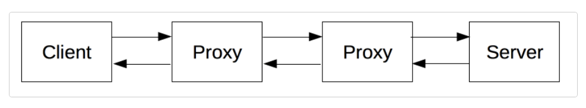
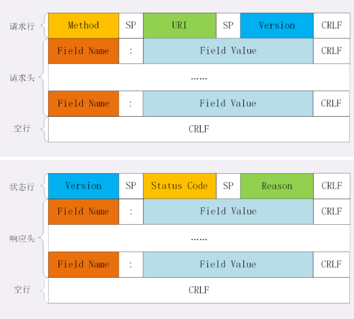
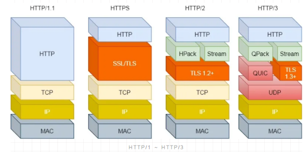
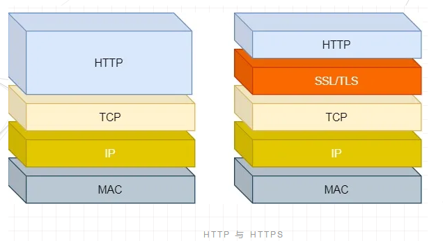
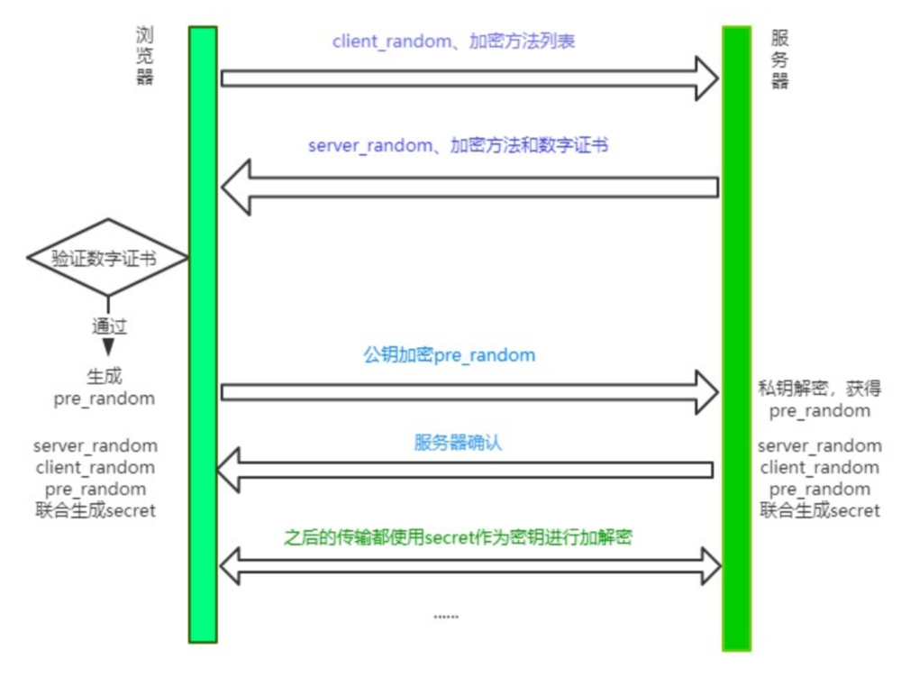
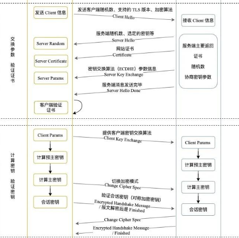

# 计算机网络

**网页（webpage）**：一份能够显示在网络浏览器（如 Firefox,，Google Chrome，Microsoft Internet Explorer 或 Edge，Apple 的 Safari）上的文档。网页也常被称作"web pages"（网页）或者就叫"pages"（页面）。浏览器也能显示其他文档，例如 PDF 文件或图像，但网页（webpage）专指 HTML 文档。其他情况使用文档（document）。

**网站（website）**：网站是共享唯一域名的相互链接的网页的集合。网站常被称作"web site"（网站）或简称"site"（站点）。当网站只包含一个网页时，可称之为单页网站（single-page website）。

**搜索引擎（search engine）**：帮助寻找其他网页的网站，比如 Google，Bing，或 Yahoo。

**CMS（内容管理系统，content management system）**：是一个允许用户发布、组织、修改、删除多种类型的内容的软件。CMS 不仅支持文本，还可以嵌入图片、视频、音频和互动的代码。

## Web 机制

无论通过有线方式 (比如，网线) 还是无线方式（比如 wifi 或蓝牙），通信都需要进行连接，而网络上的每台计算机都需要链接到**路由器（router）**，它确保从一台计算机上发出的一条信息可以到达正确的计算机。计算机先连接路由器，然后路由器之间互相连接，可以通过电话基础设施相互连接，并把网络连接到管理特殊路由器的互联网服务提供商（ISP），最后这些路由器再连接其他 ISP 的路由器。**调制解调器（modem）**可以把网络信息变成电话设施可以处理的信息，而网络消息可以被 ISP 捕获并发送到相应的网络。互联网作为基础设施，就是由这些所有的网络设施所组成，而网络是建立在这种基础设施之上的服务。 

**超链接（Hyperlink）**，通常简称为链接（link）。大多数链接将两个网页相连。而锚将一个网页中的两个段落相连。当点击指向锚点的链接时，浏览器跳转到当前文档的另一部分，而不是加载新文档。内链是自己的网页之间的链接。外链是从自己的网页链接到其他人的网页的链接。传入链接是从其他人的网页链接到自己的网页的链接。链接对网站用户和搜索引擎都很重要，链接的可见文本会影响搜索结果对特定 URL 的搜索。一个网页拥有的链接越多，它在搜索结果中的排名就越靠前。外部链接会影响源网页和目标网页的搜索排名，但具体影响程度尚不清楚。

连接到互联网的计算机被称作**客户端**和**服务器**。客户端是典型的 Web 用户入网设备（比如连接了 Wi-Fi 的计算机，或接入移动网络的手机）和设备上可联网的软件（比如 Firefox 和 Chrome 的浏览器）。服务器是存储网页，站点和应用的计算机。当一个客户端设备想要获取一个网页时，一份网页的拷贝将从服务器上下载到客户端机器上来在用户浏览器上显示。

**网络服务器（web server）**：一台托管一个或多个网站的计算机。可以代指硬件或软件，或者是它们协同工作的整体。硬件部分是一台存储了 web 服务器软件以及网站的组成文件（比如，HTML 文档、图片、CSS 样式表和 JavaScript 文件）的计算机。它接入到互联网并且支持与其他连接到互联网的设备进行物理数据的交互。软件部分包括控制网络用户如何访问托管文件的几个部分，至少是一台 HTTP 服务器。一台 HTTP 服务器是一种能够理解 URL和 HTTP的软件。一个 HTTP 服务器可以通过它所存储的网站域名进行访问，并将这些托管网站的内容传递给最终用户的设备。

**静态 web 服务器**（static web server）由一个计算机（硬件）和一个 HTTP 服务器（软件）组成。称它为“静态”是因为这个服务器把它托管文件的“保持原样”地传送到你的浏览器。

**动态 web 服务器**（dynamic web server）由一个静态的网络服务器加上额外的软件组成，最普遍的是一个应用服务器和一个数据库。称它为“动态”是因为这个应用服务器会在通过 HTTP 服务器把托管文件传送到你的浏览器之前会对这些托管文件进行更新。

严格来说，可以在自己的计算机上托管所有的这些文件，但专用的 web 服务器上有以下优势：
1. 专用 web 服务器可用性更强（会一直启动和运行）
2. 除去停机时间和系统故障，专用 web 服务器总是连接到互联网。
3. 专用 web 服务器可以一直拥有一样的 IP 地址，这也称为专有 IP 地址（不是所有的 ISP 都会为家庭线提供一个固定的 IP 地址）
4. 专用 web 服务器往往由第三方提供者维护。

## 协议体系结构

**协议**（protocol）是定义计算机内部或计算机之间如何交换数据的规则系统。设备之间的通信要求设备就所交换的数据的格式达成一致。定义格式的规则集为协议。

OSI 体系结构顺口溜：**物联网叔会试用**。


**物理层**：主要任务是在物理媒体上实现比特流的透明传输。主要解决二进制数据到信号之间的互转问题。**功能**：定义接口特性、传输模式（单工/半双工/双工）、传输速率，实现比特同步和比特编码；**工作设备**：集线器、中继器。

**数据链路层**：把网络层传下来的数据报组装成帧。作用是将数据在一个子网（广播域）内有效传输。**功能**：成帧(定义帧的开始和结束)、差错控制（帧错+位错）、流量控制、访问(接入)控制（ 控制对信道的访问）；**工作设备**：网桥、交换机。

**网络层**：把分组（IP数据报）从源主机传到目的主机（点到点），为分组交换网上的不同主机提供通信服务。主要解决如何定位目标以及如何寻找最优路径的问题。**功能**：路由选择（最佳路径）、流量控制、差错控制、拥塞控制；协议：IP/ARP（地址解析协议：根据IP获取物理地址）；**工作设备**：路由器。

**传输层**：负责主机中「两个进程」的通信，即「端到端」的通信。传输单位是报文段或用户数据报；主要面向传输过程。**功能**：可靠传输（TCP）或不可靠传输（UDP）、差错控制、流量控制、复用分用。
> 复用：多个应用层进程可同时使用下面传输层的服务；  
> 分用：传输层把收到的信息分别交付给上面应用层中相应的进程。

**会话层**： 向**表示层实体/用户进程**提供「建立链接」并在连接上「有序」地「传输」数据。这是会话，也是建立「同步（SYN）」。**功能**：
1. 建立、管理、终止会话；
2. 使用校验点可使会话在通信失效时从校验点/同步点继续恢复通信，实现数据同步（适用于传输大文件）。

**表示层**：用于处理两个通信系统中交换信息的表示方式（语义和语法）。**功能**：数据格式交换、加密解密、压缩和恢复

**应用层**：所有能和用户交互产生网络流量的程序。**典型的网络应用**：域名系统（DNS）、文件传输（FTP）、电子邮件（SMTP、POP3）、万维网（HTTP）。面向互联网中的具体应用场景相关的消息格式。

**分层的意义**在于利用分层的思想将复杂的问题简单化。发送消息时，消息从上到下进行打包，每一层会在上一层的基础上加包，而接受消息时，从下到上进行解包，最终得到原始信息。

## TCP 和 UDP

传输控制协议（TCP，Transmission Control Protocol）是一种面向连接的、可靠的、基于字节流的传输层通信协议。TCP 会校验包的交付。TCP 确保字节流在接收时维持它们的发送顺序。TCP 使用三次握手来建立连接和四次握手来中断连接。

用户数据报协议（UDP，User Datagram Protocol，又称用户数据包协议）是一种简单的面向数据包的无连接的传输层通信协议。用于在传输速度和效率比安全性和可靠性更重要的场合下发送数据。UDP 使用**校验和**保证数据完整性，使用端口号以区分数据发送方和接收方中不同的应用程序。它无需握手会话，即将不可靠的底层网络直接暴露给了用户的应用程序：不保证消息交付、不保证交付顺序也不保证消息不重复。

UDP 避免了处理差错和纠错的开销。对时间敏感的应用程序通常使用 UDP，因为丢弃数据包比等待数据包重传（可能不是实时操作系统可接受的选项）更可取。

### TCP 和 UDP的异同？

（两者的异同即定义，因此直接列出异同）同为传输层协议；异：
1. TCP 面向连接（可靠），UDP 无连接（不可靠）；
2. TCP 面向字节流，UDP 面向数据报；
3. TCP 支持1对1 ，UDP 支持1对多、多对一、多对多；
4. TCP 首部开销大（20字节），UDP 首部开销小（8字节）；
5. TCP 使用流量和拥塞控制，UDP 不使用；
6. TCP 可靠传输应用（文件传输、远程登录），UDP实时应用（IP电话，视频会议，直播）。

当数据传输的性能必须让位于数据传输的完整性、可控制性和可靠性时，TCP协议是当然的选择。当强调传输性能而不是传输的完整性时，UDP 是更好的选择。

### TCP 三次握手


1. **第一次握手**：客户端进行连接请求，发送 SYN = j 包（SYN 表示连接请求）,进入SYN_SEND状态，等待服务端确认（**服务端确认：自己接收正常，对方发送正常**）。
2. **第二次握手**：服务端同意连接请求，返回 SYN-ACK 包，SYN（等于 j 表示是确认了该客户端的连接请求） 、ACK = 1 （等于 1 表示有效 ACK 包，用于验证服务端到客户端通信是否正常）、seq = y（服务端起始序列号） 、ack = x+1（确认号，期望收到的下一个数据的开头），进入 SYN-RCVD 状态，等待客户端确认（**客户端确认：自己发送接收正常，对方发送接收正常**）。
3. **第三次握手**：客户端收到确认包，发送 ACK 包，ACK=1，seq = x+1, ack = y + 1，发送完毕即双方进入 ESTABLISHED 状态（**服务端确认：自己发送正常，对方接收正常**）。

**三次握手的目的就是双方确认自己与对方发送和接收是正常**。

### TCP 四次挥手


**第一次挥手**：客户端发送一个断开连接的 FIN 报文：FIN=1（表示断开连接）、seq=u，主动关闭连接，进入 FIN-WAIT1 状态，等待服务端确认。

**第二次挥手**：服务端收到 FIN 报文，返回ACK报文：ACK = 1、ack= u + 1，seq = v，服务端进入 CLOSE_WAIT 状态，此时客户端到服务端的连接释放。而客户端收到这个确认报文后进入FIN_WAIT2（终止等待2）状态（等待服务端的连接释放报文）

**第三次挥手**：服务端发送一个断开连接的 FIN 报文：FIN=1（表示断开连接）、ACK=1、seq=w、ack=u+1，主动关闭连接，进入 LAST-ACK 状态，等待客户端的确认。
第四次挥手：客户端收到服务端的 FIN 报文后，返回确认报文段（ACK=1，seq=u+1，ack=w+1），客户端进入 TIME_WAIT（时间等待）状态。等待 `2MSL` 时间后客户端进入CLOSE状态（1. ACK有可能丢失，从而导致处在 LAST-ACK 状态的服务器收不到对FIN的确认报文。**服务器会超时重传这个 FIN**；2. **使本连接持续的时间内所产生的所有报文段都从网络中消失**）。

**四次挥手的原因：服务端收到FIN报文时，很可能仍然有数据发送，因此服务端返回的确认客户端FIN报文的ACK报文需要和服务端断开连接的FIN报文分开发送**。

### TCP 的可靠传输

- **流量控制**：通过滑动窗口限制发送方的发送速率来保证接收方来得及接收实现流量控制，其中滑动窗口的大小由接收方返回的确认报文中的窗口大小字段来决定。
- **差错控制**：检验报文段首部和数据的检验和，把检验和有差错的报文进行丢弃和不确认。
- **超时重传**：发送方超过定时器时间未收到确认即进行重传。
- **重复丢弃**：接收端对重复报文段只确认一次，其余丢弃。
> **ARQ（自动重传请求）**： 1. **停止等待 ARQ**；2. **连续 ARQ**；**区别在于前者发送方每发送一个报文段后即等待确认**（**确认报文段丢失**：丢弃发送方发送的重复消息，不向上层交付并再向发送方发送确认消息。**确认报文段迟到**：发送方收到重复的确认和接收方收到重复的消息都直接丢弃。），**而后者发送方连续发送，接收方进行累计确认**。
- **拥塞控制**：采用**慢开始**（初始值为 1，指数段）、**拥塞避免**（线性段）、**快重传**和**快恢复**的策略，**具体过程**：慢开始到初始门限值 `ssthresh` 后进入拥塞避免端直到拥塞（标志：三个重复 ACK），先优先快重传丢失的报文段，然后更新 `ssthresh` 门限值为拥塞的一半，后续报文段进入快恢复（初始值为新 `ssthresh` 门限值）阶段继续拥塞避免（线性段）。


## DNS

DNS（Domain Name System）域名系统，是一个层次化、分散化的互联网连接资源命名系统。DNS 维护着一个域名列表以及与之相关联的资源（即 IP 地址）。DNS 最突出的功能是将易于记忆的域名翻译成为数字化的IP地址；从域名到 IP 地址的映射过程被称为 **DNS 查询**（DNS lookup）。而 **DNS 反向查询**（rDNS）用来找到与 IP 地址对应的域名。

DNS 数据库存储在全球每个 DNS 服务器上，所有这些服务器都源于 (refer to) 几个被称为“权威名称服务器”或“顶级 DNS 服务器”。只要你的注册商创建或更新给定域名的任何信息，信息就必须在每个 DNS 数据库中刷新。知道给定域名的每个 DNS 服务器都会存储一段时间的信息，然后再次刷新（DNS 服务器再次查询权威服务器）。因此，知道此域名的 DNS 服务器需要些时间才能获取最新信息，这个时间一般被称为传播时间。然而这个术语是不精准的，因为更新本身没有传播 (top → down)。被计算机(down) 查询的 DNS 服务器只在它需要的时候才从权威服务器 (top) 中获取信息。

### 域名和 TLD(顶级域)

域名是在互联网的网站的地址。域名被用于URL识别一个服务器属于哪个特定的网站。域名包含由句号点（”.“）分隔的标签（名称）的分级序列并以 TLD 作为结尾，不同于中文书写顺序，它需要从右到左阅读。二级域 (SLD，Secondary Level Domain)是刚好位于 TLD 前面的标签。一个域名可以有多个标签（或者说是组件、名称），没有强制规定必须要 3 个标签来构成域名。

TLD（顶级域）是互联网分层 DNS（域名系统）中最通用的域，且是作为域名的最后一个组成部分。顶级域既可以包含拉丁字母，也可以包含特殊字符。顶级域名最长可以达到 63 个字符，为了使用方便，大多数顶级域都是两到三个字符。ICANN（互联网名称与数字地址分配机构）指定组织来管理每个 TLD。根据管理组织的严格程度，TLD 通常可以作为网站目的、所有权或国籍的线索。IANA 区分了以下几组顶级域：
1. 国家/地区代码顶级域 (ccTLD，country-code top-level domains)：为国家或地区建立的二字符域。
2. 国际化国家代码顶级域 (IDN c​​cTLD)：非拉丁字符集（例如阿拉伯语或中文）的 ccTLD。
3. 通用顶级域 (gTLD)：具有三个或更多字符的顶级域。
4. 非赞助顶级域：直接根据 ICANN 流程为全球互联网社区制定的政策运营的域，例如“com”和“edu”。
5. 赞助顶级域：由私人组织提议和赞助，这些组织根据社区主题概念决定申请人是否有资格使用 TLD。
6. 基础设施顶级域：该组仅由一个域组成，即地址和路由参数区域 (arpa)， 尤其是用于反向 DNS 查找。

### 选择非 www 的还是 www 的 URL?

选择 www 或非 www URL 作为其中之一作为规范域名，保证所有绝对链接都应使用它。同时，HTTP 允许使用两种技术，当无法预测用户会在浏览器地址栏使用哪个 URL时，以便让用户或搜索引擎清楚地知道哪个域是规范域，同时仍然允许非规范域正常工作并提供预期的页面：
1. 在需要对接收 HTTP 请求的服务器进行配置，使其对任何指向非规范域的请求作出带指向规范域的HTTP Location首部的 HTTP 301 响应。这将把试图访问非规范 URL 的浏览器重定向到其规范等效域。
2. 为两个域提供相同的内容，向页面添加 `<link rel="canonical" href="">` 元素指示页面的规范地址。这对用户没有影响，但会告诉搜索引擎爬虫页面的实际位置。这样，搜索引擎就不会多次索引同一个页面，避免将其视为重复内容或垃圾邮件甚至将页面从搜索引擎结果页面中删除或降级。与前一种情况不同，浏览器历史记录会将非 www 和 www URL 视为独立条目。

### DNS 使用 TCP 还是 UDP？

1. **使用 TCP**：**辅域名服务器**会定时（一般3小时）向**主域名服务器**查询数据是否有变动。如有变动，则会执行一次区域传送，进行数据同步。区域传送使用TCP是因为传送的数据量比一个请求/应答的数据量要多得多，而且需要保证数据的准确性。
2. **使用 UDP**：目的是**避免使用 TCP 协议造成的连接时延**。因为得到一个域名的 IP 地址，往往会向多个域名服务器查询，如果使用 TCP 协议，那么每次请求都会存在连接时延，会使得 DNS 服务变得很慢，导致网页等待时间过长。

## URI、URL、URN

URI（统一资源标识符，Uniform Resource Identifier）是一个用于标识（区分）互联网资源的字符串，允许用户对网络中的资源通过特定的协议进行交互操作。URI 只支持 ASCII 码，对于非ASCII 码和界定符（比如空格）编码转为“%十六进制字节值”。


> 其中，**scheme（或protocol）是方案（或协议）**，常见协议有：
> 1. data：Data URIs；即前缀为 data: 协议的 URL，其允许内容创建者向文档中嵌入小文件。 现代浏览器将 Data URL 视作唯一的不透明来源，是不可以用于导航的 URL。由四个部分组成：`data:[<mediatype>][;base64],<data>`。使用场景：1. CSS url()；2. img元素src；3. link元素href。Opera 11 浏览器限制 URL 最长为 65535 个字符，这意味着 data URL 最长为 65529 个字符（如果你使用纯文本 data:，而不是指定一个 MIME 类型的话，那么 65529 字符长度是编码后的长度，而不是源文件）。Firefox 97 及更高版本支持高达 32MB 的数据 URL（在 97 之前，限制接近 256MB）。Chromium 支持到超过 512MB 的 URL，Webkit（Safari）支持到超过 2048MB 的 URL。
    > 1. `data:`：前缀。
    > 2. `[<mediatype>]`：可选，指示数据类型的MIME类型字符串。如果被省略，则默认值为 text/plain;charset=US-ASCII。
    > 3. `[;base64]`：如果非文本则为可选的base64标记。在 Windows 中，PowerShell 的 Convert.ToBase64String 可用于执行 Base64 编码：
        > 1. `[convert]::ToBase64String([Text.Encoding]::UTF8.GetBytes("hello"))`
    > 4. `<data>`：数据本身。如果数据包含RFC 3986中定义为保留字符的字符或包含空格符、换行符或者其他非打印字符，这些字符必须进行百分号编码（又名“URL 编码”）。如果数据是文本类型，可以直接将文本嵌入（根据文档类型，使用合适的实体字符或转义字符）。否则，可以指定base64标记来嵌入 base64 编码的二进制数据。data字段是没有结束标记的，所以尝试在data URL后面添加查询字符串（特定于页面的参数，语法为 `<url>?parameter-data`）会导致查询字符串也一并被当作data字段。 
> 2. file：指定主机上文件的名称；
> 3. ftp：文件传输协议；
> 4. http、https：超文本传输协议、安全的超文本传输协议；
> 5. mailto：电子邮件地址；
> 6. ssh：安全shell；
> 7. tel：电话
> 8. urn：统一资源名称；
> 9. view-source：资源的源代码；
> 10. ws、wss：WebSocket连接。

> **#fragment（或Anchor）**是资源本身的某一部分的一个锚点。# 号后面的部分，也称为**片段标识符**，永远不会与请求一起发送到服务器。

URI 可以分为 URL（统一资源定位符，Uniform Resource Locator）和 URN（永久统一资源定位符，Uniform Resource Name），URN 通过特定命名空间中的唯一名称来标识资源。


## 媒体类型（MIME）

**媒体类型**（**Multipurpose Internet Mail Extensions 或 MIME 类型**）是一种标准，用来表示文档、文件或字节流的性质和格式。其语法结构为 type/subtype，由类型 type 与子类型subtype 两个字符串中间用'/'分隔而组成，不允许空格存在。**type 表示可以被分多个子类的独立类型或 Multipart 类型**，subtype 表示细分后的每个类型。

> **独立类型**包括：
> 1. text：表明文件是普通文本，理论上是人类可读，比如text/plain, text/html, text/css, text/javascript。对于 text 文件类型若没有特定的 subtype，就使用 text/plain，文本文件默认值。即使它意味着未知的文本文件，但浏览器认为是可以直接展示的。text/plain并不是意味着某种文本数据。如果浏览器想要一个文本文件的明确类型，浏览器并不会考虑他们是否匹配。比如说，如果通过一个表明是下载 CSS 文件的 `<link>` 链接下载了一个 text/plain 文件。如果提供的信息是 text/plain，浏览器并不会认出这是有效的 CSS 文件。CSS 类型需要使用 text/css。
> 2. image：表明是某种图像。不包括视频，但是动态图（比如动态 gif）也使用 image 类型，比如image/gif,image/png、image/jpeg、image/bmp、image/webp、image/x-icon、image/vnd.microsoft.icon。
> 3. audio：表明是某种音频文件，比如audio/midi、audio/mpeg、audio/webm、audio/ogg、audio/wav。 
> 4. video：表明是某种视频文件，比如video/webm, video/ogg。
> 5. application：表明是某种二进制数据，比如application/octet-stream, application/pkcs12, application/vnd.mspowerpoint, application/xhtml+xml, application/xml, application/pdf。二进制文件没有特定或已知的 subtype，即使用 application/octet-stream，这是应用程序文件的默认值。意思是未知的应用程序文件，浏览器一般不会自动执行或询问执行。浏览器会像对待 设置了HTTP 头Content-Disposition 值为 attachment 的文件一样来对待这类文件。

> **Multipart 类型**：表示细分领域的文件类型的种类，经常对应不同的 MIME 类型。这是复合文件的一种表现方式。

浏览器通常使用 MIME 类型（而不是文件扩展名）来确定如何处理 URL，因此 Web 服务器在响应头中添加正确的 MIME 类型非常重要。如果配置不正确，浏览器可能会曲解文件内容，网站将无法正常工作，并且下载的文件也会被错误处理。

Web 上重要的 MIME 类型：

> 1. text/plain：文本（通常为 ASCII 或 ISO 8859- n）(.txt)。	
> 2. text/css：	层叠样式表(CSS)(.css)。在网页中要被解析为 CSS 的任何 CSS 文件必须指定 MIME 为text/css。通常，服务器不识别以.css 为后缀的文件的 MIME 类型，而是将其以 MIME 为text/plain 或 application/octet-stream 来发送给浏览器：在这种情况下，大多数浏览器不识别其为 CSS 文件，直接忽略掉。特别要注意为 CSS 文件提供正确的 MIME 类型。
> 3. text/html：超文本标记语言(HTML)(.htm或.html)。所有的 HTML 内容都应该使用这种类型。XHTML 的其他 MIME 类型（如application/xml+html）现在基本不再使用。但如果打算使用 XML 的严格解析规则，使用 `<![CDATA[...]]>` 或非 HTML、非 SVG 或非 MathML XML 命名空间中的元素，则仍需要使用 application/xml 或 application/xhtml+xml，因为 text/html 的解析语义与 application/xml 的解析语义存在微妙的不兼容。
> 4. text/calendar：日历格式(.ics)。
> 5. text/javascript：JavaScript(.js)。据 HTML 标准，应该总是使用 MIME 类型 text/javascript 服务 JavaScript 文件。其他值不被认为有效，使用那些值可能会导致脚本不被载入或运行。即便任何给定的 user agent 可能支持这些中的任意或所有，你只应该使用 text/javascript。它是唯一确保能在目前和以后正常工作的 MIME 类型。
> 6. text/javascript：JavaScript 模块(.mjs)。
> 7. text/csv：逗号分隔值(CSV)(.csv)	。

> 8. image/gif：图形交换格式(GIF)(.gif)。
> 9. image/vnd.microsoft.icon：图标格式(.ico)。
> 10. image/bmp：Windows OS/2位图图形(.bmp)。
> 11. image/jpeg：JPEG 图像(.jpeg .jpg)。
> 12. image/png：便携式网络图形(.png)。
> 13. image/tiff：标记图像文件格式(TIFF)(.tif .tiff)。
> 14. image/svg+xml：可缩放矢量图形(SVG)(.svg)。	
> 15. image/webp：	网页图像(.webp)。

> 16. font/otf：OpenType 字体(.otf)。
> 17. font/ttf：TrueType字体(.ttf)。
> 18. font/woff：Web 开放字体格式 (WOFF)(.woff)。
> 19. font/woff2：Web 开放字体格式 (WOFF)(.woff2)。

> 20. audio/midi 或audio/x-midi：乐器数字接口 (MIDI)(.mid或.midi)。
> 21. audio/ogg：奥格音频(.oga)。采用 OGG 多媒体文件格式的音频文件。Vorbis 是这个多媒体文件格式最常用的音频解码器。
> 22. audio/mpeg：MP3音频(.mp3)。
> 23. audio/wav：波形音频格式(.wav	)。音频流媒体文件。一般支持 PCM 音频编码 
> 24. audio/webm：	网络管理音频(.weba)。WebM 音频文件格式。Vorbis 和 Opus 是其最常用的解码器。
> 25. audio/aac：AAC音频(.aac)。

> 26. video/x-msvideo：AVI音频视频交错(.avi)。
> 27. video/ogg：奥格视频(.ogv)。采用 OGG 多媒体文件格式的音视频文件。常用的视频解码器是 Theora；音频解码器为 Vorbis。
> 28. video/mpeg：MPEG视频(.mpeg)。
> 29. video/webm：	网络视频(.webm)。采用 WebM 视频文件格式的音视频文件。VP8 和 VP9 是其最常用的视频解码器。Vorbis 和 Opus 是其最常用的音频解码器。
> 30. video/3gpp audio/3gpp（若不含视频）：3GPP音频/视频容器(.3gp)。
> 31. video/3gpp2 audio/3gpp2（若不含视频）：3GPP2音频/视频容器(.3g2)。

> 32. application/x-abiword：AbiWor文档(.abw)。	
> 33. application/x-freearc：存档文档，嵌入多个文件(.arc)。
> 34. application/vnd.amazon.ebook：亚马逊Kindle电子书格式(.azw)。
> 35. application/octet-stream：任何类型的二进制数据(.bin)。
> 36. application/x-bzip：BZip 存档(.bz)。
> 37. application/x-bzip2：BZip2存档(.bz2)。
> 38. application/x-csh：C-Shell脚本(.csh)。
> 39. application/java-archive：Java存档 (JAR)(.jar)。
> 40. application/msword：微软Word(.doc)。
> 41. application/vnd.openxmlformats-officedocument.wordprocessingml.document：微软Word (OpenXML)(.docx)。
> 42. application/vnd.ms-fontobject：MS 嵌入式OpenType字体(.eot)。
> 43. application/epub+zip：电子出版物(EPUB)(.epub)。
> 44. application/json：JSON格式(.json)。	
> 45. application/ld+json：JSON-LD 格式(.jsonld)。
> 46. application/vnd.apple.installer+xml：苹果安装包(.mpkg)。
> 47. application/vnd.oasis.opendocument.presentation：OpenDocument演示文档(.odp)。
> 48. application/vnd.oasis.opendocument.spreadsheet：OpenDocument电子表格(.ods)。
> 49. application/vnd.oasis.opendocument.text：OpenDocument文本文档(.odt)。
> 50. application/ogg：奥格(.ogx)。采用 OGG 多媒体文件格式的音视频文件。常用的视频解码器是 Theora；音频解码器为 Vorbis。	
> 51. application/pdf：Adobe便携式文档格式(PDF)(.pdf)。	
> 52. application/vnd.ms-powerpoint：微软PowerPoint(.ppt)。
> 53. application/vnd.openxmlformats-officedocument.presentationml.presentation：微软PowerPoint (OpenXML)(.pptx)。
> 54. application/x-rar-compressed：RAR存档(.rar)。
> 55. application/rtf：富文本格式(RTF)(.rtf)。
> 56. application/x-sh：Bourne shell脚本(.sh)。
> 57. application/x-shockwave-flash：小型网页格式(SWF) 或 Adobe Flash 文档(.swf)。
> 58. application/x-tar：磁带存档(TAR)(.tar)。	
> 59. application/vnd.visio：微软Visio	(.vsd)。
> 60. application/xhtml+xml：	XHTML(.xhtml)。
> 61. application/vnd.ms-excel：微软Excel(.xls)。
> 62. application/vnd.openxmlformats-officedocument.spreadsheetml.sheet：Microsoft Excel (OpenXML)(.xlsx)。	
> 63. application/xml：XML代码对普通用户来说不可读 (RFC 3023, section 3) text/xml 代码对普通用户来说可读 (RFC 3023, section 3)(.xml)。	
> 64. application/vnd.mozilla.xul+xml：选择(.xul)。
> 65. application/zip：ZIP存档(.zip)。	
> 66. application/x-7z-compressed：7-zip存档(.7z)。	

> 67. multipart/form-data：将完整的 HTML 表单的值从浏览器发送到服务器时，可以使用 multipart/form-data 类型。作为多部分文档格式，它由不同部分组成，由边界（以双破折号”--”开头的字符串）分隔。每个部分都是其自己的实体，具有自己的 HTTP 标头、Content-Disposition 和用于文件上传字段的 Content-Type。
> 68. multipart/byteranges：用于把部分的响应报文发送回浏览器。当发送状态码206 Partial Content 时，这个 MIME 类型用于指出这个文件由若干部分组成，每个部分对应一个请求的范围。

## 绝对路径与相对路径

**当前资源**是资源当前所处的 html 文件或 CSS 文件；**目标资源**是在当前资源中取访问的一个其他资源。

**绝对路径**则是与当前资源的 path 无关。比如当前资源是 `http:<span></span>//b.com/some/something?id=1*，其中 path 是some/something?id=1h1：
1. `http:<span></span>//b.com/list` 即 `http:<span></span>//b.com/list`
2. 省略协议：`//b.com/list` 即协议名沿用当前资源的协议，即 `http:<span></span>//b.com/list`
3. 省略协议，域名，端口：`/list` 省略即 `http:<span></span>//b.com/list`
4. `/` 即 `http:<span></span>//b.com/`

**绝对路径的使用场景**：
1. 站外资源只能使用绝对路径：iconfont 的 css、站外图片、站外链接等；（站外资源是指非当前网站的资源，站内资源指的是当前网站的资源）。
2. 当前资源和目标资源的相对位置不稳定或不明确，且目标资源的path是稳定的，推荐绝对路径：用户上传的图片地址、多地址的页面引入同一目标资源等。

**相对路径**则是相对于当前资源的 path 的路径。比如当前资源是 `http:<span></span>//b.com/some/something?id=1#h1`，path 为域名后面的部分，path 目录为最后一个斜杠之前的部分，因此：
1. `./list` 即 `http:<span></span>//b.com/some/list`
2. `../list` 即 `http:<span></span>//b.com/list`
3. `list` 即 `http:<span></span>//b.com/some/list`
4. `?id=2` 即 `http:<span></span>//b.com/some/something?id=2`
5. `#h2` 即 `http:<span></span>//b.com/some/something?id=1#h2`

**相对路径的应用场景**：当前资源与目标资源的相对位置稳定且明确，开发中大部分场景均适用。

## Websocket

WebSocket是 HTML5 中的全双工、双向通信协议，专门为快速传输小数据设计，支持持久（长）连接，而且服务端可主动 push，不受同源策略限制。数据轻量开销小且通信高效。

WebSocket 未加密的请求协议是 ws://，默认端口是 80；加密的请求协议是 wss://，默认端口是 443。

**Websocket 的缺点**：
1. 兼容性；
2. 对于消息少的场景，维持TCP连接会造成资源浪费。

### 握手

握手阶段采用 HTTP 协议完成一次特殊的请求-响应，ws:// 则是采用 HTTP，wss:// 则采用HTTPS。握手阶段的请求头为：

> Upgrade: websocket  
> Connection: Upgrade  
> Sec-WebSocket-Version: 13  
> Sec-WebSocket-Key: YWJzZmFzZmRhYw==

握手阶段的响应消息则是:

> HTTP/1.1 101 Switching Protocols  
> Upgrade: websocket  
> Connection: Upgrade  
> Sec-WebSocket-Accept: ZzIzMzQ1Z2v3NDUyMzIzNGvy  

握手完成后，后续消息的收发不再使用HTTP协议，任何一方都可主动发消息给对方。

JavaScript 中使用 `new WebSocket(url[,protocols])` 创建一个 WebSocket 对象，url 必须是绝对 URL，构造函数内部即进行握手。

### 属性与方法

**实例属性与方法**：
1. readyState：只读属性，表示当前 WebSocket 的链接状态，取值有：
    1. 0：即 WebSocket.OPENING，正在建立连接。
    2. 1：即 WebSocket.OPEN，已经建立连接。
    3. 2：即 WebSocket.CLOSING，正在关闭连接。
    4. 3：即WebSocket.CLOSE，已经关闭连接。
2. send(data)：发送数据，对于复杂数据，应先序列化再发送（JSON.stringify(data)）。
3. close()：关闭连接。

**wsInstance.addEventListener(‘eventString’, eventHandler)**：
1. wsInstance.onmessage（事件字符串message）：message 事件会在 WebSocket 接收到新消息时被触发。数据在event.data中。
2. wsInstance.onopen（事件字符串open）：定义一个事件处理程序，当WebSocket 的连接状态readyState 变为1时调用，这意味着当前连接已经准备好发送和接受数据。
3. wsInstance.onerror（事件字符串error）：当websocket的连接由于一些错误事件的发生 (例如无法发送一些数据) 而被关闭时，一个error事件将被引发。
4. wsInstance.onclose （事件字符串close）：在连接关闭时触发，有 event 对象（具有三个额外的属性： wasClean — 表示连接是否已经明确地关闭、 code — 服务器返回的数值状态码、reason—包含服务器发回的消息）。

### Socket.io

**Socket.IO** 是一个可以在客户端和服务器之间实现低延迟, 双向和基于事件的通信的库。Socket.IO 不是 WebSocket 实现，而是建立在 WebSocket 协议之上，并为每个数据包添加了额外的元数据，因此如果一方使用 Socket.IO，则双方都要使用。

Socket.IO 在普通 WebSockets 上扩展的功能：
1. **HTTP 长轮询回退**：如果无法建立 WebSocket 连接（老版本浏览器不支持或用户使用了错误配置的代理），连接将回退到 HTTP 长轮询。
2. **自动重新连接**：在某些特定情况下，服务器和客户端之间的 WebSocket 连接可能会中断，而双方都不知道链接的断开状态。Socket.IO 包含心跳机制，它会定期检查连接的状态。当客户端最终断开连接时，它会以指数回退延迟自动重新连接，以免使服务器不堪重负。
3. **数据包缓冲**：当客户端断开连接时，数据包会自动缓冲，并在重新连接时发送。
4. **基于事件的通信**：由服务器和客户端约定事件的监听方和发送方，进行基于事件的通信。约定事件时，为避免与 Socket.IO 的预定义事件冲突，建议加上特殊符号，比如$。
5. **广播**：在服务器端可以向所有连接的客户端或客户端的子集发送事件。
6. **多路复用**：命名空间允许在单个共享连接上拆分应用程序的逻辑。

## HTTP

超文本传输协议（HTTP）是一个用于传输超媒体文档（例如 HTML）的应用层协议。它是为 Web 浏览器与 Web 服务器之间的通信而设计的，但也可以用于其他目的。HTTP 遵循经典的客户端—服务端模型，客户端通过 TCP 或者是 TLS 打开一个连接以发出请求（request），然后等待直到收到服务器端响应（response）。HTTP 是无状态协议，这意味着服务器不会在两个请求之间保留任何数据（状态）。



**在客户端与服务端之间，还有许多的被称为代理的实体，履行不同的作用**：
1. 缓存（可以是公开的也可以是私有的，如浏览器的缓存）
2. 过滤（如反病毒扫描、家长控制...）
3. 负载均衡（让多个服务器服务不同的请求）
4. 认证（控制对不同资源的访问）
5. 日志（使得代理可以存储历史信息）

### HTTP 报文结构

由请求（响应）起始行 + 请求（响应）头部 + 空行（**区分头部与实体**） + 实体（body）构成。其中请求(响应)起始行分别为方法 + URI路径 + HTTP版本 （版本 + 状态码 + 原因Reason）:



**空行之前不能存在空行的原因：多余的空行会导致空行后的内容全部被视为实体**。

**首部字段的格式特点**：字段名不区分大小写、不允许出现空格，不可以出现下划线 _、字段名后必须紧跟着冒号（:）

### HTTP 的特点（优缺点）

**HTTP 1.0 默认短连接**（一个请求对应一个TCP连接），**HTTP 1.1 默认长连接**（一个TCP连接可发多个请求，因此可**管道传输即当前请求响应前可继续发送下一请求**）：减少了重复建立和断开 TCP 连接所造成的额外开销，减轻了服务器端的负载，**减少整体的响应时间**。

```
HTTP 请求启动 KeepAlive (长连接)需要服务端来设置的，比如 Nginx 配置
http {
  # 客户端连接在服务端保持开启的超时值
  keepalive_timeout 120s;
  # 可以服务的请求的最大数量
  keepalive_requests 10000;
}
```

1. **简单易理解（优点）**：报文格式就是 `header + body`，头部信息也是 `key-value` 简单文本的形式。
2. **灵活易扩展（优点）**：语义自由（除基本格式外没严格语法限制），传输形式多样（文本、图片、视频等）、工作在应用层，下层可随意变化（HTTPS 增加 SSL/TLS 安全传输层，HTTP/3 甚至 TCP 替换成基于 UDP 的 QUIC）。
3. **明文传输**：报文(主要是头部)使用文本形式，调试便利（优点）， 但也暴露给攻击者（缺点）。
4. **无状态**：不需要保存连接上下文信息场景（优点），长连接的场景下（缺点）。
5. **HTTP 1.1存在队头阻塞**（缺点）：开启长连接，虽然可以不等响应发起新请求，但需要按顺序响应请求，前面的请求没响应之前会产生阻塞。
5. **不安全**（缺点）：不验证通信方的身份，无法证明报文的完整性、通信明文（不加密）。
6. （优点）**跨平台、应用广泛**，（缺点）**请求单向性、无优先级控制、按顺序响应、首部冗长未压缩**。

### HTTP 响应状态码

HTTP 响应状态码用来表明特定 HTTP 请求是否成功完成。响应被归为五大类：

#### 1. 信息响应 (100–199)

表示目前是协议处理的中间状态，还需要后续操作。

1. **100 Continue**。表示目前为止一切正常，客户端应该继续请求，如果已完成请求则忽略。如果要让服务器检查请求头，客户端必须在初始请求中发送 Expect: 100-continue 作为标头，并发送带 body 的实际请求之前接收 100 Continue。
2. **101 Switching Protocols**。表示服务器同意升级协议，协议由客户端在 Upgrade 请求头中降序列举，由服务器在 Upgrade 响应头中确认。只能切换到更高级的协议，例如，HTTP 升级为 WebSocket。
3. <font color="gray">102 Processing 正在处理。向客户端指示已收到完整请求并且服务器正在处理该请求。仅当服务器预计请求需要很长时间时才发送，它告诉客户端请求尚未终止。已弃用，不应再发送，客户可能仍接受它，但会忽略。</font>
4. **103 Early Hints 早期提示**。由服务器仍在准备响应时发送，并提示客户端服务器期望最终响应将链接的资源。这允许浏览器甚至在服务器准备并发送最终响应之前就开始预加载资源。主要与指示要加载的资源的 Link 标头一起使用，也还可能包含处理早期提示时强制执行的 Content-Security-Policy 标头（比如，早期响应通过将 CSP 设置为”self”限制为与请求相同的源才预加载资源。虽然最终响应可能会将 CSP 设置为无，即资源已被预加载，但不会被使用）。服务器可能会在重定向后发送多个 103 响应。浏览器只处理第一个早期提示响应，如果请求导致跨源重定向，则必须丢弃该响应。来自早期提示的预加载资源会有效地预加载到文档的 head 元素中，然后才是最终响应中加载的资源。出于兼容性考虑（Chrome103+/Firefox102+且需要用户主动启用，Edge103+且支持范围限制在 HTTP/2 或更高版本），除非已知客户端能正确处理该响应，建议只通过 HTTP/2 或更高版本发送早期提示响应。

#### 2. 成功响应 (200–299)

**表示成功状态**。

1. **200 OK**。表明请求已经成功。默认情况下状态码为 200 的响应可以被缓存。成功的含义取决于HTTP请求方法：
    1. GET: 资源已被获取并在消息体中传输。
    2. HEAD: 表示标头包含在响应中，没有任何消息正文（body）。
    3. POST: 资源已被获取并在消息体中传输。
    4. TRACE: 响应的消息体中包含服务器接收到的请求信息。
    5. PUT 和 DELETE 的请求成功通常并不是响应200 OK 而是204 No Content （或者201 Created）。
2. **201 Created**，表示请求已经被成功处理，并且创建了新的资源。新的资源在应答返回之前已经被创建。同时新增的资源会在应答消息体中返回，其地址或者是原始请求的路径，或者是 Location 首部的值。常规使用场景是作为 POST 请求的结果。
3. **202 Accepted**。表示请求已被接受处理，但处理尚未完成；事实上，处理可能还没有开始。该请求最终可能会或可能不会被执行，因为在实际处理时可能会拒绝该请求。它是非承诺性的，即 HTTP 无法在稍后发送异步响应，说明处理请求的结果。它适用于另一个进程或服务器处理请求或批处理的情况。
4. **203 Non-Authoritative Information 非授权信息**。表明请求已成功，但转换代理已根据源服务器的 200 (OK) 响应修改了随附的有效负载。它类似于 Warning 首部的 214（Transformation Applied）警告码，后者的优势在于可以应用于任何状态码的响应之中。
5. **204 No Content**。表示请求已成功，但客户端不需要离开其当前页面。默认情况下 204 响应是可缓存的（此类响应中包含 ETag 标头）。适用于PUT和DELETE 请求。例如，在 PUT 请求中进行资源更新，但是不需要改变当前展示给用户的页面，那么返回 204 No Content；如果创建了资源，则返回 201 Created；如果应将页面更改为新更新的页面，则应改用 200。虽然此状态代码旨在描述无body的响应，但服务器可能会错误地将数据包含在标头之后。该协议允许用户代理以不同方式处理此类响应，在持久连接中是可以观察到的，其中无效 body 可能包括对后续请求的不同响应。 Safari 拒绝任何此类数据。Chrome 和 Edge 在有效响应之前最多丢弃四个无效字节。Firefox 在有效响应之前可以容忍超过 1 KB 的无效数据。
6. **205 Reset Content**。告诉客户端重置文档视图，例如清除表单的内容、重置canvas状态或刷新 UI。如果此响应错误地包含持久连接上的body，不同浏览器的处理行为与204同。
7. **206 Partial Content 部分内容**。表示请求已成功，并且body中包含请求中Range首部指定的数据范围结果。如果只包含一个数据区间，那么整个响应的Content-Type首部的值为所请求的文件的类型，同时包含 Content-Range首部；如果包含多个数据区间，那么整个响应的 Content-Type首部的值为 multipart/byteranges，每个片段覆盖一个数据区间并用 Content-Range 和 Content-Type 进行描述。**使用场景为 HTTP 分块下载和断点续传**。
8. **207 Multi-Status 多状态**。响应体是带有多状态根元素的`文本/xml` 或应用程序 /xml HTTP 实体。XML body 将列出所有单独的响应代码。返回资源集合的能力是 WebDAV 协议的一部分（它可以由访问 WebDAV 服务器的 Web 应用程序接收）。访问网页的浏览器永远不会遇到此状态代码。
9. **208 Already Reported**。用于207响应中，以节省空间并避免冲突。如果以不同的路径多次请求同一资源（例如作为集合的一部分），则只有第一个资源会报告 200。所有其他绑定的响应将报告此 208 状态代码，因此不会产生冲突，并且响应保持较短。将资源绑定到多个路径的能力是 WebDAV 协议的扩展（它可以由访问 WebDAV 服务器的 Web 应用程序接收）。访问网页的浏览器永远不会遇到此状态代码。
10. **226 IM Used 已使用 IM**。在增量编码的上下文中由服务器设置以指示它正在返回其收到的GET请求的增量。浏览器不支持 HTTP 增量编码（delta encoding），此状态代码由特定客户端使用的自定义服务器发回。使用增量编码时，服务器会用相对于给定基础文档（而不是当前文档）的差异（称为deltas）来响应GET请求。客户端使用 HTTP 标头 A-IM 表示要使用哪种差异算法，并使用 If-None-Match 标头提示服务器它得到的最新版本。服务器会生成一个delta，并在包含 IM 标头（使用的算法名称）和 Delta-Base 标头（与 delta 相关联的基础文档的 ETag）的 226 响应中发送回来。

#### 3. 重定向消息 (300–399)

**重定向状态，资源位置发生变动，需要重新请求**。

1. **300  Multiple Choices**。表示该请求有多个可能的响应。用户代理或用户应该选择其中之一，但由于没有如何选择的标准方法，因此该状态码很少使用。如果服务器有首选选择，它应该生成 Location 标头。
2. **301 Moved Permanently** 永久重定向。表示请求的资源已明确移动到 Location 标头给出的 URL。浏览器会重定向到新的 URL，搜索引擎也会更新其资源链接。虽然规范要求在执行重定向时method和body保持不变，但并非所有用户代理都符合。由于该状态明确禁止更改方法，请仅将 301 用作 GET 或 HEAD 方法的响应，而将 308 用于 POST 方法。比如，http永久重定向到https（会做缓存优化）。
3. **302 Found**，即临时重定向。表明请求的资源被暂时的移动到了由Location 指定的 URL 上，客户端应继续使用原有URI。不会做缓存优化，浏览器会重定向到这个 URL，但是搜索引擎不会对该资源的链接进行更新 (用 "搜索引擎优化术语 "来说，就是 "链接汁液 "不会被发送到新的 URL 上)。即使规范要求浏览器在重定向时保证请求method和请求body不变，但并不是所有的用户代理都会遵循。由于该状态明确禁止更改方法，所以推荐仅将 302 用作 GET 或 HEAD 方法的响应，而在其他时候使用307来替代。在确实需要将重定向请求的方法转换为 GET的场景下，可以使用 303，比如在使用 PUT 方法进行文件上传操作时，需要返回确认信息（例如“你已经成功上传了 xyz”）而不是上传的资源本身。
4. **303 See Other** 参阅其他。表示重定向不链接到所请求的资源本身，而是链接到另一个页面（例如确认页面，或上传进度页面）。它通常作为 PUT 或 POST 的结果发回。用于显示此重定向页面的方法始终是 GET。
5. **304 Not Modified** 未修改（缓存重定向）。表示无需重传所请求的资源。这是对缓存资源的隐式重定向，缓存控制中当协商缓存命中时（即客户端提供一个头信息指出客户端希望只返回在指定日期之后修改的资源）会返回。当请求方法是安全方法（例如 GET 或 HEAD）时，或者当请求是有条件的并使用 If-None-Match 或 If-Modified-Since 标头时会发生。响应不得包含body，并且必须包含在等效 200 OK 响应中发送的标头：Cache-Control、Content-Location、Date、ETag、Expires 和 Vary。许多开发工具的浏览器网络面板都会创建导致 304 响应的无关请求，因此开发人员可以看到对本地缓存的访问。(6)如果此响应错误地包含持久连接上的body，不同浏览器的处理行为与204同。
6. **307 Temporary Redirect** 临时重定向。表示请求的资源已暂时移动到 Location 标头给出的 URL。原始请求的method和body将被重新用于执行重定向请求。如果希望使用的方法改为 GET，请使用 303 代替。307和302唯一的区别是307保证重定向请求时方法和主体不会改变。对于 302，一些旧客户端错误地将方法更改为 GET：使用非 GET 方法和 302 的行为在 Web 上是不可预测的，而使用 307 的行为是可预测的。对于 GET 请求，它们的行为是相同的。
7. **308 Permanent Redirect** 永久重定向。表示请求的资源已明确移动到 Location 标头给出的 URL。浏览器重定向到此页面，搜索引擎更新其到该资源的链接。请求method和body不会改变，而 301 有时可能会错误地更改为 GET 方法。某些 Web 应用程序可能会以非标准方式或出于其他目的使用 308 Permanent Redirect。例如，Google Drive 使用 308 Resume Incomplete 响应来向客户端指示不完整的上传何时停止。 

#### 4. 客户端错误响应 (400–499)

**请求报文有误**。

1. **400 Bad Request** 表示服务器因某些被认为是客户端错误的原因（例如，请求语法错误、无效请求消息格式或者欺骗性请求路由），而无法或不会处理该请求。警告： 客户端不应该在未进行修改的情况下重复发送此请求。
2. **401 Unauthorized**  未授权。表示客户端请求尚未完成，因为它缺少所请求资源的有效身份验证凭据。会与包含有如何进行验证的信息的WWW-Authenticate 首部一起发送。该状态码类似于 403 Forbidden，区别是依然可以进行身份验证。
3. **402 Payment Required** 需要付款。被创建最初目的是用于数字现金或微型支付系统，表明客户端请求的内容只有付费之后才能获取。目前还不存在标准的使用约定，不同的实体可以在不同的环境下使用。是一个非标准响应状态码，该状态码被保留但未定义，实际上没有浏览器支持它。
4. **403 Forbidden** 禁止。表示服务器理解该请求但拒绝授权。类似于 401，但进入 403状态后即使重新验证也不会改变该状态。该访问是长期禁止的，并且与应用逻辑密切相关（例如没有足够的权限访问该资源）。
5. **404 Not Found** 找不到。表示服务器无法找到请求的资源。指向 404 页面的链接通常被称为断链或死链。404 只表示资源丢失，而不表示是暂时还是永久丢失。如果资源被永久删除，请使用 410。可以显示自定义 404 页面，以便为用户提供更多帮助，并提供下一步操作的指导。例如，对于 Apache 服务器，可以在 .htaccess 文件中指定自定义 404 页面的路径（定制设计是好事，但要适度。可以使404 页面变得幽默且人性化，但不要让用户感到困惑。）
6. **405 Method Not Allowed** 方法不允许。表示服务器知道请求方法，但目标资源不支持此方法。服务器必须在 405 中生成一个Allow标头。该字段必须包含目标资源当前支持的方法列表。
7. **406 Not Acceptable** 不可接受的。表示服务器无法生成与请求中的主动内容协商标头（Accept、Accept-Encoding、Accept-Language）中定义的可接受值列表相匹配的响应，并且服务器不愿意提供默认表示。实际上，这个错误很少被使用。服务器不会使用此错误代码进行响应（这对于最终用户来说是神秘的且难以修复），而是忽略相关标头并向用户提供实际页面。如果服务器返回此状态码，则消息body应包含资源的可用表示形式的列表，允许用户在其中进行选择。
8. **407 Proxy Authentication Required** 需要代理授权。由于缺乏位于浏览器与可以访问所请求资源的服务器之间的代理服务器（proxy server ）要求的身份验证凭证，发送的请求尚未得到满足。会与包含有如何进行验证的信息的Proxy-Authenticate 首部一起发送。
9. **408 Request Timeout** 请求超时。表示服务器想要关闭这个未使用的连接。即使客户端之前没有任何请求，它也会由某些服务器在空闲连接上发送。服务器应该在响应中发送“close”Connection 标头字段，因为 408 意味着服务器已决定关闭连接而不是继续等待。由于某些浏览器（例如 Chrome、Firefox 27+ 和 IE9）使用 HTTP 预连接机制来加快网络速度，因此该响应的使用更加频繁。有些服务器只是关闭连接而不发送此消息。
10. **409 Conflict** 冲突。表示请求与目标资源的当前状态发生冲突。在响应 PUT 请求时最有可能发生冲突。例如，在上传比服务器上现有文件更旧的文件时，可能会收到 409，从而导致版本控制冲突。
11. **410 Gone** 消失。表示源服务器不再提供对目标资源的访问，并且这种情况可能是永久性的。如果不知道这种情况是暂时的还是永久的，则应使用 404。410 默认是可缓存的。
12. **411 Length Required** 表示服务器拒绝接受没有定义 Content-Length 标头的请求。根据规范，当使用分块模式传输数据时，Content-Length 头信息会被省略，需要在每个数据块的开头以十六进制格式添加当前数据块的长度。
13. **412 Precondition Failed** 前提条件失败。表示对目标资源的访问已被拒绝。当不满足 If-Unmodified-Since 或 If-None-Match 标头定义的条件时，除 GET 或 HEAD 之外的方法上的条件请求会发生这种情况，请求（通常是上传或修改资源）将无法执行，从而返回该错误状态码。
14. **413 Content Too Large** 内容过大。表示请求实体大于服务器定义的限制；服务器可能会关闭连接或返回 Retry-After 标头。在 RFC 9110 之前，状态的响应短语是 Payload Too Large，此名字至今仍被广泛使用。
15. **414 URI Too Long URI** 太长。表示客户端请求的 URI 比服务器愿意解释的长度长。客户端不恰当地将 POST 请求转换为带有较长查询信息的 GET 请求、客户端陷入重定向循环（例如，重定向 URI 前缀指向自身的后缀）、或当服务器受到试图利用潜在安全漏洞的客户端攻击时会出现此情况。
16. **415 Unsupported Media Type** 不支持的媒体类型。表示服务器拒绝接受请求，因为有效载荷格式是不支持的格式。格式问题的出现有可能源于客户端在 Content-Type 或 Content-Encoding 首部中指定的格式，也可能源于直接对负载数据进行检测的结果。
17. **416 Range Not Satisfiable** 范围不满足。表示服务器无法为请求的范围提供服务。最可能的原因是文档不包含此类范围，或者 Range 标头值虽然语法正确，但没有意义。416 响应报文包含一个 Content-Range 首部，提示无法满足的数据区间（用星号 * 表示），后面紧跟着一个“/”，再后面是当前资源的长度。例如：Content-Range: */12777。面对此错误，浏览器通常要么中止操作（例如，下载将被视为不可恢复），要么再次请求整个文档。
18. **417 Expectation Failed** 不满足期望。表示无法满足请求的 Expect 标头中给出的期望。
19. **418 I'm a teapot** 我是一个茶壶。表示服务器拒绝冲泡咖啡，因为它永远是茶壶。暂时没有咖啡壶/茶壶的组合应该返回 503。此错误引用了 1998 年和 2014 年愚人节笑话中定义的超文本咖啡壶控制协议。一些网站使用此响应来处理不希望处理的请求，例如自动查询。
20. **421 Misdirected Request** 表示请求被定向到无法生成响应的服务器。如果重用连接或选择替代服务时可能出现此情况。
(21)422 Unprocessable Content 表示服务器了解请求实体的内容类型，并且请求实体的语法正确，但无法处理所包含的指令。警告：客户端不应在未经修改的情况下重复此请求。
22. **423 Locked** 表示暂定目标的资源已被锁定，即无法访问。其内容应包含一些 WebDAV XML 格式的信息。锁定资源的功能特定于某些 WebDAV 服务器。浏览器访问网页永远不会遇到这个状态码；如果发生错误，它们会将其作为通用 400 状态码进行处理。
23. **424 Failed Dependency** 表示无法对资源执行该方法，因为请求的操作依赖于另一个操作，并且该操作失败。常规 Web 服务器通常不会返回此状态代码。但其他一些协议（例如 WebDAV）可以返回它。例如，在 WebDAV 中，如果发出 PROPPATCH 请求，并且一个命令失败，则所有其他命令也会自动失败，并显示 424 Failed Dependency。
24. **425 Too Early** 表示服务器不愿意冒险处理可能重播的请求，这会产生重播攻击的可能性。
25. **426 Upgrade required** 表示服务器拒绝使用当前协议执行请求，但在客户端升级到不同协议后可以接受。服务器会在响应中使用 Upgrade 首部来指定要求的协议。
26. **428 Precondition required** 表示服务器要求发送条件请求。通常，这意味着缺少必需的条件首部，例如 If-Match。而当一个条件首部的值不能匹配服务器端的状态的时，应答的状态码应该是 412 Precondition Failed，前置条件验证失败。
27. **429 Too Many Requests** 表示用户在给定时间内发送了太多请求（“速率限制”）。此响应中可能包含 Retry-After 标头，指示在发出新请求之前需要等待多长时间。
28. **431 Request Header Fields Too Large** 表示服务器拒绝处理该请求，因为请求的 HTTP 标头太长。减少请求标头的大小后可以重新提交请求。当请求头的总大小太大，或者单个头字段太大时，可以使用431。为帮助用户解决问题，应在响应body中指出这两个错误中的哪一个是问题所在且包括哪些标头太大。引用 URL 太长或请求中发送的 Cookie 太多时服务器通常会使用此状态码。
29. **451 Unavailable For Legal Reasons** 表示用户请求的资源由于法律原因不可用，例如已发出法律诉讼的网页。

#### 5. 服务端错误响应 (500–599)

**服务器端发生错误**。
1. **500 Internal Server Error** 表示服务器遇到了意外情况，导致其无法完成请求。这个错误代码是一个通用的“万能”响应代码。有时候，对于类似于 500 这样的错误，服务器管理员会更加详细地记录相关的请求信息来防止以后同样错误的出现。
2. **501 Not Implemented** 表示服务器不支持完成请求所需的功能。此状态还可以发送 Retry-After 标头，告诉请求者何时检查以查看届时是否支持该功能。当服务器无法识别请求方法并且无法支持任何资源时，501 是恰当的响应。服务器唯一必须支持的方法是 GET 和 HEAD，因此不得返回 501。如果服务器确实能识别该方法，但故意不支持它，则适当的响应是 405 方法不允许。默认情况下，501 响应是可缓存的。501 错误需要所尝试访问的网络服务器来进行修复。
3. **502 Bad Gateway** 表示服务器在充当网关或代理时从上游服务器收到无效响应。网关可能指的是网络中的不同事物，502 错误通常无法修复，但需要 Web 服务器或尝试访问的代理进行修复。
4. **503 Service Unavailable** 表示服务器尚未准备好处理请求。常见原因是服务器因维护而停机或过载。此响应应用于临时情况，并且 Retry-After HTTP 标头应（如果可能）包含服务恢复的估计时间以及解释问题的用户友好页面。应注意随此响应一起发送的与缓存相关的标头，因为503 通常是一种临时状态，响应通常不应被缓存。
5. **504 Gateway Timeout** 表示服务器在充当网关或代理时，没有及时从上游服务器获得完成请求所需的响应。
6. **505 HTTP Version Not Supported** 表示服务器不支持请求中使用的 HTTP 版本。
7. **506 Variant Also Negotiates** 表示服务器内部配置错误，此时所选变体本身被配置为参与内容协商，因此不是一个合适的协商端点。可在透明内容协商（见 RFC 2295）中给出。在服务器支持多种变体的情况下，该协议使客户端能够检索给定资源的最佳变体。
8. **507 Insufficient Storage** 可以在 WebDAV 协议（基于 web 的分布式创作和版本控制，参见 RFC 4918）中给出。表示服务器不能存储相关内容。准确地说，一个方法可能没有被执行，因为服务器不能存储其表达形式，这里的表达形式指：方法所附带的数据，而且其请求必需已经发送成功。
9. **508 Loop Detected** 表示服务器终止了操作，因为在处理“Depth: infinity”的请求时遇到无限循环。此状态表明整个操作失败。可以在 WebDAV 协议（基于 Web 的分布式创作和版本控制）中给出。
10. **510 Not Extended** 在 HTTP 扩展框架协议（参见 RFC 2774）中发送。在 HTTP 扩展框架协议中，一个客户端可以发送一个包含扩展声明的请求，该声明描述了要使用的扩展。如果服务器接收到这样的请求，但是请求不支持任何所描述的扩展，那么服务器将使用 510 状态码进行响应。
11. **511 Network Authentication Required** 表示客户端需要通过验证才能使用该网络。该状态码不是由源头服务器生成的，而是由控制网络访问的拦截代理服务器生成的。网络运营商有时在授予访问权限之前需要进行一些身份验证、接受条款或其他用户交互（例如在网吧或机场）。他们经常使用媒体访问控制 (MAC，Media Access Control) 地址来识别尚未这样做的客户端。

### HTTP 请求方法

#### 幂等、安全、可缓存

1. **幂等**：指的是同样的请求被执行一次与连续执行多次的效果是一样的，服务器的状态也是一样的。幂等方法不应该具有副作用（统计用途除外）。在正确实现的条件下， GET， HEAD、PUT、DELETE、OPTIONS和TRACE方法都是幂等的，而 POST、CONNECT和PATCH方法不是。所有的安全方法都是幂等的。幂等性只与后端服务器的实际状态有关，而每一次请求接收到的状态码不一定相同（例如，第一次调用 DELETE 方法有可能返回200 ，但是后续的请求由于已经删除可能会返回 404）。需要主义的是，服务器不一定会确保请求方法的幂等性，有些应用可能会错误地打破幂等性约束。
2. **安全**：指的是不会修改服务器数据，对服务器是只读操作。安不安全的定义是这个方法需不需要服务器修改数据。所有安全的方法都是幂等的，但并非所有幂等方法都是安全的，PUT、POST、CONNECT和DELETE方法不是安全的。建议任何应用都不应让 GET 请求修改服务端的状态（数据）。安全的方法并不意味着只是对服务端的静态文件的请求，服务端可以在请求的时候即时生成资源返回，只要生成资源的脚本保证是安全的即可。
3. **可缓存**：指的是可以缓存的 HTTP 响应，它被存储起来以便后续的检索和使用，省去了对服务器的新的请求。对一些不可缓存的请求/响应可能会使先前缓存的响应失效，比如PUT 将使所有对同一 URI 的 GET 或 HEAD 的缓存请求失效。并非所有的 HTTP 响应都可以被缓存，需同时满足条件：
    1. 请求中使用的方法本身就是可缓存的，即 GET 或 HEAD 方法。如果指示了有效期并且设置了 Content-Location 标头，POST 或 PATCH 请求的响应也可以被缓存，但是这很少被实现，比如Firefox 就不支持它。其他方法，如 PUT 或 DELETE 是不可缓存的，其结果也不能被缓存。
    2. 响应的状态码对应用程序的缓存可知，且被认为是可缓存的。可缓存状态码有：200、203、204、206、300、301、404、405、410、414 和 501。
    3. 响应中与缓存相关的特定标头，如 Cache-Control。

#### CONNECT

**CONNECT 请求方法**可以开启与所请求资源之间的双向沟通的通道，它可以用来创建隧道（tunnel）。它是一个逐跳（hop-by-hop）的方法。**请求与响应均无 body、不安全、不幂等、不可缓存以及不允许在HTML表单中使用**。客户端要求 HTTP 代理服务器将 TCP 连接作为通往目的主机的隧道，代理服务器会面向客户端发送或接收 TCP 数据流。它可以用来访问采用了 SSL（HTTPS）协议的站点。

#### DELETE

**DELETE 请求方法**用于删除指定的资源。**请求与响应均可能有 body、不安全、幂等、不可缓存以及不允许在 HTML 表单中使用**。方法成功执行可能响应状态码为200（操作已执行且响应消息包含描述状态的表示）、202（操作可能会成功但尚未实施）或204（操作已执行且无需提供进一步信息）。

#### HEAD

**HEAD 请求方法**请求资源的标头信息，并且这些标头与 GET方法请求时返回的一致。**请求与响应均无 body、安全、幂等、可缓存以及不允许在HTML表单中使用**。一个使用场景是在下载大文件前先通过 HEAD 请求读取其 Content-Length 标头的值获取文件的大小，而无需实际下载文件，以此可以节约带宽资源。HEAD 方法的响应不应有body，如果有，则必须忽略：任何可能描述错误body的表示标头都被假定为描述类似 GET 请求将收到的响应。如果 HEAD 请求的响应表明缓存的URL响应已过期，那么即使没有发出 GET 请求，缓存副本也会失效。

#### OPTIONS

**OPTIONS 请求方法**请求给定 URL 或服务器所允许的通信选项。客户端可以使用此方法指定 URL，或使用星号 (*) 来引用整个服务器。**请求无 body、响应有body、安全、幂等、不可缓存以及不允许在HTML表单中使用**。200 OK 和 204 No Content 都是允许的状态码。使用场景：1. 检测服务器所支持的请求方法；2. 发起CORS 中的预检请求以检测实际请求是否可以被服务器所接受。

#### PATCH

**PATCH 请求方法**用于对资源进行部分修改，类似于CURD（创建：Create，读取：Read，更新：Update，删除：Delete）中的更新。与PUT 是一个资源的完整表述形成对比，PATCH 请求是一组关于如何修改资源的指令。**请求无 body，响应可能有 body、不安全、不幂等、不可缓存以及不允许在 HTML 表单中使用**。任何 2xx 状态码都代表成功的响应。服务器可以通过将其加入 Allow 或 Access-Control-Allow-Methods 响应标头中的列表来宣告其支持PATCH 方法或者 Accept-Patch 标头的存在。

#### PUT

**PUT 请求方法**创建一个新的资源或用请求的有效载荷替换目标资源的表示。和post的区别在于PUT是幂等的。**请求有 body，响应可能有body、不安全、幂等、不可缓存以及不允许在 HTML 表单中使用**。如果目标资源没有当前的表示，并且 PUT 方法成功创建了资源，那么源服务器必须返回 201（Created）来通知用户代理资源已创建。如果目标资源已经存在，并且依照请求中封装的表现形式成功进行了更新，那么，源服务器必须返回 200（OK）或 204（No Content）来表示请求成功完成。

#### TRACE

**TRACE 请求方法**沿着通往目标资源的路径进行信息回环（loop-back）测试，提供了一种实用的 debug 机制。**请求和响应均无body、安全、幂等、不可缓存以及不允许在 HTML 表单中使用**。请求的最终接收者（源服务器或第一个在请求中收到 Max-Forwards 值为 0 的服务器）应将收到的信息作为 200（OK）响应的信息body反映给客户端，其 Content-Type 为 message/http。

#### GET

**GET 请求方法**请求指定资源的表示。使用 GET 的请求应该只用于请求数据，而不应该包含数据。**请求无 body，响应有 body、安全、幂等、可缓存以及允许在 HTML 表单中使用**。在 GET 请求中发送请求体或有效载荷可能会导致一些现有的实现拒绝该请求——虽然规范没有禁止，但语义没有定义，因此最好是避免在 GET 请求中发送有效载荷。

#### POST

**POST 请求方法**发送数据给服务器。请求主体的类型由 Content-Type 标头指定。**请求和响应均有 body、不安全、不幂等、仅在包含足够新的信息时可缓存以及允许在HTML表单中使用**。POST 请求若是通过 HTML 表单发送，其内容类型（content type）是通过在 `<form>` 元素中设置正确的 enctype 属性，或是在 `<input>` 和 `<button>` 元素中设置 formenctype 属性来选择的；若是通过 AJAX（XMLHttpRequest 或 fetch）发送时，请求 body 可以是任何类型。据HTTP 1.1 规范所描述，POST 设计用途是：
1. 对现有资源进行注释；
2. 在公告板，新闻组，邮件列表或类似的文章组中发布消息；
3. 通过注册模板新增用户；
4. 向数据处理过程提供一批数据，例如提交一个表单；
5. 通过追加操作，扩展数据库数据。

#### GET 与 POST 的区别

根据HTTP/1.1-RFC7231中的描述，不同的请求方法仅有语义上的差别（GET请求资源；POST提交资源），并无实质的不同，之所以造成开发上的区别，是因为在具体的实现环境——浏览器中，针对不同的请求方法设置了不同的协议实现方式（GET请求体为空，POST有请求体），从而造成了以下区别：
1. **安全角度**：如果说一个 HTTP 方法是安全的，是指这是个不会修改服务器的数据的方法。也就是说，这是一个对服务器只读操作的方法。因此POST 是不安全的，GET是安全的。
2. **缓存角度**：GET 请求会被浏览器主动缓存历史记录，POST 默认不会（如果指示新鲜度并且设置了 Content-Location 标头则可以）。GET请求的地址还可以被保存在浏览器书签，POST则不可以。
3. **编码角度**：GET只能进行URL 编码，只接收ASCII字符，POST无限制。因为GET数据是在请求行中，POST数据是在请求体中。
4. **参数角度**：GET一般放在 URL 中（不安全），POST 放在请求body中（适合传输敏感信息）。
5. **幂等性角度**：GET是幂等的（执行相同操作，结果不变），而POST不是。若当前页面是通过POST请求得到的，则浏览器会提示用户是否重新提交。GET请求得到的页面则没有提示。
6. **大小限制角度**：GET，POST本身均无限制，但前者依赖URL，不同的浏览器对于 URL 是有限制的，比如 IE 浏览器对于 URL 的限制为 2KB，而 Chrome，FireFox 浏览器理论上对于 URL 是没有限制的。
7. **TCP 角度**：GET将“header + data请求报文”一次发送，而 POST会发送两个 TCP 数据包，先发 header 部分，如果服务器响应100(continue)，然后再发 body 部分。(火狐浏览器除外，它的 POST 请求只发一个 TCP 包)。**优点体现：在网络环境好的情况下，发一次包和两次包的事件差别基本可无视。而网络环境差时，两次包的TCP在验证数据包完整性上优点很大**。

### HTTP 发展



#### HTTP 1

1989年，网络传输超文本系统 Mesh 被 Tim Berners-Lee 博士提出，1990 年更名为万维网（World Wide Web）。1991 年 8 月 16 日万维网公开发表。它在现有的 TCP 和 IP 协议基础之上建立，由四个部分组成：
1. 一个用来表示超文本文档的文本格式，超文本标记语言（HTML）。
2. 一个用来交换超文本文档的简单协议，超文本传输协议（HTTP）。
3. 一个显示（以及编辑）超文本文档的客户端，即首个网络浏览器 WorldWideWeb。
4. 一个服务器用于提供可访问的文档，即 httpd 的前身。

HTTP 的最初版本没有版本号，后来为了与后来的版本区分，被称为 0.9 即 HTTP/0.9，也叫做叫做单行（one-line）协议，请求由单行指令构成，以唯一可用方法 GET 开头，其后跟目标资源的路径（由于一旦连接到服务器就不需要协议、服务器和端口，因此不包括完整的 URL），以空格分隔，比如GET /mypage.html。响应只包含响应文档本身，并不包含 HTTP 头，只能传输HTML文件，没有状态码，出现错误则响应的是包含问题描述信息的 HTML 文件。

HTTP/1.0 是浏览器和服务器在HTTP/0.9增加扩展功能，但并未形成官方标准：
1. 协议版本信息随请求发送（GET行追加HTTP/1.0）
2. 状态码会在响应开始时发送，使浏览器能了解请求执行成功或失败，并相应调整行为（如更新或使用本地缓存）。
3. 引入了 HTTP 标头的概念，无论是对于请求还是响应，允许传输元数据，使协议变得非常灵活，更具扩展性。
4. 在新 HTTP 标头的帮助下，具备了传输除纯文本 HTML 文件以外其他类型文档的能力（凭借 Content-Type 标头）。

1997 年，HTTP/1.1 以 RFC 2068 文件发布：
1. 连接可以复用，节省了多次打开 TCP 连接加载网页文档资源的时间。
2. 增加管线化技术，允许在第一个应答被完全发送之前就发送第二个请求，以降低通信延迟。
3. 支持响应分块。
4. 引入额外的缓存控制机制。
5. 引入内容协商机制，包括语言、编码、类型等。并允许客户端和服务器之间约定以最合适的内容进行交换。
6. 凭借 Host 标头，能够使不同域名配置在同一个 IP 地址的服务器上。

#### HTTPS

HTTPS 通过**信息加密**（通过 SSL/TLS 混合加密，而 HTTP 是明文传输无状态协议）、**CA 身份证书**（存放公钥，且通过证书进行身份认证）、**校验机制**（摘要算法）解决 HTTP 所存在的窃听、篡改、冒充风险。HTTPS 的端口号是 443（HTTP 是 80），比 HTTP 多 SSL/TLS 的握手过程。



> **混合加密：非对称加密**（通信建立前非对称加密「会话秘钥」—**解决了密钥交换问题，但速度慢**） + **对称加密**（通信过程中使用「会话秘钥」对称加密明文数据—**运算速度快，但密钥交换不安全**）。

**传统 SSL\TLS 四次握手（RSA版本）**：



1. 客户端发送“随机数 client_random + 支持加密算法”;
2. 服务器返回“随机数 server_random + 确定的加密算法（RSA） + CA证书 + 公钥（此时只有服务器具有公钥的的私钥）”;
3. 客户端验证证书通过后，生成随机数 pre_random，使用公钥对 pre_random 加密，发送给服务器。
4. 服务器用私钥解开 pre_random，最后将之前内容形成摘要返回给客户端。客户端收到回复，校验成功，握手结束。

之后的数据据传输使用约定的加密方法（RSA）对服务器和客户端都拥有的三个随机数生成的密钥 secret 进行加解密。

**TLS 1.2 四次握手**：

TLS 主流版本是1.2（TLS1.0 = SSL3.1，这之前的都被认为不安全）。TLS 1.2 四次握手如下：



1. 客户端发送“随机数client_random + TLS版本 + 加密套件列表（比如TLS_ECDHE_WITH_AES_128_GCM_SHA256：ECDHE密钥交换算法，使用128位的AES算法和主流的GCM分组模式对称加密，数字签名采用SHA256哈希摘要算法）”;
2. 服务器发送“随机数server_random + 确认 TLS版本 + 选定的加密套件列表 + CA证书（公钥）+ 使用私钥对server_params、两个随机数进行签名”;
3. 客户端使用公钥验证服务器身份通过后，获得server_params，使用其中的椭圆曲线算法、服务器临时公钥和客户端自己生成的临时私钥相乘计算出预主密钥随机数(premaster secret)，最后伪随机函数传入Client Random、Server Random、Premaster Secret 生成会话密钥，发送 client_params（包括客户端生成的椭圆曲线公钥）、切换加密模式、会话密码加密后的验证会话密码消息给服务器。
4. 服务器拿到 client_params，利用相同的方法计算出会话密钥，同样，将切换加密模式、会话密码加密后的验证会话密码消息发送给客户端验证。校验成功则握手结束。

TLS 1.3 不必等验证服务器身份而是一开始就将 client_params 发送给服务器。

#### HTTP 2

**HTTP 2** 是多路复用协议，基于HTTPS，首部执行 HPACK 压缩算法（采用“静态表（name） + 动态表（Huffman编码）”压缩，客户端与服务端维护首部信息表，相同字段发送索引号即可），报文（首部 + body）使用二进制（非文本），**支持服务器主动推送**、支持数据流的非顺序优先级请求和响应，**缺陷**：**多路复用请求使用的是同一 TCP 连接，TCP 的丢包重传机制将导致出现 TCP 队头阻塞，也就导致所有HTTP请求阻塞**。

#### HTTP 3

**HTTP3** 使用 QUIC 代替 TCP 作为传输层协议。QUIC 支持可靠传输，通过在 UDP 上运行多个流并为每个流独立实现数据包丢失检测和重传。首部执行 QPack压缩算法。仅需要 TLS1.3 的 1-RTT 握手，减少连接建立交互次数。

## CDN

CDN (内容分发网络) 指的是一组分布在各个地区的服务器。这些服务器存储着数据的副本，因此服务器可以根据哪些服务器与用户距离最近，来满足数据的请求。CDNs 提供快速服务，较少受高流量影响。**优点**：
1. 通过 CDN 向用户分发传输相关库的静态资源文件（stylesheets 和 JavaScript 等），可以降低我们自身服务器的请求压力。
2. 大多数 CDN 在全球都有服务器，所以 CDNs 上的服务器在地理位置上可能比自己的服务器更接近用户。地理距离会按比例影响延迟。
3. CDNs 已经配置了恰当的缓存设置。使用 CDN 节省了在自己的服务器中对静态资源文件的配置。

## 地址栏输入到页面加载显示完成

1. **处理用户输入**：把用户输入的内容加上协议，合成为完整的 URL。
    1. 判断输入的关键字是搜索内容，还是请求的 URL；
    2. 如果是搜索内容：使用浏览器默认的搜索引擎，来合成新的带搜索关键字的 URL。
    3. 如果是地址：添加协议头等信息。随后，浏览器进程通过IPC进程协议与网络进程通信，让网络进程开始请求。
2. **检查缓存**：浏览器发送请求前，根据请求头的 expires 和 cache-control 判断是否命中（包括是否过期）强缓存策略，如果命中，直接从缓存获取资源，并不会发送请求。如果没有命中，才向服务器发起请求。
3. **DNS 解析**：即对输入网址查找域名对应的IP，查询过程：
    1. **首先递归查询缓存**：浏览器缓存—>本地hosts文件缓存—>本地DNS解析器缓存，查到即结束。
    2. **否则进行迭代查询**：即根据本地DNS服务器设置的转发器，先本地DNS服务器向根域名服务器查询，查不到则本地DNS服务器向顶级域名服务器（.com）查询，查不到则本地DNS服务器向权威域名服务器（baidu.com）查询。


4. **获取 MAC 地址**：得到 IP 后，数据传输需要知道目的主机 MAC 地址。应用层下发数据给传输层，TCP 协议会指定源端口号和目的端口号，然后下发给网络层。网络层会将本机地址作为源地址，获取的 IP 地址作为目的地址。然后将下发给数据链路层，数据链路层的发送需要加入通信双方的 MAC 地址，本机的 MAC 地址作为源 MAC 地址，目的 MAC 地址需要分情况处理。通过将两个 IP 地址分别与本机的子网掩码相与，可以判断是否与请求主机在同一个子网里，如果在同一个子网里，可以使用 ARP地址解析协议获取到目的主机的 MAC 地址，如果不在一个子网里，那么请求应该转发给网关，由它代为转发。
5. **TCP 连接**：向解析得到的IP服务器建立TCP连接，进行 [**TCP 三次握手**](./internet#tcp-三次握手)。
6. **向服务器发送 HTTP 请求，如果是 HTTPS，则进行** [**HTTPS 的握手**](./internet#https)。
7. **服务器处理请求并返回 HTTP 响应报文**。
8. **浏览器解析渲染页面**参考 [**浏览器渲染原理**](../front-end/browser#渲染原理)；
9. **连接结束，进行** [**TCP 四次挥**手](./internet#tcp-四次挥手)。