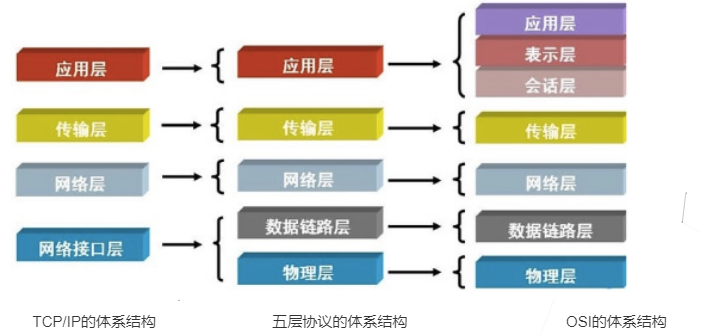
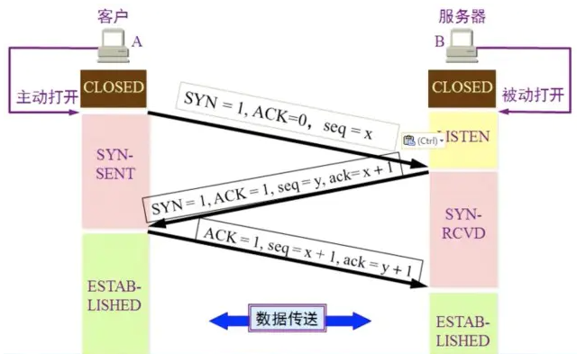
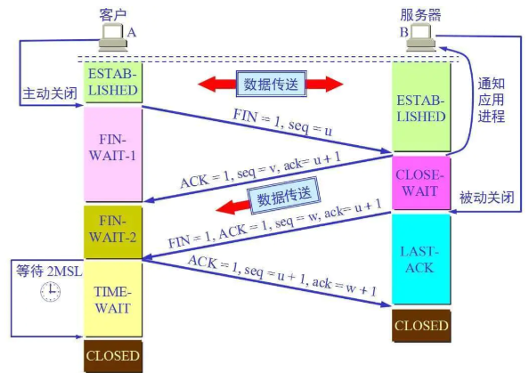
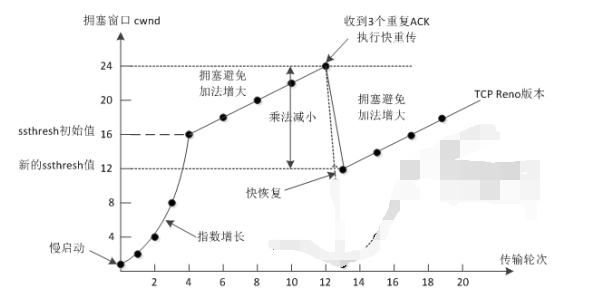
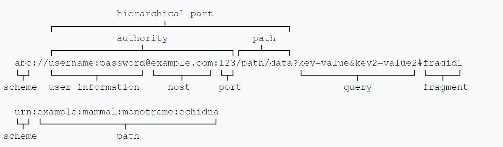
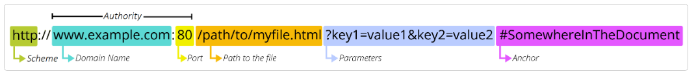
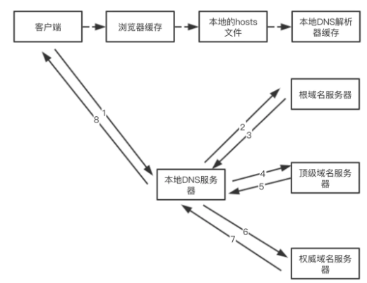
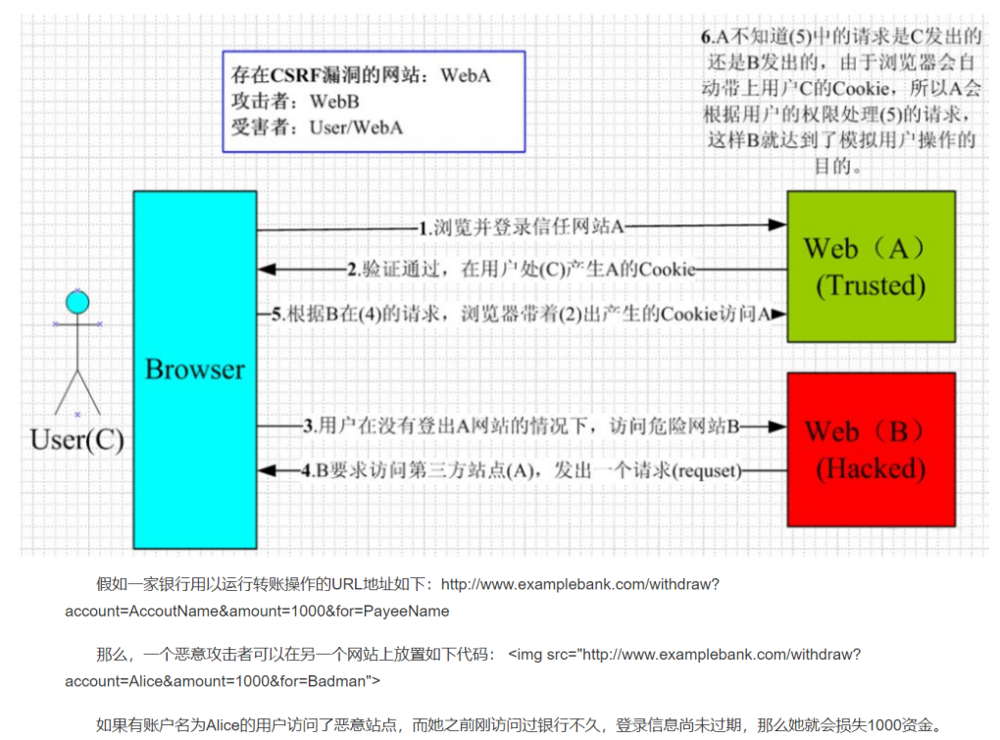
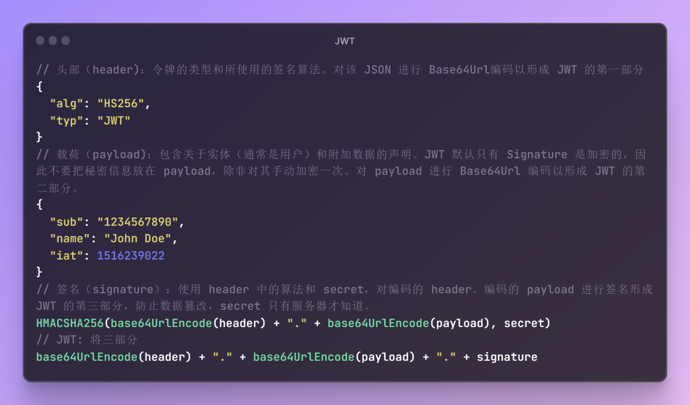

# 计算机网络

**网页（webpage）**：一份能够显示在网络浏览器（如 Firefox,，Google Chrome，Microsoft Internet Explorer 或 Edge，Apple 的 Safari）上的文档。网页也常被称作"web pages"（网页）或者就叫"pages"（页面）。浏览器也能显示其他文档，例如 PDF 文件或图像，但网页（webpage）专指 HTML 文档。其他情况使用文档（document）。

**网站（website）**：网站是共享唯一域名的相互链接的网页的集合。网站常被称作"web site"（网站）或简称"site"（站点）。当网站只包含一个网页时，可称之为单页网站（single-page website）。

**搜索引擎（search engine）**：帮助寻找其他网页的网站，比如 Google，Bing，或 Yahoo。

**CMS（内容管理系统，content management system）**：是一个允许用户发布、组织、修改、删除多种类型的内容的软件。CMS 不仅支持文本，还可以嵌入图片、视频、音频和互动的代码。

## Web 机制

无论通过有线方式 (比如，网线) 还是无线方式（比如 wifi 或蓝牙），通信都需要进行连接，而网络上的每台计算机都需要链接到**路由器（router）**，它确保从一台计算机上发出的一条信息可以到达正确的计算机。计算机先连接路由器，然后路由器之间互相连接，可以通过电话基础设施相互连接，并把网络连接到管理特殊路由器的互联网服务提供商（ISP），最后这些路由器再连接其他 ISP 的路由器。**调制解调器（modem）**可以把网络信息变成电话设施可以处理的信息，而网络消息可以被 ISP 捕获并发送到相应的网络。互联网作为基础设施，就是由这些所有的网络设施所组成，而网络是建立在这种基础设施之上的服务。 

**超链接（Hyperlink）**，通常简称为链接（link）。大多数链接将两个网页相连。而锚将一个网页中的两个段落相连。当点击指向锚点的链接时，浏览器跳转到当前文档的另一部分，而不是加载新文档。内链是自己的网页之间的链接。外链是从自己的网页链接到其他人的网页的链接。传入链接是从其他人的网页链接到自己的网页的链接。链接对网站用户和搜索引擎都很重要，链接的可见文本会影响搜索结果对特定 URL 的搜索。一个网页拥有的链接越多，它在搜索结果中的排名就越靠前。外部链接会影响源网页和目标网页的搜索排名，但具体影响程度尚不清楚。

连接到互联网的计算机被称作**客户端**和**服务器**。客户端是典型的 Web 用户入网设备（比如连接了 Wi-Fi 的计算机，或接入移动网络的手机）和设备上可联网的软件（比如 Firefox 和 Chrome 的浏览器）。服务器是存储网页，站点和应用的计算机。当一个客户端设备想要获取一个网页时，一份网页的拷贝将从服务器上下载到客户端机器上来在用户浏览器上显示。

**网络服务器（web server）**：一台托管一个或多个网站的计算机。可以代指硬件或软件，或者是它们协同工作的整体。硬件部分是一台存储了 web 服务器软件以及网站的组成文件（比如，HTML 文档、图片、CSS 样式表和 JavaScript 文件）的计算机。它接入到互联网并且支持与其他连接到互联网的设备进行物理数据的交互。软件部分包括控制网络用户如何访问托管文件的几个部分，至少是一台 HTTP 服务器。一台 HTTP 服务器是一种能够理解 URL和 HTTP的软件。一个 HTTP 服务器可以通过它所存储的网站域名进行访问，并将这些托管网站的内容传递给最终用户的设备。

**静态 web 服务器**（static web server）由一个计算机（硬件）和一个 HTTP 服务器（软件）组成。称它为“静态”是因为这个服务器把它托管文件的“保持原样”地传送到你的浏览器。

**动态 web 服务器**（dynamic web server）由一个静态的网络服务器加上额外的软件组成，最普遍的是一个应用服务器和一个数据库。称它为“动态”是因为这个应用服务器会在通过 HTTP 服务器把托管文件传送到你的浏览器之前会对这些托管文件进行更新。

严格来说，可以在自己的计算机上托管所有的这些文件，但专用的 web 服务器上有以下优势：
1. 专用 web 服务器可用性更强（会一直启动和运行）
2. 除去停机时间和系统故障，专用 web 服务器总是连接到互联网。
3. 专用 web 服务器可以一直拥有一样的 IP 地址，这也称为专有 IP 地址（不是所有的 ISP 都会为家庭线提供一个固定的 IP 地址）
4. 专用 web 服务器往往由第三方提供者维护。

## 协议体系结构

**协议**（protocol）是定义计算机内部或计算机之间如何交换数据的规则系统。设备之间的通信要求设备就所交换的数据的格式达成一致。定义格式的规则集为协议。

OSI 体系结构顺口溜：**物联网叔会试用**。



**物理层**：主要任务是在物理媒体上实现比特流的透明传输。主要解决二进制数据到信号之间的互转问题。**功能**：定义接口特性、传输模式（单工/半双工/双工）、传输速率，实现比特同步和比特编码；**工作设备**：集线器、中继器。

**数据链路层**：把网络层传下来的数据报组装成帧。作用是将数据在一个子网（广播域）内有效传输。**功能**：成帧(定义帧的开始和结束)、差错控制（帧错+位错）、流量控制、访问(接入)控制（ 控制对信道的访问）；**工作设备**：网桥、交换机。

**网络层**：把分组（IP数据报）从源主机传到目的主机（点到点），为分组交换网上的不同主机提供通信服务。主要解决如何定位目标以及如何寻找最优路径的问题。**功能**：路由选择（最佳路径）、流量控制、差错控制、拥塞控制；协议：IP/ARP（地址解析协议：根据IP获取物理地址）；**工作设备**：路由器。

**传输层**：负责主机中「两个进程」的通信，即「端到端」的通信。传输单位是报文段或用户数据报；主要面向传输过程。**功能**：可靠传输（TCP）或不可靠传输（UDP）、差错控制、流量控制、复用分用。
> 复用：多个应用层进程可同时使用下面传输层的服务；  
> 分用：传输层把收到的信息分别交付给上面应用层中相应的进程。

**会话层**： 向**表示层实体/用户进程**提供「建立链接」并在连接上「有序」地「传输」数据。这是会话，也是建立「同步（SYN）」。**功能**：
1. 建立、管理、终止会话；
2. 使用校验点可使会话在通信失效时从校验点/同步点继续恢复通信，实现数据同步（适用于传输大文件）。

**表示层**：用于处理两个通信系统中交换信息的表示方式（语义和语法）。**功能**：数据格式交换、加密解密、压缩和恢复

**应用层**：所有能和用户交互产生网络流量的程序。**典型的网络应用**：域名系统（DNS）、文件传输（FTP）、电子邮件（SMTP、POP3）、万维网（HTTP）。面向互联网中的具体应用场景相关的消息格式。

**分层的意义**在于利用分层的思想将复杂的问题简单化。发送消息时，消息从上到下进行打包，每一层会在上一层的基础上加包，而接受消息时，从下到上进行解包，最终得到原始信息。

## TCP 和 UDP

传输控制协议（TCP，Transmission Control Protocol）是一种面向连接的、可靠的、基于字节流的传输层通信协议。TCP 会校验包的交付。TCP 确保字节流在接收时维持它们的发送顺序。TCP 使用三次握手来建立连接和四次握手来中断连接。

用户数据报协议（UDP，User Datagram Protocol，又称用户数据包协议）是一种简单的面向数据包的无连接的传输层通信协议。用于在传输速度和效率比安全性和可靠性更重要的场合下发送数据。UDP 使用**校验和**保证数据完整性，使用端口号以区分数据发送方和接收方中不同的应用程序。它无需握手会话，即将不可靠的底层网络直接暴露给了用户的应用程序：不保证消息交付、不保证交付顺序也不保证消息不重复。

UDP 避免了处理差错和纠错的开销。对时间敏感的应用程序通常使用 UDP，因为丢弃数据包比等待数据包重传（可能不是实时操作系统可接受的选项）更可取。

### TCP 和 UDP的异同？

（两者的异同即定义，因此直接列出异同）同为传输层协议；异：
1. TCP 面向连接（可靠），UDP 无连接（不可靠）；
2. TCP 面向字节流，UDP 面向数据报；
3. TCP 支持1对1 ，UDP 支持1对多、多对一、多对多；
4. TCP 首部开销大（20字节），UDP 首部开销小（8字节）；
5. TCP 使用流量和拥塞控制，UDP 不使用；
6. TCP 可靠传输应用（文件传输、远程登录），UDP实时应用（IP电话，视频会议，直播）。

当数据传输的性能必须让位于数据传输的完整性、可控制性和可靠性时，TCP协议是当然的选择。当强调传输性能而不是传输的完整性时，UDP 是更好的选择。

### TCP 三次握手



1. **第一次握手**：客户端进行连接请求，发送 SYN = j 包（SYN 表示连接请求）,进入SYN_SEND状态，等待服务端确认（**服务端确认：自己接收正常，对方发送正常**）。
2. **第二次握手**：服务端同意连接请求，返回 SYN-ACK 包，SYN（等于 j 表示是确认了该客户端的连接请求） 、ACK = 1 （等于 1 表示有效 ACK 包，用于验证服务端到客户端通信是否正常）、seq = y（服务端起始序列号） 、ack = x+1（确认号，期望收到的下一个数据的开头），进入 SYN-RCVD 状态，等待客户端确认（**客户端确认：自己发送接收正常，对方发送接收正常**）。
3. **第三次握手**：客户端收到确认包，发送 ACK 包，ACK=1，seq = x+1, ack = y + 1，发送完毕即双方进入 ESTABLISHED 状态（**服务端确认：自己发送正常，对方接收正常**）。

**三次握手的目的就是双方确认自己与对方发送和接收是正常**。

### TCP 四次挥手



**第一次挥手**：客户端发送一个断开连接的 FIN 报文：FIN=1（表示断开连接）、seq=u，主动关闭连接，进入 FIN-WAIT1 状态，等待服务端确认。

**第二次挥手**：服务端收到 FIN 报文，返回ACK报文：ACK = 1、ack= u + 1，seq = v，服务端进入 CLOSE_WAIT 状态，此时客户端到服务端的连接释放。而客户端收到这个确认报文后进入FIN_WAIT2（终止等待2）状态（等待服务端的连接释放报文）

**第三次挥手**：服务端发送一个断开连接的 FIN 报文：FIN=1（表示断开连接）、ACK=1、seq=w、ack=u+1，主动关闭连接，进入 LAST-ACK 状态，等待客户端的确认。
第四次挥手：客户端收到服务端的 FIN 报文后，返回确认报文段（ACK=1，seq=u+1，ack=w+1），客户端进入 TIME_WAIT（时间等待）状态。等待 `2MSL` 时间后客户端进入CLOSE状态（1. ACK有可能丢失，从而导致处在 LAST-ACK 状态的服务器收不到对FIN的确认报文。**服务器会超时重传这个 FIN**；2. **使本连接持续的时间内所产生的所有报文段都从网络中消失**）。

**四次挥手的原因：服务端收到FIN报文时，很可能仍然有数据发送，因此服务端返回的确认客户端FIN报文的ACK报文需要和服务端断开连接的FIN报文分开发送**。

### TCP 的可靠传输

- **流量控制**：通过滑动窗口限制发送方的发送速率来保证接收方来得及接收实现流量控制，其中滑动窗口的大小由接收方返回的确认报文中的窗口大小字段来决定。
- **差错控制**：检验报文段首部和数据的检验和，把检验和有差错的报文进行丢弃和不确认。
- **超时重传**：发送方超过定时器时间未收到确认即进行重传。
- **重复丢弃**：接收端对重复报文段只确认一次，其余丢弃。
> **ARQ（自动重传请求）**： 1. **停止等待 ARQ**；2. **连续 ARQ**；**区别在于前者发送方每发送一个报文段后即等待确认**（**确认报文段丢失**：丢弃发送方发送的重复消息，不向上层交付并再向发送方发送确认消息。**确认报文段迟到**：发送方收到重复的确认和接收方收到重复的消息都直接丢弃。），**而后者发送方连续发送，接收方进行累计确认**。
- **拥塞控制**：采用**慢开始**（初始值为 1，指数段）、**拥塞避免**（线性段）、**快重传**和**快恢复**的策略，**具体过程**：慢开始到初始门限值 `ssthresh` 后进入拥塞避免端直到拥塞（标志：三个重复 ACK），先优先快重传丢失的报文段，然后更新 `ssthresh` 门限值为拥塞的一半，后续报文段进入快恢复（初始值为新 `ssthresh` 门限值）阶段继续拥塞避免（线性段）。



## DNS

DNS（Domain Name System）域名系统，是一个层次化、分散化的互联网连接资源命名系统。DNS 维护着一个域名列表以及与之相关联的资源（即 IP 地址）。DNS 最突出的功能是将易于记忆的域名翻译成为数字化的IP地址；从域名到 IP 地址的映射过程被称为 **DNS 查询**（DNS lookup）。而 **DNS 反向查询**（rDNS）用来找到与 IP 地址对应的域名。

DNS 数据库存储在全球每个 DNS 服务器上，所有这些服务器都源于 (refer to) 几个被称为“权威名称服务器”或“顶级 DNS 服务器”。只要你的注册商创建或更新给定域名的任何信息，信息就必须在每个 DNS 数据库中刷新。知道给定域名的每个 DNS 服务器都会存储一段时间的信息，然后再次刷新（DNS 服务器再次查询权威服务器）。因此，知道此域名的 DNS 服务器需要些时间才能获取最新信息，这个时间一般被称为传播时间。然而这个术语是不精准的，因为更新本身没有传播 (top → down)。被计算机(down) 查询的 DNS 服务器只在它需要的时候才从权威服务器 (top) 中获取信息。

### 域名和 TLD(顶级域)

域名是在互联网的网站的地址。域名被用于URL识别一个服务器属于哪个特定的网站。域名包含由句号点（”.“）分隔的标签（名称）的分级序列并以 TLD 作为结尾，不同于中文书写顺序，它需要从右到左阅读。二级域 (SLD，Secondary Level Domain)是刚好位于 TLD 前面的标签。一个域名可以有多个标签（或者说是组件、名称），没有强制规定必须要 3 个标签来构成域名。

TLD（顶级域）是互联网分层 DNS（域名系统）中最通用的域，且是作为域名的最后一个组成部分。顶级域既可以包含拉丁字母，也可以包含特殊字符。顶级域名最长可以达到 63 个字符，为了使用方便，大多数顶级域都是两到三个字符。ICANN（互联网名称与数字地址分配机构）指定组织来管理每个 TLD。根据管理组织的严格程度，TLD 通常可以作为网站目的、所有权或国籍的线索。IANA 区分了以下几组顶级域：
1. 国家/地区代码顶级域 (ccTLD，country-code top-level domains)：为国家或地区建立的二字符域。
2. 国际化国家代码顶级域 (IDN c​​cTLD)：非拉丁字符集（例如阿拉伯语或中文）的 ccTLD。
3. 通用顶级域 (gTLD)：具有三个或更多字符的顶级域。
4. 非赞助顶级域：直接根据 ICANN 流程为全球互联网社区制定的政策运营的域，例如“com”和“edu”。
5. 赞助顶级域：由私人组织提议和赞助，这些组织根据社区主题概念决定申请人是否有资格使用 TLD。
6. 基础设施顶级域：该组仅由一个域组成，即地址和路由参数区域 (arpa)， 尤其是用于反向 DNS 查找。

### 选择非 www 的还是 www 的 URL?

选择 www 或非 www URL 作为其中之一作为规范域名，保证所有绝对链接都应使用它。同时，HTTP 允许使用两种技术，当无法预测用户会在浏览器地址栏使用哪个 URL时，以便让用户或搜索引擎清楚地知道哪个域是规范域，同时仍然允许非规范域正常工作并提供预期的页面：
1. 在需要对接收 HTTP 请求的服务器进行配置，使其对任何指向非规范域的请求作出带指向规范域的HTTP Location首部的 HTTP 301 响应。这将把试图访问非规范 URL 的浏览器重定向到其规范等效域。
2. 为两个域提供相同的内容，向页面添加 `<link rel="canonical" href="">` 元素指示页面的规范地址。这对用户没有影响，但会告诉搜索引擎爬虫页面的实际位置。这样，搜索引擎就不会多次索引同一个页面，避免将其视为重复内容或垃圾邮件甚至将页面从搜索引擎结果页面中删除或降级。与前一种情况不同，浏览器历史记录会将非 www 和 www URL 视为独立条目。

### DNS 使用 TCP 还是 UDP？

1. **使用 TCP**：**辅域名服务器**会定时（一般3小时）向**主域名服务器**查询数据是否有变动。如有变动，则会执行一次区域传送，进行数据同步。区域传送使用TCP是因为传送的数据量比一个请求/应答的数据量要多得多，而且需要保证数据的准确性。
2. **使用 UDP**：目的是**避免使用 TCP 协议造成的连接时延**。因为得到一个域名的 IP 地址，往往会向多个域名服务器查询，如果使用 TCP 协议，那么每次请求都会存在连接时延，会使得 DNS 服务变得很慢，导致网页等待时间过长。

## URI、URL、URN

URI（统一资源标识符，Uniform Resource Identifier）是一个用于标识（区分）互联网资源的字符串，允许用户对网络中的资源通过特定的协议进行交互操作。URI 只支持 ASCII 码，对于非ASCII 码和界定符（比如空格）编码转为“%十六进制字节值”。



> 其中，**scheme（或protocol）是方案（或协议）**，常见协议有：
> 1. data：Data URIs；即前缀为 data: 协议的 URL，其允许内容创建者向文档中嵌入小文件。 现代浏览器将 Data URL 视作唯一的不透明来源，是不可以用于导航的 URL。由四个部分组成：`data:[<mediatype>][;base64],<data>`。使用场景：1. CSS url()；2. img元素src；3. link元素href。Opera 11 浏览器限制 URL 最长为 65535 个字符，这意味着 data URL 最长为 65529 个字符（如果你使用纯文本 data:，而不是指定一个 MIME 类型的话，那么 65529 字符长度是编码后的长度，而不是源文件）。Firefox 97 及更高版本支持高达 32MB 的数据 URL（在 97 之前，限制接近 256MB）。Chromium 支持到超过 512MB 的 URL，Webkit（Safari）支持到超过 2048MB 的 URL。
    > 1. `data:`：前缀。
    > 2. `[<mediatype>]`：可选，指示数据类型的MIME类型字符串。如果被省略，则默认值为 text/plain;charset=US-ASCII。
    > 3. `[;base64]`：如果非文本则为可选的base64标记。在 Windows 中，PowerShell 的 Convert.ToBase64String 可用于执行 Base64 编码：
        > 1. `[convert]::ToBase64String([Text.Encoding]::UTF8.GetBytes("hello"))`
    > 4. `<data>`：数据本身。如果数据包含RFC 3986中定义为保留字符的字符或包含空格符、换行符或者其他非打印字符，这些字符必须进行百分号编码（又名“URL 编码”）。如果数据是文本类型，可以直接将文本嵌入（根据文档类型，使用合适的实体字符或转义字符）。否则，可以指定base64标记来嵌入 base64 编码的二进制数据。data字段是没有结束标记的，所以尝试在data URL后面添加查询字符串（特定于页面的参数，语法为 `<url>?parameter-data`）会导致查询字符串也一并被当作data字段。 
> 2. file：指定主机上文件的名称；
> 3. ftp：文件传输协议；
> 4. http、https：超文本传输协议、安全的超文本传输协议；
> 5. mailto：电子邮件地址；
> 6. ssh：安全shell；
> 7. tel：电话
> 8. urn：统一资源名称；
> 9. view-source：资源的源代码；
> 10. ws、wss：WebSocket连接。

> **#fragment（或Anchor）**是资源本身的某一部分的一个锚点。# 号后面的部分，也称为**片段标识符**，永远不会与请求一起发送到服务器。

URI 可以分为 URL（统一资源定位符，Uniform Resource Locator）和 URN（永久统一资源定位符，Uniform Resource Name），URN 通过特定命名空间中的唯一名称来标识资源。



## 媒体类型（MIME）

**媒体类型**（**Multipurpose Internet Mail Extensions 或 MIME 类型**）是一种标准，用来表示文档、文件或字节流的性质和格式。其语法结构为 type/subtype，由类型 type 与子类型subtype 两个字符串中间用'/'分隔而组成，不允许空格存在。**type 表示可以被分多个子类的独立类型或 Multipart 类型**，subtype 表示细分后的每个类型。

> **独立类型**包括：
> 1. text：表明文件是普通文本，理论上是人类可读，比如text/plain, text/html, text/css, text/javascript。对于 text 文件类型若没有特定的 subtype，就使用 text/plain，文本文件默认值。即使它意味着未知的文本文件，但浏览器认为是可以直接展示的。text/plain并不是意味着某种文本数据。如果浏览器想要一个文本文件的明确类型，浏览器并不会考虑他们是否匹配。比如说，如果通过一个表明是下载 CSS 文件的 `<link>` 链接下载了一个 text/plain 文件。如果提供的信息是 text/plain，浏览器并不会认出这是有效的 CSS 文件。CSS 类型需要使用 text/css。
> 2. image：表明是某种图像。不包括视频，但是动态图（比如动态 gif）也使用 image 类型，比如image/gif,image/png、image/jpeg、image/bmp、image/webp、image/x-icon、image/vnd.microsoft.icon。
> 3. audio：表明是某种音频文件，比如audio/midi、audio/mpeg、audio/webm、audio/ogg、audio/wav。 
> 4. video：表明是某种视频文件，比如video/webm, video/ogg。
> 5. application：表明是某种二进制数据，比如application/octet-stream, application/pkcs12, application/vnd.mspowerpoint, application/xhtml+xml, application/xml, application/pdf。二进制文件没有特定或已知的 subtype，即使用 application/octet-stream，这是应用程序文件的默认值。意思是未知的应用程序文件，浏览器一般不会自动执行或询问执行。浏览器会像对待 设置了HTTP 头Content-Disposition 值为 attachment 的文件一样来对待这类文件。

> **Multipart 类型**：表示细分领域的文件类型的种类，经常对应不同的 MIME 类型。这是复合文件的一种表现方式。

浏览器通常使用 MIME 类型（而不是文件扩展名）来确定如何处理 URL，因此 Web 服务器在响应头中添加正确的 MIME 类型非常重要。如果配置不正确，浏览器可能会曲解文件内容，网站将无法正常工作，并且下载的文件也会被错误处理。

Web 上重要的 MIME 类型：

> 1. text/plain：文本（通常为 ASCII 或 ISO 8859- n）(.txt)。	
> 2. text/css：	层叠样式表(CSS)(.css)。在网页中要被解析为 CSS 的任何 CSS 文件必须指定 MIME 为text/css。通常，服务器不识别以.css 为后缀的文件的 MIME 类型，而是将其以 MIME 为text/plain 或 application/octet-stream 来发送给浏览器：在这种情况下，大多数浏览器不识别其为 CSS 文件，直接忽略掉。特别要注意为 CSS 文件提供正确的 MIME 类型。
> 3. text/html：超文本标记语言(HTML)(.htm或.html)。所有的 HTML 内容都应该使用这种类型。XHTML 的其他 MIME 类型（如application/xml+html）现在基本不再使用。但如果打算使用 XML 的严格解析规则，使用 `<![CDATA[...]]>` 或非 HTML、非 SVG 或非 MathML XML 命名空间中的元素，则仍需要使用 application/xml 或 application/xhtml+xml，因为 text/html 的解析语义与 application/xml 的解析语义存在微妙的不兼容。
> 4. text/calendar：日历格式(.ics)。
> 5. text/javascript：JavaScript(.js)。据 HTML 标准，应该总是使用 MIME 类型 text/javascript 服务 JavaScript 文件。其他值不被认为有效，使用那些值可能会导致脚本不被载入或运行。即便任何给定的 user agent 可能支持这些中的任意或所有，你只应该使用 text/javascript。它是唯一确保能在目前和以后正常工作的 MIME 类型。
> 6. text/javascript：JavaScript 模块(.mjs)。
> 7. text/csv：逗号分隔值(CSV)(.csv)	。

> 8. image/gif：图形交换格式(GIF)(.gif)。
> 9. image/vnd.microsoft.icon：图标格式(.ico)。
> 10. image/bmp：Windows OS/2位图图形(.bmp)。
> 11. image/jpeg：JPEG 图像(.jpeg .jpg)。
> 12. image/png：便携式网络图形(.png)。
> 13. image/tiff：标记图像文件格式(TIFF)(.tif .tiff)。
> 14. image/svg+xml：可缩放矢量图形(SVG)(.svg)。	
> 15. image/webp：	网页图像(.webp)。

> 16. font/otf：OpenType 字体(.otf)。
> 17. font/ttf：TrueType字体(.ttf)。
> 18. font/woff：Web 开放字体格式 (WOFF)(.woff)。
> 19. font/woff2：Web 开放字体格式 (WOFF)(.woff2)。

> 20. audio/midi 或audio/x-midi：乐器数字接口 (MIDI)(.mid或.midi)。
> 21. audio/ogg：奥格音频(.oga)。采用 OGG 多媒体文件格式的音频文件。Vorbis 是这个多媒体文件格式最常用的音频解码器。
> 22. audio/mpeg：MP3音频(.mp3)。
> 23. audio/wav：波形音频格式(.wav	)。音频流媒体文件。一般支持 PCM 音频编码 
> 24. audio/webm：	网络管理音频(.weba)。WebM 音频文件格式。Vorbis 和 Opus 是其最常用的解码器。
> 25. audio/aac：AAC音频(.aac)。

> 26. video/x-msvideo：AVI音频视频交错(.avi)。
> 27. video/ogg：奥格视频(.ogv)。采用 OGG 多媒体文件格式的音视频文件。常用的视频解码器是 Theora；音频解码器为 Vorbis。
> 28. video/mpeg：MPEG视频(.mpeg)。
> 29. video/webm：	网络视频(.webm)。采用 WebM 视频文件格式的音视频文件。VP8 和 VP9 是其最常用的视频解码器。Vorbis 和 Opus 是其最常用的音频解码器。
> 30. video/3gpp audio/3gpp（若不含视频）：3GPP音频/视频容器(.3gp)。
> 31. video/3gpp2 audio/3gpp2（若不含视频）：3GPP2音频/视频容器(.3g2)。

> 32. application/x-abiword：AbiWor文档(.abw)。	
> 33. application/x-freearc：存档文档，嵌入多个文件(.arc)。
> 34. application/vnd.amazon.ebook：亚马逊Kindle电子书格式(.azw)。
> 35. application/octet-stream：任何类型的二进制数据(.bin)。
> 36. application/x-bzip：BZip 存档(.bz)。
> 37. application/x-bzip2：BZip2存档(.bz2)。
> 38. application/x-csh：C-Shell脚本(.csh)。
> 39. application/java-archive：Java存档 (JAR)(.jar)。
> 40. application/msword：微软Word(.doc)。
> 41. application/vnd.openxmlformats-officedocument.wordprocessingml.document：微软Word (OpenXML)(.docx)。
> 42. application/vnd.ms-fontobject：MS 嵌入式OpenType字体(.eot)。
> 43. application/epub+zip：电子出版物(EPUB)(.epub)。
> 44. application/json：JSON格式(.json)。	
> 45. application/ld+json：JSON-LD 格式(.jsonld)。
> 46. application/vnd.apple.installer+xml：苹果安装包(.mpkg)。
> 47. application/vnd.oasis.opendocument.presentation：OpenDocument演示文档(.odp)。
> 48. application/vnd.oasis.opendocument.spreadsheet：OpenDocument电子表格(.ods)。
> 49. application/vnd.oasis.opendocument.text：OpenDocument文本文档(.odt)。
> 50. application/ogg：奥格(.ogx)。采用 OGG 多媒体文件格式的音视频文件。常用的视频解码器是 Theora；音频解码器为 Vorbis。	
> 51. application/pdf：Adobe便携式文档格式(PDF)(.pdf)。	
> 52. application/vnd.ms-powerpoint：微软PowerPoint(.ppt)。
> 53. application/vnd.openxmlformats-officedocument.presentationml.presentation：微软PowerPoint (OpenXML)(.pptx)。
> 54. application/x-rar-compressed：RAR存档(.rar)。
> 55. application/rtf：富文本格式(RTF)(.rtf)。
> 56. application/x-sh：Bourne shell脚本(.sh)。
> 57. application/x-shockwave-flash：小型网页格式(SWF) 或 Adobe Flash 文档(.swf)。
> 58. application/x-tar：磁带存档(TAR)(.tar)。	
> 59. application/vnd.visio：微软Visio	(.vsd)。
> 60. application/xhtml+xml：	XHTML(.xhtml)。
> 61. application/vnd.ms-excel：微软Excel(.xls)。
> 62. application/vnd.openxmlformats-officedocument.spreadsheetml.sheet：Microsoft Excel (OpenXML)(.xlsx)。	
> 63. application/xml：XML代码对普通用户来说不可读 (RFC 3023, section 3) text/xml 代码对普通用户来说可读 (RFC 3023, section 3)(.xml)。	
> 64. application/vnd.mozilla.xul+xml：选择(.xul)。
> 65. application/zip：ZIP存档(.zip)。	
> 66. application/x-7z-compressed：7-zip存档(.7z)。	

> 67. multipart/form-data：将完整的 HTML 表单的值从浏览器发送到服务器时，可以使用 multipart/form-data 类型。作为多部分文档格式，它由不同部分组成，由边界（以双破折号”--”开头的字符串）分隔。每个部分都是其自己的实体，具有自己的 HTTP 标头、Content-Disposition 和用于文件上传字段的 Content-Type。
> 68. multipart/byteranges：用于把部分的响应报文发送回浏览器。当发送状态码206 Partial Content 时，这个 MIME 类型用于指出这个文件由若干部分组成，每个部分对应一个请求的范围。

## 绝对路径与相对路径

**当前资源**是资源当前所处的 html 文件或 CSS 文件；**目标资源**是在当前资源中取访问的一个其他资源。

**绝对路径**则是与当前资源的 path 无关。比如当前资源是 `http:<span></span>//b.com/some/something?id=1*，其中 path 是some/something?id=1h1：
1. `http:<span></span>//b.com/list` 即 `http:<span></span>//b.com/list`
2. 省略协议：`//b.com/list` 即协议名沿用当前资源的协议，即 `http:<span></span>//b.com/list`
3. 省略协议，域名，端口：`/list` 省略即 `http:<span></span>//b.com/list`
4. `/` 即 `http:<span></span>//b.com/`

**绝对路径的使用场景**：
1. 站外资源只能使用绝对路径：iconfont 的 css、站外图片、站外链接等；（站外资源是指非当前网站的资源，站内资源指的是当前网站的资源）。
2. 当前资源和目标资源的相对位置不稳定或不明确，且目标资源的path是稳定的，推荐绝对路径：用户上传的图片地址、多地址的页面引入同一目标资源等。

**相对路径**则是相对于当前资源的 path 的路径。比如当前资源是 `http:<span></span>//b.com/some/something?id=1#h1`，path 为域名后面的部分，path 目录为最后一个斜杠之前的部分，因此：
1. `./list` 即 `http:<span></span>//b.com/some/list`
2. `../list` 即 `http:<span></span>//b.com/list`
3. `list` 即 `http:<span></span>//b.com/some/list`
4. `?id=2` 即 `http:<span></span>//b.com/some/something?id=2`
5. `#h2` 即 `http:<span></span>//b.com/some/something?id=1#h2`

**相对路径的应用场景**：当前资源与目标资源的相对位置稳定且明确，开发中大部分场景均适用。

## Websocket

WebSocket是 HTML5 中的全双工、双向通信协议，专门为快速传输小数据设计，支持持久（长）连接，而且服务端可主动 push，不受同源策略限制。数据轻量开销小且通信高效。

WebSocket 未加密的请求协议是 ws://，默认端口是 80；加密的请求协议是 wss://，默认端口是 443。

**Websocket 的缺点**：
1. 兼容性；
2. 对于消息少的场景，维持TCP连接会造成资源浪费。

### 握手

握手阶段采用 HTTP 协议完成一次特殊的请求-响应，ws:// 则是采用 HTTP，wss:// 则采用HTTPS。握手阶段的请求头为：

> Upgrade: websocket  
> Connection: Upgrade  
> Sec-WebSocket-Version: 13  
> Sec-WebSocket-Key: YWJzZmFzZmRhYw==

握手阶段的响应消息则是:

> HTTP/1.1 101 Switching Protocols  
> Upgrade: websocket  
> Connection: Upgrade  
> Sec-WebSocket-Accept: ZzIzMzQ1Z2v3NDUyMzIzNGvy  

握手完成后，后续消息的收发不再使用HTTP协议，任何一方都可主动发消息给对方。

JavaScript 中使用 `new WebSocket(url[,protocols])` 创建一个 WebSocket 对象，url 必须是绝对 URL，构造函数内部即进行握手。

### 属性与方法

**实例属性与方法**：
1. readyState：只读属性，表示当前 WebSocket 的链接状态，取值有：
    1. 0：即 WebSocket.OPENING，正在建立连接。
    2. 1：即 WebSocket.OPEN，已经建立连接。
    3. 2：即 WebSocket.CLOSING，正在关闭连接。
    4. 3：即WebSocket.CLOSE，已经关闭连接。
2. send(data)：发送数据，对于复杂数据，应先序列化再发送（JSON.stringify(data)）。
3. close()：关闭连接。

**wsInstance.addEventListener(‘eventString’, eventHandler)**：
1. wsInstance.onmessage（事件字符串message）：message 事件会在 WebSocket 接收到新消息时被触发。数据在event.data中。
2. wsInstance.onopen（事件字符串open）：定义一个事件处理程序，当WebSocket 的连接状态readyState 变为1时调用，这意味着当前连接已经准备好发送和接受数据。
3. wsInstance.onerror（事件字符串error）：当websocket的连接由于一些错误事件的发生 (例如无法发送一些数据) 而被关闭时，一个error事件将被引发。
4. wsInstance.onclose （事件字符串close）：在连接关闭时触发，有 event 对象（具有三个额外的属性： wasClean — 表示连接是否已经明确地关闭、 code — 服务器返回的数值状态码、reason—包含服务器发回的消息）。

### Socket.io

**Socket.IO** 是一个可以在客户端和服务器之间实现低延迟, 双向和基于事件的通信的库。Socket.IO 不是 WebSocket 实现，而是建立在 WebSocket 协议之上，并为每个数据包添加了额外的元数据，因此如果一方使用 Socket.IO，则双方都要使用。

Socket.IO 在普通 WebSockets 上扩展的功能：
1. **HTTP 长轮询回退**：如果无法建立 WebSocket 连接（老版本浏览器不支持或用户使用了错误配置的代理），连接将回退到 HTTP 长轮询。
2. **自动重新连接**：在某些特定情况下，服务器和客户端之间的 WebSocket 连接可能会中断，而双方都不知道链接的断开状态。Socket.IO 包含心跳机制，它会定期检查连接的状态。当客户端最终断开连接时，它会以指数回退延迟自动重新连接，以免使服务器不堪重负。
3. **数据包缓冲**：当客户端断开连接时，数据包会自动缓冲，并在重新连接时发送。
4. **基于事件的通信**：由服务器和客户端约定事件的监听方和发送方，进行基于事件的通信。约定事件时，为避免与 Socket.IO 的预定义事件冲突，建议加上特殊符号，比如$。
5. **广播**：在服务器端可以向所有连接的客户端或客户端的子集发送事件。
6. **多路复用**：命名空间允许在单个共享连接上拆分应用程序的逻辑。

## CDN

CDN (内容分发网络) 指的是一组分布在各个地区的服务器。这些服务器存储着数据的副本，因此服务器可以根据哪些服务器与用户距离最近，来满足数据的请求。CDNs 提供快速服务，较少受高流量影响。**优点**：
1. 通过 CDN 向用户分发传输相关库的静态资源文件（stylesheets 和 JavaScript 等），可以降低我们自身服务器的请求压力。
2. 大多数 CDN 在全球都有服务器，所以 CDNs 上的服务器在地理位置上可能比自己的服务器更接近用户。地理距离会按比例影响延迟。
3. CDNs 已经配置了恰当的缓存设置。使用 CDN 节省了在自己的服务器中对静态资源文件的配置。

## 地址栏输入到页面加载显示完成

1. **处理用户输入**：把用户输入的内容加上协议，合成为完整的 URL。
    1. 判断输入的关键字是搜索内容，还是请求的 URL；
    2. 如果是搜索内容：使用浏览器默认的搜索引擎，来合成新的带搜索关键字的 URL。
    3. 如果是地址：添加协议头等信息。随后，浏览器进程通过IPC进程协议与网络进程通信，让网络进程开始请求。
2. **检查缓存**：浏览器发送请求前，根据请求头的 expires 和 cache-control 判断是否命中（包括是否过期）强缓存策略，如果命中，直接从缓存获取资源，并不会发送请求。如果没有命中，才向服务器发起请求。
3. **DNS 解析**：即对输入网址查找域名对应的IP，查询过程：
    1. **首先递归查询缓存**：浏览器缓存—>本地hosts文件缓存—>本地DNS解析器缓存，查到即结束。
    2. **否则进行迭代查询**：即根据本地DNS服务器设置的转发器，先本地DNS服务器向根域名服务器查询，查不到则本地DNS服务器向顶级域名服务器（.com）查询，查不到则本地DNS服务器向权威域名服务器（baidu.com）查询。



4. **获取 MAC 地址**：得到 IP 后，数据传输需要知道目的主机 MAC 地址。应用层下发数据给传输层，TCP 协议会指定源端口号和目的端口号，然后下发给网络层。网络层会将本机地址作为源地址，获取的 IP 地址作为目的地址。然后将下发给数据链路层，数据链路层的发送需要加入通信双方的 MAC 地址，本机的 MAC 地址作为源 MAC 地址，目的 MAC 地址需要分情况处理。通过将两个 IP 地址分别与本机的子网掩码相与，可以判断是否与请求主机在同一个子网里，如果在同一个子网里，可以使用 ARP地址解析协议获取到目的主机的 MAC 地址，如果不在一个子网里，那么请求应该转发给网关，由它代为转发。
5. **TCP 连接**：向解析得到的IP服务器建立TCP连接，进行 [**TCP 三次握手**](./internet#tcp-三次握手)。
6. **向服务器发送 HTTP 请求，如果是 HTTPS，则进行** [**HTTPS 的握手**](./internet#https)。
7. **服务器处理请求并返回 HTTP 响应报文**。
8. **浏览器解析渲染页面**参考 [**浏览器渲染原理**](../front-end/browser#渲染原理)；
9. **连接结束，进行** [**TCP 四次挥手**](./internet#tcp-四次挥手)。

## Web 安全

### 安全上下文

安全上下文是满足某些最低身份验证和机密性标准的 Window 或 Worker。许多 Web API 和功能只能在安全上下文中访问。安全上下文的主要目标是防止中间人攻击者访问强大的 API，从而进一步危及攻击受害者的安全。

当一个上下文满足安全上下文规范中定义的某些最低限度的认证和保密标准时，它是安全的。

本地传递的资源，如那些带有 `http:<span></span>//127.0.0.1`、`http:<span></span>//localhost` 和 `http:<span></span>//*.localhost` 网址（如 `http:<span></span>//dev.whatever.localhost/`）和 file:// 网址的资源也是认为经过安全传递的。Firefox 84 及更新的版本支持 `http:<span></span>//localhost` 和 `http:<span></span>//*.localhost` URL 作为信任的源，而早期版本不支持这样做，因为还没有保证 localhost 映射到本地或回环地址上。

非本地资源要被认为是安全的，必须满足以下标准：
1. 必须通过 https:// 或 wss:// URL 提供服务。
2. 用于传送资源的网络信道的安全属性不能是废弃的。
当特定文档是作为安全上下文的顶级浏览上下文（基本上是包含窗口或选项卡）的活动文档时，该文档被认为处于安全上下文中。比如在 `<iframe>` 中的文档即使通过 TLS 进行传输，如果它有一个父节点没有通过 TLS 进行传输，其上下文也不会视为安全。如果某个不安全上下文创建了新窗口，那么创建新窗口的文档不安全不会影响新窗口的安全性，因为确定一个特定的文档是否在安全上下文中，仅仅需要考虑与之相关的顶层浏览上下文，而与是否使用了非安全的上下文来创建它无关。

页面可以通过暴露在全局范围的 isSecureContext 布尔属性值真假来判断它是否处于安全上下文中。

```javascript
if (window.isSecureContext) {
    // 页面在安全上下文中，所以 service worker 可用
    navigator.serviceWorker.register('/offline-worker.js').then(() => {
      // ...
    });
}
```

### 子资源完整性

子资源完整性（Subresource Integrity，SRI）是允许浏览器检查其获得的资源（例如从 CDN 获得的）是否被篡改的一项安全特性。它通过验证所获取文件的哈希值是否和提供的哈希值一样来判断资源是否被篡改。

使用子资源完整性功能的方法是，在任何 `<script>` 或 `<link>` 元素的 integrity 属性值中，指定要告诉浏览器所获取的资源（或文件）的 base64 编码的加密哈希值。integrity 值至少由一个字符串开始，每个字符串包括一个前缀，表示一个特定的哈希算法（目前允许的前缀是 sha256、sha384 和 sha512），后面是一个短横线（-），最后是实际的 base64 编码的哈希（或称为加密摘要）。integrity 值可以包含多个由空格分隔的哈希值，只要文件匹配其中任意一个哈希值，就可以通过校验并加载该资源。

浏览器根据以下步骤处理 SRI：
1. 当浏览器在 `<script>` 或者 `<link>` 标签中遇到 integrity 属性之后，会在执行脚本或者应用样式表之前对比所加载文件的哈希值和期望的哈希值。对于从其他源提供的资源的子资源完整性验证，浏览器还使用跨源资源共享（CORS）检查资源，以确保提供资源的来源允许它与请求来源共享，因此，资源必须使用 Access-Control-Allow-Origin 标头来提供，以允许资源与请求方共享。
2. 如果脚本或样式表不符合其相关的 integrity 值，浏览器必须拒绝执行该脚本或拒绝应用该样式表，并且必须返回一个网络错误，表明该脚本或样式表的获取失败。

在线生成 SRI 的工具：https://www.srihash.org/。

### Dos 攻击和 DDos 攻击

**DoS**（**拒绝服务攻击，Denial of Service**）是利用向服务器发送大量请求来阻止服务器资源的合法使用。计算机的资源有限，例如计算能力或内存。当这些耗尽时，程序可能会冻结或崩溃，从而使其不可用。 DoS 攻击由各种技术组成，旨在耗尽这些资源并使服务器或网络对合法用户不可用，或者至少使服务器运行缓慢。DoS 攻击类型的不完全列表：1. 带宽攻击；2. 服务请求洪泛；3. SYN 洪泛攻击；4. ICMP 洪泛攻击；5. 点对点攻击； 6. 永久 DoS 攻击；7. 应用层洪泛攻击。

**DDoS**（**分布式拒绝服务，Distributed Denial of Service**）是利用众多服务器耗尽受攻击计算机的计算能力。

### XSS 攻击

**XSS 是利用用户对指定网站的信任**

**XSS（Cross-site Scripting）跨站脚本攻击**：不需要你做任何的登录认证，它会通过合法的操作（比如在url中输入、在评论框中输入），向被攻击者的页面注入脚本（可能是 js、html 代码块等），达到盗用 cookie，破坏页面正常结构，插入广告等目的。
攻击的来源分类：
1. 存储型(持久性)——没有做好数据过滤，导致恶意脚本永久存储在目标服务器上。**解决：前端提交数据、服务端存储数据之前、前端请求数据后都做好过滤**。与反射型的差别在于，提交的代码会存储在服务器端（数据库、内存、文件系统等），下次请求时目标页面时不用再提交XSS代码。
2. 反射型(非持久型)——用户**点击一个恶意链接**或者**提交一个表单（攻击者伪造的网站上，URL指向被攻击网站）**, 与此同时，向用户访问的网站（**被攻击网站**）注入脚本。**解决：对 URL 的查询字符串进行编码**或者**设置 HttpOnly 来禁止 JS 操作盗取cookies**。
3. DOM型——前端 JavaScript 代码不够严谨，把不可信的内容插入到页面。**解决：对会写入HTML中的字符串**或者 **URL 进行转义和编码（HTML 编码，JS 编码，URL  编码）**。

其他解决方案：还可使用**验证码（防止脚本冒充用户提交危险操作）**，**输入内容和长度限制（增加 XSS 攻击的难度）**， **HTTP 的 Content-Security-Policy 限制（禁止加载外域代码，禁止外域提交，禁止内联脚本执行，禁止未授权脚本执行）**。

### CSRF 攻击

**CSRF 是利用网站对用户的信任**

**CSRF（Cross-site Request Forgery）跨站请求伪造**：用户登录被攻击网站A，在用户不知情情况下诱导其点击发起攻击网站B中的指向被攻击网站A的链接发起跨站请求。跨站请求可以是：图片URL、超链接、CORS、Form 提交等等。完成一次 CSRF 攻击，受害者必须满足两个必要的条件：
1. 登录受信任网站A，并在本地生成Cookie。（如果用户没有登录网站A，那么网站B在诱导的时候，请求网站A的api接口时，会提示你登录）；
2. 在不登出A的情况下，访问危险网站B（其实是利用了网站A的漏洞）。



**如何解决（均有效，结合场景选择）**： 
1. 验证码（体验差）；
2. token 验证（用户无感知，体验好）；
3. 请求来源 referer 断（某些合法请求比如FTP和数据URL可以不带 referer，同时无法保证浏览器的具体实现以及是否存在安全漏洞影响到此字段，也存在攻击者攻击某些浏览器，篡改其 referer 字段的可能）；
4. Cookie 设置 Samesite，不允许第三方访问 cookie（存在兼容性问题）；
5. get 请求不允许修改数据。

### 点击劫持

恶意页面交互的上方隐藏了一个透明的iframe，用户点击交互，完成指定的恶意操作。解决：
1. 传统防御（弱）是在被攻击网站中使用 **frame busting 框架破坏**：

```javascript
if (top.location !== window.location) {
    top.location = window.location
}
```

即如果 window 发现它不在顶部而是在 iframe 中，那么它将自动使其自身位于顶部（最外层）。可以通过阻止 top.location 顶级导航（window.onbeforeunload 或者 iframe 的 sandbox 只设置 `"allow-scripts allow-forms"`而不添加 `allow-top-navigation` 或者用户浏览器禁用JavaScript）。

2. **设置 X-Frame-Options：DENY**—拒绝任何域加载；**SAMEORIGIN**—允许同源域下加载（Twitter采用）；**ALLOW-FROM domain**—允许在来自给定域的父文档的 frame 中显示此页面。其他的网站即使有充分的理由也无法在不经过我们同意的前提下在 frame 中显示我们的页面。还可以用一个样式为 `height: 100%; width: 100%;` 的 `<div>` “覆盖”页面，这样它就能拦截所有点击。如果 `window == top` 或者我们确定不需要保护时，再将该 `<div>` 移除。
3. samesite cookie 特性也可以阻止点击劫持攻击，使其他网站能够只能在 iframe 中显示公开的、不需要cookie进行身份验证的页面。

### CSRF-Token

**CSRF-Token 是使用Token防护 CSRF 攻击的策略，缺点是需要在服务器的Session保存Token。CSRF Token的原理如下**：
1. 用户使用用户名密码登录，服务器下发一个随机的 Token，并且服务端保存在 Session（放在 cookie 中无法防护）中，客户端把这个 Token 保存起来，放在隐藏字段
2. 用户在登录状态下，在之后访问的时候，都要携带这个 Token 字段
3. 服务端从 Session 中拿出 Token 值进行对比，如果一致，说明请求合法
4. 用户退出登录或者过期，Session 销毁，Token 失效。

### JWT

**JWT**（**JSON Web Token**）由头部（header）+ 载荷（payload）+ 签名（signature）三部分组成。




**Base64URL 算法**：JWT 作为一个令牌（token），有些场合可能会放到 URL上（比如 example.com/?token=xxx）。而Base64 有三个字符+、/和=，在 URL 里面有特殊含义，所以要被替换掉：=被省略、+替换成-，/替换成_ 。

**JWT如何校验**？后端收到请求后，从请求Header中取出Authorization里的JWT，使用之前的签名算法对header和payload再次计算生成新的签名，并与JWT里的签名进行对比，如果一样，说明校验通过，是个合法的Token。验证是个合法的Token后，还要检查Token是否过期，在payload中，有Token的过期时间，通过它来检查是否可用。payload 里同时还有用户的相关信息，有了这些信息后，后端就可以知道这是哪个用户的请求了，到这里一切都验证通过。
JWT 本身包含了认证信息，一旦泄露，任何人都可以获得该令牌的所有权限。为了减少盗用，JWT 的有效期应该设置得比较短。对于一些比较重要的权限，使用时应该再次对用户进行认证。为了减少盗用，JWT 不应该使用 HTTP 协议明码传输，要使用 HTTPS 协议传输。

**JWT 的最大缺点是**：由于服务器不保存 session 状态，因此无法在使用过程中废止某个 token，或者更改 token 的权限。也就是说，一旦 JWT 签发了，在到期之前就会始终有效，除非服务器部署额外的逻辑。

**JWT 的保存位置**，可以分为如下四种
1. 保存在 localStorage；
2. 保存在 sessionStorage；
3. 保存在 cookie；
4. 保存在 cookie 并设置 HttpOnly。

第一种和第二种其实可以归为一类，这一类有个特点，就是该域内的 js 脚本都可以读取，这种情况下 JWT 通过 js 脚本放入 Header 里的 Authorization 字段，会存在 XSS 攻击风险。

第三种，与第四种相比，区别在于 cookie 有没有标记 HttpOnly，没有标记 HttpOnly 的 cookie ，客户端可以将 JWT 通过 js 脚本放入 Header 里的 Authorization 字段。这么看好像同时存在CSRF 攻击风险和 XSS 攻击风险，实则不然，我们虽然将 JWT 存储在 cookie 里，但是我们的服务端并没有利用 cookie 里的 JWT 直接去鉴权，而是通过 header 里的 Authorization 去鉴权，因此这种方法只有 XSS 攻击风险，而没有 CSRF 攻击风险。

而第四种，加了 HttpOnly 标记，意味着这个 cookie 无法通过js脚本进行读取和修改，杜绝了 XSS 攻击的发生。与此同时，网站自身的 js 脚本也无法利用 cookie 设置 header 的Authorization 字段，因此只能通过 cookie 里的 JWT 去鉴权，所以不可避免还是存在 CSRF 攻击风险。

## 同源策略

同源策略是 1995 年由网景公司提出，所有浏览器的实行的安全策略（浏览器安全的基石），是浏览器的行为，拦截的是客户端发出的请求回来的数据接收，即请求发送了，服务器响应了，但是被浏览器阻止。

同源策略是用于限制一个源的文档或者它加载的脚本如何能与另一个源的资源进行交互的重要安全策略。**目的**：是为了保证用户信息的安全，防止恶意的网站窃取数据。它能帮助阻隔恶意文档，减少可能被攻击的媒介。例如，它可以防止互联网上的恶意网站在浏览器中运行 JS 脚本，从第三方网络邮件服务（用户已登录）或公司内网（因没有公共 IP 地址而受到保护，不会被攻击者直接访问）读取数据，并将这些数据转发给攻击者。

> A 网站是一家银行，用户登录以后，A 网站在用户的机器上设置了一个 Cookie，包含了一些隐私信息。用户离开 A 网站以后，又去访问 B 网站，如果没有同源限制，B 网站可以读取 A 网站的 Cookie,更可怕的是，如果用户没有退出登录，其他网站就可以等同于登录了用户的账号，以此冒充用户
> A 网站是一家银行，如果没有同源限制，B 网站通过iframe将A网站嵌入到B中，如果此时你在输入账号密码等敏感信息，B网站就可以获取A网站的DOM（比如input），账号密码就会被B网站窃取。

**同源**：协议/域名/端口元组完全相同（标准规定仅端口不同也不允许访问Cookie，而浏览器并没有遵守这一条）。

**源的继承**：在页面中通过 about:blank 或 javascript: URL 执行的脚本会继承打开该 URL 的文档的源，因为这些类型的 URL 没有包含源服务器的相关信息。about:blank 通常作为父脚本写入内容的新的空白弹出窗口的 URL（比如，通过 Window.open()）。如果此弹出窗口也包含 JavaScript，则该脚本将从创建它的脚本那里继承对应的源。data: URL 将获得一个新的、空的安全上下文。现代浏览器通常将使用 file:/// 模式加载的文件的源视为不透明的源。这意味着假如一个文件包括来自同一文件夹的其他文件，它们不会被认为来自同一源，并可能引发 CORS 错误。注意，URL 规范指出，文件的源与实现有关，一些浏览器可能将同一目录或子目录下的文件视为同源文件，尽管这有安全影响。

同源策略控制不同源之间的交互，这些交互通常分为三类：
1. 跨源写操作（Cross-origin writes）一般是被允许的。例如链接、重定向以及表单提交。特定少数的 HTTP 请求需要添加预检请求。阻止跨源写操作，只要检测请求中的一个不可推测的令牌（CSRF token）即可，这个标记被称为跨站请求伪造（CSRF）令牌。必须使用这个令牌来阻止页面的跨源读操作。
2. 跨源资源嵌入（Cross-origin embedding）一般是被允许的。阻止跨源嵌入，需要确保你的资源不能通过可嵌入资源格式使用。浏览器可能不会遵守 Content-Type 头部定义的类型。例如，如果在 HTML 文档中指定 `<script>` 标记，则浏览器将尝试将标签内部的 HTML 解析为 JavaScript。当资源不是网站的入口点时，还可以使用 CSRF 令牌来防止嵌入。
3. 跨源读操作（Cross-origin reads）一般是不被允许的，但常可以通过内嵌资源来巧妙的进行读取访问。阻止资源的跨源读取，需要保证该资源是不可嵌入的。阻止嵌入行为是必须的，因为嵌入资源通常向其暴露信息。

**非同源，共有三种行为受到限制**：
1. 无法读取非同源网页的 Cookie、LocalStorage 和 IndexedDB
2. 无法接触非同源网页的 DOM
3. 无法从非同源地址得到发送 AJAX 请求的响应
访问存储在浏览器中的数据，如 Web Storage 和 IndexedDB，是以源进行分割的。每个源都拥有自己单独的存储空间，一个源中的 JavaScript 脚本不能对属于其他源的数据进行读写操作。Cookie 使用不同的源定义方式。一个页面可以为本域和其父域设置 cookie，只要是父域不是公共后缀即可。Firefox 和 Chrome 使用公共后缀列表检测一个域是否是公共后缀。当你设置 cookie 时，可以使用 Domain、Path、Secure 和 HttpOnly 标记来限定可访问性。当你读取 cookie 时，无法知道它是在哪里被设置的。即使只使用安全的 https 连接，所看到的任何 cookie 都有可能是使用不安全的连接进行设置的。

JavaScript 脚本可以拿到其他窗口的window对象。如果是非同源的网页，目前允许一个窗口可以接触其他网页的window对象的九个属性和四个方法：
1. window.closed
2. window.frames
3. window.length
4. window.location
5. window.opener
6. window.parent
7. window.self
8. window.top
9. window.window
10. window.blur()
11. window.close()
12. window.focus()
13. window.postMessage()。

其中只有 window.location 是可读写的，其他八个全部都是只读。而且，即使是location对象，**非同源的情况下**，也只允许调用 location.replace() 方法和写入 location.href 属性。

HTML 中 `<link>`、`<script>`、`` 等标签自带链接属性进行 HTTP 请求（GET）是能够无视同源策略的。可能嵌入跨源的资源示例：
1. 使用 `<script src="…"></script>` 标签嵌入的 JavaScript 脚本。语法错误信息只能被同源脚本中捕捉到。
2. 使用 `<link rel="stylesheet" href="…">` 标签嵌入的 CSS。由于 CSS 的松散的语法规则，CSS 的跨源需要一个设置正确的 Content-Type 标头。如果样式表是跨源的，且 MIME 类型不正确，资源不以有效的 CSS 结构开始，浏览器会阻止它的加载。
3. 通过 `` 展示的图片。
4. 通过 `<video>` 和 `<audio>` 播放的多媒体资源。
5. 通过 `<object>` 和 `<embed>` 嵌入的插件。
6. 通过 @font-face 引入的字体。一些浏览器允许跨源字体（cross-origin fonts），另一些需要同源字体（same-origin fonts）。
通过 `<iframe>` 载入的任何资源。站点可以使用 X-Frame-Options 标头来阻止这种形式的跨源交互。

#### 跨域解决方案?

方式一：JSONP（全称 JSON with Padding，动态创建script标签发起get请求进行跨域加载内容为cbFnName(data)的脚本）。

JSONP 的缺点：
1. **会打乱服务器的消息格式**，JSONP要求服务器响应一段JS代码，但在非跨域的情况下，服务器又需要响应一个正常的JSON格式。
2. **只能完成 Get 请求**，JSON 的原理会要求浏览器端生成一个script元素，而script元素发出的只能是Get请求。
实现JSONP：

::: code-group

<<< ../../src/手写/实现JSONP/jsonp.ts#docs[jsonp.ts]

<<< ../../src/手写/实现JSONP/paramsHandler.ts[paramsHandler.ts]

:::

方式二：CORS（跨域资源共享）

方式三：代理（Nginx或dev-server）

方式四：空 iframe 加 form

方式五：WebSocket
