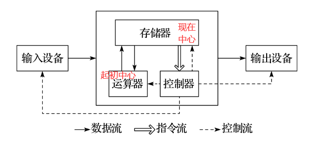
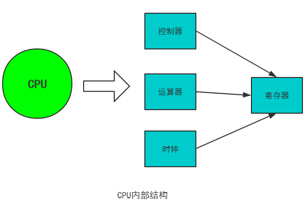
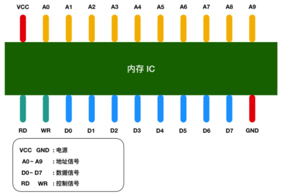
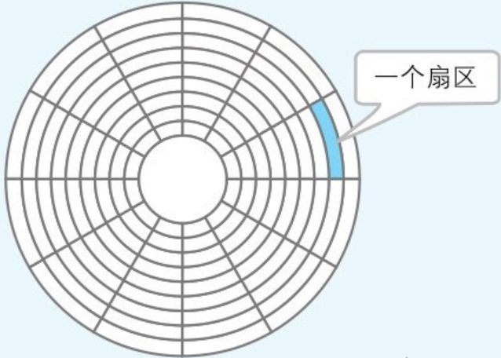
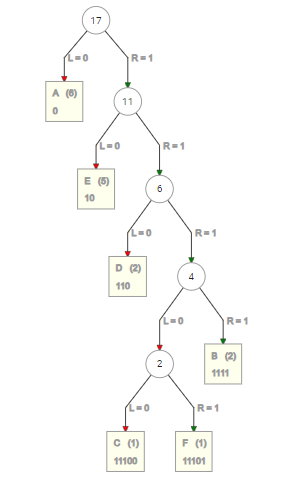

# 计算机组成原理

## CPU（ Central Processing Unit）

CPU 即中央处理器，其核心可以分为三个关键阶段：**提取，解码和执行**，具体而言是：CPU 从系统的主存中**提取**指令，然后**解码**该指令的实际内容，然后再由 CPU 的相关部分执行该指令 。

CPU 主要由两部分构成：控制单元（CU，Control Unit）和算术逻辑单元（ALU，Arithmetic Logic unit），其中控制单元负责从内存中**提取**指令并**解码**、**执行**，ALU负责处理算术和逻辑运算。

功能上，CPU 由**寄存器、控制器、运算器和时钟**四部分组成，各部分之间通过**电信号**连通。**寄存器**是用来暂存指令、数据和地址，可视为内存的一种。根据种类的不同，一个 CPU 内部会有 20~100 个寄存器。**控制器**负责把内存上的指令、数据读入寄存器，并根据指令的结果控制计算机。**运算器**负责运算从内存中读入寄存器的数据。**时钟**负责发出CPU开始计时的时钟信号。

寄存器作为 CPU 的通信核心，而且在应用程序中，寄存器是作为对象描述的。而 CPU 中根据功能的不同，寄存器划分为：

| 种类       | 功能           | 数量    |
| :-----     | :-----         | :----- |
| 累加寄存器  | 存储运行的数据和运算后的数据。| 1 |
| 标志寄存器 | 用于反映处理器的状态和运算结果的某些特征以及控制指令的执行。运算结果的正、负和零三种状态由标志寄存器的第 1、2 和 3 个字节位为 1 表示。 | 1 |
| 程序计数器 | 用于存放下一条即将执行的指令所在单元的地址。程序计数器控制着程序的流程。|	1 |
| 基址寄存器 | 存储数据内存的起始位置。|	多个 |
| 变址寄存器 | 存储基址寄存器的相对地址。|	多个 |
| 通用寄存器 | 存储任意数据。	|多个 |
| 指令寄存器 | 储存正在被运行的指令，CPU 内部使用，程序员无法对该寄存器进行读写。|	1 |
| 栈寄存器 | 存储栈区域的起始位置。|	1 |

**函数调用时触发 call 指令，函数返回时触发 return 指令。call 指令**会把函数调用后要执行的指令地址存储在名为栈的主存内。**return 指令**的功能是把保存在栈中的指令地址设定到程序计数器。

**CPU执行比较运算的机制**：假设累加寄存器中存储的 X 和通用寄存器中存储的 Y 做比较，CPU 的运算机制就会对X和Y做减法运算。而无论减法运算的结果是正数、零还是负数，都会保存到标志寄存器中。结果为正表示 X 比 Y 大，结果为零表示 X 和 Y 相等，结果为负表示 X 比 Y 小。程序比较的指令，实际上是在 CPU 内部做减法运算。

高级编程语言中的条件控制流程主要分为三种：**顺序执行、条件分支、循环判断**三种，顺序执行是按照地址的内容依次顺序（程序计数器值++）的执行指令。条件分支是根据条件执行指定地址的指令。循环是重复执行同一地址的指令。

冯·诺伊曼体系的计算机CPU，其工作都可以分为5个阶段：**取指令、指令译码、执行指令、访存取数、结果写回**。
1. **取指令**是将内存中的指令读取到 CPU 中寄存器（程序计数器）的过程。
2. **指令译码**是在取完指令后，立马进入指令译码阶段，**指令译码器**按照预定的指令格式，对取回的指令进行拆分和解释，识别区分出不同的指令类别以及各种获取操作数的方法。
3. **执行指令**是译码完成后，完成指令所规定的各种操作。
4. **访问取数**是根据指令的需要，在执行指令过程中有可能需要从内存中提取数据，此阶段的任务是：**根据指令地址**，得到操作数在主存中的地址，并从主存中读取该操作数用于运算。
5. **结果写回（Write Back，WB）**是把执行指令阶段的**运行结果数据**“写回”到某种存储形式：结果数据经常被写到 **CPU 的内部寄存器**中，以便被后续的指令快速地存取。

## 内存（Memory）

内存（或称为主存）作用是存放 CPU 中的运算数据，以及与硬盘等外部存储设备交换的数据。

**内存**是由各种**集成电路（IC，integrated circuit）**组成的，其主要分为三种存储器：
1. **随机存储器（RAM）**：既可以从中读取数据，也可以写入数据。当机器关闭时，其中的信息会丢失。
2. **只读存储器（ROM）**：一般只能用于数据的读取，不能写入数据，但是当机器停电时，这些数据不会丢失。
3. **高速缓存（Cache）**：分为一级缓存（L1 Cache）、二级缓存（L2 Cache）和三级缓存（L3 Cache），它位于内存和 CPU 之间，读写速度比内存更快。当 CPU 向内存写入数据时，这些数据也会被写入高速缓存中。

**内存 IC**是一个完整的结构，它内部也有电源、地址信号、数据信号、控制信号和用于寻址的 IC 引脚来进行数据的读写。

VCC（Voltage Circuit，正极） 和 GND（Ground，负极） 表示电源，A0 - A9 是地址信号的引脚，D0 - D7 表示的是数据信号、RD（Read，读取） 和 WR（Write，写入）都是控制信号，信号均是 0 或 1。数据信号 D0 - D7 共八个，**表示一次可以输入输出 8 bit = 1 byte（字节） 的数据**。地址信号 A0 - A9 共十个，表示可以指定 00000 00000 - 11111 11111 共 2 的 10次方 = 1024个地址。每个地址对应的位置会存放 1 byte 的数据，因此我们可以得出内存 IC 的容量就是 1 KB。

**假设要向内存IC中写入1byte的数据的话，过程如下**：
1. VCC接通 +5V，GND接通0V，使用 A0 - A9 来指定数据的存储地址，然后再把数据的值输入给 D0 - D7 的数据信号，并把WR的值置为 1，执行完这些操作后，即可以向内存 IC 写入数据；
2. 读出数据时，只需要通过 A0 - A9 的地址信号指定数据的存储地址，然后再将 RD 的值置为 1 即可；
3. 图中的 RD 和 WR 又被称为控制信号。其中当WR 和 RD 都为 0 时，无法进行写入和读取操作。

## 磁盘

计算机的五大基础部件是存储器、控制器、运算器、输入和输出设备（冯诺依曼体系），其中存储器除了内存，还包括磁盘。

磁盘中存储的程序必须加载到内存中才能运行，这是因为负责解析和运行程序内容的 CPU 通过程序计数器读出程序指令指定的是内存地址。

每次内存都需要从磁盘中读取数据，必然会读到相同的内容，所以需要**磁盘缓存**负责存储经常访问的内容。**磁盘缓存指的是把从磁盘中读出的数据存储到内存的方式**。读取相同的内容时，不再通过实际的磁盘，而是通过磁盘缓存来读取。磁盘缓存就大大改善了磁盘访问的速度。

磁盘的物理结构指的是磁盘存储数据的形式。划分的方式有两种：**可变长方式**和**扇区方式**，分别对应于划分为长度可变和长度固定的空间。Windows 是使用扇区。扇区中，把磁盘表面分成若干个同心圆的空间就是磁道，把磁道按照固定大小的存储空间划分而成的就是扇区。扇区是对磁盘进行物理读写的最小单位。Windows 中使用的磁盘，一般是一个扇区 512 个字节。不过，Windows 在逻辑方面对磁盘进行读写的单位是扇区整数倍簇。根据磁盘容量不同功能，1簇可以是 512 字节（1 簇 = 1扇区）、1KB（1 簇 = 2 扇区）、2KB、4KB、8KB、16KB、32KB( 1 簇 = 64 扇区)。因此，磁盘的容量越大，簇的容量也越大。不过，在软盘中簇和扇区的大小是相等的。

## 二进制

b 进制的数 akak-1...a2a1a0 其十进制表示为 。其中 k 表示位权。在二进制中，最高位为符号位，1 为负数，0 为正数。**原码**就是数的二进制表示。在计算机系统中，数值一律用补码来表示并存储。**正数的补码是其本身，负数的补码等于二进制表示取反+1**。

移位运算：将二进制的数值的各个位置上的元素作**左移或右移**操作，其中左移右端补 0（0000 1001 左移一位 0001 0010 即 * 2）。对于右移操作，将二进制数作为带符号的数值进行右移时，移位后需在最高位填充符号位的值(正数： 0 或 负数：1)被称为**算数右移**（0000 1101 右移一位 0000 0110 即整除以 2）。

**符号扩展（或符号扩充）：短数据类型转换为长数据类型，在保留数字的符号（正负性）及数值不变的情况下，增加二进制数字位数的操作**（左侧补 0 后符号位填充在最左高字节位）。

## 压缩算法（compaction algorithm）

文件是字节数据的集合。用 1byte 字节（8 bits 位）表示的字节数据有 256 种，即 0000 0000 ~1111 1111。在任何情况下，文件中的字节数都是连续存储的。

压缩算法主要包括**压缩**和**还原**（解压缩）的两个步骤，目的是在不改变原有文件属性的前提下，降低文件字节空间和占用空间的一种算法。根据压缩算法的定义，我们可将其分成不同的类型：
1. **按是否有损，分为无损压缩和有损压缩，前者**能够无失真地从压缩后的数据重构，准确地还原原始数据。可用于对数据的准确性要求严格的场合，如可执行文件和普通文件的压缩、磁盘的压缩，也可用于多媒体数据的压缩。该方法的**压缩比（压缩后的大小/压缩前的大小）**较小。如**差分编码、RLE**（Run Length Encoding, 行程长度编码）、Huffman编码、LZW编码、算术编码。**后者**有失真，不能完全准确地恢复原始数据，重构的数据只是原始数据的一个近似。可用于对数据的准确性要求不高的场合，如**多媒体数据的压缩**。该方法的**压缩比**较大。例如预测编码、音感编码、分形压缩、**小波压缩**、**JPEG/MPEG**。
2. **按对称性，即编解码算法的复杂性和所需时间是否相似，多数压缩算法都是对称的**。但也有不对称的，比如 **Huffman 编码**和分形编码编码难而解码容易。但用于密码学的编码方法则相反，是编码容易而解码难。
3. **按帧间与帧内**：在**视频编码中会同时用到帧内与帧间的编码方法，帧内编码**是指在一帧图像内独立完成的编码方法，同静态图像的编码，如 **JPEG**；而**帧间编码**则需要参照前后帧才能进行编解码，并在编码过程中考虑对帧之间的时间冗余的压缩，如 **MPEG**。
4. **按是否实时性要求**：多媒体场景，需要实时处理或传输数据（如现场的数字录音和录影、播放 MP3/RM/VCD/DVD、视频/音频点播、网络现场直播、可视电话、视频会议），编解码一般要求延时 ≤50 ms。这就需要简单/快速/高效的算法和高速/复杂的 CPU/DSP（Digital Signal Processor，数字信号处理器）。
5. **按是否支持分级处理**：可以同时处理不同分辨率、不同传输速率、不同质量水平的多媒体数据的压缩算法，如 JPEG2000、MPEG-2/4。
6. **按是否可逆：能还原到压缩前状态的压缩称为可逆压缩**，比如 Huffman 编码算法和 RLE 算法；**无法还原到压缩前状态的压缩称为非可逆压缩**，JPEG 文件采用的就是非可逆压缩。

### RLE算法

把文件内容用“数据 * 重复次数”的形式来表示的压缩方法成为 RLE(Run Length Encoding, 行程长度编码)  算法。比如，AAAAAABBCDDEEEEEF 的17个字符被压缩成了 A6B2C1D2E5F1 的12个字符，也就是 12 / 17  = 70%，压缩比为 70%。**经常用于压缩传真的图像等**。

### Huffman（哈夫曼）算法

Huffman 算法是指按照出现频率高的字符用尽量少的位数编码来表示，为**各压缩对象文件**分别构造最佳的编码体系，并以该编码体系为基础来进行压缩。Huffman 算法压缩过的文件中，存储着 Huffman 编码信息和压缩过的数据。

**构造哈夫曼树的步骤**：
1. 出字符中权值（频率）最小的两个，组成二叉树。在频率表中删除此次找到的两个数，并加入此次最小两个数的频率和。
2. 不断重复第（1）步，直到频率表为空。

AAAAAABBCDDEEEEEF 的17个字符构建哈夫曼树后为：

即 000000(AAAAAA)11111111(BB)11100(C)110110(DD)1010101010(EEEEE)11101(F)，共40 bits 位 = 5 bytes字节，压缩比为 5 / 17 = 29%。

Huffman 算法，可以提升压缩比率，无论哪种类型的数据，都可以用 Huffman 树作为压缩算法：

| 文件类型	| 压缩前	| 压缩后 |	压缩比率 |
| :-----   | :-----  | :----- | :-----  |
|文本文件|	14862字节	|4119字节|	28%|
|图像文件	|96062字节|	9456字节|	10%|
|EXE文件	|24576字节|	4652字节|	19%|