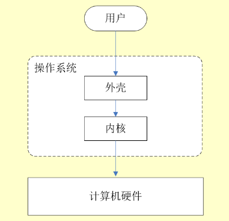
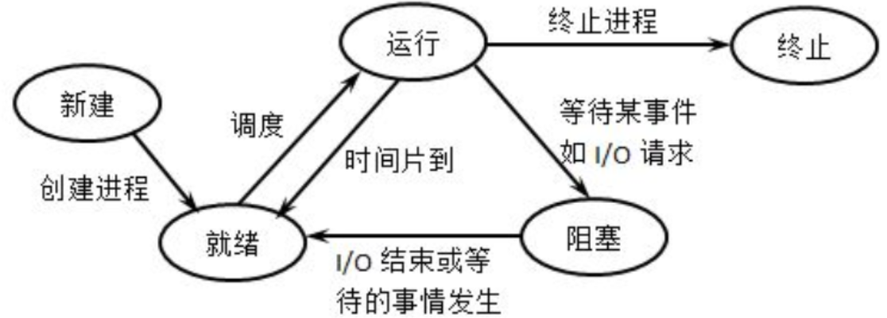
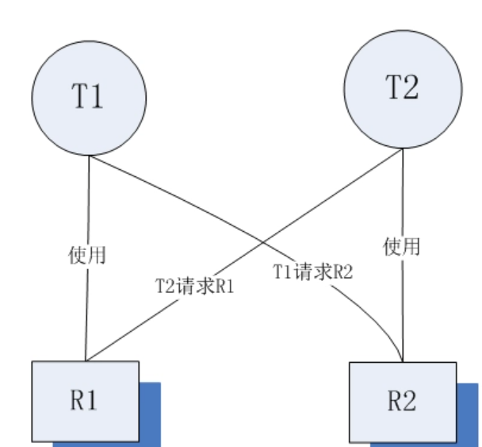
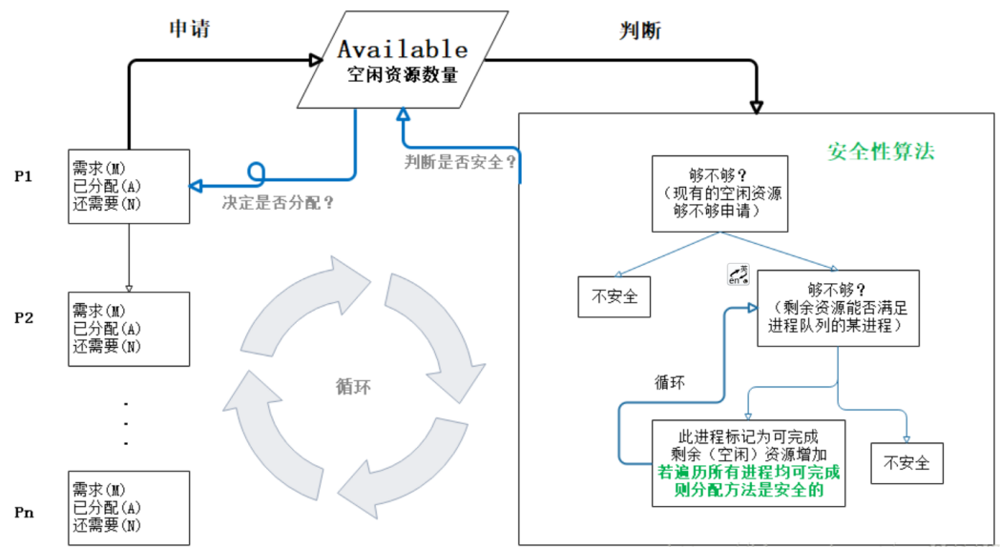
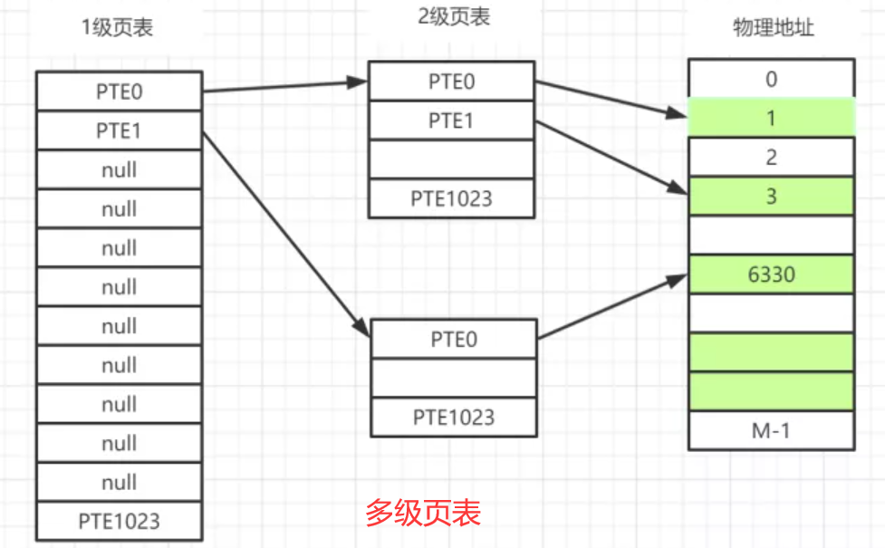
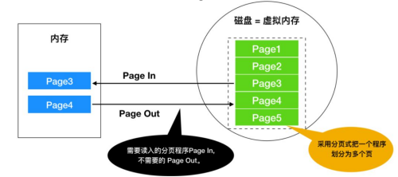

# 操作系统

操作系统是运行在计算机上管理计算机硬件与软件资源的**软件程序**。常见操作系统有：
- Windows
- macOS
- Linux
- IOS
- Android

操作系统支持额外的扩展，比如 I/O 设备驱动和文件系统，支持按需装载，在 UNIX/Linux 中叫做共享库（.so，shared library），在 Windows 中则被称为动态链接库（.ddl，Dynamic Link Library）。

**用户态**（用户程序）通过**系统调用**（设备管理、文件管理、进程控制、进程通信、内存管理）申请使用系统态级别的资源，并由操作系统代为完成**系统态**的操作。

## Linux

1. 创建目录/移除目录：mkdir/rmdir。

2. 查找字符串：grep。

3. 显示当前所在目录：pwd。

4. 创建空文件：touch。

5. 编辑器：vim 或 vi。

6. 列出文件列表：ls，-a 表示显示所有文件，包括隐藏文件；-l，表示列出文件详情信息。

7. 打包并压缩/只打包不压缩：tar -zcvf / tar -cvf。

8. 用于显示文件后几行内容：tail，-f 动态打印文件内容。

9. 用于查看当前正在运行的进程（PID）：ps，-aux 显示所有状态。

10. 终止进程：kill，-9[pid]表示强迫进程立即停止。

11. 搜索：grep

12. 从宏观上观察系统各个进程对CPU的占用情况以及内存使用情况：top，进程数统计（总进程，运行进程，睡眠进程等）；CPU 统计（用户CPU占用、内核CPU占用等）；内存信息（总物理内存，已用物理内存，空闲物理内存，交换区总量，使用的交换区等）；进程详细信息（id，使用的 CPU 占比，使用的内存占比，共享内存大小，使用 CPU 时间）。top -H -p [pid] 输出某个特定进程内所有线程的运行情况。

13. 监控全部或指定进程占用系统资源情况，如 CPU，内存，设备 IO，任务切换，线程等：pidstat，-u 是 CPU 使用情况统计；-r 是内存使用情况统计；-d 是 IO 情况统计；-p 针对特定进程进行统计。

14. 监控 TCP/IP 网络状态：netstat。dstat 是可以取代 vmstat，iostat，netstat 和 ifstat 命令的多功能产品。

15. less [参数] 文件：查看文件，比 more 更有弹性，性能更高，它可以前后翻页。

16. 数据处理工具：awk。

## 进程与线程

### 进程与线程区别（即概念）

进程和线程都是在**程序执行过程**中的**运行活动**。

进程是**系统资源分配**的最小**独立**单位，线程是**程序执行（CPU 调度）**的最小单位。

线程从属于进程，进程拥有**独立的地址**数据空间（一个进程死掉不影响另一个进程），线程共享进程的地址数据空间（一个线程死掉可能会导致整个进程被操作系统杀掉，进程占用资源多于线程）。

**一个进程至少有一个运行代码的主线程**。

**多线程编程性能和体验更好，却对其余进程不友好（占用大量 CPU 资源）**。

线程**共享堆、全局变量、静态变量、文件**等资源，**独享栈和寄存器**等资源。

### 进程的状态

- **创建**状态(new)。
- **就绪**状态(ready) （就差 CPU 资源就可运行）。
- **运行**状态(running) 。
- **阻塞**状态(waiting) （即等待状态，等待资源或 IO 操作完成）。
- **结束**状态(terminated) （正常结束或中断退出）。

### 进程通信（IPC）

**无名管道**：半双工通信（单向数据流动）且仅具有亲缘关系的进程通信（**通过父进程 fork 出来的子进程**），存在于内存； 

**有名管道**：半双工通信（单向数据流动）且无论是否亲缘关系的进程通信，存在于磁盘；

**信号**：一种比较复杂的通信方式，用于通知接收进程某个事件已经发生

**消息队列** ：消息队列是内核中由消息队列标识符标识的消息构成的链表。消息队列克服了**信号承载信息量少，管道只能承载无格式字节流和缓冲区大小受限**等缺点。

**信号量** ：一个计数器，用于多进程对共享数据的访问，目的在于进程间同步并避免竞争条件。

**共享内存**：由一个进程创建的映射一段能被其他多个进程所访问的内存。往往**配合其他通信机制（互斥锁、信号量）进行进程间同步（最快且最有用的进程间通信方式）**。

**套接字**: 可用套接字中的相关函数来完成通信过程，还可用于不同机器之间的进程。

### 进程的调度算法

目的在于**确定进程的执行顺序，实现 CPU 最大利用率**。

算法有：
- **先到先服务**: 按进程进入就绪队列的先后次序运行。
- **短进程优先**: 选择就绪队列中估计运行时间最短的进程运行（优先照顾了短进程而忽略了长进程）。
- **时间片轮转**: 又称 RR(Round robin)调度。每个进程均有一个时间片，即该进程允许运行的时间。超时送入就绪队列的队尾，换队首进程运行。
- **优先级**：每个进程分配（**按内存、时间或其他资源**）**优先级**，首先运行具有最高优先级的进程。相同优先级的进程以**先到先服务**方式运行。
- **高响应比**：按照高**响应比[（已等待时间 + 要求运行时间）/ 要求运行时间 ]**优先的原则，等待时间越长或运行时间越短响应比越高。
- **多级反馈队列** ：将就绪队列再划（进程性质和类型）分成子队列，不同子队列采用适合自己队列进程性质的调度算法。**是较好的进程调度算法（UNIX操作系统采用）**。

### 线程同步

线程同步是两个或多个共享关键资源的线程在并发执行过程中避免资源冲突。

方式：

- **互斥量**：通过互斥对象具有唯一性，只有拥有互斥对象的线程才能访问公共资源。
- **信号量**：通过控制同一时刻多个线程访问同一资源最大线程数量。
- **事件**：通过通知操作的方式来保持多线程同步，便于实现多线程优先级的比较操作。

### 死锁

**死锁**是指两个或两个以上的进程在运行过程中因争夺资源或因彼此通信而造成的一一种阻塞的现象，若无外力作用，它们都将无法推进下去。这些永远在互相等待的进程称为死锁进程。 如下图所示：

**死锁的发生必须具备以下四个必要条件**：

- **互斥条件**：进程要求对所分配的资源进行排它性控制，即在一段时间内某资源仅为一进程所占用。
- **请求和保持条件**：当进程因请求资源而阻塞时，对已获得的资源保持不放。
- **不剥夺条件**：进程已获得的资源在未使用完之前，不能剥夺，只能在使用完时由自己释放。
- **环路等待条件**：在发生死锁时，必然存在一个进程--资源的环形链。进程集合{P0，P1，P2，···，Pn}中的P0正在等待一个P1占用的资源；P1正在等待P2占用的资源，……，Pn正在等待已被P0占用的资源。

**死锁产生的两类原因**：

- 竞争资源——**不可剥夺资源**（分配给某进程后不能强行收回，只能在进程用完后自行释放的资源，如磁带机、打印机等；与之相对的是可以再被其他进程或系统剥夺的**可剥夺性资源**，如CPU和主存）或者**临时资源**（临时资源包括硬件中断、信号、消息、缓冲区内的消息等）。
- 进程间的推进顺序非法。

**解决死锁的基本方法**：

- 预防死锁：**需要破坏死锁发生的必要条件之一，其中不能破坏互斥条件，因为使用锁目的就是保证资源被互斥访问**。**非保持**，即占用部分资源的线程如果申请不到其他资源时，可以主动释放它占有的资源（比如设置定时器，超时释放资源）；**非循环等待**，即按序申请，所谓按序申请，是指资源是有线性顺序的，申请的时候按序号从小到大进行申请，线性化申请避免循环；**非请求**，即不是使用前才申请，而是一次性申请所有需要的资源。
- 避免死锁：预防死锁是严格防止死锁的出现，这会使系统性能降低。而避免死锁允许进程动态地申请资源，并在资源分配之前预先计算资源分配的安全性，以此判断是否分配资源。**其中最具有代表性的避免死锁算法是银行家算法**——首先定义**状态**和**安全状态**的概念。系统的状态是当前给进程分配的资源情况，包含两个一维数组Resource（系统中每种资源的总量）和Available（未分配给进程的每种资源的总量）及两个二维数组Claim（表示进程对资源的需求）和Allocation（表示当前分配给进程的资源）。**系统的安全状态是指至少存在一个资源分配序列不会导致死锁**。当一个进程申请使用资源的时候，银行家算法通过先试探分配给该进程资源（前提是申请的资源数量小于等于剩余资源），然后通过安全性算法判断分配后的系统是否处于安全状态，若不安全则试探分配作废，让该进程继续等待。如此来避免系统存在潜在死锁的风险。
> **安全性算法**：判断分配给P1后剩余的资源，能不能使进程队列的某个进程执行完毕，若没有进程可执行完毕，则系统处于不安全状态（即此时没有一个进程能够完成并释放资源，随时间推移，系统终将处于死锁状态）。若存在进程P3可执行完毕，则假设P3执行完毕后回收已分配给它的资源并标记为可完成（剩余资源数量增加），然后继续判断队列中的其它进程，若所有进程都将能执行完毕，则系统处于安全状态，并根据可完成进程的分配顺序生成安全序列（如{P3，P0，P2，P1}表示将申请后的剩余资源先分配给P3–>回收–>分配给P0–>回收–>分配给P2–> 回收 —> 分配给 P1），否则不安全。

- 检测死锁：为每个进程和每个资源指定一个唯一标识，并建立资源分配表和进程等待表。
- 解除死锁：即发现有进程死锁的同时立即把它从死锁状态中解脱出来。**剥夺资源，即**从其它进程剥夺足够数量的资源给死锁进程，以解除死锁状态；**撤消进程，即**撤消死锁进程或撤消代价最小的进程（代价指优先级、运行代价、进程的重要性和价值等），直到有足够的资源可用和死锁状态消除为止。

### 并行与并发

并行（Parallelism）：指程序的运行状态，在同一时间内有几件事情并行在处理。由于一个线程在同一时间只能处理一件事情，所以并行需要多个线程在同一时间执行多件事情。

并发（Concurrency）：指程序的设计结构，在同一时间内多件事情能被交替地处理。重点是，在某个时刻只有一件事情在执行。比如单核 CPU 能实现多任务运行的过程就是并发。

### 阻塞与非阻塞

阻塞（Blocking）：阻塞是指调用在等待的过程中线程被挂起（CPU 资源被分配到其他地方去）。

非阻塞（Non-blocking）：非阻塞是指等待的过程 CPU 资源还在该线程中，线程还能做其他的事情。

### 同步与异步

同步（Synchronous）：各方都实时（或者尽可能实时）地收取（而且必要的话也处理或者回复）信息的即时沟通方式，即为同步。程序发出调用的时候，一直等待直到返回结果，没有结果之前不会返回。也就是，同步时调用者主动等待调用过程，且能立即得到结果的。

异步（Asynchronous）：异步指两个或两个以上的对象或事件不同时存在或发生（或多个相关事物的发生无需等待其前一事物的完成）。程序发出调用之后，无法立即得到结果，需要额外的操作才能得到预期的结果是为异步。

### 单线程与多线程

**单线程**：从头执行到尾，逐行执行，如果其中一行代码报错，那么剩下代码将不再执行。同时容易代码阻塞。

**多线程**：代码运行的环境不同，各线程独立，互不影响，避免阻塞。
**多线程可能出现的问题**：
1. 竞态条件：多线程处理会导致访问共享内存的竞争条件，可能导致数据不一致和死锁等问题。
2. 同步问题：多线程需要进行同步，避免数据竞争和死锁，这会增加代码的复杂度和开销。
3. 安全问题：多线程可能会存在安全漏洞，如数据泄露、内存溢出等问题。
4. 性能问题：多线程处理可能会导致过多的上下文切换和内存消耗，从而降低程序的性能和稳定性。

## 内存管理

内存管理涉及内存分配、回收和**地址转换（逻辑地址转换为物理地址）**。

### 内存管理机制

连续分配管理：**块式管理**（块中容易形成未被利用的内存空间——碎片，内存利用率低下）；

非连续分配管理：**页式管理**（页是物理信息单位，页表记录“逻辑—物理地址”的映射，内存利用率提高）、**段式管理**（将页细化成**定义了逻辑信息的具有实际意义的段，段表**）、**段页式管理（先分段再分页）**。

### 分页与分段

分页、分段目的都是**提高内存利用率，减少内存碎片**；

段之间、页**之间均为离散存储**，段之内、页**之内均为连续的**；

**页大小固定**，由操作系统决定；**段**取决于当前运行的程序，**大小不固定**；

**分页（物理信息单位）**仅为满足操作系统内存管理需求，而**段（逻辑信息单位，体现为代码段/数据段）**能更好满足用户需求。

### 快表与多级页表

为了解决虚拟地址到物理地址的转换速度，操作系统在**页表方案**基础之上引入了**快表（页表的高速缓冲存储器（Cache），类似于redis 之于 mysql）**来**加速虚拟地址到物理地址的转换**。若采用页表做地址转换，读写内存数据时 CPU 要访问两次主存。引入块表后，有时只需访问一次高速缓冲存储器和一次主存，这样可加速查找并提高指令执行速度。转换流程如下：
1. 根据虚拟地址中的页号查快表；
2. 如果该页在快表中，直接从快表中读取相应的物理地址；
3. 如果该页不在快表中，就访问内存中的页表，再从页表中得到物理地址，同时将页表中的该映射表项添加到快表中；
4. 当快表填满后，又要登记新页时，就按照一定的淘汰策略淘汰掉快表中的一个页。
为了避免把全部页表（尤其是根本就不需要的页表）一直放在内存中占用过多空间，引入多级页表：将1级页表划分成若干个2级页表，1级页表中存储的是到2级页表的映射，对于没有使用的2级页表就可以不需要存储再内存中了，使得页表占用的内存空间大幅减少。

### 物理地址和逻辑（虚拟）地址

CPU 采用**虚拟寻址**：将逻辑地址映射为物理地址（CPU中的内存管理单元MMU）；**虚拟地址**允许一系列**相邻的虚拟地址访问真实物理地址不连续的内存区域**；虚拟地址允许访问**大于可用物理内存**的内存缓冲区（物理内存页+磁盘文件——**当可用物理内存变小时**内存管理器会将物理内存页（通常大小为 4 KB）保存到磁盘文件，数据或代码页会根据需要在该物理内存与磁盘之间移动）；**不同进程使用的虚拟地址彼此隔离**，因为直接暴露物理地址（内存单元真实地址），会对操作系统造成伤害（若用户能访问任意物理内存，会影响到操作系统）和同时给运行多个程序造成困难（同时访问同一物理内存地址而崩溃）；

### 虚拟内存

虚拟内存定义了一个连续的虚拟（逻辑）地址空间（实际上被分隔成多个物理内存碎片或部分存储在外部磁盘存储器），并且把内存扩展到硬盘空间（**Linux 的交换空间，windows 的虚拟内存**）。

**局部性原理：时间局部性 （高速缓存实现）** —— 程序在某一段时间内访问**同一数据**或执行**同一指令**多次（产生于程序存在的循环操作）。**空间局部性** —— 程序在一段时间内所访问的可能是**一定范围内的内存地址**（产生于指令的顺序存放和顺序执行，数据的连续存储，比如数组等）

虚拟内存技术就是建立了 “内存一外存”的两级存储器的结构，利用局部性原理实现髙速缓存，**程序运行时，动态将需要的部分调入内存，不需要的调入外存**，是用时间（CPU计算时间 + 页调入调出时间）换空间（内外存）的方案。**实现方式可以是**：
1. 请求分页存储管理（在页式管理基础上增加请求调页功能和页面置换功能，是目前最常用的实现虚拟内存的方式）；
2. 请求分段存储管理；
3. 请求段页式存储管理。

需执行的指令或数据未在内存，称为**缺页/缺段**；CPU通知操作系统OS将其调入内存的过程称为**缺页中断**。

Windows 采用的是分页式：在不考虑程序构造的情况下，把运行的程序按照一定大小（4KB）的页进行分割，并**以页为单位进行置换**。在分页式中，把磁盘的内容读到内存中称为 Page In，把内存的内容写入磁盘称为 Page Out。

为了实现虚拟内存功能，Windows在磁盘上提供了虚拟内存使用的文件（page file，页文件）。该文件由 Windows 生成和管理，文件的大小和虚拟内存大小相同，通常大小是内存的 1 - 2 倍。

### 页面置换算法（淘汰机制/算法）

缺页中断时将选择合适的内存中的页调出（即淘汰）置换所需外存中的页，**页面置换算法目的是选择内存中合适的页淘汰掉**。
- **PT页面置换算法（最佳页面置换算法）**：不可实现的理想情况，一般作为衡量其他置换算法的方法。
- **FIFO（First In First Out）页面置换算法（先进先出页面置换算法）**: 淘汰在**内存中驻留时间最久**的页。
- **LRU（Least Recently Used）页面置换算法（最近最久未使用页面置换算法）**：赋予每页一个上次访问所经历的时间T字段，淘汰T值最大的页。
- **LFU（Least Frequently Used）页面置换算法（最近最少使用页面排序算法）**: 不断维护一个按最近一段时间**使用频率**排序的页链表。缺页时淘汰链表尾节点的页。