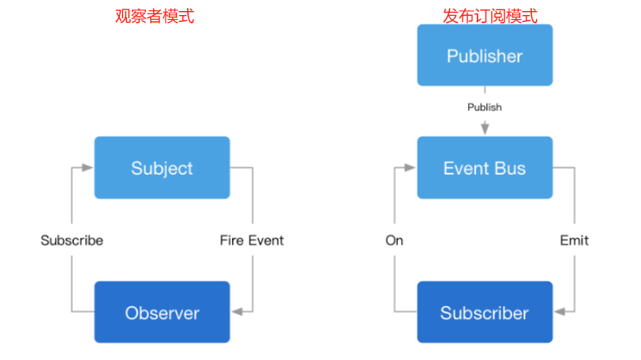

# 前端常用设计模式

设计模式是通过代码设计经验总结出的解决问题的一系列套路。

## 设计模式的原则（SOLID）

1. **单一职责原则（Single Responsibility Principle）**：一个类或者模块只负责完成一个职责（或者功能）。避免将不相关的代码耦合在一起，提高了类或者模块的内聚性。
2. **开放封闭原则（Open Closed Principle）**：软件实体（模块、类、方法等）应该对扩展开放、对修改关闭。
3. **里式替换原则（Liskov Substitution Principle）**：子类对象能够替换程序中父类对象出现的任何地方，并且保证原来程序的逻辑行为不变及正确性不被破坏。
4. **接口隔离原则（Interface Segregation Principle）**：接口的调用者不应该被强迫依赖它不需要的接口。
5. **依赖倒置原则（Dependency Inversion Principle）**：高层模块不要依赖低层模块。即面向接口编程，依赖于抽象而不依赖于具体。

Unix/Linux设计哲学：
1. 小即是美；让每个程序只做一件事；快速建立原型。
2. 舍弃高效率，而更关注可移植性和可扩展性；采用纯文本方式来存储数据；充分利用软件得杠杆效应（软件复用、代码复用）。
3. 避免强制性的用户界面；允许用户定制环境（考虑多环境、扩展性）；寻求90%的解决方案。

## 常用的 23 种设计模式

<font color="red">加粗的是前端常用</font>：

创建型模式：
1. **工厂模式**（包括：工厂方法模式，抽象工厂模式，建造者模式）；
2. **单例模式**；
3. **原型模式**。

结构型模式：
1. 适配器模式；
2. **装饰器模式**；
3. **代理模式**；
4. 桥接模式；
5. 组合模式；
6. 享元模式。

行为型模式：
1. **策略模式**；
2. **观察者模式**；
3. **迭代器模式**；
4. 模板方法模式；
5. 职责连模式；
6. 命令模式；
7. 备忘录模式；
8. 状态模式；
9. 访问者模式；
10. 中介者模式；
11. 解释器模式。

## 单例模式

**保证一个类仅有一个实例，并提供一个访问它的全局访问点**。单例模式能保证全局的唯一性，可以减少命名变量，单例模式在一定情况下可以节约内存，减少过多的类生成需要的内存和运行时间，把代码都放在一个类里面维护，实现了高内聚。

**优点**是提供了对唯一实例的受控访问、避免对共享资源的多重占用、节约系统资源。**缺点**是扩展性差和职责过重。

**场景**：
1. (登录)弹窗；
2. Vuex的store；
3. 自定义事件EventBus

**注意**：Java 是多线程，单例模式需要加线程锁 —— 而 JavaScript 是单线程，因此不用考虑同步锁的问题。

**模式实现**：

```typescript
/**
 * js 利用代理实现单例
 * @param className
 * @returns
 */
function singleton<T extends object>(className: Constructor<T>) {
  let instance: T | null = null;
  return new Proxy(className, {
    construct(target, args) {
      return instance || (instance = new target(...args));
    }
  });
}

/**
 * typescript 实现单例（不需要使用代理）
 * const s1 = Singleton.getInstance();
 * const s2 = Singleton.getInstance();
 * console.log(s1 === s2); // true
 */
class Singleton {
  private static instance: Singleton;
  private constructor() {}

  public static getInstance() {
    return Singleton.instance || (Singleton.instance = new Singleton());
  }

  someMethod() {}
}

/**
 * 模块化实现单例
 * 
  let instance // 闭包
  class Singleton {}
  // 外部只能 import 这个函数
  export default () => {
    return instance || (instance = new Singleton());
  }
 */

/**
 * 闭包实现单例
 * 
  function genGetInstance() {
    let instance // 闭包
    class Singleton {}
    return () => {
      return instance || (instance = new Singleton());
    }
  }
  const getInstance = genGetInstance()
  const s1 = getInstance()
  const s2 = getInstance()
 */
```

**惰性弹窗**：

```javascript
const getSingleton = function(fn) {
  let instance = null;
  return function(...args) {
    return instance || (instance = fn.apply(this, args)); // 不存在才调用构造函数创建
  }
}
const createAlert = function(html) {
  let dev = document.createElement('div');
  div.innerHTML = html;
  div.style.display = 'none';
  document.body.appendChild(div);
  return div;
}
const createSingleAlert = getSingleton(createAlert);
document.body.addEvenListener('click', function() {
  // 多次点击只会产生一个弹窗
  const alertMessage = createSingleAlert('请先注册/登录');
  alertMessage.style.display = 'block';
})
```

## 观察者模式和发布-订阅模式



在**观察者模式**中，观察者Observer需要直接订阅目标事件Subject；在目标发出内容改变的事件后，直接接收事件并作出响应，比如 addEventListener 绑定事件。

在**发布订阅模式**中，发布者publisher和订阅者subscriber之间加入一个事件通道Event Bus，Event Bus从发布者publisher接收事件，向订阅者subscriber发布事件；订阅者需要从事件通道订阅事件。比如，自定义事件，需要在代码中触发 emit。

**观察者模式场景**：
1. Vue和React的生命周期；
2. DOM事件；
3. Vue的watch选项；
4. Vue的组件更新过程；
5. 各种异步回调：setTimeout、promise.then、nodejs的文件读取流；
6. MutationObserver。

**观察者模式实现**：

```typescript
// 目标
class Subject {
  private state: number = 0;
  private observers: Observer[] = [];

  getState(): number {
    return this.state;
  }

  setState(newState: number) {
    this.state = newState;
    this.notify(); // 通知
  }
  // 添加观察者
  attach(observer: Observer) {
    this.observers.push(observer);
  }

  // 通知
  private notify() {
    this.observers.forEach((o) => o.update(this.state));
  }
}

// 观察者
class Observer {
  name: string;
  constructor(name: string) {
    this.name = name;
  }
  update(state: number) {
    console.log(`${this.name} updated, state is ${state}`);
  }
}

const sub = new Subject();
const observer1 = new Observer('A');
const observer2 = new Observer('B');
sub.attach(observer1);
sub.attach(observer2);
sub.setState(1);
```

**发布-订阅模式场景**：
1. 自定义事件（Vue2 实例本身就支持自定义事件，但 Vue3 不再支持。Vue3 推荐使用 mitt，但mitt 没有 once，需要可以使用 event-emitter，在 Vue 和 React 组件中使用自定义事件，在组件销毁之前需要进行off，否则可能会导致内存泄漏，而且，off时要传入原来的函数，而不能是匿名函数）。
2. postMessage 通信。

**优点**是时间上解耦，可以实现异步、弱化对象实体间的引用关系，发布订阅模式中的事件通道可更细粒度处理。**缺点**是复杂场景不易追踪维护和理解，而且存在事件通道等额外时间内存开销。

**发布订阅模式实现**：

``` typescript
class EventEmitter {
  constructor() {
    this.listeners = {};
  }

  on(type, cb, options) {
    if (typeof type !== 'string' || typeof cb !== 'function') return false;

    this.listeners[type] = this.listeners[type] || [];

    this.listeners[type].push({
      cb,
      priority: options.priority || 0
    });

    return () => {
      this.listeners = this.listeners.filter((item) => item.cb !== cb);
    };
  }

  off(type, cb) {
    if (typeof type !== 'string' || typeof cb !== 'function') return false;

    if (!this.listeners[type] || this.listeners[type].length === 0) return false;

    for (let i = 0; i < this.listeners[type].length; i++) {
      if (this.listeners[type][i] === cb) {
        this.listeners[type].splice(i, 1);
      }
    }
  }

  emit(type, data) {
    if (typeof type !== 'string') return false;

    this.listeners[type] &&
      this.listeners[type].sort((a, b) => a.priority - b.priority).forEach((item) => item.cb.call(null, data));
  }
}
```