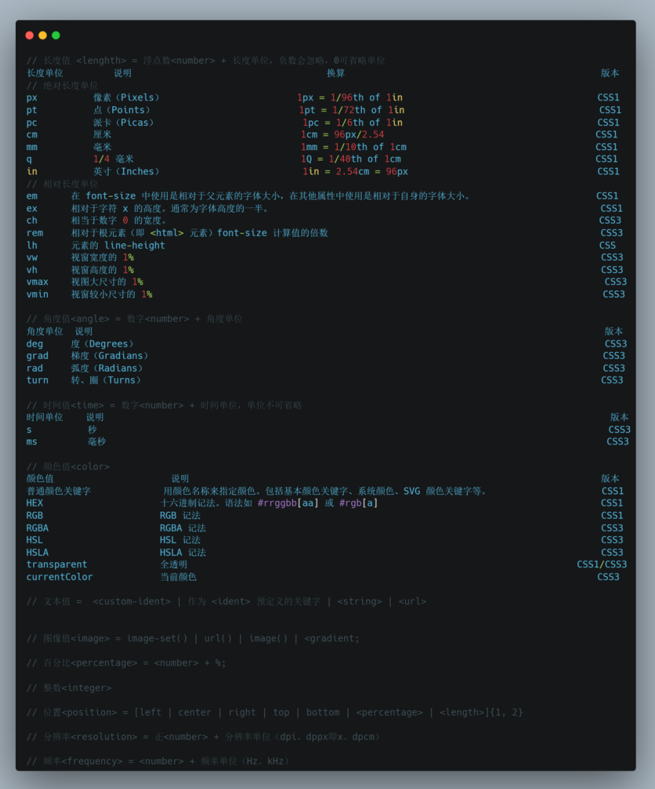

# CSS

CSS（层叠样式表，Cascading Style Sheets）不是编程语言，而是用来描述 HTML 或 XML（包括如 SVG、MathML 或 XHTML 之类的 XML 分支语言）文档的表现与展示效果的样式表语言。CSS3是CSS的最新标准，是**向后兼容（指的是老版本的功能和数据在新版本能完美运行，与向前兼容相反）的**，CSS1/2 的特性在 CSS3 里也可以使用。

## 值与单位

所有的 CSS 声明都包括一个 属性 / 值 对。由于属性不同，对应的值可能是一个单个整数或关键字，也可能是一串包含或不包含计数单位的数字和关键字的集合。

通常，支持四个方位的简写属性可以采用单值、两值、三值、四值语法，其中单值设置上下左右，两值设置上下、左右，三值设置上、左右、下，四值设置上、右、下、左。

**初始值（initial value）、指定值 (specified value) 、计算值（computed value）、应用值（used value）、解析值（resolved value）、实际值（actual value）**：

**初始值**：CSS 属性的初始值是其默认值，即规范中其定义表中所列，注意，初始值不应与浏览器样式表指定的值混淆。初始值的使用取决于属性是否被继承：**对于继承的属性**，只要未提供指定值，初始值仅用于根元素。**对于非继承属性**，只要未提供指定值，所有元素都会使用初始值。可以使用 initial 关键字显式指定初始值。

浏览器执行四个步骤来计算一个属性的**实际（最终）值**。
1. 首先，根据**级联**和**层叠**、**继承**或**使用初始值**的结果来确定指定值。
2. 接下来，根据规范计算计算值。
3. 然后，计算布局，产生使用值。
4. 最后，根据本地环境的限制对使用的值进行转换，产生实际值。

CSS属性的**指定值**获取途径：
1. 首先文档的样式表（用户代理样式表或页面作者样式表或用户自定义样式表）中给这个属性赋的值，通过样式层叠（选取样式表里权重最高的规则）后会被优先使用；
2. 如果文档的样式表中没有给这个属性赋值，那么它会尝试从父元素那继承一个值；
3. 如果上面的两种途径都不可行，则把CSS规范中针对这个元素的这个属性的初始值作为指定值。

CSS属性的**计算值**是在继承期间从父级传输到子级的值。通过以下方式从指定值计算得出的：
1. 处理特殊值inherit, initial, revert, revert-layer和unset；
2. 执行所需的计算以达到属性定义表中"计算值"一行中所描述的值，而所需的计算通常涉及将相对值转换为绝对值(如em单位或百分比)。对于依赖布局的CSS属性百分比值或auto就是计算值：
    1. background-position
    2. bottom,left, right, top
    3. height, width
    4. margin-bottom, margin-left, margin-right, margin-top
    5. min-height, min-width
    6. padding-bottom, padding-left, padding-right, padding-top
    7. text-indent

此外，line-height如果是没有单位的数字，该值就是它的计算值。

CSS属性的**应用值**是对计算值执行所有计算后的值。

CSS属性的**解析值**是getComputedStyle返回的值。对于于大多数属性，它是计算值；但对于一些旧属性（包括宽度和高度），它是应用值。

CSS属性的**实际值**是在应用了任何必要的近似值之后该属性的使用值。例如，一个只能呈现整数像素宽度的边框的用户代理可以将边框的厚度四舍五入到最接近的整数。