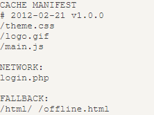

# HTML

HTML（超文本标记语言，**H**yper**T**ext **M**arkup **L**anguage）不是编程语言，而是定义了网页内容的含义和结构的标记语言。“超文本”（hypertext）是指连接单个网站内或多个网站间的网页的链接。HTML 使用“标记”（markup）来注明文本、图片和其他内容，以便于在 Web 浏览器中显示。HTML由一系列元素组成，标签用于创建元素，标签里的元素名不区分大小写，但推荐将标签名全部小写。不包含任何内容的元素称为空元素，空元素不能存在结束标签，比如 ``。

## Doctype

`<!Doctype>` 声明即文档类型定义（DTD），告知浏览器采用的文档解析标准，分为**严格模式（标准模式——W3C标准）**和**混杂模式（兼容模式—向老版本兼容）**，声明位置—HTML文档首行（`<html>` 标签之前），在HTML4 规定了三种不同的 `<!DOCTYPE>` 声明，分别是：Strict（严格模式）、Transitional和 Frameset，后两种声明下，若 DTD 不存在/格式不正确或没有最后的 URI 以混杂模式呈现，否则以严格模式呈现：

`<!DOCTYPE HTML PUBLIC "-//W3C//DTD HTML 4.01//EN" "http://www.w3.org/TR/html4/strict.dtd">`

`<!DOCTYPE HTML PUBLIC "-//W3C//DTD HTML 4.01 Transitional//EN" "http://www.w3.org/TR/html4/loose.dtd">`

`<!DOCTYPE HTML PUBLIC "-//W3C//DTD HTML 4.01 Frameset//EN" "http://www.w3.org/TR/html4/frameset.dtd">`

HTML5 与 HTML4 不同，不基于 SGML（Standard Generalized Markup Language 标准通用标记语言），也就不需要 DTD，因此 HTML5 仅标准模式 `<!DOCTYPE html>` 一种规范，没有严格和混杂之分。

通过 **`document.compatMode`** 可以输出当前文档的渲染模式是**怪异/混杂/兼容模式（`BackCompat`）**还是**标准模式（`CSS1Compat`）**。

## HTML页面生命周期

HTML有四个重要的生命周期事件：
1. DOMContentLoaded：DOM 完全加载以及解析时触发，而无需等 **`` /样式表/子框架**里外部资源加载完成。此时可以查找DOM 节点，并初始化接口。**在用户允许的前提下，Firefox，Chrome 和 Opera 都会在 DOMContentLoaded 触发时自动填充表单**。
    1. DOMContentLoaded 和脚本的关系：
    ```html
    <!-- 
      1. 脚本文件的加载和执行会阻塞 DOM 的加载和解析，原因是脚本可能想要修改 DOM，甚至对其执行 document.write 操作；
      2. 多个同步脚本，会依次加载和执行
    -->
    <script>
      document.addEventListener('DOMContentLoader', () => {
        console.log('DOM 完全加载和解析')
      })
    </script>

    <script src='https://cdnjs.cloudflare.com/ajax/libs/lodash.js/4.3.0/lodash.js'> </script> 

    <script>
      console.log('行内脚本先执行，lodash 再加载和执行');
    </script>
    ```
    2. DOMContentLoaded 和样式关系：
    ```html
    <!-- 
      外部样式表的加载不会影响 DOM 的加载和解析，但是会阻塞后面脚本的执行
    -->
    <link type='text/css' rel="stylesheet" href="style.css" />
    <!-- 
      在样式表加载完成之前，脚步不会执行，原因是脚本可能想要获取元素的坐标和其他与样式相关的属性。
    -->
    <script>
      document.addEventListener('DOMContentLoader', () => {
        console.log('DOM 完全加载和解析')
      })
      console.log(window.getComputeStyle(document.body).marginTop);
    </script>
    <!-- 
      如果 link 置于 script 之后就会马上绑定事件和获取样式属性
    -->
    ```
3. load：整个页面及所有依赖资源如样式表和图片都已完成加载时触发，此时才可以正确获取图片大小。可以通过onload或事件字符串load监听事件。该事件不可取消，同时所有以load 命名的事件都不会传递到 Window 上即load事件不会冒泡。
3. beforeunload：当用户离开页面的导航（navigation）或试图关闭窗口或刷新时触发（弹出一个确认对话框），询问用户是否真的要离开该页面。如果用户确认，浏览器将导航到新页面，否则导航将会取消，也就不会出发pagehide和unload事件。此事件中可以检查用户是否保存了更改，并询问是否真的要离开，beforeunload目前已经不支持自定义显示给用户的消息。
```javascript
/**
 * 只能通过两种方式（分配和返回就行，无论是否为字符串）：
 *   1. 将字符串分配给 event 的 returnValue 属性；
 *   2. 从 onbeforeunload 事件处理程序返回一个字符串；
 * 而且 event.preventDefault() 在 beforeunload 处理程序中不起作用。
 */
  window.onbeforeunload = function() {
    event.preventDefault(); // 这个没啥用，相当于没有这行代码
    // return '有未保存的值，确认要离开吗？'; // 空字符串也可以
    return false; // true 也可以；
  }
  // 或
  window.addEventListener("beforeunload", (event) => {
    // 起作用，与在 window.onbeforeunload 中 return 值的效果是一样的
    // event.returnValue = '未保存的值，确认要离开吗？'; // 空字符串也可以
    event.returnValue = false; // true 也可以；
  })
 
```
4. unload：当页面或一个子框架正在被卸载时，触发 unload事件，**此时页面处于以下状态：所有资源仍存在 (图片，iframe等)，对于终端用户所有资源均不可见，界面交互无效 (window.open, alert, confirm 等)，错误不会停止卸载页面的过程**。该事件不可取消，不可冒泡，且在 beforeunload和pagehide事件之后执行，且父框架在子框架卸载前卸载。在该事件中建议可以使用navigator.sendBeacon(url, data)将和用户相关的分析统计数据发送到服务器保存：
```javascript
// sendBeacon 会在后台执行，转换到另一个页面不会有延迟
const analyticsData = { /* 带有收集的数据的对象  */ };
window.addEventListener('unload', function() {
  // POST，大小限制 64kb， 字符串/表单/其他格式的数据，但是无法获取服务器响应
  navigator.sendBeacon('/analytics', JSON.stringify(analyticsData));
});
```
Document.readyState，描述了document 的加载状态，**状态改变**时触发 readystatechange 事件。存在三种状态：
1. **loading（加载中）**--正在加载中；
2. **interactive（可交互）**-- document加载状态结束，但图像，样式表和框架之类的子资源仍在加载，DOMContentLoaded事件即将触发；
3. **complete（已完成）**--document 和所有子资源已完成加载，window.onload事件（即 load 事件）即将触发。

```html
<script>
  console.log('document.readyState ->' + document.readyState);

  document.addEventListener('readystatechange', () => {
    console.log('document.readystatechange -> document.readyState = ' + document.readyState);
  });

  window.onload = () => {
    console.log('window onload');
  }
</script>

<iframe src='iframe.html' onload="console.log('iframe onload')" ></iframe>


<script> 
  img.onload = () => console.log('img onload');
</script>

<!--
  页面生命周期（相同数字的先后顺序不定）
  1. document.readyState -> loading
  2. document.readystatechange -> document.readyState = interactive
  3. DOMContentLoaded
  4. iframe onload
  4. img onload
  5. document.readystatechange -> document.readyState = complete
  6. window.onload
  -->
```

页面可见性 API（Page Visibility API），**当其选项卡的内容变得可见或被隐藏时（包括当用户最小化窗口），会在文档（document）上触发 visibilitychange (能见度更改) 事件**。该事件不包括document的更新的可见性状态，但是可以从 document 的 visibilityState属性中获取该信息。当 visibleStateState 属性的值转换为 hidden 时，Safari 不会按预期触发 visibilitychange；因此，还需要在window上侦听 pagehide 事件。出于兼容性原因，请确保使用 document.addEventListener 而不是 window.addEventListener 来注册回调，Safari <14.0 仅支持前者。`<iframe>`的可见性状态与父文档相同。使用 CSS 属性（例如display: none;）隐藏 `<iframe>` 不会触发可见性事件或更改框架中包含的文档的状态。

在页面可见性 API 之外，浏览器会采取许多策略来减轻后台或隐藏选项卡对性能的影响：
1. 大多数浏览器停止向后台选项卡或隐藏的 `<iframe>` 发送 requestAnimationFrame() 回调，以提高性能和电池寿命。
2. setTimeout() 之类的计时器在后台/非活动选项卡中受到限制，以帮助提高性能。
3. 浏览器实现基于预算的后台超时限制。这在现代浏览器中以类似的方式运行，细节如下：
    1. 在 Firefox 中，后台选项卡中的每个window都有自己的时间预算（以毫秒为单位）——最大值和最小值分别为 +50 毫秒和 -150 毫秒。 Chrome 非常相似，只是预算以秒为单位指定。
    2. windows在 30 秒后受到限制，使用与为window timers指定的相同的限制延迟规则。在 Chrome 中，此值为 10 秒。
    3. 仅当预算为非负数时才允许执行计时器任务。
    4. 一旦计时器的代码运行完毕，它执行的持续时间将从其窗口的超时预算中减去。
    5. 在 Firefox 和 Chrome 中，预算以每秒 10 毫秒的速度重新生成。

某些进程不受此限制行为的影响。在这些情况下，您可以使用页面可见性 API 来减少选项卡在隐藏时对性能的影响：
1. 正在播放音频的选项卡被视为前景并且不受限制。
2. 运行使用实时网络连接（WebSockets 和 WebRTC）的代码的选项卡不受限制，以避免关闭这些连接超时和意外关闭。
3. IndexedDB 进程也不受限制，以避免超时。

## HTML实体

HTML 实体是一段以连字号（&）开头、以分号（;）结尾的文本（字符串）。实体常常用于显示HTML中的保留字符（比如< >）和不可见的字符（如“不换行空格”）。也可以用实体来代替其他难以用标准键盘键入的字符。HTML实体与字符之间如何对应使用工具：HTML 实体编码器/解码器（https://mothereff.in/html-entities）。

## 样式导入方式： link 和 @import

link：html标签，用于导入外部css文件，还可定义RSS和rel连接属性等；与页面并行加载；标签不存在兼容性问题；DOM元素支持JS操作

@import：可在style中或者css文件中用于导入外部css文件；在页面加载完毕后才被加载；IE5+才能识别；非DOM不支持js操作。@import引入的样式始终是放在css文件顶部（会被css文件中相同的选择器所覆盖）

## 离线存储

允许用户离线时通过缓存的资源展示页面。

在文档的 `<html>` 标签中包含 manifest 属性manifest=".appcache"或者在 manifest 文件中直接指定该页面或者离线时操作window.applicationCache进行实现

manifest 文件的建议的文件扩展名是：".appcache"。并且在 web 服务器上进行配置正确的 MIME-type，即 "text/cache-manifest"

在线：存在manifest属性即请求manifest文件，若首次访问app，即下载manifest文件指定的资源进行离线存储。若再次访问过app且资源已离线存储，先使用加载离线资源加载页面，然后对比新manifest文件与旧manifest文件，发生更改（或用户清空浏览器缓存或由程序来更新应用缓存）才重新下载manifest文件指定的资源进行离线存储。

离线：浏览器就直接使用离线存储的资源。.appcache文件示例：



其中，CACHRE MANIFEST表示需缓存的资源（必须有）；ETWORK表示永远不会被缓存的资源（可选）；FALLBACK表示页面无法访问时的回退页面（可选/html5/ 目录中的所有文件回退为"offline.html"）。