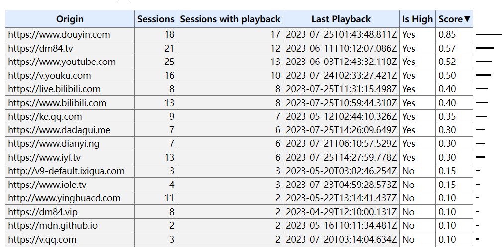
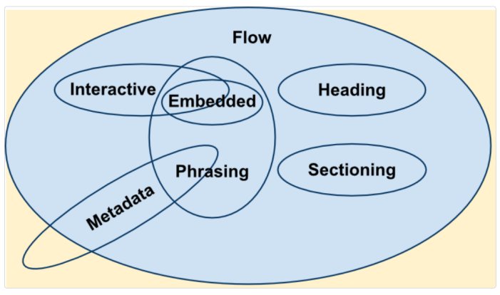
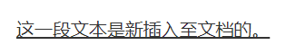

# HTML

HTML（超文本标记语言，**H**yper**T**ext **M**arkup **L**anguage）不是编程语言，而是定义了网页内容的含义和结构的标记语言。“超文本”（hypertext）是指连接单个网站内或多个网站间的网页的链接。HTML 使用“标记”（markup）来注明文本、图片和其他内容，以便于在 Web 浏览器中显示。HTML由一系列元素组成，标签用于创建元素，标签里的元素名不区分大小写，但推荐将标签名全部小写。不包含任何内容的元素称为空元素，空元素不能存在结束标签，比如 ``。

## Doctype

`<!Doctype>` 声明即文档类型定义（DTD），告知浏览器采用的文档解析标准，分为**严格模式（标准模式——W3C标准）**和**混杂模式（兼容模式—向老版本兼容）**，声明位置—HTML文档首行（`<html>` 标签之前），在HTML4 规定了三种不同的 `<!DOCTYPE>` 声明，分别是：Strict（严格模式）、Transitional和 Frameset，后两种声明下，若 DTD 不存在/格式不正确或没有最后的 URI 以混杂模式呈现，否则以严格模式呈现：

`<!DOCTYPE HTML PUBLIC "-//W3C//DTD HTML 4.01//EN" "http://www.w3.org/TR/html4/strict.dtd">`

`<!DOCTYPE HTML PUBLIC "-//W3C//DTD HTML 4.01 Transitional//EN" "http://www.w3.org/TR/html4/loose.dtd">`

`<!DOCTYPE HTML PUBLIC "-//W3C//DTD HTML 4.01 Frameset//EN" "http://www.w3.org/TR/html4/frameset.dtd">`

HTML5 与 HTML4 不同，不基于 SGML（Standard Generalized Markup Language 标准通用标记语言），也就不需要 DTD，因此 HTML5 仅标准模式 `<!DOCTYPE html>` 一种规范，没有严格和混杂之分。

通过 **`document.compatMode`** 可以输出当前文档的渲染模式是**怪异/混杂/兼容模式（`BackCompat`）**还是**标准模式（`CSS1Compat`）**。

## HTML页面生命周期

HTML有四个重要的生命周期事件：
1. DOMContentLoaded：DOM 完全加载以及解析时触发，而无需等 **`` /样式表/子框架**里外部资源加载完成。此时可以查找DOM 节点，并初始化接口。**在用户允许的前提下，Firefox，Chrome 和 Opera 都会在 DOMContentLoaded 触发时自动填充表单**。
    1. DOMContentLoaded 和脚本的关系：
    ```html
    <!-- 
      1. 脚本文件的加载和执行会阻塞 DOM 的加载和解析，原因是脚本可能想要修改 DOM，甚至对其执行 document.write 操作；
      2. 多个同步脚本，会依次加载和执行
    -->
    <script>
      document.addEventListener('DOMContentLoader', () => {
        console.log('DOM 完全加载和解析')
      })
    </script>

    <script src='https://cdnjs.cloudflare.com/ajax/libs/lodash.js/4.3.0/lodash.js'> </script> 

    <script>
      console.log('行内脚本先执行，lodash 再加载和执行');
    </script>
    ```
    2. DOMContentLoaded 和样式关系：
    ```html
    <!-- 
      外部样式表的加载不会影响 DOM 的加载和解析，但是会阻塞后面脚本的执行
    -->
    <link type='text/css' rel="stylesheet" href="style.css" />
    <!-- 
      在样式表加载完成之前，脚步不会执行，原因是脚本可能想要获取元素的坐标和其他与样式相关的属性。
    -->
    <script>
      document.addEventListener('DOMContentLoader', () => {
        console.log('DOM 完全加载和解析')
      })
      console.log(window.getComputeStyle(document.body).marginTop);
    </script>
    <!-- 
      如果 link 置于 script 之后就会马上绑定事件和获取样式属性
    -->
    ```
3. load：整个页面及所有依赖资源如样式表和图片都已完成加载时触发，此时才可以正确获取图片大小。可以通过onload或事件字符串load监听事件。该事件不可取消，同时所有以load 命名的事件都不会传递到 Window 上即load事件不会冒泡。
3. beforeunload：当用户离开页面的导航（navigation）或试图关闭窗口或刷新时触发（弹出一个确认对话框），询问用户是否真的要离开该页面。如果用户确认，浏览器将导航到新页面，否则导航将会取消，也就不会出发pagehide和unload事件。此事件中可以检查用户是否保存了更改，并询问是否真的要离开，beforeunload目前已经不支持自定义显示给用户的消息。
```javascript
/**
 * 只能通过两种方式（分配和返回就行，无论是否为字符串）：
 *   1. 将字符串分配给 event 的 returnValue 属性；
 *   2. 从 onbeforeunload 事件处理程序返回一个字符串；
 * 而且 event.preventDefault() 在 beforeunload 处理程序中不起作用。
 */
  window.onbeforeunload = function() {
    event.preventDefault(); // 这个没啥用，相当于没有这行代码
    // return '有未保存的值，确认要离开吗？'; // 空字符串也可以
    return false; // true 也可以；
  }
  // 或
  window.addEventListener("beforeunload", (event) => {
    // 起作用，与在 window.onbeforeunload 中 return 值的效果是一样的
    // event.returnValue = '未保存的值，确认要离开吗？'; // 空字符串也可以
    event.returnValue = false; // true 也可以；
  })
 
```
4. unload：当页面或一个子框架正在被卸载时，触发 unload事件，**此时页面处于以下状态：所有资源仍存在 (图片，iframe等)，对于终端用户所有资源均不可见，界面交互无效 (window.open, alert, confirm 等)，错误不会停止卸载页面的过程**。该事件不可取消，不可冒泡，且在 beforeunload和pagehide事件之后执行，且父框架在子框架卸载前卸载。在该事件中建议可以使用navigator.sendBeacon(url, data)将和用户相关的分析统计数据发送到服务器保存：
```javascript
// sendBeacon 会在后台执行，转换到另一个页面不会有延迟
const analyticsData = { /* 带有收集的数据的对象  */ };
window.addEventListener('unload', function() {
  // POST，大小限制 64kb， 字符串/表单/其他格式的数据，但是无法获取服务器响应
  navigator.sendBeacon('/analytics', JSON.stringify(analyticsData));
});
```
Document.readyState，描述了document 的加载状态，**状态改变**时触发 readystatechange 事件。存在三种状态：
1. **loading（加载中）**--正在加载中；
2. **interactive（可交互）**-- document加载状态结束，但图像，样式表和框架之类的子资源仍在加载，DOMContentLoaded事件即将触发；
3. **complete（已完成）**--document 和所有子资源已完成加载，window.onload事件（即 load 事件）即将触发。

```html
<script>
  console.log('document.readyState ->' + document.readyState);

  document.addEventListener('readystatechange', () => {
    console.log('document.readystatechange -> document.readyState = ' + document.readyState);
  });

  window.onload = () => {
    console.log('window onload');
  }
</script>

<iframe src='iframe.html' onload="console.log('iframe onload')" ></iframe>


<script> 
  img.onload = () => console.log('img onload');
</script>

<!--
  页面生命周期（相同数字的先后顺序不定）
  1. document.readyState -> loading
  2. document.readystatechange -> document.readyState = interactive
  3. DOMContentLoaded
  4. iframe onload
  4. img onload
  5. document.readystatechange -> document.readyState = complete
  6. window.onload
  -->
```

页面可见性 API（Page Visibility API），**当其选项卡的内容变得可见或被隐藏时（包括当用户最小化窗口），会在文档（document）上触发 visibilitychange (能见度更改) 事件**。该事件不包括document的更新的可见性状态，但是可以从 document 的 visibilityState属性中获取该信息。当 visibleStateState 属性的值转换为 hidden 时，Safari 不会按预期触发 visibilitychange；因此，还需要在window上侦听 pagehide 事件。出于兼容性原因，请确保使用 document.addEventListener 而不是 window.addEventListener 来注册回调，Safari <14.0 仅支持前者。`<iframe>`的可见性状态与父文档相同。使用 CSS 属性（例如display: none;）隐藏 `<iframe>` 不会触发可见性事件或更改框架中包含的文档的状态。

在页面可见性 API 之外，浏览器会采取许多策略来减轻后台或隐藏选项卡对性能的影响：
1. 大多数浏览器停止向后台选项卡或隐藏的 `<iframe>` 发送 requestAnimationFrame() 回调，以提高性能和电池寿命。
2. setTimeout() 之类的计时器在后台/非活动选项卡中受到限制，以帮助提高性能。
3. 浏览器实现基于预算的后台超时限制。这在现代浏览器中以类似的方式运行，细节如下：
    1. 在 Firefox 中，后台选项卡中的每个window都有自己的时间预算（以毫秒为单位）——最大值和最小值分别为 +50 毫秒和 -150 毫秒。 Chrome 非常相似，只是预算以秒为单位指定。
    2. windows在 30 秒后受到限制，使用与为window timers指定的相同的限制延迟规则。在 Chrome 中，此值为 10 秒。
    3. 仅当预算为非负数时才允许执行计时器任务。
    4. 一旦计时器的代码运行完毕，它执行的持续时间将从其窗口的超时预算中减去。
    5. 在 Firefox 和 Chrome 中，预算以每秒 10 毫秒的速度重新生成。

某些进程不受此限制行为的影响。在这些情况下，您可以使用页面可见性 API 来减少选项卡在隐藏时对性能的影响：
1. 正在播放音频的选项卡被视为前景并且不受限制。
2. 运行使用实时网络连接（WebSockets 和 WebRTC）的代码的选项卡不受限制，以避免关闭这些连接超时和意外关闭。
3. IndexedDB 进程也不受限制，以避免超时。

## HTML实体

HTML 实体是一段以连字号（&）开头、以分号（;）结尾的文本（字符串）。实体常常用于显示HTML中的保留字符（比如< >）和不可见的字符（如“不换行空格”）。也可以用实体来代替其他难以用标准键盘键入的字符。HTML实体与字符之间如何对应使用工具：HTML 实体编码器/解码器（https://mothereff.in/html-entities）。

## 样式导入方式： link 和 @import

link：html标签，用于导入外部css文件，还可定义RSS和rel连接属性等；与页面并行加载；标签不存在兼容性问题；DOM元素支持JS操作

@import：可在style中或者css文件中用于导入外部css文件；在页面加载完毕后才被加载；IE5+才能识别；非DOM不支持js操作。@import引入的样式始终是放在css文件顶部（会被css文件中相同的选择器所覆盖）

## 离线存储

**允许用户离线时通过缓存的资源展示页面**。

在文档的 `<html>` 标签中包含 manifest 属性manifest=".appcache"或者在 manifest 文件中直接指定该页面或者离线时操作window.applicationCache进行实现

manifest 文件的建议的文件扩展名是：".appcache"。并且在 web 服务器上进行配置正确的 MIME-type，即 "text/cache-manifest"

在线：存在manifest属性即请求manifest文件，若首次访问app，即下载manifest文件指定的资源进行离线存储。若再次访问过app且资源已离线存储，先使用加载离线资源加载页面，然后对比新manifest文件与旧manifest文件，发生更改（或用户清空浏览器缓存或由程序来更新应用缓存）才重新下载manifest文件指定的资源进行离线存储。

离线：浏览器就直接使用离线存储的资源。.appcache文件示例：


其中，CACHRE MANIFEST表示需缓存的资源（必须有）；ETWORK表示永远不会被缓存的资源（可选）；FALLBACK表示页面无法访问时的回退页面（可选/html5/ 目录中的所有文件回退为"offline.html"）。

## XML

XML（可扩展标记语言，Extensible Markup Language）是由 W3C 指定的一种通用标记语言。XML 是数据描述性语言，因此Web 服务可以利用 XML 去交换请求和响应。

XML 标签类似 HTML 标签，但由于 XML 允许用户定义自己的标签，所以 XML 更加灵活。XML被设计为传输和存储数据，HTML被设计用来显示数据。

```html
<!-- XML -->
<sites>
  <site>
    <name>谷歌</name> <url>www.google.com</url>
  </site>
  <site>
    <name>微博</name> <url>www.weibo.com</url>
  </site>
</sites>
<!-- JSON
{
  "sites": [
    { "name": "谷歌", "url": "www.google.com" },
    { "name": "微博", "url": "www.weibo.com" },
  ]
}
-->
```

JSON 和 XML 都用于接收 web 服务端的数据。针对 AJAX 应用，JSON 比 XML 数据加载更快，而且更简单，XML 需要使用 XML 解析器解析XML文档，JSON 可以使用标准的 JavaScript 函数（JSON.parse()和JSON.stringify()）来解析。

## 中英文换行问题

1. 浏览器默认是不认识中文字符，将一个字当成一个字符，加上下一个字超出当前行宽则该下一个字换行显式。
2. 而对于英文，默认将一个连续的多个字母的英文串当作一个单词，即使超过当前行宽也不换行。

## 国际化、本地化、全球化

**国际化**：internationalization，因首尾字母间有 18 个字母，简称为 i18n；指的是将软件与特定语言及地区脱钩的过程。当软件被移植到不同的语言及地区时，软件本身不用做内部工程上的改变或修正。

**本地化**：localization，由于同样的原因被简称为 l10n；是指为特定区域翻译文件，并为了使软件能在该特定语言环境或地区使用，而应用特殊布局、加入本地特殊化部件等的过程。

**全球化**：globalization，有时会用来表示以上两者的合称；也会简称为 g11n。

## 自动播放

Web浏览器正在转向更严格的自动播放策略，以改善用户体验、最大限度地减少安装广告拦截器的动机，并减少昂贵或受限网络上的数据消耗，这些更改旨在为用户提供更好的播放控制权，并使拥有合法用例的发布商受益。

Chrome 66 中针对audio和video元素推出了自动播放策略，可有效阻止 Chrome 中大约一半不需要的媒体自动播放。对于Web Audio API，Chrome 71 中推出了自动播放策略。这会影响网页游戏、部分WebRTC应用程序以及其他使用音频功能的网页。

**Chrome 的自动播放策略**：
1. 始终允许静音自动播放。
2. 在以下情况下允许自动播放声音：
    1. 用户已与域进行交互（单击、点击等）。
    2. 在桌面上，用户的**媒体参与度**阈值已被突破，这意味着用户之前播放过有声视频。
    3. 用户已将该网站添加到移动设备的主屏幕或在桌面设备上安装了**PWA**。
3. 顶部框架可以将**自动播放权限委托**给其 iframe，以允许自动播放声音。

**媒体参与度** (**MEI，Media Engagement Index**) 衡量个人在网站上消费媒体的倾向。Chrome 的方法是计算每个来源的重要媒体播放事件的访问比率：
1. 媒体（音频/视频）的消耗必须大于七秒。
2. 音频必须存在且未静音。
3. 包含视频的选项卡处于活动状态。
4. 视频大小（以像素为单位）必须大于200x140。

据此，Chrome 会计算出媒体参与度得分，该得分在定期播放媒体的网站上最高。当它足够高时，允许媒体仅在桌面上自动播放。用户的 MEI 可在about://media-engagement内部页面获取。



对于开发者而言，可以通过以下手段在本地更改 Chrome 自动播放政策行为，以测试网站的不同级别的用户参与度：
1. 可以使用命令行标志：chrome.exe --autoplay-policy=no-user-gesture-required 完全禁用自动播放策略。这就好像用户与网站强烈互动一样，而始终允许自动播放。
2. 还可以使用命令行标志：chrome.exe --disable-features=PreloadMediaEngagementData, MediaEngagementBypassAutoplayPolicies决定通过禁用 MEI 来确保永远不允许自动播放，以及是否让 MEI 总值最高的网站默认为新用户自动播放。

HTTP Permissions-Policy 标头autoplay指令（Permissions-Policy: autoplay `<allowlist>`;其中 `<allowlist>` 使用分号分隔，在chrome上默认值’self’表示仅允许当前文档同源的autoplay，’none’则是完全禁止 autoplay）控制当前文档是否允许自动播放通过 HTMLMediaElement接口请求的媒体。启用该策略后，如果没有用户交互，HTMLMediaElement.play() 返回的 Promise 将出现 DOMException 异常。`<audio>` 和 `<video>` 元素上的自动播放属性将被忽略。

permissions policy 允许开发人员有选择地启用和禁用浏览器功能和API。一旦源收到自动播放权限，它就可以将该权限委托给具有autoplay permissions policy的跨源 iframe 。请注意，默认情况下，同源 iframe 上允许自动播放。

iframe 委托：
```html
<!-- autoPlay is allowed -->
<iframe src="https://cross-origin.com/myvideo.html" allow="autoplay">

<!-- autoPlaya and fullscreen are allowed -->
<iframe src="https://cross-origin.com/myvideo.html" allow="autoplay: fullscreen">
```

如果禁用了自动播放的权限策略，在没有用户手势的情况下调用 play() 会出现 NotAllowedError 的DOMException 异常，从而promise被拒绝。autoplay属性也将被忽略。

**最佳实践一**：不要假设视频会播放，也不要在视频实际未播放时显示暂停按钮。而且应该始终查看播放函数返回的 Promise，以确定它是否被拒绝：

```javascript
const video = document.querySelector('video');
const startPlayPromise = video.play();

if (startPlayPromise !== undefined) {
  startPlayPromise.then(_ => {
    // 仅在播放开始后才开始执行需要执行的操作
  }).catch(error => {
    // 自动播放被阻止
    if (error.name === 'NotAllowedError') { // 显示 "播放" 按钮以便用户可以开始播放
      showPlay
    } else {
      // 其他 error
    }
  })
}
```

首先需确保play()返回的不是undefined，因为在IE上，play()没有返回值。

**最佳实践二**：使用静音自动播放并让用户自主选择取消静音

```html
<video id="video" muted atuoplay>
<button id="unmuteButton"></button>

<script>
  ummuteButton.addEventListener('click', function() {
    video.muted = false;
  });
</script>
```

要检测浏览器是否需要用户交互才能播放音频，需在创建音频上下文后检查 AudioContext.state。如果允许播放，则AudioContext.state为“running”。否则AudioContext.state为suspended。如果监听 statechange 事件，则可以异步检测AudioContext.state的更改。


## HTML 元素

HTML 元素通过“标签”（tag）将文本从文档中引出，标签由在“<”和“>”中包裹的元素名组成，HTML 标签里的元素名不区分大小写。习惯上与实践上都推荐将标签名全部小写。

### 内容分类

每一个 HTML 元素都必须遵循定义了它可以包含哪一类内容的规则。这些规则被归类为几个常见的元素内容模型（content model）。大多数 HTML 元素都属于一个或多个内容类别--这些类别将具有共同特征的元素组合在一起。这是一种松散的分组（实际上并没有在这些类别的元素之间建立关系），但它们有助于定义和描述这些类别的共同行为及其相关规则，尤其是当你遇到它们错综复杂的细节时。元素也有可能不属于任何类别。以下是三种类型的内容分类：
1. 主内容类：描述了很多元素共享的内容规范；
    1. 元数据内容（Metadata content）：元素（`<base>、<link>、<meta>、<noscript>、<script>、<style>` 和 `<title>`）可以修改文档其余部分的呈现或行为，建立与其他文档的链接，或者传达其他外带信息。
    2. 流式内容（Flow content）：大多数可以包含在`<body>`元素之内的元素（`<address>、<bdi>、<blockquote>、<data>、<del>、<details>、<div>、<dl>、<figure>、<footer>、<header>、<hr>、<ins>、<main>、<map>、<menu>、<ol>、<p>、<pre>、<s>、<table>、<template>、<u>、<ul>`和以下子集）。
        1. 标题内容（Heading content）：（`<h1> 、<h2>、<h3>、<h4>、<h5>、<h6>`）是流式内容的子集，可在任何可以使用流式内容的地方出现，它定义了分段的标题，而这个分段可能由一个明确的分段内容元素直接标记，也可能由标题本身隐式地定义。
        2. 分段内容（Sectioning content）：是流式内容的子集，可在任何可以使用流式内容的地方出现。属于分段内容模型的元素（`<article>、<aside>、<nav>` 和 `<section>`）创建了一个当前大纲中的分段，它定义了 `<header>` 元素、`<footer>` 元素和标题内容的范围。
        3. 短语内容（Phrasing content）：（`<abbr>、<audio>、<b>、<bdo>、<br>、<button>、<canvas>、<cite>、<code>、<datalist>、<dfn>、<em>、<embed>、<i>、<iframe>、、<input>、<kbd>、<label>、<mark>、<math>、<meter>、<noscript>、<object>、<output>、<progress>、<q>、<ruby>、<samp>、<script>、<select>、<small>、<span>、<strong>、<sub>、<sup>、<svg>、<textarea>、<time>、<var>、<video>、<wbr>` 、文本节点（但不包括那些只由空白字符组成的节点）、`<a>`仅包含短语内容时、`<area>`为 `<map>` 元素的子元素时、`<del>`仅包含短语内容时、`<ins>`仅包含短语内容时、`<link>`仅限于 itemprop 属性存在的情形、`<map>`仅包含短语内容时和`<meta>`仅限于 itemprop 属性存在的情形）流式内容的子集，定义了文本和它包含的标记，且可以在任何可以使用流式内容的地方出现。
        4. 嵌入内容（Embedded content）：（`<audio>、<canvas>、<embed>、<iframe>、、<math>、<object>、<picture>、<svg>` 和 `<video>`）是流式内容的子集，它将来自另一种标记语言或命名空间的内容插入到文档中，且可以在任何可以使用流式内容的地方出现。
        5. 交互式内容（Interactive content）：（`<a>、<button>、<details>、<embed>、<iframe>、<label>、<select> 、<textarea>、<audio>`若controls 属性存在、``若 usemap 属性存在、`<input>`若 type 属性不处于隐藏（hidden）状态、`<object>`，若 usemap 属性存在和`<video>`若 controls 属性存在）是流式内容的子集，包含为用户交互而特别设计的元素，且可以在任何可以使用流式内容的地方出现。
        6. 与表单相关的内容（Form-associated content）：（`<button>、<fieldset>、<input>、<label>、<meter>、<object>、<output>、<progress>、<select>`和`<textarea>`）是流式内容的子集，包括存在表单所有者的元素，通过 form 属性指定表单所有者id。可以在预期有流式内容的地方使用。其子类：
            1. 可列举的元素（listed）：在 form.elements 和 fieldset.elements 集合中列举出的元素（`<button>、<fieldset>、<input>、<object>、<output>、<select>` 和 `<textarea>`）。
            2. 可标记的元素（labelable）：和 `<label>` 相关联的元素（ `<button>、<input>、<meter>、<output>、<progress>、<select>` 和 `<textarea>`）。
            3. 可提交的元素（submittable）：包括当表单提交时可以用来组成表单数据的元素（`<button>、<input>、<object>、<select>` 和 `<textarea>`）。
            4. 可重置的元素（resettable）：当表单重置时会被重置的元素（ `<input>、<output>、<select> 和 <textarea>`）。
2. 表单相关的内容类：描述了表单相关元素共有的内容规范。
3. 特殊内容类：描述了仅仅在某些特殊元素上才需要遵守的内容规范，通常这些元素都有特殊的上下文关系。
    1. 透明内容模型（Transparent content model）：如果元素（`<del>` 和 `<ins>` ）拥有透明内容模型（Transparent content model），即使将透明内容移除并使用子元素取代，其内容也必须由合法的 HTML5 元素组成。
    2. 支持脚本的元素（Script-supporting elements）：（`<script>`和`<template>`）不会直接渲染输出在页面文档中。相反，它们的作用是支持脚本，或者直接包含或指定脚本代码，或者指定将被脚本使用的数据。



### 属性分类

HTML 中的元素拥有属性（attribute）；这些额外的值可以配置元素或者以各种方式来调整元素的行为，进而满足用户所需的标准。

在 HTML 中，大多数属性都有两个方面：**内容属性**和 **IDL**（**Interface Definition Language或Interface Description Language，接口定义语言或接口描述语言**）**属性**。

**内容属性**：内容属性需要在内容（HTML 代码）中设置。内容属性总是字符串，即使值是整数。可以通过element.setAttribute()或element.getAttribute()来设置或获取。

**IDL属性**：即JavaScript 属性（property）。当需要获取 IDL 属性的值时，IDL 属性总会使用隐含的内容属性的值（可能先经过转换）来返回值。同样地，当设置值时会保存在内容属性中。即IDL 属性本质上反映了内容属性。大多数时候，IDL 属性会返回元素实际使用的值，例如JavaScript设置 inputElement.type="foobar"，内容属性的值（element.getAttribute()）是“foobar”，但`<input>`元素在外观上和表现上会是默认的文本类型，因此IDL属性依旧返回”text”。IDL 属性并不总是字符串，读取或设置值的类型都是要求的类型，如果传入别的类型，可能会根据标准 JavaScript 的类型转换规则被转换为数字。大多数时候，属性的 IDL 属性与对应的内容属性如何关联会遵守规范中列出的规则，但有时并不遵守，具体需要阅读规范。

**布尔属性**：内容属性，如 required、readonly、disabled，如果属性存在，则其值为真（true），如果不存在，其值为假（false）。HTML 定义了布尔属性允许的取值：如果属性存在，其值必须是一个空字符串（或未给该属性赋值），或者是一个大小写无关的 ASCII 字符串，该字符串与属性名严格相同，前后都没有空格。切记，布尔值属性不能取值为 "true" 和 "false"。如果需要表示假值，布尔值属性需要整个忽略不写。

**事件处理器属性**：所有事件处理器属性，如onclick、onkeypress、onfocus，都接受字符串值。字符串将用于合成 JavaScript 函数：”function name(/*args*/) {body}”，其中，name 为属性名，body 为属性值。处理器接收与其 JavaScript 事件处理器对应项相同的参数——大多数处理器只接收一个 event 参数，而 onerror 接收五个参数：event、source、lineno、colno、error。不建议使用事件处理器属性。将 HTML 和 JavaScript 代码混合在一起通常会产生难以维护的代码，而且事件处理器属性的执行也可能会被内容安全策略阻止。

#### src 属性和href属性

href（超文本引用）：用于`<a>`和`<link>`，用于指向资源地址（建立当前html与资源的联系），`<link>`中的href并行下载资源（css）并且阻塞当前文档的处理
Src（source来源）：用于``，`<script>`，`<iframe>`中替换html页面内容，下载资源时会**阻塞**当前文档的处理。

#### data-*属性

data-* 全局属性是一类被称为自定义数据属性的属性，它赋予我们在所有 HTML 元素上语义化地嵌入自定义数据属性的能力，并可以通过脚本在 HTML 与 DOM 表现之间进行专有数据的交换。

所有这些自定义数据属性都可以通过所属元素的 HTMLElement.dataset 来访问，dataset是字符串映射DOMStringMap，其本身不能被修改，设置属性时，它的值总是转化为一个字符串，移除一个属性可以使用delete操作符。*具有以下限制：
1. 该名称不能以xml开头，无论这些字母是大写还是小写；
2. 该名称不能包含任何分号 (U+003A)；
3. 该名称不能包含 A 至 Z 的大写字母。

并且自定义数据属性中的任何破折号 (U+002D) 都会被下个字母的大写替代 (驼峰拼写)。

#### script元素的属性defer和async

HTML解析过程中，遇到脚本script默认会停止解析HTML和渲染DOM（阻塞）等待脚本加载执行完毕再继续解析HTML和渲染DOM，因此导致脚本无法访问下方DOM和可能长时间阻塞页面，通常建议放在body的底部。

这样的解决方案，对于长HTML造成脚本的操作会具有明显的延迟，script提供两个属性defer和async更好解决阻塞问题。

**共同点**是两者都不会阻塞解析HTML和渲染DOM（‘后台’下载），在load事件之前执行完毕。

**defer**：即延迟执行，等待解析HTML和渲染DOM完毕，并在DOMContentLoaded之前，才开始执行（多个defer脚本按顺序执行）。**如果`<script>`元素type为module，则默认为defer**。

**async**: 即异步执行，加载完（下载）即执行，不限制是否在DOMContentLoaded之前或之后执行。多个async脚本先加载完的先执行（**加载优先规则**）。**页面中的DOM可能会先于异步脚本显示，因此建议不要在异步脚本执行期间修改DOM**。

通过Javasciprt可动态添加script脚本，动态脚本默认async = true。
实际开发中，defer可 用于需要整个 DOM 的脚本，以及脚本的相对执行顺序很重要的时候。**async 可用于独立脚本（第三方脚本）**，例如计数器或广告，这些脚本的相对执行顺序不重要。

`<noscript>`标签规定浏览器不支持脚本或禁用脚本时的替代显示内容。

#### rel属性的值：prefetch与 preload

关键字 prefetch 作为元素 `<link>` 的属性 rel 的值，是为了提示浏览器，用户**未来的浏览（其他页面）**有可能需要加载目标资源，所以浏览器在空闲时通过事先获取和缓存对应资源，优化用户体验。

关键字 preload 作为元素 `<link>` 的属性 rel 的值，表示用户十分有可能需要在**当前浏览（当前页面）**中加载目标资源，所以浏览器必须预先获取和缓存对应资源。

#### rel属性的值：dns-prefetch

dns-prefetch (DNS预获取) 是尝试在请求资源之前解析域名。当浏览器从（第三方）服务器请求资源时，必须先将该跨域域名解析为 IP 地址，然后浏览器才能发出请求。此过程称为 DNS 解析。DNS解析会导致请求增加明显的延迟，此延迟可能会大大降低加载性能，尤其是对于对于打开许多跨域域许的网站。

dns-prefetch 可帮助开发人员减少跨域域上的DNS 解析延迟。HTML `<link>`元素 通过 dns-prefetch的rel属性值提供此功能。然后在 href 属性中指要跨域的域名（`<link rel="dns-prefetch" href="https://some.example.com/">`）。每当站点引用跨域域上的资源时，都应在`<head>`元素中放置dns-prefetch。

最佳实践：
1. 首先，dns-prefetch 仅对跨域域上的 DNS 查找有效，因此请避免使用它来指向您的站点或域。这是因为，到浏览器看到提示时，您站点域背后的 IP 已经被解析。
2. 其次，还可以通过使用 HTTP 链接字段（即Link）将 dns-prefetch（以及其他资源提示）指定为 HTTP 标头。
3. 结合preconnect使用。即`<link rel="preconnect" href="https://impartant.com/" crossorigin> <link rel="dns-prefetch" href="https://example1.com/">`。其中，dns-prefetch 仅执行 DNS 查找，但preconnect 会建立与服务器的连接（）。如果站点是通过 HTTPS 服务的，则此过程包括 DNS 解析，建立 TCP 连接以及执行 TLS 握手。将两者结合起来可提供进一步减少跨域请求的感知延迟的机会。但是如果页面需要建立与许多第三方域的连接，则preconnect 会适得其反。preconnect最好仅用于最关键的连接。对于其他的，使用dns-prefetch。

### 检测浏览器是否支持HTML5

通过DOCTYPE声明、新增的结构元素、功能元素、新功能等区分HTML5和HTML4，比如：
1. sessionStorage，localStorage
2. 离线**存储**；
3. `<meta>`charset属性和`<script>`async属性；
4. **表单 input** 的color，email, data ,range等类型
5. **音频和视频**元素 audio 和 video
6. **地理位置API**
7. **canvas**
8. **拖放**
9. 多线程编程的 **web worker**
10. **websocket 协议**

### HTML5新元素和废除元素

新增语义和结构元素：`<article>/<aside>/<bdi>/<command>/<details>/<dialog>/<summary>/<figure>/<figcaption>/<footer>/<mark>/<meter>/<nav>/<progress>/<ruby>/<rt>/<rp>/<section>/<time>/<wbr>`；

**语义化目的**是让页面内容**结构化**，让**正确的标签包含正确的内容**。在开发中应该根据元素含义选择元素。**语义化的好处**：
1. 有利于SEO（搜索引擎优化）。
2. 利于无障碍访问（屏幕阅读器）。
3. 利于浏览器的插件分析网页。
4. 易于阅读和维护。

因此在标签的选择上优先考虑语义化标签，比如选择`<em>`而不是`<i>`进行斜体要求。

新增绘图元素：`<canvas>`；

新增表单元素：`<datalist>/<keygen>/<output>`；

新增多媒体元素：`<audio>/<video>/<source>/<embed>/<track>`；

**废除**网页美化标签 `<big>、<u>、<font>、<basefont>、<center>、<s>、<tt>`进一步分离样式与结构。

HTML5新元素的**浏览器兼容**问题解决方案：使用 **document.createElement 方法产生**相应的HTML5元素并添加默认CSS样式，或者使用html5shim等成熟的框架。

 HTML5其他新增的内容：地理位置API、MathML、SVG、拖放API、SSE、Web Workers、Web SQL、Web Storage(存储)、应用程序缓存。

### 内联元素、空元素、块级元素

HTML中元素大多数都是“块级”元素或行内元素。块级元素占据其父元素（容器）的整个水平空间，垂直空间等于其内容高度，因此创建了一个“块”。

默认情况下，浏览器会在块级元素前后另起一个新行，而行内元素不会以新行开始。块级元素只能出现在 `<body>` 元素内。一般块级元素可以包含行内元素和其他块级元素。这种结构上的包含继承区别可以使块级元素创建比行内元素更”大型“的结构。块级元素与内联元素的这种区别描述在HTML规范中一直使用到4.01。后来，这种二元的区分被一套更复杂的内容类别所取代。虽然 "内联 "类别大致对应于短语内容（phrasing content）的类别，但 "块级 "类别并不直接对应于任何HTML内容类别，但 "块级 "和 "内联 "元素结合起来对应于HTML中的流式内容（flow content）。还有一些额外的类别，例如交互式内容（interactive content）。根据W3C官方描述，元素是代表的内容的含义，与显示无关，而显示即行内还是块级是由CSS来决定。
1. **内联元素**（**display：inline**）：`<a> <b> <span> <input> <select > <sup><sub><strong> <em><del><ins>` ，特点是不独占一行，无法设置宽高。
2. **块级元素**（**display：block**）：`<div> < ul >< ol> < li> <dl> <dt><dd >< h1>…<p><address>`，特点是独占一行，可以设置宽高。
3. **内联块级元素**（**display：inline-block**）：` <input> <iframe> <input><textarea> <button><label>`，特点是不独占一行，可以设置宽高。

**空元素**（**不闭合的元素**）：`<br> <hr>  <input> <link> <meta>`
1. 内联元素中img | input（只有type=’image’） | iframe  | video | embed | option | audio | canvas | object | applet是可以设置宽高、margin、padding、border的（表现同display：inline-block），称为可替换元素（包括CSS content属性插入的伪元素，称为匿名可替换元素），CSS渲染模型不考虑对其内容的渲染，其显示过程中生成了框（可设置宽高的原因），而非可替换元素内容受CSS视觉格式化模型控制。这些可替换元素是一种外部对象，它们外观的渲染，是独立于 CSS 的。简单来说，它们的内容不受当前文档的样式的影响，即不会继承父级浏览上下文的样式，例如 `<iframe>` 元素，可能具有自己的样式表。CSS 能对可替换元素产生的唯一影响在于，部分属性(object-fit和object-position)支持控制元素内容在其框中的位置或定位方式。
2. **使内联不可替换元素可设置宽高的方案**：display/position/float（原理都是display变成block或者inline-block）
3. **内联元素**可以嵌套内联元素（但是a标签不能嵌套a标签），块级元素可以嵌套任何元素（p标签不能嵌套div标签）。

### 表格内容元素

#### table元素

table 元素表示表格数据 -- 即通过二维数据表表示的信息。
1. 一个可选的 `<caption>` 元素，标题标签
2. 零个或多个的 `<colgroup>` 元素，定义表中的一组列表，来应用不同的样式
3. 一个可选的 `<thead>` 元素，表格页眉标签
4. 下列任意一个:
    1. 零个或多个 `<tbody>`，表格主体标签
    2. 零个或多个 `<tr>`，表格行标签
    3. 一个可选的 `<tfoot>` 元素，表格页尾标签
    4. td，表格内的单元格标签
    5. th，表格内的表头单元格标签
  
合并单元格在对于的行或列上使用colspan，rowspan，但必须保证加上剩下未合并的等于总共单元格数。

表格在没有`<thead>， <tbody>，<tfoot>`时候，是先等数据和表格都加载完成才显示，而有`<thead>， <tbody>，<tfoot>`其中一个标签则先加载表格完不等数据就显示。因此应该默认要么`<thead>， <tbody>，<tfoot>`三者同时有，要么都不设置。

### 图片和多媒体元素

#### video元素

`<video>` 元素用于在 HTML 或者 XHTML 文档中嵌入媒体播放器，用于支持文档内的视频播放。在不支持 video 元素的浏览器中，`<video></video>` 标签中间的内容会显示，作为降级处理。具有以下属性：
1. poster：海报帧图片 URL，用于在视频处于下载中的状态时显示。如果未指定该属性，则在视频第一帧可用之前不会显示任何内容，然后将视频的第一帧会作为海报（poster）帧来显示。
2. autoplay：布尔属性；声明该属性后，视频会尽快自动开始播放，不会停下来等待数据全部加载完成。如果使用 autoplay="false" 来关闭视频的自动播放功能，会不起作用；只要 `<video>` 标签中有 autoplay 属性，视频就会自动播放。要移除自动播放，需要完全删除该属性。在某些浏览器（例如 Chrome 70.0+）中，如果没有设置 muted 属性，autoplay 将不会生效。
3. controls：加上这个属性，浏览器会在视频底部提供一个控制面板，允许用户控制视频的播放，包括音量，跨帧，暂停/恢复播放。
4. loop属性：布尔属性；指定后，会在视频播放结束的时候，自动返回视频开始的地方，继续播放。
5. muted：布尔属性，指明在视频中音频的默认设置。设置后，音频会初始化为静音。默认值是 false, 意味着视频播放的时候音频也会播放。
6. src：要嵌到页面的视频的 URL。可选；也可以使用 video 块内的 `<source>` 元素来指定需要嵌到页面的视频。
7. width：视频显示区域的宽度，单位是 CSS 像素（仅限绝对值；不支持百分比）。
8. height：视频显示区域的高度，单位是 CSS 像素（仅限绝对值；不支持百分比）。

#### audio元素

`<audio>`元素用于在文档中嵌入音频内容。`<audio>` 元素可以包含一个或多个音频资源，这些音频资源可以使用 src 属性或者 `<source>` 元素来进行描述：浏览器将会选择最合适的一个来使用。也可以使用 MediaStream 将这个元素用于流式媒体。在浏览器不支持该元素时，会显示 `<audio></audio>` 标签之间的内容作为回退。具有以下属性：
1. autoplay：布尔值属性；声明该属性，音频会尽快自动播放，不会等待整个音频文件下载完成。
2. controls：如果声明了该属性，浏览器将提供一个包含声音，播放进度，播放暂停的控制面板，让用户可以控制音频的播放。
3. loop：布尔属性；如果声明该属性，将循环播放音频。
4. muted：表示是否静音的布尔值。默认值为 false，表示有声音。
5. src：嵌入的音频的 URL。可选；也可以在 audio 元素中使用 `<source>` 元素来替代该属性指定嵌入的音频。

### 内嵌内容元素

#### iframe和frameset元素

**`<iframe>`元素即内联框架元素**，将另一个HTML页面嵌入到当前页面中，包含该`<iframe>`即嵌入内容的浏览上下文称为父级浏览上下文。
每个`<iframe>`都会有自己的会话历史记录和DOM树。
1. **属性name，用于定位嵌入的浏览上下文的名称**。该名称可以用作 `<a>` 标签与 `<form>` 标签的 target 属性值，也可以用作 `<input>` 标签和 `<button>` 标签的 formtarget 属性值，还可以用作 window.open() 方法的 windowName 参数值。
2. **title属性标识框架的主要内容**，预先知道涉及的大致内容，创造无障碍浏览环境。
3. **JavaScript脚本访问iframe框架的内容必须遵守同源策略**，并且无法访问非同源的 window 对象的几乎所有属性。同源策略同样适用于子窗体iframe访问父窗体（父级浏览上下文）的 window 对象。**跨域通信可以通过 window.postMessage 来实现**。

然而页面上的每个`<iframe>`都需要增加内存和其它计算资源和http请求，这是因为每个浏览上下文都拥有完整的文档环境。会阻塞主页面的onload事件；iframe和主页面共享连接池，受浏览器同域连接限制，影响页面性能。因此使用时考虑js动态给iframe添加src属性值。

**`<frameset>`** 是一个用于包含 `<frame>` （通过设置src外联HTML）的 HTML 元素。

具有rows和cols属性来指定若干部分所占的行列数。

**缺点**：有frameset就不能有body，增加http请求，SEO不友好。因此已经废弃，被`<iframe>`替代。

### 编辑标识元素

#### del元素

`<del>`标签表示一些被从文档中删除的文字内容。

`<del>This paragraph has been deleted.</del >`


#### ins元素

`<ins>`标签表示文档中添加的内容。

`<ins>这一段文本是新插入至文档的。</ins>`




### 文档元数据元素

#### title 元素

内容一般是：
1. 主页：网站名称 + 主要关键字/关键字的描述
2. 详情页：详情名称 + 网站名称 + 简介
3. 列表页：分类名称 + 关键字 + 网站名称
4. 文章页： 文章标题 + 分类 + 网站名称

#### 移动端meta元素

```html
<meta name=’keywords’ content=”” /> <!-- keywords的content一般是100个左右字符，包括网站名称 + 分类信息 + 网站名称 -->

<meta name=’description’ content=”” /> <!--description的content 一般是80-120个字符，包括对title + keyword的简单描述 -->

<!-- SEO时的优先级是：title > description > keywords -->

<!-- 国内浏览器，比如360可能存在多内核，用于指定内核, 分别代表webkit内核，IE兼容内核，IE标准内核 -->

<meta name="renderer" content="webkit|ie-comp|ie-stand">

<!-- IE浏览器以最高模式渲染文档 -->

<meta http-equiv="x-ua-compatible" content="ie=edge">

<!-- 移动端视口设置，初始load缩放比例为1，不允许用户手动缩放，IOS9设置shrink-to-fit=no才使得content前两个生效。 -->

<meta name="viewport" content="width=device-width, initial-scale=1, user-scale=no">
```

### 内联文本语义元素

#### a元素

 `<a>` 元素（或称锚元素achor），其作用包括：
1. 超链接。
2. 打电话或者发短信（tel:），需要移动端或桌面安装有拨号软件。 
3. 发邮件（mailto:），需要安装有邮件客户端。
4. 锚点定位。
5. 协议限定符（即会运行javascipt:后面的代码）。

**target 属性**: target="_blank（新标签页）| _self（当前标签页）| _parent（当前浏览上下文的父浏览上下文）| _top（加载响应进入顶层浏览上下文）| framename（tab/window/iframe）"

**download 属性**: HTML5新增，将资源下载保存为本地文件。

**href 属性**：如果存在 href 属性，当 `<a>` 元素聚焦时按下回车键就会激活它。可以使用 href="#top" 或者 href="#" 链接返回到页面顶部，这种行为是 HTML5 的特性。

应该只将锚元素用于正常的 URL 导航。锚元素常常滥用协议限定符功能，即通过将href 属性设置为 "#" 或 "javascript:void(0)" 来创造一个能阻止页面刷新的伪按钮的方式，应该避免这种使用方式，而是使用button元素替代。

#### sup元素

**sup**即上标标签（supscript）。

#### sub元素

**sub**即下标标签（subscript）。

#### span元素

**span**标签是一个没有任何样式的标签，就是给行内内容添加样式用的。

### 内容分区元素

#### address元素

表示其中的 HTML 提供了某个人或某个组织（等等）的联系信息（比如真实地址、URL、电子邮箱、电话号码、社交媒体账号、地理坐标等等），也可用于`<article>`元素内指明文章的作者。当表示一个和联系信息无关的任意的地址时，请改用 `<p>` 元素而不是 `<address>` 元素。

```html
<address>
   You can contact author at <a href="http://www.somedomain.com/contact">
   www.somedomain.com</a>
</address>
```


### 文本内容元素

#### ul元素

ul即无序列表（unorder list），属性有type（circle/disc/square）

#### ol元素

ol即有序列表（order list），属性有type（a/A/i/I/1），start（列表编号的起始值，只能是整数值），reversed（是否倒序）。

#### dl元素

dl即定义列表（define list），是包含术语定义以及描述的列表，通常用于展示词汇表或者元数据 (键-值对列表)。
1. **零组或多组dom结构，每组dom结构中包含一个或多个`<dt>` 元素，以及 一个或多个`<dd>`元素**：

```html
<dl>
  <dt>Firefox</dt>
  <dd>A free, open source, cross-platform, graphical web browser
      developed by the Mozilla Corporation and hundreds of volunteers.
  </dd>
  <!-- other terms and definitions -->
</dl>
```

2. **一组或多组`<div>`元素包裹dt和dd**，这样适合对不同的div应用不同的样式：

```html
<dl>
  <div>
    <dt>Name</dt>
    <dd>Godzilla</dd>
  </div>
  <div>
    <dt>Born</dt>
    <dd>1952</dd>
  </div>
</dl>
```

请不要将该元素（也不要用 `<ul>` 元素）用来在页面创建具有缩进效果的内容，因为会语义混乱。

### 表单元素

#### button元素

表示可点击的按钮。type是submit的button在 IE7 上提交表单时存在POST 提交的数据没有把 value 属性的值提交上去而是提交button的innerText。IE6 在提交表单时还会把表单内所有的按钮都提交，同时还有和 IE7 一样的 BUG。IE8 均已修复。Firefox会在获得焦点的按钮上添加一个细小的虚线框，可以用button::-moz-focus-inner重写。安卓系统上的 Firefox <35 会为每个按钮设置一个默认的 background-image 渐变背景，可通过 background-image: none 禁用。点击button会让浏览器和操作系统（默认情况下）将焦点放在其上。
1. disable：布尔属性，表示用户不能与button交互，即禁用。如果属性值未指定，button 继承包含元素，例如`<fieldset>`；如果没有设置disabled属性的包含元素，button 将可交互。仅Firefox 在默认情况下会在页面加载时让 `<button>` 保持**动态禁用状态**，可将autocomplete 属性设置为 off禁用。
2. form：表示 button 元素关联的 form 元素（它的表单拥有者）。此属性值必须为同一文档中的一个`<form>`元素的id属性。利用此属性，可以将`<button>`元素放置在文档内的任何位置，而不仅仅是作为他们 form 元素的后代。
3. type：button的类型
     1. submit：按钮向服务器提交表单数据。如果与 `<form>` 关联的按钮未指定该属性，或者该属性为空或无效值，则默认使用此类型。
     2. reset：按钮将所有控件重置为初始值。
     3. button：按钮：按钮没有默认行为，默认情况下按下时什么也不做。它可以让客户端脚本监听元素事件，当事件发生时触发脚本。
4. name、value：button的名称和值，与表单数据的提交按钮相关联。当表单中的数据被提交时，以name=value的形式被递送至服务器。
5. formaction、formenctype、formmethod、formnovalidate布尔属性、formtarget：如果 button 是 submit 类型，分别重写 button 表单拥有者的action、enctype、method、novalidate布尔属性、target属性。

#### datalist元素

包含了一组 `<option>` 元素，这些元素表示其他表单控件可选值。

#### fieldset元素

用于对表单中的控制元素进行分组（也包括 label 元素）。fieldset的标题由第一个legend子元素确定。如果将fieldset的样式设置为 display: grid 或 display: inline-grid，那么这个匿名盒也会是grid上下文。如果将fieldset的样式设置为 display: flex 或 display: inline-flex，则匿名盒也会是弹性盒上下文。除上述情况之外，匿名框默认建立块级格式化上下文。display 值默认为 block。如果将 fieldset的 display 值设置为行内级别，则会表现为 inline-block，否则会表现为 block。默认情况下，内容周围有一个2px groove边框和少量默认padding，而且该元素的min-inline-size值为min-content。如果其中有 `<legend>` 元素，会放在块级框起始处的边界上。`<legend>` 的宽度会根据内容尽量收缩（shrink-wrap），同时也建立了一个格式化上下文。display 值会块级化（例如 display: inline 表现为 block）。一个匿名盒会包围 `<fieldset>` 的内容，这个盒子继承了 fieldset的一些属性。
1.name：元素分组的名称。
2.form：表示fieldset元素关联的 form 元素（它的表单拥有者）。
3.disabled：布尔属性，fieldset的所有子代表单控件也会继承这个属性。这意味着它们不可编辑，也不会随着 form一起提交。它们也不会接收到任何浏览器事件，如鼠标点击或与聚焦相关的事件。默认情况下，浏览器会将这样的控件展示为灰色。注意，legend元素中的表单元素不会被禁用。在 IE11 中 disabled 的 fieldset 的子元素并不会全都被 disabled。

#### form元素

表示文档中包含交互控件，用于向 Web 服务器提交信息的区域。内容类别为流式内容（Flow content），可包含内容为流式内容（Flow content）。可以用CSS 伪类 :valid 和 :invalid 来设置form元素的样式，此时样式的表现取决于表单中的 elements 是否有效。
1. autocomplete：用于指示 input 元素是否能够拥有一个默认值，此默认值是由浏览器自动补全的。此设定可以被属于此表单的子元素的 autocomplete 属性覆盖。取值有：
    1. off：浏览器可能不会自动补全条目（在疑似登录表单中，浏览器倾向于忽略该值，而提供密码自动填充功能）
    2. on：浏览器可自动补全条目
2. name：表单的名称。HTML 4 中不推荐（应使用 id）。在 HTML 5 中，该值必须是所有表单中独一无二的，而且不能是空字符串。
3. action：处理表单提交的 URL。这个值可被 `<button>、<input type="submit">`或 `<input type="image">` 元素上的formaction属性覆盖。
4. method：浏览器使用这种 HTTP 方式来提交表单。取值有：
    1. post：指的是HTTP POST方法；表单数据会包含在表单体内然后发送给服务器。
    2. get：指的是HTTP GET方法；表单数据会附加在 action 属性的 URL 中，并以 '?' 作为分隔符，没有副作用 时使用这个方法。
    3. dialog：如果表单在dialog元素中，提交时关闭对话框。此值可以被 `<button>、<input type="submit">` 或 `<input type="image">` 元素中的 formmethod 属性覆盖。
5. target：指示提交表单后在何处显示响应。它是浏览上下文（例如选项卡、窗口或 iframe）的名称或特殊关键字。特殊关键字取值有：
    1. _self：默认值。在相同浏览上下文中加载。
    2. _blank：在新的未命名的浏览上下文中加载。
    3. _parent：在当前上下文的父级浏览上下文中加载，如果没有父级，则与 _self 表现一致。
    4. _top：在最顶级的浏览上下文中（即当前上下文的一个没有父级的祖先浏览上下文），如果没有父级，则与 _self 表现一致。此值可以被`<button>、<input type="submit">` 或 `<input type="image">`元素中的formtarget属性覆盖。
6. novalidate：布尔属性，表示提交表单时不需要验证表单。如果没有声明该属性，则表单需要通过验证。该属性可以被表单中的 `<button>、<input type="submit">` 或 `<input type="image">` 元素中的 formnovalidate 属性覆盖。
7. enctype：当 method 属性值为 post 时，enctype 就是将表单的内容提交给服务器的 MIME 类型，取值有：
    1. application/x-www-form-urlencoded：未指定属性时的默认值。
    2. multipart/form-data：当表单包含 type=file 的 `<input>` 元素时使用此值。
    3. text/plain：出现于 HTML5，用于调试。这个值可被 `<button>、<input type="submit">` 或 `<input type="image">` 元素上的 formenctype 属性覆盖。
8. accept-charset：一个空格分隔或逗号分隔的列表，此列表包括了服务器支持的字符编码。浏览器以这些编码被列举的顺序使用它们。默认值是一个保留字符串 "UNKNOWN"。此字符串指的是，和包含此表单元素的文档相同的编码。 在之前版本的 HTML 中，不同的字符编码可以用空格或逗号分隔。在 HTML5 中，只有空格可以允许作为分隔符。
9. accept：一个逗号分隔的列表，包括服务器能接受的内容类型。此属性已在 HTML5 中被移除并且不再被使用。作为替代，可以使用 `<input type=file>` 元素中的 accept 属性。

**一般是通过JavaScript阻止form表单中的`<button type=’submit’>`（不建议使用input）的默认提交行为，然后手动提交（既达到语义化的目的，又可细粒度的控制表达行为）**。

#### textarea元素

表示一个多行纯文本编辑控件。在大多数浏览器中，`<textarea>` 的大小都是可调整的 - 右下角的拖动手柄，它可用于更改页面上元素的大小。这是由 resize CSS 属性控制的 - 默认情况下启用resize，但可以使用resize：none 显式禁用它。
1. cols：文本域的可视宽度。必须为正数，默认为 20 (HTML5)。
2. rows：元素的输入文本的行数（显示的高度）。
3. spellcheck：该属性设为 true 时，表明该元素会做拼写和语法检查。属性值为 default 时，表明元素有默认行为，可能会基于父元素的 spellcheck 值。属性值为 false 时，表明元素不做拼写和语法检查。
4. maxlength/minlength：允许用户输入的最大/小字符长度 (Unicode) 。未指定maxlength表示无限长度。
5. wrap：指定文本换行的方式。
    1. hard: 在文本到达元素最大宽度的时候，浏览器自动插入换行符 (CR+LF) 。比如指定 cols值。
    2. soft: 默认值，在到达元素最大宽度的时候，不会自动插入换行符。
6. placeholder：向用户提示可以在控件中输入的内容。在渲染时，placeholder文本中的回车符 (\r) 或换行符 (\n) 会被作为行断（换行）处理。

#### progress元素

用来显示一项任务的完成进度。虽然规范中没有规定该元素具体如何显示，浏览器开发商可以自己决定，但通常情况下，该元素都显示为一个进度条形式。允许的内容为短语内容，但其后代元素不能有 `<progress>` 元素。
1. max：描述progress元素所表示的任务一共需要完成多少工作。
2. value：用来指定该进度条已完成的工作量。如果没有value 属性,则该进度条的进度为"不确定"，即进度条不会显示任何进度，无法估计当前的工作会在何时完成（比如在下载一个未知大小的文件时，下载对话框中的进度条就是这样的）。可以使用 CSS属性orient来指定该进度条的显示方向是横向(默认)还是纵向。而CSS伪类:indeterminate可以用来匹配不确定的进度条。

#### select元素

表示一个提供选项菜单的控件。
1. multiple：布尔属性，表示列表中的选项是否支持多选。没有声明该值时，一次只能选中一个选项。声明这个属性后，大多数浏览器都会显示一个可滚动的列表框，而非一个下拉菜单。鼠标用户可以按住 Ctrl, Command, 或 Shift 键（取决于你的操作系统）然后点击不同选项以选择或取消选择。
2. size：如果控件显示为滚动列表框（如声明了 multiple），则此属性表示为控件中同时可见的行数。默认值为 0。根据 HTML5 规范，默认值应该为 1；但是，在实践中，这样会影响到一些网站，同时其他浏览器也没有那么处理。
3. required：布尔属性，表示必须选中一个有非空字符串值的选项。

#### output 元素

表示计算或用户操作的结果。`<output>` value、name和内容在表单提交期间不会提交。
1. for：用空格分隔的其他元素 id 列表，表示这些元素为计算提供了输入值。
2. form：将本元素与 form 元素通过后者id关联。如果它作为form元素的后代元素出现，form属性可被省略。

#### option元素

用于定义在 `<select>, <optgroup> 或 <datalist>` 元素中包含的选项。`<option>` 可以表示弹出窗口中和 HTML 文档中的其他项目列表中的菜单项。允许的父元素为 `<select>, <optgroup>、<datalist>` 元素。开始标签是必须的，当该元素后面跟着一个 `<option>`元素或`<optgroup>`元素，或该元素的父元素没有其他内容时，结束标签可省略。
1. disabled：布尔属性，如果存在，则该选项不可选。通常浏览器会置灰这样的控件，它不接受任何浏览器事件（如鼠标点击或者焦点相关的事件）。如果属性没有设置，而元素的其中一个父元素是被禁用的 `<optgroup>` 元素，则这个元素仍然是禁用的。
2. label：用于表示选项含义的文本。如果 label 属性没有定义，它的值就是元素文本内容。
3. value：表示该选项被选中时提交给表单的值。如果省略，值就从选项元素的文本内容中获取。
4. selected：布尔属性，表明选项是否一开始就被选中。如果 `<option>` 元素是 `<select>` 元素的子元素，并且 `<select>` 元素的 multiple 属性没有设置，则 `<select>` 元素中只有一个 `<option>` 元素可以拥有 selected 属性。

#### optgroup元素

为select元素中的option创建分组。允许的父元素为select元素。开始标签是必须的，当该元素后面也跟着一个 `<optgroup>` 元素，或该元素的父元素没有其他内容时，结束标签可省略。
1. label：必须属性，选项组的名字，浏览器用以在用户界面中标记选项。
2. disabled：布尔属性，如果存在，则不能选择该选项组中的任何选项。通常浏览器会置灰这样的控件，它不接受任何浏览器事件（如鼠标点击或者焦点相关的事件）。

#### meter元素

用来显示已知范围的标量值或者分数值。
1. value：当前的数值。如果设置了最小值和最大值（分别由 min 属性和 max 属性定义），它必须介于最小值和最大值之间。如果没有指定或者格式有误，值即为 0。如果给定的值不在最小值和最大值之间，它的值就等于它最接近的一端的值。除非值域在 0 到 1（闭区间）, 否则最小值和最大值需要定义，以保证 value 属性在值域范围内。
2. min/max：值域的最小/大边界值。如果设置了，它必须比最大/小值要小/大。如果没设置，默认为 0/1。
3. high/low：定义了高/低值区间的下/上限值，如果设置了，它必须小/大于最大/小值，同时必须大/小于 low /high值和最小/大值。如果没有设置，或者比最大/小值还大小，其值即为最大/小值。
4. optimum：用来指示最优/最佳取值。它必须在正确的值域内（由min属性和max属性定义）。当使用了 low 和 high 属性时，它指明哪一个取值范围是更好的。
5. form：将本元素与 form 元素通过后者id关联。如果它作为form元素的后代元素出现，form属性可被省略。

#### legend元素

用于表示其父元素 `<fieldset>` 的内容标题。允许的父元素为fieldset且legend作为第一个子元素。允许的内容为短语内容。

#### label元素

表示用户界面中某个元素的说明。可以点击或者轻触（tap）关联的标签来聚焦或者激活input元素的 click 事件，扩大了元素的可点击区域。当用户聚焦到表单input元素时，屏幕阅读器可以读出标签。不要在 label 元素内部放置可交互的元素（比如anchor或button），会让用户更难激活/触发与 label 相关联的表单输入元素。在label元素内部放置标题元素（h1-h6）会干扰许多辅助技术，因为标题通常被用于辅助导航。若标签内的文本需要做视觉上的调整，应该使用适用于label元素的 CSS 类。若表单，或表单中的一部分需要标题，应使用legend元素置于fieldset元素中。button元素和具有有效的value属性的 `<input type=”button”>` 不需要添加label元素。
1. for：即和 label元素在同一文档中的可标记元素的 id。文档中第一个 id 值与 label元素 for 属性值相同的元素如果是可标记元素（labelable），则该元素是已关联标签的控件，标签即该label元素。否则，for属性无效果。label元素直接包含input元素，则不需要 for 和 id 属性，因为关联已隐含存在。一个 input 可以与多个标签相关联。
2. form：表示与 label 元素关联的form元素（即它的表单拥有者）。如果声明了该属性，其值应是同一文档中form元素的 id。因此可以将label元素放在文档的任何位置，而不仅作为form元素的后代。

#### input元素

用于为基于Web的表单form创建交互式控件，以便接受来自用户的数据; 取决于设备和用户代理不同，可以使用各种类型的输入数据和控件小部件。
1. accept：以逗号为分隔的唯一文件类型说明符列表的字符串，仅对 file 类型有效。它定义了文件 input 应该接受的文件类型。例如，音频 : audio/* ，视频: video/* ，图片:  image/* 。
2. capture：仅对 file 类型有效，如果 accept属性指出input是图片或者视频类型，则它指定使用哪个摄像头去获取这些数据。取值有：
    1. user：表示应该使用前置摄像头和（或）麦克风。
    2. environment：表示应该使用后置摄像头和（或）麦克风。
    3. 如果缺少此属性，则用户代理可以自由决定做什么。如果请求的前置模式不可用，则用户代理可能退回到其首选的默认模式。
3. multiple：布尔属性，仅对email和file类型有效，email类型的input允许用户输入多个由逗号和可选空白字符分进行分隔的电子邮件地址，file类型的input 允许用户选择多个文件。
4. alt：提供在图片的 src 属性缺失或对应资源加载失败时显示的备用的非空字符串。仅对 image 类型有效。如果它被提供，它必须为非空字符串，且适合作为按钮的标签。推荐总是设置它以最大限度地提高内容的可用性。
5. autocomplete：以空格分隔的字符串，描述input应该提供什么类型的自动完成功能。对 hidden、text、search、url、tel、email、date、month、week、time、datetime-local、number、range、color 和 password 类型的input有效，对于那些不返回数值或文本数据的输入控件没有效果。典型的自动完成的实现是回忆以前在同一输入字段中输入的值，但也可能存在更复杂的自动完成形式。例如，浏览器可以与设备的联系人列表集成，在电子邮件输入栏中自动完成 email 地址。
6. autofocus：布尔属性，表示当页面加载完毕（或包含该元素的 `<dialog>` 显示完毕）时，是否应自动拥有焦点。会聚焦于首个具有该属性的元素。具有 autofocus 属性的元素可能在 DOMContentLoaded 事件触发前获得焦点。自动聚焦会导致页面在加载时滚动。焦点也会导致动态键盘在某些触摸设备上显示，虽然屏幕阅读器会宣布收到焦点的表单控件的标签，但屏幕阅读器不会宣布标签之前的任何内容，在小设备上的视力良好的用户同样会错过前面的内容所创造的背景。
7. checked：布尔属性，仅对radio 和 checkbox 类型有效。radio 类型上代表该单选按钮是当前同名称组中所选定的那一个。checkbox 类型上代表页面加载时，默认选择该复选框。它并不指示当前是否选中此复选框：如果复选框的状态发生更改，此内容属性不会反映更改（仅更新HTMLInputElement 的 checked IDL属性。）。复选框和单选按钮的值只会在 checked 状态时[name]=[value]才会包括在提交的数据中。
8. dirname：仅对 text 和 search 类型有效。允许提交input元素的方向。当包含此属性时，表单控件将提交两个名称/值对：[name]=[value]&[dirname]=[浏览器设置的 ltr 或 rtl]。
9. disabled：布尔属性，disabled的input通常以较暗的颜色呈现或使用一些其他形式的指示该input不可交互，且不会接收 click 事件和不会随表单提交。仅Firefox 在默认情况下会在页面加载时让input保持动态禁用状态，可将autocomplete 属性设置为 off禁用。
10. form：字符串，指定与input元素相关的表单所有者form元素。该字符串的值必须与相同文档中的 form元素的 id 相同。如果没有指定该属性，该 input元素与最近包含它的form相关。
11. formaction：字符串，指示要将数据提交到的 URL。该属性的值将覆盖所属表单的action属性。该属性在 `<input type="submit">` 、`<input type="image">`和 `<button>` 元素上可用。
12. formenctype：字符串，标识在将表单数据提交到服务器时要使用的编码方法。该属性在 `<input type="submit">`、`<input type="image">`和`<button>` 元素上可用。该属性的值将覆盖所属表单的enctype 属性。取值有：
    1. application/x-www-form-urlencoded：默认值，它使用 encodeURI() 之类的算法对文本进行 URL 编码后，以字符串形式发送表单数据。
    2. multipart/form-data：使用 FormData API 来管理数据，从而允许将文件提交到服务器。如果表单包含`<input type="file">`元素，则必须使用此编码类型。
    3. text/plain：纯文本；通常仅对调试有用，调试人员可以轻松查看要提交的数据。
13. formmethod：字符串，指示提交表单数据时要使用的 HTTP 方法；该属性的值将覆盖所属表单上给出的method属性。该属性在 `<input type="submit">` 、`<input type="image">`和`<button>` 元素上可用。取值有：
    1. get：默认值。以 formaction 或 action 属性给定的 URL 为前缀构造的一个 URL，在前缀后会附加一个问号（?）字符，然后附加表单数据，表单数据按照 formenctype 或表单的 enctype 属性的描述进行编码。构造的 URL 会通过 HTTP get 请求发送到服务器。此方法适用于仅包含 ASCII 字符，且没有副作用的简单表单。
    2. post：表单数据包含在请求的主体（body）中，并使用 HTTP post 请求发送到 formaction 或 action 属性指定的 URL。此方法支持复杂数据和文件附件。
    3. dialog：此方法用于指示关闭与该输入元素关联的对话框的一个按钮，其不会传输表单数据。
14. formnovalidate：布尔属性，如果存在，则指定在提交给服务器之前不应对表单进行验证。该属性的值将覆盖所属表单上的 novalidate 属性的值。该属性在 `<input type="submit">` 、`<input type="image">和<button>` 元素上可用。
15. formtarget：字符串，指示提交表单后在何处显示收到的响应。该字符串必须是浏览上下文的名称（即选项卡、窗口或 `<iframe>`）或特殊的关键字。该属性的值将覆盖 `<form>` 上拥有此输入的 target 属性。该属性在 `<input type="submit">` 、`<input type="image">`和`<button>` 元素上可用。特殊的关键字有：
    1. _self：将响应加载到与包含表单的浏览上下文相同的浏览上下文中。这将用接收到的数据替换当前文档。如果未指定，则使用默认值。
    2. _blank：将响应加载到新的未命名浏览上下文中。这通常是一个与当前文档相同的窗口中的新选项卡，但是根据用户代理的配置可能会有所不同。
    3. _parent：将响应加载到当前浏览器的父浏览上下文中。如果没有父上下文，则其行为与 _self 相同。
    4. _top：将响应加载到顶级浏览上下文中；这是浏览上下文，它是当前上下文的最高级祖先。如果当前上下文是最顶层的上下文，则其行为与 _self 相同。
16. height/width：表示绘制 src 属性指定图像的高度/宽度的数字，以 CSS 像素为单位。仅对 image 类型有效。
17. id：定义一个唯一标识符，该值可被用作 `<label>` 的 for 属性的值，以便将标签与表单控件连接起来。
18. inputmode：为浏览器提供了一个提示，说明在编辑这个元素或其内容时要使用的虚拟键盘配置类型。取值有：
    1. "none"：无虚拟键盘。在应用程序或者站点需要实现自己的键盘输入控件时很有用。
    2. "text"：默认值，使用用户本地区域设置的标准文本输入键盘。
    3. "decimal"：小数输入键盘，包含数字和分隔符（通常是“ . ”或者“ , ”），设备可能也可能不显示减号键。
    4. "numeric"：数字输入键盘，所需要的就是 0 到 9 的数字，设备可能也可能不显示减号键。
    5. "tel"：电话输入键盘，包含 0 到 9 的数字、星号（*）和井号（#）键。表单输入里面的电话输入通常应该使用 `<input type="tel">`。
    6. "search"：为搜索输入优化的虚拟键盘，比如，返回键可能被重新标记为“搜索”，也可能还有其他的优化。
    7. "email"：为邮件地址输入优化的虚拟键盘，通常包含"@"符号和其他优化。表单里面的邮件地址输入应该使用 `<input type="email">`。
    8. "url"：为网址输入优化的虚拟键盘，比如，“/”键会更加明显、历史记录访问等。表单里面的网址输入通常应该使用 `<input type="url">`。
19. list：值是位于同一文档中的 `<datalist>` 元素的id属性。`<datalist>` 提供了一个预定义值的列表向用户提供建议建议值。列表中任何与input的type不兼容的值都不包括在建议的选项中。所提供的值是建议，不是要求：用户可以从这个预定义的列表中选择，或者提供不同的值。对text、search、url、tel、email、date、month、week、time、datetime-local、number、range 和 color 类型有效。根据浏览器的不同，用户可能会看到一个建议的自定义调色板、沿着一个范围的跳动标记、甚至是一个像选择一样打开但允许非列表值的输入。
20. max/min：定义了允许值范围内的最大/小值。如果输入到元素中的 value 超过/小于此值，则该元素将无法通过约束验证。如果 max/min 属性的值不是数字，则元素没有最大/小值。特殊情况：如果数据类型是周期性的（如日期或时间），max/min 的值可能低/高于 min/max 的值，这表明范围可以环绕；例如允许指定一个从晚上 10 点到凌晨 4 点的时间范围。对 date、month、week、time、datetime-local、number 和 range 类型有效。
21. maxlength/minlength：定义了用户可以输入到该字段中的最大/小字符数（以 UTF-16 码点为单位）。必须为大于等于 0 的整数。如果未指定 maxlength /minlength或指定了无效的值，则该字段将没有最大/小值。这个值也必须大/小于等于 minlength/maxlength 的值。如果文本框中的字符数大/小于 maxlength UTF-16 编码单元长度，则输入将无法通过约束验证，阻止表单提交。默认情况下，浏览器将阻止用户输入超过 maxlength 属性所指定的值的字符。对 text、search、url、tel、email 和 password 类型有效。
22. name：指定输入控件名称的字符串。name会作为input元素的表单所有者的HTMLFormElement.elements的属性名。当表单数据被提交时，name会和控件的value一起提交。如果input没有指定 name，或者 name 是空的，那么input的value就不会和表单一起提交！禁用的控件、未选中的单选按钮、未选中的复选框和重置按钮也不会被发送。特殊情况有：
    1. _charset_：如果被用作 hidden 类型的 `<input>` 元素的名称，该输入的 value 会被用户代理自动设置为提交表单时使用的字符编码。
    2. isindex：由于历史原因，不允许使用 isindex 作为name。
    3. 单选input组中，仅被选中的单选input的value会和name被发送。使用Tab进入一系列同名的单选input组时，如果组中有一个被选中，将跳过前面的没有选中的，直接聚焦选中的单选input，否则聚焦第一个单选input，然后使用箭头键将浏览所有同名的单选input。
23. pattern：value必须满足 pattern 属性给定的正则表达式，否则无法通过约束验证了，阻止表单提交。如果 pattern 属性存在，但是未指定正则表达式或无效，则不应用任何正则表达式，并且将完全忽略此属性。对 text、search、url、tel、email 和 password 类型有效。它必须是 RegExp 类型的有效 JavaScript 正则表达式。在编译正则表达式时指定了 'u' 标志，因此该模式被视为 Unicode 代码点的序列，而不是 ASCII。但模式文本周围无需指定正斜杠。如果使用了 pattern 属性，可以使用title属性作为工具提示（tooltip）告知用户所期望的输入格式。 
24. placeholder：可向用户提供有关该字段中需要什么样的信息的简短提示。它应该是一个单词或短语来说明预期的数据类型，而不是说明性消息。文本中不得包含回车符或换行符。对 text、search、url、tel、email、password 和 number 有效。
25. readonly：布尔属性，如果存在，则表示该字段不能由用户编辑，但鼠标可以聚焦且样式不改变。表单提交时，readonly可以获取和通过JavaScript修改value值。对text、search、url、tel、email、date、month、week、time、datetime-local、number 和 password 类型有效。
26. required：布尔属性，如果存在，则表示用户必须在提交表单之前指定一个非空值。对text、search、url、tel、email、date、month、week、time、datetime-local、number、password、checkbox、radio 和 file 类型有效。
27. size：指示显示input控件的多少。基本上创建了与设置 CSS width属性相同的结果，特殊在于值的具体单位取决于input类型。对于 password 和 text，它是字符数量（或 em 单位大小），默认值是 20。对于其他情况，是像素值（或 px 单位大小）。CSS width 的优先级会高于 size 属性。对 email、password、tel、url 和 text 有效。
28. src：指定将要在提交按钮上显示的图像的 URL。仅对 image 类型有效。
29. step：指定了值必须满足的粒度。对 date、month、week、time、datetime-local、number 和 range 类型有效。值必须为一个正数（整数或小数）或特殊值 any（意味着不指定任何步进值，min与max之间的任意值都可以接受）。当用户输入的数据不符合步进配置时，该值在约束验证中被认为是无效的，将匹配 :invalid 伪类。如果没有指明step：
    1. step 对于类型为 number 和 range 的默认值为 1。
    2. 每一种日期类型有一个适合的默认 step 值：
        1. date为1，表示1天；
        2. datetime-local为60，表示60秒；
        3. month为1，表示1个月；
        4. time为60，表示60秒；
        5. week为1，表示1周。
30. tabindex：整数属性，表示该元素如果参与顺序键盘导航，是否可以接受输入焦点（可聚焦）。由于除了hidden类型之外的都是可聚焦的，这个属性不应该用在表单控件上，因为这样做需要管理文档中所有元素的聚焦顺序，如果设置错误，就有可能损害可用性和无障碍性。
31. title：包含一个代表与它所属的元素相关的咨询信息的文本。但标题不应作为表单控件用途的主要解释，相反，可以使用 `<label>` 元素。
32. type：字符串，指定要渲染的控件的类型。
    1. HTML5之前的类型有：
        1. text：默认值。单行的文本字段，输入值中的换行会被自动去除。
        2. password：单行的文本区域，其值会被遮盖。如果站点不安全，会警告用户。
        3. button：没有默认行为的按钮，上面显示 value 属性的值，默认为空。
        4. submit：用于提交表单的按钮。
        5. hidden：显示的控件，其值仍会提交到服务器。举个例子，右边就是一个隐形的控件。
        6. image：图形化 submit 按钮。显示的图像由 src 属性决定。如果 src 属性缺失，就会显示 alt 的内容。
        7. file：让用户选择文件的控件。使用 accept 属性规定控件能选择的文件类型。
        8. radio：选按钮，允许在多个拥有相同 name 值的选项中选中其中一个。
        9. reset：此按钮将表单的所有内容重置为默认值。不推荐使用该类型。
        10. checkbox：复选框，可将其值设为选中或未选中。
    2. HTML5的类型：
        1. **color** 用于指定颜色的控件；在支持的浏览器中，激活时会打开取色器。
        2. **date** 输入日期的控件（年、月、日，不包括时间）。在支持的浏览器激活时打开日期选择器或年月日的数字滚轮。
        3. **datetime-local** 输入日期和时间的控件，不包括时区。在支持的浏览器激活时打开日期选择器或年月日的数字滚轮。
        4. **email** 编辑邮箱地址的字段。类似 text 输入，但在支持的浏览器和带有动态键盘的设备上会有验证参数和相应的键盘。
        5. **month** 输入年和月的控件，没有时区。
        6. **number** 用于输入数字的控件。如果支持的话，会显示滚动按钮并提供缺省验证（即只能输入数字）。拥有动态键盘的设备上会显示数字键盘。
        7. **range** 此控件用于输入不需要精确的数字。控件是一个范围组件，默认值为正中间的值。同时使用 min 和 max 来规定可接受值的范围。
        8. **search** 用于搜索字符串的单行文字区域。输入文本中的换行会被自动去除。在支持的浏览器中可能有一个删除按钮，用于清除整个区域。拥有动态键盘的设备上的回车图标会变成搜索图标。
        9. **tel** 用于输入电话号码的控件。拥有动态键盘的设备上会显示电话数字键盘。
        10. **time** 用于输入时间的控件，不包括时区。
        11. **url** 用于输入 URL 的控件。类似 text 输入，但有验证参数，在支持动态键盘的设备上有相应的键盘。
        12. **week** 用于输入以年和周数组成的日期，不带时区。
33. value：控件的值。value 属性总是可选的，不过对于checkbox、radio和hidden来说，应该被认为是必须的。当在 HTML 中指定时，这是初始值。它可以在任何时候用 JavaScript 访问相应的 HTMLInputElement 对象的 value 属性，用于改变或检索。