# 函数相关

在 JavaScript 中，函数是头等对象，因为它们可以像任何其他对象一样具有属性和方法。它们与其他对象的区别在于函数可以被调用。每个JavaScript函数实际上都是一个 Function 对象（运行 (function(){}).constructor === Function 为true），函数调用的默认返回值为undefined。

### 函数创建

创建函数的方式包括函数声明、函数表达式（包括立即执行函数表达式）、箭头函数表达式（参考3.7.9箭头函数）、Function构造函数（参考3.7.8 闭包首图）、函数生成器表达式、函数生成器声明、GeneratorFunction构造函数（与Function构造函数类似，字符串作为函数体会阻止一些JS引擎优化和存在安全问题）。

**函数声明**：

**函数表达式**：

**函数生成器声明**（生成器实现机制（即如何让函数暂停和恢复）是**协程**，一个线程可以存在多个协程（函数可以看做一个协程），**协程被程序自定义所控制，而不受操作系统的管理**，并不会像线程切换那样消耗资源。**单个线程同一时刻只能一个协程（即获得线程控制权）运行）**：

**函数生成器表达式声明**：

### 函数参数

调用函数时，传递给函数的值被称为函数的**实参（值传递，即“原始值”传递的是值的拷贝，“引用值”传递的是指向引用对象的地址）**，对应位置的函数参数名叫作形参。函数的参数默认是undefined。严格模式下不允许出现同名参数。

**默认参数（ES6）**允许在没有值或undefined被传入时使用默认形参。前面的参数可用于后面的默认参数被访问，但前面的默认参数表达式不能访问后面的（包括函数体内），可以叫做默认参数的暂时性死区（TDZ）。默认参数的位置不存在限制，但建议放在所有非默认参数后面。默认参数支持解构赋值（参考解构赋值）。

**剩余参数（ES6）**允许将一个不定数量的参数表示为一个真数组。

JavaScript 函数不能像传统意义上那样实现重载。而在其他语言中，可以为一个函数编写两个定义，只要这两个定义的签名（接受的参数的类型和数量）不同即可。
JavaScript 函数没有签名，因为其参数是由包含零个或多个值的数组来表示的。而没有函数签名，真正的重载是不可能做到的。只能通过检查传入函数中参数的类型和数量（实现方式有arguments或剩余参数）并作出不同的反应，来模仿方法的重载。

### arguments

arguments对象是所有（非箭头）函数中都可用的局部变量， 是一个对应于传递给函数的参数即实参的类数组对象，实现有Symbol.iterator方法，是一个可迭代对象。“类数组”意味着 arguments 有length属性并且属性的索引是从零开始的，但是它没有 Array的内置方法。将arguments转化为真数组的方式：

调用函数的实参个数为零时，形参的值与arguments对象的值互不影响。在严格模式下，无论剩余参数、默认参数和解构赋值参数是否存在，arguments对象和参数的值均互相不影响。而非严格模式中，函数没有（有）包含剩余参数、默认参数和解构赋值，那么arguments对象中的值和参数的值互相（不）影响。

arguments.callee属性表示当前正在执行的函数。 在严格模式下，第 5 版 ES5禁止使用 arguments.callee()。当一个函数必须调用自身的时候，避免使用 arguments.callee()，通过要么给函数表达式一个名字，要么使用一个函数声明。
arguments.callee.caller 返回调用指定函数所处的函数。无论是否作为对象方法调用，如果一个函数 f 是在全局作用域内被调用的，则为 null。相反，如果一个函数是在另外一个函数作用域内被调用的，则指向调用它的那个函数。
arguments.length 本次函数调用时传入函数的实参数量。

### Function原型属性与方法

Function([arg0, ... , argN, ]functionBody) 构造函数创建了一个新的 Function 对象，**Function构造函数的隐式原型（`__proto__`）指向Function.prototype**。直接调用构造函数可以动态创建函数，但可能会经受一些安全和类似于 eval()（但远不重要）的性能问题。使用 Function 构造函数创建的 Function 对象会在函数创建时完成解析。这比用函数表达式或函数声明创建一个函数并在代码中调用它的效率要低，因为使用表达式或声明创建的函数会和其他的代码一起被解析。然而，不像 eval（可能访问到本地作用域），Function 构造函数只创建全局执行的函数。调用 Function() 时可以使用或不使用 new。两者都会创建一个新的 Function 实例：	
1. argN：被函数用作形参的名称。每一个必须是字符串，对应于一个有效的 JavaScript 参数（任何一个普通的标识符、剩余参数或解构参数，可选择使用默认参数），或用逗号分隔的此类字符串的列表。由于参数的解析方式与函数表达式的解析方式相同，所以接受空白和注释。
2. functionBody：一个包含构成函数定义的 JavaScript 语句的字符串。

Function.prototype.displayName 属性获取函数的显示名称，默认是没有设置的，可以赋值，但该特性是非标准的，请尽量不要在生产环境中使用它。

Function.prototype.prototype 属性是使用new运算符调用构造函数时，构造函数的 prototype 属性将成为新对象的原型。默认情况下，构造函数的 prototype 是一个普通的对象。这个对象具有一个属性：constructor，它是对构造函数本身的一个引用，constructor 属性是可编辑、可配置但不可枚举的。如果prototype 被赋予了 Object 以外的值，则当它被 new 运算符调用时，返回对象的原型将会指向Object.prototype(换句话说，new 运算符会忽略它的prototype属性并构造一个普通对象)。Function.prototype.bind返回的绑定函数不具有 prototype 属性，但是可以作为构造函数。而异步函数，箭头函数没有prototype属性，不能成为构造函数，即便手动添加prototype属性。生成器函数、Symbol、BigInt有prototype 属性，但它不能作为构造函数。

**Function.prototype.apply调用一个具有给定 this 值的函数，以及以一个数组（或一个类数组对象）的形式提供的参数。apply可以用来针对只接受参数列表的函数调用时避免循环，或者直接使用展开语法（...）**。

**Function.prototype.call方法使用一个指定的 this 值和单独给出的参数列表来调用一个函数。语法与apply几乎相同，但根本区别在于，call接受一个参数列表，而 apply 接受一个为数组或类数组对象的参数**。

**Function.prototype.bind方法创建一个新的函数，并拥有指定的 this 值和初始实参，即该函数在调用时，会将 this 设置为bind提供的 thisArg，而新参数会接续在bind中传递的参数列表之后。如果使用 new 运算符构造该函数，则会忽略thisArg**。

Function.prototype.toString方法返回一个表示当前函数源代码的字符串，而且得到的源代码时准确的，注释、空格也是包括在内的，该方法覆盖 Object.prototype.toString方法。在 Function 需要表示为字符串时，JavaScript 会自动调用函数的 toString 方法（比如函数与一个字符串进行拼接或包装在模板字符串中）。若调用的this不是Function对象，则 toString() 方法将抛出 TypeError。如果是在内置函数或由 Function.prototype.bind 返回的函数上调用 toString()，则toString() 返回原生代码字符串（"function someName() { [native code] }"），其中someName是实现定义的名称或函数的初始名称。对原生函数的字符串调用 eval() 将始终产生语法错误。若是在由 Function 构造函数生成的函数上调用 toString()，则 toString() 返回创建后的函数源码，包括形参和函数体，函数名为“anonymous”。

**实现apply**：

**实现call**：

**实现bind**：

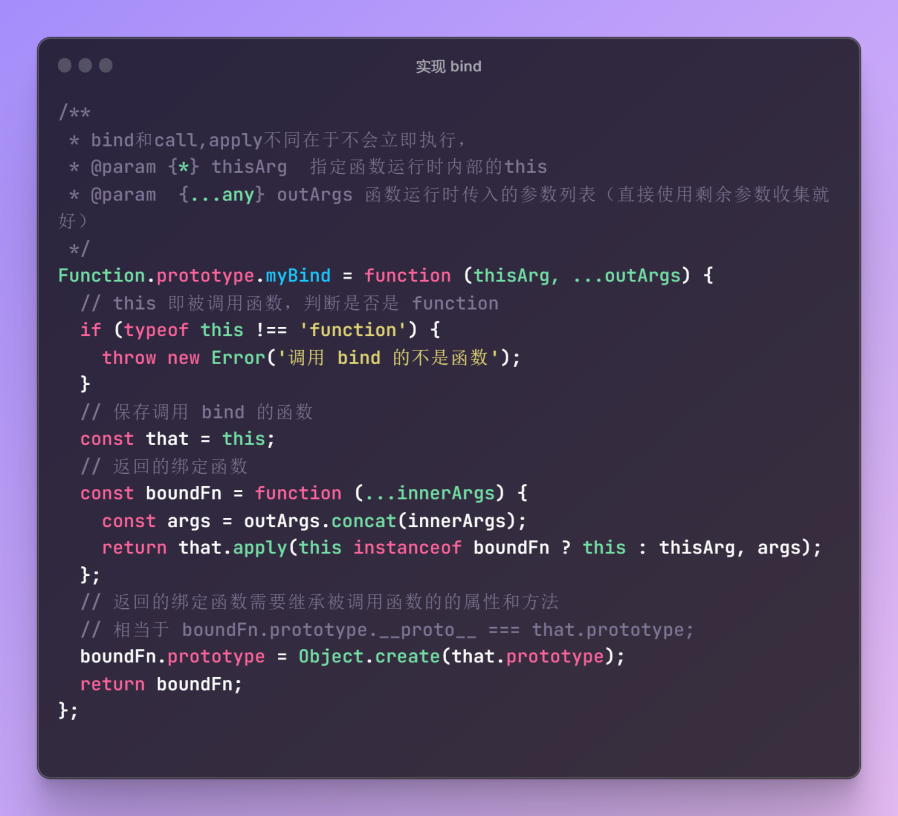

### getter & setter

get 语法将对象属性绑定到查询该属性时将被调用的函数。set语法将对象属性绑定到要设置属性时将被调用的函数。getter 和 setter 通常用于创建和操作一个伪属性。可以使用delete操作符移除getter和 setter创建的伪属性。getter 或setter可以用Object.defineProperty添加到现有对象上。在 Classes中使用时，get和set关键字语法是定义在原型上的，Object.defineProperty是定义在实例自身上。

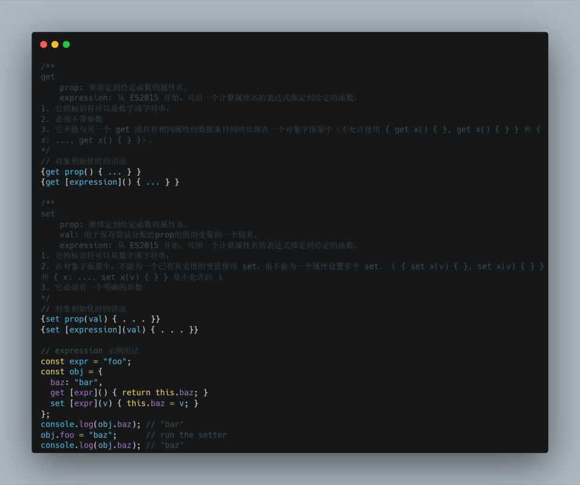

getter设置的伪属性在访问它们之前不会计算属性的值，能延迟计算值的成本。当属性值的计算是昂贵的（占用大量 RAM 或 CPU 时间，产生工作线程，检索远程文件等）、或者现在不需要该值而是在稍后甚至某些情况根本不使用、或者多次访问值不改变也就不需要被重新计算时，可用智能（或称记忆化）getters延迟属性值的计算并将其缓存返回缓存值以备以后访问而不需要重新计算。示例：

### 异步函数（async）

异步（async）函数是在普通函数前添加async关键字声明的函数，它是 AsyncFunction 构造函数的实例，并且在且仅在其中允许使用 await 关键字，async/await 的行为就好像搭配使用了生成器和 promise，避开链式调用Promise。使用 async/await 关键字，可通过同步的方式书写异步代码。

async 函数可能包含 0 个或者多个 await 表达式，从第一行代码直到（并包括）第一个 await 表达式（如果有的话）都是同步运行的，因此一个不含 await 表达式的 async 函数是会同步运行的，然而，如果函数体内有一个 await 表达式，async 函数就一定会异步执行。await 表达式会暂停整个 async 函数的执行进程并出让其控制权，只有当其await的基于 promise 的异步操作被兑现或被拒绝之后才会恢复进程。promise 的resolve值会被当作该 await 表达式的返回值。

在await 表达式之后的代码可以被认为是存在在链式调用的 then 回调中，多个 await 表达式都将加入链式调用的 then 回调中，返回值将作为最后一个 then 回调的返回值。任何一个 await 语句后面的 Promise 对象变为 rejected 状态，如果该promise没加catch捕获，或使用try/catch捕获，那么整个 async 函数都会中断执行，并通过隐式返回 Promise 将错误传递给调用者。

**优雅的try/catch处理 async /await错误**：

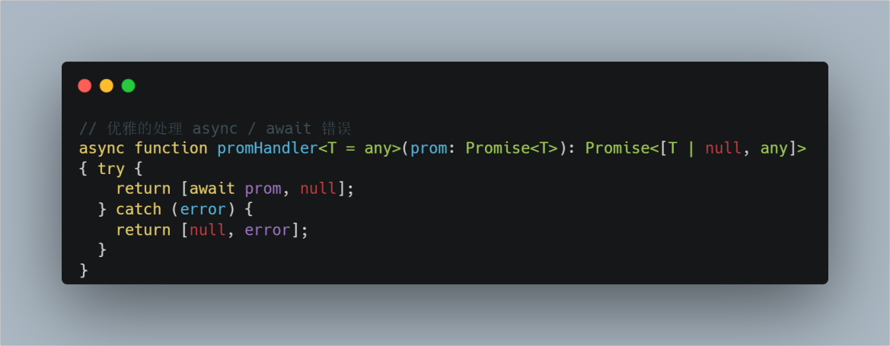

async函数返回一个async 函数成功返回的值被 resolve 或 async 函数中抛出的（或其中没有被捕获到的）异常被reject的Promise，即使async函数return看起来不是Promise，也会隐式的被Promise.resolve包装。

return await Promise和 return Promise 区别在于前者返回的是解决后的返回值的Promise，后者返回的是该Promise是异步的，是不能使用try/catch捕获的，await Promise 才可以。

**async/await重试逻辑实现**：

**async/await 实现原理**：

**async/await应用场景**：

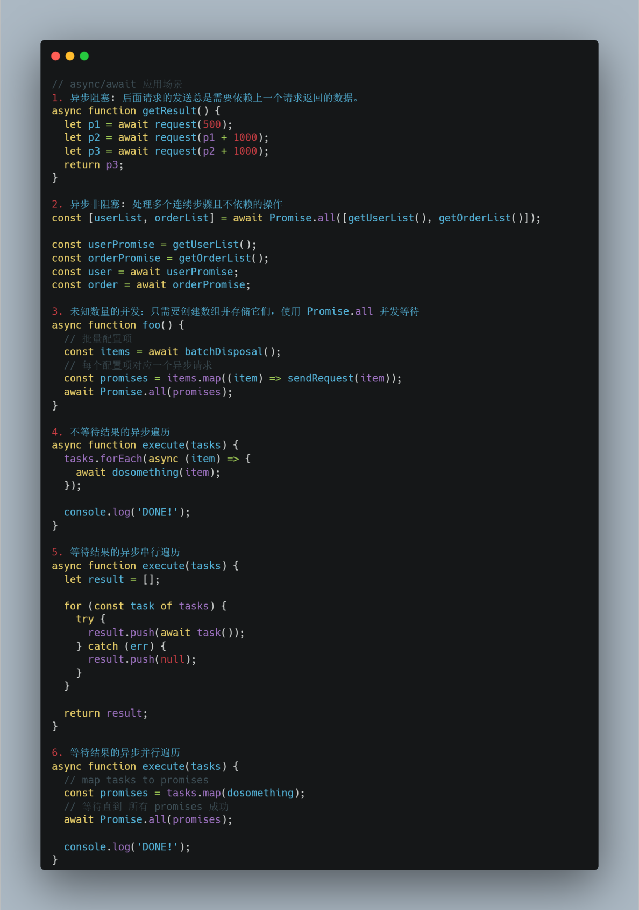

### new操作符

new 运算符创建一个用户定义的对象类型的实例或具有构造函数的内置对象的实例。new可以看做下列操作的语法糖：
1. 创建一个新对象，使用构造函数的原型来作为新创建对象的原型（prototype）
2. 将新对象作为this调用构造函数（apply） 
3. 如果构造函数没有返回对象（即返回的是非引用类型），则返回this，否则返回构造函数返回的对象。

对于普通对象，无论性能上还是可读性，**更推荐使用字面量的方式创建对象**。（否则new涉及到可能通过原型链一层层查找到Object）。

**实现new**：

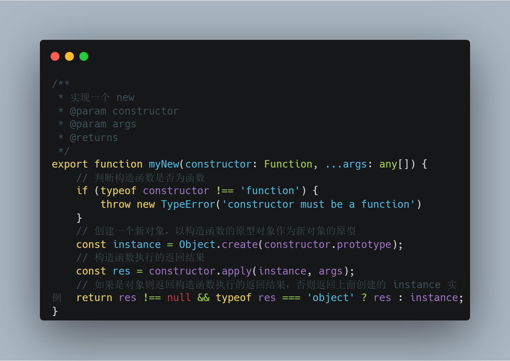

new.target 属性允许你检测函数或构造方法是否是通过new运算符被调用的。在通过new运算符被初始化的函数或构造方法中，new.target返回一个指向构造方法或函数的引用。在普通的函数调用中，new.target 的值是undefined。

**new的优先级？**

new相关的部分优先级从高（20）变低：

带参数列表的new即new Foo()的优先级、函数调用以及成员访问同级，且大于无参数列表的new的优先级new Foo，虽然new Foo()等同于new Foo。

### 闭包

闭包（closure）是将一个函数与对其周围状态（词法环境）的引用捆绑在一起（封闭）的组合。**闭包产生的本质是当前函数存在对父级作用域的引用，因此JavaScript 中的所有函数都是闭包的（new Function例外）**。

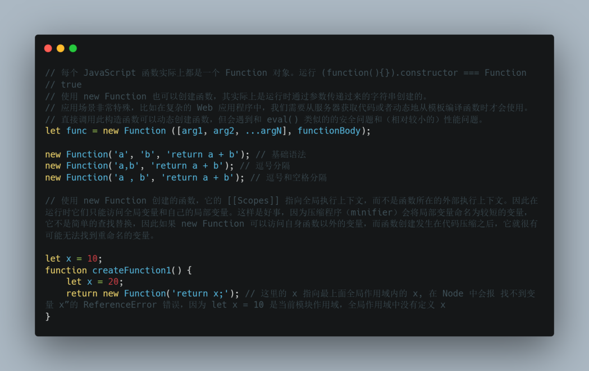

被引用的变量即自由变量（当前函数作用域未声明而访问的变量，不包括函数参数arguements）。闭包也可以捕获块作用域和模块作用域中的变量。

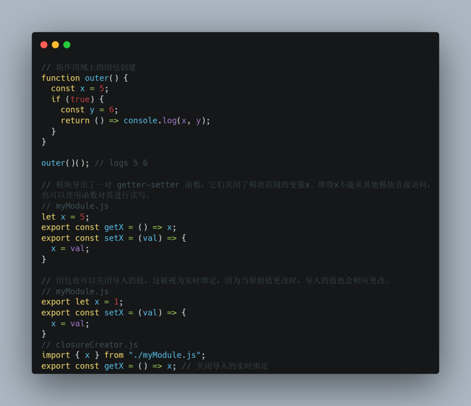

**闭包应用场景**：

**循环中的闭包问题？**

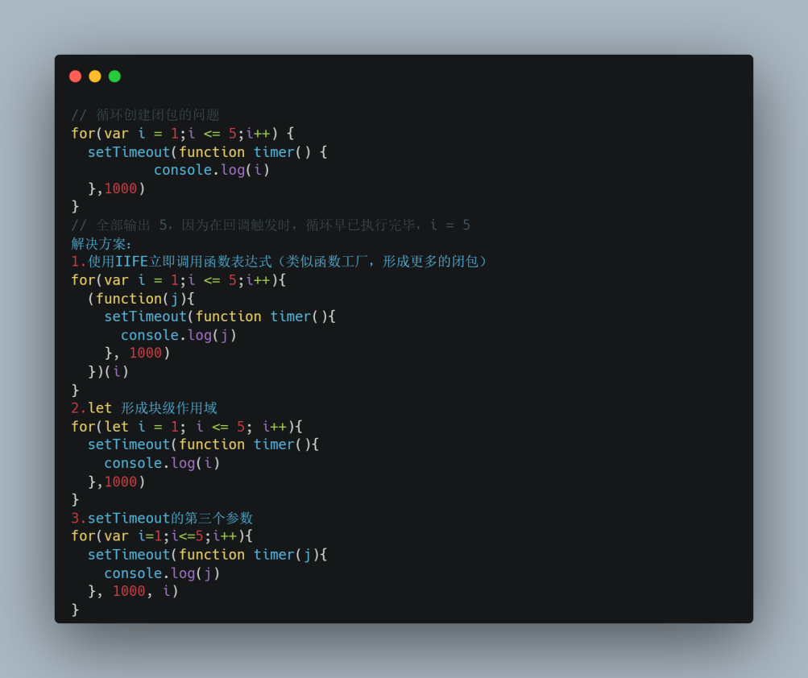

如果不是某些特定任务需要使用闭包，在其它函数中创建函数是不明智的，因为闭包在处理速度和内存消耗方面对脚本性能具有负面影响。在创建新的对象或者类时，方法通常应该关联于对象的原型，而不是定义到对象的构造器中。原因是这将导致每次构造器被调用时，方法都会被重新赋值一次。

理论上当函数可达时，它外部的所有变量也都将存在。但在实际中，JavaScript 引擎会试图优化它：分析变量的使用情况，如果从代码中可以明显看出有未使用的外部变量，那么就会将其删除。在 V8（Chrome，Edge，Opera）中的一个重要的副作用是，此类变量在调试中将不可用。

### 箭头函数（ES6）

**引入箭头函数有两个方面的作用：更简短的函数并且运行时不绑定this**。

**箭头函数保持为创建时封闭词法作用域的this或arguments值（箭头函数不是封闭词法作用域）。箭头函数内没有自己的this（所以从上层作用域去找）， arguments（所以从上层作用域去找），super，new.target，prototype**。箭头函数不能用作构造函数（会报TypeError错）。yield关键字不能在箭头函数中使用即不能作为 Generator 函数。箭头函数在参数和箭头之间不能换行。

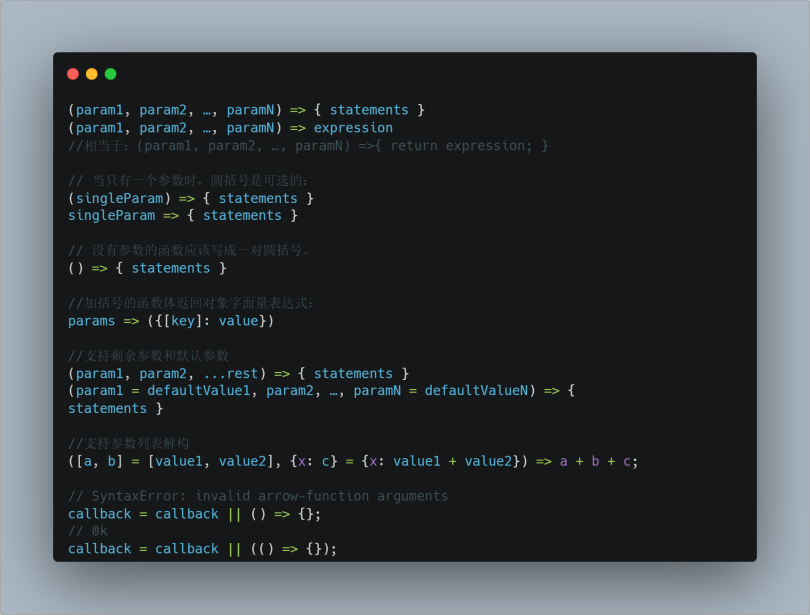

### 构造函数

生成器函数，Math，JSON，Symbol，Reflect，Atomics，BigInt不能作为构造函数，也就不能使用new运算符。

### 惰性函数

惰性函数表示函数执行的分支只会在函数第一次调用的时候执行，在第一次调用过程中，该函数会被覆盖为另一个按照合适方式执行的函数，这样任何对原函数的调用就不用再经过执行的分支了。常见的检测浏览器支持情况选择为 DOM 节点添加事件监听的函数：

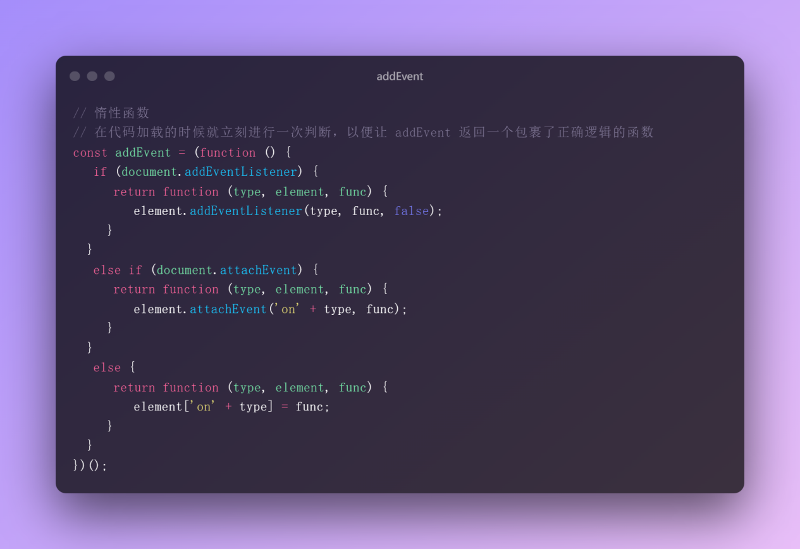

### 级联函数

级联函数也叫链式函数，是一种在一个对象上使用一条连续的代码来重复调用不同方法的技巧。一定程度上可以减少代码量，提高代码可读性，缺点是它占用了函数的返回值。比如字符串方法，jQuery方法。要使用级联函数，我们只需要在每个函数中返回 this 对象（也就是后面方法中操作的对象）。操作的对象就会在执行完一个函数后继续调用往后的方法，即实现了链式操作。

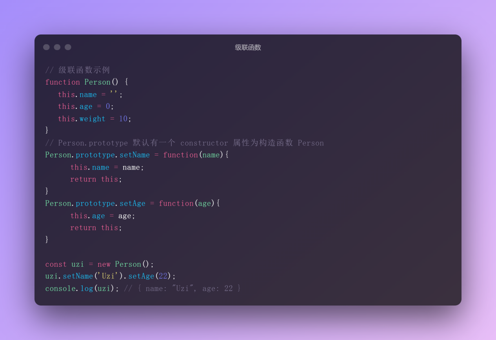

### 高阶函数

高阶函数指操作函数的函数，一般地，有以下两种情况：
1. **函数作为参数被传递**：把函数当作参数传递，代表可以抽离出一部分容易变化的业务逻辑，把这部分业务逻辑放在函数参数中，这样一来可以分离业务代码中变化与不变的部分。比如回调函数，包括Ajax，事件监听，数组排序方法sort等
2. **函数作为返回值输出**。比如偏函数（Partial），返回了一个包含预处理参数的新函数，以便后续逻辑可以调用。在计算机科学中，Partial应是指将部分参数固定，从而产生一个新的较小元（元即参数的个数）的函数。偏函数是把一个 n 元函数转换成一个 n - x 元函数，比如Function.prototype.bind。

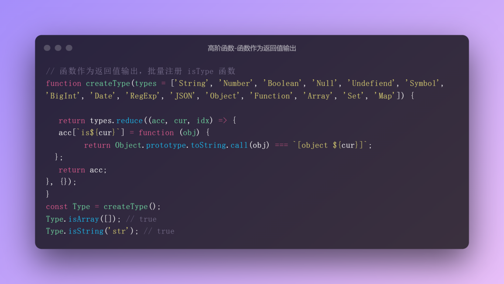

**AOP 即面向切面编程**，它的主要作用是 把一些跟核心业务逻辑模块无关的功能抽离出来，这些跟业务逻辑无关的功能通常包括日志统计、安全控制、异常处理等。把这些功能抽离出来之后，再通过**动态植入**的方式掺入业务逻辑模块中。这样做的好处首先是可以保持业务逻辑模块的纯净和高内聚性，其次是可以很方便地复用日志统计等功能模块。通常，在 JavaScript 中实现 AOP，都是指把一个函数**动态植入**到另外一个函数之中。

或者通过扩展 Function.prototype 来实现：

### 函数柯里化与反柯里化

**柯里化**（Currying）是把接受多个参数的函数变换成接受一个单一参数（最初函数的第一个参数）的函数，并且返回接受余下的参数而且返回结果的新函数的技术。柯里化是利用闭包的特性实现的。完全柯里化指的是将函数变换成每次只接受一个参数的新函数，直到参数个数等于原函数即返回结果，即柯里化应该将 sum(a, b, c) 转换为 sum(a)(b)(c)。而JavaScript 中大多数的柯里化实现都是高级版的，即使得函数被多参数变体调用。

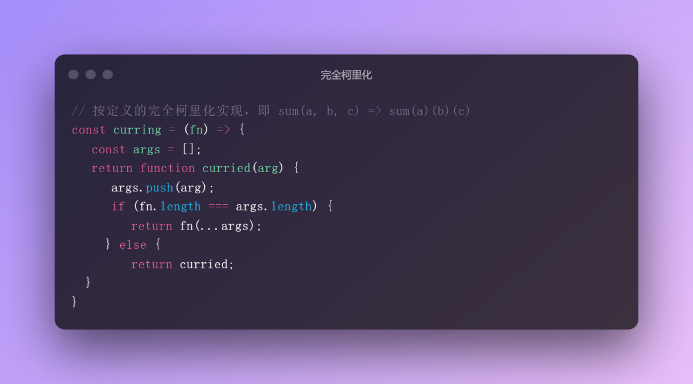

**柯里化的优点**：
1. 参数复用（返回的函数可复用前面的参数）； 
2. 延迟执行（返回函数）；
3. 提前返回（提前做判断，返回指定需求的函数）。

**柯里化的缺点**：
1. 闭包和嵌套作用域带来的性能损耗；
2. apply与call等显然比直接调用慢。

**柯里化的实现**：

**以上的柯里化实现要求原函数具有固定数量的形参**，如果是使用剩余参数的函数，例如 f(...args)，不能以这种方式进行柯里化。

柯里化是为了缩小适用范围，创建一个针对性更强的函数；**反柯里化**则是扩大适用范围，创建一个应用范围更广的函数。

### 函数记忆与睡眠

**函数记忆**指将上次的（计算结果）缓存起来，当下次调用时，如果遇到相同的（参数），就直接返回（缓存中的数据）。实现原理是将参数和对应的结果保存在对象中，再次调用时，判断对象 key 是否存在，存在返回缓存的值。

<<< ../../../../src/函数相关/函数记忆与睡眠/index.js#docs1

**函数睡眠**，在 JavaScript 中是一个伪命题，因为 JavaScript  引擎线程无法挂起，只能通过异步实现类似 sleep 的效果。

<<< ../../../../src/函数相关/函数记忆与睡眠/index.js#docs2

### 函数防抖（debounce）

**防抖**，即**短时间内大量触发同一事件，只会执行一次函数，实现原理为设置一个定时器，约定在 xx 毫秒后再触发事件处理，每次触发事件都会重新设置计时器，直到 xx 毫秒内无第二次操作（类似于生活中的电梯关门）**，防抖常用于**搜索框/滚动条的监听事件处理**，如果不做防抖，每输入一个字/滚动屏幕，都会触发事件处理，造成性能浪费。

<<< ../../../../src/函数相关/函数防抖/debounce.ts#docs

使用函数防抖的三个条件：
1. 频繁调用某个函数；
2. 造成效率问题；
3. 需要的结果以最后一次调用为准。

### 函数节流（throttle）

**节流是间隔执行**，规定一个单位时间，在这个单位时间内，只能有一次触发事件的回调函数执行，如果在同一个单位时间内某事件被触发多次，只有一次能生效。**实现原理为设置一个定时器，约定xx毫秒后执行事件，如果时间到了，那么执行函数并重置定时器**。**和防抖的区别在于**，防抖每次触发事件即重置定时器，而节流在定时器到时间后再清空定时器。

<<< ../../../../src/函数相关/函数节流/throttle.js#docs

场景：适合当量事件按事件做平均分配触发
1. 动画场景：避免短时间多次触发动画引起性能问题。
2. 拖拽场景：固定时间内只执行一次，防止超高频次触发位置变动（mousemove）。
3. 缩放场景：监控浏览器窗口大小（resize）。
4. 滚轮场景：鼠标滚轮事件（wheel）。
5. Canvas 画笔功能。

### 函数管道与组合

函数组合是一种将简单函数组合起来构建更复杂函数的行为或机制，函数组合对传入的多个简单函数从右到左执行，函数管道则刚好相反。

<<< ../../../../src/函数相关/函数管道与组合/index.js#docs
