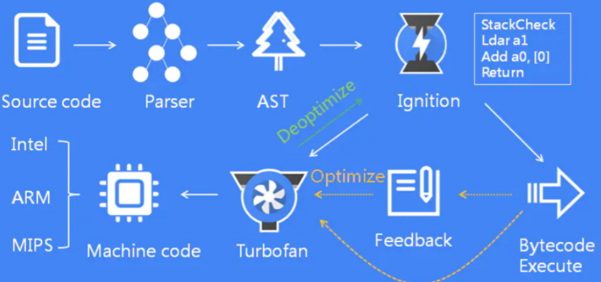
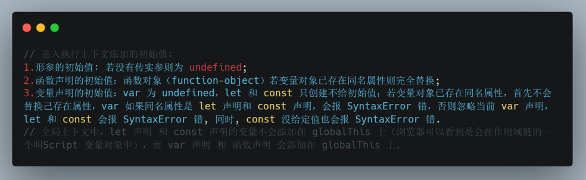
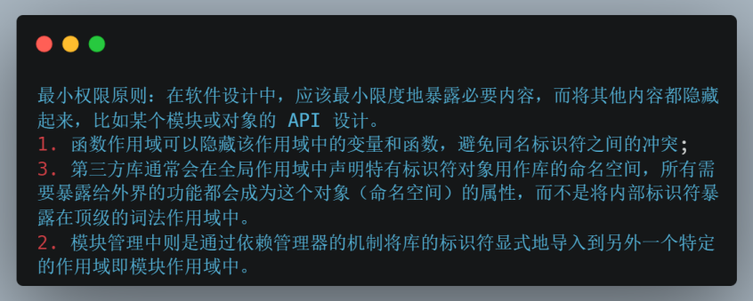
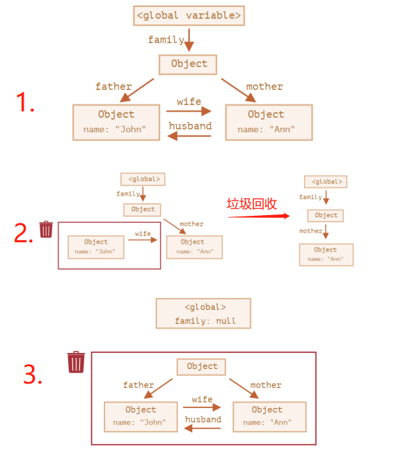
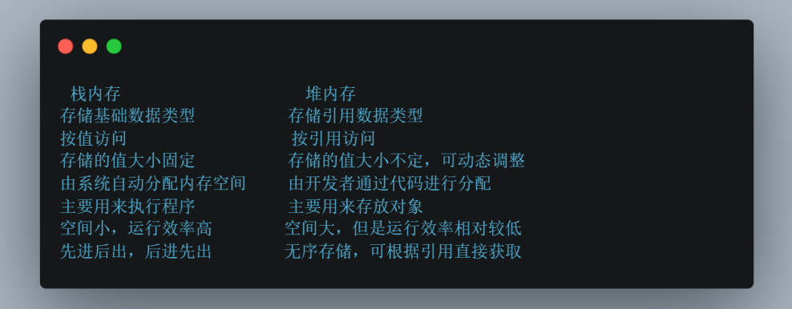
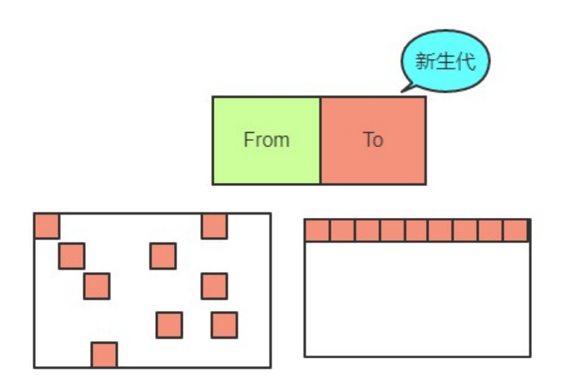
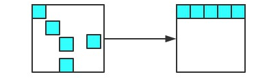
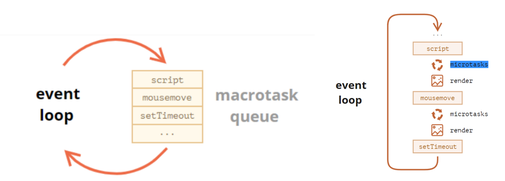
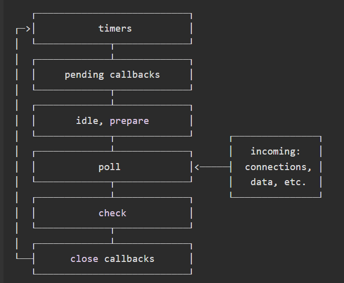
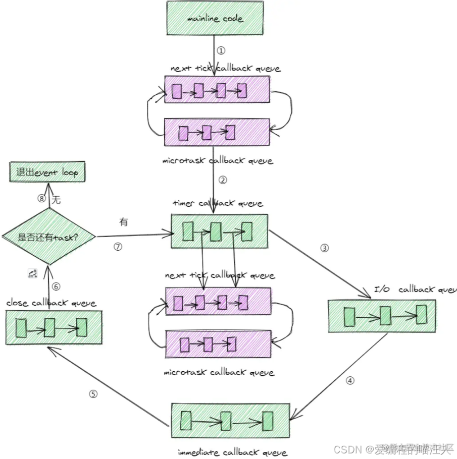

# JavaScript

## 关于JavaScript

JavaScript（JS）是单线程的、基于原型的、弱类型的、动态类型的、轻量的、支持面向对象/命令式/声明式编程的、头等函数的、多范式的、解释性（直译式或即时编译）的、也可在非浏览器环境下使用的动态脚本语言。JavaScript区分大小写。JavaScript 中，通过在运行时给空对象附加方法和属性来创建对象并且可以作为创建相似对象的原型。

浏览器JavaScript由三部分组成：核心ECMAScript 描述了该语言的语法和基本对象；DOM 描述了处理网页内容的方法和接口；BOM 描述了与浏览器进行交互的方法和接口。

JavaScript 的动态特性包括运行时构造对象、可变参数列表、函数变量、动态脚本执行（通过 eval）、对象内枚举（通过 for ... in）和源码恢复（JavaScript 程序可以将函数反编译回源代码）。

JavaScript® 是 Oracle 在美国和其他国家的商标或注册商标。

## 编译原理与编译过程

在代码执行之前会经历**词法分析**、**语法分析**和**代码生成**的编译阶段。

1. **词法分析**（**Lexing**）会将由字符组成的字符串分解成有意义的代码块即词法单元（Token）。
2. **语法分析**（**Parsing**）是将词法单元流转换成一个**由元素逐级嵌套所组成**的代表了程序语法结构的树即抽象语法树（AST，Abstract Syntax Tree）。
3. **代码生成**是将 AST 转换为可执行代码。

V8 的执行过程：



源代码经过 Parser 解析器，经过词法分析和语法分析生成 AST；AST经过 Ignition 解释器生成字节码并执行；在执行过程中，如果发现热点代码，将热点代码交给 TurboFan 编译器生成机器码并执行；如果热点代码不再满足要求，进行去优化处理即还原成字节码并把执行权交还给 Ignition 解释器。

## 执行上下文和作用域

JavaScript代码是运行在执行上下文中的，创建新执行上下文的方式有：
1. 全局执行上下文：为函数之外的任何代码创建的上下文。
2. 函数执行上下文：每个函数执行时创建的上下文。创建个数没有限制。
3. eval执行上下文：eval函数执行创建的上下文，不建议使用可忽略。

每一个上下文在本质上都是一种作用域层级，每个上下文创建的时候会被推入**执行上下文栈（Execution Context Stack，或者叫函数调用栈（Call Stack））**，栈顶是当前执行的上下文，执行完代码退出的时候从上下文栈中移除，栈底是全局执行上下文。（注意：JavaScript 中，以回调方式调用的函数，是否会形成类似于递归那样“一层套一层” 的调用链而存在堆栈溢出的风险，取决于父函数执行完毕之前是否再次调用 “父” 函数，比如 setTimeout、nextTick、promise.then/catch/finally、MutationObserver等是在任务队列中执行，再次调用“父”函数时，父函数已经执行完毕，即不存在堆栈溢出的危险）。

```javascript
function fun2() {
  console.log('fun2');
}
function fun1() {
  fun2();
}
fun1();
/**
 模拟：
 // fun1()
 ECStack.push(<fun1> functionContext);
 // fun1 中调用了 fun2, 所以还要创建 fun2 的执行上下文
 ECStack.push(<fun2> functionContext);
 // fun2 执行（创建作用域链 => 变量对象 => 执行代码）完毕
 ECStack.pop();
 // fun1 执行（创建作用域链 => 变量对象 => 执行代码）完毕
 ECStack.pop();
 */
```

**变量对象**（**Variable object，VO**）是与执行上下文相关的数据作用域，存储了在上下文中定义的变量和函数声明。**作用域即执行上下文，由多个作用域的变量对象构成的链表就叫做作用域链**。函数创建时，每个函数的`[[Scopes]]`**属性**在会保存所有父级作用域内的变量对象。

全局对象的通用变量名是通用名称 globalThis，特定环境名称分别是：
1. 浏览器——window；
2. Worker——WorkGlobalScope；
3. nodejs——global；

全局变量提供可在任何地方使用的变量和函数。默认情况下，这些全局变量内建于语言或环境中。

**执行上下文中的代码会分成两个阶段进行处理**：
1. **进入执行上下文**：
    1. 如果是函数执行上下文，会**复制**函数`[[scope]]`属性到函数执行上下文的 Scopes 属性来初始化作用域链。
    2. 然后创建变量对象：全局执行上下文的变量对象初始化是全局对象。函数执行上下文的变量对象初始化是只包含 Arguments 对象的对象。如果是函数执行上下文则首先给当前执行上下文的变量对象添加形参及初始值，否则先添加函数声明（函数表达式属于后面的变量声明）及初始值，再添加变量声明（带声明var/let/const关键字的）及初始值，完成后被激活为**活动对象（Activation Object，AO）**；因此，变量提升（Hosting）是JavaScript执行上下文工作方式，意味着变量和函数的声明在编译阶段即执行阶段之前被放入内存中，就好像声明处在作用域最前面。由执行上下文的两个处理阶段可知，函数声明提升（非函数表达式）优先于变量声明提升（var、let、const）；

    

    3. **如果是函数执行上下文，会将活动对象压入**函数执行上下文的Scopes属性即**作用域链顶端**。

    ```javascript
    function foo() {
      function bar() {
        // do something
      }
    }

    // foo 函数创建时
    foo.[[Scopes]] = [
      globalContext.VO
    ];

    bar.[[Scopes]] = [
      fooContext.AO,
      globalContext.VO
    ];

    // bar 函数执行上下文
    barContext = {
      AO: {
        arguments: []
      },
      Scope: [AO, fooContext.AO, globalContext.VO],
      this: undefined
    }
    ```

2. **代码执行**：
    1. 访问并修改活动对象的属性值。对于let 或 const 声明的变量，从一个代码块的开始直到代码执行到声明变量的行之前，变量都处于“暂时性死区”（Temporal dead zone，TDZ），尝试访问即使是typeof也将抛出 ReferenceError；只有当代码执行到声明变量所在的行时，才会对其进行初始化（若未赋值，则初始化为 undefined）。
    2. 执行完后将函数执行上下文从执行上下文栈中弹出。

**作用域即执行上下文，由多个作用域的变量对象构成的链表就叫做作用域链**。函数在执行前会复制该函数 `[[Scopes]]` 属性到函数执行上下文中创建作用域链。当访问一个变量时，解释器会首先在当前作用域的变量对象中查找标识符，如果没有找到，就去父作用域找，直到找到标识符，如果全局作用域也找不到就报错。**因此，一个变量或函数在整个作用域链都没有声明，那么在代码执行阶段就会报 ReferenceError 错**。

作用域共有两种主要的工作模式：词法作用域（静态作用域）和动态作用域。**JavaScript 采用词法作用域（Lexical Scope）**。词法作用域根据源代码中声明变量的位置来确定该变量在何处可用，而动态作用域 并不关心函数和作用域是如何声明以及在何处声明，它只关心它们从何处调用。


```javascript
const a = 2;
function foo() {
  console.log(a);
}

function bar() {
  const a = 3;
  foo();
}

bar();
// JS 是词法作用域，所以输出 2
// 假如是动态作用域则输出 3
```

**JavaScript的词法作用域**分为：
1. **全局作用域**：脚本模式运行所有代码的默认作用域。
2. **模块作用域**： 模块模式中运行代码的作用域。 Node 中顶级作用域不是全局作用域，而是当前模块作用域。
3. **函数作用域**：由函数创建的作用域。函数作用域指属于这个函数的全部变量都可以在整个函数的范围内访问。
使用 let（ES6）、const（ES6）声明的变量和Function 构造函数声明的函数属于额外的**块级作用域**（被限制在定义它的代码块内——块由一对大括号界定）。




## this

this是执行上下文的一个属性，在非严格模式下指向一个对象，严格模式下可以是任意值。
1. 在全局上下文（任何函数体外部）中，无论是否为严格模式，this指向全局对象。
2. 在函数上下文中，this的值取决于函数被调用的方式（运行时绑定，箭头函数除外），函数的调用方式包括：
    1. 方法调用模式即作为对象的属性被调用；
    2. 普通调用模式即普通的函数调用；
    3. 构造函数调用模式即使用 new；
    4. 间接调用模式即 call、apply 调用；

    默认情况即普通函数调用模式下，非严格模式中 this 指向globalThis，严格模式中指向undefined，因此this可以用来判断当前是否处于严格模式：

    ```javascript
    function isStrict() {
      return this === void 0;
    }
    ```

3. 在类（class，ES6）上下文中，**类中所有非静态的方法都会被添加到 this 的原型中**。子类的构造函数中没有初始的this绑定，需要调用super()才会生成this绑定，因此在调用super()之前访问this会报错。而且子类不能在调用 super() 之前创建实例返回，除非其构造函数返回的是一个对象，或者根本没有构造函数。类内部总是严格模式，调用一个 this 值为 undefined 的方法会抛出错误。
4. nodejs环境下的模块中，this指向module.exports。而浏览器环境下的模块中，顶级 this 是 undefined。
5. 当函数作为对象里的方法（包括getter、setter、原型链上的方法）、DOM事件处理函数、内联事件处理函数调用时，this 被设置为调用该函数的对象和元素。
6. 显示绑定函数的this方式：bind，call，apply，对箭头函数来说不能绑定 this即第一个参数会被忽略，只能传递参数。在非严格模式下使用 call 和 apply 更改函数的 this 绑定时，如果用作 this 的值不是对象，则会被尝试转换为对象：
    1. null 和 undefined 被转换为全局对象；
    2. 其他原始值会使用对应的构造函数转换为对象，比如 7 会被转换为 new Number(7)，'foo'会被转换为 new String('foo')；
    3. bind 函数会创建返回与原函数具有相同函数体和作用域的函数，新函数的 this 将被永久地绑定到首次 bind 的第一个参数，后续无论如何调用或更改绑定，this 不会变。
7. 箭头函数不会创建自己的this，它只会从自己的作用域链的上一层继承 this，**即箭头函数保持为创建时封闭词法作用域的this值（箭头函数不是封闭词法作用域）**。关于“ this”的严格模式区别规则在箭头函数中将被忽略。针对箭头函数判定this的简便方法：在箭头函数创建的位置将整个箭头函数替换为this，则箭头函数的this就是这个被替换的this，如果有多层箭头函数，则重复这个步骤。
8. Proxy 代理对象调用方法时，原对象内部的 this 指向其代理对象。handler 拦截函数内部的 this，指向的是 handler 对象本身。

**对象方法的链式调用通过该方法返回当前对象实现**。

## 内存管理与垃圾回收

### 内存管理

编程语言的内存生命周期均包括三部分：
1. 分配所需要的内存，JavaScript中发生在值的初始化和函数调用返回。
2. 使用分配到的内存（读、写）
3. 不需要时将其释放\归还，即垃圾回收（Garbage collection，GC），是计算机编程中用于描述查找和删除那些不再被其他对象引用的对象处理过程。

JavaScript 的内存管理是自动的、无形的。在内存管理的环境中，一个对象如果有访问另一个对象的权限（隐式或者显式），叫做一个对象引用另一个对象，“对象”的概念包括 JavaScript 对象和函数作用域（或者全局作用域）。特别注意，全局变量的生命周期直到浏览器卸载页面才会结束，也就是全局变量不会被当成垃圾变量回收。

### 垃圾回收

#### 引用计数法

最初级的**引用计数法**：将“对象是否不再需要”简化定义为“对象有没有其他对象引用到它”，因此如果没有引用指向该对象（零引用），对象将被垃圾回收机制回收。该方法存在循环引用的内存无法被回收的问题。

#### 标记清除法

**标记清除法**：将“对象是否不再需要”简化定义为“对象是否**可达**”。假定设置一个设置一个叫做根（root）的对象（在 Javascript 里，根是全局对象），如果一个值可以通过引用链从根访问，则认为该值是可达的。它相比引用计数法更好，因为“有零引用的对象”总是不可达，即使是循环引用。标记清楚算法缺陷是无法从根对象查询到的对象都将被清除。

```javascript
function marry(man, woman) {
  woman.husband = man;
  man.wife = woman;
  return {
    father: man,
    mother: woman
  }
}

// 1. 创建引用
let family = marry({
  name: 'John'
}, {
  name: 'Ann'
});

// 2. 移除两个引用
delete family.father;
delete family.mother.husband;

// 3. 移除外部引用
let family = null;
```





**栈内存**，ESP 指针下移（即上下文切换），栈顶的空间会自动被回收。

垃圾收集器进行分代收集（Generational collection）（按新生代和老生代收集）、增量收集（Incremental collection）（分多次收集）、闲时收集（在 CPU 空闲的时候）。

**堆内存**，分为**新生代内存**（临时分配的内存，存活时间短）和**老生代内存**（常驻内存，存活时间长）。


**新生代**的内存在 64 位和 32 位系统下默认限制分别为 32MB 和 16MB（存活时间短，操作更频繁，所以设置小）。

> V8 引擎会限制内存的使用（64 位最多只能分配 1.4GB，32 位最多只能分配 0.7GB），因为垃圾回收是非常耗时的操作，同时，回收过程会阻塞线程。以 1.5GB 的垃圾回收为例，V8 做一次小的垃圾回收需要 50ms 以上，做一次非增量式的垃圾回收甚至要 1s 以上。
> 手动调整老生代：node --max-old-space-size=2048 xxx.js；
> 手动调整新生代（一般不建议）：node --max-new-space-size=2048 xxx.js。

**新生代内存空间分为 From（正在使用的内存）和 To （目前闲置的内存）**。垃圾回收时使用 **Scavenge 算法**：检查From内存，将存活对象**从头放置的方式复制**到 To 内存（按理说复制的同时，From空间内存活对象的占用的内存应该释放掉），回收非存活对象，直到From内存空，From内存空间和To内存空间角色对调。由于**新生代**存储的是生命周期短的对象，对象较少，因此时间性能优秀，**算法缺点是新生代内存使用率不超过新生代内存的一半**。**为何不直接将非存活对象回收？一个对象的堆内存分配是连续的，直接回收非存活对象会容易产生不够后续对象使用的内存碎片，内存利用率低。**



**老生代内存**，被晋升（1. 已经经历过一次 Scavenge 回收 2. 回收后To（闲置）空间的内存占用超过25%）的对象会被放入到老生代内存中。老生代垃圾回收（不使用 Scavenge 算法，老生代空间大，考虑内存利用率和复制耗时），采用标记清除算法：
1. **标记-清除**，遍历老生代中所有对象并**做上标记**，仅**使用的变量**以及**被强引用**的变量**取消标记**。标记结束后**清除回收具有标记**的变量对象。其中标记采用**增量标记**（为避免垃圾回收耗时阻塞时间过长，即将标记任务分为很多小的部分，小部分完成就暂停一下，直到标记阶段完成，如此，阻塞时间减少到原来的1/6）；
2. **整理内存碎片**，清除阶段结束后把存活的对象全部往一端靠拢（移动对象，全过程最耗时操作）。



#### 内存泄漏

**堆栈溢出**：指没有足够的内存空间申请。

**内存泄漏**指申请的内存执行完后没有及时的清理或者销毁，占用空闲内存。当内存泄漏过多就会导致堆栈溢出。一般是堆内存溢出。

常见内存泄漏的原因：
1. 减少不正当的使用闭包，因为可能会造成内存泄漏

```javascript
function fn() {
  const test = new Array(1000).fill('');
  return function () {
    console.log(test);
    return test;
  }
}
let fnInner = fn();
fnInner();
/** fnInner() = null; // 置空外部引用 */
// More Tools -> Developer Tools -> Memory -> Allocation instrumentation on timeline 
```

2. 隐式的全局变量可能导致内存泄漏

```javascript
function fn() {
  'use strict' // 函数内使用严格模式避免泄漏
  // 没有声明的变量是隐式全局变量
  test1 = new Array(1000).fill('');
  // 函数内部 this 指向 window, test2 也是隐式全局变量
  this.test2 = new Array(1000).fill('');
}
// More Tools -> Developer Tools -> Performance/Memory， 一般先在 Performance 面板录制页面内存占用情况随时间变化的图像，对内存泄漏有个直观的判断，然后在 Memory 面板定位问题发生的位置
```
3. 游离的 DOM 引用

```html
<div id="root">
  <ul id="ul">
    <li></li>
    <li></li>
    <li id="li3"></li>
    <li></li>
  </ul>
</div>
<script>
  let root = document.querySelector('#root');
  let ul = document.querySelector('#ul');
  let li = document.querySelector('#li3');
  
  root.removeChild(ul);
  ul = null; // 虽然置空了 ul 变量，但由于 li 变量引用了 ul 的子节点，所以 ul 元素依然不能被垃圾回收

  li = null; // 已无变量引用，此时 ul 元素才可以垃圾回收

  // 通过堆快照（Heap Snapshot），调试路径 Memory -> Heap Snapshot -> Take Snapshot，堆快照可以直接显示是否游离的 DOM 节点，只要在顶部过滤框 filter 输入 detached，如果过滤出东西，说明存在游离的 DOM 节点
</script>
```
4. 未清除的定时器和 requestAnimationFrame

```javascript
let someResource = getData();
const timer = setInterval(() => {
  const node = document.getElementById('Node');;
  if (node) {
    node.innerHTML = JSON.stringify(someResource);
  }
}, 1000)
```
5. 组件卸载时未解除监听

```javascript
created() {
  eventBus.on('test', this.doSomething)
},
beforeDestroy() {
   // eventBus.off('test');
},
methods: {
  doSomething() {
    // do something
  }
}
```

6. 未清理的 console 输出：控制台会始终保持对 console 输出结果的引用，导致无法被垃圾回收

7. 遗忘的 Map、Set 对象：Map、Set 是强引用，即一个对象被强引用所引用时，那么这个对象就不会被垃圾回收，若要能够回收，需置空 Map 和 Set。而 WeakMap 和 WeakSet 是弱引用，即一个对象只被弱引用所引用，则被认为是不可访问（或弱可访问）的，因此可能在任何时刻被回收。

## 并发模型与事件循环

JavaScript 有一个基于**事件循环（Event Loop）**的并发模型，负责浏览器和Node中执行代码、收集和处理事件以及执行队列中的子任务，是用于**解决JavaScript单线程运行时可能会阻塞**的一种机制。

事件循环是一个在 JavaScript 引擎等待任务，执行任务和进入休眠状态等待更多任务的状态之间转换的无限循环。**Javascript 引擎大多数时候处于不执行任何操作即等待任务状态**，仅在脚本加载完成/事件触发时执行。

渲染和执行JS是互斥的，都在渲染主线程中进行。执行JS时永远不会进行渲染（render）。仅在执行完成后才会绘制对 DOM 的更改。如果一项任务执行花费的时间过长，浏览器将无法执行其他任务，例如处理用户事件或渲染。因此，在一定时间后，浏览器会抛出一个如“页面未响应”之类的警报来建议终止这个任务。这种情况常发生在有大量复杂的计算或导致死循环的程序错误时。

任务分为**宏任务（MacroTask或Task）**和**微任务（MicroTack）**，每个宏任务之后，JavaScript引擎会立即执行微任务队列中的所有任务，然后再执行其他的宏任务，或渲染，或进行其他任何操作。主动安排一个宏任务使用setTimeout/setInterval，主动安排一个微任务使用queueMicrotask。对于 v11.15.0+ 的Node表现和浏览器一致，执行完一个定时器任务立即执行微任务队列中的所有任务，而之前版本的Node在执行完定时器任务后先检查任务队列的队首是否定时器任务，是则保存微任务队列，优先执行该定时器任务，中途产生的微任务进入微任务队列，待定时器任务执行完再依次执行微任务队列。

```javascript
// 使用嵌套的 setTimeout 调用来拆分 cpu 过载任务
let i = 0;
let start = Date.now();
function count() {
  // 将调度（scheduling）移动到开头
  if (i < 1e9 - 1e6) {
    setTimeout(count); // 安排（schedule）新的调用
  }
  do {
    i += 1;
  } while (i % 1e6 !== 0);
  if (i === 1e9) {
    alert("Done in " + (Date.now() - start) + 'ms');
  }
}
count();
```

**宏任务**：script、setTimeout/setInterval（由计时线程计时，到期才放入队列中，且浏览器不会对同一个 setInterval 回调多次添加到任务队列，因此setInterval 的处理时长不能比设定的间隔长，否则 setInterval 将会没有间隔地重复执行）、setImmediate（Node.js）、I/O（Mouse Events、Keyboard Events、Network Events、文件读写）、UI Rendering（HTML Parsing）、MessageChannel等，多个宏任务形成宏任务队列。

```javascript
// 实际上很多地方都见过这种技术
setTimeout(function repeatMe() {
  // do something
  setTimeout(repeatMe, 15);
  // 执行完处理程序的内容后， 在末尾再间隔 15ms 来调用该程序，这样就能保证一定是15毫秒间隔的周期调用
}, 15);
```

**微任务**：promise.then/catch/finally 的回调、await下一行、process.nextTick（Node.js）、MutationObserver、垃圾回收过程、queueMicrotask的回调。其中调用 process.nextTick() 时传入的 callback 会被入队到nextTick callback queue。其余微任务的 callback 会被入队到microtask callback queue，且nextTick callback queue的优先级高于 microtask callback queue。

**浏览器事件（Event Loop）循环算法**：
1. 从宏任务队列中出队（dequeue）并执行最早的任务（例如script）。
2. 依次执行当前微任务队列的所有任务。
3. 如果有变更，则将变更渲染出来。
4. 如果宏任务队列为空，则休眠直到出现宏任务。
5. 转到步骤1。



**Node.js事件循环算法**：



每个阶段都会有一个 callback queue 与之相对应。Event Loop会遍历这个 callback queue，执行里面的每一个callback。直到 callback queue 为空或者当前callback的执行数量超过了某个阈值为止，Event Loop才会移步到下一个阶段。事件循环示意图：



> nodejs 事件循环涉及的队列:
> timer callback queue
> I/O callback queue
> immediate callback queue
> close callback queue
> nexTick callback queue
> microtask callback queue

1. **timer 阶段**：此阶段执行 timer callback queue中的任务，调用 setTimeout 或者 setInterval 方法时传入的 callback 会在指定的延迟时间后入队到 timer callback queue。调用时候传入的延迟时间并不是回调确切执行的时间，会受到操作系统调度层面和其他callback函数调用耗时的影响，timer callback函数的执行只会比预定的时间晚。
2. **pending callbacks 阶段**：执行上一次循环延迟到下一次循环迭代的I/O回调，可能是系统操作的回调，如TCP错误的类型。
3. **idle、prepare 阶段**：只在node内部使用，不必理会。
4. **poll 阶段**：timer callback queue为空进入poll阶段，会计算应该为I/O进行阻塞和轮询的时长，然后处理I/O callback queue中的事件（几乎所有回调，比如**文件读写、网络请求等**，除了 close callback 、定时器调度的 callback 和 setImmediate）。若I/O callback queue非空则依次执行；若I/O callback queue为空且存在setImmdiate回调，直接进入check阶段，否则阻塞轮询到超时后进入自动check阶段。
5. **check 阶段**：I/O callback queue队列为空时，会立即进入该阶段，**执行immediate callback queue**。
6. **close callbacks 阶段**：比如socket被突然关闭（如socket.destroy()），"close "事件将在这个阶段被发出。否则，它将通过process.nextTick()发出。此阶段执行close callbacks queue 的任务。


### 阐述⼀下 JS 的事件循环?

事件循环，是浏览器渲染主线程的工作⽅式，是异步的实现方式。

在 Chrome 的源码中，它开启⼀个不会结束的 for 循环，每次循环从消息队列中取出第⼀个任务执⾏，⽽其他所有线程（包括其他进程的线程、计时线程）只需要在合适的时候将任务加⼊到队列末尾即可。任务本身没有优先级，在队列中先进行出，不同的队列有优先级。过去把任务队列简单分为宏队列和微队列，目前已无法满足复杂的浏览器环境，而是更加灵活多变的处理方式，根据 W3C 最新的解释：每个任务有不同的类型，同类型的任务必须在同⼀个队列，不同类型的任务可以属于同一队列。不同任务队列有不同的优先级，在⼀次事件循环中，由浏览器自⾏决定取哪⼀个队列的任务。但浏览器必须有⼀个**微队列**，微队列的任务⼀定具有最高的优先级，必须优先所有其他任务执⾏。在目前 chrome 的实现中，至少还包括优先级「中」的延时队列和优先级「⾼」的交互队列，分别用于存放计时器到达后的回调任务，和用于存放用户操作后产生的事件处理任务。

### 如何理解 JS 的异步？

JS是⼀⻔单线程的语⾔，这是因为它运⾏在浏览器的渲染主线程中，⽽渲染主线程只有⼀个。⽽渲染主线程承担着诸多的⼯作，渲染⻚⾯、执⾏ JS 都在其中运⾏。如果使用同步的⽅式，就极有可能导致主线程产⽣阻塞，从⽽导致消息队列中的很多其他任务⽆法得到执⾏。这样⼀来，⼀⽅⾯会导致繁忙的主线程⽩⽩的消耗时间，另⼀⽅⾯导致⻚⾯⽆法及时更新，给⽤户造成卡死现象。所以浏览器采⽤异步的⽅式来避免。具体做法是当某些任务发⽣时，⽐如计时器、⽹络、事件监听，主线程将任务交给其他线程去处理，⾃身⽴即结束任务的执⾏，转⽽执⾏后续代码。当其他线程完成时，将事先传递的回调函数包装成任务，加⼊到消息队列的末尾排队，等待主线程调度执⾏。在这种异步模式下，浏览器永不阻塞，从⽽最⼤限度的保证了单线程的流畅运⾏。单线程是异步产生的原因。

### JS 中的计时器能做到精确计时吗？

不⾏，因为：
1. 计算机硬件没有原子钟，⽆法做到精确计时；
2. 操作系统的计时函数本身就有少量偏差，由于 JS 的计时器最终调用的是操作系统的函数，也就携带了这些偏差；
3. 按照 W3C 的标准，浏览器实现计时器时，如果嵌套层级 >= 5 层，则会带有 4 毫秒的最少时间，这样在计时时间少于 4 毫秒时⼜带来了偏差；
4. 受事件循环的影响，计时器的回调函数只能在主线程空闲时运行，因此⼜带来了偏差。

## 函数相关

在 JavaScript 中，函数是头等对象，因为它们可以像任何其他对象一样具有属性和方法。它们与其他对象的区别在于函数可以被调用。每个JavaScript函数实际上都是一个 Function 对象（运行 (function(){}).constructor === Function 为true），函数调用的默认返回值为undefined。

### 函数创建

创建函数的方式包括函数声明、函数表达式（包括立即执行函数表达式）、箭头函数表达式（参考3.7.9箭头函数）、Function构造函数（参考3.7.8 闭包首图）、函数生成器表达式、函数生成器声明、GeneratorFunction构造函数（与Function构造函数类似，字符串作为函数体会阻止一些JS引擎优化和存在安全问题）。

函数声明：

函数表达式：

函数生成器声明（生成器实现机制（即如何让函数暂停和恢复）是协程，一个线程可以存在多个协程（函数可以看做一个协程），协程被程序自定义所控制，而不受操作系统的管理，并不会像线程切换那样消耗资源。单个线程同一时刻只能一个协程（即获得线程控制权）运行）：

函数生成器表达式声明：

### 函数参数

调用函数时，传递给函数的值被称为函数的实参（值传递，即“原始值”传递的是值的拷贝，“引用值”传递的是指向引用对象的地址），对应位置的函数参数名叫作形参。函数的参数默认是undefined。严格模式下不允许出现同名参数。

默认参数（ES6）允许在没有值或undefined被传入时使用默认形参。前面的参数可用于后面的默认参数被访问，但前面的默认参数表达式不能访问后面的（包括函数体内），可以叫做默认参数的暂时性死区（TDZ）。默认参数的位置不存在限制，但建议放在所有非默认参数后面。默认参数支持解构赋值（参考解构赋值）。

剩余参数（ES6）允许将一个不定数量的参数表示为一个真数组。

JavaScript 函数不能像传统意义上那样实现重载。而在其他语言中，可以为一个函数编写两个定义，只要这两个定义的签名（接受的参数的类型和数量）不同即可。
JavaScript 函数没有签名，因为其参数是由包含零个或多个值的数组来表示的。而没有函数签名，真正的重载是不可能做到的。只能通过检查传入函数中参数的类型和数量（实现方式有arguments或剩余参数）并作出不同的反应，来模仿方法的重载。

### arguments

arguments对象是所有（非箭头）函数中都可用的局部变量， 是一个对应于传递给函数的参数即实参的类数组对象，实现有Symbol.iterator方法，是一个可迭代对象。“类数组”意味着 arguments 有length属性并且属性的索引是从零开始的，但是它没有 Array的内置方法。将arguments转化为真数组的方式：

调用函数的实参个数为零时，形参的值与arguments对象的值互不影响。在严格模式下，无论剩余参数、默认参数和解构赋值参数是否存在，arguments对象和参数的值均互相不影响。而非严格模式中，函数没有（有）包含剩余参数、默认参数和解构赋值，那么arguments对象中的值和参数的值互相（不）影响。

arguments.callee属性表示当前正在执行的函数。 在严格模式下，第 5 版 ES5禁止使用 arguments.callee()。当一个函数必须调用自身的时候，避免使用 arguments.callee()，通过要么给函数表达式一个名字，要么使用一个函数声明。
arguments.callee.caller 返回调用指定函数所处的函数。无论是否作为对象方法调用，如果一个函数 f 是在全局作用域内被调用的，则为 null。相反，如果一个函数是在另外一个函数作用域内被调用的，则指向调用它的那个函数。
arguments.length 本次函数调用时传入函数的实参数量。

### Function原型属性与方法

Function([arg0, ... , argN, ]functionBody) 构造函数创建了一个新的 Function 对象，Function构造函数的隐式原型（`__proto__`）指向Function.prototype。直接调用构造函数可以动态创建函数，但可能会经受一些安全和类似于 eval()（但远不重要）的性能问题。使用 Function 构造函数创建的 Function 对象会在函数创建时完成解析。这比用函数表达式或函数声明创建一个函数并在代码中调用它的效率要低，因为使用表达式或声明创建的函数会和其他的代码一起被解析。然而，不像 eval（可能访问到本地作用域），Function 构造函数只创建全局执行的函数。调用 Function() 时可以使用或不使用 new。两者都会创建一个新的 Function 实例：	
1. argN：被函数用作形参的名称。每一个必须是字符串，对应于一个有效的 JavaScript 参数（任何一个普通的标识符、剩余参数或解构参数，可选择使用默认参数），或用逗号分隔的此类字符串的列表。由于参数的解析方式与函数表达式的解析方式相同，所以接受空白和注释。
2. functionBody：一个包含构成函数定义的 JavaScript 语句的字符串。

Function.prototype.displayName 属性获取函数的显示名称，默认是没有设置的，可以赋值，但该特性是非标准的，请尽量不要在生产环境中使用它。

Function.prototype.prototype 属性是使用new运算符调用构造函数时，构造函数的 prototype 属性将成为新对象的原型。默认情况下，构造函数的 prototype 是一个普通的对象。这个对象具有一个属性：constructor，它是对构造函数本身的一个引用，constructor 属性是可编辑、可配置但不可枚举的。如果prototype 被赋予了 Object 以外的值，则当它被 new 运算符调用时，返回对象的原型将会指向Object.prototype(换句话说，new 运算符会忽略它的prototype属性并构造一个普通对象)。Function.prototype.bind返回的绑定函数不具有 prototype 属性，但是可以作为构造函数。而异步函数，箭头函数没有prototype属性，不能成为构造函数，即便手动添加prototype属性。生成器函数、Symbol、BigInt有prototype 属性，但它不能作为构造函数。

Function.prototype.apply调用一个具有给定 this 值的函数，以及以一个数组（或一个类数组对象）的形式提供的参数。apply可以用来针对只接受参数列表的函数调用时避免循环，或者直接使用展开语法（...）。

Function.prototype.call方法使用一个指定的 this 值和单独给出的参数列表来调用一个函数。语法与apply几乎相同，但根本区别在于，call接受一个参数列表，而 apply 接受一个为数组或类数组对象的参数。

Function.prototype.bind方法创建一个新的函数，并拥有指定的 this 值和初始实参，即该函数在调用时，会将 this 设置为bind提供的 thisArg，而新参数会接续在bind中传递的参数列表之后。如果使用 new 运算符构造该函数，则会忽略thisArg。

Function.prototype.toString方法返回一个表示当前函数源代码的字符串，而且得到的源代码时准确的，注释、空格也是包括在内的，该方法覆盖 Object.prototype.toString方法。在 Function 需要表示为字符串时，JavaScript 会自动调用函数的 toString 方法（比如函数与一个字符串进行拼接或包装在模板字符串中）。若调用的this不是Function对象，则 toString() 方法将抛出 TypeError。如果是在内置函数或由 Function.prototype.bind 返回的函数上调用 toString()，则toString() 返回原生代码字符串（"function someName() { [native code] }"），其中someName是实现定义的名称或函数的初始名称。对原生函数的字符串调用 eval() 将始终产生语法错误。若是在由 Function 构造函数生成的函数上调用 toString()，则 toString() 返回创建后的函数源码，包括形参和函数体，函数名为“anonymous”。

实现apply：

实现call：

实现bind：

### getter & setter

get 语法将对象属性绑定到查询该属性时将被调用的函数。set语法将对象属性绑定到要设置属性时将被调用的函数。getter 和 setter 通常用于创建和操作一个伪属性。可以使用delete操作符移除getter和 setter创建的伪属性。getter 或setter可以用Object.defineProperty添加到现有对象上。在 Classes中使用时，get和set关键字语法是定义在原型上的，Object.defineProperty是定义在实例自身上。

getter设置的伪属性在访问它们之前不会计算属性的值，能延迟计算值的成本。当属性值的计算是昂贵的（占用大量 RAM 或 CPU 时间，产生工作线程，检索远程文件等）、或者现在不需要该值而是在稍后甚至某些情况根本不使用、或者多次访问值不改变也就不需要被重新计算时，可用智能（或称记忆化）getters延迟属性值的计算并将其缓存返回缓存值以备以后访问而不需要重新计算。示例：

### 异步函数（async）

异步（async）函数是在普通函数前添加async关键字声明的函数，它是 AsyncFunction 构造函数的实例，并且在且仅在其中允许使用 await 关键字，async/await 的行为就好像搭配使用了生成器和 promise，避开链式调用Promise。使用 async/await 关键字，可通过同步的方式书写异步代码。

async 函数可能包含 0 个或者多个 await 表达式，从第一行代码直到（并包括）第一个 await 表达式（如果有的话）都是同步运行的，因此一个不含 await 表达式的 async 函数是会同步运行的，然而，如果函数体内有一个 await 表达式，async 函数就一定会异步执行。await 表达式会暂停整个 async 函数的执行进程并出让其控制权，只有当其await的基于 promise 的异步操作被兑现或被拒绝之后才会恢复进程。promise 的resolve值会被当作该 await 表达式的返回值。

在await 表达式之后的代码可以被认为是存在在链式调用的 then 回调中，多个 await 表达式都将加入链式调用的 then 回调中，返回值将作为最后一个 then 回调的返回值。任何一个 await 语句后面的 Promise 对象变为 rejected 状态，如果该promise没加catch捕获，或使用try/catch捕获，那么整个 async 函数都会中断执行，并通过隐式返回 Promise 将错误传递给调用者。

优雅的try/catch处理 async /await错误：

async函数返回一个async 函数成功返回的值被 resolve 或 async 函数中抛出的（或其中没有被捕获到的）异常被reject的Promise，即使async函数return看起来不是Promise，也会隐式的被Promise.resolve包装。

return await Promise和 return Promise 区别在于前者返回的是解决后的返回值的Promise，后者返回的是该Promise是异步的，是不能使用try/catch捕获的，await Promise 才可以。

async/await重试逻辑实现：

async/await 实现原理：

async/await应用场景：

### new操作符
new 运算符创建一个用户定义的对象类型的实例或具有构造函数的内置对象的实例。new可以看做下列操作的语法糖：
1.创建一个新对象，使用构造函数的原型来作为新创建对象的原型（prototype）
2.将新对象作为this调用构造函数（apply） 
3.如果构造函数没有返回对象（即返回的是非引用类型），则返回this，否则返回构造函数返回的对象。

对于普通对象，无论性能上还是可读性，更推荐使用字面量的方式创建对象。（否则new涉及到可能通过原型链一层层查找到Object）。

实现new：

new.target 属性允许你检测函数或构造方法是否是通过new运算符被调用的。在通过new运算符被初始化的函数或构造方法中，new.target返回一个指向构造方法或函数的引用。在普通的函数调用中，new.target 的值是undefined。

new的优先级？

new相关的部分优先级从高（20）变低：

带参数列表的new即new Foo()的优先级、函数调用以及成员访问同级，且大于无参数列表的new的优先级new Foo，虽然new Foo()等同于new Foo。

### 闭包
闭包（closure）是将一个函数与对其周围状态（词法环境）的引用捆绑在一起（封闭）的组合。闭包产生的本质是当前函数存在对父级作用域的引用，因此JavaScript 中的所有函数都是闭包的（new Function例外）。

被引用的变量即自由变量（当前函数作用域未声明而访问的变量，不包括函数参数arguements）。闭包也可以捕获块作用域和模块作用域中的变量。

闭包应用场景：

循环中的闭包问题？

如果不是某些特定任务需要使用闭包，在其它函数中创建函数是不明智的，因为闭包在处理速度和内存消耗方面对脚本性能具有负面影响。在创建新的对象或者类时，方法通常应该关联于对象的原型，而不是定义到对象的构造器中。原因是这将导致每次构造器被调用时，方法都会被重新赋值一次。

理论上当函数可达时，它外部的所有变量也都将存在。但在实际中，JavaScript 引擎会试图优化它：分析变量的使用情况，如果从代码中可以明显看出有未使用的外部变量，那么就会将其删除。在 V8（Chrome，Edge，Opera）中的一个重要的副作用是，此类变量在调试中将不可用。

### 箭头函数（ES6）

引入箭头函数有两个方面的作用：更简短的函数并且运行时不绑定this。

箭头函数保持为创建时封闭词法作用域的this或arguments值（箭头函数不是封闭词法作用域）。箭头函数内没有自己的this（所以从上层作用域去找）， arguments（所以从上层作用域去找），super，new.target，prototype。箭头函数不能用作构造函数（会报TypeError错）。yield关键字不能在箭头函数中使用即不能作为 Generator 函数。箭头函数在参数和箭头之间不能换行。


### 构造函数

生成器函数，Math，JSON，Symbol，Reflect，Atomics，BigInt不能作为构造函数，也就不能使用new运算符。

### 惰性函数

惰性函数表示函数执行的分支只会在函数第一次调用的时候执行，在第一次调用过程中，该函数会被覆盖为另一个按照合适方式执行的函数，这样任何对原函数的调用就不用再经过执行的分支了。常见的检测浏览器支持情况选择为 DOM 节点添加事件监听的函数：


### 级联函数

级联函数也叫链式函数，是一种在一个对象上使用一条连续的代码来重复调用不同方法的技巧。一定程度上可以减少代码量，提高代码可读性，缺点是它占用了函数的返回值。比如字符串方法，jQuery方法。要使用级联函数，我们只需要在每个函数中返回 this 对象（也就是后面方法中操作的对象）。操作的对象就会在执行完一个函数后继续调用往后的方法，即实现了链式操作。

### 高阶函数

高阶函数指操作函数的函数，一般地，有以下两种情况：
1.函数作为参数被传递：把函数当作参数传递，代表可以抽离出一部分容易变化的业务逻辑，把这部分业务逻辑放在函数参数中，这样一来可以分离业务代码中变化与不变的部分。比如回调函数，包括Ajax，事件监听，数组排序方法sort等
2.函数作为返回值输出。比如偏函数（Partial），返回了一个包含预处理参数的新函数，以便后续逻辑可以调用。在计算机科学中，Partial应是指将部分参数固定，从而产生一个新的较小元（元即参数的个数）的函数。偏函数是把一个 n 元函数转换成一个 n - x 元函数，比如Function.prototype.bind。

AOP 即面向切面编程，它的主要作用是 把一些跟核心业务逻辑模块无关的功能抽离出来，这些跟业务逻辑无关的功能通常包括日志统计、安全控制、异常处理等。把这些功能抽离出来之后，再通过动态植入的方式掺入业务逻辑模块中。这样做的好处首先是可以保持业务逻辑模块的纯净和高内聚性，其次是可以很方便地复用日志统计等功能模块。通常，在 JavaScript 中实现 AOP，都是指把一个函数动态植入到另外一个函数之中。

或者通过扩展 Function.prototype 来实现：

### 函数柯里化与反柯里化

**柯里化**（Currying）是把接受多个参数的函数变换成接受一个单一参数（最初函数的第一个参数）的函数，并且返回接受余下的参数而且返回结果的新函数的技术。柯里化是利用闭包的特性实现的。完全柯里化指的是将函数变换成每次只接受一个参数的新函数，直到参数个数等于原函数即返回结果，即柯里化应该将 sum(a, b, c) 转换为 sum(a)(b)(c)。而JavaScript 中大多数的柯里化实现都是高级版的，即使得函数被多参数变体调用。

**柯里化的优点**：
1. 参数复用（返回的函数可复用前面的参数）； 
2. 延迟执行（返回函数）；
3. 提前返回（提前做判断，返回指定需求的函数）。

**柯里化的缺点**：
1. 闭包和嵌套作用域带来的性能损耗；
2. apply与call等显然比直接调用慢。

**柯里化的实现**：

**以上的柯里化实现要求原函数具有固定数量的形参**，如果是使用剩余参数的函数，例如 f(...args)，不能以这种方式进行柯里化。

柯里化是为了缩小适用范围，创建一个针对性更强的函数；**反柯里化**则是扩大适用范围，创建一个应用范围更广的函数。

### 函数记忆与睡眠

**函数记忆**指将上次的（计算结果）缓存起来，当下次调用时，如果遇到相同的（参数），就直接返回（缓存中的数据）。实现原理是将参数和对应的结果保存在对象中，再次调用时，判断对象 key 是否存在，存在返回缓存的值。

<<< ../../../../src/函数相关/函数记忆与睡眠/index.js#docs1

**函数睡眠**，在 JavaScript 中是一个伪命题，因为 JavaScript  引擎线程无法挂起，只能通过异步实现类似 sleep 的效果。

<<< ../../../../src/函数相关/函数记忆与睡眠/index.js#docs2

### 函数防抖（debounce）

**防抖**，即**短时间内大量触发同一事件，只会执行一次函数，实现原理为设置一个定时器，约定在 xx 毫秒后再触发事件处理，每次触发事件都会重新设置计时器，直到 xx 毫秒内无第二次操作（类似于生活中的电梯关门）**，防抖常用于**搜索框/滚动条的监听事件处理**，如果不做防抖，每输入一个字/滚动屏幕，都会触发事件处理，造成性能浪费。

<<< ../../../../src/函数相关/函数防抖/debounce.ts#docs

使用函数防抖的三个条件：
1. 频繁调用某个函数；
2. 造成效率问题；
3. 需要的结果以最后一次调用为准。

### 函数节流（throttle）

**节流是间隔执行**，规定一个单位时间，在这个单位时间内，只能有一次触发事件的回调函数执行，如果在同一个单位时间内某事件被触发多次，只有一次能生效。**实现原理为设置一个定时器，约定xx毫秒后执行事件，如果时间到了，那么执行函数并重置定时器**。**和防抖的区别在于**，防抖每次触发事件即重置定时器，而节流在定时器到时间后再清空定时器。

<<< ../../../../src/函数相关/函数节流/throttle.js#docs

场景：适合当量事件按事件做平均分配触发
1. 动画场景：避免短时间多次触发动画引起性能问题。
2. 拖拽场景：固定时间内只执行一次，防止超高频次触发位置变动（mousemove）。
3. 缩放场景：监控浏览器窗口大小（resize）。
4. 滚轮场景：鼠标滚轮事件（wheel）。
5. Canvas 画笔功能。


### 函数管道与组合

函数组合是一种将简单函数组合起来构建更复杂函数的行为或机制，函数组合对传入的多个简单函数从右到左执行，函数管道则刚好相反。

<<< ../../../../src/函数相关/函数管道与组合/index.js#docs