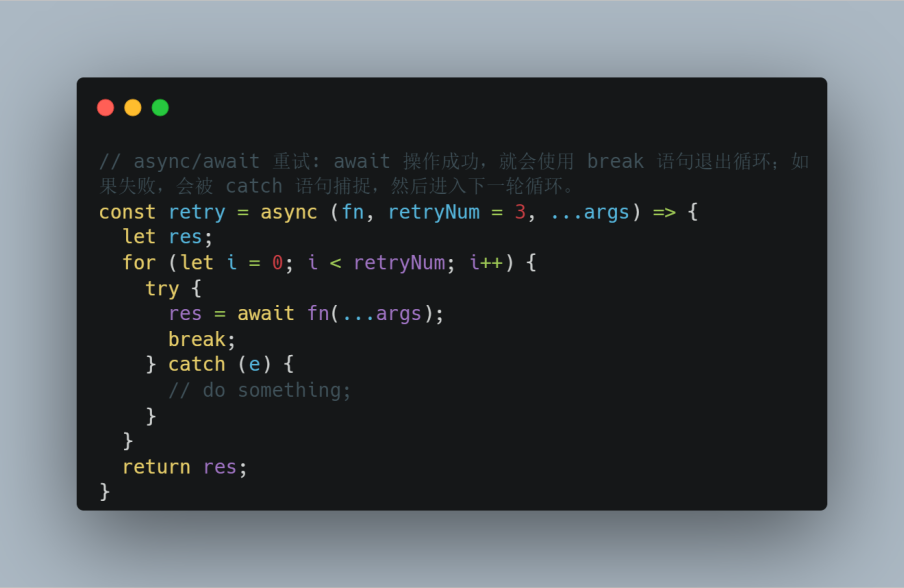

# JavaScript

## 关于JavaScript

JavaScript（JS）是单线程的、基于原型的、弱类型的、动态类型的、轻量的、支持面向对象/命令式/声明式编程的、头等函数的、多范式的、解释性（直译式或即时编译）的、也可在非浏览器环境下使用的动态脚本语言。JavaScript区分大小写。JavaScript 中，通过在运行时给空对象附加方法和属性来创建对象并且可以作为创建相似对象的原型。

浏览器JavaScript由三部分组成：核心ECMAScript 描述了该语言的语法和基本对象；DOM 描述了处理网页内容的方法和接口；BOM 描述了与浏览器进行交互的方法和接口。

JavaScript 的动态特性包括运行时构造对象、可变参数列表、函数变量、动态脚本执行（通过 eval）、对象内枚举（通过 for ... in）和源码恢复（JavaScript 程序可以将函数反编译回源代码）。

JavaScript® 是 Oracle 在美国和其他国家的商标或注册商标。

## 编译原理与编译过程

在代码执行之前会经历**词法分析**、**语法分析**和**代码生成**的编译阶段。

1. **词法分析**（**Lexing**）会将由字符组成的字符串分解成有意义的代码块即词法单元（Token）。
2. **语法分析**（**Parsing**）是将词法单元流转换成一个**由元素逐级嵌套所组成**的代表了程序语法结构的树即抽象语法树（AST，Abstract Syntax Tree）。
3. **代码生成**是将 AST 转换为可执行代码。

V8 的执行过程：


源代码经过 Parser 解析器，经过词法分析和语法分析生成 AST；AST经过 Ignition 解释器生成字节码并执行；在执行过程中，如果发现热点代码，将热点代码交给 TurboFan 编译器生成机器码并执行；如果热点代码不再满足要求，进行去优化处理即还原成字节码并把执行权交还给 Ignition 解释器。

## 执行上下文和作用域

JavaScript代码是运行在执行上下文中的，创建新执行上下文的方式有：
1. 全局执行上下文：为函数之外的任何代码创建的上下文。
2. 函数执行上下文：每个函数执行时创建的上下文。创建个数没有限制。
3. eval执行上下文：eval函数执行创建的上下文，不建议使用可忽略。

每一个上下文在本质上都是一种作用域层级，每个上下文创建的时候会被推入**执行上下文栈（Execution Context Stack，或者叫函数调用栈（Call Stack））**，栈顶是当前执行的上下文，执行完代码退出的时候从上下文栈中移除，栈底是全局执行上下文。（注意：JavaScript 中，以回调方式调用的函数，是否会形成类似于递归那样“一层套一层” 的调用链而存在堆栈溢出的风险，取决于父函数执行完毕之前是否再次调用 “父” 函数，比如 setTimeout、nextTick、promise.then/catch/finally、MutationObserver等是在任务队列中执行，再次调用“父”函数时，父函数已经执行完毕，即不存在堆栈溢出的危险）。

```javascript
function fun2() {
  console.log('fun2');
}
function fun1() {
  fun2();
}
fun1();
/**
 模拟：
 // fun1()
 ECStack.push(<fun1> functionContext);
 // fun1 中调用了 fun2, 所以还要创建 fun2 的执行上下文
 ECStack.push(<fun2> functionContext);
 // fun2 执行（创建作用域链 => 变量对象 => 执行代码）完毕
 ECStack.pop();
 // fun1 执行（创建作用域链 => 变量对象 => 执行代码）完毕
 ECStack.pop();
 */
```

**变量对象**（**Variable object，VO**）是与执行上下文相关的数据作用域，存储了在上下文中定义的变量和函数声明。**作用域即执行上下文，由多个作用域的变量对象构成的链表就叫做作用域链**。函数创建时，每个函数的`[[Scopes]]`**属性**在会保存所有父级作用域内的变量对象。

全局对象的通用变量名是通用名称 globalThis，特定环境名称分别是：
1. 浏览器——window；
2. Worker——WorkGlobalScope；
3. nodejs——global；

全局变量提供可在任何地方使用的变量和函数。默认情况下，这些全局变量内建于语言或环境中。

**执行上下文中的代码会分成两个阶段进行处理**：
1. **进入执行上下文**：
    1. 如果是函数执行上下文，会**复制**函数`[[scope]]`属性到函数执行上下文的 Scopes 属性来初始化作用域链。
    2. 然后创建变量对象：全局执行上下文的变量对象初始化是全局对象。函数执行上下文的变量对象初始化是只包含 Arguments 对象的对象。如果是函数执行上下文则首先给当前执行上下文的变量对象添加形参及初始值，否则先添加函数声明（函数表达式属于后面的变量声明）及初始值，再添加变量声明（带声明var/let/const关键字的）及初始值，完成后被激活为**活动对象（Activation Object，AO）**；因此，变量提升（Hosting）是JavaScript执行上下文工作方式，意味着变量和函数的声明在编译阶段即执行阶段之前被放入内存中，就好像声明处在作用域最前面。由执行上下文的两个处理阶段可知，函数声明提升（非函数表达式）优先于变量声明提升（var、let、const）；

    

    3. **如果是函数执行上下文，会将活动对象压入**函数执行上下文的Scopes属性即**作用域链顶端**。

    ```javascript
    function foo() {
      function bar() {
        // do something
      }
    }

    // foo 函数创建时
    foo.[[Scopes]] = [
      globalContext.VO
    ];

    bar.[[Scopes]] = [
      fooContext.AO,
      globalContext.VO
    ];

    // bar 函数执行上下文
    barContext = {
      AO: {
        arguments: []
      },
      Scope: [AO, fooContext.AO, globalContext.VO],
      this: undefined
    }
    ```

2. **代码执行**：
    1. 访问并修改活动对象的属性值。对于let 或 const 声明的变量，从一个代码块的开始直到代码执行到声明变量的行之前，变量都处于“暂时性死区”（Temporal dead zone，TDZ），尝试访问即使是typeof也将抛出 ReferenceError；只有当代码执行到声明变量所在的行时，才会对其进行初始化（若未赋值，则初始化为 undefined）。
    2. 执行完后将函数执行上下文从执行上下文栈中弹出。

**作用域即执行上下文，由多个作用域的变量对象构成的链表就叫做作用域链**。函数在执行前会复制该函数 `[[Scopes]]` 属性到函数执行上下文中创建作用域链。当访问一个变量时，解释器会首先在当前作用域的变量对象中查找标识符，如果没有找到，就去父作用域找，直到找到标识符，如果全局作用域也找不到就报错。**因此，一个变量或函数在整个作用域链都没有声明，那么在代码执行阶段就会报 ReferenceError 错**。

作用域共有两种主要的工作模式：词法作用域（静态作用域）和动态作用域。**JavaScript 采用词法作用域（Lexical Scope）**。词法作用域根据源代码中声明变量的位置来确定该变量在何处可用，而动态作用域 并不关心函数和作用域是如何声明以及在何处声明，它只关心它们从何处调用。


```javascript
const a = 2;
function foo() {
  console.log(a);
}

function bar() {
  const a = 3;
  foo();
}

bar();
// JS 是词法作用域，所以输出 2
// 假如是动态作用域则输出 3
```

**JavaScript的词法作用域**分为：
1. **全局作用域**：脚本模式运行所有代码的默认作用域。
2. **模块作用域**： 模块模式中运行代码的作用域。 Node 中顶级作用域不是全局作用域，而是当前模块作用域。
3. **函数作用域**：由函数创建的作用域。函数作用域指属于这个函数的全部变量都可以在整个函数的范围内访问。
使用 let（ES6）、const（ES6）声明的变量和Function 构造函数声明的函数属于额外的**块级作用域**（被限制在定义它的代码块内——块由一对大括号界定）。


## this

this是执行上下文的一个属性，在非严格模式下指向一个对象，严格模式下可以是任意值。
1. 在全局上下文（任何函数体外部）中，无论是否为严格模式，this指向全局对象。
2. 在函数上下文中，this的值取决于函数被调用的方式（运行时绑定，箭头函数除外），函数的调用方式包括：
    1. 方法调用模式即作为对象的属性被调用；
    2. 普通调用模式即普通的函数调用；
    3. 构造函数调用模式即使用 new；
    4. 间接调用模式即 call、apply 调用；

    默认情况即普通函数调用模式下，非严格模式中 this 指向globalThis，严格模式中指向undefined，因此this可以用来判断当前是否处于严格模式：

    ```javascript
    function isStrict() {
      return this === void 0;
    }
    ```

3. 在类（class，ES6）上下文中，**类中所有非静态的方法都会被添加到 this 的原型中**。子类的构造函数中没有初始的this绑定，需要调用super()才会生成this绑定，因此在调用super()之前访问this会报错。而且子类不能在调用 super() 之前创建实例返回，除非其构造函数返回的是一个对象，或者根本没有构造函数。类内部总是严格模式，调用一个 this 值为 undefined 的方法会抛出错误。
4. nodejs环境下的模块中，this指向module.exports。而浏览器环境下的模块中，顶级 this 是 undefined。
5. 当函数作为对象里的方法（包括getter、setter、原型链上的方法）、DOM事件处理函数、内联事件处理函数调用时，this 被设置为调用该函数的对象和元素。
6. 显示绑定函数的this方式：bind，call，apply，对箭头函数来说不能绑定 this即第一个参数会被忽略，只能传递参数。在非严格模式下使用 call 和 apply 更改函数的 this 绑定时，如果用作 this 的值不是对象，则会被尝试转换为对象：
    1. null 和 undefined 被转换为全局对象；
    2. 其他原始值会使用对应的构造函数转换为对象，比如 7 会被转换为 new Number(7)，'foo'会被转换为 new String('foo')；
    3. bind 函数会创建返回与原函数具有相同函数体和作用域的函数，新函数的 this 将被永久地绑定到首次 bind 的第一个参数，后续无论如何调用或更改绑定，this 不会变。
7. 箭头函数不会创建自己的this，它只会从自己的作用域链的上一层继承 this，**即箭头函数保持为创建时封闭词法作用域的this值（箭头函数不是封闭词法作用域）**。关于“ this”的严格模式区别规则在箭头函数中将被忽略。针对箭头函数判定this的简便方法：在箭头函数创建的位置将整个箭头函数替换为this，则箭头函数的this就是这个被替换的this，如果有多层箭头函数，则重复这个步骤。
8. Proxy 代理对象调用方法时，原对象内部的 this 指向其代理对象。handler 拦截函数内部的 this，指向的是 handler 对象本身。

**对象方法的链式调用通过该方法返回当前对象实现**。

## 内存管理与垃圾回收

### 内存管理

编程语言的内存生命周期均包括三部分：
1. 分配所需要的内存，JavaScript中发生在值的初始化和函数调用返回。
2. 使用分配到的内存（读、写）
3. 不需要时将其释放\归还，即垃圾回收（Garbage collection，GC），是计算机编程中用于描述查找和删除那些不再被其他对象引用的对象处理过程。

JavaScript 的内存管理是自动的、无形的。在内存管理的环境中，一个对象如果有访问另一个对象的权限（隐式或者显式），叫做一个对象引用另一个对象，“对象”的概念包括 JavaScript 对象和函数作用域（或者全局作用域）。特别注意，全局变量的生命周期直到浏览器卸载页面才会结束，也就是全局变量不会被当成垃圾变量回收。

### 垃圾回收

#### 引用计数法

最初级的**引用计数法**：将“对象是否不再需要”简化定义为“对象有没有其他对象引用到它”，因此如果没有引用指向该对象（零引用），对象将被垃圾回收机制回收。该方法存在循环引用的内存无法被回收的问题。

#### 标记清除法

**标记清除法**：将“对象是否不再需要”简化定义为“对象是否**可达**”。假定设置一个设置一个叫做根（root）的对象（在 Javascript 里，根是全局对象），如果一个值可以通过引用链从根访问，则认为该值是可达的。它相比引用计数法更好，因为“有零引用的对象”总是不可达，即使是循环引用。标记清楚算法缺陷是无法从根对象查询到的对象都将被清除。

```javascript
function marry(man, woman) {
  woman.husband = man;
  man.wife = woman;
  return {
    father: man,
    mother: woman
  }
}

// 1. 创建引用
let family = marry({
  name: 'John'
}, {
  name: 'Ann'
});

// 2. 移除两个引用
delete family.father;
delete family.mother.husband;

// 3. 移除外部引用
let family = null;
```


**栈内存**，ESP 指针下移（即上下文切换），栈顶的空间会自动被回收。

垃圾收集器进行分代收集（Generational collection）（按新生代和老生代收集）、增量收集（Incremental collection）（分多次收集）、闲时收集（在 CPU 空闲的时候）。

**堆内存**，分为**新生代内存**（临时分配的内存，存活时间短）和**老生代内存**（常驻内存，存活时间长）。


**新生代**的内存在 64 位和 32 位系统下默认限制分别为 32MB 和 16MB（存活时间短，操作更频繁，所以设置小）。

> V8 引擎会限制内存的使用（64 位最多只能分配 1.4GB，32 位最多只能分配 0.7GB），因为垃圾回收是非常耗时的操作，同时，回收过程会阻塞线程。以 1.5GB 的垃圾回收为例，V8 做一次小的垃圾回收需要 50ms 以上，做一次非增量式的垃圾回收甚至要 1s 以上。
> 手动调整老生代：node --max-old-space-size=2048 xxx.js；
> 手动调整新生代（一般不建议）：node --max-new-space-size=2048 xxx.js。

**新生代内存空间分为 From（正在使用的内存）和 To （目前闲置的内存）**。垃圾回收时使用 **Scavenge 算法**：检查From内存，将存活对象**从头放置的方式复制**到 To 内存（按理说复制的同时，From空间内存活对象的占用的内存应该释放掉），回收非存活对象，直到From内存空，From内存空间和To内存空间角色对调。由于**新生代**存储的是生命周期短的对象，对象较少，因此时间性能优秀，**算法缺点是新生代内存使用率不超过新生代内存的一半**。**为何不直接将非存活对象回收？一个对象的堆内存分配是连续的，直接回收非存活对象会容易产生不够后续对象使用的内存碎片，内存利用率低。**


**老生代内存**，被晋升（1. 已经经历过一次 Scavenge 回收 2. 回收后To（闲置）空间的内存占用超过25%）的对象会被放入到老生代内存中。老生代垃圾回收（不使用 Scavenge 算法，老生代空间大，考虑内存利用率和复制耗时），采用标记清除算法：
1. **标记-清除**，遍历老生代中所有对象并**做上标记**，仅**使用的变量**以及**被强引用**的变量**取消标记**。标记结束后**清除回收具有标记**的变量对象。其中标记采用**增量标记**（为避免垃圾回收耗时阻塞时间过长，即将标记任务分为很多小的部分，小部分完成就暂停一下，直到标记阶段完成，如此，阻塞时间减少到原来的1/6）；
2. **整理内存碎片**，清除阶段结束后把存活的对象全部往一端靠拢（移动对象，全过程最耗时操作）。


#### 内存泄漏

**堆栈溢出**：指没有足够的内存空间申请。

**内存泄漏**指申请的内存执行完后没有及时的清理或者销毁，占用空闲内存。当内存泄漏过多就会导致堆栈溢出。一般是堆内存溢出。

常见内存泄漏的原因：
1. 减少不正当的使用闭包，因为可能会造成内存泄漏

```javascript
function fn() {
  const test = new Array(1000).fill('');
  return function () {
    console.log(test);
    return test;
  }
}
let fnInner = fn();
fnInner();
/** fnInner() = null; // 置空外部引用 */
// More Tools -> Developer Tools -> Memory -> Allocation instrumentation on timeline 
```

2. 隐式的全局变量可能导致内存泄漏

```javascript
function fn() {
  'use strict' // 函数内使用严格模式避免泄漏
  // 没有声明的变量是隐式全局变量
  test1 = new Array(1000).fill('');
  // 函数内部 this 指向 window, test2 也是隐式全局变量
  this.test2 = new Array(1000).fill('');
}
// More Tools -> Developer Tools -> Performance/Memory， 一般先在 Performance 面板录制页面内存占用情况随时间变化的图像，对内存泄漏有个直观的判断，然后在 Memory 面板定位问题发生的位置
```
3. 游离的 DOM 引用

```html
<div id="root">
  <ul id="ul">
    <li></li>
    <li></li>
    <li id="li3"></li>
    <li></li>
  </ul>
</div>
<script>
  let root = document.querySelector('#root');
  let ul = document.querySelector('#ul');
  let li = document.querySelector('#li3');
  
  root.removeChild(ul);
  ul = null; // 虽然置空了 ul 变量，但由于 li 变量引用了 ul 的子节点，所以 ul 元素依然不能被垃圾回收

  li = null; // 已无变量引用，此时 ul 元素才可以垃圾回收

  // 通过堆快照（Heap Snapshot），调试路径 Memory -> Heap Snapshot -> Take Snapshot，堆快照可以直接显示是否游离的 DOM 节点，只要在顶部过滤框 filter 输入 detached，如果过滤出东西，说明存在游离的 DOM 节点
</script>
```
4. 未清除的定时器和 requestAnimationFrame

```javascript
let someResource = getData();
const timer = setInterval(() => {
  const node = document.getElementById('Node');;
  if (node) {
    node.innerHTML = JSON.stringify(someResource);
  }
}, 1000)
```
5. 组件卸载时未解除监听

```javascript
created() {
  eventBus.on('test', this.doSomething)
},
beforeDestroy() {
   // eventBus.off('test');
},
methods: {
  doSomething() {
    // do something
  }
}
```

6. 未清理的 console 输出：控制台会始终保持对 console 输出结果的引用，导致无法被垃圾回收

7. 遗忘的 Map、Set 对象：Map、Set 是强引用，即一个对象被强引用所引用时，那么这个对象就不会被垃圾回收，若要能够回收，需置空 Map 和 Set。而 WeakMap 和 WeakSet 是弱引用，即一个对象只被弱引用所引用，则被认为是不可访问（或弱可访问）的，因此可能在任何时刻被回收。

## 并发模型与事件循环

JavaScript 有一个基于**事件循环（Event Loop）**的并发模型，负责浏览器和Node中执行代码、收集和处理事件以及执行队列中的子任务，是用于**解决JavaScript单线程运行时可能会阻塞**的一种机制。

事件循环是一个在 JavaScript 引擎等待任务，执行任务和进入休眠状态等待更多任务的状态之间转换的无限循环。**Javascript 引擎大多数时候处于不执行任何操作即等待任务状态**，仅在脚本加载完成/事件触发时执行。

渲染和执行JS是互斥的，都在渲染主线程中进行。执行JS时永远不会进行渲染（render）。仅在执行完成后才会绘制对 DOM 的更改。如果一项任务执行花费的时间过长，浏览器将无法执行其他任务，例如处理用户事件或渲染。因此，在一定时间后，浏览器会抛出一个如“页面未响应”之类的警报来建议终止这个任务。这种情况常发生在有大量复杂的计算或导致死循环的程序错误时。

任务分为**宏任务（MacroTask或Task）**和**微任务（MicroTack）**，每个宏任务之后，JavaScript引擎会立即执行微任务队列中的所有任务，然后再执行其他的宏任务，或渲染，或进行其他任何操作。主动安排一个宏任务使用setTimeout/setInterval，主动安排一个微任务使用queueMicrotask。对于 v11.15.0+ 的Node表现和浏览器一致，执行完一个定时器任务立即执行微任务队列中的所有任务，而之前版本的Node在执行完定时器任务后先检查任务队列的队首是否定时器任务，是则保存微任务队列，优先执行该定时器任务，中途产生的微任务进入微任务队列，待定时器任务执行完再依次执行微任务队列。

```javascript
// 使用嵌套的 setTimeout 调用来拆分 cpu 过载任务
let i = 0;
let start = Date.now();
function count() {
  // 将调度（scheduling）移动到开头
  if (i < 1e9 - 1e6) {
    setTimeout(count); // 安排（schedule）新的调用
  }
  do {
    i += 1;
  } while (i % 1e6 !== 0);
  if (i === 1e9) {
    alert("Done in " + (Date.now() - start) + 'ms');
  }
}
count();
```

**宏任务**：script、setTimeout/setInterval（由计时线程计时，到期才放入队列中，且浏览器不会对同一个 setInterval 回调多次添加到任务队列，因此setInterval 的处理时长不能比设定的间隔长，否则 setInterval 将会没有间隔地重复执行）、setImmediate（Node.js）、I/O（Mouse Events、Keyboard Events、Network Events、文件读写）、UI Rendering（HTML Parsing）、MessageChannel等，多个宏任务形成宏任务队列。

```javascript
// 实际上很多地方都见过这种技术
setTimeout(function repeatMe() {
  // do something
  setTimeout(repeatMe, 15);
  // 执行完处理程序的内容后， 在末尾再间隔 15ms 来调用该程序，这样就能保证一定是15毫秒间隔的周期调用
}, 15);
```

**微任务**：promise.then/catch/finally 的回调、await下一行、process.nextTick（Node.js）、MutationObserver、垃圾回收过程、queueMicrotask的回调。其中调用 process.nextTick() 时传入的 callback 会被入队到nextTick callback queue。其余微任务的 callback 会被入队到microtask callback queue，且nextTick callback queue的优先级高于 microtask callback queue。

**浏览器事件（Event Loop）循环算法**：
1. 从宏任务队列中出队（dequeue）并执行最早的任务（例如script）。
2. 依次执行当前微任务队列的所有任务。
3. 如果有变更，则将变更渲染出来。
4. 如果宏任务队列为空，则休眠直到出现宏任务。
5. 转到步骤1。


**Node.js事件循环算法**：


每个阶段都会有一个 callback queue 与之相对应。Event Loop会遍历这个 callback queue，执行里面的每一个callback。直到 callback queue 为空或者当前callback的执行数量超过了某个阈值为止，Event Loop才会移步到下一个阶段。事件循环示意图：


> nodejs 事件循环涉及的队列:
> timer callback queue
> I/O callback queue
> immediate callback queue
> close callback queue
> nexTick callback queue
> microtask callback queue

1. **timer 阶段**：此阶段执行 timer callback queue中的任务，调用 setTimeout 或者 setInterval 方法时传入的 callback 会在指定的延迟时间后入队到 timer callback queue。调用时候传入的延迟时间并不是回调确切执行的时间，会受到操作系统调度层面和其他callback函数调用耗时的影响，timer callback函数的执行只会比预定的时间晚。
2. **pending callbacks 阶段**：执行上一次循环延迟到下一次循环迭代的I/O回调，可能是系统操作的回调，如TCP错误的类型。
3. **idle、prepare 阶段**：只在node内部使用，不必理会。
4. **poll 阶段**：timer callback queue为空进入poll阶段，会计算应该为I/O进行阻塞和轮询的时长，然后处理I/O callback queue中的事件（几乎所有回调，比如**文件读写、网络请求等**，除了 close callback 、定时器调度的 callback 和 setImmediate）。若I/O callback queue非空则依次执行；若I/O callback queue为空且存在setImmdiate回调，直接进入check阶段，否则阻塞轮询到超时后进入自动check阶段。
5. **check 阶段**：I/O callback queue队列为空时，会立即进入该阶段，**执行immediate callback queue**。
6. **close callbacks 阶段**：比如socket被突然关闭（如socket.destroy()），"close "事件将在这个阶段被发出。否则，它将通过process.nextTick()发出。此阶段执行close callbacks queue 的任务。


### 阐述⼀下 JS 的事件循环?

事件循环，是浏览器渲染主线程的工作⽅式，是异步的实现方式。

在 Chrome 的源码中，它开启⼀个不会结束的 for 循环，每次循环从消息队列中取出第⼀个任务执⾏，⽽其他所有线程（包括其他进程的线程、计时线程）只需要在合适的时候将任务加⼊到队列末尾即可。任务本身没有优先级，在队列中先进行出，不同的队列有优先级。过去把任务队列简单分为宏队列和微队列，目前已无法满足复杂的浏览器环境，而是更加灵活多变的处理方式，根据 W3C 最新的解释：每个任务有不同的类型，同类型的任务必须在同⼀个队列，不同类型的任务可以属于同一队列。不同任务队列有不同的优先级，在⼀次事件循环中，由浏览器自⾏决定取哪⼀个队列的任务。但浏览器必须有⼀个**微队列**，微队列的任务⼀定具有最高的优先级，必须优先所有其他任务执⾏。在目前 chrome 的实现中，至少还包括优先级「中」的延时队列和优先级「⾼」的交互队列，分别用于存放计时器到达后的回调任务，和用于存放用户操作后产生的事件处理任务。

### 如何理解 JS 的异步？

JS是⼀⻔单线程的语⾔，这是因为它运⾏在浏览器的渲染主线程中，⽽渲染主线程只有⼀个。⽽渲染主线程承担着诸多的⼯作，渲染⻚⾯、执⾏ JS 都在其中运⾏。如果使用同步的⽅式，就极有可能导致主线程产⽣阻塞，从⽽导致消息队列中的很多其他任务⽆法得到执⾏。这样⼀来，⼀⽅⾯会导致繁忙的主线程⽩⽩的消耗时间，另⼀⽅⾯导致⻚⾯⽆法及时更新，给⽤户造成卡死现象。所以浏览器采⽤异步的⽅式来避免。具体做法是当某些任务发⽣时，⽐如计时器、⽹络、事件监听，主线程将任务交给其他线程去处理，⾃身⽴即结束任务的执⾏，转⽽执⾏后续代码。当其他线程完成时，将事先传递的回调函数包装成任务，加⼊到消息队列的末尾排队，等待主线程调度执⾏。在这种异步模式下，浏览器永不阻塞，从⽽最⼤限度的保证了单线程的流畅运⾏。单线程是异步产生的原因。

### JS 中的计时器能做到精确计时吗？

不⾏，因为：
1. 计算机硬件没有原子钟，⽆法做到精确计时；
2. 操作系统的计时函数本身就有少量偏差，由于 JS 的计时器最终调用的是操作系统的函数，也就携带了这些偏差；
3. 按照 W3C 的标准，浏览器实现计时器时，如果嵌套层级 >= 5 层，则会带有 4 毫秒的最少时间，这样在计时时间少于 4 毫秒时⼜带来了偏差；
4. 受事件循环的影响，计时器的回调函数只能在主线程空闲时运行，因此⼜带来了偏差。

## 函数相关

在 JavaScript 中，函数是头等对象，因为它们可以像任何其他对象一样具有属性和方法。它们与其他对象的区别在于函数可以被调用。每个JavaScript函数实际上都是一个 Function 对象（运行 (function(){}).constructor === Function 为true），函数调用的默认返回值为undefined。

### 函数创建

创建函数的方式包括函数声明、函数表达式（包括立即执行函数表达式）、箭头函数表达式（参考3.7.9箭头函数）、Function构造函数（参考3.7.8 闭包首图）、函数生成器表达式、函数生成器声明、GeneratorFunction构造函数（与Function构造函数类似，字符串作为函数体会阻止一些JS引擎优化和存在安全问题）。

**函数声明**：


**函数表达式**：


**函数生成器声明**（生成器实现机制（即如何让函数暂停和恢复）是**协程**，一个线程可以存在多个协程（函数可以看做一个协程），**协程被程序自定义所控制，而不受操作系统的管理**，并不会像线程切换那样消耗资源。**单个线程同一时刻只能一个协程（即获得线程控制权）运行）**：


**函数生成器表达式声明**：


### 函数参数

调用函数时，传递给函数的值被称为函数的**实参（值传递，即“原始值”传递的是值的拷贝，“引用值”传递的是指向引用对象的地址）**，对应位置的函数参数名叫作形参。函数的参数默认是undefined。严格模式下不允许出现同名参数。

**默认参数（ES6）**允许在没有值或undefined被传入时使用默认形参。前面的参数可用于后面的默认参数被访问，但前面的默认参数表达式不能访问后面的（包括函数体内），可以叫做默认参数的暂时性死区（TDZ）。默认参数的位置不存在限制，但建议放在所有非默认参数后面。默认参数支持解构赋值（参考解构赋值）。

**剩余参数（ES6）**允许将一个不定数量的参数表示为一个真数组。


JavaScript 函数不能像传统意义上那样实现重载。而在其他语言中，可以为一个函数编写两个定义，只要这两个定义的签名（接受的参数的类型和数量）不同即可。
JavaScript 函数没有签名，因为其参数是由包含零个或多个值的数组来表示的。而没有函数签名，真正的重载是不可能做到的。只能通过检查传入函数中参数的类型和数量（实现方式有arguments或剩余参数）并作出不同的反应，来模仿方法的重载。

### arguments

arguments对象是所有（非箭头）函数中都可用的局部变量， 是一个对应于传递给函数的参数即实参的类数组对象，实现有Symbol.iterator方法，是一个可迭代对象。“类数组”意味着 arguments 有length属性并且属性的索引是从零开始的，但是它没有 Array的内置方法。将arguments转化为真数组的方式：


调用函数的实参个数为零时，形参的值与arguments对象的值互不影响。在严格模式下，无论剩余参数、默认参数和解构赋值参数是否存在，arguments对象和参数的值均互相不影响。而非严格模式中，函数没有（有）包含剩余参数、默认参数和解构赋值，那么arguments对象中的值和参数的值互相（不）影响。

arguments.callee属性表示当前正在执行的函数。 在严格模式下，第 5 版 ES5禁止使用 arguments.callee()。当一个函数必须调用自身的时候，避免使用 arguments.callee()，通过要么给函数表达式一个名字，要么使用一个函数声明。
arguments.callee.caller 返回调用指定函数所处的函数。无论是否作为对象方法调用，如果一个函数 f 是在全局作用域内被调用的，则为 null。相反，如果一个函数是在另外一个函数作用域内被调用的，则指向调用它的那个函数。
arguments.length 本次函数调用时传入函数的实参数量。

### Function原型属性与方法

Function([arg0, ... , argN, ]functionBody) 构造函数创建了一个新的 Function 对象，**Function构造函数的隐式原型（`__proto__`）指向Function.prototype**。直接调用构造函数可以动态创建函数，但可能会经受一些安全和类似于 eval()（但远不重要）的性能问题。使用 Function 构造函数创建的 Function 对象会在函数创建时完成解析。这比用函数表达式或函数声明创建一个函数并在代码中调用它的效率要低，因为使用表达式或声明创建的函数会和其他的代码一起被解析。然而，不像 eval（可能访问到本地作用域），Function 构造函数只创建全局执行的函数。调用 Function() 时可以使用或不使用 new。两者都会创建一个新的 Function 实例：	
1. argN：被函数用作形参的名称。每一个必须是字符串，对应于一个有效的 JavaScript 参数（任何一个普通的标识符、剩余参数或解构参数，可选择使用默认参数），或用逗号分隔的此类字符串的列表。由于参数的解析方式与函数表达式的解析方式相同，所以接受空白和注释。
2. functionBody：一个包含构成函数定义的 JavaScript 语句的字符串。

Function.prototype.displayName 属性获取函数的显示名称，默认是没有设置的，可以赋值，但该特性是非标准的，请尽量不要在生产环境中使用它。

Function.prototype.prototype 属性是使用new运算符调用构造函数时，构造函数的 prototype 属性将成为新对象的原型。默认情况下，构造函数的 prototype 是一个普通的对象。这个对象具有一个属性：constructor，它是对构造函数本身的一个引用，constructor 属性是可编辑、可配置但不可枚举的。如果prototype 被赋予了 Object 以外的值，则当它被 new 运算符调用时，返回对象的原型将会指向Object.prototype(换句话说，new 运算符会忽略它的prototype属性并构造一个普通对象)。Function.prototype.bind返回的绑定函数不具有 prototype 属性，但是可以作为构造函数。而异步函数，箭头函数没有prototype属性，不能成为构造函数，即便手动添加prototype属性。生成器函数、Symbol、BigInt有prototype 属性，但它不能作为构造函数。


**Function.prototype.apply调用一个具有给定 this 值的函数，以及以一个数组（或一个类数组对象）的形式提供的参数。apply可以用来针对只接受参数列表的函数调用时避免循环，或者直接使用展开语法（...）**。


**Function.prototype.call方法使用一个指定的 this 值和单独给出的参数列表来调用一个函数。语法与apply几乎相同，但根本区别在于，call接受一个参数列表，而 apply 接受一个为数组或类数组对象的参数**。


**Function.prototype.bind方法创建一个新的函数，并拥有指定的 this 值和初始实参，即该函数在调用时，会将 this 设置为bind提供的 thisArg，而新参数会接续在bind中传递的参数列表之后。如果使用 new 运算符构造该函数，则会忽略thisArg**。

Function.prototype.toString方法返回一个表示当前函数源代码的字符串，而且得到的源代码时准确的，注释、空格也是包括在内的，该方法覆盖 Object.prototype.toString方法。在 Function 需要表示为字符串时，JavaScript 会自动调用函数的 toString 方法（比如函数与一个字符串进行拼接或包装在模板字符串中）。若调用的this不是Function对象，则 toString() 方法将抛出 TypeError。如果是在内置函数或由 Function.prototype.bind 返回的函数上调用 toString()，则toString() 返回原生代码字符串（"function someName() { [native code] }"），其中someName是实现定义的名称或函数的初始名称。对原生函数的字符串调用 eval() 将始终产生语法错误。若是在由 Function 构造函数生成的函数上调用 toString()，则 toString() 返回创建后的函数源码，包括形参和函数体，函数名为“anonymous”。

**实现apply**：


**实现call**：


**实现bind**：


### getter & setter

get 语法将对象属性绑定到查询该属性时将被调用的函数。set语法将对象属性绑定到要设置属性时将被调用的函数。getter 和 setter 通常用于创建和操作一个伪属性。可以使用delete操作符移除getter和 setter创建的伪属性。getter 或setter可以用Object.defineProperty添加到现有对象上。在 Classes中使用时，get和set关键字语法是定义在原型上的，Object.defineProperty是定义在实例自身上。


getter设置的伪属性在访问它们之前不会计算属性的值，能延迟计算值的成本。当属性值的计算是昂贵的（占用大量 RAM 或 CPU 时间，产生工作线程，检索远程文件等）、或者现在不需要该值而是在稍后甚至某些情况根本不使用、或者多次访问值不改变也就不需要被重新计算时，可用智能（或称记忆化）getters延迟属性值的计算并将其缓存返回缓存值以备以后访问而不需要重新计算。示例：


### 异步函数（async）

异步（async）函数是在普通函数前添加async关键字声明的函数，它是 AsyncFunction 构造函数的实例，并且在且仅在其中允许使用 await 关键字，async/await 的行为就好像搭配使用了生成器和 promise，避开链式调用Promise。使用 async/await 关键字，可通过同步的方式书写异步代码。


async 函数可能包含 0 个或者多个 await 表达式，从第一行代码直到（并包括）第一个 await 表达式（如果有的话）都是同步运行的，因此一个不含 await 表达式的 async 函数是会同步运行的，然而，如果函数体内有一个 await 表达式，async 函数就一定会异步执行。await 表达式会暂停整个 async 函数的执行进程并出让其控制权，只有当其await的基于 promise 的异步操作被兑现或被拒绝之后才会恢复进程。promise 的resolve值会被当作该 await 表达式的返回值。


在await 表达式之后的代码可以被认为是存在在链式调用的 then 回调中，多个 await 表达式都将加入链式调用的 then 回调中，返回值将作为最后一个 then 回调的返回值。任何一个 await 语句后面的 Promise 对象变为 rejected 状态，如果该promise没加catch捕获，或使用try/catch捕获，那么整个 async 函数都会中断执行，并通过隐式返回 Promise 将错误传递给调用者。

**优雅的try/catch处理 async /await错误**：


async函数返回一个async 函数成功返回的值被 resolve 或 async 函数中抛出的（或其中没有被捕获到的）异常被reject的Promise，即使async函数return看起来不是Promise，也会隐式的被Promise.resolve包装。

return await Promise和 return Promise 区别在于前者返回的是解决后的返回值的Promise，后者返回的是该Promise是异步的，是不能使用try/catch捕获的，await Promise 才可以。

**async/await重试逻辑实现**：



**async/await 实现原理**：


**async/await应用场景**：


### new操作符

new 运算符创建一个用户定义的对象类型的实例或具有构造函数的内置对象的实例。new可以看做下列操作的语法糖：
1. 创建一个新对象，使用构造函数的原型来作为新创建对象的原型（prototype）
2. 将新对象作为this调用构造函数（apply） 
3. 如果构造函数没有返回对象（即返回的是非引用类型），则返回this，否则返回构造函数返回的对象。

对于普通对象，无论性能上还是可读性，**更推荐使用字面量的方式创建对象**。（否则new涉及到可能通过原型链一层层查找到Object）。

**实现new**：


new.target 属性允许你检测函数或构造方法是否是通过new运算符被调用的。在通过new运算符被初始化的函数或构造方法中，new.target返回一个指向构造方法或函数的引用。在普通的函数调用中，new.target 的值是undefined。

**new的优先级？**

new相关的部分优先级从高（20）变低：


带参数列表的new即new Foo()的优先级、函数调用以及成员访问同级，且大于无参数列表的new的优先级new Foo，虽然new Foo()等同于new Foo。

### 闭包

闭包（closure）是将一个函数与对其周围状态（词法环境）的引用捆绑在一起（封闭）的组合。**闭包产生的本质是当前函数存在对父级作用域的引用，因此JavaScript 中的所有函数都是闭包的（new Function例外）**。


被引用的变量即自由变量（当前函数作用域未声明而访问的变量，不包括函数参数arguements）。闭包也可以捕获块作用域和模块作用域中的变量。


**闭包应用场景**：


**循环中的闭包问题？**


如果不是某些特定任务需要使用闭包，在其它函数中创建函数是不明智的，因为闭包在处理速度和内存消耗方面对脚本性能具有负面影响。在创建新的对象或者类时，方法通常应该关联于对象的原型，而不是定义到对象的构造器中。原因是这将导致每次构造器被调用时，方法都会被重新赋值一次。


理论上当函数可达时，它外部的所有变量也都将存在。但在实际中，JavaScript 引擎会试图优化它：分析变量的使用情况，如果从代码中可以明显看出有未使用的外部变量，那么就会将其删除。在 V8（Chrome，Edge，Opera）中的一个重要的副作用是，此类变量在调试中将不可用。


### 箭头函数（ES6）

**引入箭头函数有两个方面的作用：更简短的函数并且运行时不绑定this**。


**箭头函数保持为创建时封闭词法作用域的this或arguments值（箭头函数不是封闭词法作用域）。箭头函数内没有自己的this（所以从上层作用域去找）， arguments（所以从上层作用域去找），super，new.target，prototype**。箭头函数不能用作构造函数（会报TypeError错）。yield关键字不能在箭头函数中使用即不能作为 Generator 函数。箭头函数在参数和箭头之间不能换行。


### 构造函数

生成器函数，Math，JSON，Symbol，Reflect，Atomics，BigInt不能作为构造函数，也就不能使用new运算符。

### 惰性函数

惰性函数表示函数执行的分支只会在函数第一次调用的时候执行，在第一次调用过程中，该函数会被覆盖为另一个按照合适方式执行的函数，这样任何对原函数的调用就不用再经过执行的分支了。常见的检测浏览器支持情况选择为 DOM 节点添加事件监听的函数：


### 级联函数

级联函数也叫链式函数，是一种在一个对象上使用一条连续的代码来重复调用不同方法的技巧。一定程度上可以减少代码量，提高代码可读性，缺点是它占用了函数的返回值。比如字符串方法，jQuery方法。要使用级联函数，我们只需要在每个函数中返回 this 对象（也就是后面方法中操作的对象）。操作的对象就会在执行完一个函数后继续调用往后的方法，即实现了链式操作。


### 高阶函数

高阶函数指操作函数的函数，一般地，有以下两种情况：
1. **函数作为参数被传递**：把函数当作参数传递，代表可以抽离出一部分容易变化的业务逻辑，把这部分业务逻辑放在函数参数中，这样一来可以分离业务代码中变化与不变的部分。比如回调函数，包括Ajax，事件监听，数组排序方法sort等
2. **函数作为返回值输出**。比如偏函数（Partial），返回了一个包含预处理参数的新函数，以便后续逻辑可以调用。在计算机科学中，Partial应是指将部分参数固定，从而产生一个新的较小元（元即参数的个数）的函数。偏函数是把一个 n 元函数转换成一个 n - x 元函数，比如Function.prototype.bind。


**AOP 即面向切面编程**，它的主要作用是 把一些跟核心业务逻辑模块无关的功能抽离出来，这些跟业务逻辑无关的功能通常包括日志统计、安全控制、异常处理等。把这些功能抽离出来之后，再通过**动态植入**的方式掺入业务逻辑模块中。这样做的好处首先是可以保持业务逻辑模块的纯净和高内聚性，其次是可以很方便地复用日志统计等功能模块。通常，在 JavaScript 中实现 AOP，都是指把一个函数**动态植入**到另外一个函数之中。


或者通过扩展 Function.prototype 来实现：


### 函数柯里化与反柯里化

**柯里化**（Currying）是把接受多个参数的函数变换成接受一个单一参数（最初函数的第一个参数）的函数，并且返回接受余下的参数而且返回结果的新函数的技术。柯里化是利用闭包的特性实现的。完全柯里化指的是将函数变换成每次只接受一个参数的新函数，直到参数个数等于原函数即返回结果，即柯里化应该将 sum(a, b, c) 转换为 sum(a)(b)(c)。而JavaScript 中大多数的柯里化实现都是高级版的，即使得函数被多参数变体调用。


**柯里化的优点**：
1. 参数复用（返回的函数可复用前面的参数）； 
2. 延迟执行（返回函数）；
3. 提前返回（提前做判断，返回指定需求的函数）。

**柯里化的缺点**：
1. 闭包和嵌套作用域带来的性能损耗；
2. apply与call等显然比直接调用慢。

**柯里化的实现**：


**以上的柯里化实现要求原函数具有固定数量的形参**，如果是使用剩余参数的函数，例如 f(...args)，不能以这种方式进行柯里化。

柯里化是为了缩小适用范围，创建一个针对性更强的函数；**反柯里化**则是扩大适用范围，创建一个应用范围更广的函数。


### 函数记忆与睡眠

**函数记忆**指将上次的（计算结果）缓存起来，当下次调用时，如果遇到相同的（参数），就直接返回（缓存中的数据）。实现原理是将参数和对应的结果保存在对象中，再次调用时，判断对象 key 是否存在，存在返回缓存的值。

<<< ../../../../src/函数相关/函数记忆与睡眠/index.js#docs1

**函数睡眠**，在 JavaScript 中是一个伪命题，因为 JavaScript  引擎线程无法挂起，只能通过异步实现类似 sleep 的效果。

<<< ../../../../src/函数相关/函数记忆与睡眠/index.js#docs2

### 函数防抖（debounce）

**防抖**，即**短时间内大量触发同一事件，只会执行一次函数，实现原理为设置一个定时器，约定在 xx 毫秒后再触发事件处理，每次触发事件都会重新设置计时器，直到 xx 毫秒内无第二次操作（类似于生活中的电梯关门）**，防抖常用于**搜索框/滚动条的监听事件处理**，如果不做防抖，每输入一个字/滚动屏幕，都会触发事件处理，造成性能浪费。

<<< ../../../../src/函数相关/函数防抖/debounce.ts#docs

使用函数防抖的三个条件：
1. 频繁调用某个函数；
2. 造成效率问题；
3. 需要的结果以最后一次调用为准。

### 函数节流（throttle）

**节流是间隔执行**，规定一个单位时间，在这个单位时间内，只能有一次触发事件的回调函数执行，如果在同一个单位时间内某事件被触发多次，只有一次能生效。**实现原理为设置一个定时器，约定xx毫秒后执行事件，如果时间到了，那么执行函数并重置定时器**。**和防抖的区别在于**，防抖每次触发事件即重置定时器，而节流在定时器到时间后再清空定时器。

<<< ../../../../src/函数相关/函数节流/throttle.js#docs

场景：适合当量事件按事件做平均分配触发
1. 动画场景：避免短时间多次触发动画引起性能问题。
2. 拖拽场景：固定时间内只执行一次，防止超高频次触发位置变动（mousemove）。
3. 缩放场景：监控浏览器窗口大小（resize）。
4. 滚轮场景：鼠标滚轮事件（wheel）。
5. Canvas 画笔功能。

### 函数管道与组合

函数组合是一种将简单函数组合起来构建更复杂函数的行为或机制，函数组合对传入的多个简单函数从右到左执行，函数管道则刚好相反。

<<< ../../../../src/函数相关/函数管道与组合/index.js#docs

## 浏览器事件相关

在 Web 中，事件在浏览器窗口中被触发并且通常被绑定到窗口内部的特定部分 — 可能是一个元素、一系列元素、document或者是window。每个可用的事件可设置事件处理器（或事件监听器），监听事件的发生，也就是事件触发时会运行的代码块。

实际上，JavaScript 网页上的事件机制不同于在其他环境中的事件机制。Nodejs中事件模型（nodejs event model）依赖定期监听事件的监听器和定期处理事件的处理器，比如使用on方法注册一个事件监听器，使用once方法注册一个在运行一次之后注销的监听器。浏览器插件（WebExtensions）的事件模型和网站的事件模型相似，唯一不同在于事件监听属性是小驼峰的且需要紧接着addListener。（比如browser.runtime.onMessage.addListener）。网络事件不是 JavaScript 语言的核心——它们被定义成内置于浏览器的 JavaScript APIs。

事件分为通用事件（比如几乎所有元素的onclick）和专门事件（video才有的onplay）。每个事件都使用继承自 Event 接口的对象来表示，可以包括额外的自定义成员属性及函数，以获取事件发生时相关的更多信息。

Event 接口表示在 DOM 中出现的事件。触发方式有
1. 用户触发，比如鼠标、键盘事件。
2. API生成，比如动画运行结束。
3. 脚本触发，比如对元素调用HTMLElement.click或使用Even接口定义一些自定义事件，再使用 EventTarget.dispatchEvent方法将自定义事件派发往指定的目标（EventTarget）或直接使用EventTarget.dispatchEvent触发原生事件。和经由浏览器触发，并通过事件循环异步调用事件处理程序的“原生”事件不同，dispatchEvent() 会同步调用事件处理函数。在 dispatchEvent() 返回之前，所有监听该事件的事件处理程序将在代码继续前执行并返回。要向事件对象添加更多数据，可以使用 CustomEvent 接口，detail 属性可用于传递自定义数据。

事件处理函数内部，**事件对象**被自动以第一个参数传递给事件处理函数，以提供额外的功能和信息。大多数事件处理器的事件对象都有可用的标准属性和函数（方法），更高级的事件处理器的事件对象会添加一些专业属性，这些属性包含它们需要运行的额外数据。例如，媒体记录器 API 有一个 dataavailable 事件，它会在录制一些音频或视频时触发，并且可以用来保存它，或者回放。对应的ondataavailable处理程序的事件对象有一个可用的数据属性。

在事件处理程序内部，对象 this 始终等于 Event.currentTarget 的值且等于注册事件的对象，Event.target 则是对最初派发事件的目标的引用。

只读属性Event.isTrusted 表示当事件是由用户行为生成的时候，这个属性的值为 true ，而当事件是由脚本创建、修改、通过 EventTarget.dispatchEvent() 派发的时候，这个属性的值为 false 。

Event() 构造函数：


最开始，使用**事件处理程序 HTML 属性（内联事件处理程序）**，会混用 HTML 和 JavaScript，而且没有直接移除事件的方式，不推荐使用，因为这样文档很难解析且不好维护。

DOM0级事件通过**事件处理程序属性**添加事件监听器，不允许给同一个监听器注册多个处理器，任何后面设置的都会尝试覆盖之前的，但具有更好的跨浏览器兼容性（IE8+）。

DOM 2级事件可以使用addEventListener添加事件处理程序，而且如果有需要，可以向同一类型的元素添加多个事件处理器，同时可以使用removeEventListener()移除某个事件处理程序，但需要保证 type, listener，capture/useCapture和addEventListener的相同。

过去 Netscape（网景）只使用事件捕获，而 Internet Explorer 只使用事件冒泡。DOM 2级事件规定的事件流（也叫事件传播）包括三个阶段，Event.eventPhase表示事件流当前处于哪一个阶段：


1. **事件捕获阶段（Capture Phase）**：事件对象，从Window开始，然后Document, 然后是HTMLHtmlElement，直到目标元素的父元素，这个过程中通过addEventListener 注册为捕获模式（第三个参数为true）的事件处理程序会被调用。Event.eventPhase 为 1。
2. **处于目标阶段（Target Phase）**：执行顺序会按照 addEventListener 的添加顺序决定，现添加先执行。Event.eventPhase为2。如果该事件只读属性的Event.bubbles为false，则不会进入冒泡阶段。如果多个事件监听器被附加到相同元素的相同事件类型上，会按其被添加的顺序被调用，如果如果在其中一个事件处理函数中执行Event. stopImmediatePropagation ，那么剩下的事件监听器都不会被调用。
3. **事件冒泡阶段（Bubbling Phase）**：事件对象从父亲元素开始逆向向上传播回目标元素的祖先元素并最终到达包含元素 Window。这个过程中通过addEventListener 注册为冒泡模式（第三个参数为false）的事件处理程序会被调用。Event.eventPhase为3。可以通过在事件处理程序return之前设置Event.cancelBubble为true或调用Event.stopPropagation方法阻止事件冒泡。

调用方法Event.preventDefault或设置属性Event.returnValue为true来阻止事件的默认行为，比如阻止表单默认提交行为。为一个不支持取消即只读属性的Event.bubbles为true的事件调用preventDefault将没有效果。

**事件委托**依赖于**事件冒泡**，如果想要在大量子元素中单击任何一个都可以运行一段代码，可以将事件监听器设置在其父节点上，并让子节点上发生的事件冒泡到父节点上，而不是每个子节点单独设置事件监听器。

## 数据类型相关

数据类型分为基本数据类型（原始值）和引用数据类型。

### 基本数据类型

**基本类型**：存储在栈中的简单数据段。值直接存储在变量访问的位置（栈空间），因为原始值占据的空间是固定的，所以可存储在较小的内存区域 – 栈中，便于迅速查寻变量的值。**变量赋值时**，将原始值的副本赋值给新变量，两个变量完全独立，只是拥有相同的 value。

JavaScript 中存在 7 种基本数据类型（原始值）：boolean、bigInt（ES10）、null、undefined、number、string、symbol （ ES6——表示独一无二的值），其中undefined、 null  和 number **字面量**是没有属性和方法的（直接调用方法1.toString()会失败，通过let a = 1;a.toString()却可以成功），或者字符串字面量可以直接调用方法（**隐式创建包装器对象**）。

### 引用数据类型

**引用类型**：存储在堆（heap）中。存储在变量处的值是一个指针（point），指向存储堆中对象的内存地址。因为引用值（堆中对象）的大小会改变，放在栈中会降低变量查寻的速度。相反，放在变量的栈空间中的值是该对象存储在堆空间中对应的地址。地址的大小是固定的，所以把它存储在栈中对变量性能无任何负面影响。**变量赋值时**，把存储在栈空间的内存地址赋值给新变量，即两个变量都**指向堆内存中的同一个对象**，任何一个**变量的属性**作出的改变都会反映在另一个身上。**复制不会产生新的堆内存消耗**。
除基本类型外都是对象类型（Object）—引用类型，包括Object（父对象）、Array（数组对象）、RegExp（正则对象）、Date（日期对象）、Math（数学函数）、Function（函数对象）、Error（错误对象）、Arguments（类数组对象）、自定义对象等.

### 类型检测与转换

**类型检测**的方法有，typeof、instanceof、Object.prototype.toString、constructor。

**typeof 运算符**返回一个字符串，表示操作数的类型。基本数据类型除null返回object，都正确，引用类型除函数对象返回Function,其余均返回Object。因为在 JavaScript 最初的实现中，在 JavaScript 第一个版本中，所有值都存储在 32 位的单元中，每个单元包含一个小的类型标签(1-3 bits) 以及当前要存储值的真实数据。对象的类型标签是 0。由于 null 代表的是空指针（大多数平台下值为 0x00），因此，null 的类型标签是 0，typeof null 也因此返回 "object"。对于声明未初始化和未声明的变量，typeof都会返回undefined，但不能在let或const的暂存性死区内使用，会抛出ReferenceError。适合检测非null的基本数据类型和引用数据类型中的function。typeof 运算符的优先级高于加法（+）等二进制运算符。


**instanceof 运算符**用于检测构造函数的 prototype 属性是否出现在某个实例对象的原型链上。instanceof的检测结果不一定正确，构造函数的 prototype 属性对象可能被修改，实例对象的__proto__也可能被修改。多个窗口意味着多个全局环境，不同的全局环境拥有不同的全局对象，从而拥有不同的内置类型构造函数，比如 [] instanceof window.frames[0].Array 会返回false。Symbol.hasInstance用于自定义判断某对象是否为某构造器的实例时应该调用的方法，即使用 instanceof时会调用到该方法。


**Object.prototype.toString.call(value)**返回"[object Type]"，Type 是value的类型。如果value有 Symbol.toStringTag 属性，其值是一个字符串，则它的值将被用作 Type。可以通过定义 Symbol.toStringTag 属性来更改 Object.prototype.toString.call() 的行为，因此也会被篡改。

**value.constructor属性**获取value的构造函数的原型对象上的constructor属性，该属性实际上是原型对象的constructor属性，也因此如果原型对象被修改，就不能用来判断类型了。

**实现获取一个值的类型的函数**：


**JavaScript中存在的类型转换规则**：
1. **转换为布尔值（ToBoolean）**：除falsy值（false、-0、+0、0n、null、undefined、NaN、""、 ''、 ``）转换为 false，其余均转换为true。
2. **转换为数字（To Number）**：
    1. **基本数据类型**：
        1. null 转换为 0；
        2. 空字符串，以及空格、制表符、换行符的各种组合，转化为0，忽略前导和尾随空格/行终止符的字符串有效纯数字转换为数字，其余按失败处理转化为NaN；+ 和 - 允许且只能出现一次且不得后跟空格在字符串的开头指示其符号。
        3. undefined 转换为 NaN
        4. true 转换为 1，false转换为 0；
        5. BigInt 抛出 TypeError，以防止意外的强制隐式转换损失精度。
        6.Symbol 抛出 TypeError。
    2. **引用数据类型**：先转换为基本数据类型（ToPrimitive），再按基本数据类型处理。
3. **转换为字符串**：
    1. 基本数据类型：
        1. null 转换为 'null'；
        2. undefined转为 "undefined"；
        3. true 转为 "true"，false 转为 "false"；
        4. Number类型转为数字的字符串形式，极小和极大的数字会使用指数形式；
    2. **引用数据类型**：先转换为基本数据类型（ToPrimitive），再按基本数据类型处理。
4. **转换为基本数据类型（ToPrimitive）**：
    1. 首先如果[@@toPrimitive](hint)即Symbol.toPrimitive存在，则调用该方法，该方法必须返回原始值——返回对象会导致 TypeError。
    2. 如果该方法不存在，如果hint为"number"，按先调用valueOf() 再 toString()的顺序。如果hint为"string"，按先调用toString()再valueOf()的顺序。如果前一个返回对象，则忽略其返回值，从而使用后一个的返回值。如果两个方法都不存在或都不返回原始值，则抛出TypeError。注意：Date.prototype[@@toPrimitive] 的hint视为"string"调用 toString() 。Symbol.prototype[@@toPrimitive] 忽略 hint，并总是返回一个 symbol。

**a == 1 && a == 2 如何返回true?**


**四则运算中转换规则**：
1. 非加法，将两个操作数均转化为数字，再计算。
2. 加法， a+b 为例，先计算a，再计算b，然后相加。
    1. 如果a 或 b 中有对象，将对象转为原始值，hint为"number"，存在[@@toPrimitive](hint)则先调用，否则再valueOf，再toString()，
    2. 均转为原始值后，如果其中一个是字符串，另一边转换为字符串进行拼接，否则，两边都转换为Number进行自然加法运算，如果无法转换为Number则会报错（比如Symbol）。

**比较运算符类型转换**：
1. 如果是对象，就通过 toPrimitive 转换对象 
2. 如果是字符串，就通过 unicode 字符索引来比较。

### 判断相等

**== （抽象相等运算符）**，进行必要类型转换再比较。**类型转换规则如下**：
1. **类型相同**，对象看是否为同一引用，基本数据类型看值是否相同。
2. **类型不同**：
    1. 其中一个为对象，另一个是基本数据类型，将对象转换为基本类型
    2. 两个均为基本数据类型：
        1. 类型相同，看值是否相同。
        2. 其中一个是null，另一个是undefiend，返回true。
        3. 如果其中一个操作数是 Symbol 而另一个不是，返回 false。
        4. 如果其中一个是布尔值而另一个不是，将布尔值转换为数字。
        5. 其中一个是number，另一个是string，将string转为number。
        6. 其中一个是number，另一个是BigInt，按数值进行比较。如果其中一个数值为 ±∞ 或 NaN，返回 false。
        7. 其中一个是string，另一个是BigInt，将string转为number。


**=== （严格相等运算符）判定规则**：
1. 如果操作数的类型不同，则返回 false。
2. 如果两个操作数都是对象，只有当它们指向同一个对象时才返回 true。
3. 如果两个操作数都为 null，或者两个操作数都为 undefined，返回 true。
4. 如果两个操作数有任意一个为 NaN，返回 false。
5. 否则，比较两个操作数的值，数字类型必须拥有相同的数值。+0 和 -0 会被认为是相同的值。字符串类型必须拥有相同顺序的相同字符。布尔运算符必须同时为 true 或同时为 false。由于不进行类型转换因此会更快。

**实现Object.is**（ES6，在严格相等的基础上处理包括+0和-0应该不相等才对，NaN和NaN应该相等才对的特殊情况）：


### Number

JavaScript 的 Number 对象是经过封装的能处理数字值的对象。Number 对象由 Number() 构造器（继承自Function）创建。所有 Number 实例都继承自 Number.prototype。在非构造器上下文中 (如：没有 new 操作符)，Number 能被用来执行类型转换。如果参数无法被转换为数字，则返回 NaN。

十进制数值字面量能以 0 开头，但是如果 0 以后的最高位比 8 小，数值将会被认为是八进制而不会报语法错误。对于位数过多的**数值字面量**建议使用科学计数法nem或nEm，即 n * 10m。

JavaScript 的Number类型为**双精度 IEEE 754 64 位浮点类型（符号+指数+尾数）**。JavaScript 能够准确表示的整数范围在[-(2^53 - 1)，2^53 - 1]。在解析序列化的 JSON 时，如果 JSON 解析器将它们强制转换为 Number 类型，那么超出此范围的整数值可能会被破坏。在工作中使用String 类型代替，是一个可行的解决方案。


number原始值可以通过**小括号**、**’+’/’-’**、或者 **Number()** 转换成 Number对象。

**Number构造器的属性（其属性特性writable（可重写）、enumerable（可枚举）、configurable（可配置）均为false）与方法**：
1. Number.EPSILON 属性表示 **1** 与 **Number 可表示的大于 1 的最小的浮点数**之间的差值，值接近于 2.2204460492503130808472633361816E-16，或者 2^-52。


2. Number.MAX_SAFE_INTEGER（Number.MIN_SAFE_INTEGER ） 常量表示在 JavaScript 中最大（小）的安全整数2^53 - 1 =  9007199254740991 （-(2^53 - 1) = -9007199254740991），安全存储是指能够准确区分两个不相同的值（Number.MAX_SAFE_INTEGER + 1 === Number.MAX_SAFE_INTEGER + 2 为 true）。
3. Number.MAX_VALUE（Number.MIN_VALUE） 属性表示在 JavaScript 里所能表示的最大（小正）值，约为 1.79E+308（5e-324）。大（小）于 MAX_VALUE（MIN_VALUE ） 的值代表 "Infinity"（0）。超过最大正数或最小负数的值会被转化为Infinity或者-Infinity而无法继续参与运算。
4. Number.NEGATIVE_INFINITY （Number.POSITIVE_INFINITY）属性表示负（正）无穷大。Number.NEGATIVE_INFINITY 的值和全局对象的 Infinity 属性的负（正）值相同。使用 isFinite 方法比Number.NEGATIVE_INFINITY 属性来判断值是否有限更好。与数学上的无穷大存在区别：


5. **Number.NaN** 表示“非数字”（Not-A-Number），和全局属性 NaN 相同，属于falsy值，且NaN有方法。NaN 及其行为不是 JavaScript 发明的。它在浮点运算中的语义（包括 NaN !== NaN）是由 IEEE 754 指定的。NaN 的行为包括：
    1. 如果 NaN 涉及数学运算（但不涉及位运算），结果通常也是 NaN。
    2. 当 NaN 是任何关系比较（>, <, >=, <=）的操作数之一时，结果总是 false。
    3. NaN 不等于（通过 ==、!=、=== 和 !==）任何其他值——包括与另一个 NaN 值。

    有五种不同类型的操作返回 NaN：
    1. 失败的数字转换。
    2. 计算结果不是实数的数学运算。
    3. 不定式（0 * Infinity、1 ** Infinity、Infinity / Infinity、Infinity - Infinity）。
    4. 一个操作数被强制转换为 NaN 的方法或表达式，NaN具有传染性。
    5. 0 除以 0（正数除以0返回 Infinity，负数除以0返回- Infinity）。
    6. 将无效值表示为数字的其他情况。
    
    判断一个值value是否为 NaN，可以使用isNaN(value) 或Number.isNaN(value) 或value !== value。 isNaN() 和 Number.isNaN() （ES6）之间的区别：isNaN会将非Number类型转换后再判断，后者更可靠，ES6之前使用value !== value更可靠。使用 BigInt 值时 isNaN() 会抛出TypeError错误，而 Number.isNaN() 不会。查找索引的数组方法（indexOf()、lastIndexOf()）不能找到 NaN，而查找值的（includes()）可以。
    
    在 IEEE 754 编码中，任何指数位为 0x7ff 且尾数位非零的浮点数都是 NaN。在 JavaScript 中，可以使用类型化数组来进行位操作。
    
    NaN 被静默转义（相对于被忽略）的唯一情况是使用指数为 0 求幂时，它立即返回 1 而不测试基数的值。

6. Number.isNaN() 方法确定传递的值是否为 NaN，并且检查其类型是否为 Number。
7. Number.isInteger() 方法用来判断给定的参数是否为整数。NaN 和正负 Infinity 不是整数。
8. Number.isFinite() 方法用来检测传入的参数是否是一个有穷数。和全局的 isFinite() 函数相比，这个方法不会强制将一个非数值的参数转换成数值，这就意味着，只有数值类型的值，且是有穷的（finite），才返回 true。
9. Number.isSafeInteger() 方法用来判断传入的参数值是否是一个“安全整数”（safe integer）。安全整数范围为 [-(2^53 - 1) ,  2^53 - 1 ]，3.0和3均是安全整数。一个安全整数是一个符合下面条件的整数：
    1. 可以准确地表示为一个 IEEE-754 双精度数字，
    2. 其 IEEE-754 表示不能是舍入任何其他整数以适应 IEEE-754 表示的结果。
    
    比如，2^53 - 1 是一个安全整数，它能被精确表示，在任何 IEEE-754 舍入模式（rounding mode）下，没有其他整数舍入结果为该整数。作为对比，2^53 就不是一个安全整数，它能够使用 IEEE-754 表示，但是 2^53 + 1 不能使用 IEEE-754 直接表示，在就近舍入（round-to-nearest）和向零舍入中，会被舍入为 2^53。

10. Number.parseFloat() 方法（ES6）可以把一个字符串解析成浮点数，若无法被解析成浮点数，则返回NaN。该方法与全局的 parseFloat() 函数相同。
    1. 如果 parseFloat 在解析过程中遇到了正号（+）、负号（- U+002D HYPHEN-MINUS）、数字（0-9）、小数点（.）、或者科学记数法中的指数（e 或 E）以外的字符，则它会忽略该字符以及之后的所有字符，返回当前已经解析到的浮点数。
    2. 第二个小数点的出现也会使解析停止；
    3. 参数首位和末位的空白符会被忽略。
    4. 如果参数字符串的第一个字符不能被解析成为数字，则 parseFloat 返回 NaN；
    5. parseFloat 也可以解析并返回 Infinity。 
    6. parseFloat 解析 BigInt 为 Numbers, 丢失精度。因为末位 n 字符被丢弃。
    7. parseFloat 也可以转换一个已经定义了 toString 或者 valueOf 方法的对象，它返回的值和对 toString 或者 valueOf 方法的返回结果上调用 parseFloat 值相同。
    8. 考虑使用 Number(value) 进行更严谨的解析：只要参数带有无效字符就会被转换为 NaN。
11. Number.parseInt(string[, radix]) 方法依据指定基数，解析字符串并返回一个整数。如果参数不是一个字符串，则将其强制转化为字符串。字符串开头的空白符将会被忽略，若第一个非空白字符不能转换为数字，则返回 NaN。radix是从 2 到 36 的整数，表示进制的基数，如果超出这个范围，将返回 NaN。假如 radix 未指定或者为 0，若数字以 0x 或 0X 开头，则radix为 16，如果输入的 string 以 "0"（0）开头，radix 被假定为 8（八进制）或 10（十进制）。具体选择哪一个 radix 取决于浏览器实现，否则radix为10。ECMAScript 5 规范不再允许 parseInt 函数的实现环境把以 0 字符开始的字符串作为八进制数值，但是直至 2013 年，很多实现环境并没有采取新的规范所规定的做法，而且由于必须兼容旧版的浏览器，所以永远都要明确给出 radix 参数的值。将一个数字转换为特定的 radix 中的字符串字段，请使用 thatNumber.toString(radix) 函数。parseInt不应替代 Math.floor()，因为parseInt是向原点取整。

**number原型方法（直接使用数值字面量点属性访问原型方法会被理解为小数点而抛出语法错误，需要使用两个点或者中括号属性访问）**：
1. Number.prototype.toExponential([fractionDigits]) 方法以指数表示法返回该数值字符串表示形式。用来指定小数点后四舍五入后有fractionDigits位数字，默认情况下用尽可能多的位数来显示数字。对number字面量使用 toExponential() 方法，且该数值没有小数点和指数时，应该在该数值与该方法之间隔开一个空格，以避免点号被解释为一个小数点。也可以使用两个点号调用该方法。
2. Number.prototype.toFixed(digits) 方法使用定点表示法来格式化一个数值，在必要时进行四舍五入，另外在必要时会用 0 来填充小数部分，以便小数部分有指定的位数digits，介于 0 到 20（包括）之间，超过抛出RangeError错误，如果忽略该参数，则默认digits为 0。在一个非number类型的对象或number原始值上调用，会抛出TypeError错误。如果数值大于 1e+21，该方法会简单调用 Number.prototype.toString()并返回一个指数记数法格式的字符串。浮点数不能精确地用二进制表示所有小数，即0.1 + 0.2 === 0.3 返回 false（计算过程中，0.1和0.2转换分别成二进制后变成无限循环小数，同时截掉多标准位数后面的（截取时采取的是二进制舍入，即1入0舍），精度损失导致相加之和二进制转回十进制变成0.30000000000000004，这种不精确可能会发生在小数的存储/运算/显示的情况，**解决方案：parseFloat((0.1 + 0.2).toFixed(10))）**。
    
    银行家舍入法的规则是 “**四舍六入五考虑，五后非零即存在不是零就进一，五后为零看奇偶，五前为偶应舍去，五前为奇要进一**”。由于(2.55).toFixed(1) = 2.5、(3.55).toFixed(1) = 3.5 ，很明显不满足“五前为奇要进一”，toFixed采用的不是银行家舍入法（：如果x < 1021小于，找到n使得(n÷10^(digits)) - this 精确数学值尽可能接近零，如果n存在两个，取较大的n）。

3. Number.prototype.toLocaleString([locales[, options]]) 方法返回这个数字在特定语言环境下的表示字符串。在使用具有 Intl.NumberFormat API 支持的实现时，此方法仅仅简单调用了 Intl.NumberFormat。比如可以将number使用逗号进行千分位分割。
4. Number.prototype.toPrecision(precision) 方法以指定的有效数字个数precision四舍五入返回以定点表示法或指数表示法表示的一个数值对象的字符串表示。如果忽略 precision 参数，则该方法表现类似于 Number.prototype.toString()。如果该参数是一个非整数值，该参数将会向下近似到最接近的整数。如果 precison 参数不在 [1, 100]之间，将会抛出一个 RangeError 。
5. Number.prototype.toString(radix) 方法返回指定 Number 对象的字符串表示形式，覆盖了 Object.prototype.toString()。指定要用于数字到字符串的转换的基数 (从 2 到 36)。如果未指定 radix 参数，则默认值为 10。如果 toString() 的 radix 参数不在 2 到 36 之间，将会抛出一个 RangeError。如果对象是负数，则会保留负号，返回的字符串不是数值的二进制补码，而是包含一个**负号（-）前缀和正数的二进制表示**。进行数字到字符串的转换时，建议用小括号将要转换的目标括起来，防止出错。
6. Number.prototype.valueOf() 方法返回一个被 Number 对象包装的原始值。该方法通常是由 JavaScript 引擎在内部隐式调用的，而不是由用户在代码中显式调用的。

### String

String 全局对象是一个用于字符串或一个字符序列的构造函数，继承自Function。从ES6开始，字符串字面量也可以是模板字面量。除普通字符外，特殊功能的字符通过转义字符可出现在字符串字面量中。和其他语言不同，javascript 的字符串不区分单引号和双引号。 对于长字符串，使用 + 运算符将多个字符串连接起，或者，在每行末尾使用反斜杠字符（“\”）并确保反斜杠后面没有空格或任何除换行符之外的字符或缩进，以指示字符串将在下一行继续。

当字符串字面量需要调用一个字符串对象才有的方法或者查询值的时候（字符串字面量是没有这些方法的），JavaScript 会自动将字符串字面量转化为字符串对象并且调用相应的方法或者执行查询。当使用 eval时，字符串字面量被看作源代码处理; 而字符串对象则被看作对象处理，返回对象。


使用 String() 构造器将其它对象转化为字符串比 .toString() 更安全，因为针对 null（undefined），String() 方法也能转换为字符串null（undefined），.toString() 会因为 null或undefined没有属性和方法抛出TypeError错误。

**string 类型是不可变的**，无论调用何种方法，都不会对值有改变。

**String 构造器的静态方法**：
1. String.fromCodePoint(num1[, ...[, numN]]) 静态方法（ES6）返回使用指定的代码点（一串 Unicode 编码位置）序列创建的字符串。如果传入无效的 Unicode 编码，将会抛出一个RangeError。
2. String.raw(callSite, ...substitutions) 是一个模板字符串的标签函数，它的作用类似于 Python 中的字符串前缀 r 和 C# 中的字符串前缀 @。是用来获取一个模板字符串的原始字符串，即结果。如果第一个参数没有传入一个格式正确的对象callSite，则会抛出 TypeError 异常。也能以String.raw`templateString`的方式调用。
3. String.fromCharCode(num1[, ...[, numN]]) 方法返回由指定的 UTF-16 代码单元（范围介于 0 到 65535（0xFFFF）之间，ASCII码在其中）序列创建的字符串。因此可用于将数字转换为ASCII码字符。
4. 字符串的 length 只读属性表示字符串的 UTF-16 代码单元（简称**码元**）数量，不包括转义字符\，其属性特性writable（可重写）、enumerable（可枚举）、configurable（可配置）均为false。由于每个 Unicode 字符可以编码为一个或两个代码单元（表情符号、特殊的汉字等）。语言规范要求字符串的最大长度为 253 - 1 个元素，这是精确整数的上限。但是，具有此长度的字符串需要 16384TB 的存储空间，因此浏览器实现的大多不超过231 - 1（4GB）。如果要统计字符数量，建议先用它的迭代器分割字符串[...str]，再访问[...str].length。而且若尝试修改字符串的length，非严格模式下没有效果，严格模式下会抛出TypeError错误。

**String 原型方法**：
1. `String.prototype[@@iterator]()`方法返回一个新的 Iterator 对象，它遍历字符串的字符。可以通过 for...of... 自动调用`[@@iterator]()`。
2. String.prototype.at(index) 方法接受一个整数值index（允许正整数和负整数。负整数从字符串中的最后一个字符开始倒数，默认值为0），并返回一个新的 String，该字符串由位于指定偏移量处的单个 UTF-16 码元（不一定和字符对应）组成。如果找不到则返回undefined。
3. String.prototype.charAt(index) 方法返回指定index（[0, length-1]，默认值为0）位置的UTF-16 码元。如果找不到则返回空字符串。
4. String.prototype.charCodeAt(index) 方法返回给定索引index（默认为0）位置的UTF-16 代码单元对应的整数。index超过范围则返回NaN。
5. String.prototype.codePointAt(index) 方法返回一个 Unicode 编码点值（码点）的非负整数。如果在索引处开始没有 UTF-16 代理对，将直接返回在那个索引处的编码单元，如果既没有代理对也没有代码单元则返回 undefined。代理对是UTF-16 中用于扩展字符而使用的编码方式，是一种采用四个字节 (两个 UTF-16 编码) 来表示一个字符。
6. String.prototype.concat(str2, [, ...strN]) 方法将一个或多个字符串与原字符串连接合并，形成一个新的字符串并返回。concat 方法并不影响原字符串。如果参数不是字符串类型，它们在连接之前将会被转换成字符串。强烈建议使用赋值运算符和 + 代替concat方法。
7. String.prototype.endsWith(searchString[, length]) 方法用来判断当前字符串str是否是以另外一个给定的子字符串searchString 在参数length - 1位置处“结尾”的，对大小写敏感，根据判断结果返回 true 或 false。参数length默认值为 str.length。
8. String.prototype.includes(searchString[, position]) 方法执行区分大小写的搜索，以确定当前字符串str从position位置（默认为0）开始是否包含被搜寻的字符串searchString，并根据情况返回 true 或 false。如果 searchString 是一个正则表达式，抛出TypeError错误。
9. String.prototype.indexOf(searchString[, position])指定子字符串在大于或等于 position 位置（position不传或小于0，则position为0，position大于length - 1则方法返回-1）的第一次出现的索引。找不到则返回-1。如果不带参数调用方法，searchString 将被强制转换为 "undefined"。大小写敏感。
10. String.prototype.lastIndexOf(searchValue[, fromIndex])，待匹配字符串 searchValue 从 str 的第 fromIndex 位开始向左回向查找最后一次出现的位置。fromIndex默认值是 +Infinity。如果 fromIndex >= str.length ，则会搜索整个字符串。如果 fromIndex < 0 ，则等同于 fromIndex == 0。大小写敏感。
11. String.prototype.localeCompare(compareString[, locales[, options]])，返回一个数字表示是否**引用字符串 str**在字典排序中位于**比较字符串compareString** 的前面，后面，或者二者相同。如果引用字符存在于比较字符之前则为负数; 如果引用字符存在于比较字符之后则为正数; 相等的时候返回 0 。
12. String.prototype.match(regexp)，如果传入一个非正则表达式对象，则会隐式地使用 new RegExp(obj) 将其转换为一个 RegExp。如果没有给出任何参数，则返回包含一个空字符串的数组[""] 。如果未找到匹配则为null。如果使用 g 标志，则将返回与完整正则表达式匹配的所有结果，但不会返回捕获组。如果未使用 g 标志，则仅返回一个**数组（Array）**包括**第一个完整匹配及正则所匹配的匿名捕获组**和**以下属性**：
    1. groups: 一个命名捕获组对象，其键是捕获组名称，值是捕获组，如果未定义命名捕获组，则为 undefined。
    2. index: 匹配的结果的开始位置。
    3. input: 搜索的字符串。
13. String.prototype.matchAll(regexp)，方法返回一个包含所有匹配正则表达式regexp的结果及分组捕获组的迭代器。如果所传参数regexp不是一个正则表达式对象，则会隐式地使用 new RegExp(obj) 将其转换为一个 RegExp。RegExp必须是设置了全局模式g的形式，否则会抛出异常TypeError。
14. String.prototype.normalize([form])会按照指定的一种 Unicode 正规形式（四种 Unicode 正规形式 "NFC"、"NFD"、"NFKC"，或 "NFKD" 其中的一个，默认值为 "NFC"，如果给 form 传入了上述四个字符串以外的参数，则会抛出 RangeError 异常）将当前字符串规范化。如果该值不是字符串，则首先将其转换为一个字符串。
15. String.prototype.padStart/padEnd(targetLength[, padString]) 返回在原字符串str开头/末尾填充指定的填充字符串padString直到达到目标长度后形成的新字符串。如果需要，padString可以重复填充，而如果padString太长，则只保留padString的左侧。padString默认值为空格。
16. String.prototype.repeat(count)构造并返回一个指定重复次数count的新字符串。count是介于0 和 +Infinity的整数，重复次数不能为负数且重复次数必须小于 infinity，且长度不会大于浏览器允许的最长的字符串，否则抛出RangeError错误。原字符串不会改变。


17. String.prototype.slice(beginIndex[, endIndex])，提取字符串str的一部分，并返回一个新的字符串，且不会改动原字符串。beginIndex默认为0，endIndex默认为strLength；如果beginIndex或endIndex的值为负数，会被当做 strLength + beginIndex或 strLength + endIndex。
18. `String.prototype.split([separator[, limit])`，使用指定的分隔符字符串或正则表达式separator（如果不是字符串或正则表达式，会强制转为字符串）将一个String对象分割成子字符串数组。limit限定返回的分割片段数量。如果省略separator或在 str 中不出现分隔符，则返回的数组仅包含一个由整个字符串组成的元素。如果分隔符为空字符串，则将 str 原字符串中每个字符的数组形式返回，如果字符串和分隔符都是空字符串，则返回一个空数组。
19. String.prototype.startsWith(searchString[, position])方法（ES6）用来判断当前字符串str是否在position（默认为0）的位置开始以给定字符串searchString开头，并根据判断结果返回 true 或 false。
20. String.prototype.substring(indexStart[, indexEnd]) 方法提取从 indexStart （默认为0）到 indexEnd（不包括，默认为length）之间的字符构成的字符串。如果 indexStart 等于 indexEnd，substring 返回一个空字符串。如果任一参数小于 0 或为 NaN，则被当作 0。 如果任一参数大于 str.length，则被当作 str.length。如果 indexStart 大于 indexEnd则调换两个参数。
21. String.prototype.toLocaleLowerCase()/String.prototype.toLocaleUpperCase()方法返回根据任意区域语言大小写映射集而转换成小/大写格式的字符串。参数 locale 指明要转换成小/大写格式的特定语言区域。如果以一个数组 Array 形式给出多个 locales, 最合适的地区将被选出来应用。原始字符串不变。在大多数情况下，和调用 String.prototype.toLowerCase()的结果相同，但是在某些区域环境中（比如土耳其语），大小写映射并不遵循在 Unicode 中的默认的大小写映射，两者结果不同。如果locale是无效的语言标记，会抛出RangeError错误。如果数组 Array 形式中的locale不是字符串形式，会抛出TypeError错误。
22. String.prototype.toLowerCase()/String.prototype.toUpperCase()将调用该方法的字符串转为小/大写形式的新字符串并返回（如果调用该方法的值不是字符串类型会被强制转换）。在 null 或 undefined类型上调用会抛出TypeError错误。
23. String.prototype.trim()/String.prototype.trimStart()/String.prototype.trimEnd() 方法从字符串的两端/首/末尾清除空格（所有的空白字符（空格、tab、不换行空格等）以及所有行终止符字符（如 LF、CR 等）），返回一个新的字符串，而不修改原始字符串。trimLeft/trimRight是方法trimStart/trimEnd的别名。
24. String.prototype.toString()，返回String 包装对象的字符串原始值。覆盖了 Object 对象的 toString() 方法。与String.prototype.valueOf() 方法的返回值相同。
25. String.prototype.valueOf()方法返回String 包装对象的字符串原始值。
26. String.prototype.search(regexp)方法执行正则表达式regexp（如果传入一个非正则表达式对象 regexp，则会使用 new RegExp(regexp) 隐式地将其转换为正则表达式对象。）和 String 对象之间的一个搜索匹配。如果匹配成功，则 search() 返回正则表达式在字符串中首次匹配项的索引;否则，返回 -1。
27. String.prototype.replace(pattern, replacement)方法返回一个由替换值（replacement）替换部分或所有的模式（pattern）匹配项后的新字符串。模式可以是一个字符串或者一个正则表达式，如果pattern是字符串，则仅替换第一个匹配项。如果pattern是正则表达式，所匹配的内容会被第二个参数的返回值替换掉。替换值可以是一个字符串或者一个每次匹配都要调用的回调函数，如果replacement是字符串，可以使用一些特殊变量名，比如$n表示第n个捕获组匹配的结果。原字符串不会改变。
28. String.prototype.replaceAll(pattern, replacement)方法返回一个新字符串，新字符串所有满足 pattern 的部分都已被replacement 替换。pattern可以是一个字符串或一个 RegExp， replacement可以是一个字符串或一个在每次匹配被调用的函数。 当pattern是 regex 时，必须设置全局（“g”）标志， 否则，它将引发 TypeError错误。原字符串不会改变。

**实现字符串翻转**：


#### 零宽字符（隐藏字符）

1. U+200：零宽度空格符，用于较长单词的换行分隔；
2. U+FEFF：零宽度非断空格符，用于阻止特定位置的换行分隔；
3. U+200D : 零宽度连字符，用于阿拉伯文与印度语系等文字中，使不会发生连字的字符间产生连字效果；
4. U+200C : 零宽度断字符，用于阿拉伯文，德文，印度语系等文字中，阻止会发生连字的字符间的连字效果；
5. U+200E : 左至右符，用于在混合文字方向的多种语言文本中(例:混合左至右书写的英语与右至左书写的希伯来语) ，规定排版文字书写方向为左至右；
6. U+200F : 右至左符 用于在混合文字方向的多种语言文本中，规定排版文字书写方向为右至左。

**应用场景**：
1. 文字水印：对于一些对版权要求很严格的网站，将文章访问用户名转换为零宽字符，隐藏在文章内容中，既不影响阅读，也可以标记了用户信息，一旦文章内容泄漏，直接解码中用户名即可了解到信息泄漏的源头。
2. 逃脱关键词匹配：将零宽字符放在关键词中间，即可逃脱部分关键词匹配程序。
3. 隐藏信息传递：以特定排列顺序表示隐藏信息，达到传递信息和加密、解密信息的目的。

#### 模板字面量

模板字面量是用反引号（\`）分隔的字面量，允许多行字符串（`string text line 1
string text line 2`，因为在源码中插入的任何换行符都是模板字面量的一部分）、**带嵌入表达式的字符串插值**（在反引号分隔的模板中，允许在占位符 ${expression} 中使用内层的反引号进行模板字面量的嵌套）和一种叫**带标签的模板**的特殊结构。

**语法**：tagFunction`string text ${expression} string text`，其中string text 将成为模板字面量的一部分的字符串文本，几乎允许所有字符，包括换行符和其他空白字符。但是，除非使用了标签函数，否则无效的转义序列将导致语法错误。expression是可选的要插入当前位置的表达式，其值被转换为字符串（和普通的字符串加法拼接的区别：模板字面量直接将expression表达式强制转换为字符串，而加法则会先将操作数强制转换为原始类型再进行字符串拼接）或传递给可选的tagFunction。tagFunction 如果指定，将使用模板字符串数组（作为第一个参数传递，对于任何模板字面量，其长度等于替换次数（${…} 出现次数）加一，因此总是非空的）和替换expression表达式（分别作为第2 - n个参数传递）调用它，而且，对于任何特定的带标签的模板字面量表达式，无论对字面量求值多少次，都将始终使用完全相同的字面量数组调用标签函数，因此这允许标签函数以其第一个参数作为标识来缓存结果，而且为了进一步确保数组值不变，这个字符串数组参数及其 raw 属性都会被冻结，使得将无法改变它们。标签函数的返回值结果被称为**带标签的模板**，将成为模板字面量的值，标签函数甚至不需要返回字符串！

在标签函数的第一个参数即字符串数组中，存在一个特殊的属性 raw，可以通过它来访问模板字符串的原始字符串（即源码字符串），而无需转义特殊字符。

若要转义模板字面量中的反引号（`），需在反引号之前加一个反斜杠（\）。美元符号 $ 也可以被转义，来阻止插值。

**带标签的模板**允许使用函数解析模板字面量。标签函数的第一个参数包含一个字符串数组，其余的参数与expression表达式相关。可以用标签函数对这些参数执行任何操作，并返回被操作过的字符串（或者，也可返回完全不同的内容）。用作标签的函数名没有限制，不必是普通的标识符，可以使用任何运算符优先级大于 16 的表达式，包括属性访问、函数调用（唯一的例外是标签函数存在可选链，这将抛出语法错误：SyntaxError: Invalid tagged template on optional chain）、new 表达式，甚至其他带标签的模板字面量。对于不带标签的模板字面量，虽然语法从技术上允许作为标签，但由于它是字符串，所以在链式调用时会抛出 TypeError。

另外，使用 String.raw() 方法创建原始字符串和使用默认模板函数和字符串连接创建是一样的。

**模板字面量有时被非正式地叫作模板字符串**，因为它们最常被用作字符串插值（通过替换占位符来创建字符串）。然而，带标签的模板字面量可能不会产生字符串——它可以与自定义标签函数一起使用，来对模板字面量的不同部分执行任何操作。

### Boolean

Boolean 对象是一个布尔值的对象包装器，继承自Function。**基本类型（原始值）中的布尔值 true 和 false 与值为 true 和 false 的 Boolean 对象是不同的**，任何Boolean对象传递给条件语句都是true。

当Boolean()作为构造函数调用时（使用new），它会创建一个Boolean对象，该对象不是原始值，尽量不将其作为构造函数使用来转换值，而是应该直接将 Boolean 当做转换函数即布尔包装器来使用，或者使用双重非（!!）运算符。

当将非标准属性 document.all 用作此构造函数的参数时，结果是值为 false 的布尔对象。此属性是旧的、非标准的属性，不应使用。

当Boolean()作为函数调用时（没有new），即布尔包装器，它会将参数强制转换为布尔原始值。

**原型方法**：
1. Boolean.prototype.toString()：覆盖了Object.prototype.toString()，根据对象的值返回字符串 true 或 false。
2. Boolean.prototype.toString()：覆盖了Object.prototype.valueOf()，返回 Boolean 对象的原始值。

### null

在 JavaScript中，null 是基本类型（原始值），特指对象的值未设置，在布尔运算中被认为是falsy值。

null 是一个字面量，不像 undefined，它不是全局对象的一个属性。null语义上表示非对象但将来是对象，undefined语义上表示非原始值但将来是原始值。


### undefined

undefined是全局对象的属性，值为基本类型（原始值）undefined。一个声明未定义的变量的初始值，或没有实际参数的形式参数，以及方法或者是语句中操作的变量没有被赋值，则会返回 undefined。其属性特性writable（可重写）、enumerable（可枚举）、configurable（可配置）均为false。**undefined 不是一个保留字，因此可能被赋值，而 void 表达式可以返回安全的undefined**。

一个变量是否被声明可以通过看它是否在一个封闭的上下文中被声明，比如使用typeof variable === undefined 或 variable === void 0。唯一的例外是全局作用域，但是全局作用域是被绑定在全局对象上的，所以要检查一个变量是否在全局上下文中存在可以通过检查全局对象上是否存在这个属性。

### BigInt

内置对象 BigInt 提供表示大于 (2^53) - 1 的任意大整数，包装器函数 BigInt() 继承自Function。BigInt没有负零（-0n）。定义 BigInt原始值的方式包括：
1. 在一个整数字面量后面加 n，是bigInt原始值。
2. 调用包装器函数BigInt()（BigInt() 不能与 new 运算符一起使用，会抛出TypeError错误）并传递一个整数值或字符串值。

与Number有区别：
1. 不能使用Math对象的方法；
2. 不能与Number混合运算，需要转换为相同类型，且BigInt 在转换成 Number 时可能会丢失精度（因此建议仅在值可能大于 2^53 - 1时使用 BigInt 类型，并且不在两种类型之间进行相互转换）。但是可以使用自增/自减运算符。
3. 由于对 BigInt 的操作不是常数时间的，因而 BigInt 不适合用于密码学。

由于 BigInt 都是有符号的， >>> （无符号右移）不能用于 BigInt。当使用 BigInt 时，带小数的运算会被向下取整。相同的数值的BigInt字面量和Number字面量不严格相等（类型不同）。

对任何 BigInt 值使用 JSON.stringify() 都会引发 TypeError，因为默认情况下 BigInt 值不会在 JSON 中序列化。但是，如果需要，可以利用.toString()在BigInt的prototype上实现 toJSON 方法。

**BigInt包装函数的静态方法**：
1. BigInt.asIntN(width, bigint)方法方法通过将 bigint 模 2^width转换为 -2^(width-1) 与 2^(width-1)-1 之间的的有符号整数。
2. BigInt.asUintN (width, bigint)方法通过将 bigint 模 2^width转换为一个 0 和 2^width-1 之间的的无符号整数。

**BigInt原型方法**：
1. BigInt.prototype.toLocaleString() 方法返回一个具有此 BigInt 在特定语言环境的且不包含"n"的表达形式。
2. BigInt.prototype.toString([radix])方法返回一个表示指定 BigInt 对象的不包含"n"字符串。重写 Object 对象的 toString() 方法。radix可选，是介于 2 到 36 之间的整数，默认为10，指定用于表示数值的基数，如果 radix小于 2 或大于 36, 则抛出 RangeError。如果bigIntObj是负数，则会保留负号，返回的字符串不是数值的二进制补码，而是包含**一个负号（-）前缀**和**正数的二进制表示**。
3. BigInt.prototype.valueOf()返回 BigInt 对象包装的bigInt原始值。

### Symbol

symbol是基本数据类型，Symbol([description])函数会返回唯一的 symbol 类型的值，每次调用Symbol都是创建一个新的symbol值，它不支持"new Symbol()"语法（抛出不是构造函数的 TypeError 错误），其中description是字符串类型，仅仅表示对 symbol 的描述。symbol 值能作为对象的属性的键或值；从ES6开始不支持通过原始数据类型创建一个显式包装器对象（ES6 之前的new Boolean、new String以及new Number除外），包括BigInt和Symbol，只能以symbol值或BigInt值为参数调用Object() 函数来创建。

要创建跨文件可用的 symbol，甚至跨域（每个都有它自己的全局作用域），使用 Symbol.for() 方法和 Symbol.keyFor() 方法从全局的 symbol 注册表设置和取得 symbol，而因为Symbol()创建的不是全局共享的symbol值。

以 symbol 值作为键的属性会被JSON.stringify()、for...in、Object.getOwnPropertyNames(obj)忽略，可以通过Object.getOwnPropertySymbols(obj) 获取给定对象obj自身的所有 Symbol 属性的数组。Symbol 包装器对象Object(sym)作为属性地键时会被强制转换为该symbol 值。

**对symbol值进行类型转换**：
1. 尝试显示或隐式地将symbol 值转换为number 值会抛出 TypeError 错误；
2. Object(sym) == sym 为true；
3. 尝试隐式地将symbol值转换为string值会抛出TypeError错误；
4. 使用String(sym)显示地将symbol值转换为string值和Symbol.prototype.toString()效果相同，返回"Symbol(description)"。

**Symbol函数的静态属性和静态方法**，其属性特性writable（可重写）、enumerable（可枚举）、configurable（可配置）均为false：
1. Symbol.asyncIterator 属性用于指定一个对象的默认异步迭代器，定义该属性后该对象才能成为异步可迭代对象，才能用于for await...of循环，对应于@@asyncIterator符号。目前没有设定该属性的内置对象。
2. Symbol.hasInstance用于判断某对象是否为某构造器的实例。可以用它作为静态方法自定义 instanceof 操作符在某个类上的行为。
3. Symbol.isConcatSpreadable用于配置某对象作为Array.prototype.concat()方法的参数时是否展开其数组元素，对于数组默认为true，而对于类数组默认为false，对应于@@isConcatSpreadable符号。
4. Symbol.iterator 属性用于指定一个对象的默认迭代器，定义该属性后该对象才能成为可迭代对象，才能用于for...of循环，用于展开运算符迭代，对应于@@iterator符号。拥有迭代器的内置类型包括Array.prototype、TypedArray.prototype、String.prototype、Map.prototype、Set.prototype。如果一个迭代器 @@iterator 没有返回一个迭代器对象，那么它就是一个不符合标准的迭代器。这样的迭代器将会在运行期抛出异常。


5. Symbol.match 指定是否具有正则表达式的行为，对应于@@match符号。String.prototype.startsWith()，String.prototype.endsWith() 和 String.prototype.includes() 这些方法会检查其第一个参数是否是正则表达式，是正则表达式就抛出一个TypeError。可以通过对参数设置Symbol.match为false（或falsy值），让参数失去正则表达式行为从而避免抛出错误。String.prototype.match() 方法会调用@@match方法。
6. Symbol.matchAll 属性指定返回一个迭代器的方法，该迭代器根据字符串生成正则表达式的匹配项。此方法可以被 String.prototype.matchAll() 方法调用。
7. Symbol.replace 属性指定了当一个字符串替换所匹配字符串时所调用的方法。String.prototype.replace() 方法会调用此方法。
8. Symbol.search 指定了一个搜索方法，这个方法接受用户输入的正则表达式，返回该正则表达式在字符串中匹配到的下标。该方法由 String.prototype.search()来调用。
9. Symbol.species 访问器（get）属性允许子类覆盖对象的默认构造函数，其返回值即为子类的构造函数。比如对于子类MyArray，Array.prototype.map方法返回的是使用子类默认的构造函数创建的实例对象，通过Symbol.species可以重新子类使用的构造函数为Array，如此一来Array.prototype.map返回的就是Array的实例对象。
10. Symbol.split指定在与正则表达式匹配的索引处拆分字符串的方法。该方法由String.prototype.split(reg)调用，即reg如果存在Symbol.split方法则str.split使用该方法处理拆分。
11. Symbol.toPrimitive 属性指定了一种接受首选类型hint并返回对象原始值的方法[@@toPrimitive]()。它被所有的强类型转换制算法优先调用。"number" hint 用于强制数字类型转换算法。"string" hint 用于强制字符串类型转换算法。"default" hint 用于强制原始值转换算法。[@@toPrimitive]() 必须返回一个原始值，否则将抛出 TypeError。
12. Symbol.toStringTag 作为对象的属性键使用，对应的属性值为字符串类型，用来表示该对象的自定义类型标签， Object.prototype.toString() 方法会去读取该标签并把它包含在返回值里（"[object Map]"后面的Map就是类型标签）。许多内置的 JavaScript 类型（String, Number,Array,Boolean,Null,Undefined）即便没有 toStringTag 属性，也能被 toString() 方法识别并返回特定的类型标签。而GeneratorFunction、Map、Set、Promise等等则是设置了Symbol.toStringTag。但自己创建的类如果没有设置get [Symbol.toStringTag] 属性，toString() 找不到 toStringTag 属性时只好返回默认的Object 标签。
13. Symbol.unscopables 用于指定一个对象其自身和继承的属性名称是否被排除在with环境绑定之外。在Symbol.unscopables中设置为true的属性名称在with环境中无法访问，而设置为false的属性可访问。
14. Symbol.for(key) 方法会根据给定的键 key，来从运行时的全局 symbol 注册表（**全局symbol 注册表中的每个记录结构包括 用于标识每个 symbol的字符串`[[key]]`和存储的 symbol 值的`[[symbol]]`**）中找到对应的 symbol，找到则返回，找不到才新建一个与该键key（同时也会作为该 symbol 的描述）关联的symbol，并放入全局 symbol 注册表中，并返回。为了防止冲突，最好给要放入 symbol 注册表中的 symbol 带上键前缀。
15. Symbol.keyFor(sym) 方法用来获取全局 symbol 注册表中与某个 symbol 关联的键。如果全局注册表中查找到该 symbol，则返回该 symbol 的 key 值，返回值为字符串类型。否则返回 undefined。

symbol值的原型（Symbol.prototype）属性与方法：
1. Symbol.prototype[@@toPrimitive](hint)将 Symbol 对象转换为symbol原始值。Symbol.toPrimitive即@@toPrimitive。当对象需要被转换为原始值时，JavaScript 自动地调用该[@@toPrimitive]() 方法将一个对象转换为原始值表示。
2. Symbol.prototype.toString()方法返回当前 symbol 对象的字符串表示（即"Symbol(description)"）。重写 Object 对象的 toString() 方法。
3. Symbol.prototype.valueof()方法返回当前 symbol 对象的symbol原始值（即"Symbol(description)"）。重写 Object 对象的 toString() 方法。

### Object

Object 是 JavaScript 中用于存储各种键值集合和更复杂的实体数据类型，可以通过 Object() 构造函数形式调用（使用new）、非构造函数形式调用（不使用new）、使用对象字面量、Object.create的方式创建。当Object()以非构造函数形式被调用时，Object 的行为等同于 new Object()，Object 构造函数将给定的值包装为一个新对象：
1. 如果给定的值是 null 或 undefined, 它会创建并返回一个空对象。 
2. 如果给定值是其他基本类型原始值，则会构造其包装类型的对象。 
3. 如果给定值是引用类型的值，则会返回这个已经存在的值（相同地址）。

由于object.prototype上没有提供方法删除其自身属性（Map 中的 Map.prototype.delete() 可以删除自身属性），只能使用 delete 操作符。当要修改现有的 Object.prototype上的方法时，应该在已经存在的逻辑之前或者之后有条件的通过添加扩展代码的方式来注入代码，避免原型链污染。

对象的属性的排列顺序规则：key为数字字符串的属性提前并按照升序排列，其余的按照添加顺序排列。

**Object的静态属性与静态方法**：
1. Object.assign(target, ...sources)方法将所有**可枚举（obj.propertyIsEnumerable(prop)返回 true**，可枚举属性是指那些内部“enumerable”标志设置为 true 的属性，对于通过直接的赋值和属性初始化的属性，该标识值默认为即为 true，对于通过 Object.defineProperty 等定义的属性，该标识值默认为 false）的**自有（obj.hasOwnProperty(prop)返回 true**）属性从一个或多个源对象sources **浅复制**到目标对象target（如果传入基本类型，会被Object 包装），返回修改后的对象。如果目标对象target与源对象source具有相同的 key，则目标对象中的属性将被源对象中的属性覆盖，后面的源对象的属性将类似地覆盖前面的源对象的属性。Object.assign() 不会在 source 对象值为 null 或 undefined 时抛出错误。如果复制期间出错，例如如果属性不可写，则会抛出 TypeError，也就只会部分修改 target 对象。


2. Object.create(proto[, propertiesObject])方法用于创建一个新对象，使用现有的对象proto来作为新创建对象的原型（prototype）。如果该参数propertiesObject被指定且不为 undefined，则该传入对象propertiesObject的可枚举自有属性及其属性描述符将添加到新创建的对象中。proto 参数需为 null 或对象，否则抛出 TypeError 异常。以 null 为原型的对象存在不可预期的行为，因为它未从 Object.prototype 继承任何对象方法（比如Object.prototype.toString()）。特别是在调试时，因为常见的对象属性的转换/检测工具可能会产生错误或丢失信息，但是优点是可以防止原型污染攻击。


3. Object.defineProperty(obj, prop, descriptor)方法会直接在一个对象obj上定义（属性不不存在时）或修改某一个属性prop（包括Symbol），同时设置定义或修改的该属性的属性描述符descriptor，并返回此对象obj。对象里目前存在的属性描述符有两种主要形式：**数据描述符**和**存取描述符**。数据描述符是一个具有值的属性，该值可以是可写的，也可以是不可写的。存取描述符是由 getter 函数和 setter 函数所描述的属性。一个描述符只能是这两者其中之一；不能同时是两者。属性描述符 descriptor的键值（默认值是指使用 Object.defineProperty() 定义属性时的默认值）：
    1. configurable：当且仅当值为 true 时，该属性的描述符才能够被改变，同时该属性才能从对应的对象上被删除。 默认值为 false（属性不能删除，且除 value 和 writable 属性特性外的其他属性特性不可以被修改）。是数据描述符与存取描述符共享的键值。
    2. enumerable：当且仅当值为 true 时，该属性才会出现在对象的枚举属性中。 默认值为 false。是数据描述符与存取描述符共享的键值。
    3. value: 该属性对应的值。可以是任何有效的 JavaScript 值（数值，对象，函数等）。 默认值为 undefined。是数据描述符的独有的键值。
    4. writable：当且仅当值为 true 时，属性的值value才能被赋值运算符改变。 默认为 false。是数据描述符的独有的键值。
    5. get：属性的 getter 函数，默认值为 undefined。当访问属性prop时，会调用此函数。执行时不传入任何参数，但是会传入 this 对象（由于继承关系，这里的this并不一定是定义该属性的对象）。该函数的返回值会被用作属性prop的值。是存取描述符的独有的键值。 
    6. set：属性的 setter 函数， 默认值为 undefined。当属性值被修改时，会调用此函数。该方法接受一个参数（也就是被赋予的新值），会传入赋值时的 this 对象。是存取描述符的独有的键值。
    7. 如果 getter或setter 属性是被继承的，它的 get 和 set 方法会在子对象的属性被访问或者修改时被调用。
    8. 如果一个描述符不具有 value、writable、get 和 set 中的任意一个键，那么它将被认为是一个数据描述符。如果一个描述符同时拥有 **value 或 writable** 和 **get 或 set 键**，则会产生一个异常。
4. Object.defineProperties(obj, props)方法直接在一个对象上定义新的属性或修改现有属性props（一个对象，其键表示要定义或修改的属性的名称，其值是描述属性的属性描述符对象），并返回该对象。
5. Object.getOwnPropertyDescriptor(obj, prop)方法返回指定对象obj的一个自有属性prop对应的属性描述符对象，如果属性不存在于该对象上则返回 undefined。在 ES5 中，如果该方法的第一个参数不是对象而是原始值就会抛出TypeError错误。而在 ES6中，第一个的参数不是对象的话就会被强制转换为对象。
6. Object.getOwnPropertyNames(obj)方法返回一个由指定对象obj的所有自身属性的属性名（**包括不可枚举属性但不包括 Symbol 值作为名称的属性**）组成的数组。数组中枚举属性的顺序与通过 for...in 循环（或 Object.keys）迭代该对象属性时一致。数组中不可枚举属性的顺序未定义。在 ES5 中，如果该方法的第一个参数不是对象而是原始值就会抛出TypeError错误。而在 ES6中，第一个的参数不是对象的话就会被强制转换为对象。
7. Object.getPrototypeOf(obj) 方法返回指定对象obj的原型（内部[[Prototype]]属性的值。比如，Object.prototype 是Object()或对象字面量构造出来的对象的原型。Function.prototype是Object()的原型。在 ES5 中，如果该方法的第一个参数不是对象而是原始值就会抛出TypeError错误。而在 ES6中，第一个的参数不是对象的话就会被强制转换为对象。
8. Object.getOwnPropertySymbols(obj)方法返回一个给定对象obj自身的所有 Symbol 属性键组成的数组。
9. Object.entries(obj)方法（ES2017）返回一个给定对象obj自身可枚举属性的键值对数组，其排列与使用 for...in 循环遍历该对象时返回的顺序一致（区别在于 for-in 循环还会枚举原型链中的属性）。借助Object.entries方法可将一个Object转换为Map，即new Map(Object.entries(obj))。
10. Object.fromEntries(iterable)方法该迭代对象iterable条目提供对应属性的新对象。Object.fromEntries() 执行与 Object.entries 互逆的操作。
11. Object.isExtensible(obj)方法判断一个对象obj是否是可扩展的（是否可以在它上面添加新的属性）。默认情况下，对象是可扩展的，即可以为他们添加新的属性，以及它们的 __proto__ (已弃用) 即[[prototype]]属性的值可以被更改。Object.preventExtensions，Object.seal 或 Object.freeze 方法都可以标记一个对象为不可扩展（non-extensible）。在 ES5 中，如果参数不是一个对象类型，将抛出一个 TypeError 异常。在 ES6 中，非object 参数将被视为一个不可扩展的普通对象，因此会返回 false。
12. Object.preventExtensions(obj)方法让一个对象变的不可扩展，也就是永远不能再给自身添加新的属性，但不可扩展对象的自身属性可能仍然可被删除，而且只是原型对象不可变，但不影响原型对象上的属性新增或修改或删除。一旦将对象变为不可扩展的对象，就再也不能使其可扩展。在 ES5 中，如果参数不是一个对象类型（而是原始类型），将抛出一个TypeError异常。在 ES6 中，非对象参数将被视为一个不可扩展的普通对象，因此会被直接返回。
13. Object.seal(obj)方法封闭目标对象obj，阻止添加新属性和删除现有属性并将所有现有属性标记为不可配置。不会影响从原型链上继承的属性。但__proto__ (已弃用) 即[[prototype]]属性的值也不能修改。在 ES5 中，如果这个方法的参数不是一个（原始）对象，那么它将导致TypeError。在 ES6 中，非对象参数将被视为已被密封的普通对象，会直接返回它。
14. Object.isSealed(obj)方法判断一个对象是否被密封。在 ES5 中，如果这个方法的参数不是一个对象（一个原始类型），那么它会导致TypeError。在 ES2015 中，非对象参数将被视为是一个密封的普通对象，只返回true。
15. Object.freeze(obj)方法可以冻结一个对象obj，不能向这个对象添加新的属性，不能删除已有属性，所有属性不可配置，且所有数据属性（即除了get和set以外的属性）不可修改。该对象的原型即__proto__ (已弃用) 即[[prototype]]属性的值也不能被修改。被冻结的对象不是常量对象，即浅冻结。在 ES5 中，如果这个方法的参数不是一个对象（一个原始值），那么它会导致 TypeError。在 ES2015 中，非对象参数将被视为要被冻结的普通对象，并被简单地返回。
16. Object.isFrozen(obj)方法判断一个对象是否被冻结。在 ES5 中，如果参数不是一个对象类型，将抛出一个TypeError异常。在 ES6 中，非对象参数将被视为一个冻结的普通对象，因此会返回true。
17. Object.keys(obj)方法会返回一个由一个给定对象的自身可枚举属性键组成的数组，其排列与使用 for...in 循环遍历该对象时返回的顺序一致（区别在于 for-in 循环还会枚举原型链中的属性）。在 ES5 里，如果此方法的参数不是对象（而是一个原始值）会抛出 TypeError错误。在 ES6中，非对象的参数将被强制转换为一个对象。
18. Object.values(obj)方法返回一个给定对象自身可枚举属性值组成的数组，值的顺序与使用 for...in 循环的顺序相同（区别在于 for-in 循环枚举原型链中的属性）。如果此方法的参数不是对象（而是一个原始值）会抛出 TypeError错误。
19. Object.is(value1, value2)方法判断两个值是否为同一个值。如果满足以下任意条件则两个值相等： 
    1. 都是 undefined 
    2. 都是 null 
    3. 都是 true 或都是 false 
    4. 都是相同长度、相同字符、按相同顺序排列的字符串 
    5. 都是相同对象（意味着都是同一个对象的值引用） 
    6. 都是 +0 
    7. 都是 -0 
    8. 都是 NaN 
    9. 都是同一个数字值，都非零且都不是 NaN
20. Object.setPrototypeOf(obj, prototype)方法设置一个指定的对象obj的原型（即，内部 [[Prototype]] 属性）为prototype（对象或 null）。如果obj 参数是不可扩展的或是一个不可修改原型的特异对象（exotic object）（比如 Object.prototype 或 window或location），或者prototype 参数不是对象或 null，将抛出TypeError错误。通常，由于__proto__属性已经弃用，应该使用 Object.setPrototypeOf() 方法来设置对象的原型。如果 obj 参数不是一个对象（例如，数字、字符串等），该方法将什么也不做。由于性能和可读性的原因，不建议使用 setPrototypeOf 来代替 extends实现继承。
21. Object.hasOwn(instance, prop)如果指定的对象instance自身有指定的属性 prop，则返回 true。如果属性是继承的或者不存在，该方法返回 false。建议使用此方法替代 Object.prototype.hasOwnProperty()，因为它适用于使用 Object.create(null) 创建的对象以及覆盖了继承的 hasOwnProperty() 方法的对象。

**object原型方法**：
1. Object.prototype.constructor属性返回 Object() 的构造函数（用于创建实例对象）本身的引用。所有对象（使用 Object.create(null) 创建的对象除外）都将具有 constructor 属性。在没有显式使用构造函数的情况下，创建的对象将具有 constructor 属性，这个属性指向该对象的构造函数（比如 [] 对应于 Array，{} 对应于Object）。除基本类型外，任何对象都可以更改 constructor 属性的值，而且改变 constructor 的属性不会影响 instanceof 运算符。如果对象被密封或冻结，那么更改 constructor 将不会起作用，也不会抛出异常。
2. Object.prototype.hasOwnProperty(prop)方法会返回一个布尔值，指示对象obj自身属性中是否具有指定的属性prop。JavaScript 并没有保护 hasOwnProperty 这个属性名，因此，当某个对象可能自有一个占用该属性名的属性时，就需要使用外部的 hasOwnProperty （比如Object.prototype.hasOwnProperty.call或({}).hasOwnProperty.call）或Object.hasOwn静态方法来获得正确的结果。
3. Object.prototype.isPrototypeOf(obj)方法用于测试调用对象prototypeObj 是否存在于参数对象obj的原型链上。如果 prototypeObj 为 undefined 或 null，会抛出 TypeError。isPrototypeOf() 与 instanceof 运算符不同：在表达式 "object instanceof AFunction"中，object 的原型链是针对 AFunction.prototype 进行检查的，而不是针对 AFunction 本身。
4. Object.prototype.propertyIsEnumerable(prop) 方法返回一个布尔值，表示指定的属性是否可枚举且自有。
5. Object.prototype.toLocaleString()方法返回表示对象的字符串。出于特定于语言环境的目的，此方法旨在被派生对象覆盖，比如Array.prototype.toLocaleString()、Number.prototype.toLocaleString()、Date.prototype.toLocaleString()、TypedArray:。prototype.toLocaleString() 、BigInt.prototype.toLocaleString()。
6. Object.prototype.toString()方法返回一个表示该对象的字符串。基本的Object.prototype.toString()返回 "[object Type]"，这里的 Type 是对象的类型。如果对象有 Symbol.toStringTag 属性，其值是一个字符串，则它的值将被用作 Type。许多内置的对象，包括 Map 和 Symbol，都有 Symbol.toStringTag。一些早于 ES6 的对象没有 Symbol.toStringTag，但仍然有一个特殊的标签。它们包括（标签与类型名相同Array、 Function、 Error 、Boolean、 Number、 String 、Date 、RegExp），arguments 对象返回 "[object Arguments]"。其它所有内容，包括用户自定义的类，除非有一个自定义的 Symbol.toStringTag，否则都将返回 "[object Object]"。 在 null 和 undefined 上调用 Object.prototype.toString() 分别返回 [object Null] 和 [object Undefined]。
该方法旨给派生类对象的提供重写（自定义）类型转换的逻辑。默认情况下，toString() 不接受任何参数。然而，继承自 Object 的对象可能用它们自己的实现重写它，这些实现可以接受参数。例如，Number.prototype.toString() 和 BigInt.prototype.toString() 方法接受一个可选的 radix 参数。
7. Object.prototype.valueOf()原始的 valueOf() 方法会返回 this 值本身，如果尚未转换为对象，则转换为对象，因为返回值是对象，因此返回值将永远不会被任何原始值转换算法使用。此方法旨在被自定义类型转换逻辑的派生对象覆盖。

**实现扁平数据结构转树形结构**：


**实现判断对象是否存在循环引用**：


### Array

在 JavaScript 中，数组是具有以下核心特征的 Array 对象：
1. JavaScript 数组是可调整大小的，并且可以包含不同的数据类型。
2. JavaScript 数组不是关联数组，必须使用非负整数（或非负整数字符串形式）作为索引访问。
3. JavaScript 数组的索引从 0 开始，length - 1 结束。
4. 所有 JavaScript 对象(包括数组)的标准内置复制操作创建浅拷贝。

数组的对象属性和数组元素列表是分开的，JavaScript 语法要求使用方括号表示法而不能是点号表示法来访问以数字开头的属性。数组方法是通用的——它们不访问数组对象的任何内部数据，只通过 length 属性和索引访问数组元素。如果数组索引是非整形数值，那么将作为一个表示数组的对象的属性 (property) 创建，而不是数组的元素。

Array(arrayLength) 或Array(element0, element1, /* … ,*/ elementN)构造器用于创建 Array 对象。Array() 可以调用或不调用 new。两者都会创建一个新的 Array 实例。arrayLength是 [0 ,232 - 1]之间的整数，返回一个arrayLength 长度的空槽数组。数组字面量创建数组时中使用多余的逗号会创建空槽。如果只有一个参数（arrayLength）且其值不在 [0 ,232 - 1]之间，则会触发RangeError异常。

**Array的静态属性和静态方法**：
1. get Array[@@species] 访问器属性（或get Array[Symbol.species]）返回 Array 的构造函数。该访问器属性允许子类覆盖对象的默认构造函数。
2. Array.from(arrayLike[, mapFn][, thisArg]) 方法对一个类数组对象或可迭代对象arrayLike创建一个新的浅拷贝的数组实例。Array.from.length为1。新数组中的每个元素会执行该回调函数mapFn再返回。thisArg是执行回调函数mapFn时的this对象。
3. Array.isArray(value) 用于确定传递的值是否是一个 Array。给定一个 TypedArray 实例，总是返回 false。当检测 Array 实例时，Array.isArray 优于 instanceof，因为 Array.isArray 能检测 iframes。
4. `Array.of(element0, element1, /* … ,*/ elementN)`方法通过可变数量的参数创建一个新的 Array 实例且不考虑参数的数量或类型。Array.of() 和 Array() 构造函数的区别在于对单个参数的处理：Array.of(element) 创建一个具有单个元素 element 的数组，而 Array(arrayLength) 创建一个 arrayLength长度的空槽数组。Array.of(undefined)返回[undefined]。of() 方法可以在任何**接受单个参数表示新数组长度的构造函数上调用**并返回该构造函数的类数组对象实例，即Array.of.call(thisArg，element0, element1, /* … ,*/ elementN)，当thisArg不是构造函数时，返回一个普通Array对象。

**array原型的属性与方法**：
1. Array.prototype.length返回或设置一个数组中的元素个数。该值是一个无符号 32-bit 整数，并且总是大于数组最高项的下标。其属性特性为enumerable（可枚举）、configurable（可配置）均为false，writable（可重写）为true。当在 JavaScript 数组上设置一个属性时，如果该属性是一个有效的数组索引并且该索引在数组的当前边界之外，引擎将相应地更新数组的 length 属性，减少 length 属性会删除元素。当通过改变 length 属性值来扩展数组时，实际元素的数目将会增加，多出位置上的元素是空槽（empty）。空槽（empty）被索引访问会返回undefined，但是被迭代时会被忽略。
2. Array.prototype[@@unscopables] 包含了所有 ES2015 (ES6) 中新定义的、且并未被更早的 ECMAScript 标准收纳的属性名，这些属性在由 with 语句绑定的环境中被排除，防止某些数组方法被添加到 with 语句的作用域内。@@unscopables即Symbol.unscopables。其属性特性为enumerable、writable均为false，configurable为true。
3. Array.prototype.at(index)方法接收一个整数值并返回该索引对应的元素，允许正数和负数。负整数从数组中的最后一个元素开始倒数。如果找不到指定的索引，则返回 undefined。由于括号表示法不能使用负数（因为方括号内的所有值都会被视为字符串属性），通常的做法是访问 length 并将其减去从末端开始的相对索引，而at()方法可以使用负索引，index < 0时，array[index + array.length]简化为array.at(index)。at() 方法是通用的，其仅期望 thisArg 具有 length 属性和以整数为键的属性，即Array.prototype.at.call(arrayLike, index)。
4. Array.prototype.concat(value0, value1, /* … ,*/ valueN)方法用于合并两个或多个数组。此方法不会更改现有数组，而是返回一个新数组，如果参数value不是数组，直接放入新数组中，如果参数是数组则展开放入新数组中。concat 在类数组对象的 Symbol.isConcatSpreadable 被设置为真值时才会将类数组对象视作数组。concat 方法不会改变 this 或任何作为参数提供的数组，而是返回一个浅拷贝。
5. Array.prototype.copyWithin(target, start, end)方法浅复制数组的一部分[start, end)到同一数组中的指定区域[target + start, target + end)，并返回该数组，不会改变原数组的长度。参数 target、start 和 end 必须为整数。如果如果 start或end 为负，则其指定的索引位置为 length+start或length+start。target和start默认值为0，end默认值为length，如果target大于等于length或参数为空则什么也不会发生，如果target小于- length则为0。copyWithin 方法不要求其 thisArg 值必须是一个数组对象。
6. Array.prototype.keys()方法返回一个包含数组中每个索引键的 Array Iterator 对象，会包括空槽（Object.keys则不会包含空槽）。
7. Array.prototype.values()方法返回一个包含数组每个索引的值的新的 Array Iterator 对象。 Array Iterator 对象中存储的是原数组中元素值的地址，而不是数组元素值，Array Iterator 对象是一次性或临时的。Array.prototype.values 是 Array.prototype[Symbol.iterator] 的默认实现，即Array.prototype.values 默认等于 Array.prototype[Symbol.iterator]。
8. Array.prototype.entries()方法返回一个新的数组迭代器对象，该对象包含数组中每个索引的键/值对。在稀疏数组上使用时，entries() 方法会迭代空槽，对应值为undefined。entries() 方法是通用的,它只要求 thisArg 值具有 length 属性和以整数为键的属性。
9. Array.prototype[Symbol.iterator]() 方法同Array.prototype.values，使得数组可迭代，而不必主动调用Array.prototype.values。
10. Array.prototype.findIndex(callback[, thisArg])方法返回数组中满足提供的测试函数callback的第一个元素的索引，找到会立即返回。若没有找到对应元素或者或者数组的length为 0则返回 -1。针对数组中的每个元素包括空槽，都会执行回调函数callback，执行时会自动传入当前元素element、当前元素的索引index、调用findIndex的数组array。thisArg是执行callback时作为this对象的值。在第一次调用callback函数时会确定元素的索引范围，因此在findIndex方法开始执行之后添加到数组的新元素将不会被callback函数访问到。如果数组中一个尚未被callback函数访问到的元素的值被callback函数所改变，那么当callback函数访问到它时，它的值将是根据它在数组中的索引所访问到的当前值即改变后的值。被删除的索引仍然会被访问到，值是undefined。findeIndex() 方法是通用的,它只要求 thisArg 值具有 length 属性和以整数为键的属性。
11. Array.prototype.findLastIndex(callback[, thisArg])方法与Array.prototype.findIndex的唯一区别是对数组每一个元素按降序（索引从大到小）执行 callbackFn 函数。
12. Array.prototype.find(callback[, thisArg])方法与Array.prototype.findIndex的唯一区别是返回满足提供的测试函数callback的第一个元素的值。
13. Array.prototype.findLast(callback[, thisArg])方法与Array.prototype.find的唯一区别是对数组每一个元素按降序（索引从大到小）执行 callbackFn 函数。
14. Array.prototype.unshift(element0, element1, /* … ,*/ elementN)方法将一个或多个元素从elementN到element0的顺序依次添加到数组的开头，并返回该数组的新长度。unshift()方法是通用的,它只要求 thisArg 值具有 length 属性和以整数为键的属性。
15. Array.prototype.shift()方法从数组中删除第一个元素，并返回该元素的值。此方法更改数组的长度。如果数组为空则返回undefined。shift()方法是通用的,它只要求 thisArg 值具有 length 属性和以整数为键的属性。
16. Array.prototype.pop()和Array.prototype.shift()的区别在于删除最后一个元素。由于pop 方法根据 length 属性来确定最后一个元素的位置。如果不包含 length 属性或 length 属性不能被转成一个数值，会将 length 置为 0，并返回 undefined。


17. Array.prototype.push(element0, element1, /* … ,*/ elementN)方法将一个或多个元素添加到数组的末尾，并返回该数组的新长度。push方法是通用的，push 方法根据 length 属性来决定从哪里开始插入给定的值。如果 length 不能被转成一个数值或length不存在，则插入的元素索引为 0，其中不存在会创建length。String对象由于字符串不可变，length是只读的，不适用push方法。


18. Array.prototype.toString()方法返回一个表示数组所有元素的字符串，当一个数组被作为文本值或者进行字符串拼接操作时，将会自动调用其 toString 方法。对于数组对象，Array.prototype.toString() 方法在内部调用 Array.prototype.join() 方法拼接数组中的元素并返回一个字符串，其中包含用逗号分隔的每个数组元素。如果 Array.prototype.join 方法不可用，或者它不是一个函数，将使用 Object.prototype.toString 代替，返回 [object Array]。
19. Array.prototype.toLocaleString(locales, options)返回一个字符串表示数组中的元素。数组中的每个元素将使用各自的 toLocaleString 方法转成字符串。这些字符串将使用一个特定语言环境的字符串，比如用逗号分隔。
20. Array.prototype.flat(depth)方法会按照一个可指定的深度depth（默认为1）递归遍历数组，并将所有元素与遍历到的子数组中的元素合并为一个新数组返回。flat() 方法会移除数组中的空槽。depth使用Infinity可展开任意深度的嵌套数组。
21. Array.prototype.flatMap(callback[, thisArg])方法与 Array.prototype.flat().map(callback[, thisArg])几乎相同。flatMap 能通过 callback调用期间增删项目（callback函数去返回一个数组，通过修改该数组中元素的数量--数组中元素个数为1则保留，为0则删除，为其他多个元素则新增）。
22. Array.prototype.includes(searchElement[, fromIndex])方法用来判断一个数组从fromIndex开始是否包含一个指定的值searchElement。对于空槽，当作undefined处理。对于字符串和字符是区分大小写的。使用 === 严格相等来判断，即0 的值（-0 与 0 和 +0 ）将全部视为相等。fromIndex 默认值为0，如果是负数即array.length + fromIndex，如果array.length + fromIndex 小于 0，则整个数组都会被搜索。如果 fromIndex 大于等于数组的长度，则将直接返回 false，且不搜索该数组。includes方法是通用的。它只要求 this 值具有 length 属性和整数键的属性。
23. Array.prototype.indexOf(searchElement[, fromIndex])方法与Array.prototype.includes方法的区别在于返回在数组中出现的第一个索引，如果不存在，则返回 -1，而且遍历会跳过空槽。
24. Array.prototype.lastIndexOf(searchElement[, fromIndex])方法与indexOf的区别在于从后往前搜索，返回最后一个出现的索引。如果 fromIndex大于或等于数组的长度，则整个数组会被查找。如果该值为负数则array.length + fromIndex开始从后往前查找，如果array.length + fromIndex小于0，则方法返回 -1，即数组不会被查找。
25. Array.prototype.join(separator)方法将一个数组（或一个类数组对象）的所有元素（包括空槽被看作undefined）用指定的分隔符字符串separator分隔并连接成一个字符串并返回这个字符串。如果需要，将分隔符转换为字符串。如果省略，数组元素用逗号（,）分隔。如果 separator 是空字符串（""），则所有元素之间都没有任何字符。如果数组只有一个元素，那么将返回该元素而不使用分隔符。如果 arr.length 为 0，则返回空字符串。如果一个元素是 undefined 或 null，它将被转换为空字符串，而不是字符串 "undefined" 或 "null"。join() 方法是通用的。它只要求 this 值具有 length 属性和整数键的属性。
26. Array.prototype.reverse()方法将数组中元素的位置颠倒，并返回该数组的引用。方法是通用的,它只要求 thisArg 值具有 length 属性和以整数为键的属性，否则什么也不会发生。
27. Array.prototype.every(callback[, thisArg])方法测试一个数组内的所有元素是否都能通过某个指定函数callback的测试。它返回一个布尔值。若是空数组，此方法在任何情况下都会返回 true。如果遇到callback 返回 falsy 会立即返回 false。如果数组中一个尚未被callback函数访问到的元素的值被callback函数所改变，那么当callback函数访问到它时，它的值将是根据它在数组中的索引所访问到的当前值即改变后的值。callback会跳过空槽和被删除的元素。
28. Array.prototype.some(callback[, thisArg])方法与Array.prototype.every方法的区别在于是否存在元素通过了被提供的函数callback测试，遇到callback 返回truthy会立即返回true，而且若是空数组，始终返回true。
29. Array.prototype.fill(value, start, end)方法用一个固定值value填充数组中[start, end)的全部元素。如果start 或end是个负数，则会被自动计算成为 length + start或length+end，start默认为0，end默认为length。如果start或end超过数组索引范围或无效或start等于end，则什么也不做。当一个对象被传递给 fill 方法的时候，填充到数组的是这个对象的引用。fill方法是通用的，它只要求 thisArg 值具有 length 属性。
30. Array.prototype.slice(begin, end)方法返回一个原数组[begin, end)的浅拷贝的新的数组对象。如果省略 begin，则 slice 从索引 0 开始。如果 begin 超出原数组的索引范围，则会返回空数组。如果begin或end为负数，则表示从原数组中的倒数第几个元素开始提取或终止提取。如果end被省略或大于数组长度，slice 会一直提取到原数组末尾。
31. Array.prototype.filter(callback[, thisArg])方法创建给定数组的一部分的浅拷贝，其包含通过所提供函数callback的测试的所有元素，callback返回 true 表示该元素通过测试，保留该元素，false 则不保留。如果没有任何数组元素通过测试，则返回空数组。callback会跳过空槽和被删除的元素。filter() 不会改变原数组，遍历会通过in检查跳过空槽。


32. Array.prototype.forEach(callback[, thisArg])方法对数组的每个元素执行一次给定的函数callback。forEach方法返回undefined，因此不能链式调用。空槽和被删除的元素会被跳过。forEach 不会直接改变调用它的对象，但是那个对象可能会被 callbackFn 函数改变。除了抛出异常以外，没有办法中止或跳出 forEach() 循环。
33. Array.prototype.map(callback[, thisArg]) 方法创建一个新数组，这个新数组由原数组中的每个元素都调用一次提供的函数callback后的返回值组成。空槽和在调用过程中被删除的元素会被跳过，但空槽的位置会被保留。map 方法生成一个新数组，当不打算使用返回的新数组或没有从回调函数中返回值时请用 forEach 或者 for-of 替代。["1", "2", "3"].map(parseInt)，实际结果为[1, NaN, NaN]，因为parseInt作为callback，实际执行的是map(parseInt(value, index))。解决方案：
    1. 如果要求为整数：['1', '2', '3'].map((item) => parseInt(item, 10))。
    2. 如果可以是浮点数：['1', '2', '3'].map(Number)。


34. Array.prototype.splice(start[, deleteCount][, item1][, item2][, itemN])方法通过删除或替换现有元素或者原地添加新的元素来修改调用数组，splice方法返回由被删除的元素组成的一个数组，如果没有删除元素则返回空数组。item1, item2, itemN是从start 位置开始要添加进数组的元素，如果不指定，则 splice方法将只删除数组元素。deleteCount表示从start 位置开始要从数组中移除的元素的个数，如果 deleteCount 是 0 或者负数，则不移除元素，至少应添加一个新元素item，如果 deleteCount 被省略或者大于等于array.length - start，start之后数组的所有元素都会被删除。如果添加进数组的元素个数不等于被删除的元素个数，数组的长度会发生相应的改变。start默认为0，如果为负数则start为length+start，且如果length+star小于0，则start为0，如果start大于length，则为length。


35. Array.prototype.reduce(function reducer(previousValue, currentValue, currentIndex, array) { /* … */ }, initialValue)方法对数组中的每个元素按序执行提供的 reducer 函数，每一次运行 reducer 会将先前元素的计算结果previousValue作为参数传入，最后将其结果汇总为单个返回值，会跳过空槽和被删除的元素。reduce 不会直接改变调用它的对象，但对象可被调用的 reducer 所改变。被删除的元素会被跳过。如果数组仅有一个元素并且没有提供初始值 initialValue，或者有提供 initialValue 但是数组为空，那么此数组仅有元素或initalValue将被返回且 reducer 不会被执行。调用reduce数组为空且初始值 initialValue 未提供时会抛出TypeError 错误。
    1. previousValue：上一次调用 callbackFn 时的返回值。在第一次调用时，若指定了初始值 initialValue，其值则为 initialValue，否则为数组索引为 0 的元素 array[0]。
    2. currentValue：数组中正在处理的元素。在第一次调用时，若指定了初始值 initialValue，其值则为数组索引为 0 的元素 array[0]，否则为 array[1]
    3. currentIndex：数组中正在处理的元素的索引。若指定了初始值 initialValue，则起始索引号为 0，否则从索引 1 起始。
    4. array：调用reduce方法的数组对象。
    5. initialValue：作为第一次调用 callback 函数时参数 previousValue 的值。若指定了初始值 initialValue，则 currentValue 则将使用数组第一个元素；否则 previousValue 将使用数组第一个元素，而 currentValue 将使用数组第二个元素。


36. Array.prototype.reduceRight(function reducer(previousValue, currentValue, currentIndex, array) { /* … */ }, initialValue)方法和Array.prototype.reduce的区别在于从后往前调用提供的reducer函数，initialValue不提供且数组不为空时为最后一个元素。
37.Array.prototype.sort(function compareFn(a, b) { /* … */ })方法用原地算法对数组的元素进行排序，并返回数组。如果没有指明 compareFn ，那么元素会按照转换为的字符串的每个字符的 Unicode 位点（代码点）进行排序。如果指明了compareFn，数组会按照调用该函数的返回值排序，a、b分别是第一个、第二个用于比较的元素，compareFn返回值大于0， b会被排列到 a 之前；返回值小于0， a 会被排列到 b 之前；返回值等于0，a 和 b 的相对位置不变。compareFn(a, b) 必须总是对相同的输入返回相同的比较结果。自 ES10（EcmaScript 2019）起，规范要求 Array.prototype.sort 为稳定排序。

**实现数组元素求和**：


**实现数组元素的乱序**:


**实现类数组转数组**：


### RegExp（正则表达式）

RegExp 对象用于将文本与一个模式匹配，继承自Function。可以使用字面量/pattern/flags、构造函数new RegExp(pattern[, flags])和工厂方法RegExp(pattern[, flags])来RegExp 对象，从 ES5 开始，RegExp的第一个参数pattern也可以是另一个RegExp对象。字面量形式提供正则表达式的编译（compilation）状态，当正则表达式保持为常量时使用字面量，不会在每次循环迭代时重新编译。而正则表达式对象的构造函数提供了正则表达式运行时编译，当知道正则表达式模式将发生变化时，或者不知道该模式但正在从其他来源 (如用户输入) 获取它时，请使用构造函数。

从ES6开始，当构造函数RegExp()中第一个参数为正则表达式而第二个标志参数存在时不再抛出 TypeError错误（"从另一个 RegExp 构造一个 RegExp 时无法提供标志"）。当使用RegExp()构造函数创造正则对象时，需要常规的字符转义规则（加反斜杠 \）。

**lastIndex**是正则表达式的一个整型属性，它不在prototype上也不在RegExp上，而是在正则表达式实例上，用来指定下一次匹配的起始索引。其属性特性为enumerable、configurable均为false，writable为true。只有正则表达式使用了表示全局检索的 "g" 或者粘性检索的 "y" 标志时，该属性才会起作用：
1. 如果 lastIndex 大于字符串的长度，则 regexp.test 和 regexp.exec 将会匹配失败，然后 lastIndex 被设置为 0。
2. 如果 lastIndex 小于或等于字符串的长度，则该正则表达式匹配从 lastIndex 位置开始的字符串：
    1. 如果 regexp.test 或 regexp.exec 匹配成功，lastIndex 会被设置为紧随最近一次成功匹配的下一个位置。
    2. 如果 regexp.test 或 regexp.exec 匹配失败，lastIndex 会被设置为 0。

**RegExp的静态属性与方法**：
1. get RegExp[@@species]()访问器属性返回RegExp 的构造器。该访问器属性允许子类覆盖对象的默认构造函数。

**regExp的原型属性与方法**:
1. RegExp.prototype.flags访问器属性返回一个字符串，由当前正则表达式对象的标志组成，每个标志以字典序排序（比如"gimuy"）。其set 访问器是 undefined，enumerable为false，configurable为true，因此不能直接修改。
2. RegExp.prototype.dotAll 访问器属性表明是否在正则表达式中使用"s" flag的布尔值（使得“.”可以匹配任意单个字符，IE不支持该flag——解决方案是用[\s\S]、[\d\D]、[^]替代）。其set 访问器是 undefined，enumerable为false，configurable为true，因此不能直接修改。
3. RegExp.prototype.global 访问器属性表明正则表达式是否使用了 "g" flag的布尔值（找到所有的匹配，而不是在第一个匹配之后停止）。其set 访问器是 undefined，enumerable为false，configurable为true，因此不能直接修改。
4. RegExp.prototype.ignoreCase 访问器属性表明正则表达式是否使用了 "i" flag的布尔值（在字符串进行匹配时，应该忽略大小写）。其set 访问器是 undefined，enumerable为false，configurable为true，因此不能直接修改。
5. RegExp.prototype.multiline 访问器属性表明正则表达式是否使用了"m" flag的布尔值（一个多行输入字符串被看作多行，即开始和结束字符 (^ and $) 匹配每一行的开头和结尾）。其set 访问器是 undefined，enumerable为false，configurable为true，因此不能直接修改。
6. RegExp.prototype.sticky 访问器属性表明正则表达式是否使用了"y" flag的布尔值（仅从正则表达式的 lastIndex 属性表示的索引处开始匹配，并且不会尝试从后续索引匹配）。其set 访问器是 undefined，enumerable为false，configurable为true，因此不能直接修改。如果一个正则表达式同时指定了 sticky 和 global，其将会忽略 global 标志。
7. RegExp.prototype.hasIndices访问器属性表明正则表达式是否使用了 "d" flag的布尔值（正则表达式匹配的结果应该包含每个捕获组子字符串开始和结束的索引）。 其set 访问器是 undefined，enumerable为false，configurable为true，因此不能直接修改。
8. RegExp.prototype.unicode 访问器属性表明正则表达式是否带有"u" flag的布尔值(将pattern视为一系列 Unicode 代码点，正则表达式能正确的处理 4 个字节的“长字符”，而不是将其当作一对 2 个字节长的字符)。其set 访问器是 undefined，enumerable为false，configurable为true，因此不能直接修改。
9. RegExp.prototype.source 访问器属性返回一个值为当前正则表达式对象的模式文本的字符串。该字符串不会包含正则字面量两边的斜杠以及任何的flag字符。其set 访问器是 undefined，enumerable为false，configurable为true，因此不能直接修改。
10. RegExp.prototype.[@@match](str)方法返回正则表达式匹配字符串str时的匹配结果。该方法会返回一个数组，它包括整个匹配结果和通过捕获组匹配到的结果；如果没有匹配到则返回 null。match方法是始终会设置 "y" flag。RegExp 的子类可以覆写 [@@match]方法来修改默认行为。RegExp或它的子类的[@@match]方法会在String.prototype.match内部调用。
11. RegExp.prototype.[@@matchAll]()方法返回正则表达式匹配字符串时的包含所有匹配项结果的迭代器，每个匹配项都是一个与 RegExp.prototype.exec方法的返回值相同形式的数组。RegExp 的子类可以覆写 [@@matchAll]方法来修改默认行为。RegExp或它的子类的[@@matchAll]方法会在String.prototype.matchAll内部调用。
12. RegExp.prototype.[@@replace](str, newSubStr|function) 方法会在一个字符串str中用给定的替换器字符串newSubStr或每次配备都会调用的替换器函数function，替换所有符合正则模式的匹配项，并返回替换后的新字符串结果。RegExp 的子类可以覆写 [@@replace]方法来修改默认行为。RegExp或它的子类的[@@replace]方法会在String.prototype.replace的第一个参数是RegExp的对象时在String.prototype.replace内部调用。
13. RegExp.prototype.[@@search](str) 方法返回正则表达式匹配给定字符串str的第一个匹配结果在字符串str中的位置下标，匹配失败则返回-1。RegExp 的子类可以覆写 [@@search]方法来修改默认行为。RegExp或它的子类的[@@search]方法会在String.prototype.search内部调用。
14. RegExp.prototype.[@@split](str[, limit]) 方法切割 String 对象返回一个其子字符串的数组，数组中子字符串数量上限为limit。RegExp 的子类可以覆写 [@@split]方法来修改默认行为。RegExp或它的子类的[@@split]方法会在String.prototype.split的第一个参数是RegExp的对象时在String.prototype.split内部调用。
15. RegExp.prototype.test(str) 方法执行一个检索，用来查看正则表达式与指定的字符串str是否匹配。与String.prototype.search的区别在于该方法返回布尔值。如果正则表达式设置了 "g" flag，test的执行会改变正则表达式 lastIndex属性，连续的执行test方法，后续的执行将会从 lastIndex 处开始匹配字符串，(RegExp.prototype.exec同样改变正则本身的 lastIndex 属性值)。
16. RegExp.prototype.exec(str) 方法在一个指定字符串str中执行一个搜索匹配。exec() 是正则表达式的原始方法。许多其它的正则表达式方法会在内部调用 exec()，包括一些字符串方法。在使用 exec() 时，"g" flag不会在 "y" flag被设置时生效。如果匹配失败，exec方法返回 null，并将正则表达式的 lastIndex 重置为 0。如果匹配成功，exec方法返回一个数组，并更新正则表达式对象的 lastIndex 属性，关于lastIndex的注意事项：
    1. 不要把正则表达式字面量（或者 RegExp 构造函数）创建正则表达式对象的操作放在 while 条件表达式里。由于每次循环迭代时 lastIndex 的属性都被重置。
    2. 请确保设置了全局（g）标志位，否则 lastIndex 不会被更新。
    3. 如果正则表达式可以匹配长度为零的字符（例如：/^/gm），请手动递增 lastIndex，以避免其始终卡在相同的位置。
    4. 建议将此类全局匹配的处理代码替换为 String.prototype.matchAll() 以降低出错的可能性。
    完全匹配成功的文本将作为RegExp.prototype.exec方法返回数组的第一项，从第二项起，后续每项都对应一个匹配的捕获组。该数组对象还包括一下额外属性：
    1. index：完全匹配成功的文本位于原始字符串的基于 0 的索引值。
    2. input：原始字符串。
    3. groups：一个命名捕获组对象，其键是名称，值是捕获组。若没有定义命名捕获组，则 groups 的值为 undefined。
    4. indices：一个二维数组，数组中每一个元素是捕获组位于原始字符串的基于 0 的起始索引和结束索引构成的数组。此属性仅在设置了 "d" flag时存在。
17. RegExp.prototype.toString() 返回一个表示该正则表达式的字符串，包括正则字面量两边的斜杠以及flag字符。覆盖了 Object 对象的 toString() 方法。

**正则表达式模式pattern类**：
1. \d匹配一个数字，等价于 [0-9]。
2. \D匹配一个非数字字符，等价于 [^0-9]。
3. \s匹配一个空白字符，包括空格、制表符、换页符和换行符，等价于 [ \f\n\r\t\v\u00a0\u1680\u180e\u2000-\u200a\u2028\u2029\u202f\u205f\u3000\ufeff]。
4. \S匹配一个非空白字符。等价于 [^\f\n\r\t\v\u00a0\u1680\u180e\u2000-\u200a\u2028\u2029\u202f\u205f\u3000\ufeff]
5. \w匹配一个单字字符（字母、数字或者下划线），等价于 [A-Za-z0-9_]。
6. \W匹配一个非单字字符，等价于 [^A-Za-z0-9_]
7. \b匹配词的边界（既可以用于单词，也可以用于数字，不适用于非拉丁字母），同样是一个测试条件，本身不匹配任一字符。
8. \B匹配非词边界。
9. 默认插入符号 ^ 匹配行开头，效果同 str.startsWith；美元符号 $ 匹配行结尾，效果同str.endsWith（如果只是匹配固定字符串结尾，应都使用后者str方法）。两者同时使用即完全匹配，^ 和 $ 均属于测试条件，本身不匹配任一字符。
10. 换行符 \n匹配行尾\n并会将\n加入到匹配结果中，而且不会匹配字符串文本结尾。
11. **特殊字符列表[ \ ^ $ . | ? * + ( )**：匹配特殊字符需要用反斜杠 \ 进行转义，注意，对于正斜杠 / 虽然不是特殊字符，对于是/pattern/flags方式的正则表达式，匹配正斜杠 / 也才需要转义。同时，对于使用new  RegExp(pattern, flags) 创建正则方式，pattern字符串中的所有\都需要再加转义（即 new  RegExp(‘\\d’, flags) ）
12. **方括号[...]**：搜索给定的字符或字符类或字符范围（集）中的任意且仅一个。方括号中的特殊字符可以不用转义（除了方括号），转义也没问题。
13. 数量 {n} 或者{n, m} 或者{n, }：指定具体需要的匹配数量或数量范围，如\d{5} 表示 5 位的数字，同 \d\d\d\d\d，\d{3,5}表示3到5位的数字，\d{3,}表示三位及以上位数的数字。 + 代表“一个或多个”，相当于 {1,}。 ? 代表“零个或一个”，相当于 {0,1},  * 代表着“零个或多个”，相当于 {0,}, 比如匹配没有属性的HTML标签：**/<\/?[a-z][a-z0-9]*>/gi**
14. **贪婪模式/惰性模式**：都是针对量词而言，前者（默认情况下）量词都会尽可能地重复多次（**量词重复直到量词前的不匹配，否则搜索至末尾，再进行回溯匹配模式中量词后的部分**）。后者重复最少次数（**量词后面接 ? 即才启用惰性模式——量词重复直到模式 ? 中后的剩余部分找到匹配项，如果没有剩余部分直接就结束**）。惰性模式并不是能完全弥补贪婪模式的不适用，有时需通过微调贪婪模式而不是使用惰性模式
15. **括号（...）**：捕获组，后接量词则捕获组作为一个整体；将括号内匹配的部分作为结果数组中的单独项返回（str.match(regexp)不是g模式时），括号编号从1开始从左到右，括号可嵌套，编号从外到里，然后从左到右编号。如果捕获组是可选的（即量词可以为0），那么即使捕获组匹配不存在，结果数组也存在该索引且值为undefined。允许为括号命名——通过在括号里一开始放置?<name>实现，匹配的组在 .groups 属性中。允许为捕获组的一开始添加 ?: 来排除该组在结果数组中返回。前瞻断言x(?=Y)，它表示“仅在后面是 Y 时匹配 X”。这里的 X 和 Y 可以是任何模式。前瞻断言只是一个测试，不消耗待匹配字符串，括号 (?=...) 中的内容不包含在匹配结果。

**实现手机号中间四位变成**：


**验证密码**：


### Date

Date 对象基于 Unix 时间戳（即自 1970 年 1 月 1 日（UTC，即Universal Time Coordinated，协调世界时）起经过的毫秒数）。继承自Object。

创建Date对象只能是通过new 操作符，否则常规函数调用是返回当前日期和时间字符串。

**Date()构造函数创建Date对象有四种形式**：
1. new Date()：没有提供参数，创建表示实例化时刻的日期和时间的 Date 对象。
2. new Date(value)：value是Unix 时间戳，表示自 1970 年 1 月 1 日 00:00:00 UTC以来的毫秒数，忽略了闰秒。创建该时间戳对应的 Date 对象。
3. new Date(dateString)：dateString是表示日期的字符串值。该字符串应该能被 Date.parse() 正确方法识别。创建该日期字符串值对应的 Date 对象。由于浏览器的差异和不一致，强烈建议不要使用 Date 构造函数（或Date.parse()）解析日期字符串。
4. new Date(year, monthIndex [, day [, hours [, minutes [, seconds [, milliseconds]]]]])：创建参数对应的当地时区（执行 JavaScript 的客户端电脑所设置的时区）的Date 对象，需要使用世界协调时 UTC（格林威治时间），使用相同参数调用 new Date(Date.UTC(...))。如果某一数值大于合理范围时（如月份为 13 或者分钟数为 70），相邻的数值会被进位调整。其中year和monthIndex是必要参数，其余可选。year是表示年份的整数值。0 到 99 会被映射至 1900 年至 1999 年，其它值代表实际年份。monthIndex是表示月份的整数值，从 0（1 月）到 11（12 月）。date表示一个月中的第几天的整数值，从 1 开始。默认值为 1。hour表示一天中的小时数的整数值 (24 小时制)。默认值为 0（午夜）。minutes/seconds/milliseconds分别表示一个完整时间（如 01:10:00:000）中的分钟/秒/毫秒部分的整数值，默认值为 0。

**Date的静态属性与方法**：
1. Date.length值是 7。这是该构造函数可接受的参数个数。
2. Date.now()方法返回自 1970 年 1 月 1 日 00:00:00 (UTC) 到当前时间的毫秒数。支持 Web Performance API 的高精细度时间功能的浏览器中，Performance.now() 比 Date.now() 更加可靠、精确。


3. Date.parse(dateString)方法解析一个表示某个日期的字符串dateString，并返回从 1970-1-1 00:00:00 UTC 到该日期对象（该日期对象的 UTC 时间）的毫秒数，如果该字符串无法识别，或者一些情况下，包含了不合法的日期数值（如：2015-02-31），则返回值为 NaN。当输入为 "March 7, 2014" 时， parse() 将默认使用本地时区。但如果使用 ISO 格式如 "2014-03-07" ，则会被默认为 UTC (ES5 和 ECMAScript 2015) 时区。不同宿主在如何解析日期字符串上仍存在许多差异，强烈建议不要使用 Date.parse()）解析日期字符串，因此最好还是手动或使用库解析日期字符串。
4. Date.UTC(year[, monthIndex [, day [, hours [, minutes [, seconds [, milliseconds]]]]])方法与new Date 构造函数不同在于会将参数视为 UTC 时间，其返回从 1970 年 1 月 1 日 00:00:00 UTC 到指定时间的毫秒数，而且monthIndex是可选的，但是ECMAScript 2017 要求提供少于两个的参数时返回NaN。

**date的原型属性与方法**：
1. Date.prototype.getDate()方法根据本地时间，返回一个指定的日期对象为一个月中的哪一日（从 1--31）。Date.prototype.getUTCDate()则是根据协调世界时。
2. Date.prototype.getFullYear()方法根据本地时间，返回一个指定的日期对象的四位数年份。用于替代Date.prototype.getYear()方法（已弃用，因为该方法返回的是相对于1900的年份差）。Date.prototype.getUTFullYear()则是根据协调世界时。
3. Date.prototype.getMonth()方法根据本地时间，返回一个指定的日期对象的月份部分，0表示第一个月。Date.prototype.getUTCMonth()则是根据协调世界时。
4. Date.prototype.getDay()方法根据本地时间，返回一个指定的日期对象为一周的第几天，0 表示星期天。如果需要，可以使用Intl.DateTimeFormat与一个额外的options 参数，从而更加国际化的返回这天的全称（如"Monday"）。Date.prototype.getUTCDay()则是根据协调世界时。
5. Date.prototype.getHours()方法根据本地时间，返回一个指定的日期对象的小时部分，范围是[0, 23]整数。Date.prototype.getUTCHours()则是根据协调世界时。
6. Date.prototype.getMinutes()方法根据本地时间，返回一个指定的日期对象的分钟数部分，范围是[0, 59]整数。Date.prototype.getUTCMinutes()则是根据协调世界时。
7. Date.prototype.getSeconds()方法根据本地时间，返回一个指定的日期对象的秒数部分，范围是[0, 59]整数。Date.prototype.getUTCSeconds()则是根据协调世界时。
8. Date.prototype.getMilliseconds()方法根据本地时间，返回一个指定的日期对象的毫秒数部分，范围是[0, 999]整数。Date.prototype.getUTCMilliSeconds()则是根据协调世界时。
9. **Date.prototype.setDate(dayValue)**方法根据本地时间，来指定一个日期对象的日部分。如果 dayValue 超出了月份的合理范围，setDate 将会相应地修正更新 Date 对象。Date.prototype.setUTCDate()则是根据协调世界时。
10. Date.prototype.setFullYear(yearValue[, monthValue[, dayValue]])方法根据本地时间，来指定一个日期对象的年份部分，如果没有指定 monthValue 和dayValue 参数，将会使用 getMonth 和getDate 方法的返回值。如果参数超出了合理范围，将会相应地修正更新 Date 对象。用于替代Date.prototype.setYear()方法（使用的是两位数映射，已弃用）。Date.prototype.setUTFullYear()则是根据协调世界时。
11. Date.prototype.setMonth(monthValue[, dayValue])方法根据本地时间为一个日期对象设置月份。如果不指定 dayValue 参数，就会使用 getDate 方法的返回值。如果参数超出了合理范围，将会相应地修正更新 Date 对象。Date.prototype.setUTCMonth()则是根据协调世界时。
12. Date.prototype.setHours(hoursValue[, minutesValue[, secondsValue[, msValue]]])方法根据本地时间为一个日期对象设置小时数。如果不指定 minutesValue，secondsValue 和 msValue 参数，则会使用getMinutes()，getSeconds() 和getMilliseconds() 方法的返回值。如果参数超出了合理范围，将会相应地修正更新 Date 对象。Date.prototype.setUTCHours()则是根据协调世界时。
13. Date.prototype.setMinutes(minutesValue[, secondsValue[, msValue]])方法根据本地时间为一个日期对象设置分钟数。如果没有指定 secondsValue 和 msValue 参数，就会使用 getSeconds() 和 getmilliseconds() 方法的返回值。如果参数超出了合理范围，将会相应地修正更新 Date 对象。Date.prototype.setUTCMinutes()则是根据协调世界时。
14. Date.prototype.getSeconds(secondsValue[, msValue])方法根据本地时间设置一个日期对象的秒数。如果没有指定 msValue 参数，就会使用 getMilliseconds() 方法的返回值。如果参数超出了合理范围，将会相应地修正更新 Date 对象。Date.prototype.setUTCSeconds()则是根据协调世界时。
15. Date.prototype.setMilliseconds(millisecondsValue)方法会根据本地时间设置一个日期对象的豪秒数。如果参数超出了合理范围，将会相应地修正更新 Date 对象。Date.prototype.setUTCMilliSeconds()则是根据协调世界时。
16. Date.prototype.getTimezoneOffset()方法返回协调世界时（UTC）相对于当前时区的时间差值，单位为分钟，因此除以60就可以获得小时差。如果本地时区晚于协调世界时，则该差值为正值，如果早于协调世界时则为负值。
17. Date.prototype.getTime()方法返回一个日期对象距离1970 年 1 月 1 日 0 时 0 分 0 秒（UTC，即协调世界时）的毫秒数。如果需要避免生成date对象，请使用Date.now()代替。
18. Date.prototype.setTime(timeValue)方法以一个表示从 1970-1-1 00:00:00 UTC 计时的毫秒数为来为 Date 对象设置时间。
19. Date.prototype.toDateString()方法根据本地时区以美式英语和人类易读的形式返回一个日期对象日期部分（形式："Wed Jul 28 1993"）的字符串。Date.prototype.toTimeString()则根据本地时区以美式英语和人类易读的形式返回日期对象的时间部分（形式："14:39:07 GMT-0600 (PDT)"）。Date.prototype.toString()返回根据本地时区表示该 Date 对象的完整字符串（形式："Wed Sep 09 1998 05:36:22 GMT+0800 (中国标准时间)"）。Date.prototype.toUTCString()方法则返回根据UTC（协调世界时）表示该 Date 对象的完整字符串（形式："Wed, 14 Jun 2017 07:00:00 GMT"）。
20. Date.prototype.toISOString()方法以UTC（协调世界时）返回一个ISO格式（形式：YYYY-MM-DDTHH:mm:ss.sssZ）的字符串。
21. Date.prototype.toJSON()方法返回 Date 对象的JSON 格式字符串，和Date.prototype.toISOString方法结果相同。
22. Date.prototype.toLocaleDateString([locales [, options]])方法返回该日期对象日期部分的字符串，该字符串格式因不同语言（设置locales和options）而不同，用于格式化日期字符串。但是当格式化大量日期时，最好创建一个 Intl.DateTimeFormat 对象，然后使用该对象 format属性提供的方法。Date.prototype.toLocaleTimeString([locales [, options]])方法则返回该日期对象时间部分的字符串。Date.prototype.toLocaleDateString([locales [, options]])方法则返回日期对象的完整字符串。
23. Date.prototype.valueOf()方法返回一个 Date 对象的原始值，即从 1970 年 1 月 1 日 0 时 0 分 0 秒（UTC，即协调世界时）到该日期对象的毫秒数，功能同Date.prototype.getTime()。
24. Date.prototype[@@toPrimitive](hint)方法可以转换一个 Date 对象到一个原始值，其属性特性为enumerable、writable均为false，configurable为true。。如果 hint 是 "string" 或 "default"，[@@toPrimitive]() 将会调用 toString。如果 toString 属性不存在，则调用 valueOf。如果 valueOf 也不存在，则抛出一个TypeError。如果 hint 是 "number"，[@@toPrimitive]() 会首先尝试 valueOf，若失败再尝试 toString。

实现格式化日期：


### Math

Math 是一个拥有一些数学常数属性和数学函数方法的内置对象。Math 继承自Object，不是一个函数对象，不是构造函数，Math 的所有属性与方法都是静态的。Math用与Number类型，不支持BigInt类型。

三角函数 sin()、cos()、tan()、asin()、acos()、atan() 和 atan2() 返回的值是弧度而非角度。若要转换，弧度除以 (Math.PI / 180) 即可转换为角度，同理，角度乘以这个数则能转换为弧度。

**Math的常数属性，其属性特性enumerable、configurable、writable均为false**：
1. Math.E 属性表示自然对数的底数e，即欧拉常数，约等于 2.71828。
2. Math.LN10 属性表示 10 的自然对数ln(10)，约为 2.302。
3. Math.LN2 属性表示 2 的自然对数ln(2)，约为 0.693。
4. Math.LOG10E 属性表示以 10 为底数，e 的对数log10(e)，约为 0.434。
5. Math.LOG2E 属性表示以 2 为底数，e 的对数log2(e)，约为 1.442。
6. Math.PI 表示一个圆的周长与直径的比例，约为 3.14159。
7. Math.SQRT1_2 属性表示 1/2 的算数平方根，约为 0.707。
8. Math.SQRT2 属性表示 2 的平方根，约为 1.414。


**Math的数学方法**：
1. Math.abs(x) 函数返回一个数字的绝对值，其将参数强制转换为数字，无法强制转换的值将变成 NaN也就返回 NaN。
2. Math.exp(x) 函数返回 e^x，e 是欧拉常数即自然对数的底数。参数 x 会被自动类型转换成 number 类型。
3. Math.expm1(x) 函数返回 e^x - 1, 其中 x 是该函数的参数，e 是自然对数的底数 2.718281828459045。参数 x 会被自动类型转换成 number 类型。
4. Math.tanh(x)函数将会返回一个数的双曲正切函数值。


5. Math.trunc(x) 方法会将数字x的小数部分去掉，只保留整数部分。参数x会被隐式转换成数字类型。
6. Math.acos(x) 返回一个数x的反余弦值（单位为弧度），如果传入的参数值超出了限定的范围[-1, 1]，将返回 NaN。


7. Math.acosh(x) 函数返回一个数x的反双曲余弦值，如果该数x小于 1 则返回 NaN。


8. Math.asin(x) 方法返回一个数值x的反正弦（单位为弧度），如果传入的参数值超出了限定的范围[-1, 1]，将返回 NaN。


9. Math.asinh(x) 返回一个数值x的反双曲正弦值。


10. Math.atan(x) 函数返回一个数值x的反正切（以弧度为单位）。


11. Math.atan2(y, x) 返回从原点 (0,0) 到 (x,y) 点的线段与 x 轴正方向之间的平面角度 （以弧度为单位）。
12. Math.cos(x) 函数返回一个数值x（以弧度为单位）的余弦值（以弧度为单位）。
13. Math.sin(x) 函数返回一个数值x（以弧度为单位）的正弦值（以弧度为单位）
14. Math.tan(x) 函数返回一个数值x（以弧度为单位）的正切值（以弧度为单位）
15. Math.cosh(x) 函数返回数值x(单位为角度)的双曲余弦值。


16. Math.sinh() 函数返回一个数字 x (单位为角度)的双曲正弦值。
17. Math.cbrt(x) 函数返回任意数字x的立方根。
18. Math.sqrt(x)函数返回一个数x的算数平方根，如果参数 number 为负值（不包括-0），则 sqrt 返回NaN。
19. Math.log10(x) 函数返回数字x以 10 为底的对数。如果传入的参数小于 0，则返回 NaN。
20. Math.log(x) 函数返回一个数x的自然对数，即ln(x)。如果指定的参数x为负数，则返回值为 NaN。logxy如下：


21. Math.log1p(x) 函数返回一个数字x加 1 后的自然对数, 既ln(x+1)。如果参数x小于-1, 则返回 NaN.
22. Math.log2(x) 函数返回数字x以 2 为底的对数。如果指定的参数x为负数，则返回值为 NaN。
23. Math.hypot([value1[,value2, ...]]) 函数返回所有参数的平方和的算数平方根。如果有参数不能转换为数字，则返回 NaN。
24. Math.ceil(x) 函数返回大于等于给定数字的最小整数。与 -Math.floor(-x) 相同。


25. Math.floor(x) 函数返回小于等于 x 的最大整数。与 -Math.ceil(-x) 相同。


26. Math.round(x) 给定数字x四舍五入到最接近的整数。如果参数的小数部分大于 0.5，则舍入到相邻的绝对值更大的整数。如果参数的小数部分小于 0.5，则舍入到相邻的绝对值更小的整数。如果参数的小数部分恰好等于 0.5，则舍入到相邻的在正无穷（+∞）方向上的整数。


27. Math.pow(base, exponent) 函数返回基数（base）的指数（exponent）次幂，即 base^exponent。
28. Math.sign(x) 函数返回一个数字的符号，指示数字是正数，负数还是零。传入该函数的参数x会被隐式转换成数字类型。函数共有 5 种返回值，分别是 1, -1, 0, -0, NaN. 代表的各是正数，负数，正零，负零，NaN。
29. Math.fround(doubleFloat) 可以将任意的数字转换为离它最近的32位单精度浮点数形式的数字。若参数为非数字类型，则会被转换成数字。无法转换时，设置成NaN。如果参数超出 32 位浮点数的范围，则返回 Infinity 或 -Infinity。因为JavaScript内部使用的是双精度64位浮点类型，而Float32Array中的元素是32位，有些小数无法使用二进制系统精确表示（比如1.337），检查该小数的 64 位浮点数和 32 位浮点数是否相等会失败，这时就需要使用Math.fround来将 64 位的浮点数转换为 32 位浮点数，再进行对比。比如0.1 + 0.2 === 0.3 就可以将两个浮点数转换成 32 位浮点数进行比较。
30. Math.imul(a, b)函数将两个参数a, b分别转换为 32 位整数，相乘后返回 32 位结果。
31. Math.clz32(x) 函数返回数字x转换成 32 位无符号整数的二进制形式后，开头的 0 的个数，clz32是CountLeadingZeroes32的缩写，NaN, Infinity, -Infinity的转换为0，结果即为32。如果 x 不是Number类型，则它首先会被转换成Number类型。JavaScript没有提供计算前导1的个数的数学函数方法，但是可以通过对数字x按位取反再传递给Math.clz32(~x)来得到。
32. Math.max(value0, value1, /* … ,*/ valueN)函数返回给定数值序列中最大的数。如果任一参数不能转换为数值，则返回 NaN。如果没有提供参数，返回 -Infinity。Math.max.length 为 2，表明形参个数为2，旨在处理至少两个参数。如果数组有太多的元素，展开语法（...）和 apply 都将失败或返回错误的结果，因为它们试图将数组元素作为函数形参传递，因为函数形参个数存在限制会被截断，而reduce解决方案不存在这个问题。


33. Math.min(value0, value1, /* … ,*/ valueN)和Math.max的区别在于返回数值序列中的最小值。如果没有提供参数，返回Infinity。
34. Math.random() 函数返回一个[0, 1)范围内的伪随机浮点数。实现为随机数生成算法选择初始种子，用户不能选择或重置种子。Math.random()并不提供加密安全的随机数。不要将它们用于与安全有关的任何事情。请使用Web Crypto API的window.crypto.getRandomValues()方法。


### Function（参考函数相关）

### Map
Map 对象保存键值对，并且能够记住键的原始插入顺序，继承自Function。任何值（对象或者基本类型）都可以作为一个键或一个值。Map 中的一个键只能出现一次；Map 对象按键值对迭代，迭代按插入顺序进行。规范要求 map 实现“平均访问时间与集合中的元素数量呈次线性关系”。因此，它可以在内部表示为哈希表（使用 O(1) 查找）、搜索树（使用 O(log(N)) 查找）或任何其他数据结构，只要复杂度小于 O(N)。
设置对象属性同样适用于 Map 对象，但不会改变 Map 的数据结构，它使用的是通用对象的特性，正确的存储数据到 Map 中的方式是使用 Map.prototype.set(key, value) 方法。
使用 Array.from 函数或展开运算符可以将一个 Map 对象转换成一个二维键值对数组：Array.from(map)或[...map]。
Map 对象间可以进行合并new Map([...firstMap, ...secondMap])，但是会保持键的唯一性。Map对象可以通过new Map(map)进行浅复制。
Map中键的比较基于零值相等算法，即在同值相等（Object.is）的基础上认为 0、-0、+0都相等。
Object和Map都允许按键存取一个值、删除键、检测一个键是否绑定了值。区别在于：
1.意外的键：Map默认情况不包含任何键。只包含显式插入的键。Object 有一个原型，原型链上的键名有可能和对象上的设置的自有键名产生冲突（但可以通过Object.create(null)创建一个没有原型的对象）。
2.键的类型：Map 的键可以是任意值，包括函数、对象或任意基本类型。Object 的键必须是一个 String 或是 Symbol。
3.键的顺序：Map 中的键是有序，迭代时以插入的顺序返回键值对。Object 的键目前是有序的，但该顺序时复杂的，没有可以迭代对象所有属性的机制，for-in 仅包含了可枚举的以字符串为键的属性；Object.keys 仅包含了对象自身的可枚举的以字符串为键的属性；Object.getOwnPropertyNames 包含了所有以字符串为键的属性；Object.getOwnPropertySymbols 包含的是以 Symbol 为键的属性。
4.Size：Map 的键值对个数轻松通过size属性获得。Object 的键值对个数只能手动计算。
5.迭代：Map 是可迭代的，可直接使用for...of迭代。Object没有实现迭代协议，不能直接使用for...of，只能使用for...in或自己实现迭代协议或迭代Object.keys/Object.values/Object.entries等等的返回数组。
6.性能：Map在频繁增删键值对的场景下表现更好。Object则未对此做出优化。
7.序列化和解析：Map没有原生序列化和解析的支持，但可以借助SON.stringify()和JSON.parse()的replacer和receiver进行处理特殊处理。由 Object 到 JSON 的序列化和由 JSON 到 Object 的解析的原生支持分贝是 JSON.stringify()和JSON.parse()。

Map(iterable) 构造函数用于创建 Map 对象，且只能用 new 构造，否则会抛出 TypeError。iterable是可迭代对象，而且每个条目是对象即可（如果是空对象，则生成的键值都是undefined）。如果不指定此参数或其值为 null，则新的 WeakSet 为空。
Map的静态属性与方法：
1.get Map[@@species]访问器属性（即Map[Symbol.species]）会返回一个 Map 构造函数。该访问器属性允许子类覆盖对象的默认构造函数。
map的原型属性与方法：
1.Map.prototype.size是只读属性，返回 Map 对象的成员数量。
2.Map.prototype.clear()方法会移除 Map 对象中的所有元素，返回值为undefined。
3.Map.prototype.delete(key)方法用于移除 Map 对象中指定key的键值对。如果 Map 对象中的元素存在并已被移除，则为 true；如果该元素不存在，则为 false。
4.Map.prototype.get(key)方法从 Map 对象返回指定key的值。如果键在 Map 对象中找不到，则返回 undefined。如果与所提供的键相关联的值是一个对象，那么获得的将是该对象的引用。但持有原始对象的引用实际上意味着对象不能被垃圾回收，这可能会导致意外的内存问题。如果希望存储在映射中的对象具有与原始对象相同的生命周期，请考虑使用 WeakMap。
5.Map.prototype.has(key)方法返回一个布尔值，指示具有指定键key的元素是否存在于Map中。
6.Map.prototype.set(key, value)方法为 Map 对象添加或更新一个指定键（key）和值（value）的键值对，并返回Map对象（因此可以链式调用）。key与value均可以是任意类型。
7.Map.prototype[@@iterator]()是Map实现的迭代协议，使得map对象被for..of直接使用，其初始值与 Map.prototype.entries 的初始值是同一个函数对象。也可以写成Map.prototype[Symbol.iterator]()。
8.Map.prototype.keys()方法返回一个新的迭代器对象，该对象包含按插入顺序排列的 Map 对象中每个元素的key键。
9.Map.prototype.values()方法返回一个新的迭代器对象，该对象包含按插入顺序排列的 Map 对象中每个元素的value值。
10.Map.prototype.entries()方法返回一个新的迭代器对象，其中包含 Map 对象中按插入顺序排列的每个元素的 [key, value] 对。
11.Map.prototype.forEach(callbackFn[, thisArg])方法按照插入顺序依次对 Map 中每个键/值对执行一次给定的函数callback，它不会对被删除的键执行函数，然而，它会对每个值为 undefined 的键执行函数。每个值只被访问一次，除非它在 forEach 结束前被删除并被重新添加。callbackFn 不会对在被访问前就删除的元素执行。在 forEach 结束前被添加的元素都将会被访问。callback具有如下的可选参数（Array.prototype.forEach的callback要求第一个值element必传）：每个迭代的值value、每个迭代的键 key、正在迭代的map。

### WeakMap

WeakMap 对象是一组键/值对的集合，其键必须是对象，而值可以是任意的，其中的键是弱引用的（当键所指对象没有其他地方引用的时候，它会被 GC 回收掉）。与Map对象区别在于WeakMap的键是不可枚举的，不可迭代，不提供列出其键的方法（比如entries/keys/values/@@iterator/forEach等），也没有size属性，也没有Map中移除所有元素的clear方法。WeakMap可以用于存储一个对象的私有数据或隐藏实施细节。
在 JavaScript 里，map API 可以通过共用两个数组（一个存放键，一个存放值）来实现。给这种 map 设置值时会同时将键和值添加到这两个数组的末尾。从而使得键和值的索引在两个数组中相对应。当从该 map 取值的时候，需要遍历所有的键，然后使用索引从存储值的数组中检索出相应的值。首先赋值和搜索操作都是 O(n) 的时间复杂度（n 是键值对的个数）。其次可能会导致内存泄漏，因为数组会一直引用着每个键和值。这种引用使得垃圾回收算法不能回收处理。相比之下，原生的 WeakMap 持有的是每个键对象的“弱引用”，意味着在没有其他引用存在时垃圾回收能正确进行，也正是由于这样的弱引用，WeakMap 的 key 是不可枚举的。
WeakMap([iterable]) 构造函数用于创建 WeakMap 对象，且只能用 new 构造，否则会抛出 TypeError。iterable是一个二维数组或者其他可迭代对象，且元素是键值对。如果不指定此参数或其值为 null，则新的 WeakSet 为空。
weakMap的原型方法：
1.WeakMap.prototype.delete(key)方法可以从一个 WeakMap 对象中删除指定key的元素。如果成功删除，返回 true，否则返回 false。
2.WeakMap.prototype.get(key)方法返回 WeakMap 指定key的元素的值，如果 WeakMap 对象找不到这个键则返回 undefined。
3.WeakMap.prototype.has(key)方法根据 WeakMap 对象的元素中是否存在 key 键返回一个 boolean 值。
4.WeakMap.prototype.set(key, value)方法根据指定的 key 和 value 在 WeakMap对象中添加新/更新元素，并返回该WeakMap对象。key必须是对象。

### Set
Set 对象允许存储任何类型的唯一值，无论是原始值或者是对象引用。可以按照插入的顺序迭代它的元素，Set 中的元素是只会出现一次。从ES6开始，Set使用零值相等算法判断元素的唯一性。
使用 Array.from 函数或展开运算符可以将一个Set对象转换成一个value数组：Array.from(set)或[...set]。
Set([iterator]) 构造函数用于创建 Set 对象，只能用 new 构建，否则会抛出 TypeError。iterable如果传递一个可迭代对象，它的所有元素将不重复地被添加到新的 Set 中，如果不指定此参数或其值为 null，则新的 Set 为空。
Set的静态属性与方法：
1.get Set[@@species]子构造函数或许会重载这个属性以至改变构造函数的赋值。子构造函数或许会重载这个属性以至改变构造函数的赋值。
set的原型的属性与方法：
1.Set.prototype.size是只读属性，返回 Set 对象的成员数量。
2.Set.prototype.clear()方法会移除 Set对象中的所有元素，返回值为undefined。
3.Set.prototype.delete(value)方法用于移除 Set 对象中指定value。成功删除返回 true，否则返回 false。对象是通过引用比较的，所以如果没有对原始对象的引用，就必须通过迭代或遍历检查单个属性来删除。
4.Set.prototype.has(value)方法返回一个布尔值，指示的元素value是否存在于Set中。
5.Set.prototype[@@iterator]()是Set实现的迭代协议，使得Set对象被for..of直接使用，其初始值与Set.prototype.values 的初始值是同一个函数对象。也可以写成Set.prototype[Symbol.iterator]()。
6.Set.prototype.keys()方法是Set.prototype.values() 方法的别名。
7.Set.prototype.values()方法返回一个新的迭代器对象，该对象按插入顺序包含 Set 对象中每个元素的值。
8.Set.prototype.entries()方法返回一个新的迭代器对象，这个对象包含的元素是类似 [value, value] 形式的数组，value 是Set对象中的每个元素，迭代器对象元素的顺序即Set对象中元素插入的顺序。
9.Set.prototype.add(value)方法如果Set对象中不存在指定值value，将作为新元素插入到 Set 对象中，并返回Set对象。
10.Set.prototype.forEach(callbackFn[, thisArg])方法对 Set 对象中的每个值按插入顺序执行一次提供的函数callback，返回undefined。它不会对被删除的键执行函数，然而，它会对每个值为 undefined 的键执行函数。callback 被调用时带有三个可选参数：（Array.prototype.forEach的callback要求第一个值element必传）：Set 中正在处理的当前元素value和key（因为 Set 中没有键，所以 value 会被共同传递给这两个参数）、调用forEach的Set对象。每个值都访问一次，除非在 forEach() 完成之前删除并重新添加它。在访问之前删除的值不会调用 callback。在 forEach() 完成之前添加的新值将被访问。
实现集合的基本操作：
1.判断子集：

2.并集：

3.交集：

4.相对补集，即差集：

5.绝对补集，要求B是A的子集：

### WeakSet
WeakSet 对象允许将弱引用对象存储在一个集合中。和 Set 对象的主要区别有：
1.WeakSet 只能是对象的集合，Set可以是任何类型的值。
2.WeakSet 集合中对象的引用为弱引用。如果没有其它的对 WeakSet 中对象的引用，那么这些对象会被当成垃圾回收掉。WeakSet 中没有存储value对象的列表，因此WeakSet 是不可枚举的，也就没有提供value列表的方法（比如entries/keys/values/@@iterator/forEach）。也没有size属性，也没有Set中移除所有元素的clear方法。
由于对象的数量或它们的遍历顺序不重要，尤其是在涉及大量对象时，WeakSet 比 Set 更适合跟踪对象引用，检测是否循环引用。
WeakSet([iterable]) 构造函数用于创建 WeakSet 对象，且只能用 new 构造，否则会抛出 TypeError。iterable是一个可迭代对象，如果不指定此参数或其值为 null，则新的 WeakSet 为空。
weakSet的原型方法：
1.WeakSet.prototype.delete(value)方法从 WeakSet 对象中移除指定的value对象。如果在 WeakSet 对象中成功移除元素则返回 true。如果 key 没有在 WeakSet 中找到或者 key 不是一个对象，则返回 false。
2.WeakSet.prototype.has(value)方法根据 WeakSet 对象的元素中是否存在 value对象返回一个 boolean 值。
3.WeakSet.prototype.add(value)方法在 WeakSet 对象的最后一个元素后添加新的value对象。返回该WeakSet 对象。


## 严格模式

JavaScript 的严格模式（strict mode）是使用受限制的 JavaScript 的一种方式，从而隐式地退出正常模式（sloppy mode，也被翻译为马虎模式/稀松模式/懒散模式）也就是非严格模式。通过在脚本文件/函数开头添加 "use strict"; 声明，即可渐进式地启用严格模式。

**严格模式对正常的 JavaScript 语义做出更改**：
1. 严格模式通过抛出错误来消除了一些原有静默错误。
2. 严格模式修复了一些导致 JavaScript 引擎难以执行优化的缺陷：有时候，相同的代码，严格模式可以比非严格模式下运行得更快。
3. 严格模式禁用了在 ECMAScript 的未来版本中可能会定义的一些语法。

**严格模式下的改变**：
1. 严格模式下，变量必须声明后使用。
2. 严格模式下，引起静默失败的赋值操作（比如给NaN赋值，给不可写属性赋值，给不可扩展对象添加新属性，删除不可配置的属性，给原始值设置属性）会抛出异常。
3. 严格模式要求函数的参数名唯一。
4. 严格模式要求一个对象内的所有属性名在对象内必须唯一。
5. 严格模式禁止八进制数字语法。
6. 严格模式禁用 with。
7. 严格模式下的 eval 不再为上层作用域引入新变量。
8. 严格模式禁止删除声明变量。
9. 严格模式禁止eval 和 arguments 重新赋值。函数参数的值与 arguments 对象的值任何一方的修改都不影响另一方。不支持使用 arguments.callee。不支持使用arguments.caller
10. 在严格模式下通过this传递给一个函数的值不会被强制转换为一个对象。禁止 this 指向全局对象
11. 在严格模式禁止使用 func.caller 和 func.arguments 获取函数调用的堆栈。
12. 在严格模式中一部分字符变成了保留的关键字。这些字符包括implements, interface, let, package, private, protected, public, static和yield。

## BOM 相关

## DOM相关

## WebAPI

## JSON

## Javascript 动画

## 书写基本规范

不要在同一行声明多个变量、

使用 ===/!==来比较true/false或者数值、

使用字面量代替new Array（）、

Switch必须使用default分支、

for循环和if语句必须使用花括号、

for.. in 循环中的变量应该使用let/const等关键字等限定作用域，从而避免作用域污染、

避免使用全局函数。

## 模块化

## 控制语句

JavaScript 没有 goto 语句。**label标记语句**可以且只能和 break 或 continue 语句一起使用，来指示程序是否中断循环或继续执行。标记就是在一条语句前面加个可以引用的标识符（identifier）。

label是任何不属于保留关键字的 JavaScript 标识符。在严格模式中，你不能使用“let”作为label名称。它会抛出一个 SyntaxError（因为 let 是一个保留的标识符）。
statement是JavaScript 语句。break 可用于任何标记语句，而 continue 可用于循环标记语句。在严格模式中，标记函数声明会抛出 SyntaxError（SyntaxError: functions cannot be labelled）。无论是否处于严格模式下，生成器函数都不能被标记。
使用标记的循环或语句块非常罕见。通常情况下，可以使用函数调用而不是（基于标记的）循环跳转。

## 手写实现相关