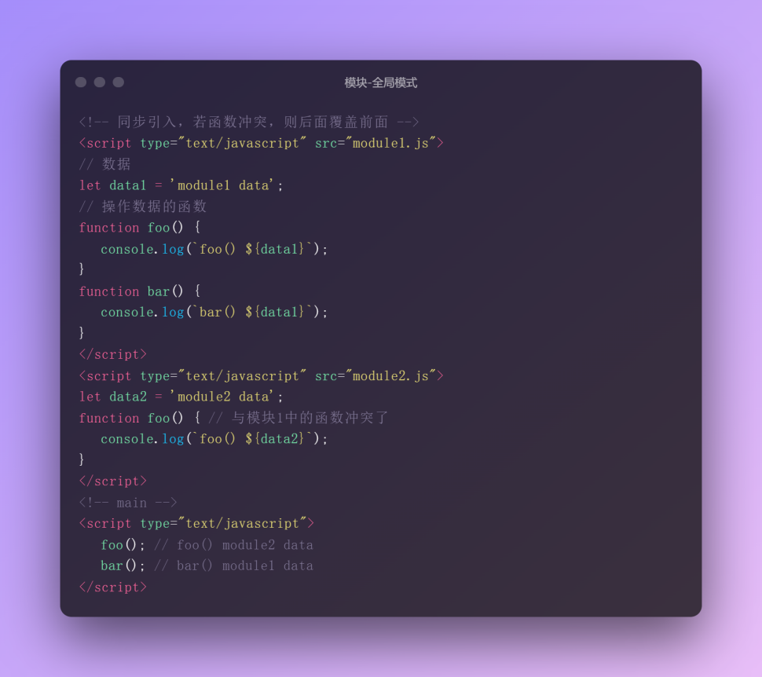
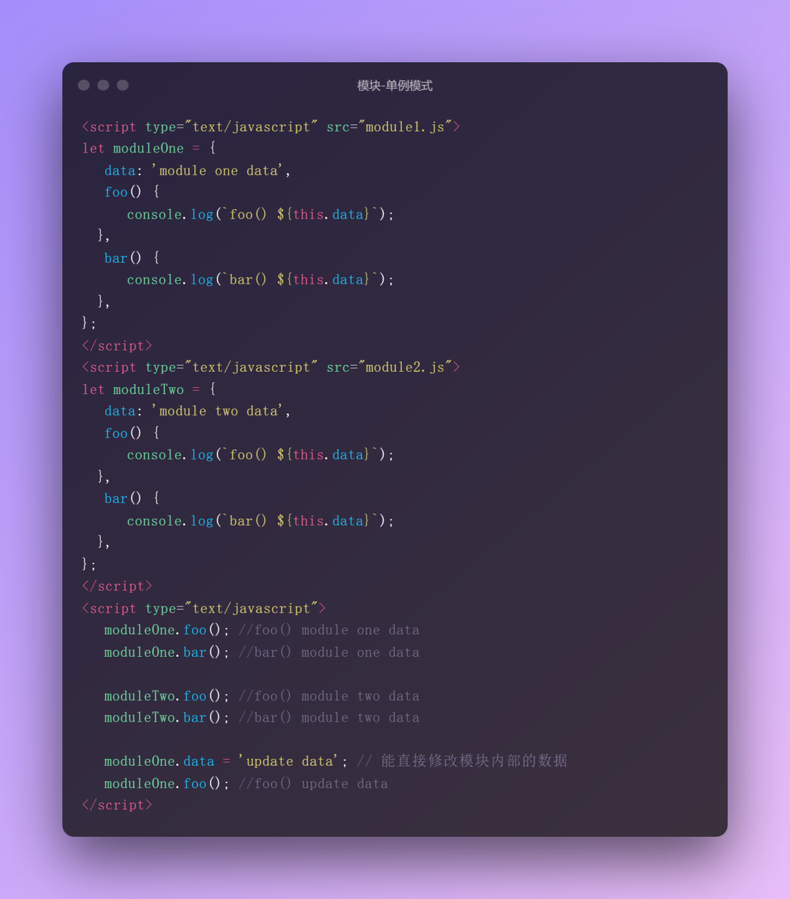
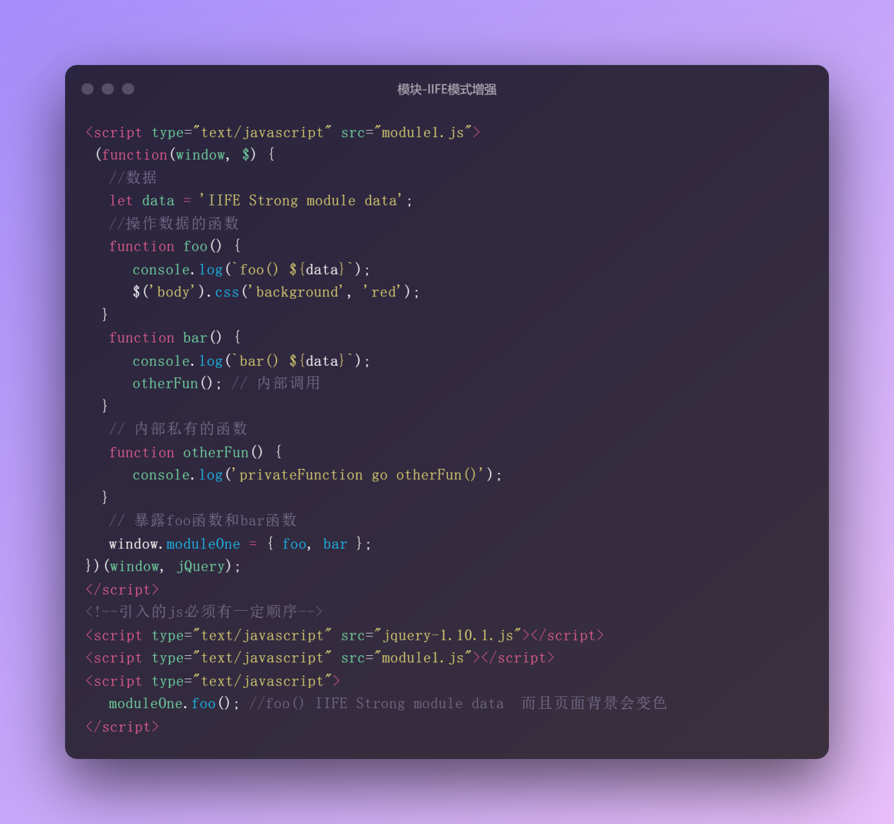
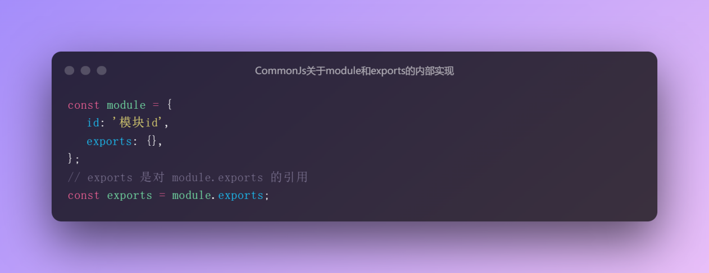
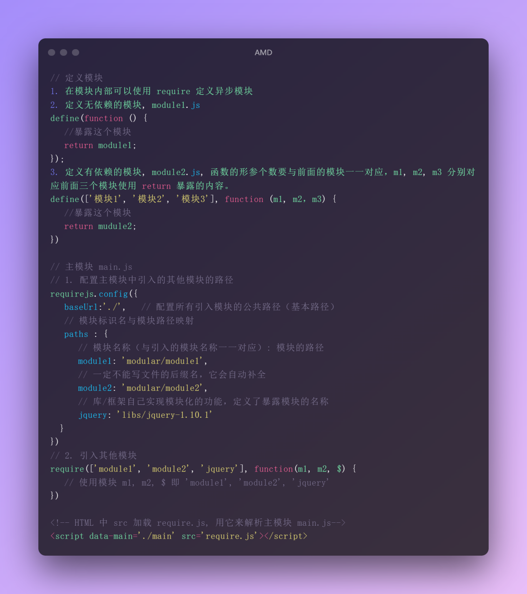
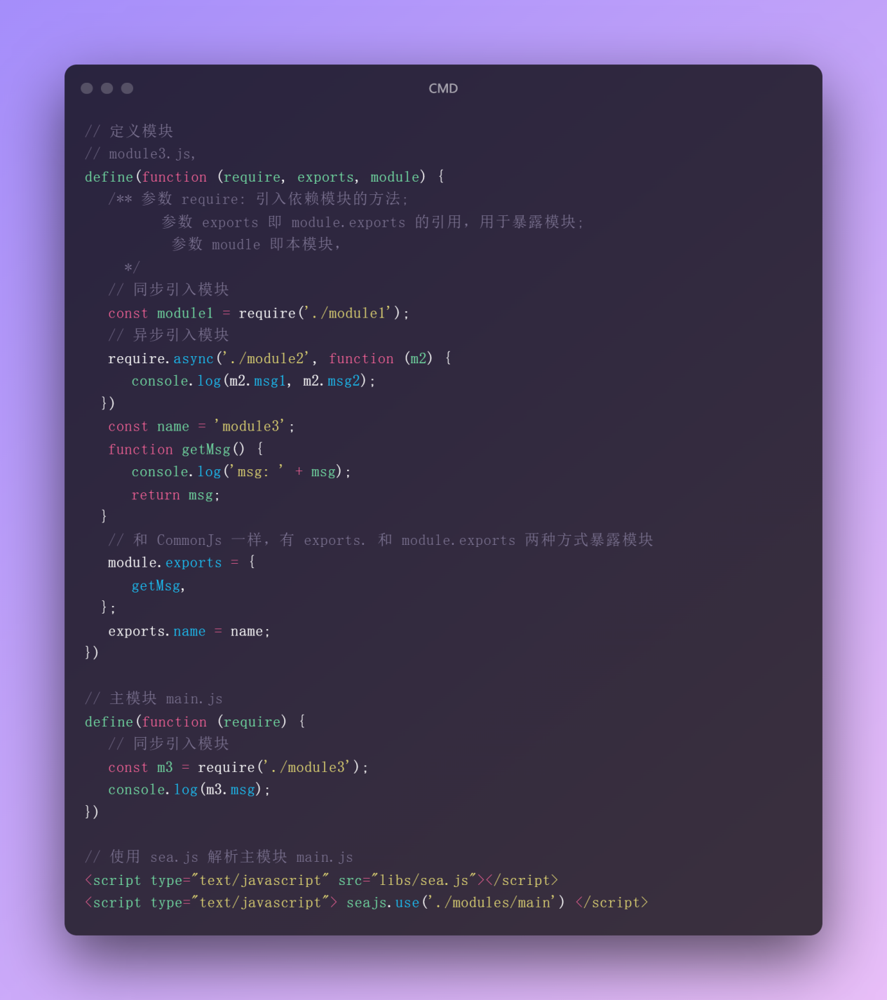
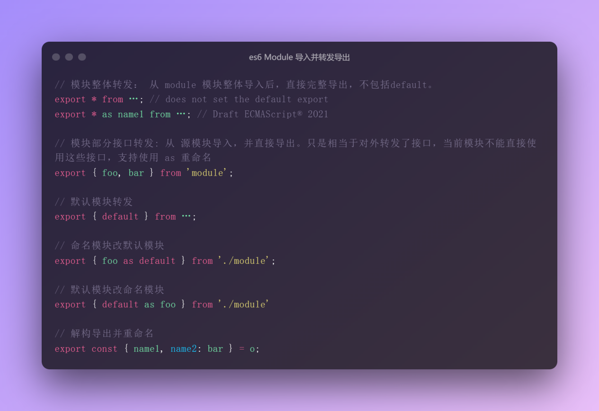
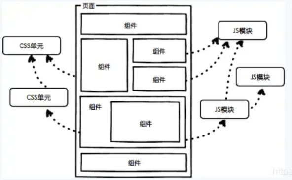

# 模块化

模块化所要解决的问题：
1. **全局污染问题**：随着JS文件数量和代码量的增加，全局变量同名的几率将会陡然上升，开发人员不得不耗费大量的精力来规避。
2. **依赖混乱的问题**：规划JS的引入顺序，以及不同版本的依赖关系。

模块化把复杂的系统分解将程序分解成离散功能块（discrete chunks of functionality），而且块的内部数据相对而言是私有的，只是向外部暴露一些接口与外部其他模块通信。模块具有比完整程序更小的接触面，使得校验、调试、测试更容易。 模块化方便代码维护，提高代码复用性，降低代码耦合度。

### 模块化历史方案

#### 全局模式

全局模式是把将不同的功能封装成不同的全局函数，容易命名冲突，造成全局变量污染。

#### 单例模式

单例模式是简单对象封装，数据和方法都是对象的属性，不安全，可以直接修改模块内部的数据。

#### IIFE 模式增强

IIFE模式增强即利用立即执行函数表达式和闭包，支持引入依赖和暴露，是现代模块实现的基石。数据是私有的，外部只能通过暴露的方法操作。存在的问题有：
1. 一个页面需要引入多个 JS 文件；
2. 而且一个 `<script>` 标签就是一次请求；
3. 无法直接看出模块间的依赖关系；
4. 如果内部依赖关系混乱就会难以维护。

### 现代模块化方案

#### CommonJS

CommonJS 是服务器端模块的规范，Node.js 采用，但提前编译打包号也可用于浏览器端。**特点**：
1. 运行时动态同步加载依赖的模块，有缓存；
2. 可复用于 Node 环境；
3. 有成熟的第三方模块社区。关键在于引入和暴露：

    引入模块使用require(url)（url 为路径参数，自定义模块必须以 ./ 或者 ../ 开头，第三方模块/内置模块/核心模块路径直接使用模块名称），引入的是module.exports 这个对象。

    暴露模块使用exports或module.exports，exports是对module.exports的引用，在编写模块时，可以使用exports.a =’xxx’, exports.b = function(){} 或module.exports = { a:’xxx’, b: function() {} }添加属性或方法，本质上它也添加在 module.exports 所指向的对象身上。但不能直接 对exports赋值，这就将 exports 重新指向新值，和 module.exports 就不是指向同一个对象，而引入模块时引入的时module.exports对象。exports和module.exports的内部实现如下：

    

CommonJS 规范加载模块是同步的，只有加载完成，才能执行后面的操作。由于 NodeJS 主要用于服务器编程，模块文件一般都已经存在于本地硬盘，加载起来比较快，所以同步加载没有问题。但是如果是浏览器端，同步加载很容易阻塞。

#### AMD

**AMD（异步模块定义）**是异步加载依赖的模块，有缓存，允许指定回调函数，可在不转换代码的情况下直接在浏览器运行，可以并行加载多个模块，也可运行在 Node 环境。AMD主要是在浏览器使用的。require.js 遵循的是 AMD（异步模块定义）规范。

#### CMD

CMD（通用模块定义）是根据 CommonJS 和 AMD 基础上提出的，异步加载依赖的模块，有缓存，sea.js 遵循的是 CMD （通用模块定义）规范。和 require.js 一样主要在浏览器中使用。但其实这两个一般都很少使用，实际上使用的更多的是CommonJs和ES Module。

#### ES6 Module

ES6 Module旨在成为浏览器和服务器通用的模块解决方案，主要针对浏览器端的，特点是动态引入（按需加载），没有缓存。Babel 将 ES6+ 转换为 ES5- （ES6 的模块化语法编译成 commonjs，然后再编译为浏览器支持的语法）。自动采用严格模式，无论是否有在模块头部加上 'use strict'，`严格模式的限制参考下文`。每个模块都有自己的顶级作用域（top-level scope），即一个模块中的顶级作用域变量和函数在其他脚本中是不可见的。模块代码只执行一次，而且导出仅创建一次，然后会在导入之间共享。模块默认是延迟解析的（deferred）。

**ECMAScript 规范中的模块化方案提供了四种引入模块的方式**：
1. **命名导入（Named Imports）**：从源模块导入其原始名称的特定项，支持在导入时使用关键字 as指定自定义名称对变量重命名。即import { name1, name2 } from ‘./module.js’
2. **命名空间导入（Namespace Import）**：将源模块中的除默认导出的所有内容作为对象导入，将所有源模块的命名导出公开为该对象的属性和方法，即import * as module from './module.js'。
3. **默认导入（Default Import）**：导入源文件的默认导出，即import module from './module.js'。可以同时将 default 语法与命名空间导入或命名导入一起使用。在这种情况下，default 导入必须首先声明。
4. **空的导入（Empty Import）**：加载模块代码，但不创建任何新对象，即import './module.js'。

**Import/export的特性有**：
1. **只读性**，import 命令导入的变量都是只读的，即不允许在加载模块的脚本里面，改写对变量重新赋值，但改写该变量的属性是可以的，而且也会影响到其他模块，因此建议不要修改。
2. **模块路径**，import 后面的 from 指定模块文件的位置，可以是相对路径，也可以是绝对路径，.js 后缀可以省略。如果只是模块名，不带有路径比如import React from ‘react’，那么必须有配置文件（通常从引入模块目录下 package.json 中查找）告诉 JavaScript 引擎该模块的位置。
3. **模块提升**，注意，import 命令具有提升效果，import 命令无论写在文件中的哪一行，都会提升到整个模块的头部，首先执行。本质是，import 命令是编译阶段执行的，在代码运行之前。
4. **静态执行**，整个语句中不能使用需要在运行时才能得到结果的语法结构，比如表达式或变量。目前import 命令无法取代 require 的 动态加载功能，关键字 import 可以像调用函数一样来动态的导入模块。以这种方式调用，将返回一个 promise，支持await，支持解构赋值获取模块输出的接口。目前import支持动态导入处于stage4阶段。以下是可能会需要动态导入的场景：
    1. 当静态导入的模块很明显的降低了代码的加载速度且被使用的可能性很低，或者并不需要马上使用它。
    2. 当静态导入的模块很明显的占用了大量系统内存且被使用的可能性很低。
    3. 当被导入的模块，在加载时并不存在，需要异步获取。
    4. 当导入模块的说明符，需要动态构建。（静态导入只能使用静态说明符）
    5. 当被导入的模块有副作用（这里说的副作用，可以理解为模块中会直接运行的代码），这些副作用只有在触发了某些条件才被需要时。（原则上来说，模块不能有副作用，但是很多时候，你无法控制你所依赖的模块的内容）
5. **重复加载**，多次重复执行同一句 import 语句，那么只会执行一次，而不会执行多次。import 语句是 Singleton 模式。
6. **模块化隔离**，虽然通过 Babel 转码，CommonJS 模块的 require 命令和 ES6 模块的 import 命令可以写在同一个模块之中，但是不建议，因为import 在静态解析阶段执行，而require是在运行时。
7. **对应关系**，export 语句输出的接口，与其对应的值是动态绑定关系，即通过该接口，可以取到模块内部实时的值。export 后只能跟着 default、函数声明、变量声明，{}，而不能是变量。
8. **模块顶层导出**，import/export 命令只能出现在模块的顶层作用域。

**ECMAScript 规范中的模块化方案提供了两种导出模块的方式**：
1. **命名导出（Named Exports）**：在声明的变量前添加 export 关键字或声明后在最后统一作为对象属性即可将相对应的变量导出。同样支持在导出时使用as关键字对导出变量重命名。对应以对象的解构赋值的方式来接收值，即import {模块暴露的内容} from '模块路径' 或import * as  from '模块路径'。**允许每一个模块中定义多个命名导出**。
2. **默认导出（Default Export）**：导出一个值作为源模块的默认导出，对应于默认的导入，**每个模块只允许有一个默认导出**。**本质上，export default 就是输出一个叫做 default 的变量或方法，因此后面不能跟变量声明语句（const/let/var）**。仅当源模块只有一个导出时，才建议使用此做法。将默认导出和命名导出组合在同一个模块中是不好的做法，尽管它是规范允许的。

导入并转发导出的写法：

### 模块化与组件化

先有模块化，后有组件化，模块化是组件化的基石，两者均是 “分而治之 ”的思想。组件化更加倾向于 UI 层面上，是一个独立的可视/可交互的区域。模块化更加倾向于功能或者数据的封装。

JS 模块是独立算法和数据单元，CSS 模块是独立的功能性样式单元，页面是应用中某个界面状态，是 UI 组件的容器，应用是整个项目或整个站点，由多个页面组成。一个应用由多个页面组成。一个页面由多个组件组合，组件由子组件组合，组件中可依赖模块，模块之间可互相依赖。

非组件化开发模式存在的问题：
1. 页面作为开发单元过大；
2. 重复区域难以抽离。

组件的意义：
1. 降低了开发粒度，从而降低了整体复杂的。
2. 减少了重复代码，提升了开发效率和可维护性。
3. 更有利于团队协作。4. 更容易抽离为公共库。 

如何高质量的封装组件？应该分离关注点，使得UI与功能解耦，展示组件只负责页面的展示，不处理数据逻辑；而由不同的容器组件负责不同数据逻辑。
