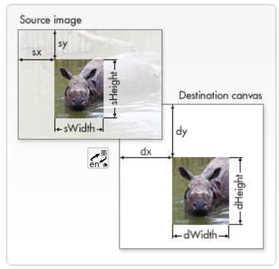
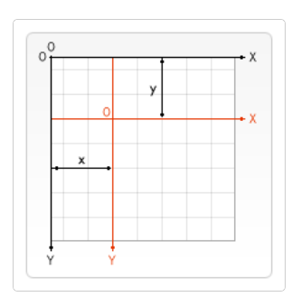
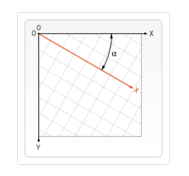
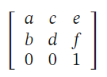

# Canvas

Canvas API 提供了一个通过 JavaScript 和 HTML 的`<canvas>`元素来绘制图形的方式。它可以用于动画、游戏画面、数据可视化、图片编辑以及实时视频处理等方面。通过在一个 canvas（画布）上结合 video 元素功能，可以实时地操纵视频数据来合成各种视觉特效到正在呈现的视频画面中。

Canvas API 主要聚焦于 2D 图形。而同样使用`<canvas>`元素的 WebGL API 则用于绘制硬件加速的 2D 和 3D 图形。

`<canvas>`是一个可以使用脚本 (通常为JavaScript) 来绘制图形的 HTML 元素。`<canvas>` 的默认大小为 300 像素 ×150 像素（宽 × 高，像素的单位是 px）。`<canvas>` 除了id和class，只有两个属性—— width和height。`<canvas>` 元素需要结束标签 (`</canvas>`)。如果结束标签不存在，则文档的其余部分会被认为是替代内容，将不会显示出来。`<canvas>`元素与``标签的不同之处在于，同像`<video>`，`<audio>`，或者 `<picture>`元素一样，`<canvas>`元素在标签之间可以定义替代内容，不支持`<canvas>`的浏览器将会忽略容器并在其中渲染后备内容。通过测试是否存在用来获得渲染上下文和它的绘画功能的 getContext() 方法，脚本可以简单检查 canvas 的支持性。getContext() 接受一个参数，即上下文的类型，取值为"2d"、"webgl"、"webgl2"、"bitmaprenderer"。

不同于 SVG，`<canvas>` 只支持两种形式的图形绘制：矩形和路径（由一系列点连成的线段）。所有其他类型的图形都是通过一条或者多条路径组合而成的。canvas 提供了三种方法绘制矩形，x 与 y 指定了在 canvas 画布上所绘制的矩形的左上角（相对于原点）的坐标。width 和 height 设置矩形的尺寸：
1. fillRect(x, y, width, height)绘制一个填充的矩形
2. strokeRect(x, y, width, height)：绘制一个矩形的边框
3. clearRect(x, y, width, height)：清除指定矩形区域，让清除部分完全透明。

图形的基本元素是路径。路径是通过不同颜色和宽度的线段或曲线相连形成的不同形状的点的集合。一个路径，甚至一个子路径，都是闭合的：
1. 使用beginPath()新建一条路径，生成之后，图形绘制命令被指向到路径上生成路径。
2. 然后使用画图命令去画出路径：
    1. moveTo(x, y)：将笔触移动到指定的坐标 x 以及 y 上
    2. lineTo(x, y)：绘制一条从当前位置到指定 x 以及 y 位置的直线。x 以及 y，代表坐标系中直线结束的点。开始点和之前的绘制路径有关，之前路径的结束点就是接下来的开始点。
    3. arc(x, y, radius, startAngle, endAngle, anticlockwise)：画一个以（x,y）为圆心的以 radius 为半径的圆弧（圆），从 startAngle 开始到 endAngle 结束，按照 anticlockwise 给定的方向（默认为顺时针）来生成。x,y为绘制圆弧所在圆上的圆心坐标。radius为半径。startAngle以及endAngle参数用弧度定义了开始以及结束的弧度。这些都是以 x 轴为基准。参数anticlockwise为一个布尔值。为 true 时，是逆时针方向，否则顺时针方向。角度与弧度的 js 表达式：弧度=(Math.PI/180)*角度。
    4. arcTo(x1, y1, x2, y2, radius)：根据给定的控制点和半径画一段圆弧，再以直线连接两个控制点。
    5. quadraticCurveTo(cp1x, cp1y, x, y)：绘制二次贝塞尔曲线，cp1x,cp1y 为一个控制点，x,y 为结束点。
    6. bezierCurveTo(cp1x, cp1y, cp2x, cp2y, x, y)：绘制三次贝塞尔曲线，cp1x,cp1y为控制点一，cp2x,cp2y为控制点二，x,y为结束点。
    7. rect(x, y, width, height)：绘制一个左上角坐标为（x,y），宽高为 width 以及 height 的矩形。当该方法执行的时候，moveTo() 方法自动设置坐标参数（0,0）。也就是说，当前笔触自动重置回默认坐标。
    8. Path2D([path], [d])：会返回一个新初始化的 Path2D 对象（可能将某一个路径path作为变量——创建一个它的副本，或者将一个包含 SVG path 数据的字符串d作为变量）。
        1. path2D.addPath(path [, transform])：添加一条路径到当前路径（可能添加了一个变换矩阵）。
        2. 所有的路径方法比如moveTo, rect, arc或quadraticCurveTo等，都可以在 Path2D 中使用
    9. fillStyle属性或strokeStyle属性：设置图形的填充或轮廓颜色color。color 可以是表示 CSS 颜色值的字符串，渐变对象或者图案对象。
    10. globalAlpha属性：影响到 canvas 里所有图形的透明度，有效的值范围是 0.0（完全透明）到 1.0（完全不透明），默认是 1.0。
    11. lineWidtha属性：设置线条宽度。
    12. lineCap 属性：设置线条末端样式。
    13. lineJoin 属性：设定线条与线条间接合处的样式。
    14. miterLimit属性：限制当两条线相交时交接处最大长度；所谓交接处长度（斜接长度）是指线条交接处内角顶点到外角顶点的长度。
    15. getLineDash()：返回一个包含当前虚线样式，长度为非负偶数的数组。
    16. setLineDash(segments)：设置当前虚线样式。
    17. lineDashOffset 属性：设置虚线样式的起始偏移量。
    18. createLinearGradient(x1, y1, x2, y2)：接受 4 个参数，表示渐变的起点 (x1,y1) 与终点 (x2,y2)。
    19. createRadialGradient(x1, y1, r1, x2, y2, r2)：接受 6 个参数，前三个定义一个以 (x1,y1) 为原点，半径为 r1 的圆，后三个参数则定义另一个以 (x2,y2) 为原点，半径为 r2 的圆。返回一个canvasGradient渐变对象。
    20. canvasGradient.addColorStop(position, color)：接受 2 个参数，position 参数必须是一个 0.0 与 1.0 之间的数值，表示渐变中颜色所在的相对位置。例如，0.5 表示颜色会出现在正中间。color 参数必须是一个有效的 CSS 颜色值。
    21. createPattern(image, type)：接受两个参数，image 可以是一个 Image 对象的引用，或者另一个 canvas 对象。type 必须是下面的字符串值之一：repeat，repeat-x，repeat-y 和 no-repeat。返回一个图案对象。
    22. shadowOffsetX、shadowOffsetY属性：用来设定阴影在 X 和 Y 轴的延伸距离，它们是不受变换矩阵所影响的。负值表示阴影会往上或左延伸，正值则表示会往下或右延伸，它们默认都为 0。
    23. shadowBlur：用于设定阴影的模糊程度，其数值并不跟像素数量挂钩，也不受变换矩阵的影响，默认为 0。
    24. shadowColor ：shadowColor 是标准的 CSS 颜色值，用于设定阴影颜色效果，默认是全透明的黑色。
    25. font属性：当前我们用来绘制文本的样式。这个字符串使用和 CSS font 属性相同的语法。默认的字体是 10px sans-serif。
    26. textAlign属性：文本对齐选项。可选的值包括：start, end, left, right or center. 默认值是 start。
    27. textBaseline属性：基线对齐选项。可选的值包括：top, hanging, middle, alphabetic, ideographic, bottom。默认值是 alphabetic。
    28. direction属性：文本方向。可能的值包括：ltr, rtl, inherit。默认值是 inherit。
    29. fillText(text, x, y [, maxWidth])：在指定的 (x,y) 位置填充指定的文本，绘制的最大宽度是可选的。
    30. strokeText(text, x, y [, maxWidth])：在指定的 (x,y) 位置绘制文本边框，绘制的最大宽度是可选的。
3. 可选的使用closePath() 闭合路径。因为调用 fill() 函数时，所有没有闭合的形状都会自动闭合，所以你不需要调用 closePath() 函数。但是调用 stroke() 时不会自动闭合。
4. 使用stroke()通过线条来绘制图形轮廓或使用fill()通过填充路径的内容区域生成实心的图形。
    1. fill()：路径内部的填充规则。可能的值是nonzero或evenodd。默认值为nonzero。
    2. clip()：将当前正在构建的路径转换为当前的裁剪路径。可以实现与globalCompositeOperation 属性的 source-in 和 source-atop差不多的效果。最重要的区别是裁切路径不会在 canvas 上绘制东西，而且它永远不受新图形的影响。这些特性使得它在特定区域里绘制图形时相当好用。
    3. 默认情况下，canvas 有一个与它自身一样大的裁切路径（也就是没有裁切效果）。

本质上，路径是由很多子路径构成，这些子路径都是在一个列表中，所有的子路径（线、弧形、等等）构成图形。而每次这个方法调用之后，列表清空重置，然后我们就可以重新绘制新的图形。

canvas 更有意思的一项特性就是图像操作能力。可以用于动态的图像合成或者作为图形的背景，以及游戏界面（Sprites）等等。浏览器支持的任意格式的外部图片都可以使用，比如 PNG、GIF 或者 JPEG。你甚至可以将同一个页面中其他 canvas 元素生成的图片作为图片源。引入图像到 canvas 里需要以下两步基本操作：
1. 获得一个指向HTMLImageElement的对象或者另一个 canvas 元素的引用作为源，也可以通过提供一个 URL 的方式来使用图片，如果图片的服务器允许跨域访问这个图片，那么可以使用这个图片而不污染 canvas，否则，使用这个图片将会污染 canvas。这些源统一由 CanvasImageSource类型来引用：
    1. HTMLImageElement：这些图片是由 Image() 函数构造出来的，或者任何的 `` 元素。
    2. HTMLVideoElement：用一个 HTML 的 `<video>` 元素作为你的图片源，可以从视频中抓取当前帧作为一个图像
    3. HTMLCanvasElement：可以使用另一个 `<canvas>` 元素作为你的图片源。
    4. ImageBitmap：这是一个高性能的位图，可以低延迟地绘制，它可以从上述的所有源以及其他几种源中生成。
2. 使用drawImage() 函数将图片绘制到画布上，drawImage 方法有三种形态：
    1. drawImage(image, x, y)：其中 image 是 image 或者 canvas 对象，x 和 y 是其在目标 canvas 里的起始坐标。
    2. drawImage(image, x, y, width, height)：width 和 height，这两个参数用来控制 当向 canvas 画入时应该缩放的大小。图像可能会因为大幅度的缩放而变得像素化或者模糊。如果您的图像里面有文字，那么最好还是不要进行缩放，因为那样处理之后很可能图像里的文字就会变得无法辨认了。也可以通过使用绘图环境的来控制是否在缩放图像时使用平滑算法，默认值为true，即启用平滑缩放。
        1. imageSmoothingQuality属性：取值为"low"或"medium"或"high"，用于设置图像平滑度的。
        2. imageSmoothingEnabled属性：用来设置图片是否平滑的属性，true 表示图片平滑（默认值），false 表示图片不平滑。默认的启用平滑算法会造成图片模糊并且破坏图片原有的像素，可以设置为 false。
    3. drawImage(image, sx, sy, sWidth, sHeight, dx, dy, dWidth, dHeight)：第一个参数和其他的是相同的，都是一个图像或者另一个 canvas 的引用。其他 8 个参数最好是参照下图，前 4 个是定义图像源的切片位置和大小，后 4 个则是定义切片的目标显示位置和大小。
    

Canvas 状态是当前画面应用的所有样式和变形的一个快照，一个状态包括：
1. 当前应用的变形（即移动，旋转和缩放）以及下面这些属性：strokeStyle, fillStyle, globalAlpha, lineWidth, lineCap, lineJoin, miterLimit, lineDashOffset, shadowOffsetX, shadowOffsetY, shadowBlur, shadowColor, globalCompositeOperation, font, textAlign, textBaseline, direction, imageSmoothingEnabled。
2. 当前的裁切路径（clipping path）。

ctx.save()：保存画布 (canvas) 的所有状态Canvas 状态存储在栈中，可以调用任意多次 save方法，每当save()方法被调用后，当前的状态就被推送到栈中保存。在做变形之前先保存状态是一个良好的习惯。

ctx.restore()：恢复 canvas 的所有状态的。每一次调用 restore 方法，上一个保存的状态就从栈中弹出，所有设定都恢复。
ctx.translate(x, y)：用来移动 canvas 和它的原点到一个不同的位置。接受两个参数。x 是左右偏移量，y 是上下偏移量，如下图所示：

ctx.rotate(angle)：用于以原点为中心旋转 canvas。只接受一个参数：旋转的角度 (angle)，它是顺时针方向的，以弧度为单位的值。旋转的中心点始终是 canvas 的原点，如果要改变它，需要用到 translate方法。如下图所示：

ctx.scale(x, y)：可以缩放画布的水平和垂直的单位，默认情况下，canvas 的 1 个单位为 1 个像素。两个参数都是实数，可以为负数，x 为水平缩放因子，y 为垂直缩放因子，如果比 1 小，会缩小图形，如果比 1 大会放大图形。默认值为 1，为实际大小。如果参数为负实数，相当于以 x 或 y 轴作为对称轴镜像反转。

ctx.transform(a, b, c, d, e, f)：将当前的变形矩阵乘上一个基于自身参数的矩阵，变换矩阵描述如下：

（a：水平方向的缩放、b：竖直方向的倾斜偏移、c：水平方向的倾斜偏移、d：竖直方向的缩放、e：水平方向的移动、f：竖直方向的移动）

如果任意一个参数是Infinity，变形矩阵也必须被标记为无限大，否则会抛出异常。

ctx.setTransform(a, b, c, d, e, f)：会将当前的变形矩阵重置为单位矩阵，然后用相同的参数调用 transform方法。如果任意一个参数是无限大，那么变形矩阵也必须被标记为无限大，否则会抛出异常。从根本上来说，该方法是取消了当前变形，然后设置为指定的变形，一步完成。

ctx.resetTransform()：重置当前变形为单位矩阵，它和调用以下语句是一样的：ctx.setTransform(1, 0, 0, 1, 0, 0);

globalCompositeOperation 属性：设定了在画新图形时采用的遮盖策略，其值是一个标识 12 种遮盖方式的字符串：
1. source-over：默认值，在现有画布上下文之上绘制新图形。
2. source-in：新图形只在新图形和目标画布重叠的地方绘制。其他的都是透明的。
3. source-out：在不与现有画布内容重叠的地方绘制新图形。 
4. source-atop：新图形只在与现有画布内容重叠的地方绘制。 
5. destination-over：在现有的画布内容后面绘制新的图形。 
6. destination-in：现有的画布内容保持在新图形和现有画布内容重叠的位置。其他的都是透明的。 
7. destination-out：现有内容保持在新图形不重叠的地方。 
8. destination-atop：现有的画布只保留与新图形重叠的部分，新的图形是在画布内容后面绘制的。 
9. lighter：两个重叠图形的颜色是通过颜色值相加来确定的。 
10. copy：只显示新图形。 
11. xor 图像中，那些重叠和正常绘制之外的其他地方是透明的。 
12. multiply 将顶层像素与底层相应像素相乘，结果是一幅更黑暗的图片。 
13. screen 像素被倒转，相乘，再倒转，结果是一幅更明亮的图片。 
14. overlay multiply 和 screen 的结合，原本暗的地方更暗，原本亮的地方更亮。 
15. darken 保留两个图层中最暗的像素。
16. lighten 保留两个图层中最亮的像素。 
17. color-dodge 将底层除以顶层的反置。 color-burn 将反置的底层除以顶层，然后将结果反过来。 
18. hard-light 屏幕相乘（A combination of multiply and screen）类似于叠加，但上下图层互换了。 
19. soft-light 用顶层减去底层或者相反来得到一个正值。
20. difference 一个柔和版本的强光（hard-light）。纯黑或纯白不会导致纯黑或纯白。 
21. exclusion：和 difference 相似，但对比度较低。 
22. hue 保留了底层的亮度（luma）和色度（chroma），同时采用了顶层的色调（hue）。 
23. saturation 保留底层的亮度（luma）和色调（hue），同时采用顶层的色度（chroma）。 
24. color 保留了底层的亮度（luma），同时采用了顶层的色调 (hue) 和色度 (chroma)。 
25. luminosity 保持底层的色调（hue）和色度（chroma），同时采用顶层的亮度（luma）。

Canvas动画推荐使用window.requestAnimationFrame()来有安排的更新画布：
1. 清空 canvas：除非接下来要画的内容会完全充满 canvas（例如背景图），否则需要清空所有。最简单的做法就是用 clearRect 方法。
2. 保存 canvas 状态：如果要改变一些会改变 canvas 状态的设置（样式，变形之类的），又要在每画一帧之时都是原始状态的话，需要先保存一下。
3. 绘制动画图形（animated shapes）：这一步才是重绘动画帧。
4. 恢复 canvas 状态：如果已经保存了 canvas 的状态，可以先恢复它，然后重绘下一帧。

ImageData对象中存储着 canvas 对象真实的像素数据，可以直接读取或将数据数组写入该对象中。它包含以下几个只读属性，
1. width：图片宽度，单位是像素
2. height：图片高度，单位是像素
3. data：Uint8ClampedArray 类型的一维数组，包含着 RGBA 格式的整型数据，范围在 0 至 255 之间（包括 255）。data 属性返回一个 Uint8ClampedArray类型的一维数组，它可以被使用作为查看初始像素数据。每个像素用 4 个 1bytes 值 (按照红，绿，蓝和透明值的顺序; 这就是"RGBA"格式) 来代表。每个颜色值部份用 0 至 255 来代表。每个部份被分配到一个在数组内连续的索引，左上角像素的红色部份在数组的索引 0 位置。像素从左到右被处理，然后往下，遍历整个数组。Uint8ClampedArray 包含 height × width × 4 字节数据，索引值从 0 到 (height× width × 4)-1。

使用createImageData() 方法可以创建一个新的，空白的 ImageData 对象。有 2 个版本的 createImageData() 方法：
1. createImageData(width, height)：创建一个新的具体特定尺寸的 ImageData 对象。所有像素被预设为透明黑。
2. createImageData(anotherImageData)：创建一个被 anotherImageData 对象指定的相同像素的 ImageData 对象。这个新的对象像素全部被预设为透明黑。

可以用 getImageData(left, top, width, height) 方法获得一个包含画布场景像素数据的 ImageData 对象，该方法会返回一个 ImageData 对象，它代表了画布区域的对象数据，此画布的四个角落分别表示为 (left, top), (left + width, top), (left, top + height), 以及 (left + width, top + height) 四个点。这些坐标点被设定为画布坐标空间元素。

可以用 putImageData(myImageData, dx, dy)方法去对场景进行像素数据的写入，dx 和 dy 参数表示希望在场景内左上角绘制的像素数据所得到的设备坐标。

HTMLCanvasElement 提供一个 toDataURL() 方法，它返回一个包含被类型参数规定的图像表现格式的数据链接。返回的图片分辨率是 96 dpi：
1. toDataURL('image/png')：默认设定。创建一个 PNG 图片。
2. toDataURL('image/jpeg', quality)：创建一个 JPG 图片。你可以有选择地提供从 0 到 1 的品质量，1 表示最好品质，0 基本不被辨析但有比较小的文件大小。

HTMLCanvasElement 也提供一个toBlob(callback, type, encoderOptions)方法创建一个在画布中的代表图片的 Blob 对象。

**canvas 的优化**：
1. 在离屏 canvas 上预渲染相似的图形或重复的对象
2. 避免浮点数的坐标点，用整数取而代之。浏览器为了达到抗锯齿的效果会做额外的运算。为了避免这种情况，请保证在调用drawImage()函数时，用Math.floor()函数对所有的坐标点取整。
3. 在离屏 canvas 中缓存图片的不同尺寸，而不要用drawImage()去缩放它们。
4. 可能会发现某些对象需要经常移动或更改，而其他对象则保持相对静态。在这种情况下，可能的优化是使用多个`<canvas>`元素对项目进行分层。
5. 静态大背景图建议使用CSS的background代替。
6. 用 CSS transforms 特性缩放画布， CSS transforms 使用 GPU，因此速度更快
7. 如果使用画布而且不需要透明，当使用 HTMLCanvasElement.getContext() 创建一个绘图上下文时把 alpha 选项设置为 false 。这个选项可以帮助浏览器进行内部优化。
8. 将画布的函数调用集合到一起（例如，画一条折线，而不要画多条分开的直线）。
9. 避免不必要的画布状态改变。
10. 渲染画布中的不同点，而非整个新状态。
11. 尽可能避免 shadowBlur特性。
12. 尽可能避免text rendering。
13. 尝试不同的方法来清除画布 (clearRect() vs. fillRect() vs. 调整 canvas 大小)。
14. 有动画，请使用window.requestAnimationFrame() 而非window.setInterval()。
15. 请谨慎使用大型物理库。
16. 图片清晰度（包括 canvas）需要保证：原始尺寸(cvs.width/cvs.height) = 样式尺寸 * 缩放倍率（window.devicePixelRatio）