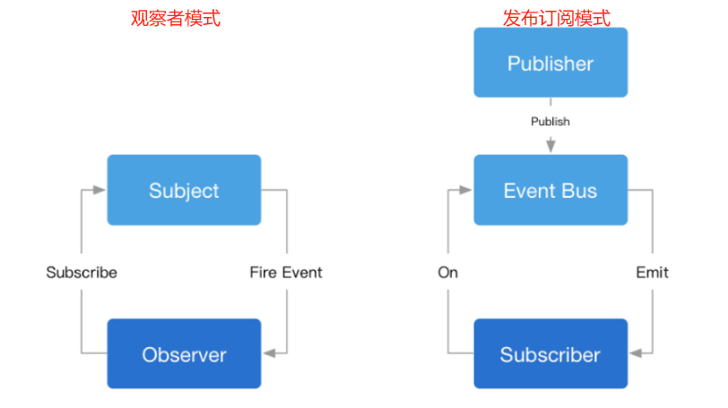

# 前端常用设计模式

设计模式是通过代码设计经验总结出的解决问题的一系列套路。

## 设计模式的原则（SOLID）

1. **单一职责原则（Single Responsibility Principle）**：一个类或者模块只负责完成一个职责（或者功能）。避免将不相关的代码耦合在一起，提高了类或者模块的内聚性。
2. **开放封闭原则（Open Closed Principle）**：软件实体（模块、类、方法等）应该对扩展开放、对修改关闭。
3. **里式替换原则（Liskov Substitution Principle）**：子类对象能够替换程序中父类对象出现的任何地方，并且保证原来程序的逻辑行为不变及正确性不被破坏。
4. **接口隔离原则（Interface Segregation Principle）**：接口的调用者不应该被强迫依赖它不需要的接口。
5. **依赖倒置原则（Dependency Inversion Principle）**：高层模块不要依赖低层模块。即面向接口编程，依赖于抽象而不依赖于具体。

Unix/Linux设计哲学：
1. 小即是美；让每个程序只做一件事；快速建立原型。
2. 舍弃高效率，而更关注可移植性和可扩展性；采用纯文本方式来存储数据；充分利用软件得杠杆效应（软件复用、代码复用）。
3. 避免强制性的用户界面；允许用户定制环境（考虑多环境、扩展性）；寻求90%的解决方案。

## 常用的 23 种设计模式

<font color="red">加粗的是前端常用</font>：

创建型模式：
1. **工厂模式**（包括：工厂方法模式，抽象工厂模式，建造者模式）；
2. **单例模式**；
3. **原型模式**。

结构型模式：
1. 适配器模式；
2. **装饰器模式**；
3. **代理模式**；
4. 桥接模式；
5. 组合模式；
6. 享元模式。

行为型模式：
1. **策略模式**；
2. **观察者模式**；
3. **迭代器模式**；
4. 模板方法模式；
5. 职责连模式；
6. 命令模式；
7. 备忘录模式；
8. 状态模式；
9. 访问者模式；
10. 中介者模式；
11. 解释器模式。

### 单例模式

**保证一个类仅有一个实例，并提供一个访问它的全局访问点**。单例模式能保证全局的唯一性，可以减少命名变量，单例模式在一定情况下可以节约内存，减少过多的类生成需要的内存和运行时间，把代码都放在一个类里面维护，实现了高内聚。

**优点**是提供了对唯一实例的受控访问、避免对共享资源的多重占用、节约系统资源。**缺点**是扩展性差和职责过重。

**场景**：
1. (登录)弹窗；
2. Vuex 的 store；
3. 自定义事件 EventBus

**注意**：Java 是多线程，单例模式需要加线程锁 —— 而 JavaScript 是单线程，因此不用考虑同步锁的问题。

**模式实现**：

```typescript
/**
 * js 利用代理实现单例
 * @param className
 * @returns
 */
function singleton<T extends object>(className: Constructor<T>) {
  let instance: T | null = null;
  return new Proxy(className, {
    construct(target, args) {
      return instance || (instance = new target(...args));
    }
  });
}

/**
 * typescript 实现单例（不需要使用代理）
 * const s1 = Singleton.getInstance();
 * const s2 = Singleton.getInstance();
 * console.log(s1 === s2); // true
 */
class Singleton {
  private static instance: Singleton;
  private constructor() {}

  public static getInstance() {
    return Singleton.instance || (Singleton.instance = new Singleton());
  }

  someMethod() {}
}

/**
 * 模块化实现单例
 * 
  let instance // 闭包
  class Singleton {}
  // 外部只能 import 这个函数
  export default () => {
    return instance || (instance = new Singleton());
  }
 */

/**
 * 闭包实现单例
 * 
  function genGetInstance() {
    let instance // 闭包
    class Singleton {}
    return () => {
      return instance || (instance = new Singleton());
    }
  }
  const getInstance = genGetInstance()
  const s1 = getInstance()
  const s2 = getInstance()
 */
```

**惰性弹窗**：

```javascript
const getSingleton = function(fn) {
  let instance = null;
  return function(...args) {
    return instance || (instance = fn.apply(this, args)); // 不存在才调用构造函数创建
  }
}
const createAlert = function(html) {
  let dev = document.createElement('div');
  div.innerHTML = html;
  div.style.display = 'none';
  document.body.appendChild(div);
  return div;
}
const createSingleAlert = getSingleton(createAlert);
document.body.addEvenListener('click', function() {
  // 多次点击只会产生一个弹窗
  const alertMessage = createSingleAlert('请先注册/登录');
  alertMessage.style.display = 'block';
})
```

### 观察者模式和发布-订阅模式



在**观察者模式**中，观察者 Observer 需要直接订阅目标事件 Subject；在目标发出内容改变的事件后，直接接收事件并作出响应，比如 addEventListener 绑定事件。

在**发布订阅模式**中，发布者(publisher)和订阅者(subscriber)之间加入一个事件通道(EventBus)，EventBus 从发布者(publisher)接收事件，向订阅者(subscriber)发布事件；订阅者需要从事件通道订阅事件。比如，自定义事件，需要在代码中触发 emit。

**观察者模式场景**：
1. Vue 和 React 的生命周期；
2. DOM 事件；
3. Vue 的 watch 选项；
4. Vue 的组件更新过程；
5. 各种异步回调：setTimeout、promise.then、nodejs 的文件读取流；
6. MutationObserver。

**观察者模式实现**：

```typescript
// 目标
class Subject {
  private state: number = 0;
  private observers: Observer[] = [];

  getState(): number {
    return this.state;
  }

  setState(newState: number) {
    this.state = newState;
    this.notify(); // 通知
  }
  // 添加观察者
  attach(observer: Observer) {
    this.observers.push(observer);
  }

  // 通知
  private notify() {
    this.observers.forEach((o) => o.update(this.state));
  }
}

// 观察者
class Observer {
  name: string;
  constructor(name: string) {
    this.name = name;
  }
  update(state: number) {
    console.log(`${this.name} updated, state is ${state}`);
  }
}

const sub = new Subject();
const observer1 = new Observer('A');
const observer2 = new Observer('B');
sub.attach(observer1);
sub.attach(observer2);
sub.setState(1);
```

**发布-订阅模式场景**：
1. 自定义事件（Vue2 实例本身就支持自定义事件，但 Vue3 不再支持。Vue3 推荐使用 mitt，但 mitt 没有 once，需要可以使用 event-emitter，在 Vue 和 React 组件中使用自定义事件，在组件销毁之前需要进行 off，否则可能会导致内存泄漏，而且，off 时要传入原来的函数，而不能是匿名函数）。
2. postMessage 通信。

**优点**是时间上解耦，可以实现异步、弱化对象实体间的引用关系，发布订阅模式中的事件通道可更细粒度处理。**缺点**是复杂场景不易追踪维护和理解，而且存在事件通道等额外时间内存开销。

**发布订阅模式实现**：

``` typescript
class EventEmitter {
  constructor() {
    this.listeners = {};
  }

  on(type, cb, options) {
    if (typeof type !== 'string' || typeof cb !== 'function') return false;

    this.listeners[type] = this.listeners[type] || [];

    this.listeners[type].push({
      cb,
      priority: options.priority || 0
    });

    return () => {
      this.listeners = this.listeners.filter((item) => item.cb !== cb);
    };
  }

  off(type, cb) {
    if (typeof type !== 'string' || typeof cb !== 'function') return false;

    if (!this.listeners[type] || this.listeners[type].length === 0) return false;

    for (let i = 0; i < this.listeners[type].length; i++) {
      if (this.listeners[type][i] === cb) {
        this.listeners[type].splice(i, 1);
      }
    }
  }

  emit(type, data) {
    if (typeof type !== 'string') return false;

    this.listeners[type] &&
      this.listeners[type].sort((a, b) => a.priority - b.priority).forEach((item) => item.cb.call(null, data));
  }
}
```

### 工厂模式

创建对象的一种方式。不用每次都亲自创建对象，而是通过一个既定的“工厂”来生产对象。

**优点**：工厂和类分离、解耦；可以扩展多个类；工厂中的创建逻辑也可以自由扩展。

**场景**：
1. JQuery 的$。
2. Vue 的 _createElementVNode 或 React 的 React.createElement。

**模式实现**：

```typescript
interface IProduct {
  name: string;
  fn1: () => void;
}
class Product1 implements IProduct {
  name: string;
  constructor(name: string) {
    this.name = name;
  }
  fn1() {
    alert('product1 fn1');
  }
}

class Product2 implements IProduct {
  name: string;
  constructor(name: string) {
    this.name = name;
  }
  fn1() {
    alert('product2 fn1');
  }
}

class Creator {
  // 依赖倒置原则
  create(type: string, name: string): IProduct {
    if (type === 'p1') {
      return new Product1(name);
    }
    if (type === 'p2') {
      return new Product2(name);
    }
    throw new Error('Invalid type');
  }
}

const creator = new Creator();
const p1 = creator.create('p1', 'name1');
const p2 = creator.create('p2', 'name2');
```

### 迭代器模式

能在不暴露集合底层表现形式 （表、 栈和树等） 的情况下遍历集合中所有的元素。主要思想是将集合的遍历行为抽取为单独的迭代器对象。

**优点**：使用者和目标数据分离，解耦；目标数据自行控制内部迭代逻辑；使用者不关心目标数据的内部结构。

**场景**：
1. Symbol.iterator 迭代器；

**模式实现**：

```typescript
class DataIterator {
  private data: number[];
  private index = 0;
  constructor(container: DataContainer) {
    this.data = container.data;
  }
  next(): number | null {
    if (this.hasNext()) {
      return this.data[this.index++];
    }
    return null;
  }
  hasNext() {
    return this.index < this.data.length;
  }
}
class DataContainer {
  data: number[] = [10, 20, 30, 40];
  getIterator() {
    return new DataIterator(this);
  }
}

const iterator = new DataContainer().getIterator();
while (iterator.hasNext()) {
  const num = iterator.next();
  console.log(num);
}

/**
 * 自定义迭代器
  interface IteratorRes {
    value: number | undefined
    done: boolean
  }

  class CustomIterator {
    private length = 3
    private index = 0
    next(): IteratorRes {
      this.index++
      if (this.index <= this.length) {
        return { value: this.index, done: false }
      }
        return { value: undefined, done: true }
      }
      [Symbol.iterator]() {
        return this
    }
  }
  const iterator = new CustomIterator()
  console.log(iterator.next())
  console.log(iterator.next())
  console.log(iterator.next())
  console.log(iterator.next())
 */
```

### 原型模式

用一个已经创建的实例作为原型，通过复制该原型对象来创建一个和原型相同或相似的新对象。传统的原型模式就是克隆，克隆方法会创建一个当前类的对象，然后将原始对象所有的成员变量值复制到新建的对象中。 

**场景**：Object.create 指定 prototype 原型。

**弊端**：
1. 每个类都要实现 clone 方法，对类的实现是有一定入侵的，要修改已有类时，违背了开闭原则。
2. 当类又调用了其他对象时，如果要实现深拷贝，需要对应对象也实现 clone 方法，整体链路可能会特别长，实现起来比较麻烦。
3. 克隆包含循环引用的复杂对象可能会非常麻烦。

**模式实现**：

```typescript
/**
 * 1. 创建原型接口，并在其中声明克隆方法。如果你已有类层次结构，则只需在其所有类中添加该方法即可。
 * 2. 原型类必须另行定义一个以该类对象为参数的构造函数。构造函数必须复制参数对象中的所有成员变量值到新建实体中。如果你需要修改子类，则必须调用父类构造函数，让父类复制其私有成员变量值。
 * 3. 如果编程语言不支持方法重载，那么你可能需要定义一个特殊方法来复制对象数据。在构造函数中进行此类处理比较方便，因为它在调用 new 运算符后会马上返回结果对象。
 * 4. 克隆方法通常只有一行代码：使用 new 运算符调用原型版本的构造函数。 注意，每个类都必须显式重写克隆方法并使用自身类名调用 new 运算符。否则，克隆方法可能会生成父类的对象。
 */
class ComponentWithBackReference {
  public prototype;

  constructor(prototype: Prototype) {
    this.prototype = prototype;
  }
}
class Prototype {
  public primitive: any;
  public component!: object;
  public circularReference!: ComponentWithBackReference;

  public clone(): this {
    const clone = Object.create(this);

    clone.component = Object.create(this.component);

    // 克隆具有反向引用嵌套对象的对象需要特殊处理。克隆完成后，嵌套对象应该指向克隆对象，而不是原始对象。对于这种情况，扩展运算符很方便。
    clone.circularReference = {
      ...this.circularReference,
      prototype: { ...this }
    };

    return clone;
  }
}
```

### 装饰器模式

允许向一个现有的对象添加新的功能，同时又不改变其结构。这种类型的设计模式属于结构型模式，它是作为现有的类的一个包装。动态地给一个对象添加一些额外的职责。就增加功能来说，装饰器模式相比生成子类更为灵活。

**场景**：
1. ECMAScript 的 Decorator；
2. AOP（面向切面编程）。
3. react 的高阶组件。

**弊端**：
1. 组合过程的复杂，要生成过多的对象。
2. 装饰层次增多，会增加调试成本，比较难追溯到一个 bug 是在哪一层包装导致的。

**模式实现**：

```typescript
class Circle {
  draw() {
    console.log('画一个圆');
  }
}
class Decorator {
  private circle: Circle;
  constructor(circle: Circle) {
    this.circle = circle;
  }
  draw() {
    this.circle.draw();
    this.setBorder();
  }
  private setBorder() {
    console.log('设置边框颜色');
  }
}
const circle = new Circle();
circle.draw();
const decorator = new Decorator(circle);
decorator.draw();
```

### 代理模式

为其他对象提供一种代理以控制这个对象的访问。装饰器模式不能改变原始对象的行为，而代理模式可以改变。

**弊端**：
1. 代理模式会增加微弱的开销，因此请不要将所有对象都变成代理，没有意义的代理只会徒增程序开销。
2. 代理对象过多，也会导致调试困难。

**场景**：
1. 对开销大的对象使用代理，以按需使用；比如 DOM 事件代理（事件委托）
2. 对需要保护的对象进行代理，在代理层做权限控制或在对象访问与修改时要执行一些其他逻辑，适合在代理层做；比如 Proxy。
3. webpack-dev-server 正向（客户端）代理与 Nginx 反向（服务器）代理。

**模式实现**：

```typescript
class RealImg {
  fileName: string;
  constructor(fileName: string) {
    this.fileName = fileName;
    this.loadFromDist();
  }
  display() {
    console.log('display...', this.fileName);
  }
  private loadFromDist() {
    console.log('loading...', this.fileName);
  }
}
class ProxyImg {
  readImg: RealImg;
  constructor(fileName: string) {
    this.readImg = new RealImg(fileName);
  }
  display() {
    this.readImg.display();
  }
}
const proxImg = new ProxyImg('xxx.png'); // 使用代理
proxImg.display();
```

### 策略模式

它将一组行为转换为对象，并使其在原始上下文对象内部能够相互替换。

**优点**：
1. 算法可以自由切换；
2. 避免使用多重条件判断；
3. 扩展性良好。

**缺点**：
1. 策略类会增多；
2. 所有策略类都需要对外暴露。

**场景**：
1. 如果在一个系统里面有许多类，它们之间的区别仅在于它们的行为，那么使用策略模式可以动态地让一个对象在许多行为中选择一种行为。
2. 一个系统需要动态地在几种算法中选择一种。
3. 如果一个对象有很多的行为，如果不用恰当的模式，这些行为就只好使用多重的条件选择语句来实现。

**模式实现**：

```typescript
class Context {
  private strategy: Strategy;

  constructor(strategy: Strategy) {
    this.strategy = strategy;
  }

  public setStrategy(strategy: Strategy) {
    this.strategy = strategy;
  }

  public doSomeBusinessLogic(): void {
    // ...

    console.log("Context: Sorting data using the strategy (not sure how it'll do it)");
    const result = this.strategy.doAlgorithm(['a', 'b', 'c', 'd', 'e']);
    console.log(result.join(','));

    // ...
  }
}

interface Strategy {
  doAlgorithm(data: string[]): string[];
}

class ConcreteStrategyA implements Strategy {
  public doAlgorithm(data: string[]): string[] {
    return data.sort();
  }
}

class ConcreteStrategyB implements Strategy {
  public doAlgorithm(data: string[]): string[] {
    return data.reverse();
  }
}

const context1 = new Context(new ConcreteStrategyA());
console.log('Client: Strategy is set to normal sorting.');
context1.doSomeBusinessLogic();

console.log('Client: Strategy is set to reverse sorting.');
context1.setStrategy(new ConcreteStrategyB());
context1.doSomeBusinessLogic();
```

### 职责链模式

解决请求的发送者和请求的接受者之间的耦合，通过职责链上的多个对象对分解请求流程，实现请求在多个对象之间的传递，直到有对象处理它为止。

职责链的简单实现模式也分为两种，一种是每个对象本身维护到下一个对象的引用，另一种是由 Handler 维护后继者。


**优点**：可以控制请求处理的顺序。可对发起操作和执行操作的类进行解耦。可以在不更改现有代码的情况下在程序中新增处理者。

**缺点**：部分请求可能未被处理。

职责链适合处理对象数量不确定，由每个对象灵活决定是否处理请求的场景，**场景**：
1. Jquery 的链式调用；
2. koa 的洋葱模型（中间件机制）；
3. promise 的 then 链式调用；
4. DOM 事件冒泡机制。

### 适配器模式

将一个类的接口转换成客户希望的另一个接口。适配器模式使得原本由于接口不兼容而不能在一起工作的那些类可以一起工作。其中，Adapter 适配器是把 Adeptee 适配成 Target。Adaptee 是被适配的内容，比如不兼容的接口。Target 是适配为的内容，比如需要用的接口。

**优点**：
1. 可以将接口或数据转换代码从程序主要业务逻辑中分离。
2. 只要客户端代码通过客户端接口与适配器进行交互，就能在不修改现有客户端代码的情况下在程序中添加新类型的适配器。

**缺点**：代码整体复杂度增加，因为需要新增一系列接口和类。有时直接更改服务类使其与其他代码兼容会更简单。

**场景**：
1. 数据库ORM（Object Relational Mapping）；
2. Vue中的computed计算属性。