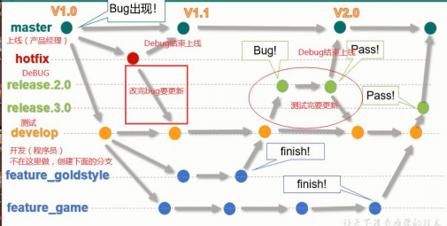
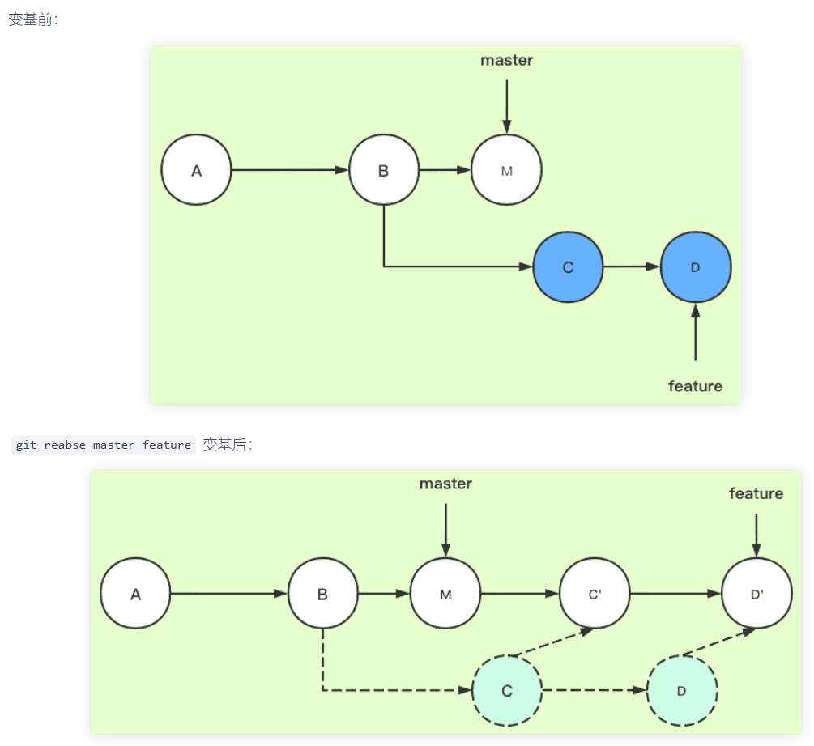

# Git



使用 Git，可以轻松跟踪代码历史记录，查看谁做了哪些更改，并作为一个团队协作编写代码。由于整个 Git 历史记录都存储在共享存储库中，因此 Git 可以防止旧版本的无意覆盖。

## Git 和 SVN

Git 是分布式版本控制工具，可本地系统克隆远端存储库，支持离线提交，基于C语言，push/pull 很快，通过 commit 实现共享。**不依赖于中央服务器来存储项目文件的所有版本。**

SVN 是集中版本控制工具，存储在服务器，仅支持在线提交，push/pull 较慢，不支持共享。

## Git 组件

Git 有 4 个区域：工作区（workspace）、index（暂存区）、repository（本地仓库）和 remote（远程仓库），而工作区就是指对文件发生更改的地方，**更改**通过 git add 存入暂存区，然后由 git commit 提交至本地仓库，最后 push 推送到远程仓库。

**工作目录**包括 .git 子目录（包含仓库所有相关的 Git 修订历史记录）、工作树，或签出的项目文件的副本。

**裸存储库**只包含版本控制信息而没有工作文件（工作树）而且 **.git 子目录中的所有内容存在于主目录**。

**完成提交（commit）前，称为 “staging area（暂存区）” 或 “index（索引）”**。此区域可对其进行格式化和审查。git 会在提交之前触发 pre-commit hook，使用 pre-commit hook 相关的脚行对提交到存储库中的更改执行完整性检查等，不满足可以阻止提交操作。

## 常见工作场景

### 初始化本地仓库

在本地创建一个版本库，将远程仓库克隆到本地:
> 1. `git init` // 初始化本地版本仓库(must do this)  
> 2. `git clone [-b branchName][远程仓库地址]` //克隆远程仓库到本地  
> 3. `cd [projectName]` // 进入项目目录  
> 4. `code.` // VSCode 打开当前项目  
> 5. `git remote [-v]` // 查看远程仓库信息，-v 获取详细信息，远程仓库名一般为 origin,每个分支即 origin 的子目录，例如 master 分支 -> origin/master  

### 创建本地分支并推送关联远程

> 1. `git branch [branchName]` // 创建 branchName 分支  
> 2. `git checkout-b [branchName]` 或 `git switch -c [branchName]` // 创建并切换到 brachName 分支  
>     1. `git push origin [branchName]:[branchName]` // 将新建分支推送到远程(远程分支还不存在)  
>     2. `git branch -set-upstream-to=origin/[branchName]` // 关联远程分支(远程分支已经存在)  

### 查看分支

> - `git branch` // 查看本地分支 list  
> - `git branch -vv` // 查看本地分支 list,以及关联的远程分支  
> - `git log` //查看历史提交信息，输入 q 退出  
> - `git status` // 查看上次提交后的修改信息

### 合并分支

> 1. `git merge [branchName]` // 合并整个 branchName 分支到当前分支  
> 2. `把 Git 合并失败的文件手动编辑为我们希望的内容再提交`  // 解决冲突  
> 3. `git cherry-pick [commitId]` // 仅合并某分支的某一提交到当前分支(commitId,通过命令 git log 查看)，对于 cherry-pick 时会出现 commitId is a merge but no -m option was given，此时需要使用 git cherry-pick [commitId] -m 1 指定主线父编号为 1  
> 4. `合并后检查依赖是否更新，若更新，需 npm install`

### 删除分支

> - `git branch -d [branchName]` // 删除本地分支前先切换到另一个分支，然后成功删除的前提是所有更改都已 push,否则采用 -D 强制删除  
> - `git push origin --delete remoteBranchName` // 删除远程分支  

### 标签管理

标签是版本（标签之于 commitId，类似域名之于 IP） 
> `git tag-a -m [“说明文字”]` // 默认标签打在最新的commit上即 HEAD 上，`git tag` 可以查看所有标签，-a -m 指定特定标签名的说明文字  
> `git show [tagName]` // 查看指定标签的信息  
> `git push origin [tagName]` // 推送一个本地标签(即推送对应 commit)  
> `git push origin --tags` // 推送全部未推送过的本地标签到远程  
> `git tag -d [tagName]` // 删除一个本地标签(如果标签已经推送到远程，和删除分支类似，要删除远程标签得先从本地删除，再删除远程)  
> `git push origin :refs/tags/[tagName]` // 删除一个远程标签  

### push 变更代码的流程

> 1. `git add [枚举变更的文件或 . 添加所有变更]` // 工作区的变更 add 到暂存区，`git add` 之前应查看文件变更，确认无误方 commit。
> 2. `git commit -m ['Commit message 提交说明']` // 提交暂存区到当前本地分支，保证 commit 独立性的前提下，即不同功能之间，不同版本之间的独立性，应及时 commit。`'Commit message 提交说明'` 推荐是：
```shell
# 提交说明类型 type 可以是：
  # feat(新功能(feature)), 
  # fix(修补 bug), 
  # chore(构建过程或辅助工具的变动), 
  # style(格式(不影响代码运行的变动)), 
  # refactor(重构(即不是新增功能，也不是修改bug的代码变动))等
'<type>(<scope>): <subject> 
  // 空一行 
  <body> 
  // 空一行 
  <footer>' 
```
> 3. `git pull` // 拉取远程进行差异对比，可能存在冲突，需解决冲突
> 4. `git push` // push 到远程关联分支

### 开发新 feature 功能

新建一个 feature 分支，并关联远程分支，然后合并到开发分支（如果存在），确定没问题再 MR 合并到 master 分支；

### bug 修复

新建一个 bugfix 分支，并关联远程分支，然后合并到开发分支（如果存在），确定没问题再 MR 合并到 master 分支；

## 常用命令

### git stash

将工作目录（修改后的跟踪文件和暂存的更改）保存在一堆未完成的更改中并且可以随时重新应用这些更改。

### git config

`git config core.ignorecase [boolean]`：是否忽略大小写，默认情况下是 false，除了 git clone 和 git init 会在创建仓库时探测并适当地设置 core.ignoreCase 为 true。如果为 true，这个选项可以启用各种变通方法，使 Git 在不区分大小写的文件系统（如 FAT）上更好地工作。

### git pull 和 git fetch

git pull：从**中央存储库**中提取**特定分支的新更改或提交**，并**更新本地存储库**中的**目标分支**。

git fetch：相同的目的，但工作方式略不同。 git fetch **从所需的分支中提取所有新提交存储在本地存储库中的新分支**中。若要在目标分支中反映这些更改，必须在 git fetch 之后执行 git merge。**只有在对目标分支和获取的分支进行合并后才会更新目标分支。**

**git pull = git fetch + git merge**

**git pull -r 或 git pull --rebase = git fetch + git rebase**

### git merge 和 git rebase

两者都是用于分支合并，关键在 commit 记录的处理上不同：
1. git merge 会新建一个新的 commit 对象，然后两个分支以前的 commit 记录都指向这个新 commit 记录。这种方法会保留之前每个分支的 commit 历史。往主分支上合代码推荐 merge，能清除的知道主线上谁合了的代码以及合代码的时间先后顺序。
2. **`git rebase <baseBranch> [<currentBranch>]`** 会从两个分支的共同祖先开始提取待变基分支上`<currentBranch>` 的修改，然后将待变基分支 `<currentBranch>` 指向基分支 `<baseBranch>` 的最新提交即新基底，最后将刚才提取的修改逐个和新基底处理冲突（`git add .` => `git rebase --continue`）并应用到新基底后面（哈希值也不一样）。rebase 后 commit 记录就变为线性。如果基分支 `<baseBranch>` 上没有新提交，那么就还是用原来的基，rebase 操作相当于无效，此时和 git merge 就基本没区别，差异只在于 git merge 会多一条记录 Merge 操作的提交记录。而且 git rebase 后 git push 需要添加 --force 进行强制推送。rebase 变基操作最适合的是本地开发分支合并到远端对应多人开发分支之前对本地开发分支进行变基，缺点是分支图杂乱，优点是可以实际的看出来合并的提交历史。
3. **`git rebase -i [startPoint] [endPoint]` 合并当前分支的多个commit记录**，前开后闭即`([startPoint]，[endPoint]]`，且应该谨慎使用 `[endPoint]`，省略表示从`[startPoint]`的下一个一直到最后一个，但如果指定 `[starPoint]`, 则表示 `[endPoint]` 后面的 commit 全部不要了。进入 Interact 交互界面后，将 `[startPoint]` 的下一个之后需要合并的连续的 commit 之前的 pick 改成 s，然后进入 commit 信息修改界面，将需要被合并的 commit 信息使用#注释即可。**注意事项：只对尚未推送或未分享给别人的本地修改执行rebase变基操作，清理历史，从不对已推送至别处的提交执行变基操作。**



### git cherry-pick

指定的提交（commit）复制应用于当前分支，并且哈希值不一样：
1. `git cherry-pick <commitHashA> [<commitHashB>]` 转移一个或多个指定的提交到当前分支。
2. `git cherry-pick A..B` 转移从 A 到 B 的所有提交。提交 A 必须早于提交 B，否则命令将失败，但不会报错。
3. `git cherry-pick <branchName>` 将branchName分支的最近一次提交，转移到当前分支。
如果操作过程中发生代码冲突，解决冲突后，先git add .，然后 `git cherry-pick --continue` 让 Cherry pick 过程继续执行。

## 撤销已 push 至远端的 commit

**方式一**，删除或修复新提交中的错误文件，并将其推送到远程存储库：
> git add  
> git commit -m 'message'  
> git push origin main // 使用 --force可以强制退回低版本，否则会报错  

**方式二**，可以使用 `git revert <name of bad commit>` 创建一个新的提交，撤销在错误提交中所做的所有更改。