# npm

包是模块的集合，用于解决某一方面的问题，一个第三方库可以看作一个包，每个包里面包含一个或多个模块。每个包可能有自己的github地址，官网，版本，依赖等等。包管理器（**官方包管理器 npm**，**社区包管理器yarn/pnpm/cnpm**）所要解决的问题：
1. 快速的下载安装包；
2. 卸载包；
3. 优雅的升级包；
4. 避免版本冲突。

## npm CLI

npm init：创建一个package.json文件。-y/--yes跳过调查问卷。

npm install：安装一个包及其依赖的任何包。依赖项的安装按 npm-shrinkwrap.json > package-lock.json > yarn.lock的优先顺序驱动。默认情况下，npm install 将任何指定的包保存到devDependencies中。-D 或 --save-dev: 包将出现在 devDependencies 中。

npm命令合集：

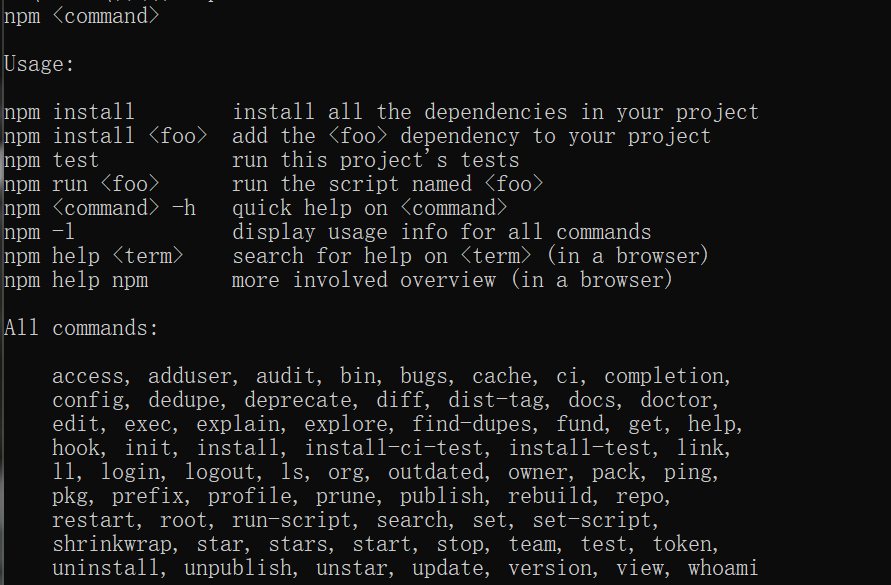

npx运行的时候，会到node_modules/.bin路径和环境变量$PATH里面，检查命令是否存在，可以用来运行不是全局安装或者找不到的 `<command>`。Bash 内置的命令不在$PATH里面，所以不能用。只要 npx 后面的模块无法在本地发现，就会下载同名模块。npx 能避免全局安装模块，会将模块下载到一个临时目录，使用以后再删除。npx 还可以执行 GitHub 上面的模块源码，前提是远程代码必须是一个模块，即必须包含package.json和入口脚本。

## package.json

### 必须属性

1. name: 必须小于等于214个字符，不能以.或_开头，不能有大写字母，因为名称最终成为 URL 的一部分，因此不能包含任何非URL安全字符。 npm官方建议我们不要使用与核心 node模块相同的名称。不要在名称中加 js或 node。如果需要可以使用engines来指定运行环境。name会作为参数传递给 require，因此它应该是简短的，但也需要具有合理的描述性。
2. version：格式为 x.x.x，name 和 version 一起构成一个标识符，该标识符被认为是完全唯一的。每次发布时 version不能与已存在的一致。

```json
{
  "name": "silver-bullet",
  "version": "0.0.1"
}
```

### 描述信息

1. description：用于编写描述信息的字符串。有助于模块在 npm库被搜索发现。
2. keywords：字符串组成的数组，有助于模块在 npm库被搜索发现。
3. homepage：项目的主页地址。
4. bugs：用于反馈项目问题的 issue 地址或者邮箱。
5. author和 contributors：author和 contributors均表示当前项目的共享者。contributors是对象数组，具有 name字段和可选的 url及 email字段。author 可以是具有 name字段和可选的 url及 email字段的对象，或由name, url和email 三部分组成的字符串（"edemao edemao@xx.com (https://edemao.top/)"）。
6. repository：指定一个源代码存放地址。

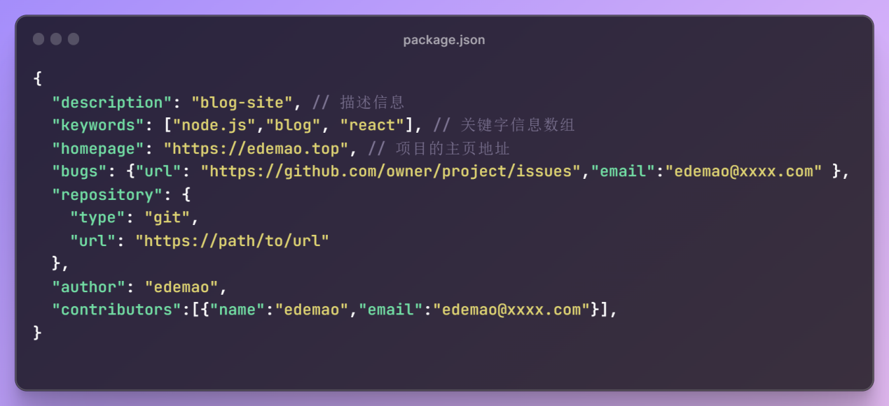

### 依赖配置

1. dependencies和devDependenciesdependencies：指定项目运行所依赖的模块，devDependencies指定项目开发所需要的模块。值对象的每一项为一个键值对，前面是模块名称，后面是对应模块的版本范围。版本号遵循“major.minor.patch”的格式规定（主版本号.次版本号.修补版本号）。**修补版本中的更改表示不会破坏任何内容的错误修复。次要版本的更改表示不会破坏任何内容的新功能。主要版本的更改代表了一个破坏兼容性的大变化。 如果用户不适应主要版本更改，则内容将无法正常工作。**先行版本号及版本编译信息可以加到“主版本号.次版本号.修补版本号”的后面，作为延伸（1.0.0-alpha < 1.0.0-alpha.1 < 1.0.0-alpha.beta < 1.0.0-beta < 1.0.0-beta.2 < 1.0.0-beta.11 < 1.0.0-rc.1 < 1.0.0）。主版本号为零（0.y.z）的软件处于开发初始阶段，一切都可能随时被改变。这样的公共 API 不应该被视为稳定版。
    1. 固定版本：比如 5.3.1，安装时只安装指定版本。
    2. 波浪号：比如 ~5.3.1, 表示安装 5.3.x 的最新版本（不低于5.3.1），但是不安装5.4.x，也就是说安装时不改变大版本号和次要版本号。
    3. 插入号：比如 ˆ5.3.1, ，表示安装 5.x.x 的最新版本（不低于5.3.1），但是不安装 6.x.x，也就是说安装时不改变大版本号。需要注意的是，如果大版本号为 0，则插入号的行为与波浪号相同，这是因为此时处于开发阶段，即使是次要版本号变动，也可能带来程序的不兼容。
    4. latest：安装最新版本。
    
    依赖安装时，--save参数表示写入dependencies，--save-dev表示写入devDependencies。
2. peerDependencies：就是用来供插件指定其所需要的主工具的版本。比如，项目依赖 A 模块和 B 模块的 1.0.0 版本，而 A 模块本身又依赖 B 模块的 2.0.0 版本，用 peerDepedencies 指定 A 模块 使用 B 的时候，必须是 2.0.0 版本：{"name": "A","peerDependencies": {"B": "2.0.0"}}。注意，从npm 3.0版开始，初始化的时候 peerDependencies不会默认带出。
3. bundledDependencies：指定发布的时候会被一起打包的模块。
4. optionalDependencies：可选的项目运行依赖，写法和dependencies一样，不同之处在于如果安装失败不会导致 npm install失败。
5. engines：指明模块运行的平台限制，比如 Node或者 npm的某个版本或者浏览器。

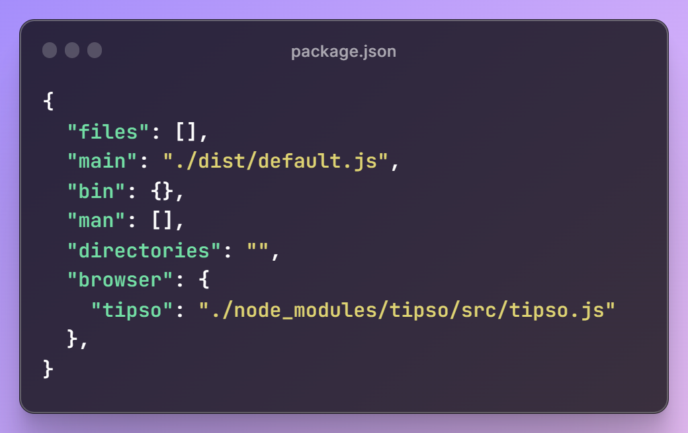

### 文件和目录

1. files：是模块下文件名或者文件夹名构成的数组，如果是文件夹名，则文件夹下所有的文件也会被包含进来（除非文件被另一些配置排除了）。可以在模块根目录下创建一个.npmignore文件，写在这个文件里边的文件即便被写在files属性里边也会被排除在外，个文件的写法与.gitignore类似。
2. browser：指定供浏览器使用的模块版本。指定浏览器打包工具比如 Browserify该打包的文件。
3. main：指定加载的入口文件，require导入的时候会加载这个文件。默认值是模块根目录下面的index.js。
4. man：用来指定当前模块的 man文档的位置。
5. directories：directories制定一些方法来描述模块的结构, 用于告诉用户每个目录在么位置。
6. bin：用来指定每个内部命令对应的可执行文件的位置。node工具必然会用到该字段。当我们编写一个cli工具的时候，需要指定工具的运行命令，比如webpack执行 bin/index.js文件中的代码："bin": { "webpack": "bin/index.js" }。当模块以依赖的方式被安装，如果存在bin选项，会在node_modules/.bin/生成对应的文件，并建立符号链接。由于node_modules/.bin/目录会在运行时加入系统的 PATH 变量，所以 npm run 就可以不带路径，直接通过命令来调用这些脚本文件。所有 node_modules/.bin/ 目录下的命令，都可以用 npm run [命令] 的格式运行。在命令行键入npm run，按tab键会显示所有可以使用的命令。


### 脚本配置

1. scripts：指定了运行脚本命令的 npm 命令行缩写。使用 scripts字段可以快速的执行 shell 命令，可以理解为 alias。scripts可以直接使用node_modules中安装的模块，否则需要使用npx命令才能直接运行："scripts": { "build": "webpack"} // npm run build 相当于 npx webpack。
2. config：用于添加命令行的环境变量。在server.js脚本就可以引用config字段的值。也可以通过npm config set进行修改。

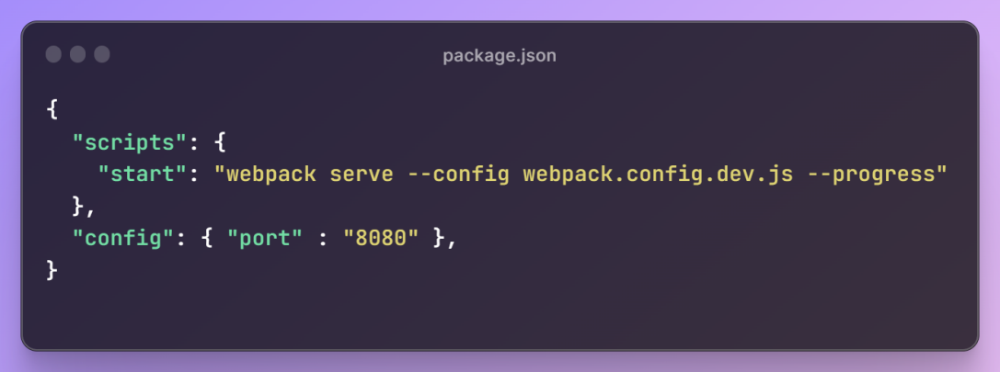

### 发布配置

1. license：当前项目的协议—— 模块使用权限和限制。
2. os：指定模块能运行的操作系统。
3. cpu：限制模块只能在某种架构的cpu下运行。
4. private：布尔值，可以防止一个私有模块被无意间发布，true则 npm拒绝发布它。
5. publishConfig：在模块发布时生效，用于设置发布用到的一些值的集合。如果不想模块被默认标记 tag 为最新的，或者默认发布到公共仓库，可以在这里配置 tag 或仓库地址。如果只想让模块被发布到一个特定的 npm仓库，通常 publishConfig会配合 private来使用。
6. preferGlobal：布尔值，表示当用户不将该模块安装为全局模块时（即不用–global参数），true 表示显示警告。

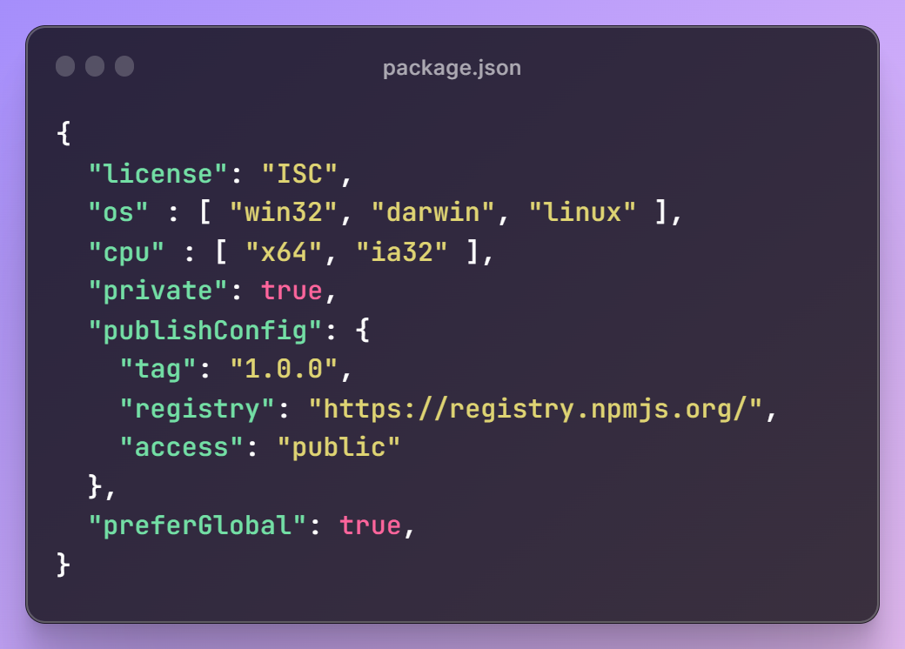

### 第三方配置
1. typings：用来指定TypeScript的入口文件。
2. eslintConfig：eslint的配置可以写在单独的配置文件.eslintrc.json 中，也可以写在package.json文件的eslintConfig配置项中。
3. babel：用来指定Babel的编译配置。
4. unpkg：开启cdn服务。
5. lintstage: lint-staged是一个在Git暂存文件上运行linters的工具，配置后每次修改一个文件即可给所有文件执行一次lint检查，通常配合gitHooks一起使用。
6. gitHooks：gitHooks用来定义一个钩子，在提交（commit）之前执行ESlint检查。在执行lint命令后，会自动修复暂存区的文件。修复之后的文件并不会存储在暂存区，所以需要用git add命令将修复后的文件重新加入暂存区。在执行pre-commit命令之后，如果没有错误，就会执行git commit命令。
7. browserslist：用来告知支持哪些浏览器及版本。Babel、Autoprefixer 和其他工具会用到它，以将所需的 polyfill 和 fallback 添加到目标浏览器。

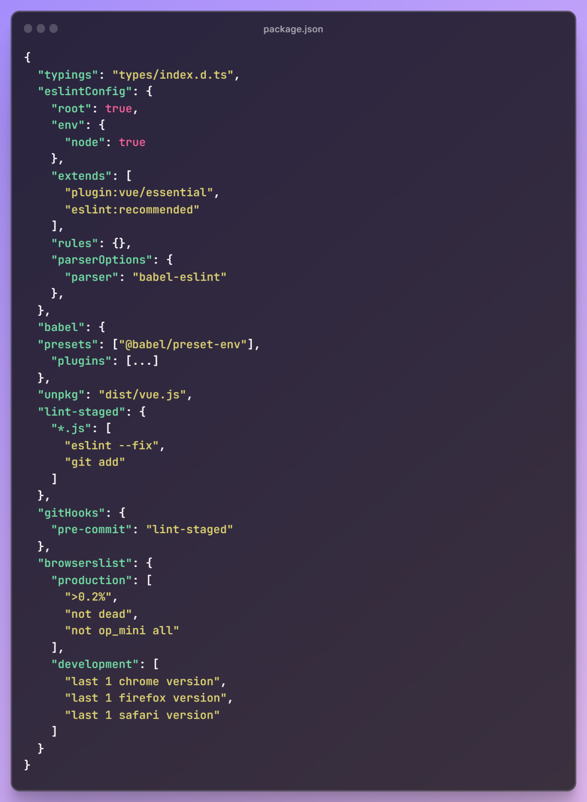

## package-lock.json

package-lock.json 是对整个依赖树进行版本固定，它准确的描述了当前项目npm包的依赖树，并且在随后的安装中会根据 package-lock.json 来安装，不考虑这个过程中是否有某个依赖有小版本的更新，从而保证是依赖树不变。

注意，使用cnpm install时候，并不会生成 package-lock.json 文件，也不会根据 package-lock.json 来安装依赖包，还是会使用 package.json 来安装。

package-lock.json 可能被意外更改的原因：
1. package.json 文件修改了；
2. 挪动了包的位置：将部分包的位置从 dependencies 移动到 devDependencies 这种操作，虽然包未变，但是也会影响 package-lock.json，会将部分包的 dev 字段设置为 true；
3. registry 的影响：安装源 registry 不同，执行 npm i 时也会修改 package-lock.json。使用 npm ci来 而不是 npm i 安装依赖，可以避免异常的修改 package-lock.json。

目前很多项目代码 lockfileVersion = 1，如果不小心更新node > 14，可能会导致 lockfileVersion = 2，而且会出现以下告警（v1=> npm v5 和 v6，v2: => npm v7&v8，向后兼容 v1 锁文件，v3: => npm v7&v8 没有向后兼容性）：

**npm WARN read-shrinkwrap This version of npm is compatible with lockfileVersion@1, but package-lock.json was generated for lockfileVersion@2. I’ll try to do my best with it!**

解决方案：需要在确定升级到 npm 8 和 package-lock.json 2 之前，对 npm 版本进行降级，比如npm install -g npm@6.14.15。如果是在 mac 或 linux 上需要先运行：rm /usr/local/bin/npm && ln -s ~/.npm-packages/bin/npm /usr/local/bin/npm。

## 发布与更新

### 初始化项目

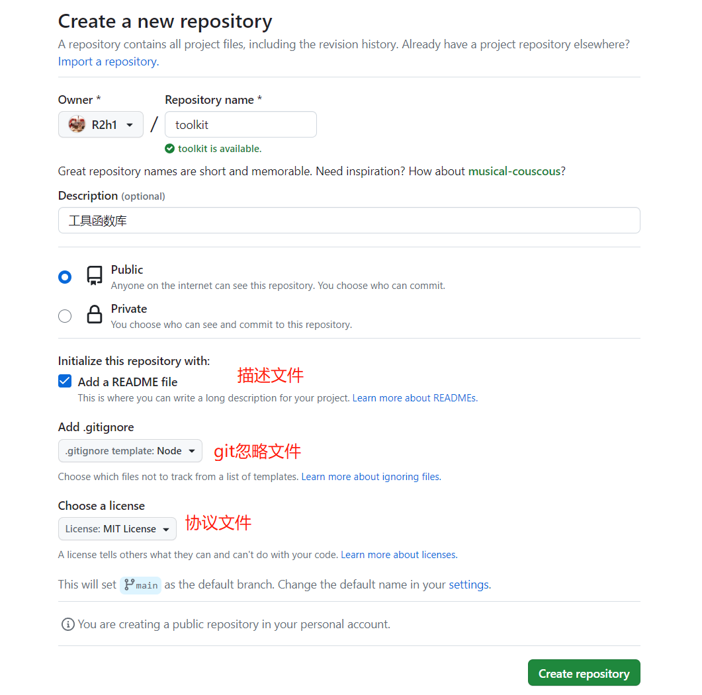

首先在github创建一个仓库，协议选择MIT，gitignore选择Node，添加README.md描述文件。使用git clone将项目克隆到本地。cd 进入目录，使用vscode打开（终端输入code . 命令即可）。

然后创建一个合理的目录结构：

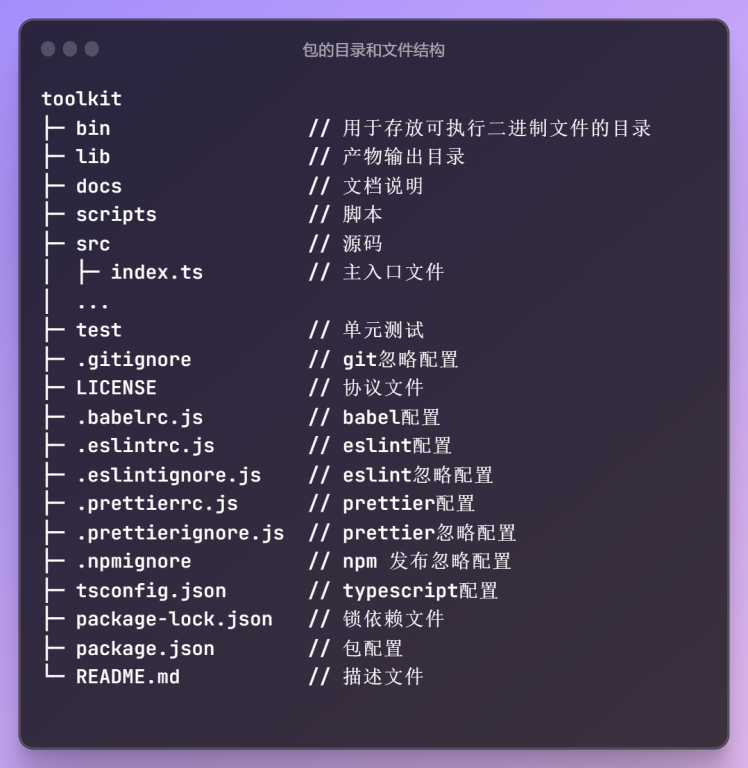

### 配置typescript

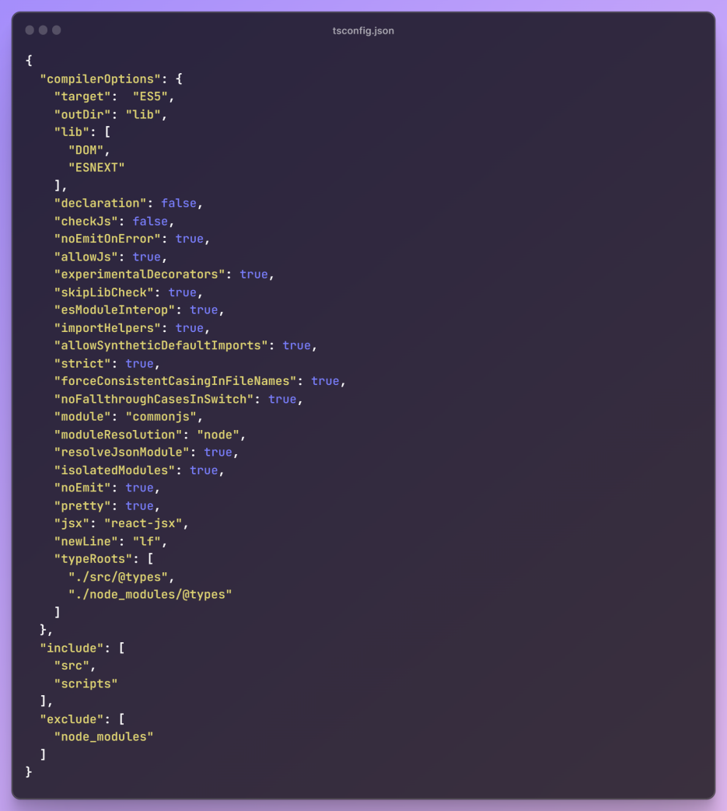

### 统一代码风格

首先，配置 eslint，使用遵循Airbnb推出的JavaScript风格指南的eslint-config-airbnb，eslint-config-airbnb-typescript。

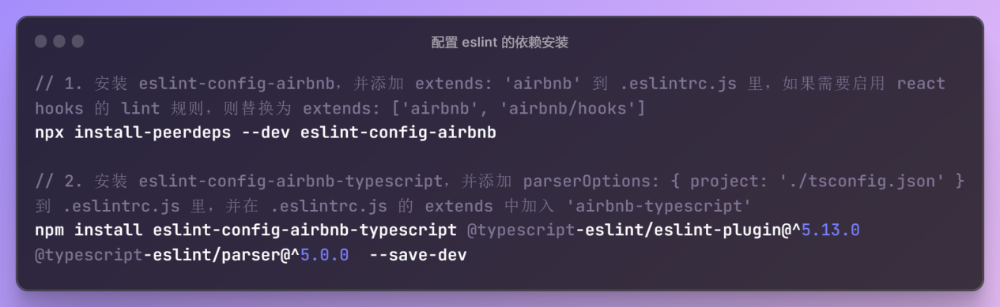

其次，配置prettier，安装依赖prettier，.prettierrc.js的推荐配置如下：

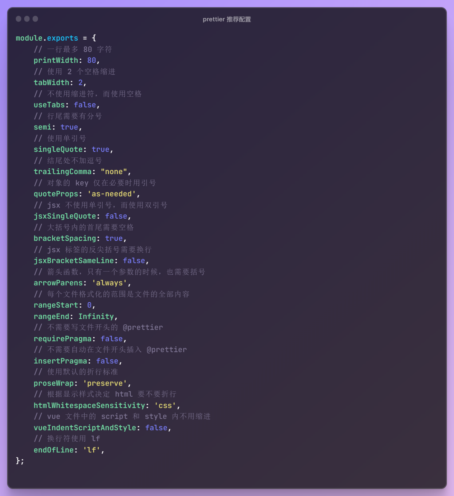

最后，增加git提交校验，安装依赖husky和lint-staged，其中，husky用于git 的hook，lint-staged用于针对暂存的 git 文件运行 linters。

在package.json中配置安装 husky 的命令，以及lint-staged 检查：

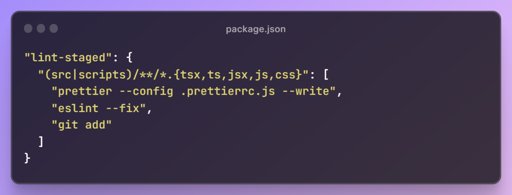

执行npm run prepare 安装 husky，并在生成的.husky/pre-commit文件（如果没有生成，手动创建一个即可）中添加 npx lint-staged 命令：

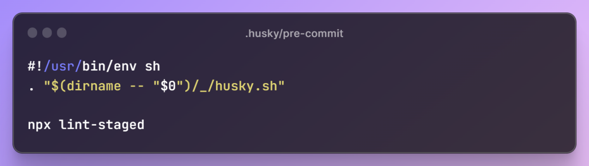

### 配置babel

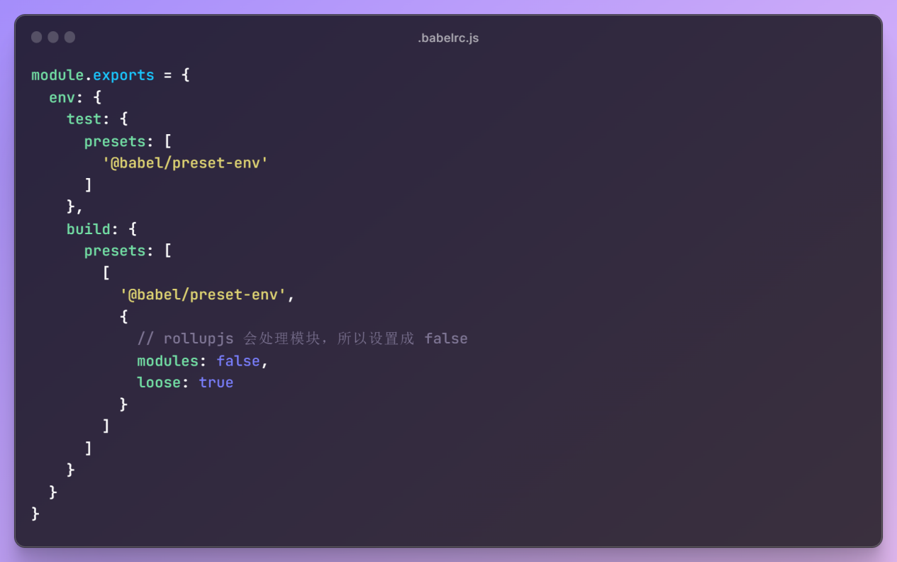

### 配置rollup

如果开发的是工具包，rollup更适合作为打包工具，如果是组件，比如vue组件，则@vue/cli 的 lib 模式更适合。根据开发环境区分不同的配置并在package.json的script中添加脚本命令，输出不同规范的产物：umd、umd.min、cjs、esm。
1. 通用配置rollup.config.base.js

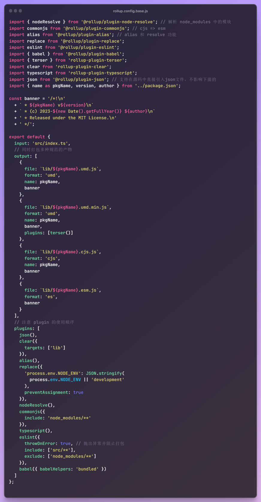

2. 开发环境配置rollup.config.dev.js

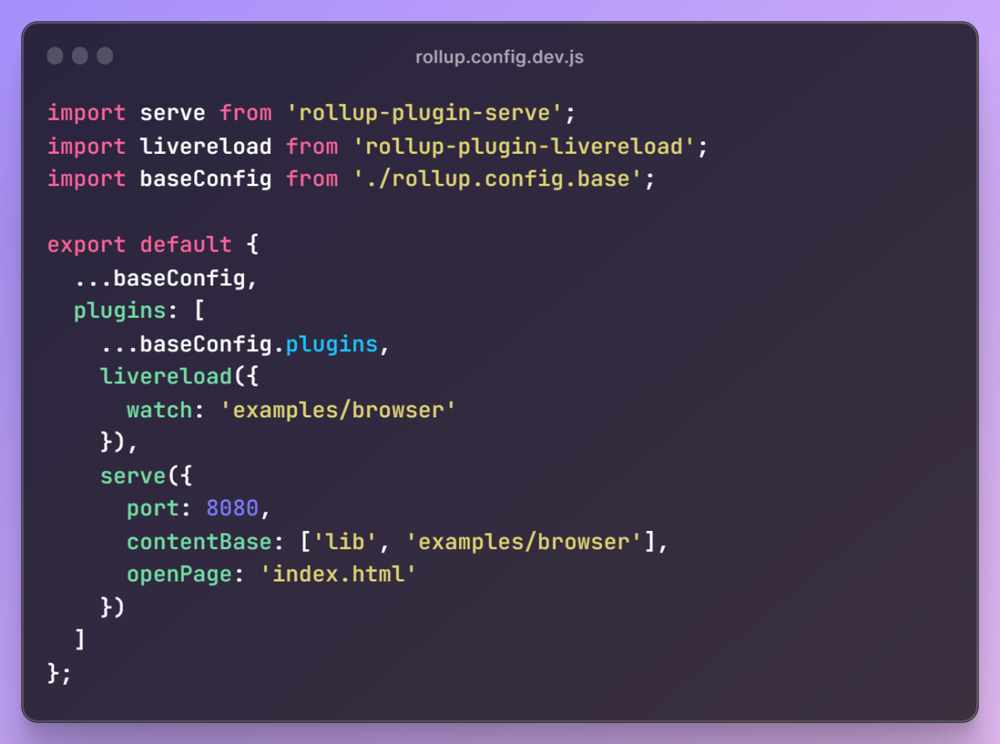

3. 正式环境配置rollup.config.prod.js

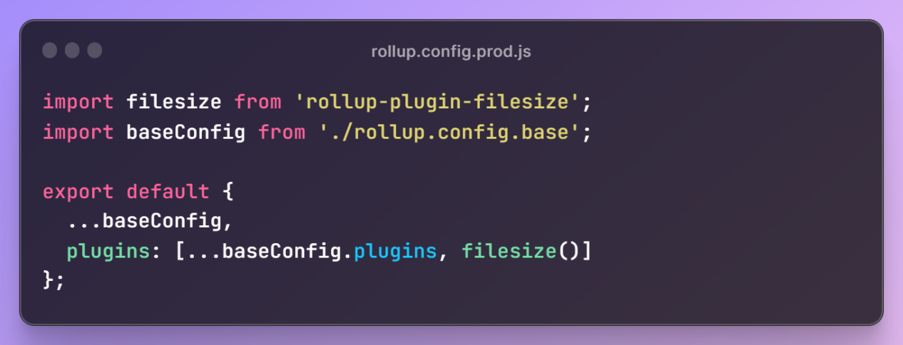

4. 添加开发与打包相关的脚本命令到package.json，借助npm-run-all 依赖，npm run build按顺序执行z，buildjs，buildts。

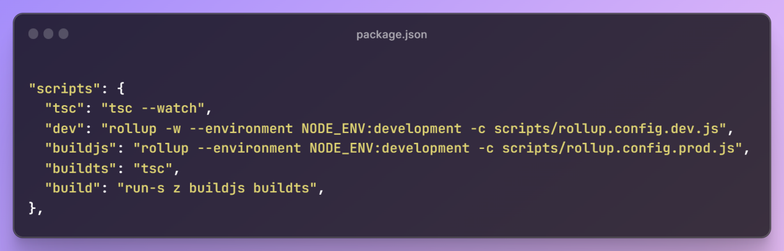

5. 添加支持tree shaking 的配置到package.json中。

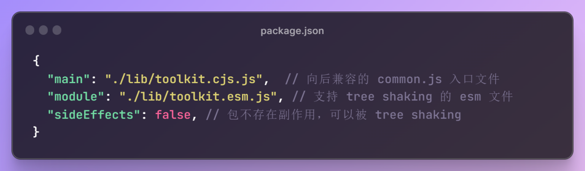

### 发布到npm

添加发布到npm时需要忽略的文件与目录的配置，即 .npmignore。

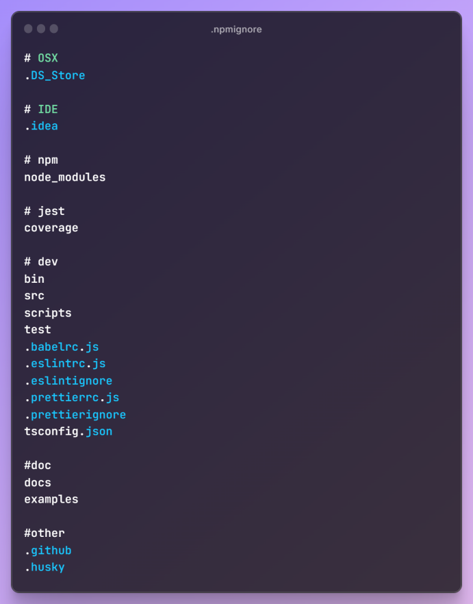

添加发布相关的脚本命令到package.json中，其中 npm --no-git-tag-version version 分别修改版本号中的major，minor，patch。

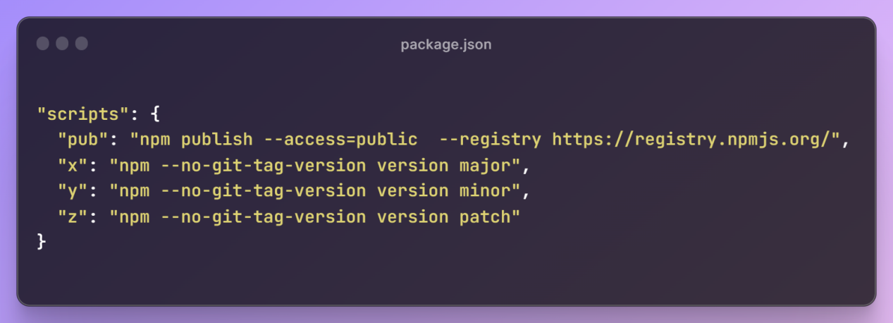

然后登录npm官网（npm login --registry https://registry.npmjs.org/），登录成功后，直接发布即可（npm publish --registry https://registry.npmjs.org/）。

发布过程中常见的报错：
1. 400：版本问题，修改package.json的version即可；
2. 401：npm源设置成第三方源（淘宝源）的时候发生的，比如我们经常会将镜像源设置成淘宝源。因此在发布时，应该使用默认的npm源登录，即npm login --registry https://registry.npmjs.org/；
3. 403：包名重复，修改包名重新发布。

