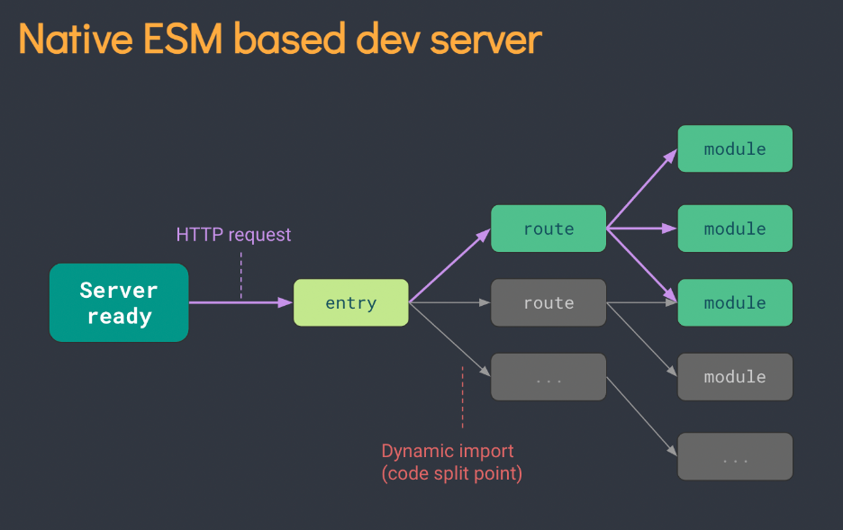

# Vite

# 为什么选择 vite

webpack:

vite:

1. 开发服务器启动：当冷启动开发服务器时，基于打包器的方式启动必须优先抓取并构建整个应用，然后才能提供服务。而Vite首先将应用中的模块区分为**依赖**和**源码**两类。**对于依赖**，大多为在开发时不会变动的纯 JavaScript，Vite 将会使用 esbuild 预构建依赖，Go比以 Node.js 编写的打包器预构建依赖更快。**对于源码**，通常是会被编辑且需要转换的非JavaScript文件（比如jsx、tsx、css,、vue），Vite 以 原生 ESM 方式提供源码，让浏览器接管了打包程序的部分工作，Vite只需要在浏览器请求源码时进行转换并按需提供源码。
2. 模块热替换：打包器支持了模块热替换（HMR），会将构建内容存入内存，这样它们只需要在文件更改时使模块图的一部分失活，但它也仍需要整个重新构建，因此即使采用了 HMR 模式，其热更新速度也会随着应用规模的增长而显著下降。而在Vite 中，HMR 是在原生 ESM 上执行的。当编辑一个文件时，Vite 只需要精确地使已编辑的模块与其最近的 HMR 边界（大多数是模块本身）之间的链接失活。使得无论应用大小如何，HMR 始终能保持快速更新。
3. 缓存：Vite 同时利用 HTTP 头来加速整个页面的重新加载（再次让浏览器做更多事情）：源码模块的请求会根据 304 Not Modified 进行协商缓存，而依赖模块请求则会通过 Cache-Control: max-age=31536000,immutable 进行强缓存，因此一旦被缓存它们将不需要再次请求。
4. 生产环境的构建：原生ESM由于嵌套导入会导致额外的网络往返，在生产环境中发布未打包的 ESM 仍然效率低下（即使使用 HTTP/2），为了在生产环境中获得最佳的加载性能，最好还是将代码进行 tree-shaking、懒加载和 chunk 分割（以获得更好的缓存），Vite使用的是Rollup，因为esbuild对于css和代码分割不是很友好。
5. 生态不如webpack