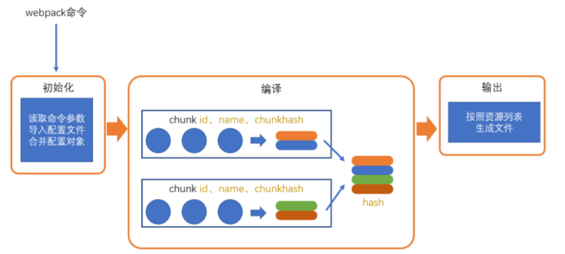
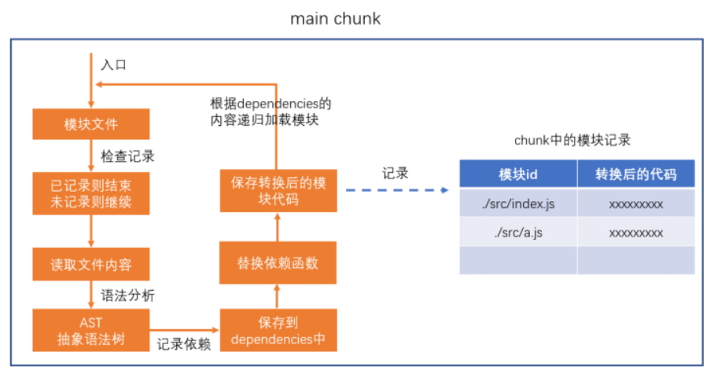
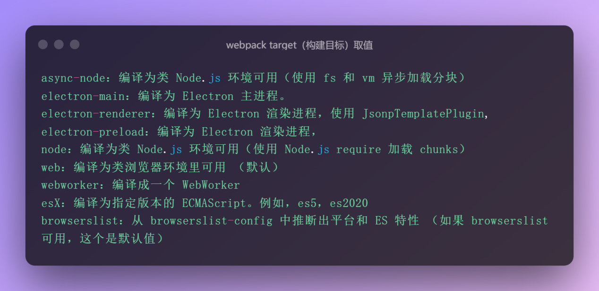

# webpack

Webpack核心能力：
1. 打包压缩（js混淆防止源码被利用），减少网络传输；
2. 文件指纹，合理利用http缓存；
3. 开发服务器，热更新，改善开发体验。

Webpack 的好处：
1. 可以使用任意模块化标准，无须担心兼容性问题。
2. 可以将非JS视为模块，使得对css、图片等资源进行更细粒度的控制。
3. 前端开发也能使用npm，webpack不会运行源代码，而是作为依赖，最终合并打包。
4. 非常适合开发单页应用。

webpack会非常暴力的将public目录中除页面模板（index.html）的文件复制到打包结果中。

除 JS 和 css 模块外，其他模块被视为资源模块。webpack 是无法识别 JS 中直接书写的路径字符串的，只有通过模块化的方式导入资源，资源才会被视为模块，webpack 才能将该资源的原始路径转换为打包结果的真实路径。

## 核心概念

###  bundle，chunk，module

**bundle**：是由webpack打包出来的可在浏览器直接运行的⽂件；chunk是无法在打包结果中看到的，打包结果中看到的是bundle。

**chunk**：代码块，⼀个chunk由多个模块组合⽽成，⽤于代码的合并和分割；简单来说，它表示通过某个入口模块找到的所有依赖的统称。每个chunk都至少有两个属性：
1. name：默认是main；
2. id：开发环境和name相同，生产环境是一个数字，从 0 开始。

**module**：是开发中的单个模块，在webpack的世界，⼀切皆模块，⼀个模块对应⼀个⽂件，webpack会从配置的 entry中递归开始找出所有依赖的模块。

**module 就是没有被编译之前的代码，通过 webpack 的根据文件引用关系生成 chunk 文件，webpack 处理好 chunk 文件后，生成运行在浏览器中的代码 bundle。**

### 构建流程





Webpack 的运⾏（编译、构建或打包）流程是⼀个串⾏的过程，从启动到结束会依次执⾏以下流程： 
1. **初始化**参数：从配置⽂件和 Shell 语句（CLI）中读取与合并参数并与默认配置融合，得出最终的参数；依托第三方库yargs完成。
2. 开始编译：⽤上⼀步得到的参数初始化 Compiler 对象，加载所有配置的插件，执⾏对象的 run ⽅法开始执⾏编译； 
3. 确定⼊⼝：根据配置中的 entry 找出所有的⼊⼝⽂件； 
4. **编译**模块：**从⼊⼝⽂件出发，调⽤所有配置的 Loader 对模块进⾏翻译（语法分析转换为AST），再找出该模块依赖的模块进行记录，再递归本步骤直到所有⼊⼝依赖的⽂件都经过了本步骤的处理；**
5. 完成模块编译：在经过第4步使⽤ Loader 翻译完所有模块后，得到了每个模块被翻译后的最终内容以及它们之间的依赖关系； 
6. **输出**资源：根据⼊⼝和模块之间的依赖关系，组装成⼀个个包含多个模块的 Chunk，再把每个 Chunk 转换成⼀个单独的⽂件加⼊到输出列表，这步是可以修改输出内容的最后机会； 
7. 输出完成：在确定好输出内容后，根据配置确定输出的路径和⽂件名，把⽂件内容写⼊到⽂件系统。

在以上过程中，Webpack 会在特定的时间点⼴播出特定的事件，插件在监听到感兴趣的事件后会执⾏特定的逻辑，并且插件可以调⽤ Webpack 提供的 API 改变 Webpack 的运⾏结果。

**target 配置选项是构建目标**，指定构建出对应运行环境的代码。默认值为 "browserslist"，如果没有找到 browserslist 的配置，则默认为 "web"。虽然 webpack 不支持 向 target 属性传入多个字符串，但是可以通过设置两个独立配置（module.exports = [serverConfig, clientConfig];），来对 library 进行多套构建。



### mode 模式

提供 mode 配置选项，告知 webpack 使用相应模式的内置优化。Webpack4+ 支持，取值有 'none' | 'development' | 'production'，默认值是 'production'。

```javascript
// webpack.development.config.js
module.export = {
  mode: 'development'
}

// webpack.production.config.js
module.export = {
  mode: 'production'
}

// webpack.custom.config.js
module.export = {
  mode: 'none'
}
```

1. **development**：
    1. 会将 DefinePlugin 中 process.env.NODE_ENV 的值设置为 development。
    2. 启用 NamedChunksPlugin 和 NamedModulesPlugin 为所有的module（源文件）和chunk（构建输出的文件）定义一个名字。方便于浏览器调试；可以快速地对增加的内容进行编译；提供了更精确、更有用的运行时错误提示机制。
2. **production**：
    1. 会将 DefinePlugin 中 process.env.NODE_ENV 的值设置为 production。
    2. 启用插件（最后一个为非内置插件）：
        1. FlagDependencyUsagePlugin：检测并标记模块之间的从属关系；
        2. FlagIncludeChunksPlugin：可以让 Webpack 根据模块间的关系依赖图中，将所有的模块连接成一个模块；
        3. ModuleConcatenationPlugin：告诉 Webapck 去清除一个大的模块文件中的未使用的代码，这个大的文件模块可以是自定义的，也可以是第三方的（注意：一定要 package.json 文件中添加 "sideEffects": false）；
        4. NoEmitOnErrorsPlugin；
        5. OccurrenceOrderPlugin；
        6. SideEffectsFlagPlugin：告知 Webapck 各个模块间的先后顺序，这样可以实现最优的构建输出；
        7. TerserPlugin：替代 uglifyjs-webpack-plugin 插件。它的作用依然是对构建输出的代码进行压缩。
3. **none：不使用任何默认优化选项，即启动 Webpack 打包时关闭默认的内置插件。**

```javascript
/**
 * 如果要根据 webpack.config.js 中的 mode 变量更改打包行为，则必须将配置导出为函数
 */
const config = {
  entry: './app.js',
  // ...
}
module.exports = (env, argv) => {
  if (argv.mode === 'development') {
    config.devtool = 'source-map';
  }
  if (argv.mode === 'production') {
    // ...
  }
  return config;
}
```
