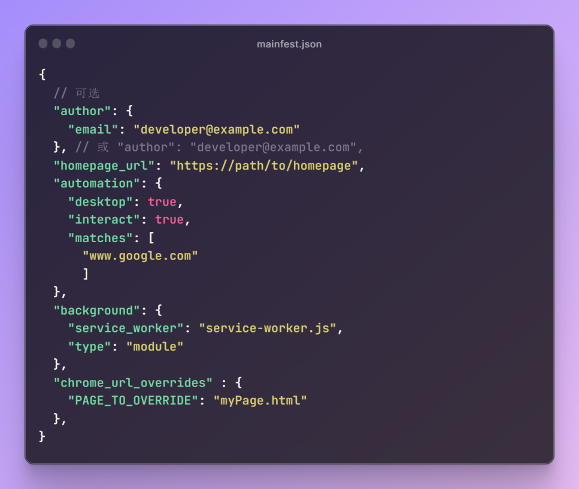

# 扩展开发

## vscode extension（vscode扩展）

VS Code内置了一套扩展API。
扩展API提供的常用功能，即在任何扩展中都能使用的核心功能，包括：
1. 注册命令、配置、快捷键绑定、菜单等。
2. 保存工作区或全局数据。
3. 显示通知信息。
4. 使用快速选择获得用户输入。
5. 打开系统的文件选择工具，以便用户选择文件或文件夹。
6. 使用进度API提示耗时较长的操作。

其他功能：
1. 主题：控制着VS Code的外观——编辑器中的源代码的颜色和VS Code UI颜色。
2. 声明式语言特性：添加了基础的编程语言编辑支持，如括号匹配、自动缩进和语法高亮。
3. 编程式添加语言特性：暴露于vscode.languages.*API中，可以为编程语言添加更为丰富的特性，如：悬停提示、转跳定义、错误诊断、IntelliSense和CodeLens。
4. 扩展工作台：加强了 VS Code 工作台的UI，为资源管理侧边栏添加了新的右击行为，甚至可以用 TreeViewAPI构建自定义的资源管理侧边栏。如果扩展需要完全自定义用户界面，那就使用Webview API和HTML，CSS，Javascript构建自己的UI。
5. 调试：支持特定运行时的调试。

### 术语解释

1. Activation Events：激活事件，用于激活插件的VS Code事件钩子。
2. Contribution Points：发布内容配置点，package.json的一部分，用于配置插件启动命令、用户可更改的插件配置，可以理解为插件的主要配置文件。
3. Debug Adapter：调试适配器，连接真正的调试程序（或运行时）和调试界面的插件称之为调试适配器。VS Code没有原生调试程序，而是依赖【调试器插件】调用通信协议（调试适配器协议）和VS Code的调试器界面实现。
4. Extension Manifest：插件清单，VS Code自定义的pacakge.json文件，其中包含着插件的入口、配置等重要信息。
5. Extensibility：扩展性。
6. Extension Host：扩展主机，与VS Code主进程隔离的插件进程，插件运行的地方，开发者可在这个进程中调用VS Code提供的各类API。扩展没有权限访问VS Code UI的底层DOM，禁止添加自定义的CSS 和 HTML片段到VS Code UI上。
7. Language Servers：语言服务器，插件模式中使用C/S结构的的服务器端，用于高消耗的特殊插件场景，如语言解析、智能提示等。与之相对，客户端则是普通的插件，两者通过VS Code 的API进行通信。
8. Language Identifier：语言标识符，定义在发布内容配置的特定标识/名称，便于后续引用该语言配置。通常为某种编程语言的通俗名称，如JavaScript的语言标识符是【javascript】，Python的语言标识符是【python】。

### 扩展开发

首先请安装好Node.js和Git，然后使用npm install -g yo generator-code安装Yeoman和VS Code Extension Generator。

使用命令yo code即运行生成器/脚手架，生成一个扩展项目。使用命令code ./projectName 则vscode 打开项目，按下F5则立即看到一个插件开发主机窗口，其中就运行着插件。

命令Ctrl+Shift+P调出命令面板，并输入Hello World命令，如果右下角出现Hello World提示弹窗则成功创建。

### 好用的扩展合集

1. any-rule 正则大全。
2. Regex Previewer 在右侧并列文档中显示当前正则表达式的匹配结果。
3. Sass/Less/Stylus/Pug/Jade/Typescript/Javascript Compile Hero Pro 支持自动编译Less, Scss, Typescript, Jsx 等文件。
4. Blackbox AI Code Generation, Code Chat, Code Search  AI 编码助手

## browser extension（浏览器扩展）

### chrome 扩展

以Chrome扩展为例，因为Chrome占有率更高，开发更简单，而且可以运行在Firefox浏览器和webkit内核的浏览器。Chrome扩展是一个用Web技术开发、用来增强浏览器功能的软件，它其实就是一个由HTML、CSS、JS、图片等资源组成的一个.crx（即Chrome Extension）后缀的压缩包。Chrome扩展还可以配合C++编写的dll动态链接库实现一些更底层的功能，比如全屏幕截图。Chrome扩展提供包括但不限于书签控制、下载控制、窗口控制、标签控制、网络请求控制、各类事件监听、自定义原生菜单、完善的通信机制等实用API，实现增强浏览器功能。

### 开发与调试

插件管理页面可以通过在地址栏输入chrome://extensions 访问或右上角菜单（三个点）->更多工具->扩展程序可以进入。插件管理页面中右上角勾选**开发者模式**即可加载已解压的扩展程序，否则只能通过Chrome应用商店进行安装。开发中，代码有任何改动都必须在插件管理页按Ctrl+R重新加载扩展，同时最好也刷新一下标签页。

### manifest.json

每个扩展程序的根目录中都必须一个manifest.json文件，用于提供重要的配置信息。
1. 必需字段：
    1. manifest_version：Chrome 网上应用商店不再接受清单V2扩展，目前新扩展其值只能是3；
    2. name：简短的纯文本字符串（最多 45 个字符），用于标识扩展。它显示在以下位置：
        1. 安装对话框
        2. 扩展页面 (chrome://extensions)
        3. Chrome 网上应用店
    3. version：1到4个使用点分隔的整数字符串，用于标识此扩展的版本；如果发布的扩展的版本字符串比安装的扩展新，那么扩展会自动更新。版本字符串的规则：
        1. 整数必须介于 0 和 65535 之间（含）。
        2. 非零整数不能以 0 开头。
        3. 它们不能全为零。
    
    

2. 推荐字段：
    1. action：指定 Google Chrome 工具栏中的扩展程序图标。而且清单中声明后才能使用chrome.actionAPI 来控制 Chrome 用户界面中扩展程序的工具栏按钮。
        1. default_popup：当用户单击工具栏中扩展的操作按钮时，将显示操作的弹出窗口。弹出窗口可以包含您喜欢的任何 HTML 内容，并且会自动调整大小以适合其内容。弹出窗口不能小于 25x25，也不能大于 800x600。弹出窗口最初是根据 manifest.json 文件中 action 键的 default_popup 属性设置的。如果存在，这应该指向扩展目录中的相对路径。它还可以使用 action.setPopup() 方法动态更新以指向不同的相对路径。
    2. default_locale：定义支持多语言环境的扩展的默认语言。此字段对于本地化扩展（具有 _locales 目录的扩展）是必需的，但在没有 _locales 目录的扩展中必须不存在。
    3. description：描述扩展的纯文本字符串（无 HTML 或其他格式；不超过 132 个字符）。
    4. icons：代表扩展或主题的一个或多个图标。对象形式，键名即尺寸，值即图片路径。应该始终提供 128x128 的图标它在安装期间和 Chrome 网上应用店使用。还应提供一个 48x48 图标，用于扩展程序管理页面 (chrome://extensions)。还可以指定一个 16x16 图标用作扩展页面的图标。图标一般应该是PNG格式，因为PNG对透明度的支持最好。然而，它们可以是 Blink 支持的任何光栅格式，包括 BMP、GIF、ICO 和 JPEG。但是不支持 WebP 和 SVG 文件。

    

3. 可选字段：
    1. author: 它接受一个带有“email”键的对象或纯文本字符串。将 CRX 文件发布到 Chrome 网上应用商店时，此字符串必须与用于发布扩展程序的帐户的电子邮件地址相匹配。
    2. homepage_url：有效主页 URL 字符串。开发人员可以选择将扩展程序的主页设置为个人或公司网站。如果该参数未定义，则默认主页将是扩展程序管理页面 (chrome://extensions) 上列出的扩展程序的 Chrome Web Store 页面。如果在自己的站点上托管扩展程序，则此字段特别有用。
    3. automation：只能在开发版本上公开访问。包含字段才允许访问chrome.automation API，公开访问浏览器的自动化（可访问性）树，可用于通过检查名称、角色和状态、侦听事件以及以编程方式与页面交互在节点上执行操作。该键接受具有以下属性的对象：desktop、interact和matches。如果未指定匹配项matches，则将在扩展程序具有host权限或activeTab 权限的站点上授予automation权限。
        1. desktop：布尔值，用于控制对 getDesktop() 和与桌面相关的辅助功能事件的访问。
        2. interact：布尔值，返回此扩展可以从中请求自动化树的hosts列表。
        3. matches：字符串 URL 数组，确定是否允许扩展对自动化树进行交互式访问 (true) 或只读访问 (false)。
    4. background：指定扩展的中央事件处理程序，即extension service worker。extension service worker在需要时加载，在休眠时卸载。加载后，extension service worker通常会在主动接收事件时运行，尽管它可以关闭。extension service worker无法访问 DOM，但可用于offscreen documents。extension service worker不仅仅是网络代理。除了标准的 service worker 事件外，它们还响应扩展事件，例如导航到新页面、单击通知或关闭选项卡。更新 extension service worker只能通过将新版本的扩展程序发布到 Chrome 网上应用店。
        1. service_worker：属性指定单个 JavaScript 文件
        2. type：要使用import语句和importScripts()方法，需要声明为module。
    
    当从 Chrome 网上应用店安装或更新 Service Worker 时，或者当使用chrome://extensions加载或更新解压的扩展程序时，就会发生安装。按顺序触发ServiceWorkerRegistration.install、chrome.runtime.onInstalled（当扩展程序（不是 service worker）首次安装时、扩展程序更新到新版本时以及 Chrome 更新到新版本时都会触发）、ServiceWorkerRegistration.active三个事件。如果 extension service worker 空闲至少 30 秒，它就会关闭。
    
    extension service workers 中的事件处理程序需要在全局范围内声明，这意味着它们应该位于脚本的顶层，而不是嵌套在函数中。这可确保它们在初始脚本执行时同步注册，从而使 Chrome 能够在服务工作线程启动后立即将事件分派给它。

    5. chrome_url_overrides：配置替换 Google Chrome 默认的bookmarks（书签管理器）或history（历史记录）或newtab（新标签）页面其中之一的HTML文件。
    6. content_scripts：是在web页面上下文中运行的文件，可以是JS或CSS。通过使用标准文档对象模型(DOM)，他们能够读取浏览器访问的网页的详细信息，对其进行更改，并将信息传递给他们的父扩展。Content scripts可以静态声明(content_scripts字段)、动态声明（chrome.scripting.registerContentScripts）或以编程方式注入（chrome.scripting.executeScript）。
    
    