# Vue

## 模板语法

Vue使用基于 HTML 的模板语法，能声明式地将其组件实例的**数据绑定**到DOM。所有Vue 模板可以被符合规范的浏览器和 HTML 解析器解析。Vue 会将模板编译成高度优化的 JavaScript 代码。结合响应式系统，当应用状态变更时，Vue 能够智能地推导出需要重新渲染的组件的最少数量，并应用最少的 DOM 操作。也支持使用JSX手写渲染函数，但不会享受到和模板同等级别的编译时优化。

Vue在所有的数据绑定中都支持完整的 JavaScript 表达式，表达式都会被作为 JavaScript，以当前组件实例为作用域解析执行。**每个绑定仅支持单一表达式，即一段能够被求值的 JavaScript 代码，一个简单的判断方法是是否可以合法地写在 return 后面**。因此，可以在绑定的表达式中使用组件暴露的方法，但绑定在表达式中的方法在组件每次更新时都会被重新调用，因此不应该产生任何副作用，比如改变数据或触发异步操作。

模板中的表达式将被沙盒化，仅能够访问到暴露的有限的常用内置全局对象列表。然而可以自行在app.config.globalProperties上显式地添加它们，供所有的Vue表达式使用。

**模板数据绑定形式**：
1. 最基本的数据绑定形式是文本插值，“Mustache”语法（即双大括号）。双大括号标签会被替换为对应组件实例的属性值，且被解析为纯文本，同时每次属性更改时它也会同步更新。
2. Vue指令（以v-开头的特殊attribute）attribute绑定，其中响应式绑定元素的Attribute使用v-bind指令（简写为“ ：”），该指令指示Vue将元素的attribute与组件的属性值保持一致：
    1. 布尔型attribute依据true / false值来决定attribute是否应该存在于该元素上。当对应的组件的属性值是真值或一个空字符串时，元素会包含这个attribute，而当其为其他假值时attribute将被忽略。
    2. 如果绑定的值是null或者undefined，那么该attribute将会从渲染的元素上移除。
    3. 动态绑定多个值，通过不带参数（即冒号与等号之间）的v-bind将一个包含多个attribute的 JavaScript 对象绑定到单个元素上。

## 指令

指令attribute的期望值为一个 JavaScript 表达式（v-for、v-on 和 v-slot例外）。一个指令的任务是在其表达式的值变化时响应式地更新DOM。某些指令会需要一个“参数”，在指令名后通过一个冒号隔开做标识。指令参数上也可以使用一个JavaScript表达式包含在一对方括号内作为动态参数，它作为JavaScript表达式被动态执行，计算得到的值会被用作最终的参数：
1. 动态参数中表达式的值应当是一个字符串，或者是 null。特殊值 null 意为显式移除该绑定。其他非字符串的值会触发警告。
2. 动态参数表达式存在语法限制，比如空格和引号在HTML attribute名称中都是不合法的，如果需要传入一个复杂的动态参数，推荐使用计算属性替换复杂的表达式。
3. 当使用 DOM 内嵌模板 (直接写在 HTML 文件里的模板) 时，需要避免在名称中使用大写字母，因为浏览器会强制将其转换为小写。单文件组件内的模板不受此限制。
修饰符是指令参数中以点开头的特殊后缀，表明指令需要以一些特殊的方式被绑定。.prevent 修饰符会告知 v-on 指令对触发的事件调用 event.preventDefault()。

### v-html和v-text

v-html 指令，更新元素的 innerHTML，期望的绑定值类型为string。
若想插入 HTML需要使用 v-html 指令，在当前组件实例上，将元素的 innerHTML 与 v-html对应的属性保持同步。不能使用 v-html 来拼接组合模板，因为 Vue 不是一个基于字符串的模板引擎。在使用 Vue 时，应当使用组件作为 UI 重用和组合的基本单元。在网站上动态渲染任意 HTML 是非常危险的，因为这非常容易造成 XSS 漏洞。请仅在内容安全可信时再使用 v-html，并且永远不要使用用户提供的 HTML 内容。

### v-if和v-show

v-if 指令用于条件性地渲染一块内容。这块内容只会在指令的表达式返回真值时才被渲染。v-else-if 提供的是相应于 v-if 的“else if 区块”。它可以连续多次重复使用。也可以使用 v-else 为 v-if 添加一个“else 区块”。一个 v-else 或v-else-if元素必须跟在一个 v-if 或者 v-else-if 元素后面，否则它将不会被识别。可以在 `<template>` 元素上使用 v-if/v-else-if/v-else，该 `<template>` 元素作为多个元素的包装器，且不包含在最终渲染的结果中。**v-if 是真正的条件渲染，是惰性的，直到条件第一次为真才会渲染条件块，条件为假则条件块内的事件监听器和子组件被销毁，存在更高的切换开销，所以适合运行时条件切换少的场景**。

v-show用法基本类似，不同之处在于 v-show 会在 DOM 渲染中保留该元素；v-show 仅切换了该元素上名为 display 的 CSS 属性，且不能在 `<template>`上使用。**v-show 实际是基于CSS的display属性进行切换，无论初始条件如何都会渲染，更高的初始渲染开销，所以适合条件切换频繁的场景。**

### v-if 和 v-for

v-for 指令基于一个数组来渲染一个列表。v-for 指令的值需要使用 item in items 形式的特殊语法，其中 items 是源数据的数组，而 item 是迭代项的别名。v-for 也支持使用可选的第二个参数表示当前项的位置索引（v-for="(item, index) in items"）。每个 v-for 作用域都可以访问到父级作用域。也可以使用 of 作为分隔符来替代 in。也可以使用 v-for 来遍历一个对象的所有属性，遍历的顺序会基于对该对象调用 Object.keys() 的返回值来决定，三个参数分别是属性值，属性名，位置索引。v-for 可以直接接受一个整数值num，会将该模板基于 1...num 的取值范围重复多次。也可以在 `<template>` 标签上使用 v-for 来渲染一个包含多个元素的块。

Vue 默认按照“就地更新”的策略来更新通过 v-for 渲染的元素列表。当数据项的顺序改变时，Vue 不会随之移动 DOM 元素的顺序，而是就地更新每个元素，确保它们在原本指定的索引位置上渲染。默认模式是高效的，但只适用于列表渲染输出的结果不依赖子组件状态或者临时 DOM 状态 (例如表单输入值) 的情况。为了使得可以跟踪每个节点，从而重用和重新排序现有的元素，需要为每个元素对应的块提供一个唯一的 key attribute。当使用 `<template v-for>` 时，key 应该被放置在 `<template>` 容器上。推荐在任何可行的时候为 v-for 提供一个 key attribute，除非所迭代的 DOM 内容非常简单 (例如：不包含组件或有状态的 DOM 元素)，或者有意采用默认行为来提高性能。key 绑定的值期望是一个基础类型的值，例如字符串或 number 类型。不要用对象作为 v-for 的 key。

可以直接在组件上使用 v-for，也需要提供key。但是，这不会自动将任何数据传递给组件，因为组件有自己独立的作用域。为了将迭代后的数据传递到组件中，还需要传递 props。不自动将 item 注入组件的原因是，这会使组件与 v-for 的工作方式紧密耦合。明确其数据的来源可以使组件在其他情况下重用。

Vue 能够侦听响应式数组的变更方法，并在它们被调用时触发相关的更新。这些变更方法包括：push、pop、shift、unshift、splice、sort、reverse。变更方法，就是会对调用它们的原数组进行变更。而对于非变更方法filter、concat 、slice，即不会更改原数组，而总是返回一个新数组，需要将旧的数组替换为新的。由于Vue 实现了一些巧妙的方法来最大化对 DOM 元素的重用，因此用另一个包含部分重叠对象的数组来做替换，仍会是一种非常高效的操作。

如果需要显示数组经过过滤或排序后的内容，而不实际变更或重置原始数据，则可以创建返回已过滤或已排序数组的计算属性。在计算属性不可行的情况下 (例如在多层嵌套的 v-for 循环中)，可以使用methods方法操作中间态。在计算属性中使用 reverse() 和 sort() 的时候务必小心！这两个方法将变更原始数组，计算函数中不应该这么做。请在调用这些方法之前创建一个原数组的副本。

**同时使用 v-if 和 v-for 是不推荐的，因为这样二者的优先级不明显**。当它们同时存在于一个节点上时，v-if 比 v-for 的优先级更高，Vue3中则相反，v-for 的优先级比 v-if 高。这意味着在 Vue2 中 v-if 的条件将无法访问到 v-for 作用域内定义的变量别名，解决办法是在外新包装一层 `<template>` 再在其上使用 v-for 可以解决这个问题 。

```vue
<template v-for="todo in todos"><li v-if="!todo.isComplete"> {{ todo.name }} </li> </template>
```

但如果只有少部分因为 v-if 而不渲染，容易浪费 v-if的计算，因此最佳实践是先使用计算属性 computed 把data处理好，再用 v-for 渲染已处理好的。

## 样式设置

在Vue中，class 和 style 表达式的类型可以是字符串、对象或数组。:class（或：style）指令和一般的 class（或style） attribute 共存。在组件上同样支持字符串、数组和数组形式，使用时，组件上传递的会被添加到组件的根元素上且与该元素上已有的合并。如果组件有多个根元素，而组件的$attrs属性的$attrs.class（style）对应于组件上传递class（style），然后在组件内部指定某个根元素上:class进行接收即可。

字符串形式可以给class（style）传递字符串字面量（同HTML的内联），或者通过:class（:style）传递结果为字符串的表达式。

### 对象或数组形式绑定class

对象形式通过给:class (v-bind:class 的缩写) 传递一个对象来动态切换 class，对象的属性名对应于class名，对象的属性值的真假值对应于该class名是否存在，对象既可以写成内联字面量的形式，也可以直接绑定一个对象的名字，或者一个返回对象的计算属性。

数组形式通过给:class绑定一个数组来渲染多个 CSS class，数组中的每个元素可以是对象形式或字符串形式。

### 对象或数组形式绑定style

对象形式通过给:style(v-bind:style 的缩写) 传递一个对象来绑定style，对象的属性键值对分别对应于CSS的属性键值对，其中属性名推荐使用camelCase形式，也可以使用 kebab-cased 形式（即CSS 中的实际名称），对象的属性值对应于CSS属性对的属性值，属性值可以是由多个值构成的数组，仅会渲染浏览器支持的数组中最后一个值。对象既可以写成内联字面量的形式，也可以直接绑定一个对象的名字，或者一个返回对象的计算属性。

数组形式通过给:style绑定一个包含多个样式对象的数组。这些对象会被合并后渲染到同一元素上。

当在:style中使用了需要浏览器特殊前缀的 CSS 属性时，Vue 会自动为他它们加上相应的前缀。**Vue 是在运行时检查该属性是否支持在当前浏览器中使用**。如果浏览器不支持某个属性，那么将尝试加上各个浏览器特殊前缀，以找到哪一个是被支持的。

## 事件处理

使用 v-on 指令 (简写为 @) 来监听 DOM 事件，并在事件触发时执行对应的 JavaScript。用法：v-on:eventName="handler" 或 @eventName="handler"。事件处理器handler的值可以是：
1. 内联事件处理器：事件被触发时执行的内联 JavaScript 语句 (与 onclick 类似)，包括对某个方法的调用。如果需要在内联事件处理器中访问事件参数，可以直接向调用某个方法时直接向该方法传入$event变量，或者使用内联箭头函数（第一个参数即事件参数），
2. 方法事件处理器：一个指向组件上定义的方法的属性名或是路径。方法事件处理器会自动接收原生 DOM 事件并触发执行。

模板编译器会通过检查v-on的值是否是合法的 JavaScript 标识符或属性访问路径来断定是何种形式的事件处理器。foo() 和 count++ 会被视为内联事件处理器；foo、foo.bar 和 foo['bar'] 会被视为方法事件处理器。

为了使得事件处理器方法能更专注于数据逻辑而不用去处理 DOM 事件的细节，Vue 为v-on提供了用.表示的指令后缀的事件修饰符，包
1. .stop 事件将停止捕获和冒泡的传递。
2. .prevent 阻止事件默认行为。
3. .self 仅当 event.target 是元素本身时才会触发事件处理器。
4. .capture添加事件监听器时，使用 `capture` 捕获模式，与原生 addEventListener 事件相对应。
5. .once 事件最多被触发一次。
6. .passive。事件的默认行为将立即发生而非等待事件处理器执行完成，以防其中包含 event.preventDefault()。一般用于触摸事件的监听器，可以用来改善移动端设备的滚屏性能。请勿同时使用 .passive 和 .prevent，因为 .passive 已经向浏览器表明了不想阻止事件的默认行为。如果这么做了，则 .prevent 会被忽略，并且浏览器会抛出警告。
7.	事件修饰符可以使用链式书写，但需要注意调用顺序，因为相关代码是以相同的顺序生成的。比如，@click.prevent.self 会阻止元素及其子元素的所有点击事件的默认行为，然后再是元素本身时才会触发事件处理器。而 @click.self.prevent 则先是元素本身时才会触发事件处理器，再是只会阻止对元素本身的点击事件的默认行为。

同样，Vue 允许在 v-on 或 @ 监听按键事件时添加按键修饰符，约束特定按键才触发键盘事件。可以直接使用 KeyboardEvent.key 暴露的按键名称作为修饰符，但需要转为 kebab-case 形式。按键修饰符也可以使用链式书写。Vue 为一些常用的按键提供了别名：
1. .enter
2. .tab
3. .delete (捕获“Delete”和“Backspace”两个按键)
4. .esc
5. .space
6. .up
7. .down
8. .left
9. .right

**系统按键修饰符如下**：
1.ctrl
2..alt
3..shift
4..meta；在 Mac 键盘上，meta 是 Command 键 (⌘)。在 Windows 键盘上，meta 键是 Windows 键 (⊞)。在 Sun 微机系统键盘上，meta 是钻石键 (◆)。在某些键盘上，特别是 MIT 和 Lisp 机器的键盘及其后代版本的键盘，如 Knight 键盘，space-cadet 键盘，meta 都被标记为“META”。在 Symbolics 键盘上，meta 也被标识为“META”或“Meta”。

请注意，系统按键修饰符和常规按键不同。与 keyup 事件一起使用时，该按键必须在事件发出时处于按下状态，比如，keyup.ctrl 只会在仍然按住 ctrl 但松开了另一个键时被触发。若你单独松开 ctrl 键将不会触发。

.exact 修饰符允许控制触发一个事件所需的确定组合的系统按键修饰符。比如@click.exact仅当没有按下任何系统按键时触发；@click.ctrl.exact仅当按下 Ctrl 且未按任何其他键时才会触发。@click.ctrl当按下 Ctrl 时，即使同时还按下 Alt 或 Shift 也会触发。

**鼠标按键修饰符将处理程序限定为由特定鼠标按键触发的事件，如下**：
1. .left
2. .right
3. .middle

表单输入绑定
为了避免在前端处理表单时手动将表单输入框的内容与JavaScript的值手动连接绑定和更改事件监听器的麻烦，Vue提供了v-model指令。

v-model可用于各种不同类型的输入，包括 `<input>`、`<textarea>`、`<select>` 元素。v-model 会忽略任何表单元素上初始的 value、checked 或 selected attribute。它将始终将当前绑定的 JavaScript 状态视为数据的正确来源。应该在 JavaScript 中使用data 选项来声明该初始值。它会根据所使用的元素自动使用对应的 DOM 属性和事件组合：
1. 文本类型的 `<input>` 和 `<textarea>` 元素会绑定 value property 并侦听 input 事件；注意在 `<textarea>` 中是不支持插值表达式的，而是应该使用 v-model 来替代。
2. `<input type="checkbox">` 和 `<input type="radio">` 会绑定 checked property 并侦听 change 事件；
3. `<select>` 会绑定 value property 并侦听 change 事件。如果 v-model 表达式的初始值不匹配任何一个选择项，`<select>` 元素会渲染成一个“未选择”的状态。在 iOS 上，这将导致用户无法选择第一项，因为 iOS 在这种情况下不会触发一个 change 事件。因此建议提供一个空值的禁用选项。`<select>` 的option支持使用 v-for 动态渲染。

v-model也支持布尔值、数组或集合值，可将多个复选框绑定到同一数组或集合值，或将多选 `<select>` 的值绑定到一个数组。

对于单选按钮，复选框和选择器选项，v-model 绑定的值通常是静态的字符串 (或者对复选框是布尔值)，可以通过使用 v-bind 来实现将值绑定到当前组件实例上的动态数据以及将选项值绑定为非字符串的数据类型。

复选框中，true-value 和 false-value 是 Vue 特有的 attributes，仅支持和 v-model 配套使用。v-model的值会在复选框选中（未选中）时设置为true-value（false-value） attributes对应的值，同时true-value 和 false-value支持v-bind来绑定复杂的值。true-value 和 false-value attributes 不会影响 value attribute，因为浏览器在表单提交时，并不会包含未选择的复选框。为了保证这两个属性对应的值的其中之一被表单提交，请使用单选按钮作为替代。

单选按钮中，:value绑定的值将在选中的时候被赋值给v-model值。

对于需要使用IME的语言 (中文，日文和韩文等)，v-model不会在IME输入还在拼字阶段时触发更新。如果你的确想在拼字阶段也触发更新，请直接使用自己的 input 事件监听器和 value 绑定而不要使用 v-model。
修饰符：
1. **.lazy；默认情况下，v-model 会在每次 input 事件后更新数据 (IME 拼字阶段的状态例外)。添加 lazy 修饰符将改为在每次 change 事件后更新数据**。
2. .number；v-model 后添加 .number 修饰符让用户输入自动转换为数字。如果该值无法被 parseFloat() 处理，那么将返回原始值。该修饰符会在输入框有 type="number" 时自动启用。
3. .trim；v-model 后添加 .trim 修饰符将默认自动去除用户输入内容中两端的空格。

v-model 可以在组件上使用以实现双向绑定。默认情况下，v-model 在组件上都是使用 modelValue 作为 prop，并以 update:modelValue 作为对应的事件，组件上v-model可以通过指定一个参数来更prop名称和事件名称，而且通过这种指定参数的方式可以在单个组件实例上创建多个 v-model 双向绑定。组件的 v-model 上所添加的自定义修饰符，可以通过 modelModifiers prop 在组件内访问到，modelModifiers prop 的默认值是一个空对象，当修饰符被组件上的v-model使用时，修饰符作为modeModifiers 对象的一个属性且其值为 true。对于又有参数arg又有修饰符的 v-model 绑定，生成的 prop 名将是 arg + "Modifiers"。在组件上使用v-model需要在组件内通过其中一种方式实现：
1. 将内部原生 `<input>` 元素的 value attribute 绑定到 modelValue prop，当原生的 input 事件触发一个传递新值作为参数的 update:modelValue 自定义事件。

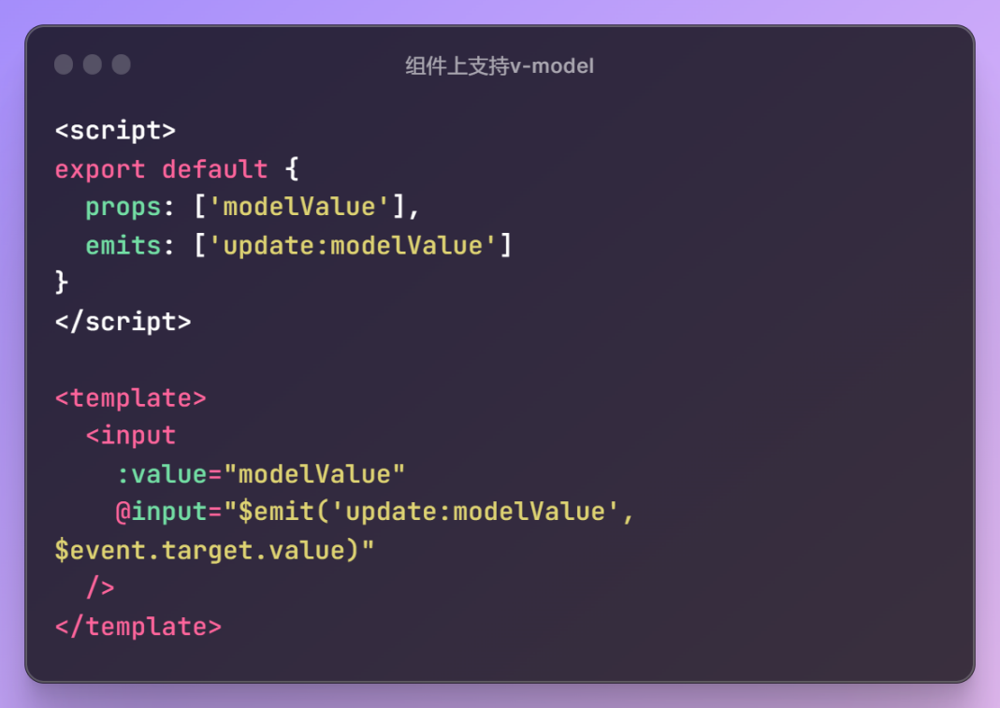

2. 使用一个可写的，同时具有 getter 和 setter 的 computed 属性绑定到组件内的原生 `<input>` 元素的v-model上。get 方法需返回 modelValue prop，而 set 方法需触发相应的事件。

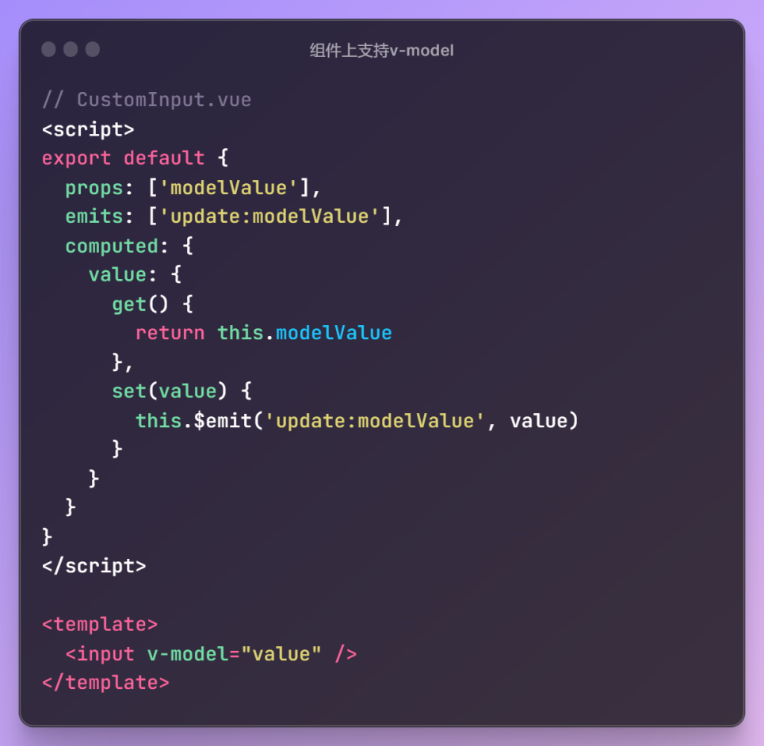

## 生命周期

每个Vue组件实例在创建时都需要经历设置好数据侦听，编译模板，挂载实例到 DOM，以及在数据改变时更新 DOM的一系列初始化步骤，并在每个阶段运行称为生命周期钩子的函数，breforeCreate和created，beforeMount和mounted，beforeUpdate和updated，beforeUnmount和unmounted，让开发者有机会在对应的特定阶段运行自己的代码。所有生命周期钩子函数的 this 上下文都会自动指向当前调用它的组件实例，但是，避免用箭头函数来定义生命周期钩子，因为如果这样的话你将无法在函数中通过 this 获取组件实例。

**Vue实例里的成员分成两大部分，模版可以直接使用vue实例中的成员**：
1. 自带的成员：$开头（一些实用方法和属性，便于开发者使用）和下划线_开头（vue内部使用的成员，不建议开发者使用）。
2. 从配置项（props、 data、methods、computed）中注入的成员。自带的成员要用$或者_开头是为了防止与注入的成员重名。

**Vue3实例生命周期的图表**：

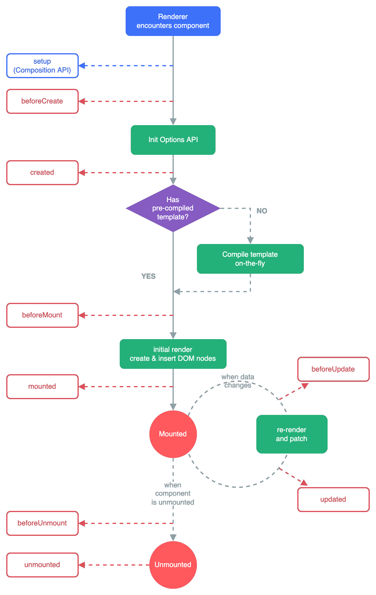

**Vue2实例生命周期的图表**：

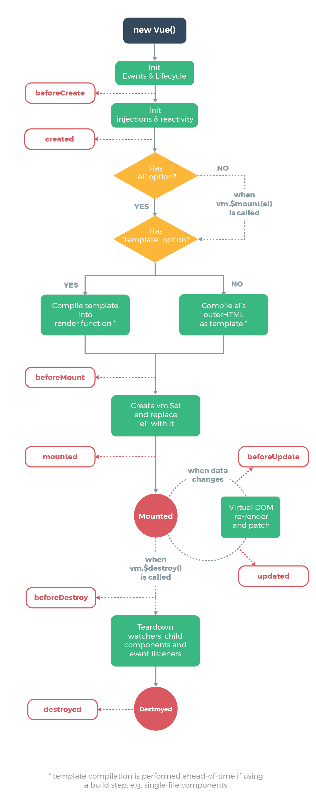

**父组件和子组件生命周期钩子执行顺序**：父组件等待子组件完成后，才会执行自己对应完成的钩子（更新，挂载，销毁），同时，子组件的初始化（beforeCreate）在父组件beforeMount之后开始。

## 模板引用（ref）

特殊的 ref attribute支持直接访问底层 DOM 元素，它允许在一个特定的 DOM 元素或子组件实例被挂载后，获得对它的直接引用，比如，需要在组件挂载时将焦点设置到一个 input 元素上，或在一个元素上初始化一个第三方库。组件挂载结束后引用都会作为属性被暴露在当前组件实例的 this.$refs 对象上，只可以在组件挂载后才能访问模板引用ref，如果在模板中的表达式上访问 $refs.input，在初次渲染时会是 null，因为在初次渲染前该元素还不存在。当在 v-for 中使用模板引用时（需要 v3.2.25 及以上版本），相应的ref对应的值是一个数组，并且ref 数组并不保证与源数组相同的顺序。

ref的值类型可以是字符串值，或者使用:ref绑定为一个内联函数（（el）=> {}）或methods，会在每次组件更新或卸载时都被调用，函数的第一个参数在更新时是元素引用，卸载时是null。

模板引用（ref或:ref）也可以在子组件上使用，引用中获得的值是组件实例。如果子组件使用的是选项式 API，被引用的组件实例和该子组件的 this 完全一致，这意味着父组件对子组件的每一个属性和方法都有完全的访问权，同时，利用expose 选项可以用于限制对子组件实例的访问。这使得在父组件和子组件之间创建紧密耦合的实现细节变得很容易，也因此只应该在绝对需要时才在子组件上使用模板引用。大多数情况下应该首先使用标准的 props 和 emit 接口来实现父子组件交互。

## 组件

组件允许将 UI 划分为独立的、可重用的部分，Vue 实现了自己的组件模型，使得可以在每个组件内封装自定义内容与逻辑。

当使用构建步骤时，Vue 组件定义在一个单独的 .vue 文件，即单文件组件，简称SFC。	

当不使用构建步骤时，一个 Vue 组件在js文件中以一个包含 Vue 特定选项的 JavaScript 对象来定义，其中template选项是一个内联的 JavaScript 字符串或者也可以使用 ID 选择器来指向一个元素 (通常是原生的 `<template>` 元素)，Vue 将会使用其内容作为模板来源并会在运行时编译它。

.js 文件里默认导出组件，但也可以在一个文件中通过具名导出的方式导出多个组件。

### 组件注册

组件将会以其注册时的名字作为模板 `<template>` 中的标签名，组件注册分为全局注册和局部注册。

全局注册，使用 Vue 应用实例const app = createApp({})的 app.component() 方法，第一个参数是组件名称，第二个参数是组件的实现，进行全局地注册组件，而不需要额外再导入。app.component() 方法可以被链式调用。每一个组件都维护着自己的状态，因为每个组件都是一个新的实例。全局注册存在的问题：
1. 没有被使用的组件无法在生产打包时被自动移除 (也叫“tree-shaking”)，即它仍然会出现在打包后的 JS 文件中。
2. 全局注册在大型项目中使项目的依赖关系变得不那么明确，不太容易定位子组件的实现。和使用过多的全局变量一样，这可能会影响应用长期的可维护性。

局部注册需要在使用它的父组件中显式导入，并在components选项上注册来暴露给模板`<template>`，并且只能在该父组件中使用。 components 选项对象的 key 名就是注册的组件名，而值就是相应组件的实现。它的优点是使组件之间的依赖关系更加明确，并且对 tree-shaking 更加友好。请注意：局部注册的组件在后代组件中并不可用。

使用 PascalCase 作为组件名的注册格式。首先PascalCase 是合法的 JavaScript 标识符，这使得在 JavaScript 中导入和注册组件都很容易，同时 IDE 也能提供较好的自动补全。其次，`<PascalCase />` 在模板中更明显地表明是Vue 组件，而不是原生 HTML 元素或自定义元素 (web components) 。同时，Vue 支持将模板中使用 kebab-case 的标签解析为使用 PascalCase 注册的组件。这意味着以 MyComponent 为名注册的组件，在模板中可以通过 `<MyComponent>` 或 `<my-component>` 引用，这样使得注册的Vue组件更能配合不同来源的模板。在组件命名使用kebab-case时建议加上前缀（公司名或项目名缩写），以避免和HTML元素名称冲突。
1. 如果是在单文件组件中，推荐为子组件使用 PascalCase 的标签名，以此来和原生的 HTML 元素作区分。虽然原生 HTML 标签名是不区分大小写的，但 Vue 单文件组件是可以在编译中区分大小写的，同时，也可以使用 /> 来关闭一个组件标签。
2. 如果是直接在 DOM 中书写模板 (例如原生 `<template>` 元素的内容)，即单文件组件、内联模板字符串 (例如template选项)、`<script type="text/x-template">` 等字符串模板除外，Vue 则必须从 DOM 中获取模板字符串，模板的编译需要遵从浏览器中原生HTML 的解析行为，HTML 标签和属性名称是不分大小写的，所以浏览器会把任何大写的字符解释为小写，此外，HTML 只允许一小部分特殊的元素省略其关闭标签，最常见的就是 `<input />` 和 ``，**意味着当使用 DOM 内的模板时，无论是 PascalCase 形式的组件名称、camelCase 形式的 prop 名称还是 v-on 的事件名称，都需要写为相应等价的 kebab-case (短横线连字符) 形式并显式地关闭这些组件的标签**。某些 HTML 元素对于放在其中的元素类型有限制，例如 `<ul>`，`<ol>`，`<table>` 和 `<select>`，相应的，某些元素仅在放置于特定元素中时才会显示，例如 `<li>`，`<tr>` 和 `<option>`。这将导致在使用带有此类限制元素的组件时自定义的组件将作为无效的内容被忽略，可以当使用在原生 HTML 元素上使用vue:is 将其对应值解析为一个 Vue 组件。

### Props

Props attributes需要在组件上使用props选项显式声明注册，而其他未声明的外部传入将作为透传attributes。可以使用字符串数组或对象来声明 props。对于以对象形式声明中的每个属性，key 是 prop 的名称（声明时应该使用camelCase 形式，传递时虽然可以写为camlCase形式但通常写为 kebab-case 形式便于与HTML attribute对齐），而值则是该 prop 预期类型的构造函数，其优点是一定程度上作为组件的文档，而且在使用组件时传递错误的类型时也会在浏览器控制台中抛出警告（在开发模式下）。
1. 所有 prop 默认都是可选的，除非声明了 required: true。
2. 除 Boolean 外的未传递的可选 prop 将会有一个默认值 undefined。
3. Boolean 类型的未传递 prop 将被转换为 false。这可以通过为它设置 default 来更改。
4. default可以是一个函数，对象或者数组应当用default对应的工厂函数返回默认值。工厂函数会收到组件所接收的原始 props作为参数。而对于type是Function的prop，default对应的是作为默认值的函数。
5. validator函数用于自定义校验函数，该函数接收prop值，如果返回true，则校验成功，否则校验失败。
6. 如果声明了 default 值，那么在 prop 的值被解析为 undefined 时，无论 prop 是未被传递还是显式指明的 undefined，都会改为 default 值。
7. prop 的校验是在组件实例被创建之前，所以实例的属性 (比如 data、computed 等) 将在 default 或 validator 函数中不可用。
8. 声明为 Boolean 类型的prop有特殊的类型转换规则：和原生HTML相同的行为即传递时组件上显式写明prop不赋值也为true，不写明则为false；当一个 prop 被声明为允许多种类型时，无论声明类型的顺序如何，Boolean 类型的特殊转换规则都会被应用。
9. 校验选项中的 type 可以是以下原生构造函数：
    1. String
    2. Number
    3. Boolean
    4. Array
    5. Object
    6. Date
    7. Function
    8. Symbol
    9. 自定义的类或构造函数，Vue 将会通过 instanceof 来检查类型是否匹配。

在组件上传递动态 prop 值需要使用v-bind或缩写 :。使用没有参数的 v-bind，可以将一个对象的所有属性都当作 props 传入。当值被传递给 prop 时，它将成为该组件实例上的一个属性，在模板`<template>`和组件的 this 上下文中访问。默认情况下，组件的所有 prop 都接受任意类型的值。

**所有的 props 都遵循着单向绑定原则，props 因父组件的更新而变化，自然地将新的状态向下流往子组件，而不会逆向传递。这避免了子组件意外修改父组件的状态的情况，不然应用的数据流将很容易变得混乱而难以理解**。每次父组件更新后，所有的子组件中的 props 都会被更新到最新值，这意味着不应该在子组件中去更改一个 prop，否则，Vue 会在控制台上抛出警告。
1.如果prop被用于传入初始值，且子组件想将其作为局部数据属性，正确做法是新定义一个局部数据属性，从 props 上获取初始值，在子组件内只操作新定义的局部数据属性。
2.如果需要对传入的 prop 值做进一步的转换。正确做法是基于该 prop 值定义一个计算属性。
3.如果需要更改对象 / 数组类型的 props，由于对象和数组是按“引用值”传递，子组件更改对象或数组内部的值，也不会抛出警告且存在性能损耗。正确做法是避免这样的更改，大多数场景下，应该抛出一个事件来通知父组件做出改变。

### 事件

组件实例提供了一个自定义事件系统。父组件可以像监听原生 DOM 事件一样使用 v-on 或 @ 来选择性地监听子组件通过调用内置 $emit 方法并传入自定义事件名称抛出的事件，其中，$emit() 方法在当前子组件实例上也同样以 this.$emit() 的形式可用，父组件的自定义事件监听器也支持 .once 修饰符。在父组件的模板中也推荐使用 kebab-case 形式来编写监听器。

和原生 DOM 事件不一样，组件触发的事件没有冒泡机制，因此只能监听直接子组件触发的事件。平级组件或是跨越多层嵌套的组件间通信，应使用一个外部的事件总线，或是使用一个全局状态管理方案。

所有传入 $emit() 的额外参数都会被直接传向父组件中对应的监听器。

也可以通过emits 选项来声明需要在子组件需要抛出的事件，它声明子组件可能触发的所有事件，emits 选项还支持对象语法，它允许对触发事件赋值为一个函数来对参数进行验证，函数接受的参数就是抛出事件时传入 this.$emit 的内容，返回一个布尔值来表明事件是否合法。推荐完整地声明所有要触发的事件，以此在代码中作为文档记录组件的用法。同时，事件声明能让 Vue 更好地将事件和透传 attribute 作出区分，可以让 Vue 避免将它们作为原生事件监听器隐式地应用于子组件的根元素，从而避免一些由第三方代码触发的自定义 DOM 事件所导致的边界情况。如果与原生事件的名字相同的事件被定义在 emits 选项中，则监听器只会监听组件触发的该自定义事件而不会再响应对应原生事件。

### 插槽

子组件能够接收任意类型的 JavaScript 值作为 props，同时子组件也可以接收模板内容。 Vue 的自定义 `<slot>` 元素，可以实现向子组件中传递模板内容， `<slot>` 作为一个占位符，会渲染成父组件传递进来的内容，**`<slot>` 类似于函数定义中的参数使用，传递的内容类似于函数调用的传递的实参**。

 `<slot>` 元素是一个插槽出口 (slot outlet)，标示了父组件提供的插槽内容 (slot content) 将在哪里被渲染。插槽内容可以是任意合法的模板内容，不局限于文本，可以传入多个元素，甚至是组件。Vue 组件的插槽机制是受原生 Web Component `<slot>` 元素的启发而诞生，同时还做了一些功能拓展。

插槽内容可以访问到父组件的数据作用域，因为插槽内容本身是在父组件模板中定义的。插槽内容无法访问子组件的数据。Vue 模板中的表达式只能访问其定义时所处的作用域，这和 JavaScript 的词法作用域规则是一致的，即父组件模板中的表达式只能访问父组件的作用域；子组件模板中的表达式只能访问子组件的作用域。

在外部没有提供任何内容的情况下，可以写在 `<slot>` 标签之间为插槽指定默认内容。	

**带 name 的插槽被称为具名插槽 (named slots)（slots.slotName()或slots.[soltName]()）**，用于将多个插槽内容传入到各自目标插槽的出口，**类比于slots对象的属性键值对传递到函数内并在特定位置使用**。没有提供 name 的 `<slot>` 出口会隐式地命名为“default”。传递时，需要使用含 v-slot 指令（简写 #）的 `<template>` 元素，指令的值即为目标插槽的名字，而当一个组件同时接收默认插槽和具名插槽时，所有位于顶级的非 `<template>` 节点都被隐式地视为默认插槽的内容。v-slot也支持动态指令参数。

默认情况下，插槽的内容无法访问到子组件的状态，如果插槽的内容想要同时使用父组件域内和子组件域内的数据。**需要使用作用域插槽（slots.scopeSlotName(slotProps)或slots.[scopeSlotName](slotProps)）**。可以像对组件传递 props 那样，给子组件中定义的插槽的出口上传递 attributes。接收插槽 props时：
1. **对于默认插槽（slots.default()）**，子组件内传入插槽的attributes构成了soltProps对象对应于父组件中子组件标签上的 v-slot 指令的值，该soltProps对象可以在插槽内容内的表达式中访问。作用域插槽类比为一个传入子组件的函数，子组件会将相应的 soltProps 作为参数传给它，和函数的参数类似，也可以在v-slot中使用解构。
2. 插槽 props 可以作为 v-slot 指令的值被访问到：v-slot:name="slotProps"，插槽出口上的 name 是一个 Vue 特别保留的 attribute，不会作为 props 传递给插槽。如果混用了具名插槽与默认插槽，则需要为默认插槽使用显式的 `<template>` 标签。尝试直接为组件添加 v-slot 指令将导致编译错误，这是为了避免因默认插槽的 props 的作用域而困惑。

需要子组件能够保留足够的灵活性，将对子组件中某些元素内容和样式的控制权留给使用该子组件的父组件的场景适合使用作用域插槽。一些组件可能只包括了逻辑而不需要自己渲染内容，视图输出通过作用域插槽全权交给了消费者组件，将这种类型的组件称为无渲染组件（类比于React的高阶组件）。但大部分能用无渲染组件实现的功能都可以通过组合式 API 以另一种更高效的方式实现，并且还不会带来额外组件嵌套的开销，尽管如此，作用域插槽在需要同时封装逻辑、组合视图界面时还是很有用。

### 透传attribute

“透传 attribute”指的是传递给一个组件，却没有被该组件声明为 props 或 emits 的 attribute 或者 v-on 事件监听器，常见的有class、style 和 id。当一个组件以单个元素为根作渲染时，透传的 attribute 会自动被添加到根元素上。如果一个子组件的根元素已经有了 class 或 style attribute，它会和从父组件上继承的值合并，该规则也适用于v-on事件监听器，根元素监听器和从父组件继承的监听器都会被触发。而如果子组件内是根节点上渲染另一个组件，则子组件接收的透传 attribute 且只有它会直接继续传给子组件的根组件，如果透传的attribute符合声明，也可以作为 props 传入子组件的根组件。透传进来的 attribute 可以在模板的表达式中直接用 $attrs 对象访问到（在JavaScript中则是使用this.$attrs访问），$attrs 对象包含了除组件所声明的 props 和 emits 之外的所有其他 attribute，而且和 props 有所不同，透传 attributes 在 JavaScript 中保留了它们原始的大小写；v-on 事件监听器将在此对象下被暴露为camlCase形式的函数名称 $attrs.onEventName。可以在组件选项中设置 inheritAttrs: false来拒绝继承attribute。最常见的需要禁用attribute继承的场景就是被透传的attribute 需要应用在根节点以外的其他元素上。

和单根节点组件有所不同，有着多个根节点的组件没有自动 attribute 透传行为。如果 $attrs 需要被显式绑定，否则将会抛出一个运行时警告。

Vue 的 `<component>` 元素和特殊的 is attribute 可以实现在两个组件间来回切换。被传递给被传给 :is 的值可以是被components选项注册的组件名或导入的组件对象。也可以使用 is attribute 来创建一般的 HTML 元素。当使用 `<component :is="...">` 来在多个组件间作切换时，被切换掉的组件会被卸载，可以通过 `<KeepAlive>` 组件强制被切换掉的组件仍然保持“存活”的状态。

### 依赖注入

provide 和 inject 可以帮助解决prop 逐级透传问题，一个父组件相对于其所有的后代组件，会作为依赖提供者。任何后代的组件树，无论层级有多深，都可以注入由父组件提供给整条链路的依赖。

使用provide 选项为组件后代Provide（提供）数据，对于 provide选项对象上的每一个属性，后代组件会用其 key 为注入名查找期望注入的值，属性的值就是要提供的数据。如果需要提供依赖当前组件实例的状态 (比如由 data() 定义的数据属性)，那么可以以函数形式使用 provide，然而，请注意这不会使注入保持响应性。除了在组件中提供依赖，还可以利用app.provide在整个应用层面提供依赖，在应用级别提供的数据在该应用内的所有组件中都可以注入，这在你编写插件时会特别有用，因为插件一般都不会使用组件形式来提供值。

使用 inject 选项来声明要注入到当前组件的上层组件提供的数据，注入会在组件自身的状态之前被解析，因此可以在 data() 中访问到注入的属性。当以数组形式使用 inject，注入的属性会以同名的 key 暴露到组件实例上。如果想要用一个不同的本地属性名注入该属性，需要使用inject选项对象形式，并且该对象的属性键对应于本地属性名，属性值对象中的from属性对应的值对应于注入名。默认情况下，inject 假设传入的注入名会被某个祖先链上的组件提供。如果该注入名的确没有任何组件提供，则需要类似于props那样声明默认值（对于非基础类型数据，如果创建开销比较大，或是需要确保每个组件实例需要独立数据的，请使用工厂函数），否则会抛出一个运行时警告。

为保证注入方和供给方之间的响应性链接，需要在注入方使用 computed() 函数提供一个计算属性。computed() 函数常用于组合式 API 风格的组件中，但它同样还可以用于补充选项式 API 风格的某些用例。Vue 3.3以下需要设置 app.config.unwrapInjectedRef = true 以保证注入会自动解包该计算属性。

除了使用字符串作为注入名，如果正在构建大型的应用，包含非常多的依赖提供，或者正在编写提供给其他开发者使用的组件库，建议最好使用 Symbol 来作为注入名以避免潜在的冲突。推荐在一个单独的文件中导出这些注入名 Symbol。

### 异步组件

Vue 提供了 defineAsyncComponent 方法来实现在大型项目中拆分应用为更小的块，并仅在需要时再从服务器加载相关组件。defineAsyncComponent 方法接收一个返回 Promise 的加载函数。该Promise 的 resolve 回调方法应该在从服务器获取到组件定义时调用，而 reject(reason) 则在加载失败调用。

ES 模块动态导入也会返回一个Promise，所以多数情况它可以和 defineAsyncComponent 搭配使用。类似 Vite 和 Webpack 这样的构建工具也支持此defineAsyncComponent语法 （并且会将它们作为打包时的代码分割点），因此也可以用它来导入 Vue 单文件组件。

defineAsyncComponent最后得到的 AsyncComp组件是一个外层包装过的组件，仅在页面需要它渲染时才会调用加载内部实际组件的函数。它会将接收到的 props 和插槽内容传给内部组件，所以可以使用这个异步的包装组件无缝地替换原始组件，同时实现延迟加载。

与普通组件一样，异步组件可以使用 app.component() 全局注册，也可以在局部注册组件时使用 defineAsyncComponent。

异步操作不可避免地会涉及到加载和错误状态，因此 defineAsyncComponent() 也支持在传递对象形式的高级选项中处理这些状态：
1. loader：加载函数，对应于defineAsyncComponent 方法接收一个返回 Promise 的加载函数形式。
2. loadingComponent：加载异步组件处于loading状态时使用的组件。
3. delay: 展示加载组件前的延迟时间，默认为 200ms。
4. errorComponent：加载失败后Promise 抛错时展示的组件。
5. timeout：加载异步组件超时限制，默认值是Infinity，超时会显示配置的errorComponent报错组件。

异步组件可以搭配内置的 `<Suspense>` 组件一起使用。

### 函数式组件

函数式组件是一种定义自身没有任何状态的组件的方式。它们很像纯函数：接收 props，返回 vnodes。函数式组件在渲染过程中不会创建组件实例 (即没有this)，也不会触发常规的组件生命周期钩子。第一个参数是props。第二个参数context具有attrs、emit 和 slots三个属性。

大多数常规组件的配置选项在函数式组件中都不可用，除了 props 和 emits，可以通过给函数式组件添加对应的属性来声明它们。如果这个 props 选项没有被定义，那么被传入函数的 props 对象就会像 attrs 一样会包含所有 attribute。除非指定了 props 选项，否则每个 prop 的名字将不会基于驼峰命名法被一般化处理。对于有明确 props 的函数式组件，attribute 透传的原理与普通组件基本相同。然而，对于没有明确指定 props 的函数式组件，只有 class、style 和 onXxx事件监听器将默认从attrs中继承。在这两种情况下，可以将 inheritAttrs 设置为 false 来禁用属性继承。

函数式组件可以像普通组件一样被注册和使用。如果将一个函数作为第一个参数传入 渲染函数h，它将会被当作一个函数式组件来对待。

### 自定义指令

Vue 除了支持内置的一系列指令，还允许注册自定义的指令 (Custom Directives)。Vue中重用代码的方式：组件、组合式函数和自定义指令。组件是主要的构建模块，而组合式函数则侧重于有状态的逻辑，而自定义指令主要是为了重用涉及普通元素的底层 DOM 访问的逻辑。一个自定义指令由一个包含类似组件生命周期钩子的对象来定义。钩子函数会接收到指令所绑定元素作为其参数。自定义指令比原生HTML attribute 更有用，因为它不仅仅可以在页面加载完成后生效，还可以在 Vue 动态插入元素后生效。

和组件类似，自定义指令在模板中使用前必须先注册。可以使用 directives 选项进行自定义指令的局部注册，也可以使用app.directive进行全局注册。和内置指令类似，自定义指令的参数也可以是动态的。

只有当所需功能只能通过直接的 DOM 操作来实现时，才应该使用自定义指令。其他情况下应该尽可能地使用 v-bind 这样的内置指令来声明式地使用模板，这样更高效，也对服务端渲染更友好。

一个指令的定义对象可以提供以下几种钩子函数 (都是可选的)：

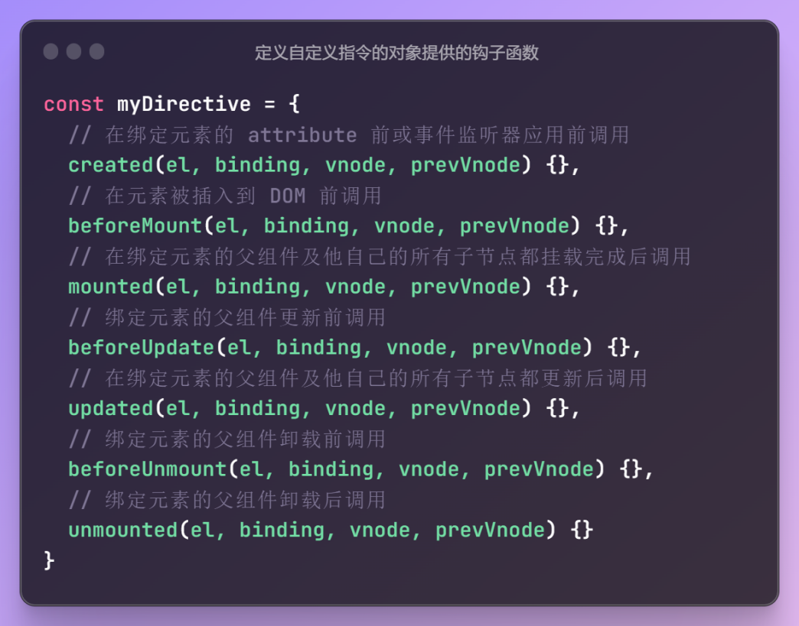

指令的钩子会传递以下几种参数：
1. el：指令绑定到的元素。这可以用于直接操作 DOM。
2. binding：一个包含以下属性对象。
    1. value：使用时传递给指令的值。如果指令需要多个值，可以向它传递一个 JavaScript 对象字面量，因为指令可以接收任何合法的 JavaScript 表达式。
    2. oldValue：之前的值，仅在 beforeUpdate 和 updated 中可用。无论值是否更改，它都可用。
    3. arg：传递给指令的参数 (如果有的话)。例如在 v-my-directive:foo 中，参数是 "foo"。
    4. modifiers：一个包含修饰符的对象 (如果有的话)。例如在 v-my-directive.foo.bar 中，修饰符对象是 { foo: true, bar: true }。
    5. instance：使用该指令的组件实例。
    6. dir：指令的定义对象，即myDirective。
3. vnode：代表绑定元素的底层 VNode。
4. prevNode：上一次渲染中代表指令所绑定元素的 VNode。仅在 beforeUpdate 和 updated 钩子中可用。

除了 el 外，其他参数都是只读的，不要更改它们，若需要在不同的钩子间共享信息，推荐通过元素的 dataset attribute 实现。

自定义指令的简化形式是app.directive('color', (el, binding) => {// 这会在 `mounted` 和 `updated` 时都调用})，因为对于自定义指令来说很常见的情况是仅仅需要在 mounted 和 updated 上实现相同的行为，除此之外并不需要其他钩子。

当在组件上使用自定义指令时，和透传 attributes 类似，它会始终应用于组件的根节点。如果组件含有多个根节点，指令将会被忽略且抛出一个警告。和 attribute 不同，指令不能通过 v-bind="$attrs" 来指定传递给某个元素。总的来说，不推荐在组件上使用自定义指令。

## 插件

插件 (Plugins) 是一种能为 Vue 添加全局功能的工具代码。定义一个插件可以是拥有 install() 方法的对象，也可以直接是安装函数本身。安装函数会接收到安装它的应用实例和传递给 app.use() 的额外选项作为参数。使用时通过app.use(myPlugin, {/* 可选的选项 */})给插件myPlugin传递可选的options。插件没有严格定义的使用范围，但是插件发挥作用的常见场景主要包括以下几种：
1. 通过 app.component() 和 app.directive() 注册一到多个全局组件或自定义指令。
2. 通过 app.provide() 使一个资源可被注入进整个应用。 
3. 向 app.config.globalProperties 中添加一些全局实例属性或方法 
4. 可能上述三种都包含的功能库 (例如 vue-router)。

编写一个简单的i18n（国际化Internationalization的缩写）插件。首先，建议在一个单独的文件中创建并导出插件对象，以保证更好地管理逻辑。使用时通过在任意模板中调用（即支持全局调用，通过在安装函数中将该翻译函数添加到 app.config.globalProperties 上来实现）接收以 . 作为分隔符的 key 字符串作为参数的翻译函数，该翻译函数内部会在用户提供的翻译字典（在插件被安装时作为 app.use() 的额外参数options中传入）中查找，并返回翻译得到的值。在插件安装函数中，还可以将插件接收到的 options 参数通过provide提供给整个应用，让任何组件inject后都能使用这个翻译字典对象。请谨慎使用全局属性，如果在整个应用中使用不同插件注入的太多全局属性，很容易让应用变得难以理解和维护。

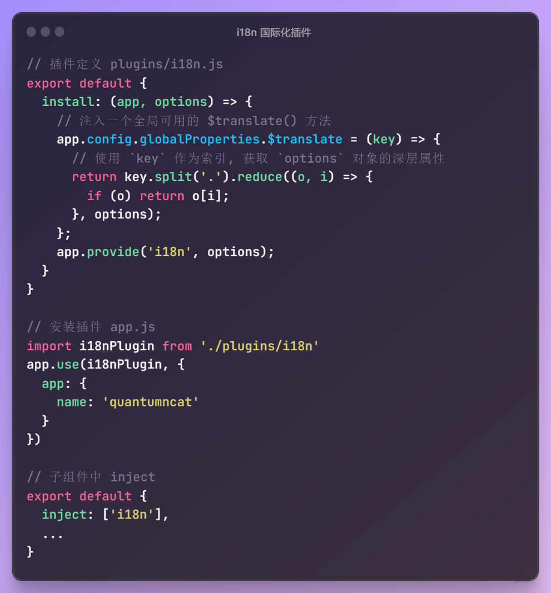

## 内置组件

内置组件，这意味着它在任意别的组件中都可以被使用，无需注册。

### Transition

`<Transition>` 会在一个元素或组件进入和离开 DOM 时应用动画。此外，还可以切换 CSS class 或用状态绑定样式来应用动画。`<Transition>` 可以将进入和离开动画应用到默认插槽内容上，`<Transition>` 仅支持单个元素或组件作为其插槽内容，而且如果内容是一个组件，这个组件必须仅有一个根元素。进入或离开可以由以下的条件之一触发：
1. 由 v-if 所触发的切换；
2. 由 v-show 所触发的切换；
3. 由特殊元素 `<component>` 切换的动态组件。

当一个 `<Transition>` 组件中的元素被插入或移除时：
1. Vue 会自动检测插槽内容是否应用了 CSS 过渡或动画。如果是，则一些 CSS 过渡 class 会在适当的时机被添加和移除。可以给 `<Transition>` 组件传一个 name prop 来声明一个过渡效果名，对于一个有名字的过渡效果，对它起作用的过渡 class 会以其名字而不是 v 作为前缀。`<Transition>` 一般都会搭配原生 CSS 过渡（transition CSS 属性）或原生CSS动画一起使用。原生 CSS 动画和 CSS transition 的应用方式基本相同，除了*-enter-from 不是在元素插入后立即移除，而是在一个 animationend 事件触发时被移除。也可以向 `<Transition>` 传递特定props（enter-from-class、enter-active-class、enter-to-class、leave-from-class、leave-active-class、leave-to-class） 来指定自定义的过渡 class，传入的这些 class 会覆盖相应阶段的默认 class 名，这在想要在 Vue 的动画机制下集成其他的第三方 CSS 动画库（比如Animate.css）时非常有用。仅仅使用transition和animation的其中之一，Vue 可以自动探测到正确的类型，因为Vue 会附加事件监听器transitionend 或 animationend，以便知道过渡何时结束。然而或许想要在同一个元素上同时使用它们两个，此时需要显式地传入 type prop （值是animation 或 transition）来声明，告诉 Vue 本身需要关心的是哪种类型。尽管过渡 class 仅能应用在 `<Transition>` 的直接子元素上，我们还是可以使用深层级的 CSS 选择器，在深层级的元素上触发过渡效果。默认情况下，`<Transition>` 组件会通过监听过渡根元素上的第一个 transitionend 或者 animationend 事件来尝试自动判断过渡何时结束。而在嵌套的过渡中，期望的行为应该是等待所有内部元素的过渡完成，此时可以通过向 `<Transition>` 组件传入 duration prop 来显式指定过渡的持续时间 (以毫秒为单位)。总持续时间应该匹配延迟加上内部元素的过渡持续时间，或者duration prop也支持用对象的形式传入，分开指定进入和离开所需的时间。会触发 CSS 布局变动的属性像 height 或者 margin，执行它们的动画效果更昂贵，需要谨慎使用，而 transform 和 opacity这些属性在动画过程中不会影响到 DOM 结构，因此不会每一帧都触发昂贵的 CSS 布局重新计算，而且大多数的现代浏览器都可以在执行 transform 动画时利用 GPU 进行硬件加速，可以在 CSS-Triggers （https://csstriggers.com/）网站查询哪些属性会在执行动画时触发 CSS 布局变动。**6 个应用于进入与离开过渡或动画效果的默认CSS class**：
    1. v-enter-from：进入动画的起始状态。在元素插入之前添加，在元素插入完成后的下一帧移除。
    2. v-enter-active：进入动画的生效状态。应用于整个进入动画阶段。在元素被插入之前添加，在过渡或动画完成之后移除。这个 class 可以被用来定义进入动画的持续时间、延迟与速度曲线类型。
    3. v-enter-to：进入动画的结束状态。在元素插入完成后的下一帧被添加 (也就是 v-enter-from 被移除的同时)，在过渡或动画完成之后移除。
    4. v-leave-from：离开动画的起始状态。在离开过渡效果被触发时立即添加，在一帧后被移除。
    5. v-leave-active：离开动画的生效状态。应用于整个离开动画阶段。在离开过渡效果被触发时立即添加，在过渡或动画完成之后移除。这个 class 可以被用来定义离开动画的持续时间、延迟与速度曲线类型。
    6. v-leave-to：离开动画的结束状态。在一个离开动画被触发后的下一帧被添加 (也就是 v-leave-from 被移除的同时)，在过渡或动画完成之后移除
2. 如果有作为监听器的 JavaScript 钩子，这些钩子函数会在适当时机被调用。通过监听 `<Transition>` 组件事件的方式在过渡过程中挂上钩子函数。钩子可以与 CSS 过渡或动画结合使用，也可以单独使用。在使用仅由 JavaScript 执行的动画时，最好是添加一个 :css="false" prop。这显式地向 Vue 表明可以跳过对 CSS 过渡的自动探测。除了性能稍好一些之外，还可以防止 CSS 规则意外地干扰过渡效果。

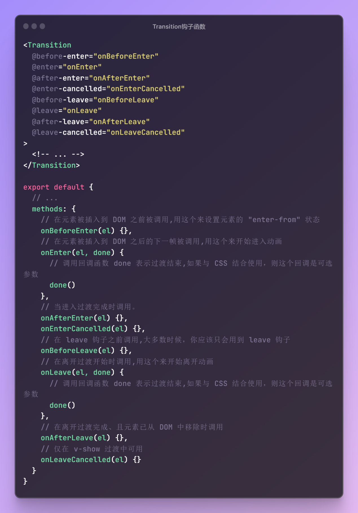

3. 如果没有探测到 CSS 过渡或动画、也没有提供 JavaScript 钩子，那么 DOM 的插入、删除操作将在浏览器的下一个动画帧后执行。

过渡效果是可以被封装复用的。要创建一个可被复用的过渡，需要为 `<Transition>` 组件创建一个包装组件，并向内传入插槽内容。如果想在某个节点初次渲染时应用一个过渡效果，你可以添加 appear prop。除了通过 v-if / v-show 切换一个元素，也可以通过 v-if / v-else / v-else-if 在几个组件间进行切换，只要确保任一时刻只会有一个元素被渲染即可。可以通过向 `<Transition>` 传入一个 mode prop 来实现是先执行离开动画还是进入动画。`<Transition>` 也可以作用于动态组件（`<component :is="..."/>`）之间的切换。 `<Transition>` 的 props (比如 name) 也可以是动态绑定的，这样可以根据状态变化动态地应用不同类型的过渡或动画，即可以提前定义好多组 CSS 过渡或动画的 class，然后在它们之间动态切换。也可以根据组件的当前状态在 JavaScript 过渡钩子中应用不同的行为，创建动态过渡的终极方式还是创建可复用的过渡组件，并让这些组件根据动态的 props 来改变过渡的效果。

### TransitionGroup
`<TransitionGroup>` 会在一个 v-for 列表中的部分元素或组件被插入，移动，或移除时应用动画。当在 DOM 模板中使用时，组件名需要写为 `<transition-group>`。
`<TransitionGroup>` 支持和 `<Transition>` 基本相同的 props、CSS 过渡 class 和 JavaScript 钩子监听器，但有以下几点区别：
1. 默认情况下，它不会渲染一个容器元素。但可以通过传入 tag prop 来指定一个元素作为容器元素来渲染。
2. 过渡模式在这里不可用，因为不再是在互斥的元素之间进行切换。
3. 列表中的每个元素都必须有一个独一无二的 key attribute。
4. CSS 过渡 class 会被应用在列表内的元素上，而不是容器元素上。

可以通过添加一些额外的 CSS 规则来解决当某一项被插入或移除时，它周围的元素会立即发生“跳跃”而不是平稳地移动的问题，包括将离开的元素从布局流中删除来确保能够正确地计算移动的动画，以及对移动中的元素应用的过渡。

把列表中每一个元素的索引渲染为该元素上的一个 data attribute，然后通过在 JavaScript 钩子中读取元素的 data attribute，对不同元素的动画效果添加一个递进的延迟时间，可以实现带渐进延迟的列表动画。

### KeepAlive

`<KeepAlive>` 的功能是在多个组件间动态切换时缓存被移除的组件实例。在 DOM 模板中使用时，它应该被写为 `<keep-alive>`。

默认情况下，一个组件实例在被替换掉后会被销毁，比如 `<component :is="" />` 元素来实现动态组件。这会导致它丢失其中所有已变化的状态——当这个组件再一次被显示时，会创建一个只带有初始状态的新实例。

在切换时创建新的组件实例通常是有意义的，但有时想要组件能在被“切走”的时候保留它们的状态。可以用 `<KeepAlive>` 内置组件将这些动态组件包装起来解决这个问题。

`<KeepAlive>` 默认会缓存内部的所有组件实例，但可以通过prop include 和 exclude（这两个属性值都可以是一个以英文逗号分隔的字符串、一个正则表达式，或是包含这两种类型的一个数组）根据子组件的 name 选项来进行匹配包含和排除需要被缓存的组件实例，因此子组件必须显式声明name 选项才能被有条件的缓存。而在 3.2.34 或以上的版本中，使用 `<script setup>` 的单文件组件会自动根据文件名生成对应的 name 选项，无需再手动声明。

可以通过传入 max prop 来限制可被缓存的最大组件实例数。`<KeepAlive>` 的行为在指定了 max 后类似一个 LRU 缓存：如果缓存的实例数量即将超过指定的那个最大数量，则最久没有被访问的缓存实例将被销毁，以便为新的实例腾出空间。

当一个组件实例从 DOM 上移除但因为被 `<KeepAlive>` 缓存而仍作为组件树的一部分时，它将变为不活跃状态而不是被卸载。当一个组件实例作为缓存树的一部分插入到 DOM 中时，它将重新被激活。一个持续存在的组件可以通过 activated选项（在首次挂载、以及每次从缓存中被重新插入的时候调用） 和 deactivated （在从 DOM 上移除、进入缓存以及组件卸载时调用）选项来注册相应的两个状态的生命周期钩子。这两个钩子不仅适用于 `<KeepAlive>` 缓存的根组件，也适用于缓存树中的后代组件。

### Teleport

`<Teleport>` 可以将一个组件内部的一部分模板“传送”到该组件的 DOM 结构外层的位置去。一个组件模板的一部分在逻辑上从属于该组件，但从整个应用视图的角度来看，它在 DOM 中应该被渲染在整个 Vue 应用外部的其他地方，这类场景最常见的是全屏的模态框。`<Teleport>` 使得不需要顾虑 DOM 结构（模态框放在非全局的容器节点下）的问题：
1. position: fixed 能够相对于浏览器窗口放置有一个条件，那就是不能有任何祖先元素设置了 transform、perspective 或者 filter 样式属性。也就是说如果想要用 CSS transform 为模态框的容器节点设置动画，就会不小心破坏模态框的布局。
2. 这个模态框的 z-index 受限于它的容器元素。如果有其他元素与容器节点重叠并有更高的 z-index，则它会覆盖住我们的模态框。

`<Teleport>` 挂载时，传送的 to 目标必须已经存在于 DOM 中。理想情况下，这应该是整个 Vue 应用 DOM 树外部的一个元素。如果目标元素也是由 Vue 渲染的，你需要确保在挂载 `<Teleport>`> 之前先挂载该元素。

`<Teleport>` 只改变了渲染的 DOM 结构，它不会影响组件间的逻辑关系，即如果 `<Teleport>` 包含的组件始终和使用 `<teleport>` 的组件保持逻辑上的父子关系，传入的 props 、触发的事件以及来自父组件的注入均会按预期工作，同时，子组件将在 Vue Devtools 中嵌套在父级组件下面，而不是放在实际内容移动到的地方。

`<Teleport>` 支持动态绑定disabled prop 来满足切换是否禁用 `<Teleport>` 的场景。多个 `<Teleport>` 组件可以将其内容挂载在同一个目标元素上，而渲染的顺序就是简单的顺次追加，后挂载的将排在目标元素里更后面的位置上。

### Suspense

`<Suspense>` 用来在组件树中协调对异步依赖的处理，它使得可以在组件树上层等待下层的多个嵌套异步依赖项解析完成，并可以在等待时渲染一个加载状态，避免每个异步依赖去单独处理自己的加载、报错和完成状态。`<Suspense>` 可以等待的异步依赖：
1. 带有异步 setup() 钩子的组件，包括使用 `<script setup>` 中有顶层 await 表达式的组件。
2. 异步组件。异步组件默认就是“suspensible”的，因此如果异步组件父级关系链上存在 `<Suspense>`，则该异步组件自己的加载、报错、延时和超时等选项都将被忽略，其加载状态将由 `<Suspense>` 控制。异步组件也可以通过在选项中指定 suspensible: false 表明不用 Suspense 控制，并让组件始终自己控制其加载状态。

`<Suspense>` 组件有两个插槽：#default 和 #fallback，都只允许一个直接子节点。在初始渲染时，`<Suspense>` 将在内存中渲染其默认的插槽内容（#default），但如果在这个过程中遇到任何异步依赖，则会进入挂起状态。在挂起状态期间，展示的是后备内容（#fallback）。当所有遇到的异步依赖都完成后，`<Suspense>` 会进入完成状态，才将展示出默认插槽（#default）的内容，如果在初次渲染时没有遇到异步依赖，`<Suspense>` 会直接进入完成状态。进入完成状态后，只有当默认插槽（#default）的根节点被替换时，`<Suspense>` 才会再次回到挂起状态，而组件树中新的更深层次的异步依赖不会造成 `<Suspense>` 回退到挂起状态。

发生这种回退时，后备内容（#fallback）不会立即展示出来，`<Suspense>` 在等待新内容和异步依赖完成时，会先展示默认插槽（#default）的先前内容，直到在等待渲染新内容耗时超过 timeout prop 之后才切换为展示后备内容（#fallback），因此，若 timeout 值为 0 将导致在替换默认内容时立即显示后备内容（#fallback）。
`<Suspense>` 组件会触发三个事件：pending、resolve 和 fallback。pending 事件是在进入挂起状态时触发。resolve 事件是在 default 插槽完成获取新内容时触发。fallback 事件则是在 fallback 插槽的内容显示时触发。

`<Suspense>` 组件自身目前还不提供错误处理，不过可以使用 errorCaptured 选项或者 onErrorCaptured() 钩子，在使用到 `<Suspense>` 的父组件中捕获和处理异步错误。

通常会将 `<Suspense>` 和 `<Transition>`、`<KeepAlive>` 等组件与 Vue Router 中的 `<RouterView>` 组件结合使用，但嵌套的顺序很重要：`<RouterView>` -> `<Transition>` -> `<KeepAlive>` -> `<Suspense>`。与异步组件不同，Vue Router 使用动态导入来对懒加载组件进行了内置支持，因此这些懒加载组件本身目前不会触发 `<Suspense>`。但是它们仍然可以有异步组件作为后代，因此可以使得这些懒加载组件包含异步组件来照常触发 `<Suspense>`。

`<Suspense>` 是一项实验性功能。它不一定会最终成为稳定功能，并且在稳定之前相关 API 也可能会发生变化。

## 应用规模化

### 单文件组件

Vue 的单文件组件 (即 *.vue 文件，英文 Single-File Component，简称 SFC) 使能够将一个 Vue 组件的模板（`<template>`）、逻辑（`<script>`）与样式（`<style>`）封装在单个文件中的特殊的文件格式。

Vue SFC是框架指定的文件格式，因此必须交由 @vue/compiler-sfc 编译为标准的 JavaScript 和 CSS，编译后的 SFC 是标准的 JavaScript(ES) 模块，这也意味着在构建配置正确的前提下可以像导入其他 ES 模块一样导入 SFC。

SFC 中的 `<style>` 标签一般会在开发时注入成原生的 `<style>` 标签以支持热更新，而生产环境下它们会被抽取、合并成单独的 CSS 文件。

**使用 SFC 必须额外使用构建工具，但带来以下优点**：
1. 使用熟悉的 HTML、CSS 和 JavaScript 语法编写模块化的组件;
2. 让本来就强相关的关注点自然内聚;
3. 预编译模板，避免运行时的编译开销;
4. 组件作用域的 CSS;
5. 在使用组合式 API 时语法更简单;
6. 通过交叉分析模板和逻辑代码能进行更多编译时优化;
7. 更好的 IDE 支持，提供自动补全和对模板中表达式的类型检查;
8. 开箱即用的模块热更新 (HMR) 支持。

**推荐以下使用场景**：
1. 单页面应用 (SPA);
2. 静态站点生成 (SSG);
3. 任何值得引入构建步骤以获得更好的开发体验 (DX) 的项目。

前端开发的关注点不是完全基于文件类型分离的。前端工程化的最终目的都是为了能够更好地维护代码。关注点分离不应该是教条式地将其视为文件类型的区别和分离。在一个组件中，其模板、逻辑和样式本就是有内在联系的、是耦合的，将它们放在一起，实际上使组件更有内聚性和可维护性。或者模板（`<template>`）、逻辑（`<script>`）与样式（`<style>`）分别放在一个文件夹下然后通过资源导入即这三个标签的src导入到index中。

### 路由

服务端路由指的是服务器根据用户访问的 URL 路径返回不同的响应结果，即点击一个链接时，浏览器会从服务端获得全新的 HTML进行页面加载。而在单页面应用中，客户端的 JavaScript 可以拦截页面的跳转请求，动态获取新的数据，然后在无需重新加载的情况下更新当前页面。在这类单页应用中，“路由”是在客户端执行的。客户端路由器的职责就是利用 History API 或是 hashchange 事件这样的浏览器 API 来管理应用当前应该渲染的视图。Vue 很适合用来构建单页面应用。对于大多数此类应用，都推荐使用官方支持的路由库vue-router。

vue-router没有使用常规的 a 标签，而是使用一个自定义组件 router-link 来创建对应路由模式下的a标签链接。这使得 Vue Router 可以在不重新加载页面的情况下（history模式下为避免刷新页面，阻止了生成的a标签的默认行为，同时使用history API更改路径）更改 URL，处理 URL 的生成以及编码。而自定义组件router-view 将显示与 url 对应的组件。

初始化vue-router实例时，配置选项RouterOptions包含以下属性：
1. linkActiveClass：可选，导航路由匹配当前路由的RouterLink默认的 CSS class。如果没有提供，则会使用 router-link-active。在router-link的props中可以传递activeclass达到相同的效果。
2. linkExactActiveClass：可选，导航路由严格匹配当前路由的RouterLink默认的 CSS class。如果没有提供，则会使用 router-link-exact-active。在router-link的props中可以传递exactActiveclass达到相同的效果。

路由模式决定了路由从哪里获取访问路径，以及如何改变访问路径。

**vue-router 默认 hash 模式：利用URL 的 hash 来模拟一个完整的 URL，hash是包括#在内的后面的内容，获取路径和改变路径均针对hash部分**。
1. 首次载入网站时，服务器接受的是 # 前的http请求，hash改变会向浏览器增加历史记录，但不会向服务器发起请求，也就不需要在服务器层面上进行任何特殊处理。
2. 爬虫不会爬到 # 后的内容，对 SEO 不利；
3. 可能会与网站的锚点功能产生冲突。
4. 点击跳转或浏览器动作（回退、前进）会触发hashchange事件，刷新页面不会触发；
5. 通过hashchange 事件来监听到 URL 的变化，从而进行内容的变更即跳转页面。
6. 兼容性最好。

**history模式：从location.pathname中获取路径，并利用history.pushState() 和 history.repalceState() HTML5 API（1.需要浏览器支持history API）实现URL的变化**。前者新增一个历史记录，后者是直接替换当前的历史记录。
1. 浏览器进行回退或者调用history.back()会触发popState()事件
2. history.pushState()和history.repalceState()都不会触发popState()事件同时也不会像服务器发送请求
3. 刷新页面或输入URL时会向浏览器发送请求，此时需要在后端配置对应的内容：服务器上添加一个简单的回退路由。如果 URL 不匹配任何静态资源，它应提供与你的应用程序中的 index.html 相同的页面，Vue Router 就可定位到对应内容；同时在 Vue app中实现一个万能的路由来显示 404 页面。

**abstract 模式**：路由从内存中获取路径，改变路径也只是改变内存中的值，这种模式通常应用到非浏览器环境（非浏览器应用）中。

**命名路由**，除了 path 之外，还可以为任何路由提供 name，要链接到一个命名的路由，可以向 router-link 组件的 to 属性传递一个name属性值相同的对象。这有以下优点：
1. 没有硬编码的 URL。
2. params 的自动编码/解码。
3. 防止使用者在 url 中出现打字错误。
4. 绕过路径排序（如显示一个）。

如果只需要简单的页面路由且不想引入整个vue-router路由库，可以通过动态组件的方式，监听浏览器 hashchange 事件或使用 History API 来更新当前组件。以下是利用hashchange事件实现一个简单的路由：

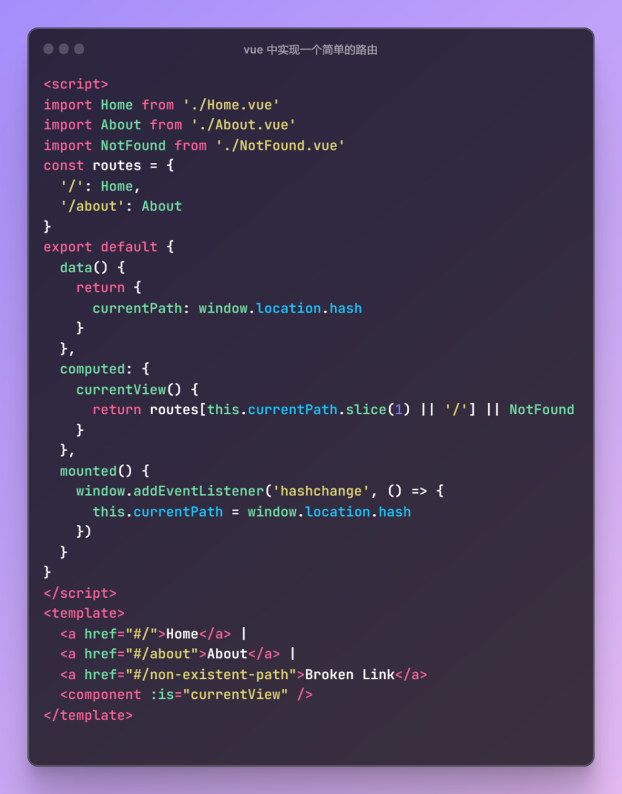

### 状态管理

每一个 Vue 组件实例都已经在“管理”它自己的响应式状态，它是一个独立的单元，由以下几个部分组成：
1. 状态：驱动整个应用的数据源；
2. 视图：对状态的一种声明式映射；
3. 交互：状态根据用户在视图中的输入而作出相应变更的可能方式。

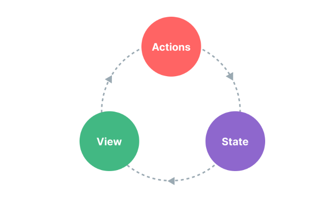

然而，当有多个组件共享一个共同的状态时：
1. 多个视图可能都依赖于同一份状态：可行的办法是将共享状态“提升”到共同的祖先组件上去，再通过 props 传递下来。然而在深层次的组件树结构中会使得代码变得繁琐冗长，即Prop 逐级透传问题。
2. 来自不同视图的交互也可能需要更改同一份状态。此时自己可能会直接通过模板引用获取父/子实例，或者通过触发的事件尝试改变和同步多个状态的副本，但两种模式的健壮性都不理想，很容易会导致代码难以维护。

简单直接的解决方案是抽取出组件间的共享状态，放在一个全局单例中来管理，组件树视图上任何位置上的组件都可以访问其中的状态或触发动作。

在选项式 API 中，响应式数据是用 data() 选项声明的。在内部，data() 的返回值对象会通过 reactive() API 转为响应式，因此如果某些状态需要在多个组件实例间共享，可以使用 reactive() 来创建一个响应式对象store ，并将它导入到多个组件中。然而，这也意味着任意导入store 的组件都可以随意修改它的状态。为确保改变状态的逻辑像状态本身一样集中，建议在 store 上定义方法，方法的名称即能表达出行动的意图。需要注意的是，这些方法需要带上圆括号作为内联表达式调用，因为它并不是组件的方法，并且必须要以正确的 this 上下文来调用。此外，其他响应式 API 例如 ref() 或是 computed()，或是甚至通过一个组合式函数来返回一个全局状态。对于服务端渲染，由于store 是跨多个请求共享的单例，上述模式可能会导致问题。

手动状态管理解决方案但是在大规模的生产应用中还有很多其他事项需要考虑：

Pinia作为官方的新的状态管理库，对 Vue 2 和 Vue 3 都可用，能满足上述手动状态管理方案以外的需求：
1. 更强的团队协作约定。
2. 与 Vue DevTools 集成，包括时间轴、组件内部审查和时间旅行调试。
3. 模块热更新 (HMR)。
4. 服务端渲染支持。

相比Vue 之前的官方状态管理库 Vuex已经处于维护模式，而Pinia在生态系统中能够承担相同的职责且能做得更好，对于新的应用，建议使用 Pinia，Pinia 提供了更简洁直接的 API，并提供了组合式风格的 API，最重要的是，在使用 TypeScript 时它提供了更完善的类型推导。

### 测试

自动化测试能够预防无意引入的 bug，并鼓励开发者将应用分解为可测试、可维护的函数、模块、类和组件。建议你尽快开始编写测试，越早越好，拖得越久，应用就会有越多的依赖和复杂性，想要开始添加测试也就越困难。测试类型包括：
1. 单元测试：检查给定函数、类或组合式函数的输入是否产生预期的输出或副作用。编写单元测试是为了验证小的、独立的代码单元是否按预期工作。一个单元测试通常覆盖一个单个函数、类、组合式函数或模块。单元测试侧重于逻辑上的正确性，只关注应用整体功能的一小部分，可能会模拟应用环境的很大一部分（如初始状态、复杂的类、第三方模块和网络请求）。单元测试通常适用于独立的业务逻辑、组件、类、模块或函数，不涉及 UI 渲染、网络请求或其他环境问题。这些通常是与 Vue 无关的纯 JavaScript/TypeScript 模块。推荐使用vitest。在 Vue 应用中为业务逻辑编写单元测试与使用其他框架的应用无明显区别。但有两种情况，必须对 Vue 的特定功能进行单元测试：
    1. 组合式函数。当涉及到测试组合式函数时，我们可以根据是否依赖宿主组件实例把它们分为两类。如果一个组合式程序只使用响应式 API，那么它可以通过直接调用并断言其返回的状态或方法来进行测试。如果是一个依赖生命周期钩子或供给/注入的组合式函数需要被包装在一个宿主组件中才可以测试。可以创建下面这样的帮手函数：

    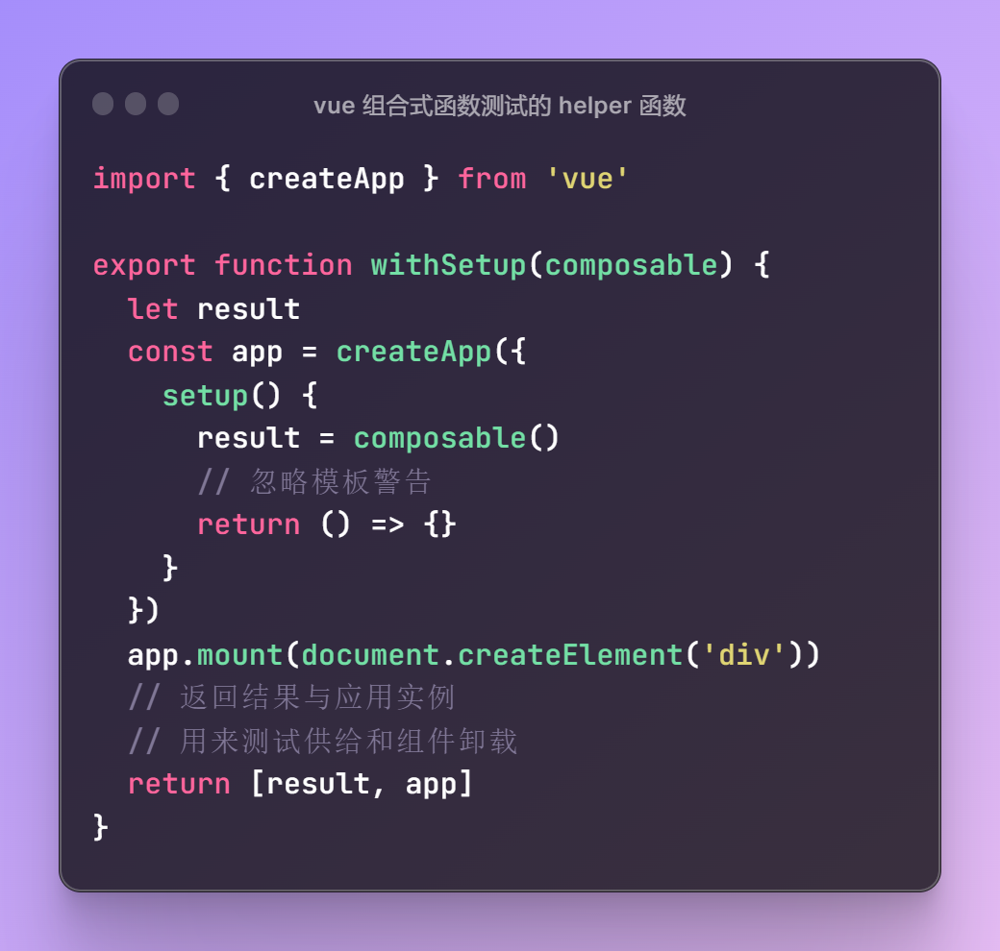

    对于更复杂的组合式函数，通过使用组件测试编写针对这个包装器组件的测试更容易。

    2. 组件。一个组件可以通过两种方式测试：
        1. 白盒测试，即单元测试，知晓一个组件的实现细节和依赖关系。它们更专注于将组件进行更独立的测试。这些测试通常会涉及到模拟一些组件的部分子组件，以及设置插件的状态和依赖性（例如 Piana）。
        2. 黑盒测试，即组件测试，不知晓一个组件的实现细节。这些测试尽可能少地模拟，以测试组件在整个系统中的集成情况。它们通常会渲染所有子组件，因而会被认为更像一种“集成测试”。
2. 组件测试：检查组件是否正常挂载和渲染、是否可以与之互动，以及表现是否符合预期。这些测试比单元测试导入了更多的代码，更复杂，需要更多时间来执行。在 Vue 应用中，主要用组件来构建用户界面。因此，当验证应用的行为时，组件是一个很自然的独立单元。从粒度的角度来看，组件测试位于单元测试之上，可以被认为是集成测试的一种形式。 Vue 应用中大部分内容都应该由组件测试来覆盖，建议每个 Vue 组件都应有自己的组件测试文件。组件测试应该捕捉组件中的 prop、事件、提供的插槽、样式、CSS class 名、生命周期钩子，和其他相关的问题。组件测试不应该模拟子组件，而应该像用户一样，通过与组件互动来测试组件和其子组件之间的交互。例如，组件测试应该像用户那样点击一个元素，而不是编程式地与组件进行交互。组件测试主要需要关心组件的公开接口而不是内部实现细节。对于大部分的组件来说，公开接口包括触发的事件、prop 和插槽。当进行测试时，请记住，测试这个组件做了什么，而不是测试它是怎么做到的。
    1. 推荐的做法：
        1. 对于视图的测试：根据输入prop和插槽断言渲染输出是否正确。
        2. 对于交互的测试：断言渲染的更新是否正确或触发的事件是否正确地响应了用户输入事件。
    2. 应避免的做法：
        1. 不要去断言一个组件实例的私有状态或测试一个组件的私有方法。测试实现细节会使测试代码太脆弱，因为当实现发生变化时，它们更有可能失败并需要更新重写。
        2. 组件的最终工作是渲染正确的 DOM 输出，所以专注于 DOM 输出的测试提供了足够的正确性保证（如果你不需要更多其他方面测试的话），同时更加健壮、需要的改动更少。
        3. 不要完全依赖快照测试。断言 HTML 字符串并不能完全说明正确性。应当编写有意图的测试。
        4. 如果一个方法需要测试，把它提取到一个独立的实用函数中，并为它写一个专门的单元测试。如果它不能被直截了当地抽离出来，那么对它的调用应该作为交互测试的一部分。

    推荐 Vitest 对于组件和组合式函数都采用无头渲染的方式 (例如 VueUse 中的 useFavicon 函数)。组件和 DOM 都可以通过 @testing-library/vue 来测试。Cypress 组件测试 会预期其准确地渲染样式或者触发原生 DOM 事件。可以搭配 @testing-library/cypress 这个库一同进行测试。Vitest 和基于浏览器的运行器之间的主要区别是速度和执行上下文。简而言之，基于浏览器的运行器，如 Cypress，支持组件测试，可以捕捉到基于 Node 的运行器（如 Vitest）所不能捕捉的问题（比如样式问题、原生 DOM 事件、Cookies、本地存储和网络故障），但基于浏览器的运行器比 Vitest 慢几个数量级，因为它们要执行打开浏览器，编译样式表以及其他步骤。组件测试通常涉及到单独挂载被测试的组件，触发模拟的用户输入事件，并对渲染的 DOM 输出进行断言。有以下专门的工具库：
    1. @testing-library/vue 是一个 Vue 的测试库，专注于测试组件而不依赖其他实现细节。因其良好的设计使得代码重构也变得非常容易。它的指导原则是，测试代码越接近软件的使用方式，它们就越值得信赖。
    2. @vue/test-utils 是官方的底层组件测试库，用来提供给用户访问 Vue 特有的 API。@testing-library/vue 也是基于此库构建的。

    推荐使用 @testing-library/vue 测试应用中的组件, 因为它更匹配整个应用的测试优先级。只有在构建高级组件、并需要测试内部的 Vue 特有 API 时再使用 @vue/test-utils。

3. 端到端测试：检查跨越多个页面的功能，并对生产构建的 Vue 应用进行实际的网络请求。这些测试通常涉及到建立一个数据库或其他后端。单元测试和组件测试在部署到生产时，对应用整体覆盖的能力有限。端到端测试针对的可以说是应用最重要的方面：当用户实际使用应用时发生了什么。端到端测试的重点是多页面的应用表现，针对应用在生产环境下进行网络请求，通常需要建立一个数据库或其他形式的后端，甚至可能针对一个预备上线的环境运行。端到端测试的重点是多页面的应用表现，针对你的应用在生产环境下进行网络请求。他们通常需要建立一个数据库或其他形式的后端，甚至可能针对一个预备上线的环境运行，即可以捕捉到单元测试或组件测试无法捕捉的关键问题。端到端测试不导入任何 Vue 应用的代码，而是完全依靠在真实浏览器中浏览整个页面来测试应用。可以在本地构建的应用中，甚至是一个预上线的环境中运行。针对预上线环境的测试不仅包括你的前端代码和静态服务器，还包括所有相关的后端服务和基础设施。
    1. 跨浏览器测试：端到端测试的一个主要优点是可以了解应用在多个不同浏览器上运行的情况。尽管理想情况应该是 100% 的跨浏览器覆盖率，但很重要的一点是跨浏览器测试对团队资源的回报是递减的，因为需要额外的时间和机器来持续运行它们。因此，在选择应用所需的跨浏览器测试的数量时，注意权衡是很有必要的。
    2. 更快的反馈：端到端测试和相应开发过程的主要问题之一是，运行整个套件需要很长的时间。通常情况下，这只在持续集成和部署（CI/CD）管道中进行。现代的端到端测试框架通过增加并行化等功能来帮助解决这个问题，这使得 CI/CD 管道的运行速度比以前快了几倍。此外，在本地开发时，能够有选择地为正在工作的页面运行单个测试，同时还提供测试的热重载，大大提高了开发者的工作流程和生产力。
    3. 第一优先级的调试体验：传统上，开发者依靠扫描终端窗口中的日志来帮助确定测试中出现的问题，而现代端到端测试框架允许开发者利用他们已经熟悉的工具，例如浏览器开发工具。
    4. 无头模式下的可见性：当端到端测试在 CI/CD 管道中运行时，它们通常在无头浏览器（即不带界面的浏览器）中运行。因此，当错误发生时，现代端到端测试框架的一个关键特性是能够在不同的测试阶段查看应用的快照、视频，从而深入了解错误的原因。而在很早以前，要手动维护这些集成是非常繁琐的。

    Cypress 提供了最完整的端到端解决方案，其具有信息丰富的图形界面、出色的调试性、内置断言和存根、抗剥落性、并行化和快照等诸多特性。不过，它只支持测试基于 Chromium 的浏览器和 Firefox。Playwright 也是一个非常好的端到端测试解决方案，支持测试范围更广的浏览器品类（主要是 WebKit 型的）。

## 选项式 API

### 状态选项

data用于声明组件初始响应式状态的函数。函数应当返回一个普通 JavaScript 对象，，Vue会将它转换为响应式对象，不推荐返回一个可能改变自身状态的对象，如浏览器 API 原生对象或是带原型的类实例等。理想情况下，返回的对象应是一个纯粹代表组件状态的普通对象。函数会在Vue创建组件实例时被调用，实例创建后，可以通过this.$data访问该响应式对象。组件实例也代理了该数据对象上所有的属性，即this.property等价于this.$data.property。如果使用的是箭头函数，则函数内this将不会指向该组件实例，但仍可以用第一个参数访问实例。以_ 或 $ 开头的属性将不会被组件实例代理，因为它们可能和Vue的内置属性、API方法冲突，也就只能以 this.$data._property或 this.$data.$property的方式访问它们。所有会用到的顶层数据属性都应该提前在这个对象中声明，虽然理论上可以向直接this.$data添加新属性，但并不推荐，如果一个属性的值在一开始还获取不到，应当先用 undefined 或是 null 值来占位。data函数的类型如下：

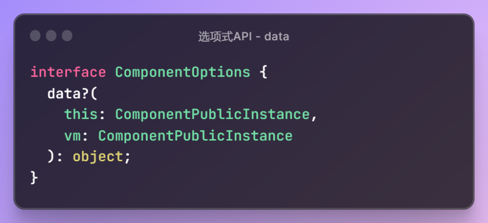

**为什么 data 属性是一个函数而不是一个对象？**

首先，data 可以是函数也可以是对象，其中根组件可以是对象或函数，组件只能是函数。因为根实例是单例，不会产生数据污染；组件实例不是单例，为防止多个组件实例之间共用一个 data，产生数据污染，采用函数形式，初始化 data 时会将其作为工厂函数都会返回全新 data 对象。

**props**

**computed** 用于声明要在组件实例上暴露的计算属性。该选项接收一个对象，其中键是计算属性的名称，值是一个计算属性getter，或一个具有get和set方法的对象（用于声明可写的计算属性，只在某些特殊场景中可能才需要用到，因为计算属性默认是只读的，避免直接修改计算属性值，尝试修改计算属性时会收到运行时警告）。所有的getters和setters会将它们的this上下文自动绑定为组件实例。如果为计算属性使用的是箭头函数，则函数内this将不会指向该组件实例，但仍可以用第一个参数访问实例。计算属性的 getter 应只做计算而没有任何其他的副作用，不要在 getter 中做异步请求或者更改 DOM。一个计算属性的声明中描述的是如何根据其他值派生一个值。因此 getter 的职责应该仅为计算和返回该值。

模版中，较长的表达式会让模版变得复杂和难以维护，使用计算属性来描述依赖响应式状态的复杂逻辑，计算属性值会基于其响应式依赖被缓存。一个计算属性仅会在其响应式依赖更新时才重新计算，相比之下，methods方法调用总是会在重渲染发生时再次执行函数。

computed计算属性的类型如下：

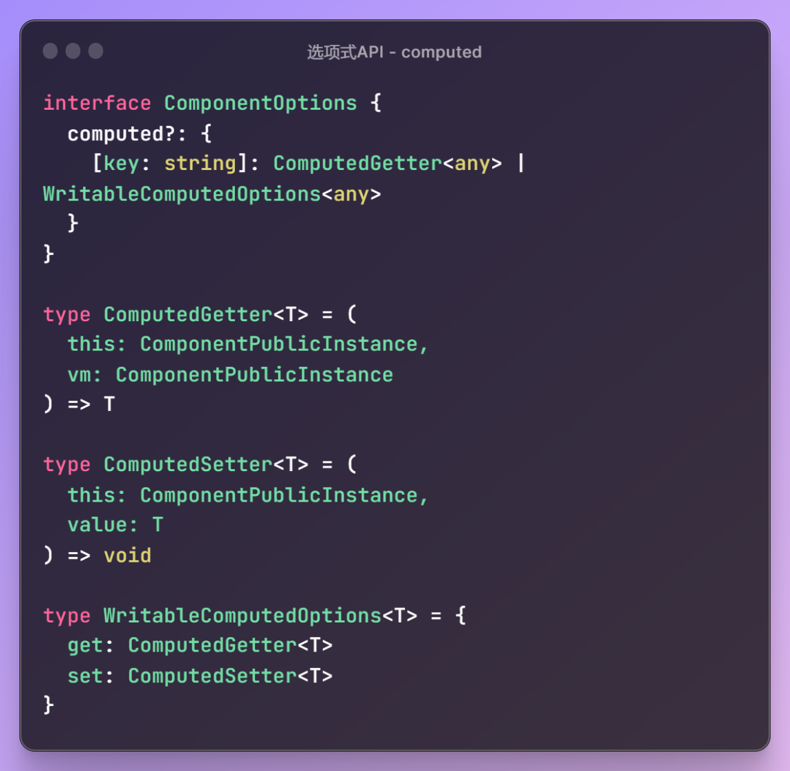

**为什么需要缓存呢？**

假如有一个非常耗性能的计算属性 list，需要遍历一个巨大的数组并做许多计算逻辑，并且可能也有其他计算属性依赖于list。如果没有缓存，会重复且 多余的执行非常多次list的getter！如果确定不需要缓存，也可以使用方法methods代替。

**watch** 用于声明在数据更改时调用的侦听回调。该选项期望接受一个对象，其中键是需要侦听的响应式组件实例属性（通过 data 或 computed 声明的属性），键名也可以是一个简单的由点分隔的路径字符串；值可以直接是相应的回调函数，该回调函数接受被侦听源的新值和旧值，值也可以是methods方法名字符串，值也可以是回调数组，它们将会被逐一调用，值还可以是包含额外选项的对象，额外的选项包含：
1. handler：侦听回调函数；
2. immediate：在侦听器创建时立即触发回调。第一次调用时，旧值将为 undefined。watch 默认是懒执行的，仅当数据源变化时，才会执行回调。如果需要在创建侦听器时，立即执行一遍回调，即immediate选项设置为true，比如先请求初始数据，然后在相关状态更改时重新请求数据。回调函数的初次执行就发生在 created 钩子之前，因此第一次调用时，data、computed、methods均已可用。
3. deep：如果源是对象或数组，则强制深度遍历源，以便在深度变更时触发回调。watch 默认是浅层的，如果是想侦听所有嵌套的变更，则需要深层侦听器，即deep选项设置为true，但是深度侦听需要遍历被侦听对象中的所有嵌套的属性，当用于大型数据结构时，开销很大。因此请只在必要时才使用它，并且要留意性能。
4. flush：调整回调的刷新时机。响应式状态的改变，可能会触发 Vue 组件更新和侦听器回调。侦听器回调默认会在Vue组件更新之前被调用。如果想在侦听器回调中能访问被 Vue 更新之后的 DOM，则flush选项需设置为post。
5. onTrack / onTrigger：调试侦听器的依赖关系。

回调函数避免使用箭头函数，因为它们将无法通过 this 访问组件实例。

侦听器适合在状态变化时执行一些“副作用”（更改 DOM，或是根据异步操作的结果去修改另一处的状态）。

Vue支持使用组件实例的 $watch方法即this.$watch命令式地创建侦听器。用 watch 选项或者组件实例的 $watch方法声明的侦听器，会在宿主组件卸载时自动停止，此外组件实例的 $watch方法声明的侦听器支持调用其返回的函数来主动在特定时机（比如组件卸载之前）停止。组件实例的 $watch方法的三个参数分别对应watch选项的键、回调函数和额外选项，$watch方法的键还可以是一个getter函数。

组件实例的$watch方法的类型如下：

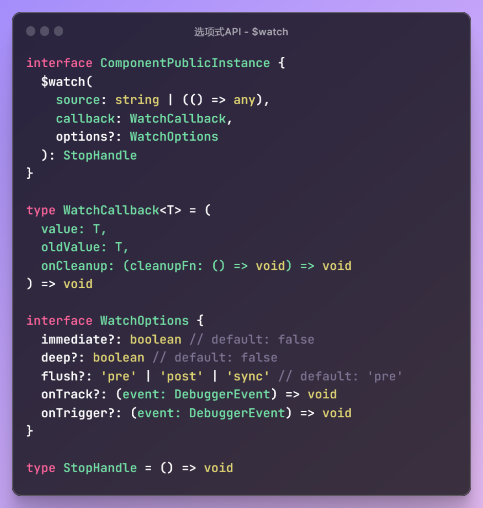

watch选项侦听器的类型如下：

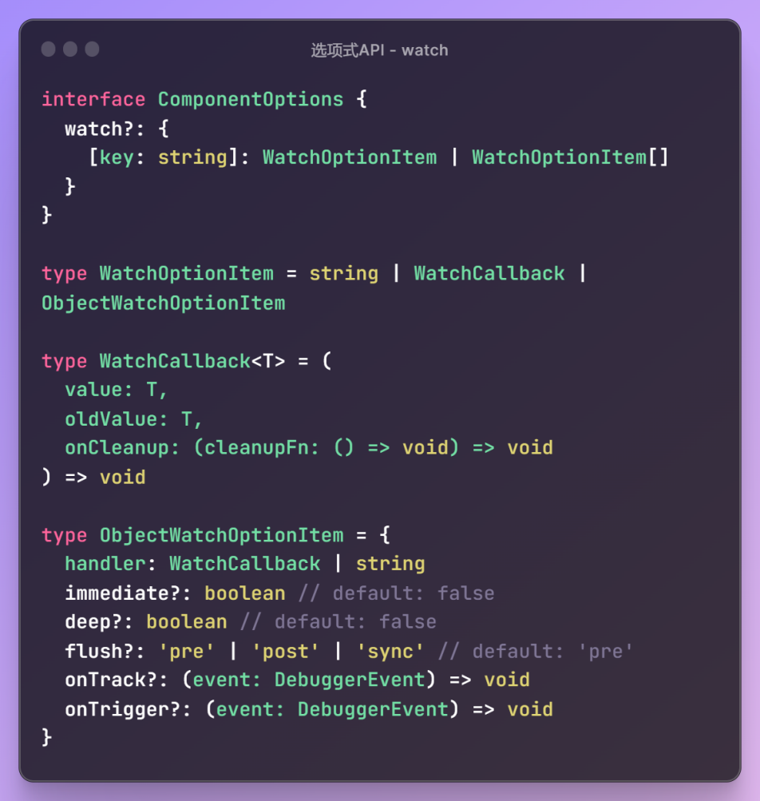

**methods** 选项用于声明要混入到组件实例中的方法。声明的方法可以直接通过组件实例访问，或者在模板语法表达式中使用。所有的方法都会将它们的 this 上下文自动绑定为组件实例（vue内部通过this.someMethod = methods.someMethod.bind(this)绑定this为组件实例，由于Function.prototype.bind内部返回的是新函数，因此如果methods.someMethod有上定义属性则使用this.someMethod却无法访问。解决办法是将这类函数放到data选项中定义即可）。在声明方法时避免使用箭头函数，因为它们不能通过 this 访问组件实例。

methods选项类型如下：

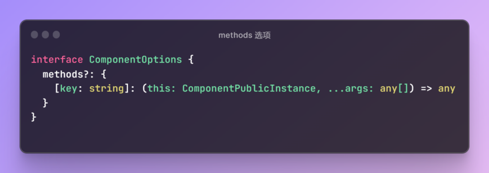

### 渲染选项

**template** 用于声明组件的字符串模板。通过 template 选项提供的模板将会在运行时即时编译，这仅在使用了包含模板编译器的 Vue 构建版本的情况下支持，文件名中带有 runtime 的 Vue 构建版本未包含模板编译器，例如 vue.runtime.esm-bundler.js。如果该字符串以 # 开头，它将被用作 querySelector 的选择器，并使用所选中元素的 innerHTML 作为模板字符串。这使得能够使用原生 `<template>` 元素来书写源模板。如果 render 选项也同时存在于该组件中，template 将被忽略。如果应用的根组件不含任何 template 或 render 选项，Vue 将会尝试使用所挂载元素（el）的 innerHTML 来作为模板。而且，无论是render选项返回值还是template选项字符串，都只能是单根的。template选项的类型如下：

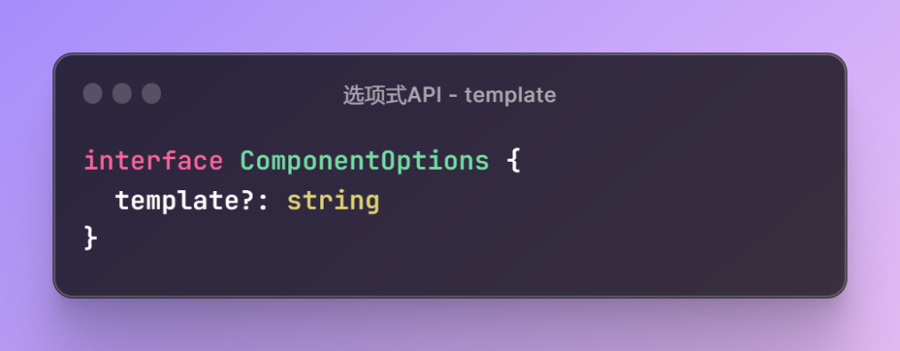

**render** 用于编程式地创建组件虚拟 DOM 树的函数。render 是字符串模板template的一种替代，可以利用 JavaScript 的丰富表达力来完全编程式地声明组件最终的渲染输出。预编译的模板，例如单文件组件中的模板，会在构建时被编译为 render 选项。如果一个组件中同时存在 render 和 template，则 render 将具有更高的优先级。render选项的类型如下：

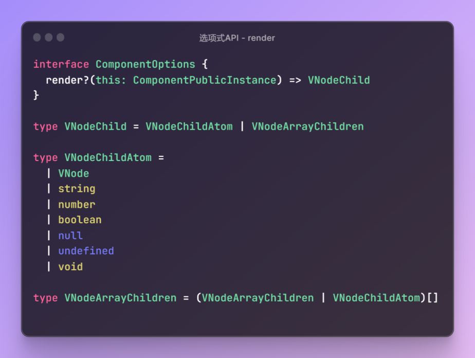

### 生命周期选项

生命周期选项的类型定义如下：

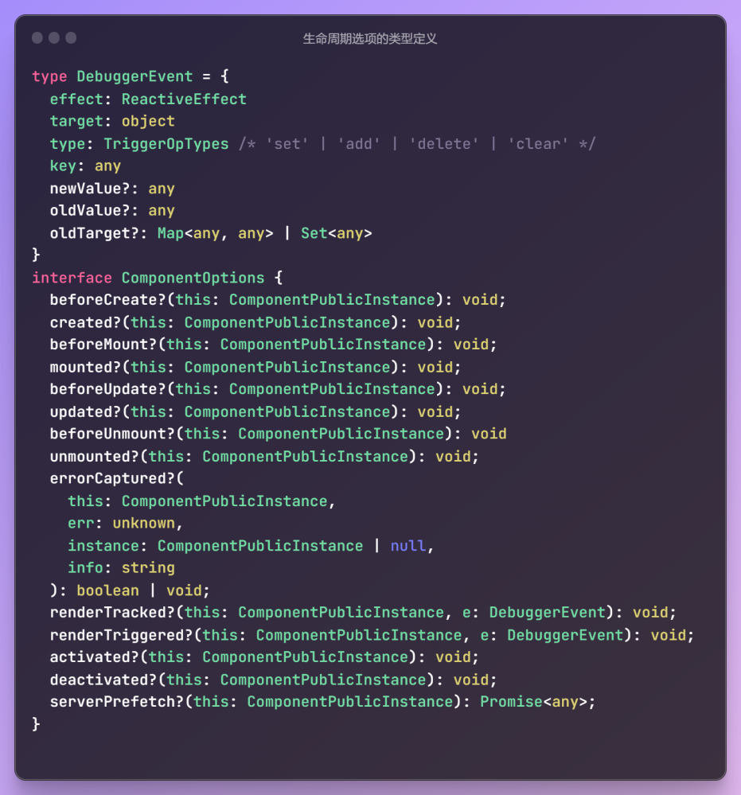

**beforeCreate 选项**在组件实例初始化完成之后立即调用。会在实例初始化完成、props 解析之后、处理其他选项（比如data() 和 computed ）之前调用。注意，组合式 API 中的 setup() 钩子会在所有选项式 API 钩子之前调用。

**created 选项**在组件实例处理完所有与状态相关的选项后调用。当这个钩子被调用时，响应式数据、计算属性、方法和侦听器已经设置完成。然而，此时挂载阶段还未开始，因此 $el 属性仍不可用。

**beforeMount 选项**在组件被挂载之前调用。当这个钩子被调用时，组件已经完成了其响应式状态的设置，但还没有创建 DOM 节点。它即将首次执行 DOM 渲染过程。该钩子在服务端渲染时不会被调用。

**mounted 选项**在组件被挂载之后调用。组件在以下情况下被视为已挂载：
1. 所有同步子组件都已经被挂载。(不包含异步组件或 `<Suspense>` 树内的组件)
2. 其自身的 DOM 树已经创建完成并插入了父容器中。注意仅当根容器在文档中时，才可以保证组件 DOM 树也在文档中。

这个钩子通常用于执行需要访问组件所渲染的 DOM 树相关的副作用，或是在服务端渲染应用中用于确保 DOM 相关代码仅在客户端被调用。该钩子在服务端渲染时不会被调用。

**beforeUpdate 选项**在组件即将因为一个响应式状态变更而更新其 DOM 树之前调用。可以用来在 Vue 更新 DOM 之前访问 DOM 状态。在这个钩子中更改状态也是安全的。该钩子在服务端渲染时不会被调用。

**updated 选项**在组件因为一个响应式状态变更而更新其 DOM 树之后调用。父组件的updated钩子将在其子组件的updated钩子之后调用。该钩子会在组件的任意 DOM 更新后被调用，这些更新可能是由不同的状态变更导致的。如果需要在某个特定的状态更改后访问更新后的 DOM，请使用 nextTick() 作为替代。该钩子在服务端渲染时不会被调用。不要在 updated 钩子中更改组件的状态，这可能会导致无限的更新循环！

**beforeUnmount 选项**在一个组件实例被卸载之前调用。当这个钩子被调用时，组件实例依然还保有全部的功能。该钩子在服务端渲染时不会被调用。

**unmounted 选项**在一个组件实例被卸载之后调用。一个组件在以下情况下被视为已卸载：
1. 其所有子组件都已经被卸载。
2. 所有相关的响应式作用 (渲染作用以及 setup() 时创建的计算属性和侦听器) 都已经停止。

可以在这个钩子中手动清理一些副作用，例如计时器、DOM 事件监听器或者与服务器的连接。该钩子在服务端渲染时不会被调用。

**errorCaptured 选项**在捕获了后代组件传递的错误时调用。错误可以从以下几个来源中捕获：
1. 组件渲染
2. 事件处理器
3. 生命周期钩子
4. setup() 函数
5. 侦听器
6. 自定义指令钩子
7. 过渡钩子

钩子带有三个实参：错误对象、触发该错误的组件实例，以及一个说明错误来源类型的信息字符串。可以在 errorCaptured() 中更改组件状态来为用户显示一个错误状态。然而重要的是，不要让错误状态渲染为导致本次错误的内容，否则组件就会进入无限的渲染循环中。该钩子可以通过返回 false 来阻止错误继续向上传递。其错误传递规则如下：
1. 默认情况下，所有的错误都会被发送到应用级的 app.config.errorHandler (前提是这个函数已经定义)，这样这些错误都能在一个统一的地方报告给分析服务。
2. 如果组件的继承链或组件链上存在多个 errorCaptured 钩子，对于同一个错误，这些钩子会被按从底至上的顺序一一调用。这个过程被称为“向上传递”，类似于原生 DOM 事件的冒泡机制。
3. 如果 errorCaptured 钩子本身抛出了一个错误，那么这个错误和原来捕获到的错误都将被发送到 app.config.errorHandler。
4. errorCaptured 钩子可以通过返回 false 来阻止错误继续向上传递。即表示“这个错误已经被处理了，应当被忽略”，它将阻止其他的 errorCaptured 钩子或 app.config.errorHandler 因这个错误而被调用。

**renderTracked 选项**在一个响应式依赖被组件的渲染作用追踪后调用。该钩子仅在开发模式下可用，且在服务器端渲染期间不会被调用。

**renderTriggered 选项**在一个响应式依赖被组件触发了重新渲染之后调用。该钩子仅在开发模式下可用，且在服务器端渲染期间不会被调用。

**activated 选项**若组件实例是 `<KeepAlive>` 缓存树的一部分，当组件被插入到 DOM 中时调用。该钩子在服务端渲染时不会被调用。

**deactivated 选项**若组件实例是 `<KeepAlive>` 缓存树的一部分，当组件从 DOM 中被移除时调用。该钩子在服务端渲染时不会被调用。

**serverPrefetch 选项**当组件实例在服务器上被渲染之前要完成的异步函数。如果这个钩子返回了一个 Promise，服务端渲染会在渲染该组件前等待该 Promise 完成。该钩子仅会在服务端渲染中执行，可以用于执行一些仅在服务端才有的数据抓取过程。

### 其他杂项

**name 选项**用于显式声明组件展示时的名称。类型：interface ComponentOptions { name?: string }。组件的name有以下用途：
1. 在组件自己的模板中递归引用自己时
2. 在 Vue 开发者工具中的组件树显示时
3. 在组件抛出的警告追踪栈信息中显示时

当在使用单文件组件时，组件已经会根据其文件名推导出其名称。当一个组件通过 app.component 被全局注册时，这个全局 ID 就自动被设为了其名称。使用 name 选项使得可以覆盖推导出的名称，或是在没有推导出名字时显式提供一个。(例如没有使用构建工具时，或是一个内联的非 SFC 式的组件)。

## 组合式 API

**watchEffect()** 立即运行一个副作用函数，同时响应式地追踪其依赖（只能追踪副作用函数内的同步代码的依赖），并在依赖更改时重新执行该副作用函数。watchEffect的类型如下：

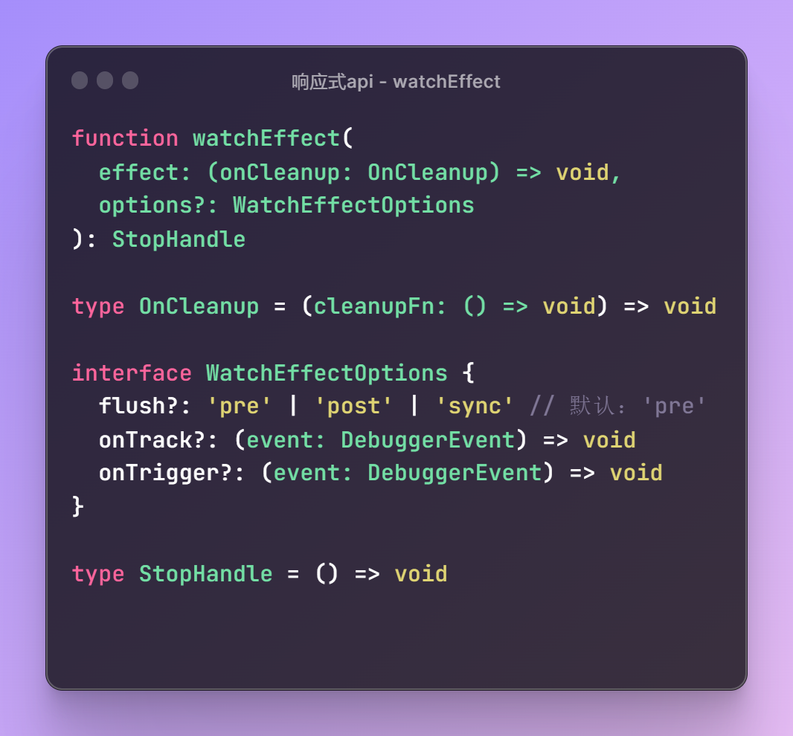

第一个参数就是要运行的副作用函数。这个副作用函数的参数也是一个函数，用来注册清理回调。清理回调会在该副作用下一次执行前被调用，可以用来清理无效的副作用，例如等待中的异步请求。第二个参数是一个可选的选项，可以用来调整副作用的刷新时机或调试副作用的依赖。默认情况下，侦听器将在组件渲染之前执行。设置 flush: 'post'或使用函数别名watchPostEffect()将会使侦听器延迟到组件渲染之后再执行。在某些特殊情况下 (例如要使缓存失效)，可能有必要在响应式依赖发生改变时立即触发侦听器。这可以通过设置 flush: 'sync' 或使用函数别名watchSyncEffect()来实现。然而，该设置应谨慎使用，因为如果有多个属性同时更新，这将导致一些性能和数据一致性的问题。watchEffect()的返回值是一个用来停止该副作用的函数。

**setup() 钩子**是在组件中使用组合式 API 的入口，使用场景：
1. 需要在非单文件组件中使用组合式 API 时。而对于在单文件组件中使用的组合式 API，推荐 `<script setup>`。 
2. 需要在基于选项式 API 的组件中集成基于组合式 API 的代码时。

**setup()** 内可以使用响应式 API来声明响应式的状态。
1. **setup 函数的第一个参数是组件的 props**，props 是响应式的，并且会在传入新的 props 时同步更新。从props中解构出的变量将会丢失响应性。因此推荐通过 props.xxx 的形式来使用其中的 props。如果确实需要解构 props 对象，或者需要将某个 prop 传到一个外部函数中并保持响应性，那么可以使用 toRefs() 和 toRef() 这两个工具函数。
2. **setup 函数的第二个参数是一个 Setup 上下文对象 context**，包括attrs, slots, emit, expose四个属性。该上下文对象context是非响应式的，可以安全地解构。
    1. **attrs 和 slots** 都是有状态的对象，它们总是会随着组件自身的更新而更新。这意味着应当避免解构它们，并始终通过 attrs.xx 或 slots.xxx 的形式使用其中的属性。attrs 和 slots 的属性都不是响应式的。
    2. **expose 函数**用于显式地限制该组件暴露出的属性，当父组件通过模板引用访问该组件的实例时，将仅能访问 expose 函数暴露出的内容。如果不调用，则setup函数返回对象中的所有属性均会在实例上保留，即可以被父组件通过模板引用的方式访问。如果无参调用expose()，则均不会在实例上保留。而
3. setup()返回一个对象或只返回一个渲染函数，若是返回对象，则对象的属性会暴露给当前组件中的模板和其他的选项式 API 钩子，该返回对象实际上是以参数$setup传递给本组件的渲染函数，若是返回渲染函数，渲染函数中可以直接使用setup()里在同一作用域下声明的响应式状态，如果需要将setup中的方法通过模板引用的方式暴露给父组件，只能通过 **expose 函数**。而setup() 自身并不含对组件实例的访问权，即在 setup() 中访问 this 会是 undefined。在模板中访问或通过 this 访问从 setup 返回的ref时，ref会被自动浅层解包，因此无须再在模板或选项式API中为它写 .value。setup() 函数应该同步地return，除非该组件是 Suspense 组件的后代才可以使用 async setup()。

## `<script setup>`

1. defineExpose编译器宏：显式指定在 `<script setup>` 组件中要暴露出去的属性。因为使用 `<script setup>` 的组件是默认关闭的——即通过模板引用或者 $parent 链获取到的组件的公开实例，不会暴露任何在 `<script setup>` 中声明的绑定。`<script setup>` 编译结果就是setup()函数且setup()函数内部无参调用expose()。

## 代码编译与优化

代码编译是指由 Vue 代码编译生成最终运行代码过程。Vue2的编译流程：
1. **Parse（解析阶段）**：根据 template （模板）解析出表述 DOM 节点的原始AST（抽象语法树）。
2. **Optimize（优化阶段）**：遍历AST，对diff时需要跳过的静态节点进行标记，优化runtime的性能。
3. **Generate（生成阶段）**：把优化后的 AST 树转换成可执行的代码。

在 Vue 中，框架同时控制着编译器和运行时。这使得可以为紧密耦合的模板渲染器应用许多编译时优化。编译器可以静态分析模板并在生成的代码中留下标记，使得运行时性能提升。**Vue3 的编译优化主要是通过重写虚拟 DOM，包括**：
1. **更新类型标记**：在对更新的节点进行对比的时候，只会去对比带有特定 PatchFlag 标记的节点。一个元素可以有多个更新类型标记，会被合并成一个数字。运行时渲染器也将会使用位运算来检查这些标记，确定相应的更新操作。更新类型标记和树结构打平都大大提升了 Vue SSR 激活的性能表现。

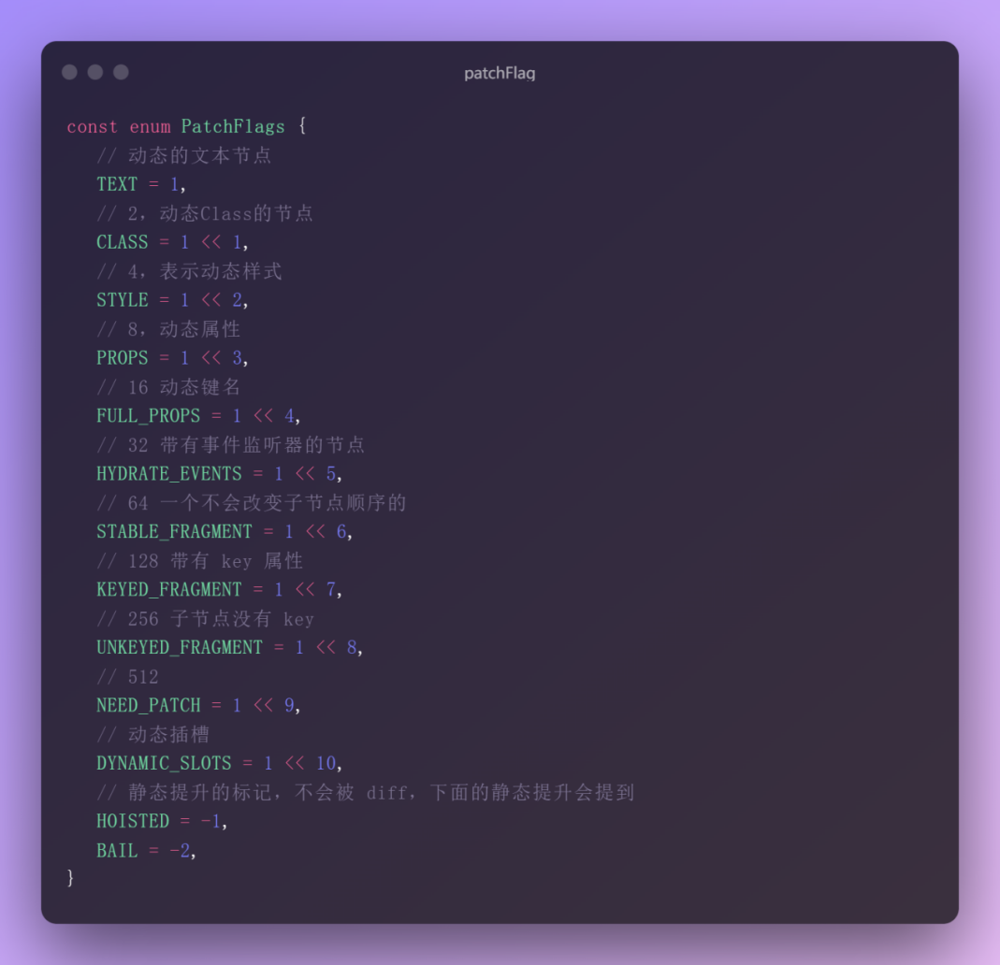

2. **树结构打平**：内部结构是稳定的一个部分可被称之为一个区块（Block，v-if 和 v-for 指令会创建新的区块节点），每一个块都会追踪其所有带更新类型标记的后代节点 (不只是直接子节点)。编译的结果会被打平为一个数组，仅包含所有动态的后代节点。当这个组件需要重渲染时，只需要遍历这个打平的树而非整棵树。这大大减少了在虚拟 DOM 协调时需要遍历的节点数量。模板中任何的静态部分都会被高效地略过。一个子区块会在父区块的动态子节点数组中被追踪。
3. **静态提升**：将静态的节点或属性（静态节点，即不带任何动态绑定的元素节点）提升到render函数外，避免重新渲染时的再次创建和执行。
4. **预字符串化**：当有足够多连续的静态元素时，它们还会再被压缩为一个“静态 vnode”（_createStaticVNode方法），其中包含的是这些节点相应的纯 HTML 字符串。这些静态节点会直接通过 innerHTML 来挂载。同时还会在初次挂载后缓存相应的 DOM 节点。如果这部分内容在应用中其他地方被重用，那么将会使用原生的 cloneNode() 方法来克隆新的 DOM 节点，这会非常高效。生成代码的体积减少；减少创建 VNode 的开销；减少内存占用。
    1. 20个及以上的连续静态元素
    2. 5个及以上的连续仅具有静态绑定属性的静态元素
5. **缓存事件处理函数**：默认情况下事件被认为是动态变量，所以每次更新视图的时候都会追踪它的变化。但是正常情况下，事件在视图渲染前后，都是同一个事件，基本上不需要去追踪它的变化，因此对事件监听进行了缓存。

## 深入响应式系统

**响应性**本质上是一种可以使得我们声明式地处理变化的编程范式。
**副作用（effect）简称为作用**，是会更改程序里的状态的函数。
**依赖 (dependency)**是执行作用中读取的变量，所以作用是依赖的**订阅者 (subscriber)**，在依赖变化时调用对应的订阅者。

**whenDepsChange() 函数有如下的任务**：
1. 当一个变量被读取时进行追踪。
2. 将读取该变量的副作用设为它的一个订阅者。
3. 探测一个变量的变化，一个依赖变化后，应该通知其所有订阅了的副作用重新执行。

原生 JavaScript 没有提供任何机制能做到直接追踪局部变量的读写，但可以追踪对象属性的读写的。JavaScript 中有两种劫持 property 访问的方式：getter / setters 和 Proxies。Vue 2 出于支持旧版本浏览器的限制使用 getter / setters（Object.defineProperty 是 ES5 中一个无法 shim 的特性，这也就是 Vue 不支持 IE8 以及更低版本浏览器的原因）。而在 Vue 3 中则使用了 Proxy 来创建响应式对象，仅将 getter / setter 用于 ref。reactive() 的局限性：
1. 当将一个响应性对象的属性解构为一个局部变量时，响应性就会“断开连接”，因为对局部变量的访问不再触发 get / set 代理捕获。
2. 从reactive() 返回的代理尽管行为上表现得像原始对象，但通过使用 === 运算符还是能够比较出它们的不同。

在依赖收集 track() 内部，会检查当前是否有正在运行的副作用。如果有，会查找到一个存储了所有追踪了该属性的订阅者的 Set，然后将当前这个副作用作为新订阅者添加到该 Set 中。副作用订阅将被存储在一个全局的 `WeakMap<target, Map<key, Set<effect>>>` 数据结构中。如果在第一次追踪时没有找到对相应属性订阅的副作用集合，它将会在getSubscribersForProperty() 函数中新建。

在派发更新 trigger() 之中，会再通过getSubscribersForProperty() 查找到该属性的所有订阅副作用。

whenDepsChange()它将订阅者函数包装在了一个副作用函数中。在运行实际的更新之前，这个副作用函数会将自己设为当前活跃的副作用。这使得在更新期间的 track() 调用都能定位到这个当前活跃的副作用。

组合式 API 更贴近 Vue 底层的响应式系统。事实上，Vue 3 中的选项式 API 正是基于组合式 API 建立的。对该组件实例 (this) 所有的属性访问都会触发 getter / setter 的响应式追踪，而像 watch 和 computed 这样的选项也是在内部调用相应等价的组合式 API。

**Vue2 中的响应式原理**：每个组件实例都对应一个 watcher 实例，它会在组件渲染的过程中把“接触”过的数据 property 记录为依赖。之后当依赖项的 setter 触发时，会通知 watcher，从而使它关联的组件重新渲染。Vue 在更新 DOM 时是异步执行的。只要侦听到数据变化，Vue 将开启一个队列，并缓冲在同一事件循环中发生的所有数据变更。如果同一个 watcher 被多次触发，只会被推入到队列中一次。然后，在下一个的事件循环“tick”中，Vue 刷新队列并执行实际 (已去重的) 工作。Vue 在内部对异步队列尝试使用原生的 Promise.then、MutationObserver 和 setImmediate，如果执行环境不支持，则会采用 setTimeout(fn, 0) 代替。可以在数据变化之后立即使用 Vue.nextTick(callback)，callback中Vue 已完成更新 DOM。

**nextTick 可以让我们在下次 DOM 更新循环结束之后执行延迟回调，用于获得更新后的 DOM。在 Vue 2.4 之前都是使用的 microtasks，但是 microtasks 的优先级过高，在某些情况下可能会出现比事件冒泡更快的情况，但如果都使用 macrotasks 又可能会出现渲染的性能问题。所以在新版本中，会默认使用 microtasks，但在特殊情况下会使用 macrotasks，比如 v-on。对于实现 macrotasks ，会先判断是否能使用 setImmediate ，不能的话降级为 MessageChannel ，以上都不行的话就使用 setTimeout**。

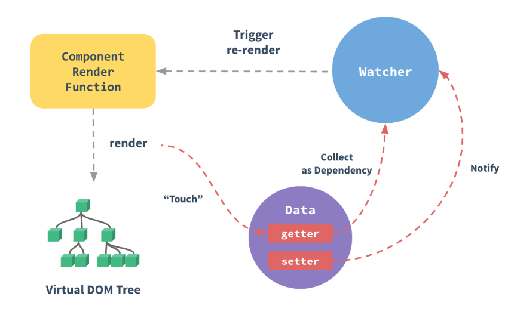

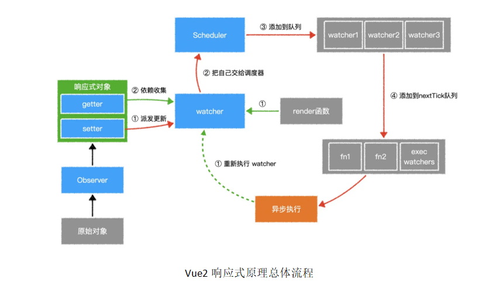

响应式数据的最终目标是当对象本身或属性发生变化时，将会运行一些函数（render，computed，watch）。具体实现上，Vue用到了几个核心部件：
1. **Observer**：目标是要将一个普通对象转换成响应式对象，递归的遍历对象所有属性，通过Object.defineProperty转换为访问器属性（getter和setter），发生在组件的生命周期的beforeCreate之后，created之前。由于Observer是Vue内部的构造器，但Vue提供Vue.observable(obj)间接使用该功能。由于遍历只能针对对象已有属性，因此无法追踪将来直接进行动态增加或删除属性，但提供$set和$delete两个实例方法对已有响应式对象添加或删除属性并能具有响应式。对于数组则修改其隐式原型（__proto__）为Vue自己定义的对象（覆盖重写了可能改变数组内容的pop、push、reverse、shift、unshift、sort方法），此对象的隐式原型才是Array.prototype。
2. **Dep**：即依赖（dependency），目标是解决读取属性时和属性变化时要做什么事情。Vue会为响应式对象的每个属性、对象本身、数组本身创建一个Dep实例来负责当读取响应式对象的某个属性时进行**依赖收集（dep.depend()）**和当改变某个属性时进行**派发更新（dep.notify()）**。
3. **Watcher**：解决如何知道哪些函数在使用依赖的问题。默认响应式对象是无法知道哪个函数在使用它。Vue不是直接执行函数，而是创建一个watcher对象去执行。watcher会设置一个全局变量，让全局变量记录当前负责执行的watcher等于自己，然后再去执行函数，在函数执行过程中，如果发生了依赖收集 dep.depend()，在 **dep.depend() 中就可以记录全局变量指向的当前 watcher。而当改变该属性时派发更新dep.notify() 里就会通知之前记录的所有 watcher**。因此，每个vue组件实例至少对应一个记录该组件的render函数的watcher。watcher首先会运行一次render以收集依赖，当数据变化时，dep会通知该watcher重新运行render函数，从而界面重新渲染同时记录当前依赖。
4. **Scheduler**：解决watcher收到Dep的派发更新的通知后watcher如何执行函数的问题，避免相同watcher被频繁通知运行。watcher收到派发更新的通知后，不是立即执行其对应函数，而是将自己交给scheduler调度器，scheduler维护一个执行队列，队列中的watcher会通过一个nextTick的方法将执行这些watcher的包装函数放入事件循环的微队列中（考虑兼容性，如果不支持微队列，则setTimeout）。因此，首次render执行是同步的，而当派发更新时，render执行是异步的。

Vue2中，由于 JavaScript 的限制，Vue 不能检测数组和对象的某些变化：
1. Vue无法检测property的添加或移出。因为 Vue 会在初始化实例时对 property 执行 getter/setter 转化，所以 property 必须在 data 对象上存在才能让 Vue 将它转换为响应式的。对于已经创建的实例，Vue 不允许动态添加根级别的响应式 property，因此必须在初始化实例前声明所有根级响应式 property，哪怕只是一个空值。但是，可以使用 Vue.set(object, propertyName, value) 方法或vm.$set 实例方法向嵌套对象添加响应式 property。如果需要需要为已有对象赋值多个新 property，应该用原对象与要混合进去的对象的 property 一起创建一个新的对象并赋值给原对象变量。
2. Vue 不能检测以下数组的变动：
    1. 当利用索引直接设置一个数组项时。可以使用 Vue.set(object, propertyName, value) 方法或vm.$set 实例方法或vm.items.splice(indexOfItem, 1, newValue)来达到响应式更新。
    2. 当修改数组的长度时。可以使用vm.items.splice(newLength)来达到响应式更新。

## 渲染机制

虚拟 DOM (Virtual DOM，简称 VDOM) 是一种编程概念，意为将目标所需的 UI 通过数据结构“虚拟”地表示出来，保存在内存中，然后将真实的 DOM 与之保持同步。vnode 即一个纯 JavaScript 的对象 (一个“虚拟节点”)，它包含我们创建实际元素所需的所有信息。它还包含更多的子节点，这使它成为虚拟 DOM 树的根节点。组件树中每个组件都有render函数，每个render函数返回一个虚拟DOM树。

虚拟 DOM 带来的主要收益是它让开发者能够灵活、声明式地创建、检查和组合所需 UI 的结构，同时只需把具体的 DOM 操作留给渲染器去处理。

**为什么需要虚拟DOM？优点：**
1. 框架的虚拟 DOM 需要适配任何上层 API 可能产生的操作，它的一些 DOM 操作的实现必须是普适的，所以它的性能并不是最优的；但是比起粗暴的 DOM 操作性能要好很多，因此框架的虚拟 DOM 至少可以保证在不需要手动优化的情况下，依然可以提供还不错的性能，即保证性能的下限；
2. 无需手动操作 DOM，专注数据视图，开发效率提升 
3. 操作JS对象而不是DOM与平台不再强相关，方便跨平台。

**缺点**：无法进行极致优化： 虽然虚拟 DOM + 合理的优化，足以应对绝大部分应用的性能需求。但在一些性能要求极高的应用中虚拟 DOM 无法进行针对性的极致优化。首次渲染大量DOM时，由于多了一层虚拟DOM的计算，会比innerHTML插入慢。

**Vue 组件挂载时的渲染管线**：

**编译（complie）**：Vue 模板被编译（compile模块）为渲染函数：即用来返回虚拟 DOM 树的函数；既可以通过构建步骤提前完成（模板预编译，能有效提高运行时性能和减少运行时文件体积，即vue-cli默认配置下，发生在打包时，而且在vue-cli中如果组件中同时有模板和render函数，模板生成的render会覆盖定义的render），也可以通过使用**运行时编译器**（传入的引入方式或vue-cli的配置中开启runtimeCompiler）即时（第一次加载时）完成。编译的过程分为两步：
1. 将模板字符串转换为AST；
2. 将AST转换为渲染函数。

**挂载（mount）**：**运行时渲染器**调用渲染函数，遍历返回的虚拟 DOM 树，并基于它创建实际的 DOM 节点，每个虚拟DOM节点将对应的真实的DOM节点作为其属性一一对应（因此，实际上挂载时，由于借助虚拟DOM相比直接生成真实DOM多了生成虚拟DOM的操作，效率更低）。这会作为响应式副作用执行，因此它会追踪其中所用到的所有响应式依赖。 

**更新**：当一个依赖发生变化后，副作用会重新运行，这时候会render函数创建一个更新后的虚拟 DOM 树。运行时渲染器遍历这棵新树，将它与旧树进行比较，找到新树中的最小更新量，抛弃旧树，然后将必要的更新应用到真实 DOM 上去，即 **patch**，又被称为“**比对**”**(diffing)** 或“**协调**”**(reconciliation)**。

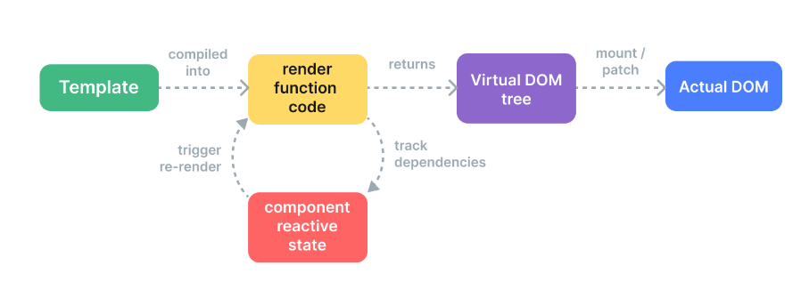

Vue 模板会被预编译成虚拟 DOM 渲染函数。Vue 也提供了 API 使我们可以不使用模板编译，直接手写渲染函数。渲染函数一般只会在需要处理高度动态渲染逻辑的可重用组件中使用，渲染函数更加灵活，因为可以完全地使用 JavaScript 来构造想要的 vnode。因此，Vue 默认推荐使用模板的原因：
1. 模板更贴近实际的 HTML。能够更方便地重用一些已有的 HTML 代码片段，能够带来更好的可访问性体验、能更方便地使用 CSS 应用样式，并且更容易使开发者理解和修改。
2. 由于其确定的语法，更容易对模板做静态分析。使得 Vue 的模板编译器能够应用许多编译时优化来提升虚拟 DOM 的性能表现。

**虚拟DOM算法实现**：
1. 将DOM 抽象成JS对象（用 JavaScript 对象来表示 DOM 节点，使用对象的属性记录节点的类型、属性、子节点等）
2. 对比两个虚拟DOM树的差异并更新真实DOM（考虑到在实际业务中很少会去跨层的移动 DOM 元素，因此只对比同层的节点，时间复杂度从 O(n^3)降到O(n)）。

**diff算法**：updateComponent函数分别会在组件创建时直接运行，以及在依赖发生变化时通过new Watcher运行，该函数内部：
1. 调用this._render生成新的虚拟DOM树
2. 调用this._update，将（1）中生成的新的虚拟DOM树传入，diff就发生在this._update函数运行过程中。首先通过当前组件的this._vnode属性拿到旧的虚拟DOM树保存到为变量oldVNode，然后将this._vnode属性赋值为新的虚拟DOM树。然后判断oldVNode是否存在：
    1. 不存在：说明是首次渲染组件，于是直接通过this.__patch__函数，遍历新的虚拟DOM树，为每个节点生成真实DOM，并挂载到每个虚拟DOM节点的elm属性上。
    2. 存在：说明是更新渲染组件，于是通过this.__patch__函数对比新旧树，完成对所有真实DOM的最小化处理，让新树的虚拟DOM节点对应合适的真实DOM。
3. __patch__函数的对比流程：
    1. 术语解释：
        1. **相同**：是指两个节点的标签tag类型、key值均相同，input元素还需要看type属性。
        2. **新建元素**：是指根据一个虚拟节点提供的信息，创建一个真实DOM元素，同时挂载到虚拟节点的elm属性上。
        3. **销毁元素**：是指vnode.elm.remove()。
        4. **更新**：是指对两个虚拟节点进行对比更新，它仅发生在两个虚拟节点相同的情况下。
        5. **对比子节点**：是指对两个虚拟节点的子节点进行对比。
    2. __patch__函数首先对根节点比较（按深度优先，同级比较）：
        1. **相同**，进入**更新**流程，递归更新完成后将：
            1. 将旧虚拟节点的真实DOM赋值到新虚拟节点：newVnNode.elm = oldVnode.elm；
            2. 对比新节点和旧节点的属性，有变化的更新到真实DOM中；
            3. 当前两个节点处理完毕，开始**对比子节点**，原则是尽量不改，否则尽量仅改动元素属性，否则尽量移动元素，否则才是删除和创建元素。
                1. 分别使用两个指针指向新子节点数组两端和旧子节点数组的两端。
                2. 在新头指针小于等于新尾指针的前提下，循环的按照**新头指针-旧头指针，新尾指针-旧尾指针，新头指针-旧尾指针，新尾指针-旧头指针，以新头指针为基准循环旧头指针到旧尾指针之间**5种情况依次对比新旧子节点数组的对应的节点。当前情况不同，才看下一种情况，如果**以新头指针为基准循环旧头指针到旧尾指针之间**都找不到**相同**，才新建元素。**任何一种情况** **相同**，则该情况进入和根节点相同的对比流程，直到指针对应的新旧子树递归对比完毕。**如果是新头指针-旧尾指针**，则需要移动真实DOM的位置到旧头指针的前面。**如果是新尾指针-旧头指针**，则需要移动真实DOM的位置到旧尾指针对应的真实DOM的后面。**以新头指针为基准循环旧头指针到旧尾指针之间**，则需要移动真实DOM的位置到旧头指针的前面。然后将该情况下的头指针则后移，尾指针则前移。
                3. 新头指针大于新尾指针，则循环结束，旧子节点数组中剩余的节点应该被删除，其对应的真实dom也应被移除。
        2. **不相同**
            1. 新虚拟节点**递归**地**新建元素**；因此，对于tag相同情况下，如果re-render前后真实DOM需要不变则应该保证提供相同的key，真实DOM需要改变应该保证提供不同的key。
            2. 旧虚拟节点**销毁元素**。

## 性能优化

永远不要过早优化。
1. **使用key**：对于通过循环生成的列表，应给每个列表项一个稳定且唯一的key，有利于在列表变动时，尽量少的删除、新增、改动元素。
2. **使用v-show代替v-if**：对于频繁切换显示状态的元素，尤其是内部包含大量dom的元素，使用v-show保证虚拟DOM树的稳定，避免频繁的新增与删除元素。
3. **使用冻结的对象**：冻结的对象不会被响应化。浅层式 API （shallowRef() 和 shallowReactive() ）创建的状态只在其顶层是响应式的，对所有深层的对象不会做任何处理。
4. **使用函数式组件**。
5. **使用计算属性**：如果模板中的某个数据会使用多次，并且该数据是通过计算得到的，使用计算属性以缓存它们。
6. **使用表单项非实时绑定**：v-model是实时绑定，即只要改变表单项状态，数据就会更改，导致re-render。可以使用lazy修饰符或直接不适用v-model来解决。但也就无法享受数据与表单项实时一致的好处。
7. **保持属性对象引用稳定**：vue判断数据是否变化通过 !Object.is(x, y)。因此，只要保证组件依赖的数据不发生变化，就不会re-render。对于原始数据类型，保持其值不变即可；对于对象类型，保持其引用不变即可。
8. **使用延迟装载（defer）**：延迟装载组件，让组件按照指定的顺序依次渲染出来，本质上是利用requestAnimationFrame事件分批渲染内容。
9. **使用 `<keep-alive>`**：在多个组件间动态切换时缓存被移除的组件实例。
10. **大型虚拟列表**：通过列表虚拟化，只需要渲染可见部分。
11. **包体积与 Tree-shaking 优化**：即压缩 JavaScript 打包产物的体积，尽可能采用构建步骤
    1. vue的api是可以被tree shaking的
    2. 模板预编译可以减少Vue编译器的体积（均开启gzip时可以缩小14kb）。
    3. 尽量选择对tree shaking更友好的ES模块格式的依赖。
12. **代码分割**：指构建工具将构建后的 JavaScript 包拆分为多个较小的，可以按需或并行加载的文件。打包工具（Rollup（vite基于它）或webpack）可以通过分析 ESM 动态导入的语法来自动进行代码分割。使用异步组件配合动态导入进行组件懒加载，甚至使用异步组件作为路由组件。

## 实现双向数据绑定

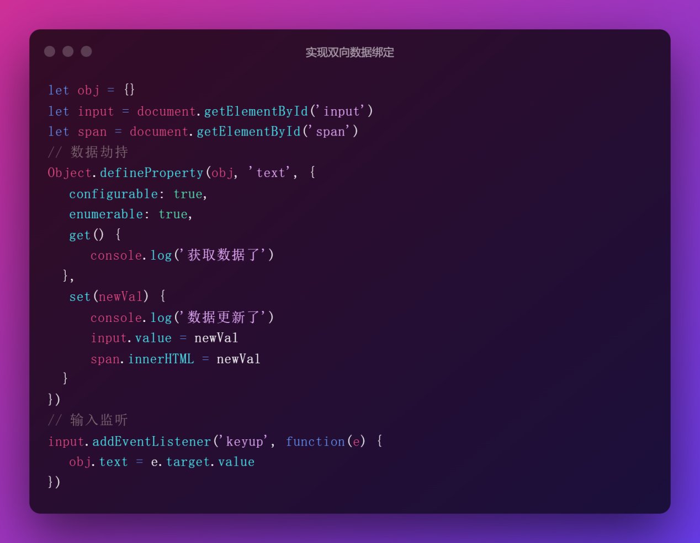

## 其他

### 组件间通信

组件间的通信方式分为三种：隔代通信（A与C/D）、兄弟通信（C与D）、父子通信（A与B）

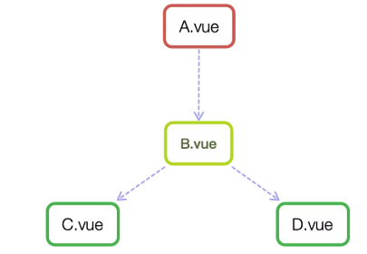

方式1：父组件A通过props的方式向子组件B传递数据，子组件B通过$emit事件向父组件A传递数据，然后在A中以 v-on（缩写是 @） 的方式接收（组件中的数据共有三种形式：data、props、computed）。**此方法无法兄弟通信**。

方式2：利用一个空的Vue实例作为事件中心，任一组件通过$emit传递数据，另一组件使用$on接收数据。**适用于三种通信方式**。但对于大型项目更好的状态管理解决方案vuex。由于有时不确定何时会触发事件，接收方一般应在mounted 或 created中监听。

方式3：在 vuex 里数据改变的时候把数据拷贝一份保存到localStorage里面，刷新之后，如果localStorage里有保存的数据，取出来再替换store里的state。**可支持三种通信方式**。

方式4：在父组件中在子组件上进行ref引用，然后在父组件中使用this.$ref访问子组件的数据，如果在普通的 DOM 元素上使用，引用指向的就是 DOM 元素；如果用在子组件上，引用就指向组件实例。**此方法无法隔代和兄弟通信，而且单独使用仅单向（访问子组件的数据）**。

方式5：祖先组件中通过provider来提供变量，然后在所有的子孙后代组件中通过inject来注入变量。解决的是隔代通信的问题，使用场景主要是子组件获取祖先组件的状态，隔代组件间建立了一种主动提供与依赖注入的关系。

### Vue3 和 Vue2 的区别

1. proxy 代替 Object.definePrototety 实现响应式系统：Object.defineProperty只能对属性进行劫持，因此需要深度遍历对象，同时Object.defineProperty无法对数组做监听变化（只是不能监听新添加的元素，同时每项监听性能不佳），Vue2中取而代之的是使用hack 的办法做替代。Proxy返回代理对象，可以直接监听对象和数组的变化，而且如果子属性是对象的，只需要在读取到该属性时才将其变成子代理对象。
2. TypeScript 代替 Flow 进行类型检查；
3. 重构了目录结构，将代码主要分成三个独立的模块，更利于长期维护；
4. 重写 VDOM，优化编译性能；
5. 支持 Tree Shaking；
6. 增加了组合式（Composition）API（setup），让代码更易于维护；
7. 异步组件需要 defineAsyncComponent 方法来创建；
8. v-if 优先级高于 v-for；
9. destroyed 生命周期选项被重命名为 unmounted；
10. beforeDestroy 生命周期选项被重命名为 beforeUnmount；
11. render 函数默认参数 createElement 移除改为全局引入；
12. 组件事件现在需要在 emits 选项中声明。
13. 通过**响应式系统重写**、**编译优化**和**源码体积优化**（按需加载）三个方面提升性能。

## Vue-loader

## Vuex

使用 Vuex 并不意味着你需要将所有的状态放入 Vuex。虽然将所有的状态放到 Vuex 会使状态变化更显式和易调试，但也会使代码变得冗长和不直观。如果有些状态严格属于单个组件，最好还是作为组件的局部状态。你应该根据你的应用开发需要进行权衡和确定。


## VueRouter


base属性：是基准路径，它被预置到每个 URL 上。这允许在一个域名子文件夹中托管 SPA（比如，将 base 设置为 /sub-folder 使得其托管在 example.com/sub-folder）。

## Vue-cli

publicPath：部署应用包时的基本 URL。默认情况下，Vue CLI 会假设应用是被部署在一个域名的根路径上，例如 https://www.my-app.com/。如果应用被部署在一个子路径上，你就需要用这个选项指定这个子路径（比如，如果应用被部署在 https://www.my-app.com/my-app/，则设置 publicPath 为 /my-app/）。这个值也可以被设置为空字符串 ('') 或是相对路径 ('./')，这样所有的资源都会被链接为相对路径，这样打出来的包可以被部署在任意路径，也可以用在类似 Cordova hybrid 应用的文件系统中。但相对路径的 publicPath 有一些使用上的限制。当使用基于 HTML5 history.pushState 的路由时或者当使用 pages 选项构建多页面应用时，应当避免使用相对 publicPath。publicPath在在开发环境下同样生效。

