# 跨平台（混合开发）

混合开发是指使用多种开发模开发App的一种开发模式，涉及到两大类技术：原生 Native、Web H5。原生 Native 主要指 iOS（Objective C）、Android（Java），原生开发效率较低，开发完成需要重新打包整个App，发布依赖用户的更新，性能较高功能覆盖率更高；Web H5主要由HTML、CSS、JavaScript组成，Web可以更好的实现发布更新，跨平台也更加优秀，但性能较低，特性受限。

跨平台开发是围绕着**研发效能**和**用户体验**两个主题去打造的，通过在两者之间进行取舍，诞生了多种跨平台解决方案。

根据采用的渲染技术不同，跨平台解决方案分为：
1. **Web 渲染**，h5 + JSBridge + WebView => h5 容器 => 小程序;
2. **原生渲染**，React Native;
3. **自建渲染引擎渲染**，Flutter。

## JSBridge 和 WebView

### JSBridge

原生 Native 与 Web 端相互通信离不开 JSBridge。JSBridge 是以 JavaScript 引擎或 Webview 容器作为媒介，通过协定协议进行通信，实现 Native 端和 Web 端双向通信（**JS 向 Native 发送消息**: 调用相关功能、通知 Native 当前 JS 的相关状态等。**Native 向 JS 发送消息**: 回溯调用结果、消息推送、通知 JS 当前 Native 的状态等。）的一种机制。

JavaScript 是运行在一个单独的 JS Context 中（例如，WebView 的 Webkit 引擎、JSCore）。由于这些 Context 与原生运行环境的天然隔离，可以将这种情况与 RPC（Remote Procedure Call，远程过程调用）通信进行类比，将 Native 与 JavaScript 的每次互相调用看做一次 RPC 调用。如此可以按照通常的 RPC 方式来进行设计和实现。

目前主流的 JSBridge 实现中，都是通过拦截 URL 请求来达到 native 端和 webview 端相互通信的效果。

1. 首先，需要在 webview 侧和 native 侧分别注册 bridge，其实就是用一个对象 messageHandlers把所有 handler 函数储存起。
2. 然后，在 webview 里面注入初始化代码：
    1. 创建一个名为 WVJBCallbacks 的数组，将传入的 callback 参数放到数组内；
    2. 创建一个 iframe，设置不可见，设置 src 为 https://__bridge_loaded__；
    3. 设置定时器移除这个 iframe。
3. 最后，在 native 端监听 url 请求：
    1. 拦截了所有的 URL 请求并拿到 url。
    2. 首先判断 isWebViewJavascriptBridgeURL，判断这个 url 是不是 webview 的 iframe 触发的，具体可以通过 host 去判断。
    3. 继续判断，如果是 isBridgeLoadedURL，那么会执行 injectJavascriptFile 方法，会向 webview 中再次注入一些逻辑，其中最重要的逻辑就是，在 window 对象上挂载一些全局变量和 WebViewJavascriptBridge属性。
    4. 继续判断，如果是 isQueueMessageURL，那么这就是个处理消息的回调，需要执行一些消息处理的方法。

### WebView
WebView 是移动端提供的运行 JavaScript 的环境，是系统渲染 Web 网页的一个控件，可与页面 JavaScript 交互，实现混合开发。

简单来说，WebView 是手机中内置了一款高性能 Webkit 内核浏览器，在 SDK 中封装的一个组件。不过没有提供地址栏和导航栏，只是单纯的展示一个网页界面。

WebView 可以简单理解为页面里的 iframe 。原生 app 与 WebView 的交互可以简单看作是页面与页面内 iframe 页面进行的交互。就如页面与页面内的 iframe 共用一个 Window 一样，原生与 WebView 也共用了一套原生的方法。

其中 Android 和 iOS 又有些不同：
1. Android目前是 基于 Chromium 内核。
2. iOS 目前采用的是 WKWebView。

WebView 可以对 url 请求、页面加载、渲染、页面交互进行强大的处理。webview 去加载 url 并不像是 浏览器加载 url 的过程，webview 存在一个初始化的过程。为了提升 init 时间，通常做法是 app 启动时初始化一个隐藏的 webview 等待使用，当用户点击需要加载URL，直接使用这个 webview 来加载，从而减少 webview init 初始化时间。弊端就是带来了额外的内存开销。

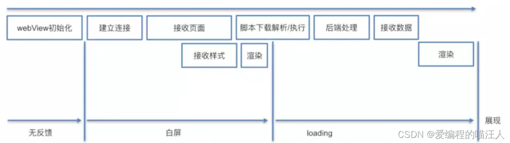

## Web 渲染

Web 渲染方案的有如下特点：
1. 开发效率高：采用 Web 技术，对前端友好，一次开发，多端运行；
2. 动态化好：Web 技术的天然动态特性支持，无需发版；
3. 表现一致性佳：Web 页面除了个别元素和属性的差异、多屏适配外，其双端表现相对一致；
4. 性能较差：页面采用 WebView 渲染，页面加载耗时长，功能受限于 WebView 沙箱，能力有限，难以承接复杂交互或是需要高性能的任务，整体用户体验差。

### h5 + JSBridge + WebView

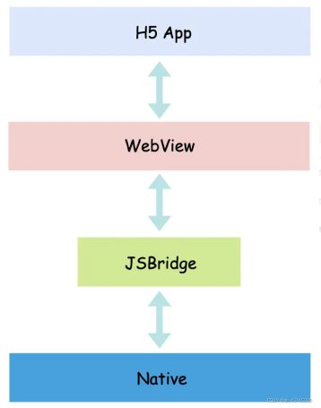

Web 渲染本质上是依托原生应用的内嵌浏览器控件 WebView 去渲染 H5 页面，并在原生应用中定义可供 H5 页面访问原生部分能力的接口 JSBridge，从而实现 H5 和 Native 双向通信，也进一步扩展 H5 端侧能力。因此，H5 App 的渲染流水线和 Web 页面渲染相一致。从 WebView 初始化到 H5 页面最终渲染的过程如下：

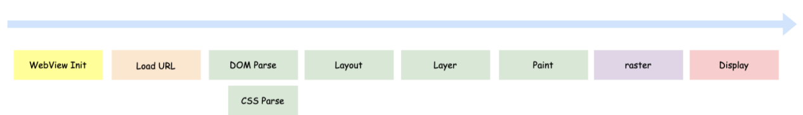

因此，Web 渲染性能上也存在首屏渲染优化问题，而且，还多出一个WebView 初始化的问题（可以通过 APP 启动的时候初始化一个常驻的隐藏WebView来处理）。

针对**资源加载所带来的白屏问题**，业界提出了**离线包的优化方案**。大体思路就是将原有从线上加载 H5 应用，提前下发到本地，通过 FileIO 或是内存等方式直接进行页面渲染，达到接近原生的用户体验。

### h5 容器

在这基础上业内又提出 **h5 容器的技术解决方案**，h5 容器提供丰富的内置 JSAPI，增强版的 WebView 控件以及插件机制等能力，对原始版本的方案做了进一步功能高内聚和模块低耦合。

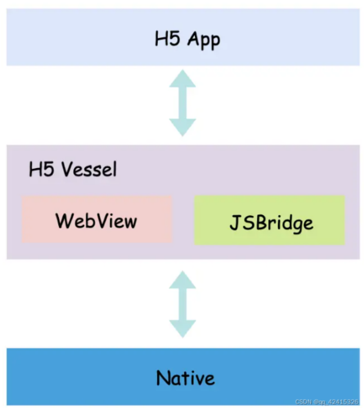

**Apache Cordova** 是一个开源的移动开发框架。它允许您使用标准 Web 技术 - HTML5、CSS3 和 JavaScript 进行跨平台开发。应用程序在针对每个平台的包装器内执行，并依靠符合标准的 API 绑定来访问每个设备的功能，例如传感器、数据、网络状态等。**该框架的实现原理就是基于 H5 容器 Web 渲染技术**。

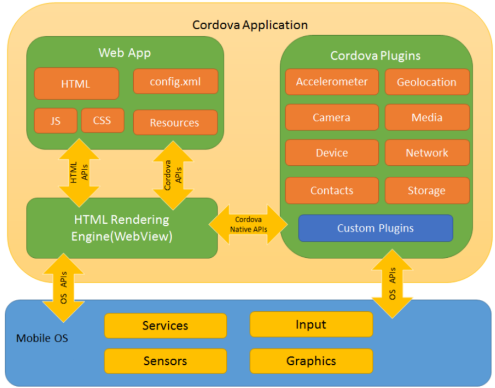

Cordova 应用程序由几部分组成：
1. Web App：应用程序代码的实现地方，采用的是 Web 技术，应用运行在原生控件 WebView 中。
2. HTML Rendering Engine：应用的渲染引擎，即 WebView，该渲染引擎是页面和 Native 实现双向通信的桥梁。
3. Cordova 插件：提供了 Cordova 和原生组件相互通信的接口并绑定到了标准的设备API上。这使你能够通过JavaScript 调用原生代码，这些核心插件包括的应用程序访问设备功能，比如：电源，相机，联系人等。
4. Mobile OS：原生系统层，提供系统能力。

### 小程序

小程序是无需下载安装即可使用的轻应用。小程序也是基于 Web 渲染方案，即采用 WebView 作为渲染引擎、JSBridge 的封装和离线包机制等，其最大创新之处在于将渲染层和逻辑层进行了分离，提供一个干净纯粹的 JavaScript 运行时，多 WebView 的架构使得用户体验进一步逼近原生体验。

小程序的渲染层和逻辑层分别由两个线程管理，渲染层采用 WebView 进行页面渲染（iOS 使用 UIWebView/WKWebView，Android 使用 WebView），小程序的多页面也由多 WebView 接管。逻辑层从 WebView 分离，使用 JavaScript 引擎（iOS 使用 JavaScriptCore，Android 使用 V8）单独开启一个 Worker 线程去执行 JavaScript 代码。逻辑层和渲染层之间的通信经由 Native 层中转，网络 IO 也通过 Native 层进行转发：

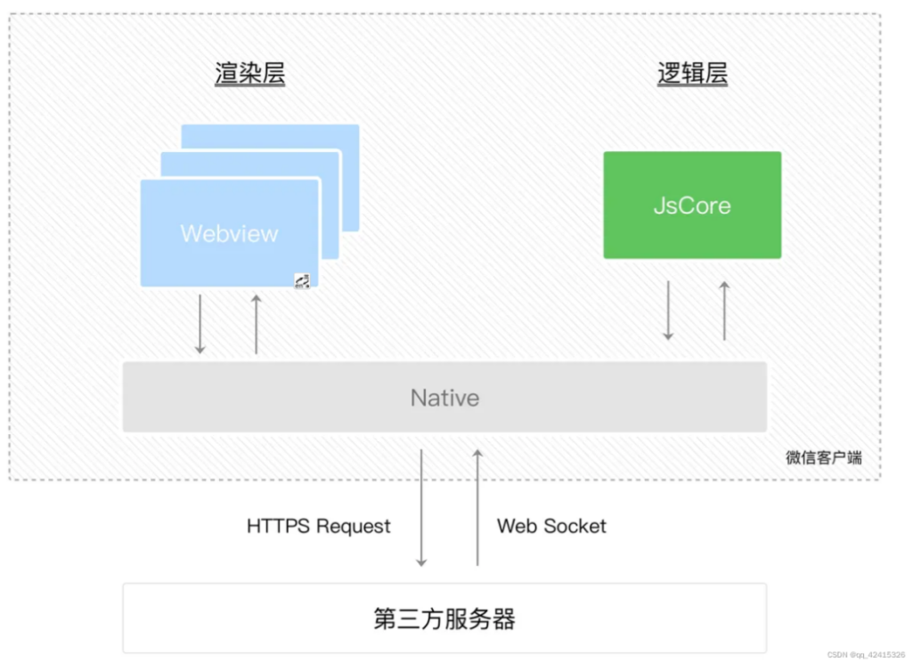

小程序采用的是多 WebView + 双线程模型。由多 WebView 构成的视图层为页面性能赋予更加接近原生的用户体验，单个 WebView 承载更加轻量的页面渲染任务（左侧为原始web渲染，右侧为小程序）：

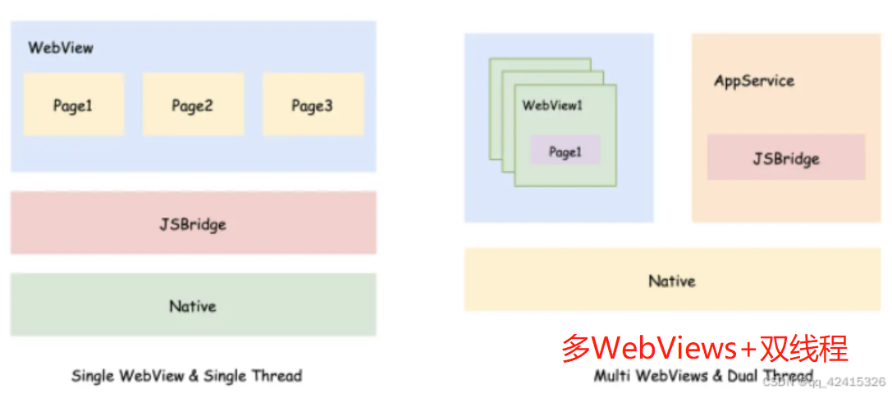

JavaScript 被单独抽离在 Worker 线程，限制了直接操作页面的能力（无法直接操作 DOM），也就被约束在微信小程序的规范下。

**小程序的组件分为原生组件和非原生组件**，原生组件属于原生渲染的一部分，所以小程序算得上是 Web 渲染和原生渲染的融合。

综上来看，Web 渲染的发展经历了从 h5 + JSBridge + WebView，到 h5 容器的抽象提升，再到小程序三个阶段。

## 原生渲染(React Native)

原生渲染的基本思路是在 UI 层采用前端框架，然后通过 JavaScript 引擎解析 JS 代码，JS 代码通过 Bridge 层调用原生组件和能力，最终，UI 的渲染通过 JSBridge 由原生控件直接接管，从而获得性能和体验的提升。代表的框架是 React Native，其整体架构图如下：

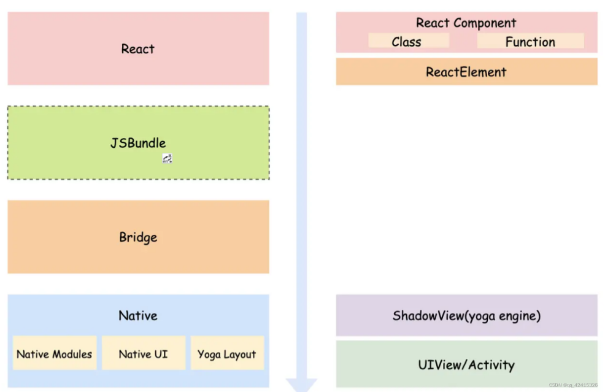

1. React 层：利用 React 框架进行 UI 的数据描述，开发者使用 Class Component 或 Functional Component 进行页面开发，框架内部将会把页面描述转化为 ReactElement 这一代表的虚拟 DOM 的数据结构，用于运行时的 Diff 对比和消息收发等。
2. [JS Bundle 中间产物]：RN 通过 metro 打包功能直接将整个 RN 应用打包为一个 JSBundle，通过 Bridge 层在 RN 应用初始化时加载整个 JS 包进来。
3. Bridge 层：Bridge 是连接 React 和 Native 的中间层，React 层的 UI 需要通过 Bridge 层的 UIManager 接口实现原生控件的创建和更新，通过 NativeModules 接口实现原生能力的调用。
4. Native 层：在 Native 层中，Native Modules 实现了与上层交互的原生能力接口，Native UI 实现终端实际的控件展示，Yoga 跨平台布局引擎实现了基于 FlexBox 布局系统的 JS 和 Native 的镜像映射关系。

视图层的渲染通过 UIManager 调 createView/updateView 等方法，基于 Yoga 布局引擎创建对应的 shadowView；逻辑层中涉及原生能力调用的部分通过 RCTBridge 对象转发到相应的原生接口。 Native 接收到 Bridge 层的消息，进行视图的更新或是功能处理。

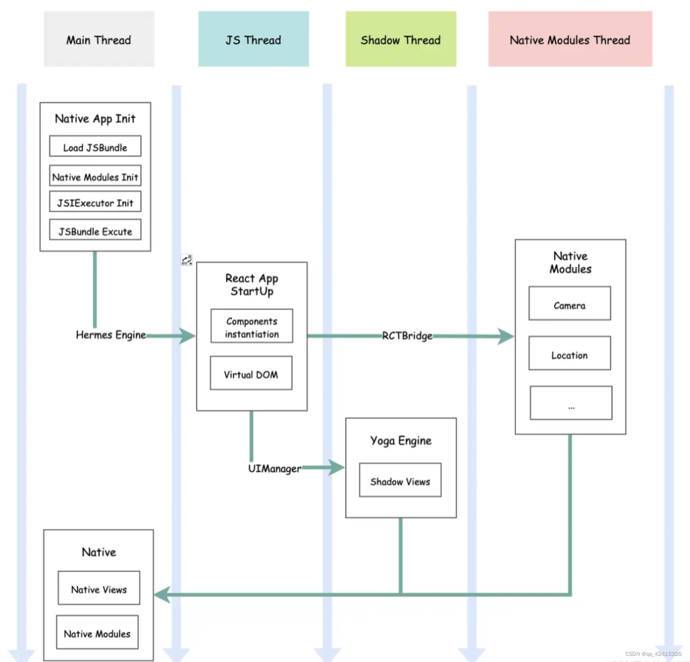

整个 RN 的线程模型：
1. Main 线程（UI 线程）：应用的主线程，进行初始化和处理原生控件的绘制。初始化的内容包括加载 JSBundle、初始化 Native Modules 等原生能力模块、创建 JSCore/Hermes JavaScript 引擎。
2. JS 线程：React 构成的 JS 代码运行在此线程，解释执行 React 代码，并将生成的布局或逻辑信息序列化后经由 Bridge 发送给 Native。
3. Shadow 线程：主要用于构建 JS 与原生控件的布局镜像数据。
4. Native Modules 线程：提供原生能力，这里采用的是多线程模型，iOS 端通过 GCD 实现，Android 端通过 AsyncTask 实现。

原生渲染直接接管渲染层，弥补了 Web 渲染方法在性能和体验上的不足。但是，在原生渲染架构中，页面的更新和事件的响应存在 Native 层和 JS 层的通信的时间成本，同时数据的交互需要频繁进行序列化和反序列化的转换，导致在一些 UI 线程和 JS 线程存在持续频繁交互的场景（动画、滚动等），RN等原生渲染的表现差强人意。

### Android 与 RN 组件对应关系

安卓 app UI 结构：

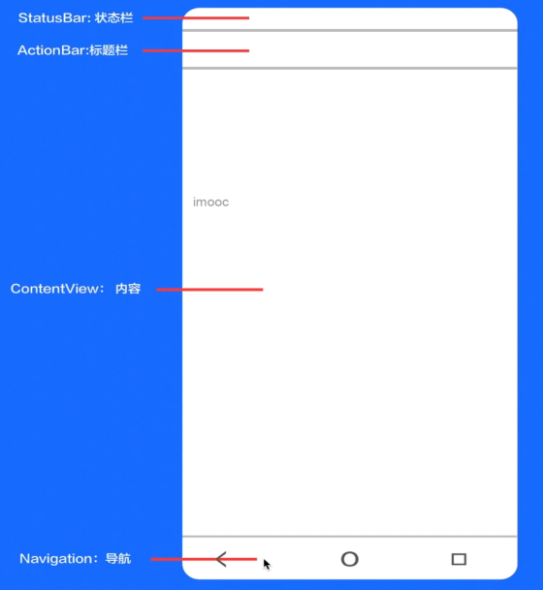

安卓是多个 Activity 进行切换，而 React Native 是同一个Activity中多个 RN page 进行切换：

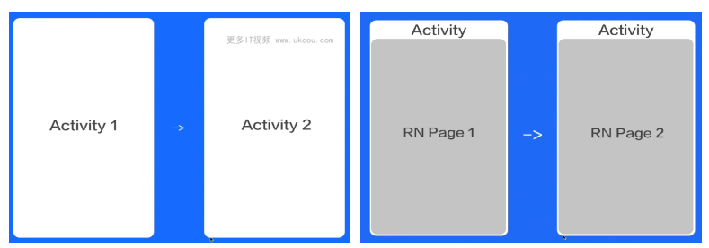

安卓原生弹窗是 Dialog 组件实现，RN 中弹窗是 Modal（对应于原生的是Window组件）：

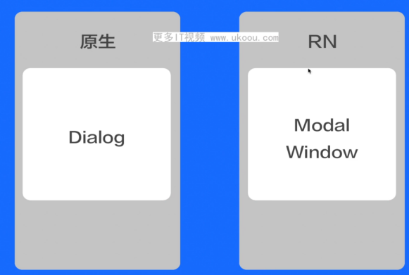

RN 和原生组件对应：

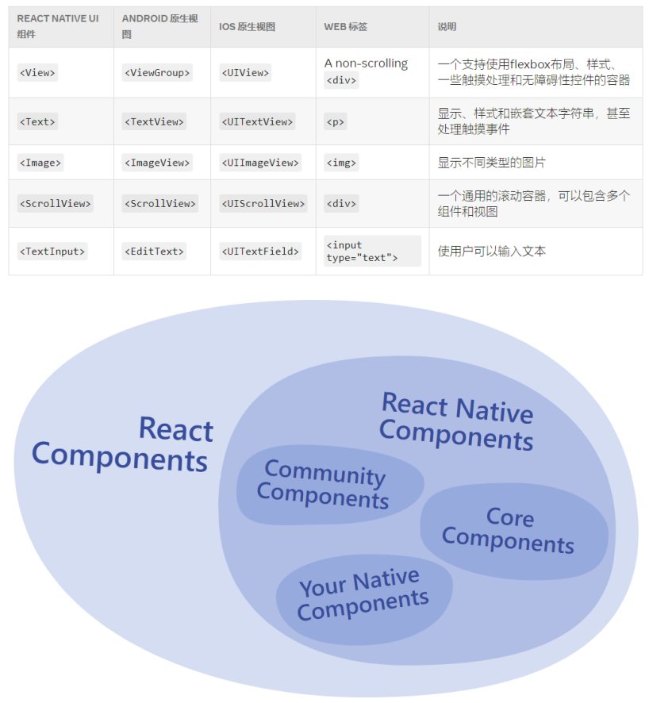

## 自建渲染引擎渲染(Flutter)

自建渲染引擎渲染通过自建渲染引擎方式，直接从底层渲染上实现 UI 的绘制，代表的框架是 Flutter，其架构设计如下:

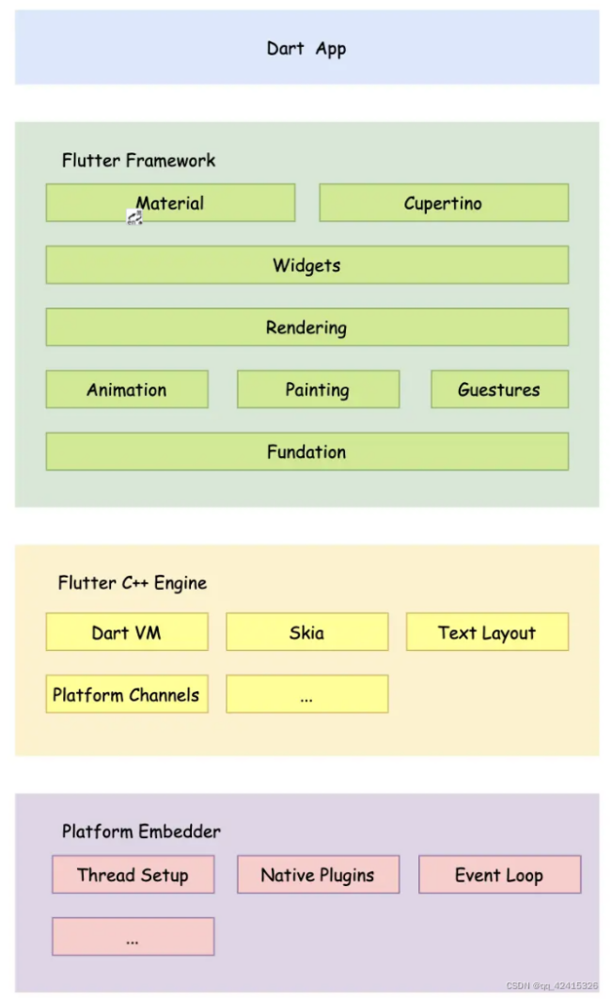

1. Dart App 层：以 Widget 为基本视图描述单元，构建起 UI 体系；
2. Flutter Framework 层：内置基础的 Flutter 组件，并根据不同平台的视觉风格体系，封装 Material 和 Cupertino 两套 UI 库供上层使用；
3. Flutter Engine 层：Flutter 框架的核心所在，包括 Dart 虚拟机、Skia 跨平台渲染引擎、文字排版、平台通道等，通过 Engine 层，建立起 Dart App 层和原生平台之间联系，从而实现二者的双向通信；
4. Embedder 层：为 Flutter App 提供宿主环境、线程创建以及基于插件机制的原生能力扩展等。

Flutter 在打包的时候，将 Dart 业务代码和 Flutter Engine 代码基于 iOS/Android 不同平台分别进行打包。 Native 在启动时会通过调用 C++ 的各自实现（Java 通过 JNI，OC 天然支持）初始化 Flutter Engine 层提供的接口，创建 UI/GPU/IO 三个线程和实例化 Dart VM。Dart 业务代码在 Release 模式下采用 AOT编译（Ahead-of-Time Complier提前编译） 的方式进行编译，并运行在 Dart VM 中。

Flutter App 的线程模型：

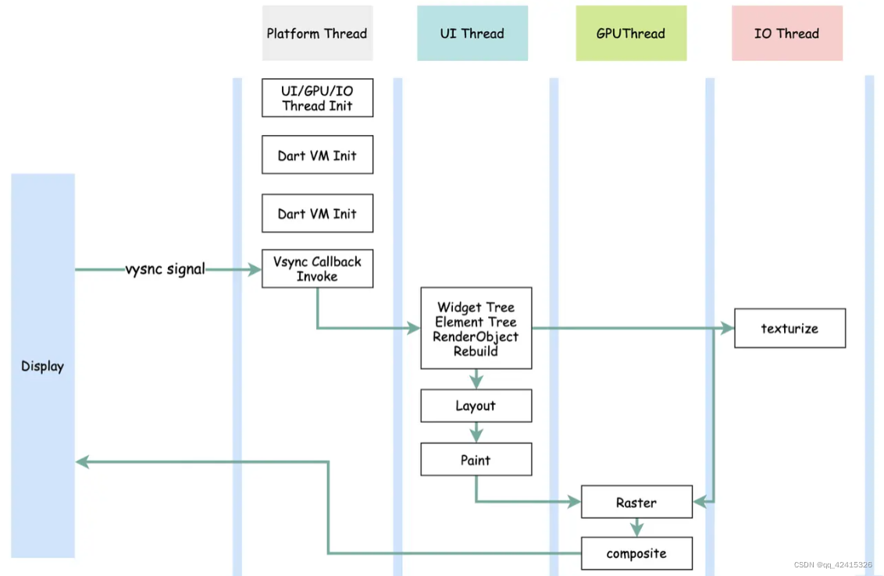

1. Platform 线程：主线程，由 Native 创建。负责平台 vsync 信号的回调注册，即当接收到从显示设备的 vsync 信号后，Platform 线程驱动 UI 线程的执行。
2. UI 线程：负责响应 vsync 信号，执行 Dart 层代码，驱动渲染管线的运行，将 Widget Tree 生成 Layer Tree 并提交给 GPU 线程做进一步处理。
3. GPU 线程：将 Layer Tree 转化为具体的绘制指令，并调用 skia 跨平台渲染引擎进行光栅化上屏。
4. IO 线程：主要负责请求图片资源并完成解码，然后将解码的图片生成纹理并传递给 GPU 线程。

显示器在一帧 vblank 后，会向 GPU 发送 vsync 信号，Native 的 Platform 线程接收到 vsync 信号后，执行绘制帧回调方法，即驱动 UI 线程进行 UI 绘制。

UI 线程中，Native 通过调用 C++ 的各自实现，将绘制指令通过 window 对象发送给 Dart 层，Dart 层会重构代表 UI 的数据树（Widget Tree、Element Tree 和 RenderObject Tree）并生成布局信息：
1. Widget Tree 是直接面向开发者的 UI 元素的配置信息，Widget 是 Immutable 的，如果 Widget 的状态发生更新，会发生重建。实际业务场景中，Widget 会频繁触发重建。
2. Element Tree 是 Widget Tree 和 RenderObject Tree 的桥梁，当Widget 发生变化后，会将其 Element 标记为 Dirty Element，在下一次 vsync 信号到来时进行渲染。当 Widget 挂载到 Widget Tree 时，会调用 widget.createElement 方法，创建其对应的 Element，Flutter 再讲这个 Element 挂载到 Element Tree 并持有有创建它的 Widget 的引用
3. RenderObject Tree 是真正执行组件布局渲染的工作，通过 RenderObjectToWidgetAdapter 这个 RenderObjectWidget 建立起 Widget 、Element 和 RenderObject 三者之间的联系。

根据布局信息生成一系列绘制指令的 Layer Tree，并通过 window 对象传递给 GPU 线程。
GPU 线程根据绘制指令和通过 Skia 这一跨平台渲染引擎进行光栅化，绘制成帧数据，将帧数据放在帧缓冲区，然后等待显示器上屏。

因此，以 Flutter 为代表的的自建渲染引擎的优势在于：

1. UI 控件是直接采用 Skia 这一跨平台渲染引擎进行绘制：顶层使用 Dart 的语法进行 UI 的配置信息描述，并通过 Diff 算法优化渲染流程，生成 Layer Tree 后，再调用 C++ 的代码将布局信息发送给 Flutter Engine，Flutter Engine 直接通过 Skia 将 UI 控件绘制上屏。这里与原生渲染方案最大的不同点在于，Native 应用仅作为宿主环境，UI 控件不需要转化为原生控件，直接采用渲染引擎进行绘制，从而保证了双端的一致性和良好的性能与体验。
2. Dart 在 Release下采用 AOT 的 编译模式：Dart 代码在 Release 采用 AOT 的编译模式转化为二进制代码，从而在 Dart 运行时环境中执行效率更高，性能也更为卓越。对比 React Native 来说，由于打包的是 JSBundle，所以在运行时仍是基于 JavaScript 运行时进行解释执行 JS 代码，因而产生较大的性能瓶颈。
3. UI 层与原生层的数据交换性能更高。

## adb

Android 调试桥 (adb，Android Debug Bridge) 是一种与设备通信，执行各种设备操作（例如安装和调试应用）的命令行工具。adb提供了对 Unix shell（可用来在设备上运行各种命令）的访问权限。adb 包含在 Android SDK 平台工具软件包中，使用 SDK管理器下载此软件包会将其安装在 android_sdk/platform-tools/ 下。它是一种客户端-服务器程序，包括以下三个组件：
1. 客户端：用于发送命令。客户端在开发机器上运行。您可以通过发出 adb 命令从命令行终端调用客户端。
2. 守护程序 (adbd)：用于在设备上运行命令。守护程序在每个设备上作为后台进程运行。
3. 服务器：用于管理客户端与守护程序之间的通信。服务器在开发机器上作为后台进程运行。所有 adb 客户端均使用端口 5037 与 adb 服务器通信。

### 常用命令
- adb devices：查看已连接设备
- adb kill-server：停止服务
- adb start：启动服务
- adb shell：进入沙盒
- adb pull 设备文件路径 电脑目录路径：设备文件复制到电脑上
- adb push 电脑文件路径 设备文件路径：电脑文件复制到设备上
- adb reverse tcp:8081 tcp 8081：端口映射
- adb connect 当前安卓设备的ip:5555：wifi方式连接设备