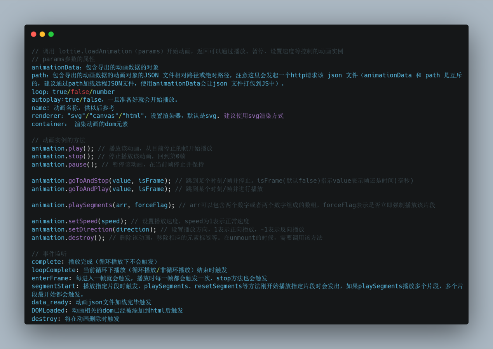
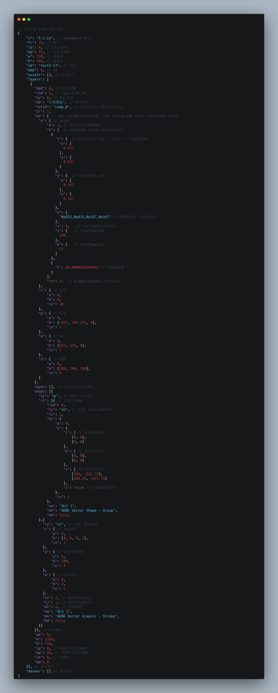
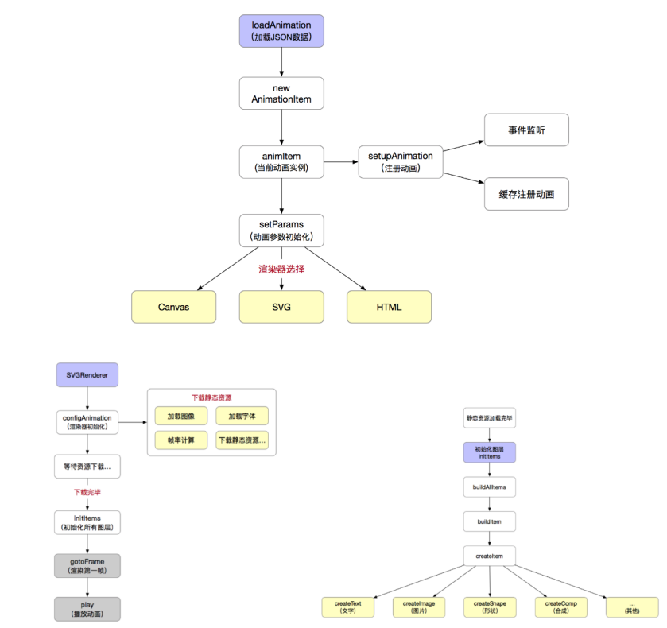
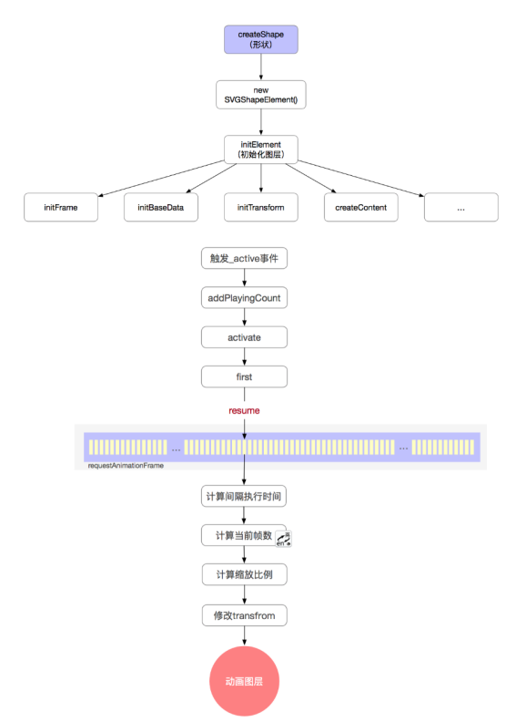

# lottie
Lottie是一款由airbnb开源的跨平台动画渲染库，支持Android, iOS, Web, Windows平台。是专门用于解析从AE(Adobe After Effects)中通过 Bodymovin 插件导出的JSON文件，直接渲染动画。

## 属性与方法

## 优缺点

**优点**：
1. UI 同学通过 AE 制作动画，前端可以直接还原和控制，降低动画工作量；
2. SVG 是可伸缩的，任何分辨率下都不会失真；
3. JSON 文件大小会比 GIF 以及 APNG 等文件小很多，性能也会更好。

**缺点**:
1. lottie-web 文件本身比较大，大小为 513KB，轻量版压缩后也有 144KB，经过 GZIP 后，大小为39k；
2. 使用的 json 文件是由 AE 导出的，如果 UI 在设计的时候创建了很多图层，可能会导致 json 文件较大；
3. 有部分 AE 动画的效果还不支持，lottie 无法实现或存在性能问题。

## 动画数据对象（json）结构

## lottie-web 原理剖析

## 封装可复用 lottie 函数组件(React): 

<<< ../../src/component/react/Lottie.tsx#docs