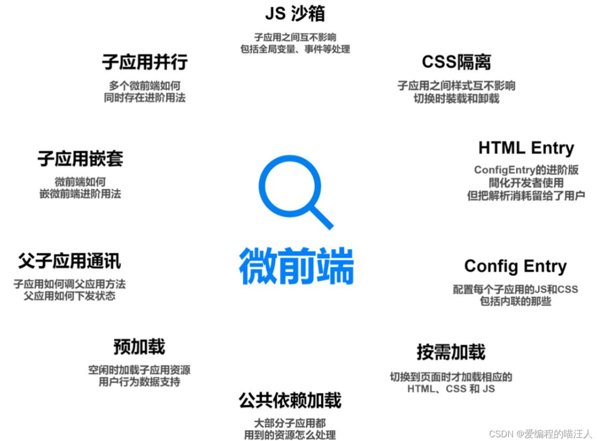

# 微前端

## 关于微前端

微前端是一种由独立交付的多个前端应用组成整体的架构风格。具体的，将前端应用分解成一些更小、更简单的能够独立开发、测试、部署的小块，而在用户看来仍然是内聚的单个产品。旨在解决单体应用在一个相对长的时间跨度下，由于参与的人员、团队的增多、变迁，从一个普通应用演变成一个庞大应用后出现的应用不可维护的问题。

微前端增加了操作/管理上的复杂性，团队自治程度的增加，可能会破坏协作，因此需要考虑是否具备采用这种方法所需的技术和组织成熟度。

最大的意义在于解锁了多技术栈并存的能力，尤其适用于渐进式重构中架构升级过渡期。允许低成本尝试新技术栈，甚至允许选用最合适的技术栈做不同的事情（类似于微服务中允许用不同的语言编写不同服务）。

## 微前端架构的核心价值及优势

1. **技术栈无关，代码库松耦合**：主框架不限制接入应用的技术栈，微应用具备完全自主权；避免模块间不合理的隐式耦合造成的复杂度上升。通过界定清晰的应用边界来降低意外耦合的可能性，增加子应用间逻辑耦合的成本，促使开发者明确数据和事件在应用程序中的流向
2. **独立开发、独立部署、独立运行时**：微应用仓库独立，前后端可独立开发，部署完成后主框架自动完成同步更新；每个微前端都应具备有自己的持续交付流水线（包括构建、测试并部署到生产环境），并且要能独立部署，不必过多考虑其它代码库和交付流水线的当前状态。每个微应用之间状态隔离，运行时状态不共享。
3. **团队自治、松耦合，可扩展性更好**：微前端有助于形成完全独立的团队，由不同团队各自负责一块产品功能从构思到发布的整个过程，团队能够完全拥有为客户提供价值所需的一切，从而快速高效地运转。为此，应该围绕业务功能纵向组建团队，而不是基于技术职能划分。最简单的，可以根据最终用户所能看到的内容来划分：

4. **增量升级**：在面对各种复杂场景时，通常很难对一个已经存在的系统做全量的技术栈升级或重构，而微前端是一种非常好的实施渐进式重构的手段和策略；理想的代码自然是模块清晰、依赖明确、易于扩展、便于维护的。出于以下原因，总存在一些不那么理想的代码：
    1. 历史项目，祖传代码；
    2. 交付压力，当时求快；
    3. 就近就熟，当时求稳；
    4. 技术栈落后，甚至强行混用多种技术栈；
    5. 耦合混乱，不敢动，牵一发何止动全身；
    6. 重构不彻底，重构-烂尾，换个姿势重构-又烂尾。

彻底重构这些代码最大的问题是很难有充裕的资源去大刀阔斧地一步到位，在逐步重构的同时，既要确保中间版本能够平滑过渡，同时还要持续交付新特性。为了实施**渐进式重构**，需要一种**增量升级**的能力，先让新旧代码和谐共存，再逐步转化旧代码，直到整个重构完成。这种增量升级的能力意味着能够对产品功能进行低风险的局部替换，包括升级依赖项、更替架构、UI 改版等。另一方面，也带来了技术选型上的灵活性，有助于新技术、新交互模式的实验性试错。

## 实现微前端的关键

### 多 Bundle 集成

使用**容器应用**（**container application**）负责渲染公共的页面元素（比如 header、footer），解决横切关注点（cross-cutting concerns）（如身份验证和导航），并将各子应用集成起来。（将各个微前端整合到一个页面上，并控制微前端的渲染区域和时机）。

集成方式有：
1. **服务端集成**：如 SSR 拼装模板；关键在于如何保证各部分模板（各个微前端）能够独立发布，必要的话，甚至可以在服务端也建立一套与前端相对应的结构，每个子服务负责渲染并服务于对应的微前端，主服务向各个子服务发起请求采用服务端集成：如 SSR 拼装模板；关键在于如何保证各部分模板（各个微前端）能够独立发布，必要的话，甚至可以在服务端也建立一套与前端相对应的结构，每个子服务负责渲染并服务于对应的微前端，主服务向各个子服务发起请求：

2. **构建时集成**：如 Code Splitting；比如将子应用发布成独立的 npm 包，共同作为主应用的依赖项，构建生成一个供部署的 JS Bundle。由于会在发布阶段造成耦合——任何一个子应用有变更，都要整个重新编译，意味着对于产品局部的小改动也要发布一个新版本，因此不被推荐。
3. **运行时集成**：如通过 iframe、JS、Web Components 等方式。将集成时机从构建时推迟到运行时，就能避免发布阶段的耦合。运行时集成方式有 iframe、JS 前端路由、Web Components 等
    1. **iframe**：若不考虑体验问题，几乎是最完美的微前端解决方案了。iframe 最大的特性就是提供了浏览器原生的硬隔离方案，不论是样式隔离、js 隔离这类问题统统都能被完美解决。但最大问题也在于隔离性无法被突破，导致应用间上下文无法被共享，路由控制、历史栈管理、深度链接（deep-linking）、响应式布局等都变得异常复杂，因而限制了 iframe 方案的灵活性，随之带来的开发体验、产品体验的问题：
        1. url 不同步。浏览器刷新 iframe url 状态丢失、后退前进按钮无法使用；
        2. UI 不同步，DOM 结构不共享。想象一下屏幕右下角 1/4 的 iframe 里来一个带遮罩层的弹框，同时我们要求这个弹框要浏览器居中显示，还要浏览器 resize 时自动居中；
        3. 全局上下文完全隔离，内存变量不共享。iframe 内外系统的通信、数据同步等需求，主应用的 cookie 要透传到根域名都不同的子应用中实现免登效果；
        4. 慢。每次子应用进入都是一次浏览器上下文重建、资源重新加载的过程；
        5. 特定场景不支持。比如网页截屏，iframe 就不被支持。
    2. **JS 前端路由**：每个子应用暴露出渲染函数，主应用在启动时加载各个子应用的独立 Bundle，之后根据路由规则渲染相应的子应用，属于最灵活的方式。
    3. **Web components**：将每个子应用封装成自定义 HTML 元素（而不是前端路由方案中的渲染函数），以获得 Shadow DOM 带来的样式隔离等好处。

### 子应用之间隔离影响

子应用之间，以及子应用与主应用间的样式、作用域隔离是必须要考虑的问题，常见解决方案如下：
1. 样式隔离：开发规范、CSS 预处理（如SASS）、模块定义（如CSS Module）、用 JS 来写（CSS-in-JS）、以及shadow DOM特性；
2. 作用域隔离：各种模块定义（如 ES Module、AMD、Common Module、UMD）。

### 公共资源复用

基础资源：完全不含逻辑功能的图标、标签、按钮等，UI 组件：含有一定 UI 逻辑的搜索框（如自动完成）、表格（如排序、筛选、分页）等；业务组件：含有业务逻辑。

资源复用对于UI一致性和代码复用有重要意义，但并非所有的可复用资源（如组件）都必须在一开始就提出来复用，建议的做法是前期允许一定程度的冗余，各个 Bundle 在各自的代码库中创建组件，直到形成相对明确的组件 API 时再建立可供复用的公共组件。其中，不建议跨子应用复用业务组件，因为会造成高度耦合，增加变更成本。

对于公共资源的归属和管理，一般有两种模式：
1. 公共资源归属于所有人，即没有明确归属，很容易衍变成没有明确规范，且背离技术愿景的大杂烩；
2. 公共资源归集中管理，由专人负责，会造成资源创建和使用的脱节。

**比较推荐的模式是开源软件的管理模式**，即所有人都能补充公共资源，但要有人（或一个团队）负责监管，以保证质量、一致性以及正确性。

### 子应用间通信

原则上应该尽可能减少子应用间的通信，以避免大量弱依赖造成的强耦合。
1. 通过自定义事件间接通信是一种避免直接耦合的常用方式。
2. React 的单向数据流模型也能让依赖关系更加明确，对应到微前端中就是从容器应用向子应用传递数据与回调函数。
3. 路由参数除了能用于分享、书签等场景外，也可以作为一种通信手段，具有以下优势：
    1. 其结构遵从定义明确的开放标准；
    2. 页面级共享，能够全局访问；
    3. 长度限制促使只传递必要的少量数据；
    4. 面向用户的，有助于依照领域建模；
    5. 声明式的，语义上更通用；
    6. 迫使子应用之间间接通信，而不直接依赖对方。

### 测试

每个子应用都应该有自己的全套测试方案：
1. 集成测试：保证子应用间集成的正确性，比如跨子应用的交互操作;
2. 功能测试：保证页面组装的正确性;
3. 单元测试：保证底层业务逻辑和渲染逻辑的正确性。