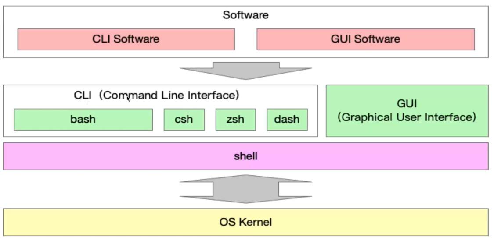

# 脚手架开发

## 脚手架运行环境

Shell（也称为壳层）指操作系统中提供访问内核所提供之服务的程序，通常是指命令解释器，也用于泛指所有为用户提供操作界面的程序。shell分为命令行（CLI）shell（比如Bash 是一种实现）和图形界面（GUI）shell。CLI（命令行界面）仅通过键盘输入指令，计算机接收到指令后，予以Bash等执行并返回结果。

## 脚手架执行原理

:::danger 写作中 :::
