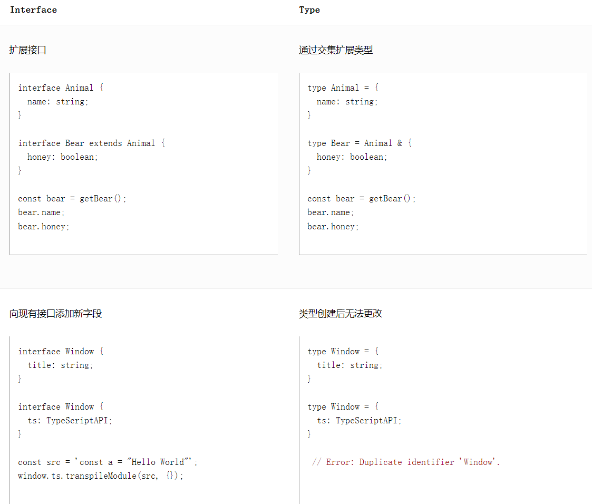

# Typescript

Typescript是添加了类型系统的JavaScript，属于弱类型（即允许隐式类型转换）、静态类型语言，适应于任何规模的项目，支持 ES6，由微软开发并开源。Typescript增加的功能包括：类型批注和编译时类型检查、类型推断、类型擦除、接口、枚举、Mixin、泛型编程、名字空间、元组、Await。TypeScript 区分大小写。

TypeScript 和 JavaScript 一样没有整数类型；

TypeScript 继承关键字为extends，允许接口继承多个接口；

因此，现有的 JavaScript 代码可与 TypeScript 一起工作无需任何修改，TypeScript 可处理已有的 JavaScript 代码，并只对其中的 TypeScript 代码进行编译。

## 声明空间/编译上下文

在 TypeScript 里存在两种声明空间：**类型声明空间**与**变量声明空间**。
1. **类型声明空间包含用来当做类型注解的内容**。注意，不能够把interface、type等声明作为一个变量来使用，因为它没有定义在变量声明空间中。类型注解支持使用内联语法注解任何内容，即 :**{ /\*Structure\*/ }**。
2. **变量声明空间包含可用作变量的内容**，注意，用 var/let/class 声明的变量，也只能在变量声明空间使用，不能用作类型注解。但构造函数或 Class类名提供了一个类型到类型声明空间，此外它同样提供了一个同名变量到变量声明空间。

**编译上下文**可以用它来给文件分组，告诉 TypeScript 哪些文件是有效的，哪些是无效的，此外还包含有正在被使用的编译选项的信息。比较好的方式是使用 tsconfig.json 文件（在项目的根目录下创建一个包含空{}的tsconfig.json文件，TypeScript 将会把此目录和子目录下的所有.ts文件作为编译上下文的一部分，它还会包含一部分默认的编译选项）。编译选项通过compilerOptions 来定制。

好的 IDE 支持对 TypeScript 的即时编译。但是，如果想在使用 tsconfig.json 时从命令行手动运行 TypeScript 编译器，可以通过以下方式：
1. 运行 tsc，它会在当前目录或者是父级目录寻找 tsconfig.json 文件。
2. 运行 tsc -p ./path-to-project-directory 。当然，这个路径可以是绝对路径，也可以是相对于当前目录的相对路径。
3. 甚至可以使用 tsc -w 来启用 TypeScript 编译器的观测模式，在检测到文件改动之后，它将重新编译。

也可以通过和 compilerOptions 同级的 files 选项或 include 和 exclude 选项，显式指定需要编译的文件：
1. files 选项指定一个允许包括在程序中的文件数组。当找不到其中任何文件发生错误。不支持通配符匹配，适用于少量枚举需编译且不依赖全局引用很多文件，否则用include
2. include 同files, 但支持三种通配符来匹配多个文件（exclude选项也支持），如果通配符中不包含文件扩展名，则仅包含具有受支持扩展名的文件（默认是文件后缀名为.ts/.ts/.d.ts + [.js/.jsx](若allowJs: true)）：
    1. * 匹配零个或多个字符（不包括目录分隔符）；
    2. ？匹配任何一个字符（不包括目录分隔符）；
    3. **/ 匹配嵌套到任何级别的任何目录。
3. exclude 指定编译过程include选项配置的文件中需要忽略的文件列表，不影响文件实际的import types reference files ，默认值是 ["node_modules", "bower_components", "jspm_packages", outDir]。
4. extends 选项指定当前配置文件要继承的配置文件，是一个路径字符串，加载顺序 ./config/base.json(extends) -> tsconfig.json(当前)，适用于控制某一配置文件的作用域；

<<< ../../../src/typescript/tsconfig-options.json#docs[tsconfig-options.json]

## 命名空间/模块/动态导入表达式/lib.d.ts

### 命名空间

namespace 是 TypeScript 早期时为了解决模块化而创造的关键字，中文称为命名空间。namespace 关键字编译后的 JavaScript 代码与传入待修改参数对象的立即调用函数表达式一样，注意，命名空间是支持嵌套的。对于大多数项目，建议使用外部模块和命名空间，来快速演示和移植旧的 JavaScript 代码。

### 模块

**全局模块**：在默认情况下，在一个新的 TypeScript 文件中写下代码时，它处于全局命名空间中。如果在相同的项目里创建了一个新的文件，TypeScript 类型系统将会允许使用全局命名空间中的变量。显然，使用全局变量空间是危险的，因为它会与当前文件内的代码命名冲突。然而如果团队里有 TypeScript 初学者，可以自定义一个 global.d.ts 文件（global.d.ts 是一种扩充 lib.d.ts 很好的方式），用来将一些接口或者类型放入全局命名空间里，这些定义的接口和类型能在所有 TypeScript 代码里使用。

**文件模块**：文件模块也被称为外部模块。如果在TypeScript 文件的根级别位置含有 import 或者 export，那么它会在这个文件中创建一个本地的作用域。文件内的代码不再处于全局命名空间中。在当前文件里使用 import 时，它不仅允许使用从其他文件导入的内容，还会将当前文件也标记为一个文件模块，当前文件内定义的声明也不会“污染”全局命名空间。**可以根据不同的 module 选项来把 TypeScript 编译成不同的 JavaScript 模块类型，使用 module: commonjs 选项（tsconfig.json中）来替代以下模式是个好主意**：
1. AMD：不要使用它，它仅能在浏览器工作；
2. SystemJS：这是一个好的实验，已经被 ES 模块替代；
3. ES 模块：它并没有准备好。编译结果js文件中除了没有类型以外完全一样。

放弃使用 import/require 语法即 import foo = require('foo') 写法，推荐使用 ES 模块语法书写TypeScript模块。即使用 module: commonjs 选项的同时，使用 ES 模块语法导入、导出、编写模块。

模块路径：如果需要使用编译选项 moduleResolution: node，应该将此选项放入tsconfig.json中，但如果使用了编译选项 module: commonjs 选项， moduleResolution: node 将会默认开启。存在两种截然不同的模块，它们的主要区别在于系统如何解析模块：
1. 相对模块路径（路径以 . 开头，例如：./someFile 或者 ../../someFolder/someFile 等）：
    1. 如果当前文件中含有相对路径导入./someFile，那么someFile文件必须与当前文件存在于相同的文件夹下；
    2. 如果当前文件中含有相对路径导入../someFile，那么someFile文件所存在的地方必须是当前文件的上一级目录；
    3. 如果当前文件中含有../someFolder/someFile，那么someFile文件所在的文件夹 someFolder 必须与someFile文件所在文件夹在相同的目录下。
2. 动态查找模块（模块解析将会模仿 Node 模块解析策略，如：core-js，typestyle，react 或者甚至是 react/core 等）：
    1. 当你使用 import Some from 'some'，将会按如下顺序查找模块：
        1. ./node_modules/some；
        2. ../node_modules/some；
        3. ../../node_modules/some；
        4. 直到系统的根目录。
    2. 当你使用 import Some from 'something/some'，将会按照如下顺序查找内容：
        1. ./node_modules/something/some；
        2. ../node_modules/something/some；
        3. ../../node_modules/something/some；
        4. 直到系统的根目录。

TypeScript 对查找到some文件或文件夹对应的位置（.ts/.d.ts/.js）即 place 将会检查以下内容：
1. 如果 place表示一个文件，则查找结束；
2. 否则，如果place是一个文件夹且存在一个文件some/index.ts，则查找结束；
3. 否则，如果place是一个文件夹且some/package.json 文件中的types指定的文件存在，则查找结束；
4. 否则，如果place是一个文件夹且package.json 文件中的main指定的文件存在，则查找结束。

项目中可以通过 declare module 'some' 声明一个全局模块的方式，来解决查找模块路径的问题。 而且，定义declare module "some-library-you-dont-care-to-get-defs-for"能使得快速开始从JS迁移到TS。

语法import some = require(‘some’) 只是导入 foo 模块的所有类型信息以及确定some模块运行时的依赖关系。如果没有把导入的名称some当做变量声明空间来用，在编译成 JavaScript 时，导入的模块some将会被完全移除。使用场景有：
1. **懒加载**：
    1. 在 webApp 中在特定路由上加载 JavaScript。
    2. 在 node 应用中只想加载特定模块，用来加快启动速度时。
2. **打破循环依赖**：某些模块加载器（commonjs/node 和 amd/requirejs）不能很好的处理循环依赖。在这种情况下，一方面使用延迟加载代码，另一方面预先加载模块。
3. **确保导入**：当加载该模块只是想引入其附加的作用（如：模块可能会注册一些像 CodeMirror addons）时，然而，如果仅仅是 import/require （导入），经过 TypeScript 编译后，这些将会被完全忽视。在这种情况下可以使用一个 ensureImport 变量，来确保编译的 JavaScript 依赖该模块。

### 动态导入表达式

动态导入表达式是 ECMAScript 的新功能，它允许在程序的任意位置异步加载一个模块，目前处于提案的 stage4 阶段。此外，webpack 支持 Code Splitting 功能，它能允许将代码拆分为许多块，这些块在将来可被异步下载，webpack 实现代码分割的方式有两种：使用 import() （首选，ECMAScript 的提案）和 require.ensure()。在 tsconfig.json 中的compilerOptions编译选项配置中使用 "module": "esnext" 选项使得TypeScript 保留 import() 语句用于 Webpack 的Code Splitting。

### lib.d.ts

安装 TypeScript 时会安装 lib.d.ts 声明文件（包含 JavaScript 运行时以及 DOM 中存在各种常见的环境声明）。
1. 它自动包含在 TypeScript 项目的编译上下文中；
2. 它使得能快速开始书写经过类型检查的 JavaScript 代码。

如果当前运行的 JavaScript 环境与基于标准浏览器运行时环境有很大不同，或者希望在代码里严格的控制全局变量（比如不希望lib.d.ts中定义的某些全局变量泄漏到项目代码里），可以通过指定 --noLib 的编译器命令行标志（或者在 tsconfig.json 中指定选项noLib: true）从上下文中排除此文件，然后在编译上下文中包含一个命名相似的文件，TypeScript 将提取该文件进行类型检查，但请谨慎使用--noLib选项。

寻找代码类型的最简单方式是**选中代码并 F12** 或者 **ctrl（Mac是command） + 鼠标左键**跳转到定义。

在 TypeScript 中，接口也是开放式的，这意味着想使用原本不存在的成员时，只需要将它们添加至 lib.d.ts 中的接口声明中即可，TypeScript 将会自动接收它。注意，基于可维护性，推荐在全局模块（比如创建一个global.d.ts）中做这些修改，以使这些接口与 lib.d.ts 相关联，然而如果愿意，可以在文件模块中通过使用 declare global { /* global namespace */ }进入全局命名空间。String接口、Date接口等对应的是prototype，DateConstructor接口、StringConstructor接口等对应的是构造函数。

编译目标选项target改变编译出的代码版本，版本越高，能导致 lib.d.ts 包含更多的新功能的环境声明，但不应该将编译出的代码与环境混为一谈，如果是对环境进行更细粒的控制应该使用lib选项，它可以将任何lib（环境库支持）与target（编译目标，即生成的 JavaScript 版本）解耦。

lib 分类如下：
1. JavaScript 功能：es5/es6/es2015/es7/es2016/es2017/esnext；
2. 运行环境：dom/dom.iterable/webworker/scripthost；
3. ESNext 功能选项：es2015.core/es2015.collection/es2015.generator/es2015.iterable/es2015.promise/es2015.proxy/es2015.reflect/es2015.symbol/es2015.symbol.wellknown/es2016.array.include/es2017.object/es2017.sharedmemory/esnext.asynciterable。

lib 选项提供非常精细的控制，因此最有可能从运行环境与 JavaScript 功能类别中分别选择一项，如果没有指定lib，则会导入默认库：
1. target 选项为 es5 时，会导入es5, dom, scripthost。
2. target 选项为 es6 时，会导入es6, dom, dom.iterable, scripthost。

targe 与 lib 配置示例：

```json
{
  "complierOptions": {
    "target": "es5",
    "lib": ["es6", "dom"] // 如果要使用 Symbol，添加一个 "es2015.symbol" 即可
  }
}
```

特别的，如果运行时是在旧的 JavaScript 引擎的浏览器中，要使用新功能（比如 Map、Set、Promise或更新的功能），除了使用现代的 lib 选项，还需要安装 core-js 并在项目中导入 Polyfill：core-js/shim。

## 原始数据类型

JavaScript 的类型分为两种：原始数据类型（Primitive data types）和对象类型（Object types）。原始数据类型包括：boolean、number、string、null、undefined、Symbol、bigInt。

在 TypeScript 中，使用 boolean 定义布尔值类型， number 定义数值类型，string 定义字符串类型，而new Boolean/Number/String返回的是一个 Boolean/Number/String 对象，直接调用 Boolean /Number/String也可以返回一个 boolean /number/string类型。其中，0b1010 和 0o744 是 ES6 中的二进制和八进制表示法，转为JavaScript时它们会被编译为十进制数字。其中` `用来定义 ES6 中的模板字符串，${expr} 用来在模板字符串中嵌入表达式，转为JavaScript时它们会被编译为字符串拼接。

JavaScript 没有空值（void）的概念，在 TypeScript 中，void类型表示没有任何返回值的函数。声明一个 void 类型的变量没有什么用，因为只能将它赋值为 undefined 和 null。在 TypeScript 中，可以使用 null 和 undefined 来定义原始数据类型null 和 undefined。与 void 的区别是，undefined 和 null 是所有类型的子类型，即undefined 和 null 类型的变量可以赋值给任何类型的变量（前提是strictNullChecks选项设置为false）。

## 其他类型

### 元组（tuple）类型

在 TypeScript 中，数组合并了相同类型的元素，而元组合并了不同类型的元素：
1. 当赋值或访问元组类型中某个已知索引的元素时，会得到正确的类型。
2. 当直接对元组类型的变量进行初始化或者赋值的时候，需要提供所有元组类型中指定的项。
3. 当添加越界的元素时，它的类型会被限制为元组中每个类型的联合类型。

### 枚举（enum）类型

枚举类型用于取值被限定在一定有限范围内的场景，枚举可以作为变量使用，因为它既处于类型声明空间，也位于变量声明空间。**枚举使用 enum 关键字来定义**：

<<< ../../../src/typescript/enum.ts#docs[enum.ts]

1. 枚举成员默认会被赋值为从 0 开始递增的数字，即数字类型枚举，同时也会对枚举值到枚举名进行反向映射。数字类型枚举允许将数字类型或者其他任何与数字类型兼容的类型赋值给枚举类型的实例。
2. 枚举项可以手动赋值。手动赋值的枚举项可以不是数字，也可以是小数或负数。未手动赋值的枚举项会接着上一个枚举项步长为1递增。
3. 根据枚举的编译结果，枚举是开放式的，意味着可以跨多个文件拆分（和扩展）枚举定义。在枚举的延续块中，重新初始化第一个成员（此处为 DarkRed = 3），使生成的代码不破坏先前定义的值（即0、1...等值），否则，TypeScript 将会发出警告（错误信息：In an enum with multiple declarations, only one declaration can omit an initializer for its first enum element.）。只有在不使用模块时，开放式的枚举才有意义，然而应该使用模块而不是开放式枚举。
4. 可以使用枚举，将其中的数字枚举成员作为标志，允许你检查一组条件中的某个条件是否为真。使用左移的位运算符，将除0以外的每个数字枚举成员的二进制向左移动位置得到数字 0001、0010、0100 和 1000（换成十进制结果是：1, 2, 4, 8），依次类推，然后，可以使用 |= 来添加一个标志；组合使用 &= 和 ~ 来清理标志；| 来合并多个标志。比如:

```typescript
enum Flags {
  None = 0;
  Flag1 = 1 << 0;
  Flag1 = 1 << 1;
  Flag1 = 1 << 2;
  Flag1Flag2Flag3 = Flag1 | Flag2 | Flag3;
}
```
5. 枚举项有两种类型：常数项（constant member）和计算所得项（computed member）。如果紧接在计算所得项后面的是未手动赋值的项，那么它就会因为无法获得初始值而报错。当满足以下条件时，枚举成员被当作是常数，其它情况的枚举成员被当作是需要计算得出的值：
    1. 不具有初始化函数并且之前的枚举成员是常数。在这种情况下，当前枚举成员的值为上一个枚举成员的值加 1。但第一个枚举元素是个例外。如果它没有初始化方法，那么它的初始值为 0。
    2. 枚举成员使用常数枚举表达式初始化。常数枚举表达式是 TypeScript 表达式的子集，它可以在编译阶段求值。当一个表达式满足下面条件之一时，它就是一个常数枚举表达式：
        1. 数字字面量；
        2. 引用之前定义的常数枚举成员（可以是在不同的枚举类型中定义的）如果这个成员是在同一个枚举类型中定义的，可以使用非限定名来引用；
        3. 带括号的常数枚举表达式；
        4. +, -, ~ 一元运算符应用于常数枚举表达式；
        5.+, -, *, /, %, <<, >>, >>>, &, |, ^ 二元运算符，常数枚举表达式做为其一个操作对象。若常数枚举表达式求值后为 NaN 或 Infinity，则会在编译阶段报错。

**常数枚举是使用 const enum 定义的枚举类型**，常数枚举与普通枚举的区别是它会在编译阶段被删除，可以获得性能提升，并且不能包含计算成员，否则会在编译阶段抛错。然而，可能除了内联枚举，还想让编译器仍然把枚举类型的定义编译到JavaScript中，用于从字符串到数字，或者是从数字到字符串的查找。在这种情景下，可以使用编译选项 --preserveConstEnums，并且这不会以任何方式影响内联。

**外部枚举（Amibient Enums）是使用 declare enum 定义的枚举类型**，declare 定义的类型只会用于编译时的检查，编译结果中会被删除。外部枚举与声明语句一样，常出现在声明文件（.d.ts）中，同时使用 declare 和 const 关键字也是可以的。

**有静态方法的枚举**，可以使用 enum定义好枚举类型SomeEnum，然后再使用namespace 向枚举类型SomeEnum中添加静态方法。

### 任意（any）类型

任意类型用来表示允许赋值为任意类型。
1. 对于单一普通类型，在赋值过程中改变类型是不被允许的，任意类型则可以。
2. 在任意值上访问任何属性都是允许的，也允许调用任何方法。
3. 变量如果在声明的时候，未指定其类型，那么它会被识别为任意值类型。
通常，会用any 来表示数组中允许出现任意类型，即 any[]。

### never 类型

never 类型表示那些永不存在的值的类型。特别的，never 可以是永远不返回的函数的返回值类型，也可以是变量在类型收窄中不可能为真的类型，也可以是总是会抛出错误的函数的类型。具有以下特征：
1. 没有类型是 never 的子类型，never类型可以赋值给任何类型，返回 never 的函数可以赋值给需要返回一个具体类型的函数。never类型可作为类型注解；
2. never 是所有类型的子类型，在联合类型中它始终被省略，并且只要函数有其他返回的类型，推导出的函数返回值类型中就会忽略它；
3. 除了never类型，没有类型可以赋值给 never类型；
4. 在一个没有返回值标注的函数表达式或箭头函数中，如果函数没有 return 语句，或者仅有表达式类型为 never 的 retur 语句，并且函数的终止点无法被执行到（按照控制流分析），则推导出的函数返回值类型是 never；
5. 在一个明确指定了 never 返回值类型的函数中，所有 return 语句（如果有）表达式的值必须为 never 类型，且函数不应能执行到终止点。

never 类型同时也是 TypeScript 中的底层类型，自然被分配为never类型包括：
1. 一个从来不会有返回值的函数（如：函数内含有 while(true) {}）；
2. 一个总是会抛出错误的函数（如：function foo() { throw new Error('Not Implemented') }，foo 的返回类型是 never）。

void 表示没有任何类型，never 表示永远不存在的值的类型。当一个函数没有返回值时，它的返回值为 void 类型，但是，当一个函数永不返回时（或者总是抛出错误），它的返回值为 never 类型。void 类型可以被赋值（在 strictNullChecking 为 false 时），但是除了 never 本身以外，其他任何类型不能赋值给 never。

### 数组（Array）类型
在 TypeScript 中，有多种方式定义数组类型，**最简单的方法是使用「类型 + 方括号」来表示数组**。数组的项中不允许出现其他的类型。数组方法的参数也会根据数组在定义时约定的类型进行限制。**也可以使用数组泛型（Array Generic）即 `Array<elemType>` 来表示数组**。也可以用interface接口来描述数组。然而类数组只能使用接口的方式来描述。

使用接口表示数组：
```typescript
interface NumberArray {
  [index: number]: number;
}

// 类数组
interface ArrayLike<T> {
  readonly [index: number]: T;
  readonly length: number;
}
```

### 函数（Function）类型

函数有输入和输出，要在 TypeScript 中对其进行约束，需要把输入和输出都考虑到。
1. 输入多余的（或者少于要求的）参数，是不被允许的，但支持用 ? 表示可选的参数且可选参数必须接在必需参数后面。在 ES6 中允许给函数的参数添加默认值，TypeScript 会将添加了默认值的参数识别为可选参数且不受「可选参数必须在必需参数后面」的限制。
2. 在 TypeScript 的类型定义中，=> 用来表示函数的定义，左边是输入类型，需要用括号括起来，右边是输出类型，而且不能使用重载，而 ES6 中，=> 叫做箭头函数。
3. 在 ES6 中，可以使用 ...rest 的方式获取函数中的剩余参数（rest 参数），事实上，rest是一个数组，所以可以用数组的类型来定义它。
4. 如果有一个含有很多参数或者相同类型参数的函数，那么可能需要考虑将函数改为接收对象的形式，有利于发现错误及代码审查。
5. **在 TypeScript 中，通过重复定义多次函数类型进行重载允许一个函数接受不同数量或类型的参数，作出不同的处理**。TypeScript 中的函数重载没有任何运行时开销，它只允许记录希望调用函数的方式，并且编译器会检查其余代码。注意，TypeScript 会优先从最前面的函数定义开始匹配，所以多个函数定义如果有包含关系，需要优先把精确的定义写在前面。最后一个签名要包含前面所有签名的情况，并且它不在重载列表内，即最后一个签名不能被有效调用。
6. 在没有提供函数实现的情况下，有两种声明函数类型的方式，完全相同，区别在于方式（1）才支持函数重载：
    1. 可以使用类型别名或者接口来表示一个可调用的类型注解，type LongHand = { (a: number): number; }; 或 interface LongHand { (a: number): number; }; 这种方式可以在内联注解语法上使用。可实例化是可调用的一种特殊情况，在其中的函数声明前添加new关键字。
    可调用且可实例化：

    ```typescript
    interface CallMeWithNew {
      new (): someType;
    }
    // 或
    type CallMeWithNew {
      new (): someType;
    }
    ```

    2. type ShortHand = (a: number) => number;
7. 对于函数表达式，进行类型定义应该是对赋值目标进行定义。
8. 函数返回类型如果确定为void，内联注解可以删除void，TypeScript 能推导出来。
9. 也可以使用接口interface的方式来定义一个函数需要符合的形状。

使用接口定义函数：

```typescript
interface IFunc {
  (param1: string, param2: string): boolean;
}
```

### 字符串/数字/布尔字面量类型

字符串字面量可以作为类型，约束只能是该字符串字面量。字符串字面量类型用来约束取值只能是某几个字符串中的一个（type StringLiteralType = ‘string1’ | ‘string2’ | ‘string3’），通过关键字type和联合类型符号“|”进行定义。注意，类型别名与字符串字面量类型都是使用 type 进行定义。

TypeScript 同样也提供 boolean 和 number 的字面量类型。

使用 keyof typeof 操作一个普通对象obj，可以返回obj的属性构成的字符串字面量联合类型。

### 对象字面量类型

为了能让检查对象字面量类型更容易，TypeScript 提供 「Freshness」 的概念（它也被称为更严格的对象字面量检查）用来确保对象字面量在结构上类型兼容。结构类型在赋值时，可以允许接受未知属性，然而在对象字面量上只能指定已知属性即更严格的对象字面量类型：

```typescript
const person1 = { name: 'matt', job: 'being awesome' };
let person2 = {
  name: string;
} = person1; // ok，因为非对象字面量赋值可以有未知属性

person2 = { name: 'matt', job: 'being awesome' }; // Error，因为对象字面量只能指定已知属性，'job' 属性不存在 person2 的类型中 
```

使用比较多的场景是与具有可选成员的接口一起使用，如果严格的对象字面量检查，当输入的对象中属性名错误时，并不会发出错误警告。

之所以只对**对象字面量**进行更严格类型检查，因为在使用对象字面量时，保证属性不被拼写错误或属性不冗余。

但是，可以通过包含索引签名[propName: string]: valueType的方式明确表明可以使用额外的属性。

React的this.setState通常是使用对象字面量进行调用，它是Freshness的很好的用例。

### 接口（interface）

在 TypeScript 中，使用接口即interface来定义对象的类型。TypeScript 中的接口可用于对类的一部分行为进行抽象，也常用于对「对象的形状（Shape）」进行描述。
1. 接口一般首字母大写。
2. 接口对运行时的影响为 0。
3. 接口相比接口形式的内联类型注解，是开放式的即可扩展的（利用接口声明合并，扩展接口成员）。
4. 赋值的时候，变量的形状必须和接口保持一致，但可以使用可选属性，其含义是该属性可以不存在，但仍然不允许添加未定义的属性。
5. 使用 [propName: string]: valueType 可以定义任意属性，其他确定属性和可选属性的值类型都必须是类型valueType的子集。一个接口中只能定义一个任意属性。如果接口中有多个类型的属性，则可以在该任意属性中使用联合类型。如果同时存在任意属性、可选属性，那么任意属性的数据类型要带undefined，除非valueType是any。
6. 可以用 **readonly** 前缀定义只读属性（包括索引签名）。注意，只读的约束存在于第一次给对象赋值后，而不是第一次给只读属性赋值后。
    1. 也可以在type里使用 readonly；
    2. 比如React中的声明文件已经标记Props和State的属性为 readonly（通过传入泛型参数至一个内部包装，来把每个属性标记为 readonly）。
    3. 可以使用 TypeScript 提供的 `ReadonlyArray<T>` 接口，以不变的方式使用原生 JavaScript 数组。
    4. 编译器能把一些特定的属性推断为 readonly，比如class 中一个只含有 getter 但是没有 setter 的属性能被推断为只读。
    5. **与 const 的区别**：const用于变量且变量不能重新赋值为其他任何值。readonly用于属性，readonly 能确保本身不能修改属性，但是由于类型兼容性的原因，当把这个属性交给其他并没有这种保证的使用者后能被修改。

#### interface vs type?

interface 的几乎所有功能都在type 中可用，主要区别在于类型创建后无法更改，而接口始终可扩展。接口只能用于声明对象的形状，而不是重命名基本类型/联合类型/交叉类型。类型别名不得参与 在声明合并中，但接口可以。命名联合类型的类型别名无法被实现/扩展。




## 类

TypeScript 除了实现了所有 ES6 中的类的功能以外，还添加了一些新的用法。类的相关概念：
1. 类(Class)：定义了一件事物的抽象特点，包含它的属性和方法。
2. 对象（Object）：类的实例，通过 new 生成。
3. **面向对象（OOP）的三大特性：封装、继承、多态**。
    1. 封装（Encapsulation）：将对数据的操作细节隐藏起来，只暴露对外的接口。外界调用端不需要（也不可能）知道细节，就能通过对外提供的接口来访问该对象，同时也保证了外界无法任意更改对象内部的数据。
    2. 继承（Inheritance）：子类继承父类，子类除了拥有父类的所有特性外，还有一些更具体的特性。继承可以描述类与类之间的关系。子类重写父类的成员时类型需要和父类匹配。
    3. 多态（Polymorphism）：由继承而产生了相关的不同的类，对同一个方法可以有不同的响应。比如 Cat 和 Dog 都继承自 Animal，但是分别实现了自己的 eat 方法。此时针对某一个实例，无需了解它是 Cat 还是 Dog，就可以直接调用 eat 方法，程序会自动判断出来应该如何执行eat。
4. 存取器（getter & setter）：用以改变属性的读取和赋值行为。
5. 修饰符（Modifiers）：修饰符是一些关键字，用于限定成员或类型的性质。比如 public 表示公有属性或方法。
6. 抽象类（Abstract Class）：抽象类是供其他类继承的基类，抽象类不允许被实例化。抽象类中的抽象方法必须在子类中被实现。
7. 接口（Interfaces）：不同类之间公有的属性或方法，可以抽象成一个接口。**接口可以被类实现（implements）**，希望在类中使用必须要被遵循的接口（类）或别人定义的对象结构时使用，implements关键字限制了类实例的结构。一个类只能继承自另一个类，但是可以实现多个接口。

ES6 中，使用 class 定义类，使用 constructor 定义构造函数。通过 new 生成新实例的时候，会自动调用构造函数。使用 extends 关键字实现继承，子类中使用 super 关键字来调用父类的构造函数和方法。使用 getter 和 setter 可以改变属性的赋值和读取行为。使用 static 修饰符修饰的方法称为静态方法，它们不需要实例化，而是直接通过类来调用。

ES6 中实例的属性只能通过构造函数中的 this.xxx 来定义，ES7 中可以直接在类里面定义。ES7 提案中，可以使用 static 定义一个静态属性。

在 TypeScript 中，可以使用三种访问修饰符（Access Modifiers），分别是 public、private 和 protected：
1. public 修饰的属性或方法是公有的，可以在任何地方被访问到，默认所有的属性和方法都是 public 的。
2. private 修饰的属性或方法是私有的，不能在声明它的类的外部访问，即实例中无法访问，在子类中也无法访问。需要注意的是，TypeScript 编译之后的代码中，并没有限制 private 属性在外部的可访问性。**当构造函数修饰为 private 时，该类不允许被继承或实例化**。
3. protected 修饰的属性或方法是受保护的，它和 private 类似，区别是它在子类中也是允许被访问的，即子类实例中也无法访问。protected修饰构造函数时，该类只允许继承。
4. readonly指定一个类的属性为只读，然后在声明时或者构造函数中进行初始化。
5. 修饰符 public、修饰符 private 和修饰符 protected 以及 readonly，还可以使用在构造函数参数中，等同于类中定义该属性同时给该属性赋值，使代码更简洁。只读属性关键字readonly，只允许出现在属性声明或索引签名或构造函数中。注意如果 readonly 和其他访问修饰符同时存在的话，需要写在其后面：

```typescript
class Animal {
  // public readonly name: string
  public constructor(public readonly name) {
    // this.name = name;
  }
}
```

abstract 用于定义抽象类和其中的抽象方法。首先，抽象类是不允许被实例化的，否则会编译抛出错误。其次，抽象类中的抽象方法必须被子类实现，否则也会编译抛出错误。需要注意的是，即使TypeScript 的编译结果中，仍然会存在这个抽象类，但这个抽象类中没有抽象方法。

类名可以作为类型注解（:TypeAnnotation），因为它既处于类型声明空间，也位于变量声明空间。然而，使用var/let/const 声明新变量赋值为已有类名，只是复制该类到变量声明空间，新变量不能再作为类型注解使用。正确的方式是使用 import 关键字，import NewClassName = ClassName。

TypeScript（和 JavaScript）类只能严格的单继承。混合（mixins）是以基类作为输入和一个继承该基类的派生类作为输出的函数，实现多重继承：

```typescript
type Constructor<T = {}> = new (...args: any[]) => T;

function Activatable<TBase extends Constructor>(Base: TBase) {
  return class extends Base {
    isActivated = false;
    activate() {
      this.isActivated = true;
    }
    deactivate() {
      this.isActivated = false;
    }
  };
}
```

### UML 类图

**统一建模语言(Unified Modeling Language，UML)**是一种为面向对象系统的产品进行说明、可视化和编制文档的的一种标准语言，UML是面向对象设计的建模工具，独立于任何具体程序设计语言。

类图表示类、接口和它们之间的协作关系。类的属性、操作中的可见性使用+、#、－分别表示 public、protected、private。static 静态属性和方法添加下划线表示。类之间的关系有：
1. 关联（即A是B的属性，实线非心箭头指向A，线上可添加n:m表示数量对应关系），可细化为：
    1. 聚合：整体A包含部分B，部分可以脱离整体而单独存在；空心菱形开始实线非心箭头指向B。
    2. 组合：整体A包含部分B，部分不可以脱离整体；实心菱形开始实线非心箭头指向B。
    3. 依赖：不是属性关系，而是函数参数B或返回值B。虚线非心箭头指向B。
2. 泛化（即继承）：实线空闲箭头指向父类。
3. 实现（即实现接口）：虚线空心箭头指向接口。

UML类图中，单个类分为三个区域（类名、属性、方法）。对于接口，需要在类名前添加`<<Interface>>`，而且接口属性和方法放在同一区域。

## 声明文件

### 关于声明文件

通常会把声明语句放到一个单独的文件（声明文件必需以 .d.ts 为后缀）中，这就是声明文件，也就是环境声明。当使用第三方库时需要引用它的声明文件，才能获得对应的代码补全、接口提示等功能。TypeScript会解析项目中所有的 *.ts 文件，当然也包含以 .d.ts 结尾的文件，前提根据tsconfig.json 中的 files、include 和 exclude 配置确保包含声明文件。通常是通过使用 @types 统一管理第三方库的声明文件。声明语句用于编译时的检查，在编译结果中会被删除。声明文件的类型可以直接使用而不需要手动导入。

### 书写声明文件

库的使用场景主要有：
1. **全局变量：通过 `<script>` 标签或npm安装引入第三方库，注入全局变量**。使用全局变量的声明文件时，如果是以 npm install @types/xxx --save-dev 安装的，则不需要任何配置。如果是将声明文件直接存放于当前项目中，则建议和其他源码一起放到 src 目录下（或者对应的源码目录下）。需要注意的是，声明语句中只能定义类型，切勿在声明语句中定义具体的实现。声明语句用于编译时的检查，在编译结果中会被删除。全局变量的声明文件主要语法有：
    1. declare var/let/const 声明全局变量，其中declare var与declare let没什么区别，而declare const 声明定义的全局变量是常量，通常全局变量都是禁止修改的常量，因此大部分情况使用的是declare const。
    2. declare function 声明全局方法/函数的类型。在函数类型的声明语句中，支持函数重载。
    3. declare class 声明全局类的类型。
    4. declare enum 声明全局枚举类型，也称作外部枚举（Ambient Enums）。
    5. declare namespace 声明（含有子属性的）全局对象。namespace 是TypeScript早期时为了解决模块化而创造的关键字，中文称为命名空间。由于历史遗留原因，在早期还没有 ES6 的时候，TypeScript提供了一种模块化方案，使用 module 关键字表示内部模块。但由于后来 ES6 也使用了 module 关键字，TypeScript 为了兼容 ES6，使用 namespace 替代了原来的 module，更名为命名空间。随着 ES6 的广泛应用，不建议再使用TypeScript中的 namespace模块化方案，而推荐使用 ES6 的模块化方案了。namespace 模块化方案被淘汰了，但是在声明文件中，declare namespace 还是比较常用的，它用来表示全局变量是一个对象，包含很多子属性。注意，在 declare namespace 内部，直接使用 function来声明函数，而不是使用 declare function。类似的，也直接使用 const, class, enum 等语句。如果对象拥有深层的层级，则需要用嵌套的 namespace 而不是declare namespace来声明深层的属性的类型。假如 declare namespace声明的全局对象下仅有一个属性prop，则可以不需要嵌套 namespace，而是直接 declare namespace globalObject.prop 内部去声明prop的子属性。
    6. interface 和 type 声明全局类型。暴露在声明文件中最外层的 interface 或 type 会作为全局类型作用于整个项目中，应该尽可能的减少这种全局变量或全局类型的数量，而最好将它们放到declare namespace 下，而在使用时需要加上declare namespace声明的全局对象前缀。
2. **npm 包：通过 import foo from 'foo' 导入，符合 ES6 模块规范**。在尝试给一个 npm 包创建声明文件之前，需要先看看它的声明文件是否已经存在。一般来说，npm 包的声明文件可能存在于两个地方：
    1. 与该 npm 包绑定在一起。判断依据是 package.json 中有 types 字段，或者有一个 index.d.ts 声明文件。这种模式不需要额外安装其他包，是最为推荐的。
    2. 发布到 @types 里。只需要尝试安装一下对应的 @types 包就知道是否存在该声明文件，安装命令是 `npm install @types/[some] --save-dev`。这种模式一般是由于 npm 包的维护者没有提供声明文件，所以只能由其他人将声明文件发布到 @types 里了。@types 支持全局和模块类型定义。@types支持全局和模块类型定义，全局即默认情况下，TypeScript 会自动包含支持全局使用的任何声明定义；模块指可以像import导入模块那样被使用。全局类型定义可通过编译选项 ’compilerOptions’: { ‘types’: [] } 进行配置，只允许使用types对应的 @types 包，即使安装其他声明文件，其他声明文件的全局变量也不会泄漏到项目代码中，直到将它们添加到types选项里。
    
    假如以上两种方式都没有找到对应的声明文件，那么就需要自己为它写声明文件了。由于是通过 import 语句导入的模块，所以声明文件存放的位置也有所约束，一般有两种方案：
    1. 创建一个 `node_modules/@types/[some]/index.d.ts` 文件，存放对应模块的声明文件。这种方式不需要额外的配置，但是 node_modules 目录不稳定，代码也没有被保存到仓库中，无法回溯版本，有不小心被删除的风险，故不太建议用这种方案，一般只用作临时测试。
    2. 创建一个 types 目录，专门用来管理自己写的声明文件，将对应模块的声明文件放到 `types/[some]/index.d.ts` 中。这种方式需要配置下 tsconfig.json 中的 paths 和 baseUrl 字段。如此配置后，通过 import 导入对应模块的时候，也会去 types 目录下寻找对应的模块的声明文件了。
    
    注意 module 配置可以有很多种选项，不同的选项会影响模块的导入导出模式。最常用的是 commonjs。不管采用了以上两种方式中的哪一种，都强烈建议将书写好的声明文件（通过给第三方库发 pull request，或者直接提交到 @types 里）发布到开源社区中。
    
    npm 包的声明文件主要有以下几种语法： 
    1. **export 导出变量**。export 的语法与普通的 ts 中的语法类似，区别仅在于声明文件中禁止定义具体的实现。也可以使用 declare 先声明多个变量，最后再用 export 一次性导出，注意，与全局变量的声明文件类似，interface 前是不需要 declare 的。npm 包的声明文件与全局变量的声明文件有很大区别。在 npm 包的声明文件中，使用 declare 不再会声明一个全局变量，而只会在当前文件中声明一个局部变量。只有在声明文件中使用 export 导出，然后在使用方 import 导入后，才会应用到这些类型声明。
    2. **export namespace 导出（含有子属性的）对象**。与 declare namespace 类似，export namespace 用来导出一个拥有子属性的对象。
    3. **export default ES6 默认导出**。 在 ES6 模块系统中，使用 export default 可以导出一个默认值，使用方可以用 import some from 'some' 而不是 import { some } from 'some' 来导入这个默认值。在类型声明文件中，export default 用来导出默认值的类型。注意，只有 function、class 和 interface 可以直接默认导出，其他的变量需要先定义出来再默认导出。默认导出一般会将导出语句放在整个声明文件的最前面。
    4. **export = commonjs 导出模块**。在 commonjs 规范中，用module.export 或export.some = some方式来导出一个模块。在 ts 中，针对这种模块导出，有多种方式可以导入，第一种方式是 const ... = require。第二种方式是 import ... from，注意针对整体导出module.export，需要使用 import * as 来导入。第三种方式是 import ... require，这也是 ts 官方推荐的方式。对于这种使用 commonjs 规范的库，假如要为它写类型声明文件的话，就需要使用到 **export =** 语法。使用了export =就不能再使用export 单个导出。export = 不仅可以用在声明文件中，也可以用在普通的 ts 文件中。实际上，import ... require 和 export = 都是 ts 为了兼容 AMD 规范和 commonjs 规范而创立的新语法。虽然由于很多第三方库是 commonjs 规范的，但相比与 export =，我们更推荐使用 ES6 标准的 export default 和 export。
3. **UMD 库：既可以通过 `<script>` 标签引入，又可以通过 import 导入**。相比于 npm 包的类型声明文件，我们需要额外声明一个全局变量，ts 提供了一个新语法 export as namespace实现这种方式。一般使用 export as namespace 时，都是先有了 npm 包的声明文件，再基于它添加一条 export as namespace 语句，即可将声明好的一个变量声明为全局变量。export as namespace也可以与 export default 一起使用。
4. **直接扩展全局变量：通过 `<script>` 标签引入后，改变一个全局变量的结构**。有的第三方库扩展了一个全局变量，可是此全局变量的类型却没有相应的更新过来，就会导致 ts 编译错误，此时就需要利用声明合并扩展全局变量的类型。
5. **在 npm 包或 UMD 库中扩展全局变量：引用 npm 包或 UMD 库后，改变一个全局变量的结构**。对于一个 npm 包或者 UMD 库的声明文件，只有 export 导出的类型声明才能被导入。所以对于 npm 包或 UMD 库，如果导入此库之后会扩展全局变量，则需要使用 declare global语法在声明文件中扩展全局变量的类型。注意即使模块声明文件不需要导出任何东西，仍然需要导出一个空对象，用来告诉编译器这是一个模块的声明文件，而不是一个全局变量的声明文件。
6. **模块插件：通过 `<script>` 或 import 导入后，改变另一个模块的结构**。有时通过 import 导入一个模块插件，可以改变另一个原有模块的结构。此时如果原有模块已经有了类型声明文件，而插件模块没有类型声明文件，就会导致类型不完整，缺少插件部分的类型。TypeScript提供declare module语法用来在模块插件的类型声明文件对原有模块的类型进行扩展。declare module 也可用于在一个文件中一次性声明多个模块的类型。

一个声明文件有时会依赖另一个声明文件中的类型。除了可以在声明文件中通过 import 导入另一个声明文件中的类型之外，还可以使用**三斜线指令（`/// <reference  type=''或path=''/>`）**来导入另一个声明文件。三斜线指令也是 ts 在早期版本中为了描述模块之间的依赖关系而创造的语法。随着 ES6 的广泛应用，现在已经不建议再使用 ts 中的三斜线指令来声明普通模块之间的依赖关系了，而在声明文件中有用武之地。类似于声明文件中的 import，它可以用来导入另一个声明文件。与 import 的区别是，当且仅当在以下几个场景下才需要使用三斜线指令替代 import，在其他的一些不是必要使用三斜线指令的情况下，就都需要使用 import 来导入：
1. 当书写一个全局变量的声明文件时；在全局变量的声明文件中，是不允许出现 import, export 关键字的，否则会被视为一个 npm 包或 UMD 库，就不再是全局变量的声明文件了。故书写一个全局变量的声明文件时，如果需要引用另一个库的类型，那么就必须用三斜线指令了。
2. 当需要依赖一个全局变量的声明文件时。由于全局变量不支持通过 import 导入，当然也就必须使用三斜线指令来引入。

注意，三斜线指令必须放在文件的最顶端，三斜线指令的前面只允许出现单行或多行注释。当全局变量的声明文件太大时，可以通过拆分为多个文件，然后在一个入口文件中将它们一一引入，来提高代码的可维护性。types 和 path 是三斜线指令中两种不同的指令。它们的区别是：types 用于声明对另一个库的依赖，而 path 用于声明对另一个文件的依赖。

**自动生成声明文件：如果库的源码本身就是由 ts 写的，那么在使用 tsc 脚本将 ts 编译为 js 的时候，在tsconfig.json中添加 declaration 选项为true，就可以自动生成 .d.ts 声明文件到lib**。使用 tsc 自动生成声明文件时，每个 ts 文件都会对应一个 .d.ts 声明文件。这样的好处是，使用方不仅可以在使用 import some from 'some' 导入默认的模块some时获得类型提示，还可以在使用 import other from 'some/lib/other' 导入一个子模块other时，也获得对应的类型提示。除了 declaration 选项之外的与自动生成声明文件有关的选项有：
1. declarationDir 设置生成 .d.ts 文件的目录；
2. declarationMap 对每个 .d.ts 文件，都生成对应的 .d.ts.map（sourcemap）文件；
3. emitDeclarationOnly 仅生成 .d.ts 文件，不生成 .js 文件。

### 发布声明文件

发布声明文件有两种方案：
1. 将声明文件和源码放在一起。如果声明文件是通过 tsc 自动生成的，那么无需做任何其他配置，只需要把编译好的文件也发布到 npm 上，使用方就可以获取到类型提示了。如果是手动写的声明文件，那么按以下优先级满足其中一个条件才能被正确的识别（有的库为了支持导入子模块，就需要额外再编写一个类型声明文件）：
    1. 给 package.json 中的 types 或 typings 字段指定一个类型声明文件地址；
    2. 在项目根目录下，编写一个 index.d.ts 文件；
    3. 针对入口文件（package.json 中的 main 字段指定的入口文件），编写一个同名不同后缀的 .d.ts 文件；
2. 将声明文件发布到 @types 下。与普通的 npm 模块不同，@types 是统一由 DefinitelyTyped 管理的。要将声明文件发布到 @types 下，就需要给 DefinitelyTyped 创建一个 pull-request，其中包含了类型声明文件，测试代码，以及 tsconfig.json 等。pull-request 需要符合它们的规范，并且通过测试，才能被合并，稍后就会被自动发布到 @types 下。

优先选择第一种方案。保持声明文件与源码在一起，使用时就不需要额外增加单独的声明文件库的依赖了，而且也能保证声明文件的版本与源码的版本保持一致。仅当在给别人的仓库添加类型声明文件，但原作者不愿意合并 pull request 时，才需要使用第二种方案，将声明文件发布到 @types 下。

