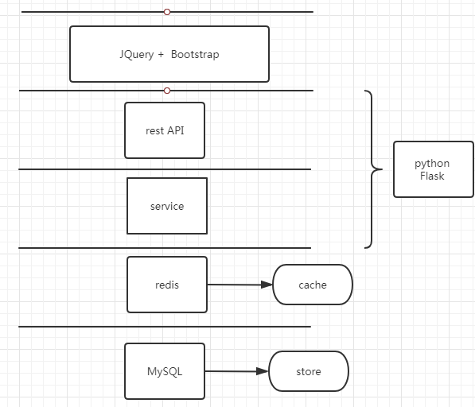
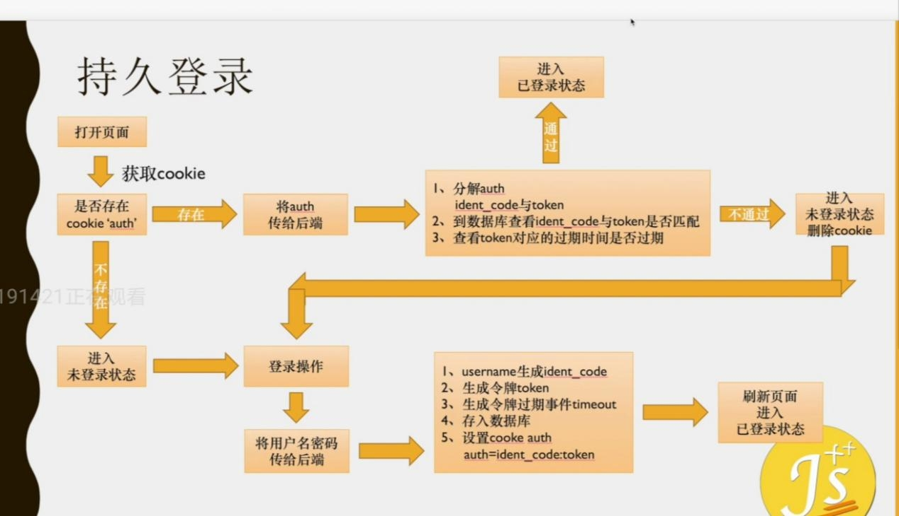

# Edemao 博客

项目前端用的是JQuery + Bootstrap， 后端用的是nginx + Flask + Redis + MySql, 是前后端分离的，主要模块有登录注册、文章发布/浏览/点赞/搜索/评论、后台管理等。

至于项目的架构，底层mysql是存储，redis是缓存，service层处理业务逻辑，rest api层为前端提供接口。前端使用JQuery加上Bootstrap 。Nginx做静态资源服务器和服务器代理。

## 持久登录

