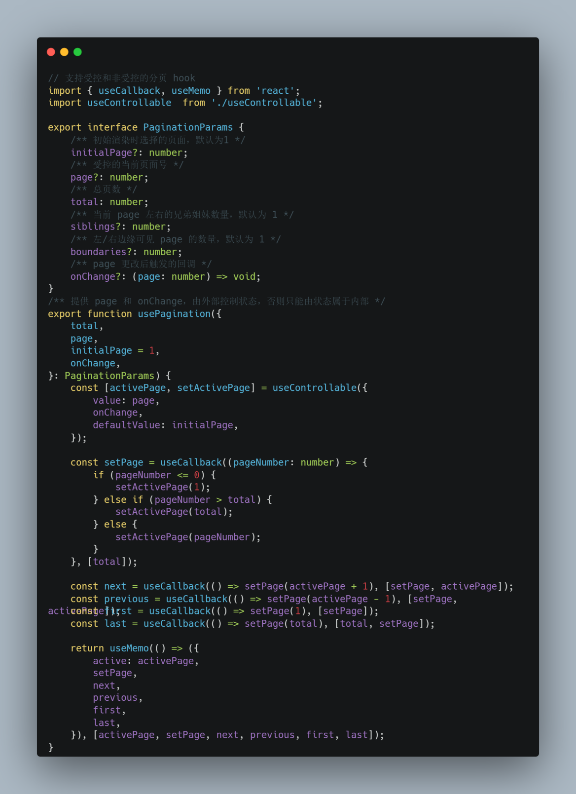
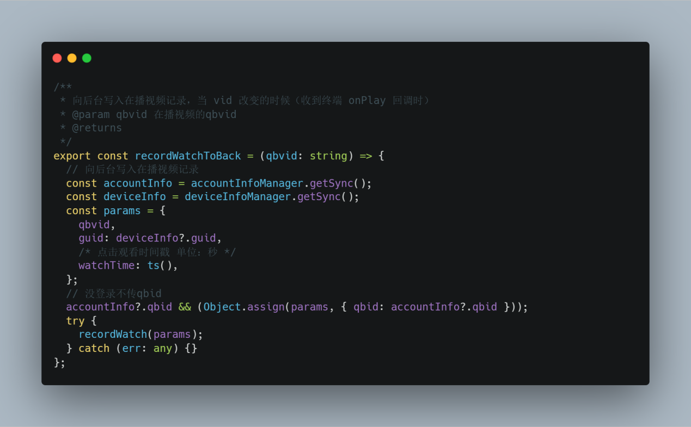

# 我的看单

## 问题 1

历史记录从端上获取，由于不支持分页，采用模拟分页的方式，usePagination去消费所有从端上取到的历史记录。再根据这些分页好的数据去与后台进行交互，保证一次请求后台的数据量不会太多。

## 问题 2

收藏记录直接从后台获取，但每一条记录中的观看进度依赖播放页的播放记录的上报，原本是这个播放记录是后台消费端上的上报流水，链路过长具有一定的延迟，导致用户刚观看马上切到看单，不会立即更新观看记录，每一条历史记录也会存在这个问题针对这个问题，进行了改造，由前端直接将当前播放的的视频同步到后台，当 vid 改变的时候（收到终端 onPlay 回调时）。快速滑动可能存在性能问题。

