# 播放页

## 问题1

首次进房获取到视频信息之前发生了曝光行为，通过全局事件监听的方式等待数据回来再进行上报。

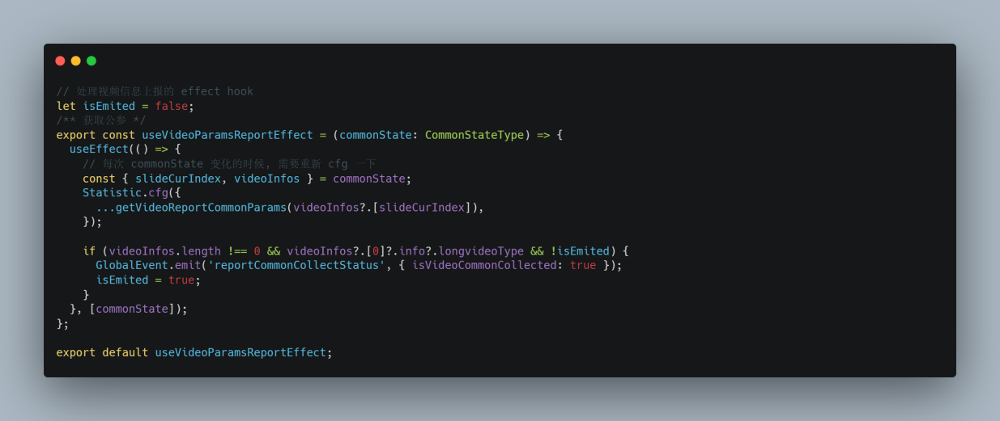

## 问题2

遇到用户进入电梯网络断开，电梯出来网络恢复，访问不到新推荐数据，监听到网络恢复，分两种情况，如视频列表为空则直接请求入口视频，否则如果超过当前视频列表指定的边界请求条件，则多请求一次推荐视频数据。

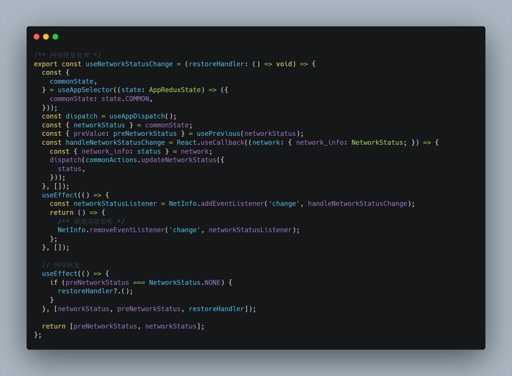

## 问题3 

延迟加载loading，用户网络较好的情况下，最好不展示loading，只有在设定的超时时间后还没拉到视频数据，才展示loading。

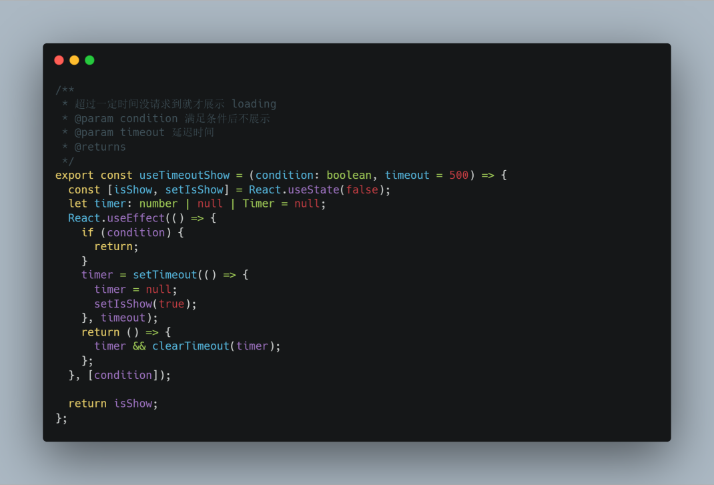

## 问题4

支持请求失败默认进行重试

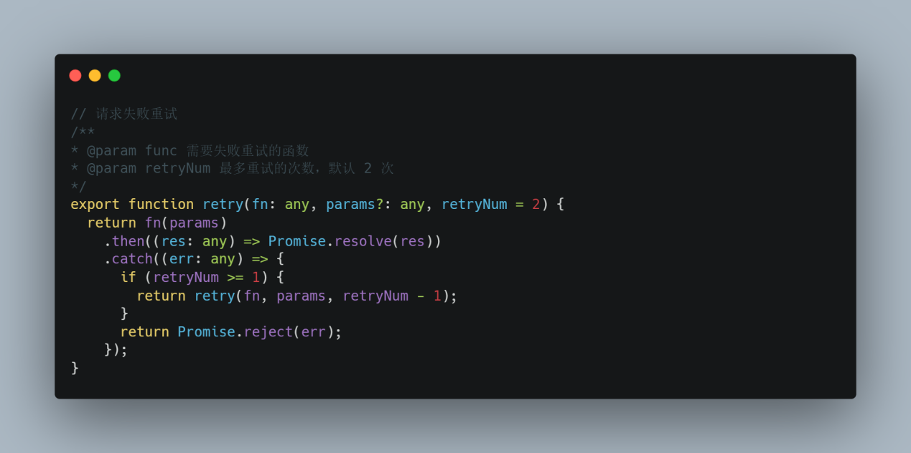

## 问题5

选集缓存及失效策略，每个item有一个选集按钮，在视频进行预加载的随后，向后端请求该预加载视频的选集部分数据，并缓存在redux中，同时在滑动超过滑动窗口（上中下）时，对redux中存储的选集缓存进行清除。

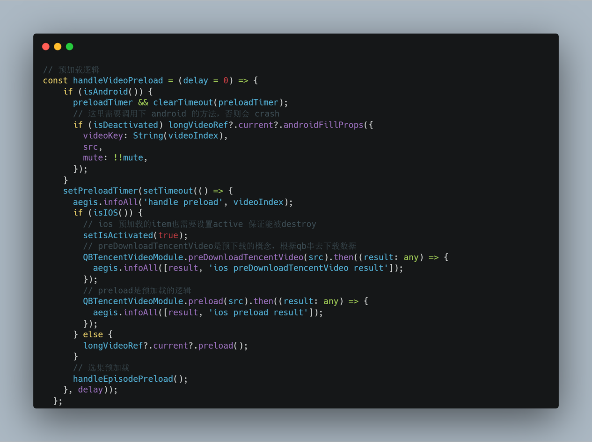

## 问题6

视频预加载，分为三个情况，首先时外部入口，对用户可能点击的场景进行预加载，其次通过qb串（url）上的视频信息会去请求视频详情和推荐视频列表，对于用户首次进房，这里将qb串携带的原始信息直接给到播放器先播放着，可省下因为等待视频详情信息返回的时间加快播放视频。最后，主要逻辑是上一个视频暂停隐藏，下一个视频预加载（包括选集预加载），超过这个滑动窗口的视频进行销毁，销毁事件延迟进行，防止和切房动画，play事件抢占资源。滑动分为上一个，当前，下一个视频，当进行滑动时，更新index标志，并在当前视频对滑动列表的下一个视频通知终端进行预加载，双端在这里存在差异，安卓和ios对预加载的处理是不一致的，原因在于viewListPager底层实现不同，安卓是拥有多个实例没做优化的版本，ios是只存在一个播放器，做了优化的版本，只有下一个item曝光一点点的时候才会实例下一个item，导致ios在当前item对下一item进行预加载方法调用时候，ios无法获取到reactTag, 故需要将视频源数据src在预加载方法中传给ios进行提前预加载视频后再将其attach到下个item，因此ios 预加载的item也需要设置active 保证能在滑动回上一个视频后能被destroy。此外安卓预加载会有延迟，滑动太快会导致先play后preload，导致视频异常，需要在play的时候清除预加载的定时器。

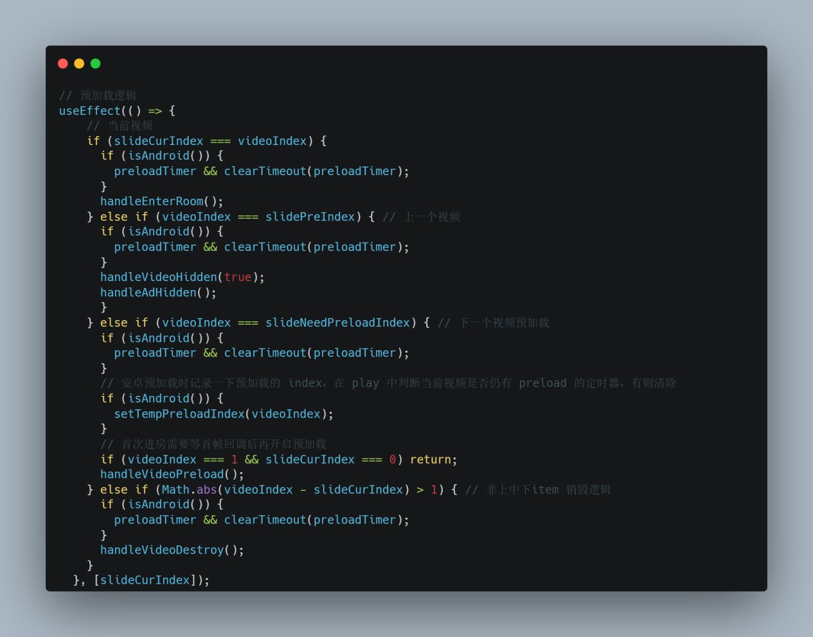

## 问题7

获取视频账号信息，对腾讯视频账号信息使用TXVideoAccountInfoManager进行管理，方便调用。由于大部分视频请求特别是推荐，要求携带是否腾讯视频vip，有可能出现用户在使用过程中vip状态的变化（主动登录比如收藏，突然vip过期），不能给非vip用户推荐vip视频，因此考虑对其定时刷新和强制刷新。

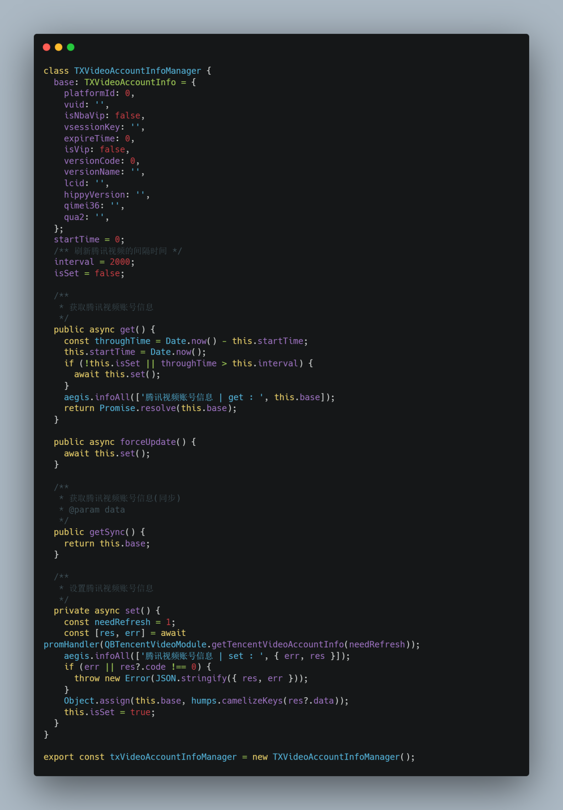

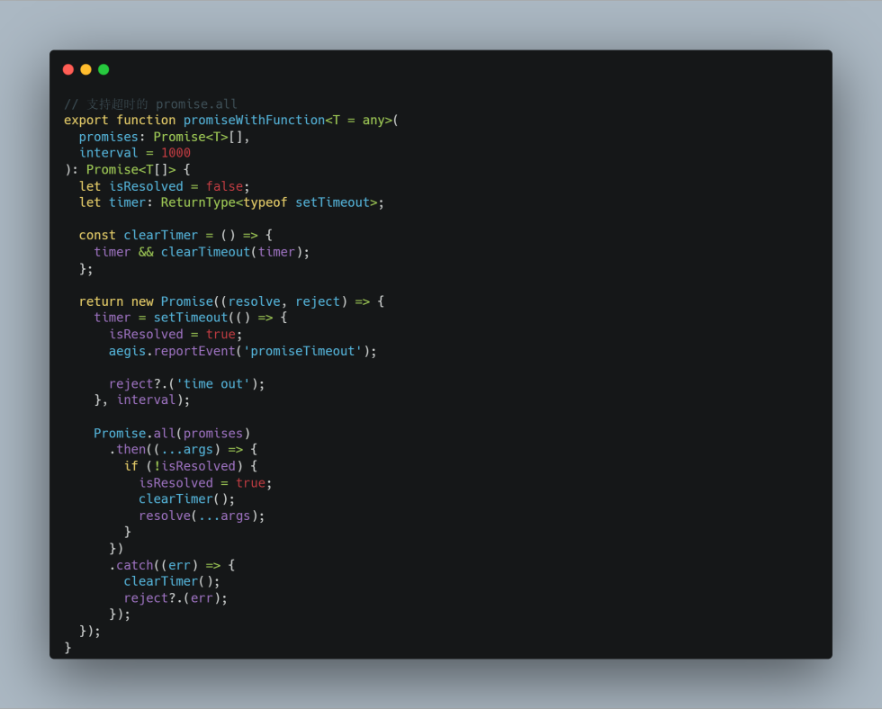

## 问题8

静音功能，使用自定义hook，结合useCallback和useMemo 存储常用的状态切换功能，避免多次渲染创建。

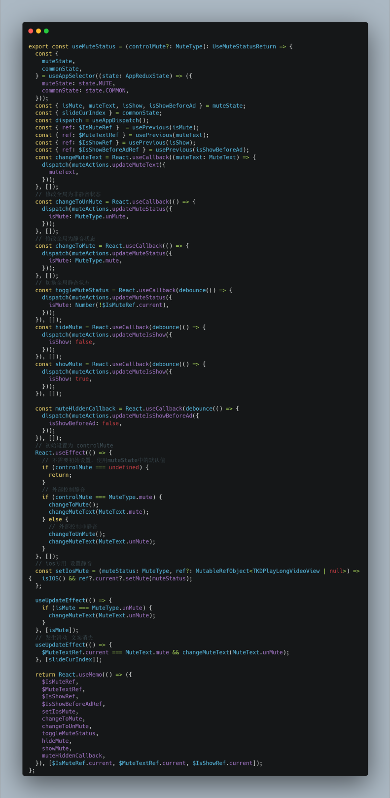

## 问题9

放映厅曝光埋点容器组件，对被包装的子组件提供曝光上报的能力，容器组件中订阅曝光处理事件，当滚动停止或从deactive变为active时 emit 发布曝光事件，对未曝光过的元素检测是否出现在视口并进行曝光。

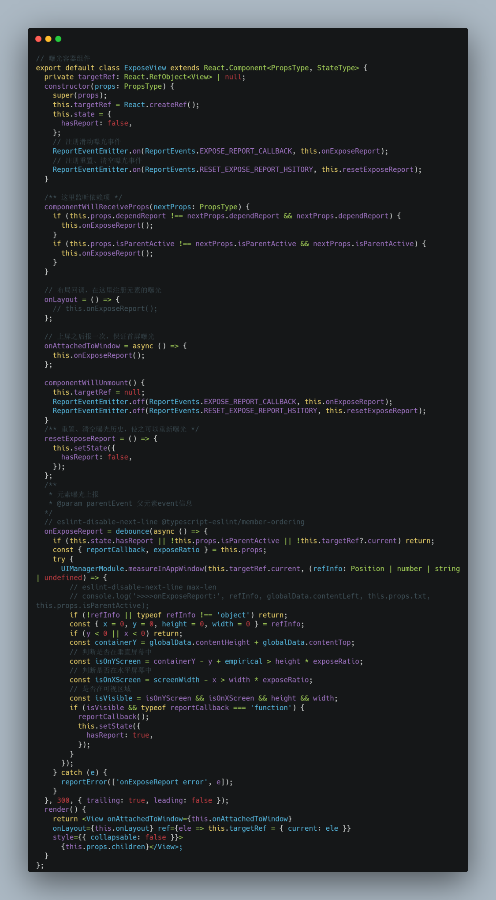

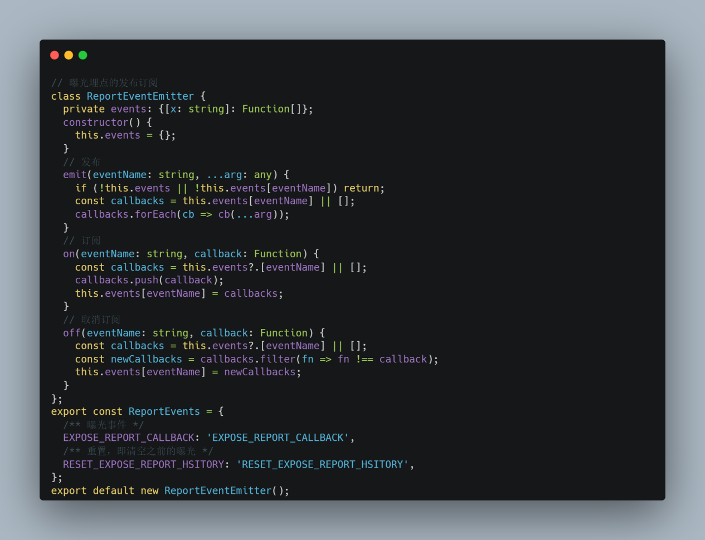

