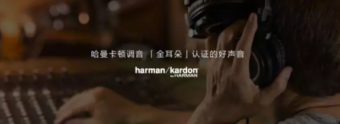
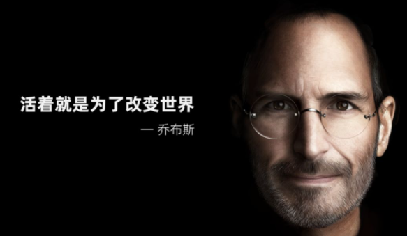
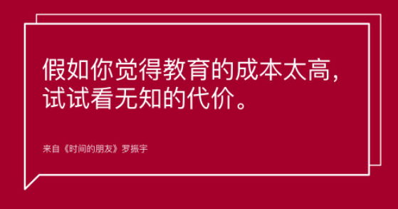
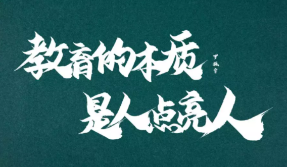

# PPT

## 金句页

金句页，即一句话ppt，由于文字很少，如果直接放在白底的背景上，就会显得非常空洞。

方法1：高桥流——**文字放大，重点突出，更改背景的颜色。**

方法2：背景图片——**添加一张与文字内容相关的图片，将它铺满整个屏幕。**

方法3：人物素材——**某作者的个人观点，那么可以加上这位作者的头像（去除背景）**。

方法4：色块和线条修饰——**色块或者线条来修饰。**

方法5：更换成书法字体——**文案很少，用书法字体可以排版的很有视觉冲击力。**

